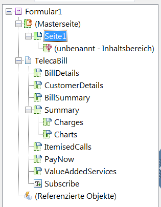

# Tutorial: Erstellen Sie Vorlagen{#tutorial-create-templates}

Dieses Tutorial ist ein Schritt in der Reihe [Erstellen Sie Ihre erste interaktive Kommunikation](/help/forms/using/create-your-first-interactive-communication.md). Es wird empfohlen, der Reihe chronologisch zu folgen, um den gesamten Anwendungsfall des Tutorials zu verstehen, auszuführen und praktisch zu erleben.

Für eine interaktive Kommunikation müssen auf dem AEM-Server Vorlagen für Druck- und Web-Kanäle verfügbar sein.

Die Vorlagen für den Druckkanal werden in Adobe Forms Designer erstellt und auf den AEM-Server hochgeladen. Diese Vorlagen stehen dann zur Verfügung, wenn Sie eine interaktive Kommunikation erstellen.

Die Vorlagen für den Web-Kanal werden in AEM erstellt. Autorinnen und Autoren sowie Administratorinnen und Administratoren von Vorlagen können Web-Vorlagen erstellen, bearbeiten und aktivieren. Nach ihrer Erstellung und Aktivierung stehen diese Vorlagen zur Verfügung, wenn Sie eine interaktive Kommunikation erstellen.

Dieses Tutorial führt Sie durch die Schritte zum Erstellen von Vorlagen für Druck- und Web-Kanäle, sodass sie beim Erstellen einer interaktiven Kommunikation verfügbar sind. Am Ende dieses Tutorials können Sie Folgendes:

* Erstellen von XDP-Vorlagen für den Druckkanal mit Adobe Forms Designer
* Hochladen der XDP-Vorlagen auf den AEM Forms-Server
* Erstellen und Aktivieren von Vorlagen für den Web-Kanal

## Erstellen einer Vorlage für den Druckkanal {#create-template-for-print-channel}

Erstellen und verwalten Sie eine Vorlage für den Druckkanal zur interaktiven Kommunikation mit folgenden Aufgaben:

* [Erstellen einer XDP-Vorlage mit Forms Designer](../../forms/using/create-templates-print-web.md#create-xdp-template-using-forms-designer)
* [Hochladen einer XDP-Vorlage auf den AEM Forms-Server](../../forms/using/create-templates-print-web.md#upload-xdp-template-to-the-aem-forms-server)
* [Erstellen einer XDP-Vorlage für Layout-Fragmente](../../forms/using/create-templates-print-web.md#create-xdp-template-for-layout-fragments)

### Erstellen einer XDP-Vorlage mit Forms Designer {#create-xdp-template-using-forms-designer}

Basierend auf dem [Anwendungsfall](/help/forms/using/create-your-first-interactive-communication.md) und der [Anatomie](/help/forms/using/planning-interactive-communications.md), erstellen Sie die folgenden Teilformulare in der XDP-Vorlage:

* Rechnungsdetails: Enthält ein Dokumentfragment
* Kundendetails: Enthält ein Dokumentfragment
* Rechnungsübersicht: Enthält ein Dokumentfragment
* Übersicht: Enthält ein Dokumentfragment (Teilformular „Gebühren“) und ein Diagramm (Teilformular „Diagramme“).
* Einzeln aufgeführte Anrufe: Enthält eine Tabelle (Layoutfragment)
* Jetzt bezahlen: Enthält ein Bild
* Mehrwert-Services: Enthält ein Bild

Diese Teilformulare werden nach dem Hochladen der XDP-Datei auf den AEM Forms-Server als Zielbereiche in der Druckvorlage angezeigt. Alle Entitäten wie Dokumentfragmente, Diagramme, Layout-Fragmente und Bilder werden bei der Erstellung der interaktiven Kommunikation Zielbereichen hinzugefügt.

Gehen Sie wie folgt vor, um eine XDP-Vorlage für den Druckkanal zu erstellen:

1. Öffnen Sie Forms Designer, wählen Sie **Datei** > **Neu** > **Leeres Formular verwenden** und **Weiter** und danach **Beenden** aus, um das Formular für die Vorlagenerstellung zu öffnen.

   Stellen Sie sicher, dass die **Objektbibliothek** und die Option **Objekt** im Menü **Fenster** ausgewählt werden.

1. Ziehen Sie die Komponente **Teilformular** aus der **Objektbibliothek** in das Formular.
1. Wählen Sie das Teilformular aus, um die Optionen für das Teilformular im Fenster **Objekt** im rechten Bereich anzuzeigen.
1. Wählen Sie die Registerkarte **Teilformular** und wählen Sie **Textfluss** aus der Dropdown-Liste **Inhalt** aus. Um die Länge anzupassen, ziehen Sie am linken Endpunkt des Teilformulars.
1. Führen Sie auf der Registerkarte **Bindungen** folgende Schritte aus:

   1. Geben Sie **BillDetails** in das Feld **Name** ein.

   1. Wählen Sie **Keine Datenbindung** aus der Dropdown-Liste **Datenbindung**.

   

1. Wählen Sie das Teilformular „Stamm“, dann die Registerkarte **Teilformular** und dann **Textfluss** aus der Dropdown-Liste **Inhalt** aus. Führen Sie auf der Registerkarte **Bindungen** folgende Schritte aus:

   1. Geben Sie **TelecaBill** in das Feld **Name** ein.

   1. Wählen Sie **Keine Datenbindung** aus der Dropdown-Liste **Datenbindung**.

   

1. Wiederholen Sie die Schritte 2 bis 5, um die folgenden Teilformulare zu erstellen:

   * Rechnungsdetails
   * Kundendetails
   * Rechnungsübersicht
   * Zusammenfassung – Wählen Sie die Registerkarte **Teilformular** und wählen Sie für dieses Teilformular **Positioniert** aus der Dropdown-Liste **Inhalt**. Fügen Sie die folgenden Teilformulare in das Teilformular **Zusammenfassung** ein.

      * Gebühren
      * Diagramme

   * Einzelverbindungen
   * JetztBezahlen
   * MehrwertServices

   Um Zeit zu sparen, können Sie auch vorhandene Teilformulare kopieren und einfügen, um zusätzliche Teilformulare zu erstellen.

   Um das Teilformular **Diagramme** rechts neben das Teilformular „Gebühren“ zu verschieben, wählen Sie im linken Bereich das Teilformular **Diagramme** aus, klicken Sie auf die Registerkarte **Layout** und geben Sie einen Wert für das Feld **AnkerX** an. Der Wert muss größer als der Wert für das Feld **Breite** für das Teilformular **Gebühren** sein. Wählen Sie das Teilformular **Gebühren** und dann die Registerkarte **Layout** aus, um den Wert des Felds **Breite** anzuzeigen.

1. Ziehen Sie das Objekt **Text** aus der **Objektbibliothek** in das Formular, und geben Sie den Text **XXXX zum Abonnieren wählen** in das Feld ein.
1. Klicken Sie mit der rechten Maustaste auf das Textobjekt im linken Bereich, wählen Sie **Objekt umbenennen**, und geben Sie den Namen des Textobjekts als **Abonnieren** ein.

   

1. Wählen Sie **Datei** > **Speichern unter**, um die Datei im lokalen Dateisystem zu speichern:

   1. Navigieren Sie zum Speicherort der Datei und geben Sie den Namen **erste_ik_druckvorlage_erstellen** ein.
   1. Wählen Sie aus der Dropdown-Liste **Dateityp** die Option **.xdp** aus.

   1. Wählen Sie **Speichern** aus.

### Hochladen einer XDP-Vorlage auf den AEM Forms-Server {#upload-xdp-template-to-the-aem-forms-server}

Nachdem Sie eine XDP-Vorlage mit Forms Designer erstellt haben, müssen Sie sie auf den AEM Forms-Server hochladen, damit die Vorlage beim Erstellen der interaktiven Kommunikation verwendet werden kann.

1. Wählen Sie **[!UICONTROL Formulare]** > **[!UICONTROL Formulare und Dokumente]**.
1. Wählen Sie **Erstellen** > **Datei hochladen** aus.

   Navigieren Sie zur Vorlage **create_first_ic_print_template** (XDP) und wählen Sie sie aus. Wählen Sie dann **Öffnen** aus, um die XDP-Vorlage auf den AEM-Formular-Server zu importieren.

### Erstellen einer XDP-Vorlage für Layout-Fragmente {#create-xdp-template-for-layout-fragments}

Um ein Layout-Fragment für den Druckkanal der interaktiven Kommunikation zu erstellen, entwerfen Sie eine XDP-Vorlage mit Forms Designer und laden Sie sie auf den AEM Forms-Server hoch.

1. Öffnen Sie Forms Designer, wählen Sie **Datei** > **Neu** > **Leeres Formular verwenden**, und wählen Sie **Weiter** und anschließend **Beenden** aus, um das Formular für die Vorlagenerstellung zu öffnen.

   Stellen Sie sicher, dass die **Objektbibliothek** und die Option **Objekt** im Menü **Fenster** ausgewählt werden.

1. Ziehen Sie die Komponente **Tabelle** per Drag-and-Drop aus der **Objektbibliothek** auf das Formular.
1. Im Dialogfeld „Tabelle einfügen“:

   1. Geben Sie für die Anzahl der Spalten den Wert **5** an.
   1. Geben Sie für die Anzahl der Textzeilen den Wert **1** an.
   1. Aktivieren Sie das Kontrollkästchen **Kopfzeile in Tabelle einschließen**.
   1. Klicken Sie auf **OK**.

1. Wählen Sie **+** im linken Bereich neben **Tabelle** 1 aus, klicken Sie mit der rechten Maustaste auf **Zelle1** und wählen Sie unter **Objekt umbenennen** **Datum** aus.

   Benennen Sie **Zelle2**, **Zelle3**, **Zelle4** und **Zelle5** in **Zeit**, **Anzahl**, **Dauer** und **Kosten** um.

1. Klicken Sie in der **Designer-Ansicht** auf die Textfelder „Kopfzeile“ und benennen Sie sie in **Zeit**, **Anzahl**, **Dauer** und **Kosten** um.

   

1. Wählen Sie **Zeile 1** aus dem linken Bereich und wählen Sie **Objekt** > **Bindung** > **Zeile für jedes Datenelement wiederholen**.

   

1. Ziehen Sie die Komponente **Textfeld** per Drag-and-Drop aus der **Objektbibliothek** in die **Designer-Ansicht**.

   

   Ziehen Sie die Komponente **Textfeld** in die Zeilen **Zeit**, **Anzahl**, **Dauer** und **Kosten**.

1. Wählen Sie **Datei** > **Speichern unter**, um die Datei im lokalen Dateisystem zu speichern:

   1. Navigieren Sie zum Speicherort der Datei und geben Sie den Namen **tabelle_lf** ein.
   1. Wählen Sie aus der Dropdown-Liste **Dateityp** die Option **.xdp** aus.

   1. Wählen Sie **Speichern** aus.

   Nachdem Sie eine XDP-Vorlage mit Forms Designer erstellt haben, müssen Sie sie auf den AEM Forms-Server [hochladen](../../forms/using/create-templates-print-web.md#upload-xdp-template-to-the-aem-forms-server), damit die Vorlage beim Erstellen der Layout-Fragmente verwendet werden kann.

## Erstellen einer Vorlage für einen Web-Kanal {#create-template-for-web-channel}

Erstellen und verwalten Sie eine Vorlage für den Web-Kanal zur interaktiven Kommunikation mit folgenden Aufgaben:

* [Ordner für Vorlagen erstellen](../../forms/using/create-templates-print-web.md#create-folder-for-templates)
* [Vorlage erstellen](../../forms/using/create-templates-print-web.md#create-the-template)
* [Vorlage aktivieren](../../forms/using/create-templates-print-web.md#enable-the-template)
* [Aktivieren von Schaltflächen in interaktiven Kommunikationen](../../forms/using/create-templates-print-web.md#enabling-buttons-in-interactive-communications)

### Erstellen eines Ordners für Vorlagen {#create-folder-for-templates}

Um eine Web-Kanal-Vorlage zu erstellen, definieren Sie einen Ordner zum Speichern der erstellten Vorlagen. Sobald Sie eine Vorlage in einem Ordner erstellt haben, müssen Sie die Vorlage aktivieren, damit die Formularbenutzenden den Web-Kanal zur interaktiven Kommunikation basierend auf der Vorlage erstellen können.

Gehen Sie wie folgt vor, um einen Ordner für die bearbeitbaren Vorlagen zu erstellen:

1. Wählen Sie **Tools**  > **Konfigurations-Browser** aus.
   * Weitere Informationen finden Sie in der Dokumentation zum [Konfigurations-Browser](/help/sites-administering/configurations.md).
1. Wählen Sie auf der Seite „Konfigurations-Browser“ **Erstellen** aus.
1. Legen Sie im Dialogfeld **Konfiguration erstellen** **Create_First_IC_templates** als den Titel für den Ordner fest, aktivieren Sie **Bearbeitbare Vorlagen** und wählen Sie **Erstellen** aus.

   

   Der Ordner **Create_First_IC_templates** wird auf der Seite **Konfigurations-Browser** erstellt und aufgeführt.

### Vorlage erstellen {#create-the-template}

Basierend auf dem [Anwendungsfall](/help/forms/using/create-your-first-interactive-communication.md) und der [Anatomie](/help/forms/using/planning-interactive-communications.md), erstellen Sie die folgenden Bereiche in der Webvorlage:

* Rechnungsdetails: Enthält ein Dokumentfragment
* Kundendetails: Enthält ein Dokumentfragment
* Rechnungsübersicht: Enthält ein Dokumentfragment
* Gebührenübersicht: Enthält ein Dokumentfragment und ein Diagramm (zweispaltiges Layout)
* Einzelverbindungen: Enthält eine Tabelle
* Jetzt bezahlen: Enthält die Schaltfläche **Jetzt bezahlen** und ein Bild
* Mehrwert-Services: Enthält ein Bild und die Schaltfläche **Abonnieren**.

Beim Erstellen der interaktiven Kommunikation werden alle Enitäten wie Dokumentfragmente, Diagramme, Tabellen, Bilder und Schaltflächen hinzugefügt.

Gehen Sie wie folgt vor, um eine Vorlage für den Web-Kanal im Ordner **Create_First_IC_templates** zu erstellen:

1. Navigieren Sie zum entsprechenden Vorlagenordner durch Auswahl von **Tools** > **Vorlagen** > **Create_First_IC_templates**.
1. Wählen Sie **Erstellen** aus.
1. Wählen Sie im Konfigurationsassistenten **Vorlagentyp wählen** den Typ **Interaktive Kommunikation – Web-Kanal** und dann **Weiter** aus.
1. Geben Sie im Konfigurationsassistenten **Vorlagendetails** als Vorlagentitel **Create_First_IC_Web_Template** ein. Geben Sie eine optionale Beschreibung ein und wählen Sie **Erstellen** aus.

   Eine Bestätigungsmeldung, dass **Create_First_IC_Web_Template** angezeigt wird.

1. Wählen Sie **Öffnen** aus, um die Vorlage im Vorlageneditor zu öffnen.
1. Wählen Sie aus der Dropdown-Liste neben der Option **Vorschau** den Eintrag **Anfänglicher Inhalt** aus.

   

1. Wählen Sie **Stammbereich** und dann **+** aus, um die Liste der Komponenten anzuzeigen, die Sie der Vorlage hinzufügen können.
1. Um ein Bedienfeld über dem **Stamm-Bedienfeld** hinzuzufügen, wählen Sie in der Liste die Option **Bedienfeld** aus.
1. Wählen Sie im linken Bereich die Registerkarte **Inhalt** aus. Das neue Bedienfeld, das in Schritt 8 hinzugefügt wurde, wird in der Inhaltsstruktur unter **Stamm-Bedienfeld** angezeigt.

   

1. Wählen Sie den Bereich und dann  (Konfigurieren) aus.
1. Gehen Sie im Bedienfeld „Eigenschaften“ wie folgt vor:

   1. Geben Sie in das Feld „Name“ **rechnungsdetails** ein.
   1. Geben Sie in das Feld „Titel“ **Rechnungsdetails** ein.
   1. Wählen Sie in der Dropdown-Liste **Anzahl der Spalten** den Wert **1** aus.

   1. Wählen Sie zum Speichern der Eigenschaften  aus.

   Der Name des Bedienfelds wird in der Inhaltsstruktur zu **Rechnungsdetails** geändert.

1. Wiederholen Sie die Schritte 7 bis 11, um der Vorlage Bedienfelder mit den folgenden Eigenschaften hinzuzufügen:

   | Name | Titel | Anzahl der Spalten |
   |---|---|---|
   | kundendetails | Kundendetails | 1 |
   | rechnungsübersicht | Rechnungsübersicht | 1 |
   | übersichtgebühren | Zusammenfassung der Gebühren | 2 |
   | einzelverbindungen | Einzelverbindungen | 1 |
   | jetztbezahlen | Jetzt bezahlen | 2 |
   | vas | Mehrwert-Services | 1 |

   Die folgende Abbildung zeigt die Inhaltsstruktur, nachdem alle Bedienfelder zur Vorlage hinzugefügt wurden:

   

### Aktivieren der Vorlage {#enable-the-template}

Nachdem Sie die Web-Vorlage erstellt haben, müssen Sie sie aktivieren, um mit der Vorlage eine interaktive Kommunikation zu erstellen.

Gehen Sie wie folgt vor, um die Web-Vorlage zu aktivieren:

1. Wählen Sie **Tools**  > **Vorlagen** aus.
1. Navigieren Sie zur Vorlage **Create_First_IC_Web_Template**, wählen Sie sie aus und wählen Sie dann **Aktivieren** aus.
1. Wählen Sie zum Bestätigen erneut **Aktivieren** aus.

   Die Vorlage ist aktiviert und ihr Status wird als „Aktiviert“ angezeigt. Sie können diese Vorlage beim Erstellen von interaktiver Kommunikation für den Web-Kanal verwenden.

### Aktivieren von Schaltflächen in interaktiven Kommunikationen {#enabling-buttons-in-interactive-communications}

Je nach Anwendungsfall müssen Sie die Schaltflächen **Jetzt bezahlen** und **Abonnieren** (adaptive Formularkomponenten) in der interaktiven Kommunikation einbeziehen. Gehen Sie wie folgt vor, um die Verwendung dieser Schaltflächen für die interaktive Kommunikation zu aktivieren:

1. Wählen Sie **Struktur** aus der Dropdown-Liste neben der Option **Vorschau**.
1. Wählen Sie den Stammbereich **Dokumenten-Container** mithilfe der Inhaltsstruktur aus und wählen Sie dann **Richtlinie** aus, um die Komponenten auszuwählen, die für die Verwendung in der interaktiven Kommunikation erlaubt sind.

   

1. Wählen Sie auf der Registerkarte **Zugelassene Komponenten** des Abschnitts **Eigenschaften** unter **Adaptives Formular** die Option **Schaltfläche** aus.

   

1. Wählen Sie zum Speichern der Eigenschaften  aus.
