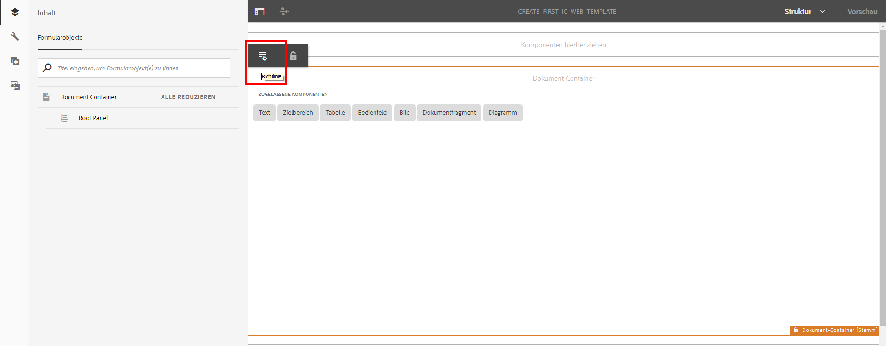

# Tutorial: Erstellen Sie Vorlagen{#tutorial-create-templates}

Dieses Tutorial ist ein Schritt in der Reihe [Erstellen Sie Ihre erste interaktive Kommunikation](/help/forms/using/create-your-first-interactive-communication.md). Es wird empfohlen, die Reihe in chronologischer Reihenfolge zu befolgen, um den vollständigen Anwendungsfall des Tutorials zu verstehen, auszuführen und zu demonstrieren.

Um eine interaktive Kommunikation zu erstellen, müssen auf dem AEM-Server Vorlagen für Druck- und Webkanäle verfügbar sein.

Die Vorlagen für den Druckkanal werden in Adobe Forms Designer erstellt und auf den AEM hochgeladen. Diese Vorlagen können dann beim Erstellen einer interaktiven Kommunikation verwendet werden.

Die Vorlagen für den Webkanal werden in AEM erstellt. Vorlagenautoren und -administratoren können Webvorlagen erstellen, bearbeiten und aktivieren. Nach der Erstellung und Aktivierung sind diese Vorlagen zur Verwendung beim Erstellen einer interaktiven Kommunikation verfügbar.

Dieses Tutorial führt Sie durch die Schritte zum Erstellen von Vorlagen für Druck- und Webkanäle, damit diese zur Erstellung interaktiver Kommunikation zur Verfügung stehen. Am Ende dieses Tutorials können Sie Folgendes:

* Erstellen von XDP-Vorlagen für den Druckkanal mit Adobe Forms Designer
* Hochladen der XDP-Vorlagen auf den AEM Forms-Server
* Erstellen und Aktivieren von Vorlagen für den Webkanal

## Vorlage für Druckkanal erstellen {#create-template-for-print-channel}

Erstellen und verwalten Sie eine Vorlage für den Druckkanal der interaktiven Kommunikation mit folgenden Aufgaben:

* [Erstellen einer XDP-Vorlage mit Forms Designer](../../forms/using/create-templates-print-web.md#create-xdp-template-using-forms-designer)
* [Hochladen einer XDP-Vorlage auf den AEM Forms-Server](../../forms/using/create-templates-print-web.md#upload-xdp-template-to-the-aem-forms-server)
* [Erstellen einer XDP-Vorlage für Layout-Fragmente](../../forms/using/create-templates-print-web.md#create-xdp-template-for-layout-fragments)

### Erstellen einer XDP-Vorlage mit Forms Designer {#create-xdp-template-using-forms-designer}

Basierend auf dem [Anwendungsfall](/help/forms/using/create-your-first-interactive-communication.md) und der [Anatomie](/help/forms/using/planning-interactive-communications.md), erstellen Sie die folgenden Teilformulare in der XDP-Vorlage:

* Rechnungsdetails: Enthält ein Dokumentfragment
* Kundendetails: Enthält ein Dokumentfragment
* Rechnungszusammenfassung: Enthält ein Dokumentfragment
* Zusammenfassung: Enthält ein Dokumentfragment (Teilformular &quot;Gebühren&quot;) und ein Diagramm (Teilformular &quot;Diagramme&quot;)
* Einzeln aufgeführte Anrufe: Enthält eine Tabelle (Layoutfragment)
* Jetzt bezahlen: Enthält ein Bild
* Mehrwert-Services: Enthält ein Bild

Diese Teilformulare werden nach dem Hochladen der XDP-Datei auf den Forms-Server als Zielbereiche in der Druckvorlage angezeigt. Alle Entitäten wie Dokumentfragmente, Diagramme, Layout-Fragmente und Bilder werden beim Erstellen der interaktiven Kommunikation den Zielbereichen hinzugefügt.

Gehen Sie wie folgt vor, um eine XDP-Vorlage für den Druckkanal zu erstellen:

1. Öffnen Sie den Forms Designer und wählen Sie **Datei** > **Neu** > **Leeres Formular verwenden,** select **Nächste** und wählen Sie **Beenden** , um das Formular zur Vorlagenerstellung zu öffnen.

   Stellen Sie sicher, dass die **Objektbibliothek** und die Option **Objekt** im Menü **Fenster** ausgewählt werden.

1. Ziehen Sie die Komponente **Teilformular** aus der **Objektbibliothek** in das Formular.
1. Wählen Sie das Teilformular aus, damit Sie die Optionen für das Teilformular im **Objekt** im rechten Bereich.
1. Wählen Sie die Registerkarte **Teilformular** und wählen Sie **Textfluss** aus der Dropdown-Liste **Inhalt** aus. Um die Länge anzupassen, ziehen Sie den linken Endpunkt des Teilformulars.
1. Führen Sie auf der Registerkarte **Bindungen** folgende Schritte aus:

   1. Geben Sie **BillDetails** in das Feld **Name** ein.

   1. Wählen Sie **Keine Datenbindung** aus der Dropdown-Liste **Datenbindung**.

   

1. Wählen Sie das Teilformular „Stamm“, dann die Registerkarte **Teilformular** und dann **Textfluss** aus der Dropdown-Liste **Inhalt** aus. Führen Sie auf der Registerkarte **Bindungen** folgende Schritte aus:

   1. Geben Sie **TelecaBill** in das Feld **Name** ein.

   1. Wählen Sie **Keine Datenbindung** aus der Dropdown-Liste **Datenbindung**.

   

1. Wiederholen Sie die Schritte 2 bis 5, um die folgenden Teilformulare zu erstellen:

   * BillDetails
   * CustomerDetails
   * BillSummary
   * Zusammenfassung – Wählen Sie die Registerkarte **Teilformular** und wählen Sie für dieses Teilformular **Positioniert** aus der Dropdown-Liste **Inhalt**. Fügen Sie die folgenden Teilformulare in das Teilformular **Zusammenfassung** ein.

      * Gebühren
      * Diagramme

   * itemsCalls
   * PayNow
   * ValueAddedServices

   Um Zeit zu sparen, können Sie auch vorhandene Teilformulare kopieren und einfügen, um zusätzliche Teilformulare zu erstellen.

   So verschieben Sie die **Diagramme** Teilformular rechts neben dem Teilformular &quot;Gebühren&quot;wählen Sie die **Diagramme** Teilformular aus dem linken Bereich, wählen Sie die **Layout** und geben Sie einen Wert für die **AnchorX** -Feld. Der Wert muss größer als der Wert für das Feld **Breite** für das Teilformular **Gebühren** sein. Wählen Sie die **Gebühren** Teilformular und wählen Sie die **Layout** -Registerkarte, damit Sie den Wert der **Breite** -Feld.

1. Ziehen Sie das Objekt **Text** aus der **Objektbibliothek** in das Formular, und geben Sie den Text **XXXX zum Abonnieren wählen** in das Feld ein.
1. Klicken Sie mit der rechten Maustaste auf das Textobjekt im linken Bereich, wählen Sie **Objekt umbenennen**, und geben Sie den Namen des Textobjekts als **Abonnieren** ein.

   

1. Wählen Sie **Datei** > **Speichern unter**, um die Datei im lokalen Dateisystem zu speichern:

   1. Navigieren Sie zu dem Speicherort, an dem Sie die Datei speichern können, und geben Sie den Namen als **create_first_ic_print_template**.
   1. Auswählen **.xdp** aus dem **Dateityp** Dropdown-Liste.

   1. Wählen Sie **Speichern** aus.

### Hochladen einer XDP-Vorlage auf den AEM Forms-Server {#upload-xdp-template-to-the-aem-forms-server}

Nachdem Sie eine XDP-Vorlage mit Forms Designer erstellt haben, müssen Sie sie auf den AEM Forms-Server hochladen, damit die Vorlage beim Erstellen der interaktiven Kommunikation verwendet werden kann.

1. Wählen Sie **[!UICONTROL Formulare]** > **[!UICONTROL Formulare &amp; Dokumente]**.
1. Auswählen **Erstellen** > **Datei-Upload**.

   Navigieren Sie zu und wählen Sie die **create_first_ic_print_template** Vorlage (XDP) und wählen Sie **Öffnen** , um die XDP-Vorlage in den AEM Forms-Server zu importieren.

### Erstellen einer XDP-Vorlage für Layout-Fragmente {#create-xdp-template-for-layout-fragments}

Um ein Layout-Fragment für den Druckkanal der interaktiven Kommunikation zu erstellen, erstellen Sie eine XDP mit Forms Designer und laden Sie sie auf den AEM Forms-Server hoch.

1. Öffnen Sie den Forms Designer und wählen Sie **Datei** > **Neu** > **Leeres Formular verwenden,** select **Nächste** und wählen Sie **Beenden** , um das Formular zur Vorlagenerstellung zu öffnen.

   Stellen Sie sicher, dass die **Objektbibliothek** und die Option **Objekt** im Menü **Fenster** ausgewählt werden.

1. Ziehen Sie die Komponente **Tabelle** per Drag-and-Drop aus der **Objektbibliothek** auf das Formular.
1. Im Dialogfeld „Tabelle einfügen“:

   1. Geben Sie die Anzahl der Spalten als **5**.
   1. Geben Sie die Anzahl der Textzeilen als **1**.
   1. Wählen Sie die **Kopfzeile in Tabelle einschließen** aktivieren.
   1. Registerkarte **OK**.

1. Auswählen **+** im linken Bereich neben **Verzeichnis** 1 und Rechtsklick **Cell1** und wählen **Objekt umbenennen** nach **Datum**.

   Benennen Sie **Zelle2**, **Zelle3**, **Zelle4** und **Zelle5** in **Zeit**, **Anzahl**, **Dauer** und **Kosten** um.

1. Klicken Sie in der **Designer-Ansicht** auf die Textfelder „Kopfzeile“ und benennen Sie sie in **Zeit**, **Anzahl**, **Dauer** und **Kosten** um.

   

1. Wählen Sie **Zeile 1** aus dem linken Bereich und wählen Sie **Objekt** > **Bindung** > **Zeile für jedes Datenelement wiederholen**.

   

1. Ziehen Sie die Komponente **Textfeld** per Drag-and-Drop aus der **Objektbibliothek** in die **Designer-Ansicht**.

   

   Ziehen Sie die **Textfeld** -Komponente **Zeit**, **Zahl**, **Dauer**, und **Gebühren** Zeilen.

1. Wählen Sie **Datei** > **Speichern unter**, um die Datei im lokalen Dateisystem zu speichern:

   1. Navigieren Sie zu dem Speicherort, an dem Sie die Datei speichern können, und geben Sie den Namen als **table_lf**.
   1. Auswählen **.xdp** aus dem **Dateityp** Dropdown-Liste.

   1. Wählen Sie **Speichern** aus.

   Nachdem Sie mit Forms Designer eine XDP-Vorlage für Layoutfragmente erstellt haben, müssen Sie [hochladen](../../forms/using/create-templates-print-web.md#upload-xdp-template-to-the-aem-forms-server) Sie wird auf den AEM Forms-Server geladen, damit die Vorlage beim Erstellen von Layout-Fragmenten verwendet werden kann.

## Erstellen einer Vorlage für einen Webkanal {#create-template-for-web-channel}

Erstellen und verwalten Sie eine Vorlage für den Webkanal der interaktiven Kommunikation mit folgenden Aufgaben:

* [Ordner für Vorlagen erstellen](../../forms/using/create-templates-print-web.md#create-folder-for-templates)
* [Vorlage erstellen](../../forms/using/create-templates-print-web.md#create-the-template)
* [Vorlage aktivieren](../../forms/using/create-templates-print-web.md#enable-the-template)
* [Aktivieren von Schaltflächen in interaktiven Kommunikationen](../../forms/using/create-templates-print-web.md#enabling-buttons-in-interactive-communications)

### Ordner für Vorlagen erstellen {#create-folder-for-templates}

Um eine Webkanalvorlage zu erstellen, definieren Sie einen Ordner, in dem Sie die erstellten Vorlagen speichern können. Nachdem Sie eine Vorlage in diesem Ordner erstellt haben, aktivieren Sie die Vorlage, damit die Formularbenutzer anhand der Vorlage einen Webkanal einer interaktiven Kommunikation erstellen können.

Gehen Sie wie folgt vor, um einen Ordner für die bearbeitbaren Vorlagen zu erstellen:

1. Auswählen **Instrumente**  > **Konfigurationsbrowser**.
   * Weitere Informationen finden Sie in der Dokumentation zum [Konfigurationsbrowser](/help/sites-administering/configurations.md).
1. Wählen Sie auf der Seite &quot;Konfigurationsbrowser&quot;die Option **Erstellen**.
1. Im **Konfiguration erstellen** Dialogfeld, geben Sie **Create_First_IC_templates** als Titel für den Ordner festlegen, überprüfen Sie **Bearbeitbare Vorlagen** und wählen Sie **Erstellen**.

   

   Der Ordner **Create_First_IC_templates** wird auf der Seite **Konfigurations-Browser** erstellt und aufgeführt.

### Vorlage erstellen {#create-the-template}

Basierend auf dem [Anwendungsfall](/help/forms/using/create-your-first-interactive-communication.md) und der [Anatomie](/help/forms/using/planning-interactive-communications.md), erstellen Sie die folgenden Bereiche in der Webvorlage:

* Rechnungsdetails: Enthält ein Dokumentfragment
* Kundendetails: Enthält ein Dokumentfragment
* Rechnungszusammenfassung: Enthält ein Dokumentfragment
* Zusammenfassung der Gebühren: Enthält ein Dokumentfragment und ein Diagramm (zweispaltiges Layout)
* Auflistungen: Enthält eine Tabelle
* Jetzt bezahlen: Enthält die Schaltfläche **Jetzt bezahlen** und ein Bild
* Mehrwert-Services: Enthält ein Bild und die Schaltfläche **Abonnieren**.

Alle Entitäten wie Dokumentfragmente, Diagramme, Tabellen, Bilder und Schaltflächen werden beim Erstellen der interaktiven Kommunikation hinzugefügt.

So erstellen Sie eine Vorlage für den Webkanal im **Create_First_IC_templates** Gehen Sie wie folgt vor:

1. Navigieren Sie zum entsprechenden Vorlagenordner, indem Sie **Instrumente** > **Vorlagen** > **Create_First_IC_templates** Ordner.
1. Wählen Sie **Erstellen** aus.
1. Im **Auswählen eines Vorlagentyps** Konfigurationsassistent auswählen **Interaktive Kommunikation - Webkanal** und wählen **Nächste**.
1. Geben Sie im Konfigurationsassistenten **Vorlagendetails** **Create_First_IC_Web_Template** als Vorlagentitel ein. Geben Sie eine optionale Beschreibung an und wählen Sie **Erstellen**.

   Eine Bestätigungsmeldung, dass **Create_First_IC_Web_Template** angezeigt wird.

1. Auswählen **Öffnen** , um die Vorlage im Vorlageneditor zu öffnen.
1. Auswählen **Anfänglicher Inhalt** aus der Dropdown-Liste neben dem **Vorschau** -Option.

   

1. Auswählen **Stammbereich** und wählen Sie **+** um die Liste der Komponenten anzuzeigen, die Sie der Vorlage hinzufügen können.
1. So fügen Sie ein Bedienfeld über dem **Stammbereich** auswählen **Bedienfeld** aus der Liste.
1. Wählen Sie die **Inhalt** im linken Bereich. Das neue Bedienfeld, das in Schritt 8 hinzugefügt wurde, wird unter dem **Stammbereich** in der Inhaltsstruktur.

   

1. Wählen Sie das Bedienfeld aus und wählen Sie  (Konfigurieren).
1. Im Bereich Eigenschaften :

   1. Angeben **billdetails** im Feld &quot;Name&quot;ein.
   1. Angeben **Rechnungsdetails** im Feld Titel .
   1. Auswählen **1** aus dem **Spaltenanzahl** Dropdown-Liste.

   1. Wählen Sie zum Speichern der Eigenschaften .

   Der Name des Bedienfelds wird aktualisiert auf **Rechnungsdetails** in der Inhaltsstruktur.

1. Wiederholen Sie die Schritte 7 bis 11, um der Vorlage Bedienfelder mit den folgenden Eigenschaften hinzuzufügen:

   | Name | Titel | Anzahl der Spalten |
   |---|---|---|
   | customerdetails | Kundendetails | 1 |
   | billsummary | Rechnungszusammenfassung | 1 |
   | Zusammenfassende Gebühren | Zusammenfassung der Gebühren | 2 |
   | itemisedcalls | Aufrufe | 1 |
   | paynow | Jetzt bezahlen | 2 |
   | vas | Mehrwert-Services | 1 |

   Die folgende Abbildung zeigt die Inhaltsstruktur, nachdem alle Bedienfelder zur Vorlage hinzugefügt wurden:

   

### Aktivieren der Vorlage {#enable-the-template}

Nachdem Sie die Webvorlage erstellt haben, müssen Sie sie aktivieren, um die Vorlage beim Erstellen der interaktiven Kommunikation zu verwenden.

Gehen Sie wie folgt vor, um die Webvorlage zu aktivieren:

1. Auswählen **Instrumente**  > **Vorlagen**.
1. Navigieren Sie zum **Create_First_IC_Web_Template** Vorlage, wählen Sie sie aus und wählen Sie **Aktivieren**.
1. Auswählen **Aktivieren** erneut zu bestätigen.

   Die Vorlage ist aktiviert und ihr Status wird als Aktiviert angezeigt. Sie können diese Vorlage beim Erstellen der interaktiven Kommunikation für den Webkanal verwenden.

### Aktivieren von Schaltflächen in interaktiven Kommunikationen {#enabling-buttons-in-interactive-communications}

Je nach Anwendungsfall müssen Sie die Variable **Jetzt bezahlen** und **Abonnieren** Schaltflächen (adaptive Formularkomponenten) in der interaktiven Kommunikation. Gehen Sie wie folgt vor, um die Verwendung dieser Schaltflächen in der interaktiven Kommunikation zu aktivieren:

1. Wählen Sie **Struktur** aus der Dropdown-Liste neben der Option **Vorschau**.
1. Wählen Sie die **Dokumentcontainer** Stammbereich mit der Inhaltsstruktur und wählen Sie **Politik** , um die Komponenten auszuwählen, die in der interaktiven Kommunikation verwendet werden dürfen.

   

1. Im **Zugelassene Komponenten** des **Eigenschaften** Bereich, wählen Sie **Schaltfläche** aus dem **Adaptives Formular** Komponenten.

   

1. Wählen Sie zum Speichern der Eigenschaften .
