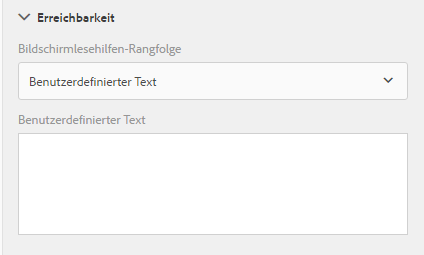
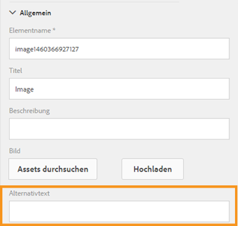

# Zugreifbare adaptive Formulare erstellen{#creating-accessible-adaptive-forms}

## Einführung {#introduction}

Ein barrierefreies Formular ist ein Formular, das jeder verwenden kann, einschließlich Benutzer mit Behinderungen. Adaptives Forms umfasst eine Reihe von Funktionen, die die Benutzerfreundlichkeit für Benutzer mit unterschiedlichen Fähigkeiten verbessern. Die Integration von Barrierefreiheit in adaptive Formulare ermöglicht nicht nur die größte potenzielle Zielgruppe für den Inhalt, sie ist auch eine Anforderung beim Bereitstellen von Dokumenten in Regionen, in denen die Einhaltung von Barrierefreiheitsstandards obligatorisch ist. Mit AEM Forms können Formularentwickler die Barrierefreiheitsstandards einhalten.

Beim Verfassen eines adaptiven Formulars muss der Autor die folgenden Punkte berücksichtigen, um barrierefreie adaptive Formulare zu erstellen:

* Überprüfen Sie das Formular mit dem Barrierefreiheitstestwerkzeug &quot;Accessible Name and Description Inspector (ANDI)&quot;
* Angabe von angemessenen Beschriftungen für Formularsteuerelemente
* Angabe von Textäquivalenten für Bilder
* Bereitstellung von ausreichendem Farbkontrast
* Sicherstellen, dass Formularsteuerelemente mit der Tastatur aufgerufen werden können

## Voraussetzung

Sie benötigen ein Barrierefreiheitstool wie **Accessible Name and Description Inspector (ANDI)** und ein **Adaptives Formulardesign, das entwickelt wurde, um Barrierefreiheitsprobleme zu beheben**, um ein barrierefreies adaptives Formular zu erstellen.

### Testwerkzeug für Barrierefreiheit herunterladen und installieren

Das Tool &quot;Accessible Name and Description Inspector (ANDI)&quot;hilft Ihnen bei der Identifizierung und Behebung von Problemen mit der Barrierefreiheit in Webinhalten. Es ist das empfohlene Tool unter den Richtlinien des Ministeriums für Innere Sicherheit, Trusted Tester v5. Es wurde von der Abteilung Social Security Administration &#x200B; in den Vereinigten Staaten entwickelt, um die Einhaltung von Section 508-Anforderungen an Webinhalte zu überprüfen. Das Tool:

* Hilft bei der Erkennung von Zugänglichkeitsproblemen &#x200B; einer Webseite
* Bietet Vorschläge zur Verbesserung der &#x200B;
* Erkennt Probleme mit der Barrierefreiheit und dem Farbkontrast
* Identifiziert den Inhalt der Bildschirmlesehilfen eindeutig gemäß den Standards

ANDI arbeitet mit allen gängigen Internetbrowsern. Detaillierte Anweisungen zum Konfigurieren und Verwenden des Tools finden Sie in der Dokumentation von [ANDI.](https://www.ssa.gov/accessibility/andi/help/install.html)

### Herunterladen und Installieren des Themas &quot;Ultramarine-Accessible&quot;

Das Thema Ultramarine-Accessible ist ein Referenzthema. Es zeigt Ihnen, wie Sie Farbkontrast und andere Probleme mit der Barrierefreiheit in einem adaptiven Formular beheben können. Adobe empfiehlt, ein benutzerdefiniertes Design für die Produktions-Umgebung zu erstellen, das auf den von Ihrem Unternehmen genehmigten Stilen basiert. Führen Sie die folgenden Schritte aus, um das Design in Ihre AEM Instanz hochzuladen:

1. Laden Sie das Designpaket herunter.
1. Navigieren Sie zu **[!UICONTROL Experience Manager]** > **[!UICONTROL Navigation]**  > **[!UICONTROL Forms]** in Ihrer AEM Instanz.
1. Tippen Sie auf **[!UICONTROL Erstellen]** > **[!UICONTROL Datei hochladen]**. Wählen Sie die Datei x Ultramarine-Accessible-Theme.zip aus und laden Sie sie hoch. Lädt das Design in Ihre AEM Instanz hoch.

## Barrierefreies Gestalten eines adaptiven Formulars

Sie sollten sich auf vier Schlüsselaspekte konzentrieren: Tastaturnavigation, Farbkontrast, aussagekräftiger alternativer Text für Bilder und geeignete Beschriftungen für Formularsteuerelemente, um ein adaptives Formular barrierefrei zu gestalten. Führen Sie die folgenden Schritte aus, um Ihre vorhandenen adaptiven Formulare barrierefrei zu machen:

### 1. Ein barrierefreies Design anwenden und weitere Korrekturen durchführen

Wenden Sie das Design Ultramarine-Accessible auf Ihr vorhandenes adaptives Formular an. So wenden Sie das Design an

1. Öffnen Sie Ihr adaptives Formular zum Bearbeiten.
1. Wählen Sie eine Komponente aus und tippen Sie auf das übergeordnete Symbol. Tippen Sie im Kontextmenü auf **[!UICONTROL Container für adaptive Formulare]** und dann auf das Symbol &quot;Konfigurieren&quot;.
1. Wählen Sie im Eigenschaftenbrowser das Design &quot;Ultramarine-barrierefrei&quot;und klicken Sie auf das Symbol **[!UICONTROL Speichern]**.
1. Aktualisieren Sie das Browserfenster. Das Design wird auf das adaptive Formular angewendet.

Nachdem Sie ein barrierefreies Design angewendet haben, führen Sie die folgenden zusätzlichen Korrekturen durch. Die Fehlerbehebungen ergänzen Barrierefreiheitskorrekturen, die im Thema Barrierefreiheit behandelt werden:

1. hinzufügen Sie einen aussagekräftigen Alternativtext für das Logobild im adaptiven Formular.

   Geben Sie einen aussagekräftigen alternativen Text für Bilder in den Kopf- und Fußzeilenkomponenten der Vorlage für adaptive Formulare ein. Wenn Sie die Vorlage korrigieren und sie zum Erstellen eines adaptiven Formulars verwenden, übernehmen die adaptiven Formulare alle Korrekturen, die im Zusammenhang mit der Barrierefreiheit an der Kopf- und Fußzeile der Vorlage vorgenommen werden.  Nehmen Sie für ein vorhandenes adaptives Formular Änderungen auf der Ebene des adaptiven Formulars vor. Änderungen, die an einer Vorlage für ein adaptives Formular vorgenommen wurden, fließen nicht automatisch in ein vorhandenes adaptives Formular.

1. hinzufügen eine Überschriftenkomponente, die den Formulardamen enthält, an das adaptive Formular. Wenn Ihr Formularentwurf einen Firmen-Namen angibt, fügen Sie auch eine separate Überschriftenkomponente für den Firmen-Namen hinzu.

   Die meisten Barrierefreiheitstools informieren Benutzer über die Hierarchie des Inhalts, damit sie die Struktur der Webseite besser verstehen können. Legen Sie unterschiedliche Überschriftenebenen für den Namen des Unternehmens und den Formularnamenstext im adaptiven Formular fest, um diesen Text hierarchisch zu strukturieren. Verwenden Sie außerdem vor jedem Bereich und Abschnitt eine Textkomponente mit einer entsprechenden Überschriftenebene, um eine Hierarchie zu erstellen.

   

1. Ändern Sie die Hintergrundfarbe der Fußzeile, um entsprechend den Barrierefreiheitsstandards einen angemessenen Kontrast zu verwenden, um die Sichtbarkeit und Lesbarkeit des Textes zu verbessern. Sie können ANDI verwenden, um Probleme mit dem Farbkontrast in Ihrem Formular zu ermitteln. Verwenden Sie auch nicht sehr kleine Schrift. Kleine Schriftarten sind schwer zu lesen.

1. Ersetzen Sie die Komponenten &quot;switch&quot;und &quot;image choice&quot;im vorhandenen adaptiven Formular durch die Komponente &quot;choice&quot;(radio).

1. Ersetzen Sie die Komponente &quot;Numerische Schritte&quot;im vorhandenen adaptiven Formular durch die Komponente &quot;Numerisches Feld&quot;.

1. Datumseingabefeld durch Datumsauswahl-Feld ersetzen.

1. Legen Sie Muster für die Anzeige, Überprüfung und Bearbeitung der Datumsauswahl-Komponente fest. Legen Sie außerdem eine benutzerdefinierte Prüffehlermeldung fest. Sie haben beispielsweise ein ungültiges Datum angegeben. Das korrekte Format des Datums ist JJJJ-MM-TT.

1. Legen Sie benutzerdefinierten Barrierefreiheitstext für die Datumsauswahl-Komponente fest. Geben Sie beispielsweise Ihr Geburtsdatum ein. Bildschirmlesehilfen lesen diese benutzerdefinierten Barrierefreiheitstexte.

1. Verwenden Sie für Komponenten adaptiver Formulare eine kurze Beschreibung anstelle einer langen Beschreibung. Eine lange Beschreibung fügt die Schaltfläche &quot;Hilfe&quot;hinzu. Vergewissern Sie sich, dass das adaptive Formular über keine Schaltfläche &quot;Hilfe&quot;verfügt.

1. hinzufügen benutzerdefinierter Barrierefreiheitstext für alle schreibgeschützten Tabellenzellen. Deaktivieren Sie außerdem alle schreibgeschützten Zellen von Tabellen.

1. Entfernen Sie Scribble-Signaturfelder, sofern vorhanden, im adaptiven Formular. Konfigurieren Sie das adaptive Formular für die Verwendung von Adobe Sign für eine nahtlose digitale Signatur.

### 2. Geben Sie geeignete Beschriftungen für Formularsteuerelemente ein {#provide-proper-labels-for-form-controls}

Die Beschriftung oder der Titel einer Komponente gibt an, was die Formularkomponente darstellt. Beispiel: Der Text „Vorname“ weist darauf hin, dass der Benutzer seinen Vornamen in ein Textfeld eingeben muss. Damit die Beschriftung von Bildschirmlesegeräten erkannt werden kann, wird sie programmgesteuert mit einer Formularkomponente verknüpft. Alternativ dazu kann das Formularsteuerelement mit zusätzlichen Barrierefreiheitsinformationen konfiguriert werden.

Die Beschriftung, die von Bildschirmlesegeräten erkannt wird, muss nicht unbedingt mit der visuellen Beschriftung identisch sein. In einigen Fällen möchten Sie den Zweck des Steuerelements möglicherweise genauer angeben. Für jedes Feldobjekt in einem Formular können die Barrierefreiheitsoptionen verwendet werden, um anzugeben, wie das Bildschirmlesegerät das entsprechende Formularfeld identifiziert.

Gehen Sie wie folgt vor, um die Barrierefreiheitsoptionen zu verwenden:

1. Wählen Sie eine Komponente aus und tippen Sie auf .
1. Klicken Sie in der Randleiste auf **[!UICONTROL Ein-/Ausgabehilfe]**, um die gewünschte Barrierefreiheitsoption auszuwählen.

### Barrierefreiheitsoptionen in Formularkomponenten {#accessibility-options-in-form-components}

**Autoren benutzerdefinierter** TextForm stellen den Inhalt in der Barrierefreiheitsoption Benutzerdefiniertes Textfeld bereit. Die Hilfstechnologie, z. B. Bildschirmlesehilfen, verwendet diesen benutzerdefinierten Text. In den meisten Szenarien ist die Verwendung der Einstellung „Titel“ die beste Option. Sie sollten nur dann benutzerdefinierten Text für Bildschirmlesegeräte erstellen, wenn die Option „Titel“ oder eine Kurzbeschreibung nicht möglich ist.

**Kurze** BeschreibungBei den meisten Komponenten wird die Kurzbeschreibung zur Laufzeit angezeigt, wenn der Benutzer den Mauszeiger über die Komponente bewegt. Sie können diese Option im Feld „Kurzbeschreibung“ unter der Option für den Hilfeinhalt festlegen.

**** TitelVerwenden Sie diese Option, damit AEM Forms die mit dem Formularfeld verknüpfte visuelle Beschriftung als Bildschirmlesehilfen-Text verwenden kann.

**** NameSie können auf der Registerkarte &quot;Bindung&quot;im Feld &quot;Name&quot;einen Wert angeben. Der Name darf keine Leerzeichen enthalten.

**Wenn Sie &quot;** Ohne&quot;auswählen, hat das Formularobjekt keinen Namen im veröffentlichten Formular. Keine ist keine empfohlene Einstellung für Formularsteuerelemente.

>[!NOTE]
>
>* Optionsfelder und Kontrollkästchen können nur zwei Optionen für die Barrierefreiheit aufweisen, nämlich „Benutzerdefinierter Text“ und „Titel“.
>* Bei XFA-basierten adaptiven Formularen wird die Barrierefreiheitsoption von den in der XDP festgelegten Barrierefreiheitsoptionen übernommen. QuickInfo von XDP werden der Kurzbeschreibung zugeordnet, und die Beschriftung wird dem Titel zugeordnet. Die anderen Optionen bleiben gleich.

### 3. Textentsprechungen für Bilder {#provide-text-equivalents-for-images} bereitstellen

Durch Bilder können einigen Benutzern Aspekte veranschaulicht werden. Für Benutzer, die Bildschirmlesegeräte verwenden, verringern Bilder allerdings die Barrierefreiheit Ihres Formulars. Wenn Sie Bilder verwenden möchten, sollten Sie Textbeschreibungen für alle Bilder angeben.

Stellen Sie sicher, dass der Text das Objekt und seinen Zweck im Formular beschreibt. Ein Bildschirmlesegerät liest den alternativen Text, wenn ein Bild auftritt. Für jedes Bild muss ein alternativer Text angegeben sein.

Wählen Sie eine Bildkomponente aus und tippen Sie auf . Geben Sie in der Randleiste unter „Eigenschaften“ alternativen Text für ein Bild ein.

### 4. Bereitstellung eines ausreichenden Farbkontrasts {#provide-sufficient-color-contrast}

Bei Barrierefreiheitsdesigns müssen zusätzliche Richtlinien zur Farbverwendung beachtet werden. Formularautoren können Farben verwenden, um das Erscheinungsbild von Formularen zu verbessern, indem sie verschiedene Formularkomponenten hervorheben. Bei einer falschen Farbnutzung kann ein Formular allerdings für Personen mit unterschiedlichen Fähigkeiten schwieriger oder gar nicht lesbar werden.

Sehbehinderte Benutzer sind auf einen hohen Kontrast zwischen Text und Hintergrund angewiesen, um digitale Inhalte lesen zu können. Ohne ausreichend Kontrast kann ein Formular für einige Benutzern schwieriger oder überhaupt nicht zu lesen sein.

Es wird empfohlen, dass Sie die Standardschrift und -hintergrundfarben verwenden: Inhalt in schwarzer Farbe auf einem weißen Hintergrund. Wenn Sie die Standardfarben ändern, wählen Sie entweder eine dunkle Vordergrundfarbe auf einer hellen Hintergrundfarbe oder umgekehrt.

Weitere Informationen zum Ändern des Farbkontrasts und des Themas für adaptive Formulare finden Sie unter [Erstellen benutzerdefinierter Themen für adaptive Formulare](/help/forms/using/creating-custom-adaptive-form-themes.md).

### 5. Stellen Sie sicher, dass Formularsteuerelemente auf die Tastatur zugegriffen werden kann {#ensure-that-form-controls-are-keyboard-accessible}

Ein barrierefreies Formular kann vollständig mit nur der Tastatur oder einem ähnlichen Eingabegerät ausgefüllt werden. Benutzer mit eingeschränkter Mobilität bzw. Sehfähigkeit haben möglicherweise keine andere Wahl, als die Tastatur zu nutzen, und viele Benutzer, die eine Maus verwenden könnten, ziehen es vor, Eingaben per Tastatur vorzunehmen. Indem Sie mehrere Eingabeverfahren ermöglichen, erstellen Sie Formulare, die nicht nur barrierefrei sind, sondern auch den Vorlieben aller Benutzer entgegenkommen.

Die folgenden Tastaturbefehle sind in AEM Forms verfügbar.

| Aktion | Tastaturbefehl |
|---|---|
| Den Cursor in einem Formular vorwärts bewegen | Registerkarte |
| Den Cursor in einem Formular rückwärts bewegen | Umschalt+Tab |
| Zum nächsten Bereich wechseln | Alt+Nach-rechts-Taste |
| Zum vorherigen Bereich wechseln | Alt+Nach-links-Taste |
| Die ausgefüllten Daten in einem Formular zurücksetzen | Alt+R |
| Formular senden | Alt+S |

## Verwenden Sie das Barrierefreiheitstool, um noch verbleibende Probleme bei der Barrierefreiheit zu ermitteln

Der ANZDI-Inspektor (Accessible Name and Description Inspector) unterstützt Sie bei der Identifizierung und Behebung von Problemen mit der Barrierefreiheit in einem adaptiven Formular. So suchen Sie mit dem ANDI-Tool Barrierefreiheitsprobleme in einem adaptiven Formular:

1. Öffnen Sie das adaptive Formular im Vorschau-Modus.
1. Klicken Sie auf das mit Lesezeichen versehene ANDI-Tool-Symbol. Das ANDI-Tool analysiert das adaptive Formular und zeigt Zugänglichkeitsprobleme an. Weitere Informationen zur Verwendung des Tools finden Sie in der [ANDI-Dokumentation](https://www.ssa.gov/accessibility/andi/help/howtouse.html).
1. Überprüfen und beheben Sie die von ANDI gemeldeten Probleme.