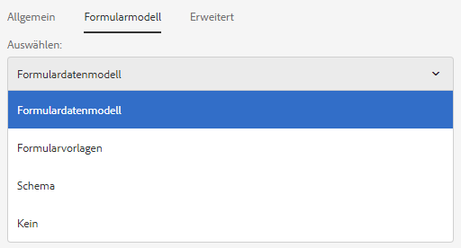
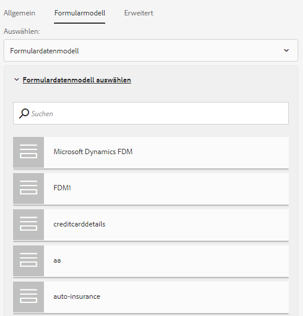
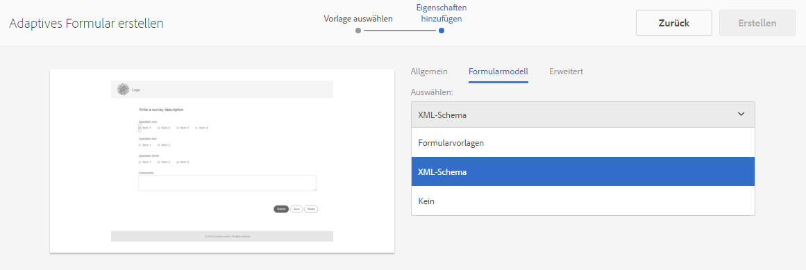
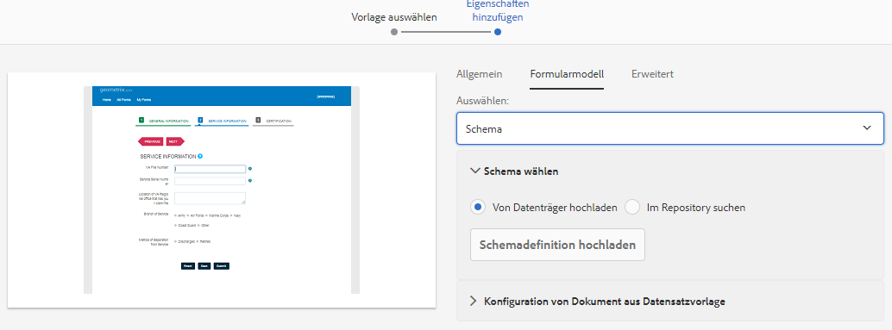
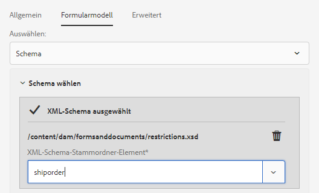

# Erstellen eines adaptiven Formulars {#creating-an-adaptive-form}

## <strong>Erstellen eines adaptiven Formulars</strong> {#strong-create-an-adaptive-form-strong}

Gehen Sie folgendermaßen vor, um ein adaptives Formular zu erstellen.

1. Zugriff auf die Autoreninstanz [!DNL Experience Manager Forms] unter `https://'[server]:[port]'/<custom-context-if-any>.`

1. Geben Sie Ihre Anmeldedaten auf der Anmeldeseite des Experience Managers ein.

   Tippen Sie nach der Anmeldung oben links auf **[!UICONTROL Adobe Experience Manager]** > **[!UICONTROL Forms]** > **[!UICONTROL Forms &amp; Documents]**.

   >[!NOTE]
   >
   >Bei einer Standardinstallation lautet der Benutzername `admin` und das Kennwort `admin`.

1. Tippen Sie auf **[!UICONTROL Erstellen]** und wählen Sie **[!UICONTROL Adaptives Formular]**.
1. Eine Option zum Auswählen einer Vorlage wird angezeigt. Weitere Informationen zu Vorlagen finden Sie unter [Vorlagen für adaptive Formulare](creating-adaptive-form.md#p-adaptive-form-templates-p). Tippen Sie auf eine Vorlage, um sie auszuwählen, und dann auf „Weiter“.
1. Die Option „Eigenschaften hinzufügen“ wird angezeigt. Geben Sie die Werte für die folgenden Eigenschaftenfelder an. Die Felder „Titel“ und „Name“ sind obligatorisch.

   * **[!UICONTROL Titel:]** Gibt den Anzeigenamen des Formulars an. Der Titel erleichtert Ihnen die Identifizierung des Formulars in der Benutzeroberfläche von [!DNL Experience Manager Forms].
   * **[!UICONTROL Name:]** Gibt den Namen des Formulars an. Im Repository wird ein Knoten mit dem angegebenen Namen erstellt. Wenn Sie mit der Eingabe des Titels beginnen, wird automatisch ein Wert für das Feld „Name“ vorgeschlagen. Sie können den vorgeschlagenen Wert gegebenenfalls ändern. Im Feld „Name“ dürfen nur alphanumerische Zeichen, Bindestriche und Unterstriche eingegeben werden. Ungültige Eingaben werden durch Bindestriche ersetzt.
   * **[!UICONTROL Beschreibung:]** Gibt die detaillierten Informationen zum Formular an.
   * **[!UICONTROL Tags:]** Gibt Tags an, die eine eindeutige Identifizierung des adaptiven Formulars ermöglichen. Tags erleichtern die Suche nach dem Formular. Um die Tags zu erstellen, geben Sie neue Tag-Namen in das Feld **[!UICONTROL Tags]** ein.

1. Sie können ein adaptives Formular erstellen, das auf den folgenden Formularmodellen basiert:

   * [Formulardatenmodell](#fdm)
   * [XFA-Formularvorlage ](#create-an-adaptive-form-based-on-an-xfa-form-template)
   * [XML- oder JSON-Schema](#create-an-adaptive-form-based-on-xml-or-json-schema)
   * Kein oder ohne Formularmodell

   Sie können diese auf der Registerkarte **[!UICONTROL Formularmodell]** konfigurieren. Sie befindet sich auf der Seite **[!UICONTROL Eigenschaften hinzufügen]**. Standardmäßig ist das Formularmodell **[!UICONTROL Ohne]** ausgewählt.

1. Tippen Sie auf **[!UICONTROL Erstellen]**. Ein adaptives Formular wird erstellt und es wird ein Dialogfeld zum Öffnen des Formulars zur Bearbeitung angezeigt.

   Nachdem Sie alle Eigenschaften angegeben haben, klicken Sie auf **[!UICONTROL Erstellen]**. Ein adaptives Formular wird erstellt und es wird ein Dialogfeld zum Öffnen des Formulars zur Bearbeitung angezeigt.

   Nachdem Sie alle Eigenschaften angegeben haben, klicken Sie auf **[!UICONTROL Erstellen]**. Ein adaptives Formular wird erstellt und es wird ein Dialogfeld zum Öffnen des Formulars zur Bearbeitung angezeigt.

1. Tippen Sie auf **[!UICONTROL Öffnen]** , um das neu erstellte Formular in einer neuen Registerkarte zu öffnen. Das Formular wird zur Bearbeitung geöffnet und zeigt den Inhalt an, der in der Vorlage verfügbar ist. Es zeigt auch die Seitenleiste an, um das neu erstellte Formular entsprechend den Anforderungen anzupassen.

   Je nach Typ des adaptiven Formulars werden auf der Registerkarte **[!UICONTROL Datenmodellobjekte]** des **[!UICONTROL Inhaltbrowsers]** in der Seitenleiste die Formularelemente angezeigt, die in der zugeordneten XFA-Formularvorlage, dem XML-Schema oder JSON-Schema vorhanden sind. Sie können diese Elemente auch durch Drag &amp; Drop in das adaptive Formular übernehmen.

   Weitere Informationen zur Authoring-Benutzeroberfläche für adaptive Formulare und zu verfügbaren Komponenten finden Sie unter [Einführung in das Authoring adaptiver Formulare](introduction-forms-authoring.md).

   >[!NOTE]
   >
   >Lassen Sie Popup-Fenster in Ihrem Browser zu, um das neu erstellte Formular in einer neuen Registerkarte zu öffnen.

## Erstellen eines adaptiven Formulars basierend auf einem Formulardatenmodell {#fdm}

[[!DNL Experience Manager Forms] Durch die ](data-integration.md) Datenintegration können Sie mehrere Datenquellen integrieren und deren Entitäten und Dienste zusammenführen, um ein Formulardatenmodell zu erstellen. Dabei handelt es sich um eine Erweiterung des JSON-Schemas. Sie können ein Formulardatenmodell verwenden, um ein adaptives Formular zu erstellen. Die Entitäten oder Datenmodellobjekte, die in einem Formulardatenmodell konfiguriert sind, sind als Datenmodellobjekte für die Formularerstellung verfügbar. Sie sind an die jeweiligen Datenquellen gebunden und werden verwendet, um ein Formular vorauszufüllen und die übermittelten Daten zurück in die entsprechenden Datenquellen zu schreiben. Sie können auch Dienste aufrufen, die in einem Formulardatenmodell mithilfe von Regeln für adaptive Formulare konfiguriert wurden.

So verwenden Sie ein Formulardatenmodell zum Erstellen eines adaptiven Formulars:

1. Wählen Sie auf der Registerkarte „Formularmodell“ im Bildschirm „Eigenschaften hinzufügen“ **[!UICONTROL Formulardatenmodell]** aus der Dropdownliste **[!UICONTROL Auswählen aus]**.

   

1. Tippen Sie auf **[!UICONTROL Formulardatenmodell auswählen]**, um es zu erweitern. Alle verfügbaren Formulardatenmodelle werden aufgelistet.

   Wählen Sie ein Formulardatenmodell aus.

   

>[!NOTE]
>
>Sie können das Formulardatenmodell für ein adaptives Formular auch ändern. Ausführliche Anweisungen finden Sie unter [Eigenschaften des Formularmodells eines adaptiven Formulars bearbeiten](#edit-form-model).

## Erstellen Sie anhand einer XFA Forms-Vorlage ein adaptives Formular {#create-an-adaptive-form-based-on-an-xfa-form-template}

Sie können Ihre XFA-Formularvorlagen wiederverwenden, um adaptive Formulare zu erstellen. Dazu müssen Sie eine XFA-Formularvorlage hochladen und mit einem adaptiven Formular verknüpfen. Die Elemente der Formularvorlage (XFA-Formular) sind dann zum Zeitpunkt des Authoring adaptiver Formulare für die Verwendung in der Inhaltssuche verfügbar. Aus der Inhaltssuche können Sie per Drag &amp; Drop Formularvorlagenelemente in das Formular ziehen.

<!-- >>[!NOTE]
>
>[Upload the XFA Form Template](get-xdp-pdf-documents-aem.md) to AEM Forms before you start creating an adaptive form based on the form template.

Do the following to use an XFA form template as form model for your adaptive form:

1. On the **[!UICONTROL Add Properties]** page, open the **[!UICONTROL Form Model]** tab.
1. In the Form Model tab, from the drop-down list, select **[!UICONTROL Form Templates]**. All the form templates that are uploaded to the repository via AEM Forms UI are listed for selection. Select a template from the list.

   
**Figure:** *Selecting a form template*

   >[!NOTE]
   >
   >You can also change the form template for an adaptive form. For detailed steps, see [Edit Form Model properties of an adaptive form](#edit-form-model). -->

## Erstellen eines adaptiven Formulars basierend auf einem XML- oder JSON-Schema {#create-an-adaptive-form-based-on-xml-or-json-schema}

XML- und JSON-Schemas stellen die Struktur dar, in der Daten vom Back-End-System in Ihrer Organisation produziert oder genutzt werden. Sie können ein Schema mit einem adaptiven Formular verknüpfen und dessen Elemente verwenden, um dem adaptiven Formular dynamischen Inhalt hinzuzufügen. Die Elemente des Schemas sind auf der Registerkarte &quot;Datenmodellobjekt&quot;des Inhaltsbrowsers für das Authoring adaptiver Formulare verfügbar. Sie können die Schemaelemente zum Erstellen des Formulars ziehen und ablegen.

In den folgenden Dokumenten erfahren Sie, wie Sie ein XML- oder JSON-Schema für die Erstellung adaptiver Formulare entwickeln.

* [Adaptive Formulare mithilfe des XML-Schemas erstellen](adaptive-form-xml-schema-form-model.md)
* [Erstellen adaptiver Formulare mithilfe eines JSON-Schemas](adaptive-form-json-schema-form-model.md)

Führen Sie folgende Schritte aus, um ein XML- oder JSON-Schema als Formularmodell für ein adaptives Formular zu verwenden:

1. Tippen Sie im Schritt **[!UICONTROL Eigenschaften]** der Seite zur Erstellung adaptiver Formulare hinzufügen auf die Registerkarte **[!UICONTROL Formularmodell]** .
1. Wählen Sie auf der Registerkarte &quot;Formularmodell&quot;die Option **[!UICONTROL Schema]** aus dem Dropdown-Feld **[!UICONTROL Aus]** aus.

1. Tippen Sie auf **[!UICONTROL Wählen Sie Schema]** aus und führen Sie einen der folgenden Schritte aus:

   * **[!UICONTROL Von Datenträger hochladen]** – Wählen Sie diese Option und tippen Sie auf „Schemadefinition hochladen“, um ein XML- oder JSON-Schema in Ihrem Dateisystem zu suchen und hochzuladen. Die hochgeladene Schemadatei befindet sich im Formular und ist für andere adaptive Formulare nicht zugänglich.
   * **[!UICONTROL Im Repository suchen]** – Wählen Sie diese Option, um eine Auswahl aus der Liste der im Repository verfügbaren Schemadefinitionsdateien zu treffen. Wählen Sie die XML- oder JSON-Schemadatei als Formularmodell aus. Das ausgewählte Schema ist dem Formular durch Verweis zugeordnet und kann in anderen adaptiven Formularen verwendet werden.

   >[!CAUTION]
   >
   >Stellen Sie sicher, dass der Dateiname des JSON-Schemas mit **.schema.json** endet. Beispiel: mySchema.schema.json

   
   **Abbildung:** *Auswählen des XML- oder JSON-Schemas*

1. (Nur für XML-Schema) Nachdem Sie ein XML-Schema ausgewählt oder hochgeladen haben, geben Sie ein Stammelement der ausgewählten XSD-Datei an, das mit dem adaptiven Formular zugeordnet werden soll.

   
   **Abbildung:** *Auswählen des XSD-Stammelements*

>[!NOTE]
>
>Sie können das Schema für ein adaptives Formular ändern. Ausführliche Anweisungen finden Sie unter [Eigenschaften des Formularmodells eines adaptiven Formulars bearbeiten](#edit-form-model).

## Adaptive Formularvorlagen {#adaptive-form-templates}

Eine Vorlage bietet eine Grundstruktur für adaptive Formulare und definiert deren Erscheinungsbild (Layouts und Stile). Sie enthält vorformatierte Komponenten einschließlich bestimmter Eigenschaften und einer Struktur für Inhalte. <!-- Out of the box, AEM Forms provides some adaptive form templates. To get the complete template package including advanced templates, you need to install the AEM Forms add-on package. For more information, see [Installing AEM Forms add-on package](installing-configuring-aem-forms-osgi.md).-->

Darüber hinaus können Sie den Vorlageneditor verwenden, um eigene Vorlagen zu erstellen. Weitere Informationen zu Vorlagen finden Sie unter [Adaptive Formularvorlagen](template-editor.md).

>[!NOTE]
>
>Wenn Sie ein adaptives Formular öffnen, das mit einer erweiterten Vorlage zur Bearbeitung erstellt wurde, wird eine Fehlermeldung angezeigt. Die erweiterte Vorlage verfügt über eine Komponente für den Unterzeichnungs-Schritt, und Adobe Sign ist für diesen standardmäßig aktiviert. Um den Fehler zu beheben, erstellen Sie eine [Adobe Sign Cloud-Konfiguration](adobe-sign-integration-adaptive-forms.md) und [konfigurieren Sie einen Unterzeichner](working-with-adobe-sign.md#addsignerstoanadaptiveform).

## Formularmodelleigenschaften eines adaptiven Formulars bearbeiten {#edit-form-model}

Adaptive Formulare werden entweder ohne Formularmodell erstellt (mithilfe der Option „Ohne“ für Formularmodelle) oder mithilfe eines Formularmodells wie einer Formularvorlage, eines XML- oder JSON-Schemas oder eines Formulardatenmodells. Sie können das Formularmodell für ein adaptives Formular von „Ohne“ zu einem anderen Formularmodell ändern. Sie können für ein adaptives Formular, das auf einem Formularmodell basiert, eine andere Formularvorlage bzw ein anderes XML-Schema, JSON-Schema oder Formulardatenmodell für dasselbe Formularmodell wählen. Sie können jedoch nicht zwischen Formularmodellen wechseln.

1. Wählen Sie das adaptive Formular aus und tippen Sie auf das Symbol **Eigenschaften**.
1. Öffnen Sie die Registerkarte **[!UICONTROL Formularmodell]** und führen Sie einen der folgenden Schritte aus.

   * Wenn das adaptive Formular nicht auf einem Formularmodell basiert, können Sie ein Formularmodell und eine entsprechende Formularvorlage, ein XML- oder JSON-Schema oder ein Formulardatenmodell auswählen.
   * Wenn das adaptive Formular auf einem Formularmodell basiert, können Sie eine andere Formularvorlage bzw ein anderes XML-Schema, JSON-Schema oder Formulardatenmodell für dasselbe Formularmodell wählen.

1. Tippen Sie auf **[!UICONTROL Speichern]**, um die Eigenschaften zu speichern.

## Automatisches Speichern eines adaptiven Formulars {#auto-save-an-adaptive-form}

Standardmäßig werden die Inhalte eines adaptiven Formulars bei einer Benutzeraktion wie Drücken der Schaltfläche „Speichern“ gespeichert. Sie können auch ein adaptives Formular so konfigurieren, dass Inhalt basierend auf einem Ereignis oder einem Zeitintervall automatisch gespeichert wird. Die Option „Automatisches Speichern“ ist bei folgenden Aufgaben hilfreich:

* Automatisches Speichern der Inhalte für anonym und angemeldete Benutzer
* Speichern der Inhalte eines Formulars ohne oder mit minimalem Benutzereingriff
* Speichern von Inhalten eines Formulars basierend auf einem Ereignis starten
* Wiederholtes Speichern von Formularinhalten nach einem angegebenen Zeitintervall

### Automatisches Speichern eines adaptiven Formulars aktivieren  {#enable-auto-save-for-an-adaptive-form}

Die Option „Automatisches Speichern“ ist standardmäßig nicht aktiviert. Sie können die Option „Automatisches Speichern“ über die Registerkarte „Automatisches Speichern“ eines adaptiven Formulars aktivieren. Die Registerkarte „Automatisches Speichern“ bietet mehrere weitere Konfigurationsoptionen. Führen Sie zum Aktivieren und Konfigurieren der Option „Automatisches Speichern“ für ein adaptives Formular folgende Schritte durch: 

1. Um auf den Abschnitt &quot;Automatisches Speichern&quot;in den Eigenschaften zuzugreifen, wählen Sie eine Komponente aus, tippen Sie auf  > **[!UICONTROL Container für adaptive Formulare]** und tippen Sie dann auf .
1. Im Abschnitt **[!UICONTROL Automatisches Speichern]** **[!UICONTROL aktivieren]** Sie die Option zum automatischen Speichern.
1. Geben Sie im Feld **[!UICONTROL Adaptives Formular-Ereignis]** 1 oder TRUE ein, um das Formular automatisch zu speichern, wenn das Formular im Browser geladen wird. Sie können außerdem einen bedingten Ausdruck für ein Ereignis angeben, das, wenn es ausgelöst wird, den Status „true“ zurückgibt und den Inhalt des Formulars speichert.
1. Geben Sie den Auslöser an. Die automatische Speicherung wird gemäß Ihrer Konfiguration ausgelöst. Ihre Optionen sind:

   * **[!UICONTROL Zeitbasiert:]** Wählen Sie diese Option, um den Inhalt anhand eines bestimmtes Zeitintervalls zu speichern.
   * **[!UICONTROL Ereignisbasiert:]** Wählen Sie diese Option, um den Inhalt beim Auslösen eines Ereignisses zu speichern.

   Wenn Sie einen Auslöser auswählen, wird das Feld „Strategiekonfiguration“ aktiviert. Mithilfe der Strategiekonfiguration können Sie:

   * ein Zeitintervall angeben, wenn Sie **[!UICONTROL Zeitbasiert]** für den Auslöser wählen.
   * Den Namen des Ereignisses angeben, wenn Sie **[!UICONTROL Ereignisbasiert]** für den Auslöser wählen.

   <!-- You can also create and add your own custom strategy to the list. For details, see [Implement a custom strategy to autosave the forms](auto-save-an-adaptive-form.md#p-implement-a-custom-strategy-to-enable-autosave-for-adaptive-forms-p). -->

1. (Nur zeitbasiertes automatisches Speichern) Führen Sie die folgenden Schritte aus, um serverseitige Protokolle zu konfigurieren:

   1. Geben Sie im Feld **[!UICONTROL In diesem Intervall automatisch speichern]** den Zeitintervall in Sekunden an. Das Formular wird wiederholt gespeichert, nachdem die im Intervallfeld angegebene Anzahl an Sekunden überschritten wird.

1. (Nur ereignisbasiertes automatisches Speichern) Führen Sie die folgenden Schritte aus, um Optionen für ereignisbasiertes automatisches Speichern zu konfigurieren.

   1. Geben Sie im Feld **[!UICONTROL Automatisch nach diesem Ereignis speichern]** ein [GuideBridge](https://helpx.adobe.com/de/aem-forms/6/javascript-api/GuideBridge.html)-Ereignis an. Das Formular wird immer dann gespeichert, wenn der Ausdruck „TRUE“ ergibt.

1. (Optional) Um den Inhalt automatisch für anonyme Benutzer zu speichern, wählen Sie die Option **[!UICONTROL Automatisches Speichern für anonyme Benutzer aktivieren]** und klicken Sie auf **[!UICONTROL OK]**.

   >[!NOTE]
   >
   >Damit die Option zum automatischen Speichern für anonyme Benutzer funktioniert, stellen Sie sicher, dass Sie den allgemeinen Forms-Konfigurationsdienst so konfiguriert ist, dass alle Benutzer Formulare in der Vorschau anzeigen, überprüfen und zu signieren können.
   >
   >Um den Dienst zu konfigurieren, navigieren Sie zur Adobe Experience Manager Web Console-Konfiguration unter `https://'[server]:[port]'system/console/configMgr` und bearbeiten Sie **[!UICONTROL Forms Common Configuration Service]**, um die Option **[!UICONTROL Alle Benutzer]** im Feld **[!UICONTROL Allow]** auszuwählen, und speichern Sie die Konfiguration.
