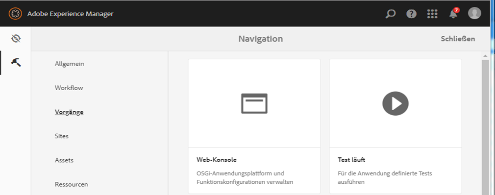

# Erstellen benutzerdefinierter Themen für adaptive Formulare {#creating-custom-adaptive-form-themes}

>[!CAUTION]
>
>Adobe Experience Manager (AEM) Forms stellt die [Design-Editor](/help/forms/using/themes.md) Funktion zum Erstellen und Ändern adaptiver Formulare [themes](/help/forms/using/themes.md). Führen Sie die in diesem Artikel aufgeführten Schritte nur aus, wenn Sie ein Upgrade von einer Version durchgeführt haben, die nicht über [Design-Editor](/help/forms/using/themes.md) und Sie bereits in Designs investiert haben, die mit Less-/CSS-Dateien erstellt wurden (Pre-Theme-Editor-Methode).

## Voraussetzungen {#prerequisites}

* Kenntnisse des LESS (Leaner CSS)-Frameworks
* Erstellen einer Client-Bibliothek in Adobe Experience Manager
* [Erstellen einer Vorlage für ein adaptives Formular](/help/forms/using/custom-adaptive-forms-templates.md) für die Verwendung des Designs, das Sie erstellen

## Adaptives Formulardesign {#adaptive-form-theme}

Ein **Thema für adaptives Formular** ist eine AEM Client-Bibliothek, mit der Sie die Stile (Erscheinungsbild) für ein adaptives Formular definieren.

Sie erstellen eine **adaptive Vorlage** und wenden Sie das Design auf die Vorlage an. Anschließend können Sie diese benutzerdefinierte Vorlage verwenden, um eine **adaptives Formular**.


## So erstellen Sie ein Design für ein adaptives Formular {#to-create-an-adaptive-form-theme}

>[!NOTE]
>
>Das folgende Verfahren wird anhand von Beispielnamen für AEM Objekte wie Knoten, Eigenschaften und Ordner beschrieben.
>
>Wenn Sie diesen Schritten mithilfe der Namen folgen, sollte die resultierende Vorlage in etwa dem folgenden Snapshot ähneln:


**Abbildung**: *Beispiel für Waldthemen*

1. Erstellen Sie einen Knoten des Typs `cq:ClientLibraryFolder` unter dem Knoten `/apps`.

   Erstellen Sie beispielsweise den folgenden Knoten:

   `/apps/myAfThemes/forestTheme`

1. Fügen Sie dem Knoten `categories` eine Zeichenfolgeneigenschaft mit mehreren Eigenschaften hinzu und stellen Sie seinen Wert entsprechend ein.

   Legen Sie beispielsweise die Eigenschaft fest auf: `af.theme.forest`.

   

1. Fügen Sie zwei Ordner, `less` und `css`, und eine Datei `css.txt` zu dem in Schritt 1 erstellten Knoten hinzu:

   * Ordner `less`: Enthält die Variablendateien `less`, in denen Sie die Variablen `less` und `less mixins` definieren, die für die Verwaltung der .css-Stile verwendet werden.

     Dieser Ordner besteht aus `less` Variablendateien, `less` Mixin-Dateien, `less` -Dateien, die Stile mit Mixins und Variablen definieren. Und all diese `less` -Dateien werden dann in styles.less importiert.

   * Ordner `css`: Enthält die .css-Dateien, in denen Sie die im Thema zu verwendenden statischen Stile definieren.

   **Weniger Variablendateien**: Dies sind die Dateien, in denen Sie die Variablen definieren oder überschreiben, die beim Definieren von CSS-Stilen verwendet werden.

   Adaptive Formulare stellen OOTB-Variablen bereit, die in den folgenden `.less` -Dateien:

   * `/apps/clientlibs/fd/af/guidetheme/common/less/globalvariables.less`
   * `/apps/clientlibs/fd/af/guidetheme/common/less/layoutvariables.less`

   Adaptive Formulare stellen auch Drittanbieter-Variablen bereit, die definiert wurden in:

   `/apps/clientlibs/fd/af/third-party/less/variables.less`

   Sie können die `less` Variablen, die mit adaptiven Formularen bereitgestellt werden, können Sie diese Variablen überschreiben oder Sie können neue `less` Variablen.

   >[!NOTE]
   >
   >Geben Sie beim Import der Dateien des niedrigeren Präprozessors in der Importanweisung den relativen Pfad der Dateien an.

   Variablen zum Überschreiben von Beispielen:

   ```css
   @button-background-color: rgb(19, 102, 44);
   @button-border-color: rgb(19, 102, 44);
   @button-border-size: 0px;
   @button-padding: 10px 15px;
   @button-font-color: #ffffff;
   ```

   So überschreiben Sie die `less`-Variablen:

   1. So importieren Sie Standardvariablen für adaptive Formulare:

      `/apps/clientlibs/fd/af/guidetheme/common/less/globalvariables.less/apps/clientlibs/fd/af/guidetheme/common/less/layoutvariables.less`

   1. Importieren Sie dann die Datei less , die überschriebene Variablen enthält.

   Beispiele für neue Variablendefinitionen:

   ```css
   @button-focus-bg-color: rgb(40, 208, 90);
   @button-hover-bg-color: rgb(30, 156, 67);
   ```

   **Less mixin-Dateien:** Sie können die Funktionen definieren, die Variablen als Argumente akzeptieren. Die Ausgabe dieser Funktionen sind die resultierenden Stile. Verwenden Sie diese Mixins in verschiedenen Stilen, um sich wiederholende CSS-Stile zu vermeiden.

   Adaptive Formulare stellen OOTB-Mixins bereit, die definiert sind in:

   * `/apps/clientlibs/fd/af/guidetheme/common/less/adaptiveforms-mixins.less`

   Adaptive Formulare stellen auch Drittanbieter-Mixins bereit, die definiert wurden in:

   * `/apps/clientlibs/fd/af/third-party/less/mixins.less`

   Definition für Muster-mixin:

   ```css
   .rounded-corners (@radius) {
     -webkit-border-radius: @radius;
     -moz-border-radius: @radius;
     -ms-border-radius: @radius;
     -o-border-radius: @radius;
     border-radius: @radius;
   }
   
   .border(@color, @type, @size) {
      border: @color @size @type;
   }
   ```

   **Styles.less-Datei:** Verwenden Sie diese Datei, um alle `less` -Dateien (Variablen, Mixins, Stile), die Sie in der Client-Bibliothek verwenden müssen.

   In der folgenden Musterdatei `styles.less` kann die Importanweisung in jeder beliebigen Reihenfolge platziert werden.

   Die Anweisungen zum Importieren der folgenden `.less` -Dateien sind obligatorisch:

   * `globalvariables.less`
   * `layoutvariables.less`
   * `components.less`
   * `layouts.less`

   ```css
   @import "../../../clientlibs/fd/af/guidetheme/common/less/globalvariables.less";
   @import "../../../clientlibs/fd/af/guidetheme/common/less/layoutvariables.less";
   @import "forestTheme-variables";
   @import "../../../clientlibs/fd/af/guidetheme/common/less/components.less";
   @import "../../../clientlibs/fd/af/guidetheme/common/less/layouts.less";
   
   /* custom styles */
   
   .guidetoolbar {
     input[type="button"], button, .button {
       .rounded-corners (@button-radius);
       &:hover {
         background-color: @button-hover-bg-color;
       }
       &:focus {
         background-color: @button-focus-bg-color;
       }
     }
   }
   
   form {
       background-image: url(../images/forest.png);
    background-repeat: no-repeat;
    background-size: 100%;
   }
   ```

   Die `css.txt` enthält den Pfad der .css-Dateien, die für die Bibliothek heruntergeladen werden soll.

   Beispiel:

   ```javascript
   #base=/apps/clientlibs/fd/af/third-party/css
   bootstrap.css
   
   #base=less
   styles.less
   
   #base=/apps/clientlibs/fd/xfaforms/xfalib/css
   datepicker.css
   listboxwidget.css
   scribble.css
   dialog.css
   ```

   >[!NOTE]
   >
   >Die Datei styles.less ist nicht obligatorisch. Dies bedeutet, dass Sie diese Datei nicht erstellen müssen, wenn Sie keine benutzerdefinierten Stile, Variablen oder Mixins definiert haben.
   >
   >Wenn Sie jedoch keine style.less-Datei erstellen, müssen Sie den Kommentar für die folgende Zeile in der Datei css.txt aufheben:
   >
   >**`#base=less`**
   >
   >Und geben Sie für die folgende Linie einen Kommentar ein:
   >
   >**`styles.less`**

## So verwenden Sie ein Thema in einem adaptiven Formular {#to-use-a-theme-in-an-adaptive-form}

Nachdem Sie das Thema für adaptives Formular erstellt haben, führen Sie die folgenden Schritte durch, um dieses Thema in einem adaptiven Formular zu verwenden:

1. Wenn Sie ein Thema einbeziehen möchten, das im Abschnitt [Erstellen eines Themas für ein adaptives Formular](/help/forms/using/creating-custom-adaptive-form-themes.md#p-to-create-an-adaptive-form-theme-p) erstellt wurde, erstellen Sie eine benutzerdefinierte Seite des Typs `cq:Component`.

   Beispiel: `/apps/myAfCustomizations/myAfPages/forestPage`

   1. Fügen Sie eine `sling:resourceSuperType`-Eigenschaft hinzu und stellen Sie ihren Wert auf `fd/af/components/page/base` ein.

      

   1. Um ein Design auf der Seite zu verwenden, müssen Sie dem Knoten eine überschreibende Datei library.jsp hinzufügen.

      Sie können dann das Design importieren, das Sie im Abschnitt Erstellen eines Designs für ein adaptives Formular dieses Artikels erstellt haben.

      Das folgende Muster-Codefragment importiert das Thema `af.theme.forest`.

      ```jsp
      <%@include file="/libs/fd/af/components/guidesglobal.jsp"%>
      <cq:includeClientLib categories="af.theme.forest"/>
      ```

   1. **Optional:** Überschreiben Sie die benutzerdefinierte Seite, überschreiben Sie je nach Bedarf „header.hsp“, „footer.jsp“ und „body.jsp“.

1. Erstellen Sie eine benutzerdefinierte Vorlage (beispielsweise: `/apps/myAfCustomizations/myAfTemplates/forestTemplate`), deren jcr:content auf eine benutzerdefinierte Seite verweist, die im vorherigen Schritt erstellt wurde (z. B.: `myAfCustomizations/myAfPages/forestPage)`.

   

1. Erstellen Sie ein adaptives Formular anhand der im vorherigen Schritt erstellten Vorlage. Das Erscheinungsbild des adaptiven Formulars wird durch das Thema definiert, das im Abschnitt &quot;So erstellen Sie ein Thema für ein adaptives Formular&quot;dieses Artikels erstellt wurde.
