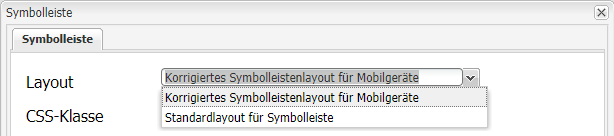
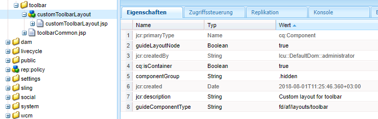
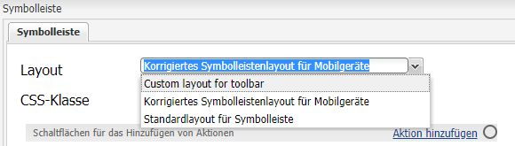
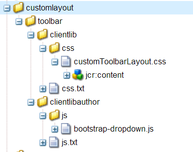

# Erstellen eines benutzerdefinierten Symbolleistenlayouts{#creating-custom-toolbar-layout}

## Symbolleistenlayouts {#layout}

Wenn Sie ein adaptives Formular erstellen, können Sie ein Symbolleistenlayout für das Formular festlegen. Das Symbolleistenlayout definiert die Befehle und das Layout der Symbolleiste im Formular.

Die Verwendungen des Symbolleistenlayouts hängen stark von der clientseitigen Verarbeitung ab, die von komplexem JavaScript- und CSS-Code gesteuert wird. Die Organisation und Optimierung der Bereitstellung dieses Codes kann äußerst kompliziert sein. Um Abhilfe zu schaffen, stellt AEM clientseitige Bibliotheksordner zur Verfügung, mit denen Sie Ihren clientseitigen Code im Repository speichern, in Kategorien gruppieren und definieren können, wann und wie jede Codekategorie dem Client bereitgestellt werden soll. Das clientseitige Bibliotheksystem übernimmt dann das Erstellen der korrekten Links in der endgültigen Webseite, um den korrekten Code zu laden. Detaillierte Informationen dazu finden Sie unter [Funktionen von clientseitigen Bibliotheken in AEM.](/help/sites-developing/clientlibs.md)


Beispiellayout der Symbolleiste

Adaptive Formulare enthalten einen standardmäßigen Satz mit Layouts:



Standardmäßig verfügbare Symbolleistenlayouts

Darüber hinaus können Sie ein benutzerdefiniertes Symbolleistenlayout erstellen.

Im Folgenden werden die Schritte erläutert, um eine benutzerdefinierte Symbolleiste zu erstellen, die drei Aktionen in der Symbolleiste und die anderen Aktionen in einer Dropdown-Liste in der Symbolleiste anzeigt.

Das angehängte Inhaltspaket enthält den gesamten unten beschriebenen Code. Öffnen Sie nach der Installation des Inhaltspakets `/content/forms/af/CustomLayoutDemo.html` , um das benutzerdefinierte Symbolleistenlayout-Demo anzuzeigen.

CustomToolbarLayoutDemo.zip

[Benutzerdefiniertes ](assets/customtoolbarlayoutdemo.zip)
FileDemo-Symbolleistenlayout abrufen

## Erstellen eines benutzerdefinierten Symbolleistenlayouts {#layout-1}

1. Erstellen Sie einen Ordner für Ihre benutzerdefinierten Symbolleistenlayouts. Beispiel:

   `/apps/customlayout/toolbar`.

   Um ein benutzerdefiniertes Layout zu erstellen, können Sie eines der standardmäßigen Symbolleistenlayouts verwenden (und anpassen), die im folgenden Ordner verfügbar sind:

   `/libs/fd/af/layouts/toolbar`

   Kopieren Sie beispielsweise den Knoten `mobileFixedToolbarLayout` aus dem Ordner `/libs/fd/af/layouts/toolbar` in den Ordner `/apps/customlayout/toolbar` .

   Kopieren Sie außerdem toolbarCommon.jsp in den Ordner `/apps/customlayout/toolbar` .

   >[!NOTE]
   >
   >Der Ordner, den Sie für die benutzerdefinierten Layouts erstellen, muss mit dem Ordner `apps` erstellt werden.

1. Benennen Sie den kopierten Knoten `mobileFixedToolbarLayout` in `customToolbarLayout.` um.

   Geben Sie außerdem eine relevante Beschreibung für den Knoten an. Beispiel: Ändern Sie jcr:description des Knotens in **Benutzerdefiniertes Layout für Symbolleiste**.

   Die Eigenschaft `guideComponentType` des Knotens legt den Layouttyp fest. In diesem Fall ist der Layouttyp „Symbolleiste“. Daher wird er in der Auswahl-Dropdown-Liste für das Symbolleistenlayout angezeigt.

   

   Ein Knoten mit relevanter Beschreibung

   Das neue benutzerdefinierte Symbolleistenlayout wird im Dialogfeld **Adaptive Form Toolbar** (Symbolleiste des adaptiven Formulars) angezeigt.

   

   Liste der verfügbaren Symbolleistenlayouts

   >[!NOTE]
   >
   >Die Beschreibung, die im vorherigen Schritt aktualisiert wurde, wird in der Dropdown-Liste „Layout“ angezeigt.

1. Wählen Sie dieses benutzerdefinierte Symbolleistenlayout und klicken Sie auf „OK“.

   Fügen Sie clientlib (javascript und css) im Knoten `/etc/customlayout` hinzu und fügen Sie den Verweis der clientlib in den Knoten `customToolbarLayout.jsp` ein.

   

   Pfad der Datei customToolbarLayout.css

   Beispiel `customToolbarLayout.jsp`:

   ```jsp
   <%@include file="/libs/fd/af/components/guidesglobal.jsp" %>
   <cq:includeClientLib categories="customtoolbarlayout" />
   <c:if test="${isEditMode}">
           <cq:includeClientLib categories="customtoolbarlayoutauthor" />
   </c:if>
   <div class="guidetoolbar mobileToolbar mobilecustomToolbar" data-guide-position-class="guide-element-hide">
       <div data-guide-scroll-indicator="true"></div>
       <%@include file="../toolbarCommon.jsp" %>
   </div>
   ```

   >[!NOTE]
   >
   >Fügen Sie die guidetoolbar-Klasse für das Layout hinzu. Die standardmäßigen Stile für die Symbolleiste werden im Hinblick auf die guidetoolbar-Klasse definiert.

   Beispiel `toolBarCommon.jsp`:

   ```jsp
   <%@taglib prefix="fn" uri="https://java.sun.com/jsp/jstl/functions"%>
   <%--------------------
   This code iterates over all the tool bar items using the guideToolbar bean.
   If the number of toolbar items are more than 3, then we create a dropdown menu using bootstrap for other actions present in the toolbar.
   In both desktop and mobile devices, the layout is different.
   ---------------------------------%>
   
   <c:forEach items="${guideToolbar.items}" var="toolbarItem" varStatus="loop">
       <c:choose>
         <c:when test="${loop.index gt 2}">
      <c:choose>
       <c:when test="${loop.index eq 3}">
                     <div class="btn-group dropdown">
                       <button type="button" class="btn btn-primary dropdown-toggle label" data-toggle="dropdown">Actions <span class="caret"></code></button>
                       <button type="button" class="btn btn-primary dropdown-toggle icon" data-toggle="dropdown"><span class="glyphicon glyphicon-th-list"></code></button>
             <ul class="dropdown-menu" role="menu">
                           <li>
                               <div id="${toolbarItem.id}_guide-item">
                                 <sling:include path="${toolbarItem.path}" resourceType="${toolbarItem.resourceType}"/>
                              </div>
                           </li>
                           <c:if test="${loop.index eq (fn:length(guideToolbar.items)-1)}">
                                </ul>
                                </div>
                           </c:if>
       </c:when>
       <c:when test="${loop.index eq (fn:length(guideToolbar.items)-1)}">
                          <li>
                                     <div id="${toolbarItem.id}_guide-item">
                                         <sling:include path="${toolbarItem.path}" resourceType="${toolbarItem.resourceType}"/>
                                     </div>
                           </li>
                       </ul>
                     </div>
   
       </c:when>
       <c:otherwise>
         <li>
          <div id="${toolbarItem.id}_guide-item">
           <sling:include path="${toolbarItem.path}" resourceType="${toolbarItem.resourceType}"/>
          </div>
         </li>
       </c:otherwise>
      </c:choose>
         </c:when>
         <c:otherwise>
     <div id="${toolbarItem.id}_guide-item">
           <sling:include path="${toolbarItem.path}" resourceType="${toolbarItem.resourceType}"/>
        </div>
         </c:otherwise>
    </c:choose>
   </c:forEach>
   ```

   Die CSS innerhalb des Knotens clientlib:

   ```css
   .mobilecustomToolbar .dropdown {
       display: inline-block;
   }
   
   .mobilecustomToolbar .dropdown {
       float: right;
   }
   
   .mobilecustomToolbar .dropdown > button {
      padding: 6px 12px;
   }
   
   .mobilecustomToolbar .dropdown .guideFieldWidget, .mobilecustomToolbar .dropdown .guideFieldWidget button {
       width: 100%;
   }
   
   .mobilecustomToolbar .dropdown .caret{
       border-bottom: 6px solid;
       border-right: 6px solid transparent;
       border-left: 6px solid transparent;
    border-top: transparent;
   }
   
   .mobilecustomToolbar .dropdown-menu{
    top: auto;
    bottom: 100%;
   }
   
   .mobilecustomToolbar .btn-group {
    vertical-align: super;
   }
   
   .mobilecustomToolbar .glyphicon {
    font-size: 24px;
   }
   
   @media (max-width: 767px){
   
    .mobilecustomToolbar .dropdown .guideButton .iconButton-icon {
      display: none;
       }
   
       .mobilecustomToolbar .dropdown .guideButton .iconButton-label {
      display: inline-block;
       }
   
       .mobilecustomToolbar .dropdown .guideButton button {
      background-color: #013853;
       }
   
    .mobilecustomToolbar .btn-group {
     vertical-align: top;
    }
   
   }
   ```

>[!NOTE]
>
>Die Beschreibung, die im vorherigen Schritt aktualisiert wurde, wird in der Dropdown-Liste „Layout“ angezeigt.


Desktop-Ansicht der Symbolleiste mit benutzerdefiniertem Layout
