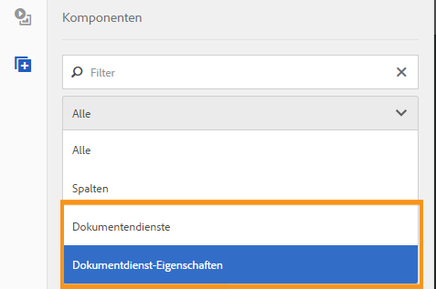
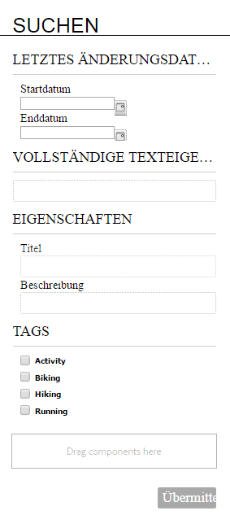
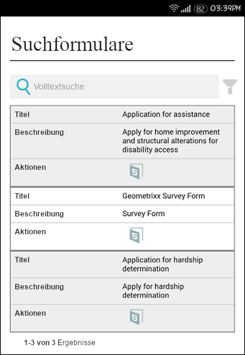

# Anpassen einer Formularportal-Seite{#creating-a-forms-portal-page}

| Version | Artikel-Link |
| -------- | ---------------------------- |
| AEM as a Cloud Service | [Hier klicken](https://experienceleague.adobe.com/docs/experience-manager-cloud-service/content/forms/adaptive-forms-authoring/authoring-adaptive-forms-foundation-components/configure-forms-portal.html?lang=de) |
| AEM 6.5 | Dieser Artikel |

Forms Portal-Komponenten bieten Webentwicklern Komponenten zum Erstellen und Anpassen von Formularportalen auf mit Adobe Experience Manager (AEM) erstellten Websites. Einen kurzen Überblick über Forms Portal finden Sie unter [Einführung in das Veröffentlichen von Formularen in einem Portal](../../forms/using/introduction-publishing-forms.md).

## Voraussetzungen {#prerequisites}

Forms Portal-Komponenten sind nicht standardmäßig verfügbar. Stellen Sie sicher, dass die folgenden Forms Portal-Komponentenkategorien aktiviert sind, wie unter [Aktivieren der Komponenten im Forms Portal](/help/forms/using/enabling-forms-portal-components.md).

**Dokumenten-Services**: Umfasst die Komponenten „Suche und Auflister“, „Link“ und „Entwürfe und Übermittlungen“.

**Document Services-Eigenschaften** Umfasst die Komponenten &quot;Date Predicate&quot;, &quot;Full Text Predicate&quot;, &quot;Properties Predicate&quot;und &quot;Tags Predicate&quot;. Diese Komponenten werden zum Konfigurieren der Suche in der Komponente &quot;Search &amp; Lister&quot;verwendet.

Sobald sie auf einer AEM Sites-Seite aktiviert sind, stehen diese Komponentenkategorien für die Verwendung im Komponenten-Browser zur Verfügung.

Forms Portal-Komponentenkategorien

## Komponente &quot;Search &amp; Lister&quot; {#search-amp-lister-component}

Die Komponente &quot;Search &amp; Lister&quot;, die unter der Komponentenkategorie &quot;Document Services&quot;verfügbar ist, wird verwendet, um Formulare auf einer Seite aufzulisten und die Suche in den aufgeführten Formularen zu implementieren. Die Komponente umfasst zwei Bereiche:

* Listenbereich, in dem die Formulare aufgeführt sind.
* Suchbereich, in dem Sie die Suchfunktion hinzufügen.

Sie können die Komponente „Suche und Auflister“ aus der Komponentenkategorie des Dokumenten-Services im Komponenten-Browser per Drag-und-Drop auf die Seite ziehen. Ist die Komponente hinzugefügt, sieht sie beispielsweise wie folgt aus.

Komponente &quot;Search &amp; Lister&quot;auf einer Seite mit Rasterlayout

### Listenbereich {#list-pane}

Im Listenbereich werden die Formulare aufgeführt. Die Komponente „Search &amp; Lister“ bietet unterschiedliche Konfigurationsoptionen, mit denen Sie die Anzeige von Formularen im Listenbereich steuern können.

Um den Listenbereich zu konfigurieren, wählen Sie die Komponente &quot;Search and Lister&quot;aus und klicken Sie auf . Das Dialogfeld **[!UICONTROL Komponente bearbeiten]** wird geöffnet.

Listenbereich im Bearbeitungsmodus

Das Dialogfeld **Bearbeiten** enthält mehrere Registerkarten mit Konfigurationsoptionen (siehe Tabelle unten). Auswählen **OK** , um die Konfiguration zu speichern.

<table>
 <tbody>
  <tr>
   <th>Tab</th>
   <th>Konfiguration</th>
   <th>Beschreibung</th>
  </tr>
  <tr>
   <td><strong>Asset-Ordner</strong></code></td>
   <td>Element hinzufügen</td>
   <td>Konfiguriert die Ordner, in die Assets mit der AEM Forms-Benutzeroberfläche hochgeladen werden. Standardmäßig werden alle hochgeladenen Assets aufgelistet. Weitere Informationen zur AEM Forms-Benutzeroberfläche finden Sie unter <a href="../../forms/using/introduction-managing-forms.md" target="_blank">Einführung in das Verwalten von Formularen</a>.</td>
  </tr>
  <tr>
   <td>
<strong>Anzeige</strong></code>
 </td>
   <td>Titeltext</td>
   <td>Titel für die Komponente "Search &amp; Lister". Der Standardtitel lautet <strong>Forms Portal.</strong></td>
  </tr>
  <tr>
   <td> </td>
   <td>Layout-Vorlage</td>
   <td>Layout der Assets. </td>
  </tr>
  <tr>
   <td> </td>
   <td>Erweiterte Suche deaktivieren</td>
   <td>Wenn diese Option aktiviert ist, wird das Symbol für die erweiterte Suche ausgeblendet.</td>
  </tr>
  <tr>
   <td> </td>
   <td>Textsuche deaktivieren</td>
   <td>Wenn diese Option aktiviert ist, wird die Suchleiste für die Volltextsuche ausgeblendet.</td>
  </tr>
  <tr>
   <td><strong>Ergebnis</strong></code></td>
   <td>Anzahl der Ergebnisse pro Seite</td>
   <td>Konfiguriert die maximale Anzahl von Formularen, die auf einer Seite angezeigt werden sollen.</td>
  </tr>
  <tr>
   <td> </td>
   <td>Ergebnistext</td>
   <td>
Konfiguriert den Ergebnistext (z. B. 1-12 von 601 <strong>Ergebnisse</strong>). Der Standardwert ist <strong>Ergebnisse</strong>.
 
Wenn Sie beispielsweise in diesem Feld <strong>Formulare</strong> angeben und es insgesamt 601 Formulare gibt, wird der Ergebnistext in „1-12 von 601 <strong>Formularen</strong>“ geändert.
 </td>
  </tr>
  <tr>
   <td> </td>
   <td>Seitentext</td>
   <td>
Konfiguriert den Seitentext (zum Beispiel <strong>Seite</strong> 1 von 51). Der Standardwert ist <strong>Seite</strong>.
 
Wenn Sie zum Beispiel in diesem Feld <strong>Antragsformular</strong> angeben und es gibt 51 Seiten, ändert sich der Seitentext in „<strong>Antragsformular</strong> 1 von 51“.
 </td>
  </tr>
  <tr>
   <td> </td>
   <td>Text für „Von“</td>
   <td>
Ersetzt das Wort <strong>von</strong> durch den angegebenen Text (Seite 1 <strong>von </strong>51). Der Standardwert ist <strong>von</strong>.
 
Wenn Sie zum Beispiel in diesem Feld <strong>von insgesamt</strong> angeben, ändert sich der Text in „Seite 1 <strong>von insgesamt</strong> 51“.
 </td>
  </tr>
  <tr>
   <td><strong>Formular-Link</strong></code></td>
   <td>Render-Typ</td>
   <td>Steuert die Auflistung von Formularen, die auf dem angegebenen Rendertyp basieren. Die verfügbaren Optionen sind PDF und HTML. Wenn Sie beispielsweise nur HTML als Rendertyp auswählen, werden die PDF forms herausgefiltert.</td>
  </tr>
  <tr>
   <td> </td>
   <td>HTML-Profil</td>
   <td>Konfiguriert das HTML-Profil, das für das Rendering verwendet werden soll. Alle verfügbaren Profile werden in der Dropdown-Liste aufgeführt.</td>
  </tr>
  <tr>
   <td> </td>
   <td>Übermittlungs-URL</td>
   <td>
Konfiguriert ein Servlet, an das die Formulardaten gesendet werden.
 
<strong>Hinweis:</strong> <em>Die Sende-URL für ein Formular kann an mehreren Stellen angegeben werden und die Rangfolge lautet wie folgt:</em>

    <ol>
     <li><em>Die Sende-URL, die in das Formular eingebettet wird (in der Senden-Schaltfläche), hat die höchste Priorität.</em></li>
     <li><em>Die Sende-URL, die in der AEM Forms -Benutzeroberfläche erwähnt wird, hat die zweithöchste Priorität.</em></li>
     <li><em>Die Sende-URL, die im Forms Portal erwähnt wird, hat die niedrigste Priorität.</em></li>
    </ol> </td>
  </tr>
  <tr>
   <td> </td>
   <td>QuickInfo zu HTML Render Action</td>
   <td>Konfiguriert den Text für die QuickInfo, die angezeigt wird, wenn Sie den Mauszeiger über das  (HTML5-Symbol).</td>
  </tr>
  <tr>
   <td> </td>
   <td>QuickInfo zu PDF Render Action</td>
   <td>Konfiguriert den Text für die QuickInfo, die angezeigt wird, wenn Sie den Mauszeiger über das  (PDF-Symbol).</td>
  </tr>
  <tr>
   <td><strong>Stil</strong></code></td>
   <td>Style Type (Stiltyp)</td>
   <td>Ermöglicht Ihnen die Auswahl von <strong>Kein Stil, Standardstil</strong>oder <strong>Benutzerdefinierter Stil </strong>für die Auflistung der Formulare.</td>
  </tr>
  <tr>
   <td> </td>
   <td>Pfad für benutzerdefinierten Stil</td>
   <td>Wenn Sie "Benutzerdefiniert"als Stiltyp ausgewählt haben, geben Sie den Pfad zum benutzerdefinierten CSS an, wählen Sie andernfalls "Standard"aus.</td>
  </tr>
 </tbody>
</table>

### Suchbereich {#search-pane}

Über den Suchbereich können Sie die Komponenten „Date Predicate“, „Full Text Predicate“, „Properties Predicate“ und „Tags Predicate“ aus der Kategorie „Document Services Predicates“ im AEM Sidekick hinzufügen. Diese Komponenten implementieren die Suchfunktion, mit der Benutzer nach den aufgeführten Formularen suchen können.

**Tipp:** *Sie können anhand vorgegebener Kriterien die Liste der Formulare festlegen, die im Formularportal angezeigt werden, und die Suchfunktion für Endbenutzer ausblenden. Um die Formularliste zu steuern, verwenden Sie die Prädikatkomponenten, um Suchfilter anzuwenden. Sie können auch die Standardfilterwerte angeben und die Suche über die Registerkarte „Anzeige“ im Dialogfeld „Komponente bearbeiten“ deaktivieren.*

Suchbereich mit den Eigenschaften für Datum, Volltext, Eigenschaften und Tags

#### Datumseigenschaft {#date-predicate}

Die Komponente &quot;Date Predicate&quot;ermöglicht nach dem Hinzufügen die Suche nach den aufgelisteten Formularen, die während einer bestimmten Dauer geändert wurden.

So konfigurieren Sie die Komponente &quot;Date Predicate&quot;:

1. Wählen Sie die Komponente aus und wählen Sie dann . Das Dialogfeld „Edit “ wird geöffnet.
1. Geben Sie Folgendes an:

   * **Typ:** Die einzige verfügbare Option ist **Last Modified Date** (Letztes Änderungsdatum).

   * **Text:** Beschriftung der Komponente „Date Predicate“. Der Standardwert ist **Last Modified Date (Letztes Änderungsdatum).**

   * **Start Date Label (Startdatumsbeschriftung):** Beschriftung des Feldes „Startdatum“.
   * **End Date Label (Enddatumsbeschriftung):** Beschriftung des Feldes „Enddatum“.
   * **Ausblenden:** Damit wird der Standarddatumsfilter für die Auflistung von Formularen erzwungen. 

1. Auswählen **OK**

#### Vollständige Texteigenschaft {#full-text-predicate}

Die Komponente &quot;Full Text Predicate&quot;implementiert die Volltextsuche in Formulardaten, z. B. Name und Beschreibung. Benutzer können nach jeder beliebigen Textzeichenfolge suchen, um Formulare zurückzugeben, die den Text in ihrem Namen oder ihrer Beschreibung enthalten.

So konfigurieren Sie die Komponente &quot;Volltexteigenschaft&quot;:

1. Wählen Sie die Komponente aus und wählen Sie dann . Das Dialogfeld „Edit “ wird geöffnet.
1. Geben Sie den Titel im Feld **Haupttitel** an.
1. Auswählen **Ok**

#### Eigenschaften-Eigenschaft {#properties-predicate}

Die Komponente &quot;Eigenschaftsprädikat&quot;implementiert die Suche nach Formularen anhand von Formulareigenschaften wie Titel, Autor und Beschreibung.

So konfigurieren Sie die Komponente Eigenschaftsprädikat :

1. Wählen Sie die Komponente aus und wählen Sie dann . Das Dialogfeld „Edit “ wird geöffnet.
1. Geben Sie im Tab Allgemein den Suchtitel an. Der Standardwert ist **Eigenschaften**. 

1. Wählen Sie auf der Registerkarte Optionen die Option **Element hinzufügen.**
1. Wählen Sie eine Eigenschaft in der Dropdownliste aus und geben Sie für die Eigenschaft eine Suchbeschriftung im Feld unter der Dropdown-Liste an.
1. Wiederholen Sie Schritt 4, um weitere Eigenschaften hinzuzufügen. Sie können auch einen Standardfilterwert für die Auflistung von Formularen anhand der angegebenen Kriterien festlegen und die Eigenschaft für die Suche durch Endbenutzer ausblenden. Aktivieren Sie das Kontrollkästchen „Ausblenden“ für eine Eigenschaft und legen Sie den Standardfilterwert fest.
 Wenn Sie beispielsweise Formulare anzeigen möchten, die „Reise“ in ihrem Titel enthalten, wählen Sie „Ausblenden“ neben der Eigenschaft „Titel“. Geben Sie außerdem „Reise“ im Textfeld des Standardfilterwerts an.

1. Auswählen **OK**

#### Tag-Eigenschaft {#tags-predicate}

Die Komponente &quot;Tag-Eigenschaft&quot;implementiert die Suche nach Formularen anhand von in Forms Manager definierten Tags.

So konfigurieren Sie die Komponente &quot;Tags Predicate&quot;:

1. Wählen Sie die Komponente aus und wählen Sie dann . Das Dialogfeld „Edit “ wird geöffnet.
1. Wählen Sie die Abwärtspfeilschaltfläche neben dem Feld Tags aus.
1. Auswählen geeigneter Tags
1. Auswählen **OK**

Die ausgewählten Tags werden im Suchbereich zusammen mit den Kontrollkästchen zur Auswahl angezeigt. Benutzer können ihre Suche nun anhand der Tags eingrenzen.

## Auflisten von Formularen auf einer Seite {#list-forms-on-a-page-br}

Um Formulare auf einer Seite aufzulisten, fügen Sie die Komponente **[!UICONTROL Search &amp; Lister]** der Seite hinzu und konfigurieren Sie den **[!UICONTROL Listenbereich]**. Damit Endbenutzer nach Formularen mit Datum, Text und Tags suchen können, fügen Sie eine **[!UICONTROL Suchbereich]** -Komponente.

Verwenden Sie die Komponente Link , um ein Formular von einer beliebigen Stelle auf der Seite aus zu verknüpfen. Weitere Informationen zu Link-Komponenten finden Sie unter [Einbetten einer Link-Komponente in eine Seite](../../forms/using/embedding-link-component-page.md).

Verwenden Sie zum Auflisten der Formulare, die sich im Entwurfsstatus befinden, und der bereits gesendeten Formulare die **[!UICONTROL Entwürfe und Übermittlungen]** -Komponente. Weitere Informationen finden Sie unter [Anpassen der Komponente &quot;Drafts and Submissions&quot;](../../forms/using/draft-submission-component.md).

## Mobilgerätefreundlichkeit {#mobile-device-friendliness}

Die Forms Portal-Komponente &quot;Search &amp; Lister&quot;ist für Mobilgeräte benutzerfreundlich und passt sich entsprechend an. Das Layout aller drei Standardansichten (Raster, Karten, Bedienfeld) wird entsprechend dem Gerät, auf dem die Site geöffnet wird, angepasst, vorausgesetzt, die Webseite passt sich ebenfalls an. Die einfache Tatsache ist, dass &quot;Search &amp; Lister&quot;nur eine Komponente ist und nicht für die Formatierung auf Seitenebene gilt.

Die folgende Abbildung zeigt die Komponente &quot;Search &amp; Lister&quot;, wenn sie auf einem Mobilgerät geöffnet wird:

Komponente „Search &amp; Lister“

## Anpassen einer Forms Portal-Seite {#customizing-a-forms-portal-page-br}

Sie können eine Forms Portal-Seite anpassen und ihr ein unverwechselbares Erscheinungsbild verleihen. Sie können auch Metadaten hinzufügen, um die Suchabfrage zu verbessern, das Layout der Seite zu ändern und benutzerdefinierte CSS-Stile hinzuzufügen. Weitere Informationen finden Sie unter [Anpassen von Vorlagen für Formularportalkomponenten](../../forms/using/customizing-templates-forms-portal-components.md).

Über die AEM Forms-Benutzeroberfläche können Sie benutzerdefinierte Metadaten zu Formularen hinzufügen. Benutzerdefinierte Metadaten sind nützlich, um Endbenutzern eine Auflistung und ein Sucherlebnis für Formulare bereitzustellen. Weitere Informationen zu benutzerdefinierten Metadaten finden Sie unter [Anpassen von Vorlagen für Formularportalkomponenten](../../forms/using/customizing-templates-forms-portal-components.md).

Standardmäßig bietet das Forms Portal Renderaktionen. Sie können Forms Portal anpassen, um weitere Aktionen hinzuzufügen. Detaillierte Informationen finden Sie unter [Hinzufügen benutzerdefinierter Aktionen zu Formularlistenelementen.](../../forms/using/add-custom-action-form-lister.md)

## Ähnliche Artikel

* [Aktivieren von Formularportalkomponenten](/help/forms/using/enabling-forms-portal-components.md)
* [Erstellen einer Formularportalseite](/help/forms/using/creating-form-portal-page.md)
* [Auflisten von Formularen auf einer Webseite mithilfe von APIs](/help/forms/using/listing-forms-webpage-using-apis.md)
* [Verwenden der Komponente „Entwurf und Übermittlung“](/help/forms/using/draft-submission-component.md)
* [Anpassen der Speicherung von Entwürfen und gesendeten Formularen](/help/forms/using/draft-submission-component.md)
* [Beispiel zur Integrierung der Komponente für Entwurf und Übermittlung in die Datenbank](/help/forms/using/integrate-draft-submission-database.md)
* [Anpassen von Vorlagen für Forms Portal-Komponenten](/help/forms/using/customizing-templates-forms-portal-components.md)
* [Einführung in das Veröffentlichen von Formularen in einem Portal](/help/forms/using/introduction-publishing-forms.md)
