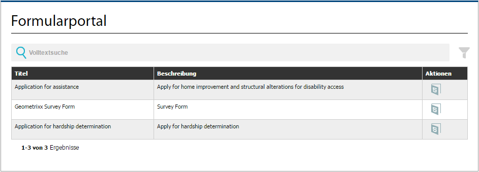
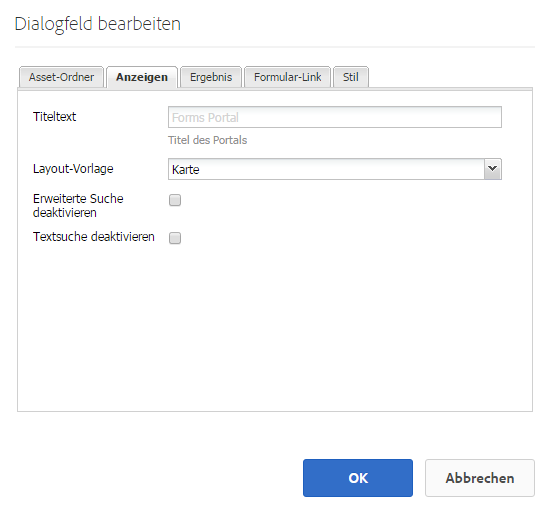

# Erstellen einer Forms Portal-Seite{#creating-a-forms-portal-page}

Forms Portal-Komponenten bieten Webentwicklern Komponenten zum Erstellen und Anpassen von Formularportalen auf mit Adobe Experience Manager (AEM) erstellten Websites. Einen kurzen Überblick über Forms Portal finden Sie unter [Einführung in das Veröffentlichen von Formularen in einem Portal](../../forms/using/introduction-publishing-forms.md).

## Voraussetzungen {#prerequisites}

Forms Portal-Komponenten stehen nicht standardmäßig zur Verfügung. Stellen Sie sicher, dass die folgenden Forms Portal-Komponentenkategorien aktiviert sind, wie unter [Aktivieren der Komponenten im Forms Portal](/help/forms/using/enabling-forms-portal-components.md) beschrieben.

**Document** ServicesUmfasst die Komponenten &quot;Search &amp; Lister&quot;, &quot;Link&quot;und &quot;Drafts and Submissions&quot;.

**Document Services-Eigenschaften**: Umfasst die Komponenten „Date Predicate“, „Full Text Predicate“, „Properties Predicate“ und Tags Predicate. Diese Komponenten werden zum Konfigurieren der Suche in der Komponente „Search &amp; Lister“ verwendet.

Sobald sie auf einer AEM-Site-Seite aktiviert sind, stehen diese Komponentenkategorien für die Verwendung im Komponenten-Browser zur Verfügung.

Forms Portal-Komponentenkategorien

## Komponente „Search &amp; Lister“{#search-amp-lister-component}

Die Komponente „Search &amp; Lister“, die in der Document Services- Komponentenkategorie verfügbar ist, dient zum Auflisten von Formularen auf einer Seite und zur Implementierung der Suche nach den aufgelisteten Formularen. Die Komponente umfasst zwei Bereiche:

* Listenbereich, in dem die Formulare aufgeführt sind.
* Suchbereich, in dem Sie die Suchfunktion hinzufügen.

Sie können die Komponente &quot;Search &amp; Lister&quot;aus der Document Services-Komponentenkategorie im Komponenten-Browser auf die Seite ziehen. Ist die Komponente hinzugefügt, sieht sie beispielsweise wie folgt aus.

Komponente „Search &amp; Lister“ auf einer Seite mit Rasterlayout

### Listenbereich {#list-pane}

Im Listenbereich werden die Formulare aufgeführt. Die Komponente „Search &amp; Lister“ bietet unterschiedliche Konfigurationsoptionen, mit denen Sie die Anzeige von Formularen im Listenbereich steuern können.

Um den Listenbereich zu konfigurieren, tippen Sie auf die Komponente &quot;Search and Lister&quot;und dann auf . Das Dialogfeld **[!UICONTROL Komponente bearbeiten]** wird geöffnet.

Listenbereich im Bearbeitungsmodus

Das Dialogfeld **Bearbeiten** enthält mehrere Registerkarten mit Konfigurationsoptionen (siehe Tabelle unten). Tippen Sie auf **OK**, um die Konfiguration zu speichern, wenn Sie fertig sind.

<table>
 <tbody>
  <tr>
   <th>Registerkarte</th>
   <th>Konfiguration</th>
   <th>Beschreibung</th>
  </tr>
  <tr>
   <td><strong>Asset-Ordner</strong></code></td>
   <td>Element hinzufügen</td>
   <td>Konfiguriert die Ordner, in die Assets mit der AEM Forms-Benutzeroberfläche hochgeladen werden. Standardmäßig werden alle hochgeladenen Assets aufgeführt. Weitere Informationen zur AEM Forms-Benutzeroberfläche finden Sie in <a href="../../forms/using/introduction-managing-forms.md" target="_blank">Einführung zum Verwalten von Formularen</a>.</td>
  </tr>
  <tr>
   <td>
<strong>Anzeige</strong></code>
 </td>
   <td>Titeltext</td>
   <td>Titel für die Komponente „Seach &amp; Lister“. Der Standardtitel ist <strong>Forms Portal</strong>.</td>
  </tr>
  <tr>
   <td> </td>
   <td>Layout-Vorlage</td>
   <td>Layout der Assets. </td>
  </tr>
  <tr>
   <td> </td>
   <td>Erweiterte Suche deaktivieren</td>
   <td>Wenn diese Option aktiviert ist, wird das Symbol zur erweiterten Suche ausgeblendet.</td>
  </tr>
  <tr>
   <td> </td>
   <td>Textsuche deaktivieren</td>
   <td>Wenn diese Option aktiviert ist, wird die Suchleiste für die Volltextsuche ausgeblendet.</td>
  </tr>
  <tr>
   <td><strong>Ergebnis</strong></code></td>
   <td>Number Of Results Per Page (Anzahl Ergebnisse pro Seite)</td>
   <td>Konfiguriert die maximale Anzahl von Formularen, die auf einer Seite angezeigt werden sollen.</td>
  </tr>
  <tr>
   <td> </td>
   <td>Ergebnistext</td>
   <td>
Konfiguriert den Ergebnistext (zum Beispiel 1-12 von 601 <strong>Ergebnissen</strong>). Der Standardwert ist <strong>Ergebnissen</strong>.
 
Wenn Sie beispielsweise <strong>Forms </strong>in dieses Feld eingeben und insgesamt 601 Formulare vorhanden sind, wird der Ergebnistext in 1-12 von 601 <strong>Forms.</strong>
 </td>
  </tr>
  <tr>
   <td> </td>
   <td>Seitentext</td>
   <td>
Konfiguriert den Seitentext (z. B. <strong>Seite </strong>1 von 51). Der Standardwert ist <strong>Seite</strong>.
 
Wenn Sie beispielsweise <strong>Antragsformular </strong>in dieses Feld eingeben und es 51 Seiten gibt, ändert sich der Seitentext in <strong>Antragsformular </strong>1 von 51.
 </td>
  </tr>
  <tr>
   <td> </td>
   <td>Text für „Von“</td>
   <td>
Ersetzt das Wort <strong>von</strong> durch den angegebenen Text (Seite 1 <strong>von </strong>51). Der Standardwert ist <strong>von</strong>.
 
Wenn Sie beispielsweise <strong>von </strong>in diesem Feld angeben, ändert sich der Text in Seite 1 <strong>von </strong>51.
 </td>
  </tr>
  <tr>
   <td><strong>Formular-Link</strong></code></td>
   <td>Render Type (Rendertyp)</td>
   <td>Steuert die Auflistung von Formularen, die auf dem angegebenen Rendertyp basieren. Die verfügbaren Optionen sind PDF und HTML. Wenn Sie beispielsweise nur HTML als Rendertyp angeben, werden die PDF-Formulare herausgefiltert.</td>
  </tr>
  <tr>
   <td> </td>
   <td>HTML Profile (HTML-Profil)</td>
   <td>Konfiguriert das HTML-Profil, das für die Wiedergabe verwendet wird. Alle verfügbaren Profile werden in der Dropdown-Liste aufgeführt.</td>
  </tr>
  <tr>
   <td> </td>
   <td>Submit URL (Sende-URL)</td>
   <td>
Konfiguriert ein Servlet, an das die Formulardaten gesendet werden.
 
<strong>Hinweis:</strong> <em>Die Sende-URL für ein Formular kann an mehreren Stellen angegeben werden. Die Rangfolge ist dabei die Folgende:</em>

    <ol>
     <li><em>Die Sende-URL, die in das Formular eingebettet wird (in der Senden-Schaltfläche), hat die höchste Priorität.</em></li>
     <li><em>Die Sende-URL, die in der AEM Forms -Benutzeroberfläche erwähnt wird, hat die zweithöchste Priorität.</em></li>
     <li><em>Die Sende-URL, die im Forms Portal erwähnt wird, hat die niedrigste Priorität.</em></li>
    </ol> </td>
  </tr>
  <tr>
   <td> </td>
   <td>HTML Render Action tool tip (HTML-Rendervorgangs-QuickInfo)</td>
   <td>Konfiguriert den Text für die QuickInfo, die angezeigt wird, wenn Sie den Zeiger über das  (HTML5-Symbol) bewegen.</td>
  </tr>
  <tr>
   <td> </td>
   <td>PDF Render Action tool tip (PDF-Rendervorgangs-QuickInfo)</td>
   <td>Konfiguriert den Text für die QuickInfo, die angezeigt wird, wenn Sie den Zeiger über das  (PDF-Symbol) bewegen.</td>
  </tr>
  <tr>
   <td><strong>Stil</strong></code></td>
   <td>Style Type (Stiltyp)</td>
   <td>Ermöglicht die Angabe von <strong>No Style, Default Style</strong> oder <strong>Custom Style </strong>für die Auflistung der Formulare.</td>
  </tr>
  <tr>
   <td> </td>
   <td>Custom Style Path (Pfad für benutzerdefinierten Stil)</td>
   <td>Wenn Sie als „Style Type“ (Stiltyp) „Custom“ (Benutzerdefiniert) ausgewählt haben, geben Sie den Pfad zum benutzerdefinierten CSS an, oder wählen Sie ansonsten „Default“ (Standard).</td>
  </tr>
 </tbody>
</table>

### Suchbereich {#search-pane}

Über den Suchbereich können Sie die Komponenten „Date Predicate“, „Full Text Predicate“, „Properties Predicate“ und „Tags Predicate“ aus der Kategorie „Document Services Predicates“ im AEM Sidekick hinzufügen. Diese Komponenten implementieren die Suchfunktion, mit der Benutzer nach den aufgeführten Formularen suchen können.

**Tipp:** *Sie können anhand vorgegebener Kriterien die Liste der Formulare festlegen, die im Formularportal angezeigt werden, und die Suchfunktion für Endbenutzer ausblenden. Um die Formularliste zu steuern, verwenden Sie die Prädikatkomponenten, um Suchfilter anzuwenden. Sie können auch die Standardfilterwerte angeben und die Suche auf der Registerkarte Anzeige des Dialogfelds Komponente bearbeiten deaktivieren.*

Suchbereich mit den Eigenschaften für Datum, Volltext, Eigenschaften und Tags

#### Datumseigenschaft {#date-predicate}

Die Komponente „Date Predicate“ ermöglicht die Suche nach aufgeführten Formularen, die während eines festgelegten Zeitraums geändert wurden.

Konfigurieren der Komponente „Date Predicate“:

1. Tippen Sie auf die Komponente und dann auf . Das Dialogfeld „Edit “ wird geöffnet.
1. Geben Sie Folgendes an:

   * **Typ:** Die einzige verfügbare Option ist **Last Modified Date** (Letztes Änderungsdatum).

   * **Text:** Beschriftung der Komponente „Date Predicate“. Der Standardwert ist **Last Modified Date (Letztes Änderungsdatum).**

   * **Start Date Label (Startdatumsbeschriftung):** Beschriftung des Feldes „Startdatum“.
   * **End Date Label (Enddatumsbeschriftung):** Beschriftung des Feldes „Enddatum“.
   * **Ausblenden:** Damit wird der Standarddatumsfilter für die Auflistung von Formularen erzwungen. 

1. Tippen Sie auf **OK**

#### Vollständige Texteigenschaft {#full-text-predicate}

Die Komponente „Full Text Predicate“ implementiert die Volltextsuche nach Formulardaten, zum Beispiel Name und Beschreibung. Benutzer können nach jeder beliebigen Textzeichenfolge suchen, um Formulare zurückzugeben, die den Text in ihrem Namen oder ihrer Beschreibung enthalten.

Konfigurieren der Komponente „Volltexteigenschaft“:

1. Tippen Sie auf die Komponente und dann auf . Das Dialogfeld „Edit “ wird geöffnet.
1. Geben Sie den Titel im Feld **Haupttitel** an.
1. Tippen Sie auf **OK**.

#### Eigenschaften-Eigenschaft {#properties-predicate}

Die Komponente „Properties Predicate“ implementiert die Suche nach Formularen anhand von Formulareigenschaften, wie Titel, Autor und Beschreibung.

Konfigurieren der Komponente „Properties Predicate“:

1. Tippen Sie auf die Komponente und dann auf . Das Dialogfeld „Edit “ wird geöffnet.
1. Geben Sie auf der Registerkarte „Allgemein“ die Suchbeschriftung an. Der Standardwert ist **Eigenschaften**. 

1. Tippen Sie auf der Registerkarte „Optionen“ auf **Element hinzufügen**.
1. Wählen Sie eine Eigenschaft in der Dropdownliste aus und geben Sie für die Eigenschaft eine Suchbeschriftung im Feld unter der Dropdown-Liste an.
1. Wiederholen Sie Schritt 4, um weitere Eigenschaften hinzuzufügen. Sie können auch einen Standardfilterwert für die Auflistung von Formularen anhand der angegebenen Kriterien festlegen und die Eigenschaft für die Suche durch Endbenutzer ausblenden. Aktivieren Sie das Kontrollkästchen „Ausblenden“ für eine Eigenschaft und legen Sie den Standardfilterwert fest.
 Wenn Sie beispielsweise Formulare anzeigen möchten, die „Reise“ in ihrem Titel enthalten, wählen Sie „Ausblenden“ neben der Eigenschaft „Titel“. Geben Sie außerdem &quot;Reise&quot;im Textfeld für den Standardfilterwert an.

1. Tippen Sie auf **OK**

#### Tag-Eigenschaft {#tags-predicate}

Die Komponente „Tags Predicate“ implementiert die Suche nach Formularen anhand von in Forms Manager definierten Tags.

Konfigurieren der Komponente „Tags Predicate“:

1. Tippen Sie auf die Komponente und dann auf . Das Dialogfeld „Edit “ wird geöffnet.
1. Tippen Sie neben dem Feld „Tags“ auf den Abwärtspfeil.
1. Wählen Sie geeignete Tags aus.
1. Tippen Sie auf **OK**

Die ausgewählten Tags werden im Suchbereich zusammen mit den Kontrollkästchen zur Auswahl angezeigt. Benutzer können ihre Suche nun anhand der Tags eingrenzen.

## Auflisten von Formularen auf einer Seite {#list-forms-on-a-page-br}

Um Formulare auf einer Seite aufzulisten, fügen Sie die Komponente **[!UICONTROL Search &amp; Lister]** der Seite hinzu und konfigurieren Sie den **[!UICONTROL Listenbereich]**. Damit Endbenutzer Formulare nach Datum, Text und Tags suchen können, fügen Sie eine **[!UICONTROL Suchbereichskomponente]** hinzu.

Um einen Link zu einem Formular an einer beliebigen Stelle auf der Seite anzuzeigen, verwenden Sie die Komponente „Link“. Weitere Informationen zur Linkkomponente finden Sie unter [Einbetten der Verknüpfungskomponente in eine Seite](../../forms/using/embedding-link-component-page.md).

Um Formulare mit dem Status „Entwurf“ sowie bereits gesendete Formulare aufzulisten, verwenden Sie die Komponente **[!UICONTROL Drafts and Submissions]**. Weitere Informationen finden Sie unter [Anpassen der Komponente „Drafts and Submissions](../../forms/using/draft-submission-component.md).

## Eignung für Mobilgeräte {#mobile-device-friendliness}

Die Forms-Portal-Komponente „Search &amp; Lister“ ist für Mobilgeräte geeignet und passt sich entsprechend an. Alle drei Standardansichten: Raster-, Karten-, Bedienfeld-Layouts entsprechend dem Gerät, auf dem die Site geöffnet wird, vorausgesetzt, die Webseite passt sich ebenfalls an. Die simple Tatsache besteht darin, dass „Search &amp; Lister“ nur eine Komponente ist und nicht den Seitenstil steuert.

In der folgenden Abbildung wird die Komponente „Search &amp; Lister“ angezeigt, wenn sie auf einem Mobilgerät geöffnet wird:

Komponente „Search &amp; Lister“

## Anpassen einer Forms Portal-Seite {#customizing-a-forms-portal-page-br}

Sie können eine Forms Portal-Seite anpassen und ihr ein unverwechselbares Erscheinungsbild verleihen. Sie können auch Metadaten hinzufügen, um die Suchabfrage zu verbessern, das Layout der Seite zu ändern und benutzerdefinierte CSS-Stile hinzuzufügen. Weitere Informationen finden Sie unter [Anpassen von Vorlagen für Forms Portal-Komponenten](../../forms/using/customizing-templates-forms-portal-components.md).

In der AEM Forms-Benutzeroberfläche können Sie benutzerdefinierte Metadaten zu Formularen hinzufügen. Benutzerdefinierte Metadaten sind nützlich, wenn Sie den Endbenutzern die Auflistung und Suche von Formularen ermöglichen möchten. Weitere Informationen zu benutzerdefinierten Metadaten finden Sie unter [Anpassen von Vorlagen für Forms Portal-Komponenten](../../forms/using/customizing-templates-forms-portal-components.md).

Standardmäßig stellt Forms Portal Renderaktionen bereit. Sie können Forms Portal anpassen, um weitere Aktionen hinzuzufügen. Detaillierte Informationen finden Sie unter [Hinzufügen benutzerdefinierter Aktionen auf Formularüberwachungselementen](../../forms/using/add-custom-action-form-lister.md).

## Verwandte Artikel

* [Aktivieren von Forms Portal-Komponenten](/help/forms/using/enabling-forms-portal-components.md)
* [Forms Portal-Seite erstellen](/help/forms/using/creating-form-portal-page.md)
* [Auflisten von Formularen auf einer Webseite mithilfe von APIs](/help/forms/using/listing-forms-webpage-using-apis.md)
* [Komponente &quot;Drafts and Submissions&quot;verwenden](/help/forms/using/draft-submission-component.md)
* [Anpassen der Speicherung von Entwürfen und gesendeten Formularen](/help/forms/using/draft-submission-component.md)
* [Beispiel zur Integrierung der Komponente für Entwurf und Übermittlung in die Datenbank](/help/forms/using/integrate-draft-submission-database.md)
* [Anpassen von Vorlagen für Forms Portal-Komponenten](/help/forms/using/customizing-templates-forms-portal-components.md)
* [Einführung in das Veröffentlichen von Formularen in einem Portal](/help/forms/using/introduction-publishing-forms.md)
