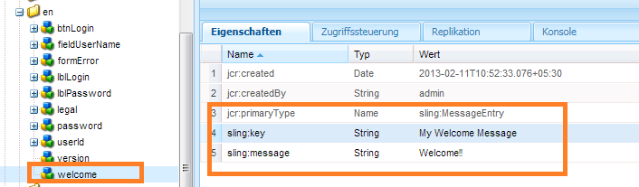

# Erstellen eines neuen Anmeldungsbildschirms{#creating-a-new-login-screen}

Sie können den Anmeldungsbildschirm aller Module von AEM Forms ändern, die den AEM Forms-Anmeldungsbildschirm verwenden. Die Änderungen wirken sich beispielsweise auf den Anmeldungsbildschirm, den Formularmanager und AEM Forms aus.

## Voraussetzung {#prerequisite}

1. Melden Sie sich bei `/lc/crx/de` mit Administratorberechtigungen an.
1. Führen Sie die folgenden Aktionen durch:

   1. Replizieren Sie die hierarchische Struktur: von `/libs/livecycle/core/content` bei `/apps/livecycle/core/content`.

      Behalten Sie die Eigenschaften (Knoten/Ordner) und Zugriffssteuerung bei.

   1. Kopieren Sie den Inhaltsordner:

      von: `/libs/livecycle/core`

      in: `/apps/livecycle/core`.

   1. Löschen Sie den Inhalt des Ordners `/apps/livecycle/core` .

1. Führen Sie die folgenden Aktionen durch:

   1. Replizieren Sie die hierarchische Struktur: von `/libs/livecycle/core/components/login` bei `/apps/livecycle/core/components/login`. Behalten Sie die Eigenschaften (Knoten/Ordner) und Zugriffssteuerung bei.

   1. Kopieren Sie den Komponentenordner: von `/libs/livecycle/core` bis `/apps/livecycle/core`.

   1. Löschen Sie den Inhalt des Ordners: `/apps/livecycle/core/components/login`.

### Hinzufügen eines neuen Gebietsschemas {#adding-a-new-locale}

1. Kopieren Sie den Ordner `i18n` :

   * von `/libs/livecycle/core/components/login`
   * in `/apps/livecycle/core/components/login`

1. Löschen Sie alle Ordner in `i18n` mit Ausnahme eines Ordners, z. B. `en`.

1. Mit dem Ordner `en` führen Sie diese Schritte durch:

   1. Benennen Sie den Ordner nach dem Gebietsschema, das unterstützt werden soll. Beispiel: `ar`.

   1. Ändern Sie den Wert der Eigenschaft `jcr:language` in `ar` (für den Ordner `ar` ).
   >[!NOTE]
   >
   >Wenn das Gebietsschema eine Sprach- und Ländercodekombination ist, beispielsweise `ar-DZ`, ändern Sie den Ordnernamen und den Eigenschaftswert zu `ar-DZ`.

1. Kopieren `login.jsp`:

   * von `/libs/livecycle/core/components/login`
   * in `/apps/livecycle/core/components/login`

1. Ändern Sie das folgende Codefragment für `/apps/livecycle/core/components/login/login.jsp`:

***Gebietsschema ist Sprachcode***

```jsp
String browserLocale = "en";

    for(int i=0; i<locales.length; i++)
    {
        String prioperty = locales[i];
        if(prioperty.trim().startsWith("en")) {
            browserLocale = "en";
            break;
        }
        if(prioperty.trim().startsWith("de")){
            browserLocale = "de";
            break;
        }
        if(prioperty.trim().startsWith("ja")){
            browserLocale = "ja";
            break;
        }
        if(prioperty.trim().startsWith("fr")){
            browserLocale = "fr";
            break;
        }
    }
```

To

```jsp
String browserLocale = "en";
    for(int i=0; i<locales.length; i++)
    {
        String prioperty = locales[i];
        if(prioperty.trim().startsWith("ar")) {
            browserLocale = "ar";
            break;
        }
        if(prioperty.trim().startsWith("en")) {
            browserLocale = "en";
            break;
        }
        if(prioperty.trim().startsWith("de")){
            browserLocale = "de";
            break;
        }
        if(prioperty.trim().startsWith("ja")){
            browserLocale = "ja";
            break;
        }
        if(prioperty.trim().startsWith("fr")){
            browserLocale = "fr";
            break;
        }
    }
```

```jsp
String browserLocale = "en";

    for(int i=0; i<locales.length; i++)
    {
        String prioperty = locales[i];
        if(prioperty.trim().startsWith("en")) {
            browserLocale = "en";
            break;
        }
        if(prioperty.trim().startsWith("de")){
            browserLocale = "de";
            break;
        }
        if(prioperty.trim().startsWith("ja")){
            browserLocale = "ja";
            break;
        }
        if(prioperty.trim().startsWith("fr")){
            browserLocale = "fr";
            break;
        }
    }
```

nach

```jsp
String browserLocale = "en";
    for(int i=0; i<locales.length; i++)
    {
        String prioperty = locales[i];
        if(prioperty.trim().equalsIgnoreCase("ar-DZ")) {
            browserLocale = "ar-DZ";
            break;
        }
        if(prioperty.trim().startsWith("en")) {
            browserLocale = "en";
            break;
        }
        if(prioperty.trim().startsWith("de")){
            browserLocale = "de";
            break;
        }
        if(prioperty.trim().startsWith("ja")){
            browserLocale = "ja";
            break;
        }
        if(prioperty.trim().startsWith("fr")){
            browserLocale = "fr";
            break;
        }
    }
```

***Standardgebietsschema ändern***

```jsp
   String browserLocale = "en";
   for(int i=0; i<locales.length; i++)

   To

   String browserLocale = "ar";
   for(int i=0; i<locales.length; i++)
```

### Hinzufügen von neuem Text oder Ändern des vorhandenen Texts {#adding-new-text-or-modifying-existing-text}

1. Ordner `i18n` kopieren:

   * von `/libs/livecycle/core/components/login`
   * in `/apps/livecycle/core/components/login`

1. Ändern Sie nun den Wert der Eigenschaft `sling:message` des Knotens (unter dem Codeordner des gewünschten Gebietsschemas) für den Sie den Text ändern möchten. Die Übersetzung wird mit dem Schlüssel durchgeführt, der im Wert der Eigenschaft `sling:key` des Knotens aufgeführt ist.

1. Zum Hinzufügen des neuen Schlüssel-Wert-Paars führen Sie die folgenden Schritte aus. Überprüfen Sie ein Beispiel auf dem darauffolgenden Screenshot.

   1. Erstellen Sie unter den Gebietsschemaordnern einen Knoten vom Typ `sling:MessageEntry` oder kopieren Sie einen vorhandenen Knoten und benennen Sie ihn um.
   1. Kopieren `login.jsp` :

      * von `/libs/livecycle/core/components/login`

      * in `/apps/livecycle/core/components/login`
   1. Ändern Sie `/apps/livecycle/core/components/login/login.jsp`, um den neu hinzugefügten Text einzufügen.

   

   ```jsp
   div class="loginContent">
   
                       <span class="loginFlow"></code>
                       <span class="loginVersion"><%= i18n.get("Version: 11.0.0") %></code>
                       <span class="loginTitle"><%= i18n.get("Login") %></code>
                       <% if (loginFailed) {%>
   ```

   nach

   ```jsp
   div class="loginContent">
   
                       <span class="loginFlow"></code>
                       <span class="loginVersion"><%= i18n.get("My Welcome Message") %></code>
                       <span class="loginVersion"><%= i18n.get("Version: 11.0.0") %></code>
                       <span class="loginTitle"><%= i18n.get("Login") %></code>
                       <% if (loginFailed) {%>
   ```

### Hinzufügen eines neuen Stils oder Ändern des vorhandenen Stils {#adding-new-style-or-modifying-existing-style}

1. Kopieren Sie den Knoten `login` :

   * von `/libs/livecycle/core/content`
   * in `/apps/livecycle/core/content`

1. Löschen Sie die Dateien `login.js` und `jquery-1.8.0.min.js` aus dem Knoten `/apps/livecycle/core/content/login.`
1. Ändern Sie die Stile in der CSS-Datei.
1. Neue Stile hinzufügen:

   1. Hinzufügen neuer Stile zu `/apps/livecycle/core/content/login/login.css`
   1. Kopieren `login.jsp`

      * von `/libs/livecycle/core/components/login`

      * in `/apps/livecycle/core/components/login`
   1. Ändern Sie `/apps/livecycle/core/components/login/login.jsp`, um die neu hinzugefügten Stile einzubinden.


Beispiel:

* Fügen Sie `/apps/livecycle/core/content/login/login.css` Folgendes hinzu.

```
css.newLoginContentArea {
    width: 700px;
    padding: 100px 0px 0px 100px;
   }
```

* Ändern Sie Folgendes in `/apps/livecycle/core/components/login.jsp`.


   ```jsp
   <div class="loginContentArea">
   ```

   nach

   ```jsp
   <div class="newLoginContentArea">
   ```

>[!NOTE]
>
>Wenn die vorhandenen Bilder in `/apps/livecycle/core/content/login` (kopiert von `/libs/livecycle/core/content/login`) entfernt werden, entfernen Sie die entsprechenden Verweise in CSS.

### Fügen Sie neue Bilder hinzu {#add-new-images}

1. Befolgen Sie die Schritte unter Hinzufügen eines neuen Stils oder Ändern des vorhandenen Stils (siehe oben).
1. Fügen Sie neue Bilder in `/apps/livecycle/core/content/login` hinzu. Bild hinzufügen:

   1. Installieren Sie den WebDAV-Client.
   1. Navigieren Sie mit dem WebDAV-Client zum Ordner `/apps/livecycle/core/content/login` . Weitere Informationen finden Sie unter: [https://dev.day.com/docs/en/crx/current/how_to/webdav_access.html](https://docs.adobe.com/docs/en/crx/current/how_to/webdav_access.html).

   1. Fügen Sie neue Bilder hinzu.

1. Fügen Sie neue Stile in `/apps/livecycle/core/content/login/login.css,` hinzu, die neuen Bildern entsprechen, die in `/apps/livecycle/core/content/login` hinzugefügt wurden.
1. Verwenden Sie die neuen Stile in `login.jsp` unter `/apps/livecycle/core/components`.

Beispiel:


```css
.newLoginContainerBkg {

 background-image: url(my_Bg.gif);
 background-repeat: no-repeat;
 background-position: left top;
 width: 727px;
}
```


    * Ändern Sie Folgendes in /apps/livecycle/core/components/login.jsp.

```jsp
<div class="loginContainerBkg">
```

nach

```jsp
<div class="newLginContainerBkg">
```
