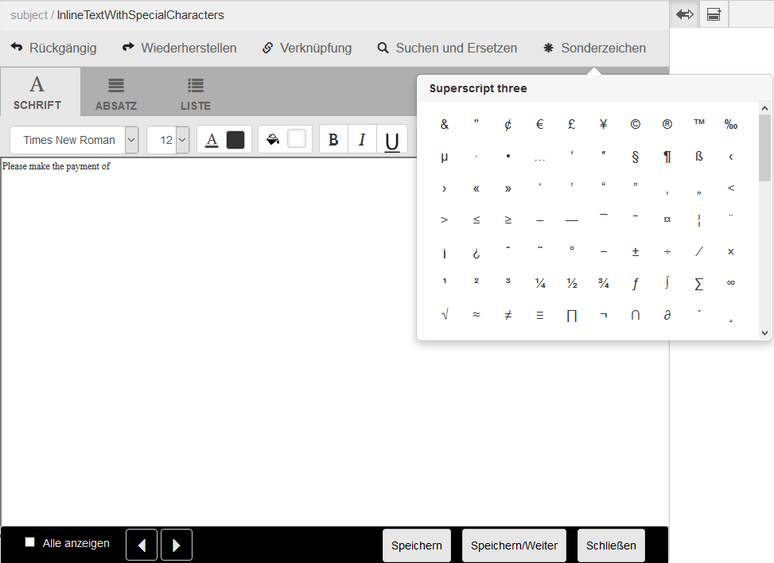

# Benutzerdefinierte Sonderzeichen in Correspondence Management{#custom-special-characters-in-correspondence-management}

## Überblick {#overview}

Correspondence Management umfasst einen integrierten Standard-Support für 210 Sonderzeichen, die Sie mühelos in Briefen einfügen können.

Sie können beispielsweise die folgenden Sonderzeichen einfügen:

* Währungssymbole wie €,¥ und £
* Mathematische Symbole wie z. B. □, , ^ und ^
* Interpunktionssymbole ‟ und&quot;

Sie können Sonderzeichen in Briefe einfügen:

* Im [Texteditor](/help/forms/using/document-fragments.md#createtext)
* In einem editierbaren [Inline-Modul in einer Korrespondenz](../../forms/using/create-correspondence.md#managecontent)

Der Administrator kann Unterstützung für mehr/benutzerdefinierte Sonderzeichen durch Anpassung hinzufügen. In diesem Artikel finden Sie Anweisungen dazu, wie Sie Unterstützung für zusätzliche benutzerdefinierte Sonderzeichen hinzufügen können.

## Hinzufügen oder Ändern von Unterstützung für benutzerdefinierte Sonderzeichen in Correspondence Management {#creatingfolderstructure}

Führen Sie die folgenden Schritte aus, um Unterstützung für benutzerdefinierte Sonderzeichen hinzuzufügen:

1. Gehen Sie zu `https://'[server]:[port]'/[ContextPath]/crx/de` und melden Sie sich als Administrator an.
1. Erstellen Sie im Ordner &quot;apps&quot;einen Ordner mit dem Namen **[!UICONTROL Sonderzeichen]** mit einem ähnlichen Pfad/einer ähnlichen Struktur wie der Ordner &quot;specialcharacters&quot;(im Ordner &quot;textEditorConfig&quot;unter &quot;libs&quot;):

   1. Klicken Sie mit der rechten Maustaste auf den Ordner **Sonderzeichen** unter folgendem Pfad und wählen Sie **Überlagerungsknoten**:

      `/libs/fd/cm/ma/gui/configuration/textEditorConfig/specialcharacters`

   1. Stellen Sie sicher, dass das Dialogfeld „Überlagerungsknoten“ die folgenden Werte enthält:

      **Pfad:** /libs/fd/cm/ma/gui/configuration/textEditorConfig/specialcharacters

      **Überlagerungsort:** /apps/

      **Knotentypen abgleichen:** Überprüft

      >[!NOTE]
      >
      >Nehmen Sie keine Änderungen in der /libs-Verzweigung vor. Alle Änderungen, die Sie vornehmen, gehen möglicherweise verloren, da diese Verzweigung sich ändern kann, wenn Sie:
      >
      >
      >
      >    * Ihre Instanz aktualisieren
      >    * Ein Hotfix anwenden
      >    * Ein Feature Pack installieren

   1. Klicken Sie auf **OK** und dann auf **Alle speichern**. Der Ordner für Sonderzeichen wird im angegebenen Pfad erstellt.

      Nach dem Erstellen des Überlagerungsknotens, überprüfen Sie die Knotenstrukturtags. Jeder Knoten, der in /Apps mit der Überlagerung erstellt wurde, sollte dieselbe Klasse und dieselben Eigenschaften haben, wie es in /libs für diesen Knoten definiert ist. Wenn eine Eigenschaft oder ein Tag in der Knotenstruktur unter /Apps fehlt, synchronisieren sie die Tags mit dem entsprechenden Knoten in /libs.

1. Stellen Sie sicher, dass der Knoten **[!UICONTROL textEditorConfig]** folgende Eigenschaften und Werte aufweist:

   | Name | Typ | Wert |
   |---|---|---|
   | cmConfigurationType | Zeichenfolge | cmTextEditorConfiguration |
   | cssPath | Zeichenfolge | /libs/fd/cm/ma/gui/components/admin/createasset/textcontrol/clientlibs/textcontrol |

1. Klicken Sie mit der rechten Maustaste auf den Ordner **[!UICONTROL Sonderzeichen]** unter folgendem Pfad und wählen Sie **Erstellen > Untergeordneter Knoten** und klicken Sie dann auf **Alle speichern**:

   /apps/fd/cm/ma/gui/configuration/textEditorConfig/specialcharacters/&lt;YourChildNode>

1. Aktualisieren Sie den Texteditor\Benutzeroberfläche „Korrespondenz erstellen“. Der Knoten, den Sie hinzugefügt haben, ist der letzte in der Liste der Sonderzeichen in der Benutzeroberfläche.
1. Klicken Sie auf **Alle speichern**.
1. Nehmen Sie die Änderungen in den Sonderzeichen wie gewünscht vor:

<table>
 <tbody>
  <tr>
   <td><strong>To...</strong></td>
   <td><strong>Führen Sie nun die folgenden Schritte durch</strong></td>
  </tr>
  <tr>
   <td>Fügen Sie ein benutzerdefiniertes Sonderzeichen hinzu</td>
   <td>
    <ol>
     <li>hinzufügen einer untergeordneten Node unter "/apps/fd/cm/ma/gui/configuration/textEditorConfig/specialcharacters"mit obligatorischen Eigenschaften.</li>
     <li>Klicken Sie auf Alle speichern</li>
     <li>Aktualisieren Sie den Texteditor/Benutzeroberfläche „Korrespondenz erstellen“, um die Änderungen anzuzeigen.</li>
    </ol> </td>
  </tr>
  <tr>
   <td>Aktualisieren Sie die Eigenschaften der vorhandenen Sonderzeichen</td>
   <td>
    <ol>
     <li>Überlagern den Knoten, der aktualisiert werden soll, wie oben erläutert und überprüfen Sie Tags und Klassen.</li>
     <li>Ändern Sie alle Werte wie Beschriftung, Wert, endValue und multipleCaption. </li>
     <li>Klicken Sie auf Alle speichern. </li>
     <li>Aktualisieren Sie den Texteditor/Benutzeroberfläche „Korrespondenz erstellen“, um die Änderungen anzuzeigen.</li>
    </ol> </td>
  </tr>
  <tr>
   <td>Ausblenden von Sonderzeichen</td>
   <td>
    <ol>
     <li>Überlagern Sie den Knoten, der unter "/apps/fd/cm/ma/gui/configuration/textEditorConfig/specialcharacters"ausgeblendet werden soll</li>
     <li>hinzufügen Eigenschaft sling:hideResource (Boolescher Wert) auf den Knoten (unter Apps), der ausgeblendet werden soll. </li>
     <li>Klicken Sie auf Alle speichern. </li>
     <li>Aktualisieren Sie den Texteditor/Benutzeroberfläche „Korrespondenz erstellen“, um die Änderungen anzuzeigen.  </li>
    </ol> </td>
  </tr>
  <tr>
   <td>Mehrere Sonderzeichen ausblenden</td>
   <td>
    <ol>
     <li>hinzufügen die Eigenschaft "sling:hideChildren (String oder String[])"in "/apps/fd/cm/ma/gui/configuration/textEditorConfig/specialcharacters". </li>
     <li>Fügen Sie Knotennamen (Sonderzeichen, die ausgeblendet werden sollen) als Werte für die Eigenschaft „sling:hideChildren“ hinzu. </li>
     <li>Klicken Sie auf Alle speichern. </li>
     <li>Aktualisieren Sie den Texteditor/Benutzeroberfläche „Korrespondenz erstellen“, um die Änderungen anzuzeigen.   </li>
    </ol> </td>
  </tr>
  <tr>
   <td>Sonderzeichen anordnen</td>
   <td>
    <ol>
     <li>hinzufügen einer untergeordneten Node unter "/apps/fd/cm/ma/gui/configuration/textEditorConfig/specialcharacters"mit obligatorischen Eigenschaften. </li>
     <li>Fügen Sie die Eigenschaft „sling:orderBefore (String)“ zum neu erstellten untergeordneten Knoten hinzu. </li>
     <li>Fügen Sie den Knotennamen als Wert vor dem neu hinzugefügten Sonderzeichen hinzu, das angezeigt werden soll. </li>
     <li>Klicken Sie auf Alle speichern. </li>
     <li>Aktualisieren Sie den Texteditor/Benutzeroberfläche „Korrespondenz erstellen“, um die Änderungen anzuzeigen.  </li>
    </ol> </td>
  </tr>
 </tbody>
</table>

