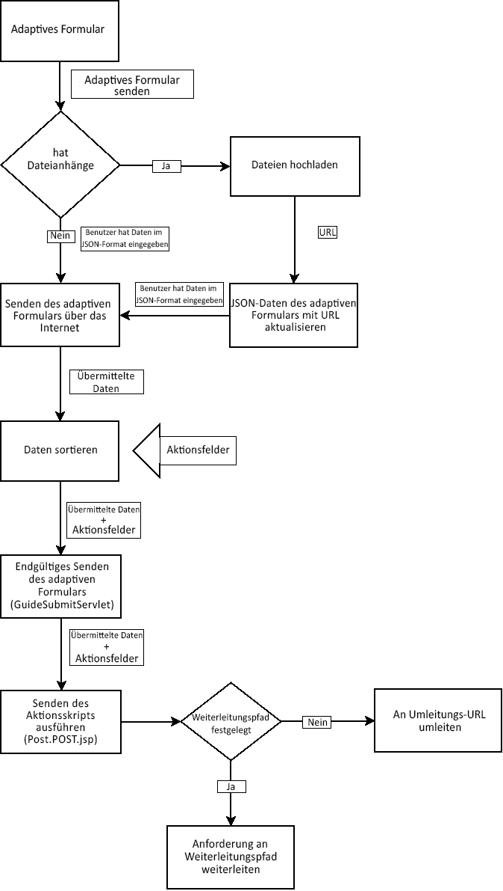
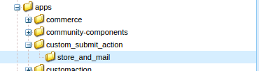
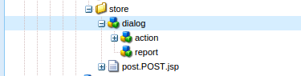
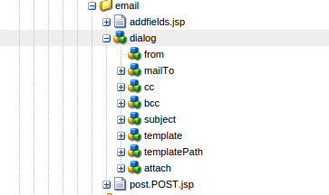

# Schreiben benutzerdefinierter Übermittlungsaktionen für adaptive Formulare{#writing-custom-submit-action-for-adaptive-forms}

Adaptive Formulare erfordern Sendeaktionen, um vom Benutzer angegebene Daten zu verarbeiten. Eine Übermittlungsaktion bestimmt die Aufgabe, die für die Daten ausgeführt wird, die Sie mit einem adaptiven Formular senden. Adobe Experience Manager (AEM) enthält [OOTB-Übermittlungsaktionen](../../forms/using/configuring-submit-actions.md), die benutzerdefinierte Aufgaben zeigen, die Sie mit den vom Benutzer übermittelten Daten ausführen können. Sie können beispielsweise Aufgaben wie das Senden von E-Mails oder das Speichern von Daten durchführen.

## Workflow für eine Übermittlungsaktion {#workflow-for-a-submit-action}

Das Flussdiagramm zeigt den Workflow für eine Übermittlungsaktion, die ausgelöst wird, wenn Sie in einem adaptiven Formular auf die Schaltfläche **[!UICONTROL Senden]** klicken. Die Dateien in der Dateianlagenkomponente werden auf den Server geladen und die Formulardaten werden mit den URLs der hochgeladenen Dateien aktualisiert. Innerhalb des Clients werden die Daten im JSON-Format gespeichert. Der Client sendet eine Ajax-Abfrage an ein internes Servlet, das die angegebenen Daten schönt und im XML-Format zurückgibt. Der Client ordnet diese Daten in Aktionsfeldern an. Die Daten werden über eine Übermittlungsaktion für Formulare an das endgültige Servlet (Guide Submit-Servlet) gesendet. Anschließend übergibt das Servlet die Steuerung an die Übermittlungsaktion. Die Übermittlungsaktion kann die Anfrage an eine andere Sling-Ressource weiterleiten oder den Browser an eine andere URL weiterleiten.



### XML-Datenformat {#xml-data-format}

Die XML-Daten werden mithilfe des Anforderungsparameters **`jcr:data`** an das Servlet gesendet. Übermittlungsaktionen können den Parameter zur Verarbeitung der Daten aufrufen. Der folgende Code beschreibt das Format der XML-Daten. Die Felder, die an das Formularmodell gebunden sind, werden im Abschnitt **`afBoundData`** angezeigt. Nicht gebundene Felder befinden sich im Bereich `afUnoundData` . Weitere Informationen zum Format der Datei `data.xml` finden Sie unter [Einführung in das Vorausfüllen von Feldern in adaptiven Formularen](../../forms/using/prepopulate-adaptive-form-fields.md).

```xml
<?xml ?>
<afData>
<afUnboundData>
<data>
<field1>value</field2>
<repeatablePanel>
    <field2>value</field2>
</repeatablePanel>
<repeatablePanel>
    <field2>value</field2>
</repeatablePanel>
</data>
</afUnboundData>
<afBoundData>
<!-- xml corresponding to the Form Model /XML Schema -->
</afBoundData>
</afData>
```

### Aktionsfelder {#action-fields}

Eine Übermittlungsaktion kann der gerenderten Formular-HTML verborgene Eingabefelder hinzufügen (mithilfe des HTML-Tags [input](https://developer.mozilla.org/de/docs/Web/HTML/Element/Input) ). Diese ausgeblendeten Felder können Werte enthalten, die bei der Verarbeitung der Formularübermittlung benötigt werden. Beim Senden des Formulars werden diese Feldwerte als Anfrageparameter zurückgesendet, die die Übermittlungsaktion bei der Übermittlungsverarbeitung verwenden kann. Die Eingabefelder werden als Aktionsfelder bezeichnet.

Beispielsweise kann eine Übermittlungsaktion, die auch die zum Ausfüllen eines Formulars benötigte Zeit erfasst, die ausgeblendeten Eingabefelder `startTime` und `endTime` hinzufügen.

Ein Skript kann die Werte der Felder `startTime` und `endTime` bereitstellen, wenn das Formular ausgegeben bzw. bevor das Formular übermittelt wird. Das Skript für die Übermittlungsaktion, `post.jsp`, kann dann mithilfe von Abfrageparametern auf diese Felder zugreifen und die für das Ausfüllen des Formulars benötigte Gesamtzeit berechnen.

### Dateianlagen {#file-attachments}

Übermittlungsaktionen können auch die Dateianlagen verwenden, die Sie mit der Dateianlagerungskomponente hochladen. Skripts für Übermittlungsaktionen können auf diese Dateien mit dem Sling [RequestParameter API](https://sling.apache.org/apidocs/sling5/org/apache/sling/api/request/RequestParameter.html) zugreifen. Die [isFormField](https://sling.apache.org/apidocs/sling5/org/apache/sling/api/request/RequestParameter.html#isFormField())-Methode der API hilft zu erkennen, ob der Anforderungsparameter eine Datei oder ein Formularfeld ist. Sie können die Abfrageparameter in einer Übermittlungsaktion wiederholen, um die Dateianlagenparameter zu identifizieren.

Der folgende Beispielcode identifiziert die Dateianlagen in der Abfrage. Anschließend werden die Daten mithilfe von [Get API](https://sling.apache.org/apidocs/sling5/org/apache/sling/api/request/RequestParameter.html#get()) in die Datei gelesen. Schließlich wird mithilfe der Daten ein Dokumentobjekt erstellt und an eine Liste angehängt.

```java
RequestParameterMap requestParameterMap = slingRequest.getRequestParameterMap();
for (Map.Entry<String, RequestParameter[]> param : requestParameterMap.entrySet()) {
    RequestParameter rpm = param.getValue()[0];
    if(!rpm.isFormField()) {
        fileAttachments.add(new Document(rpm.get()));
    }
}
```

### Weiterleitungspfad und Umleitungs-URL {#forward-path-and-redirect-url}

Nach dem Ausführen der gewünschten Aktion leitet das Übermittlungs-Servlet die Abfrage an den Weiterleitungspfad weiter. Eine Aktion verwendet die setForwardPath-API, um den Weiterleitungspfad im Guide Submit-Servlet festzulegen.

Wenn die Aktion keinen Weiterleitungspfad bereitstellt, leitet das Übermittlungs-Servlet den Browser mithilfe der Umleitungs-URL um. Der Autor konfiguriert die Umleitungs-URL über die Konfiguration der Dankeseite im Dialogfeld für die Bearbeitung adaptiver Formulare. Sie können die Umleitungs-URL auch über die Übermittlungsaktion oder die setRedirectUrl-API im Guide Submit-Servlet konfigurieren. Sie können die an die Umleitungs-URL gesendeten Abfrageparameter auch mit der setRedirectParameters-API im Guide Submit-Servlet konfigurieren.

>[!NOTE]
>
>Ein Autor stellt die Umleitungs-URL bereit (über die Konfiguration der Dankeseite). [OOTB-Übermittlungsaktionen ](../../forms/using/configuring-submit-actions.md) Verwenden Sie die Umleitungs-URL, um den Browser von der Ressource umzuleiten, auf die der Weiterleitungspfad verweist.
>
>Sie können eine benutzerdefinierte Übermittlungsaktion schreiben, die eine Anforderung an eine Ressource oder ein Servlet weiterleitet. Adobe empfiehlt, dass das Skript, das die Ressourcenverarbeitung für den Weiterleitungspfad durchführt, die Anforderung nach Abschluss der Verarbeitung an die Weiterleitungs-URL weiterleitet.

## Übermittlungsaktion {#submit-action}

Eine Übermittlungsaktion ist ein sling:Folder , der Folgendes enthält:

* **addfields.jsp**: Dieses Skript stellt die Aktionsfelder bereit, die der HTML-Datei während der Ausgabe hinzugefügt werden. Verwenden Sie dieses Skript, um im Skript „post.POST.jsp“ verborgene Eingabeparameter hinzuzufügen, die während der Übermittlung benötigt werden.
* **dialog.xml**: Dieses Skript ähnelt dem Dialogfeld für die CQ-Komponente. Es stellt Konfigurationsinformationen bereit, die der Autor anpassen kann. Die Felder werden auf der Registerkarte &quot;Übermittlungsaktionen&quot;im Dialogfeld &quot;Bearbeiten des adaptiven Formulars&quot;angezeigt, wenn Sie die Übermittlungsaktion auswählen.
* **post.POST.jsp**: Das Sende-Servlet ruft dieses Skript mit den übermittelten Daten und den zusätzlichen Daten in den vorherigen Abschnitten auf. Jede Erwähnung einer Aktionsausführung auf dieser Seite impliziert die Ausführung des Skripts „post.POST.jsp“. Um die Übermittlungsaktion mit den adaptiven Formularen zu registrieren, die im Dialogfeld &quot;Bearbeiten&quot;des adaptiven Formulars angezeigt werden sollen, fügen Sie diese Eigenschaften zum sling:Folder hinzu:

   * **guideComponentType** des Typs „String“ und mit dem Wert **fd/af/components/guidesubmittype**
   * **** guideDataModel des Typs &quot;String&quot;, der den Typ des adaptiven Formulars angibt, für das die Übermittlungsaktion gilt. **** xfais wird für XFA-basierte adaptive Formulare unterstützt, während  **** xsdis für XSD-basierte adaptive Formulare unterstützt wird. **** Grundlagen werden für adaptive Formulare unterstützt, die weder XDP noch XSD verwenden. Um die Aktion auf mehreren verschiedenen Typen adaptiver Formulare anzuzeigen, fügen Sie die entsprechenden Strings hinzu. Trennen Sie jede Zeichenfolge durch ein Komma. Um beispielsweise eine Aktion in XFA- und XSD-basierten adaptiven Formularen sichtbar zu machen, geben Sie die Werte **xfa** und **xsd** an.

   * **jcr:** description des Typs &quot;String&quot;. Der Wert dieser Eigenschaft wird in der Liste &quot;Übermittlungsaktion&quot;auf der Registerkarte &quot;Übermittlungsaktionen&quot;des Dialogfelds &quot;Bearbeiten&quot;für adaptive Formulare angezeigt. Die OOTB-Aktionen sind im CRX-Repository unter **/libs/fd/af/components/guidesubmittype** vorhanden.

## Erstellen einer benutzerdefinierten Übermittlungsaktion {#creating-a-custom-submit-action}

Führen Sie die folgenden Schritte aus, um eine benutzerdefinierte Übermittlungsaktion zu erstellen, die die Daten im CRX-Repository speichert und anschließend eine E-Mail an Sie sendet. Das adaptive Formular enthält die OOTB-Übermittlungsaktion Store Content (veraltet), die die Daten im CRX-Repository speichert. Darüber hinaus stellt CQ eine [Mail](https://docs.adobe.com/docs/en/cq/current/javadoc/com/day/cq/mailer/package-summary.html)-API bereit, die zum Senden von E-Mails verwendet werden kann. Bevor Sie die Mail-API verwenden, [konfigurieren Sie] (https://docs.adobe.com/docs/en/cq/current/administering/notification.html?wcmmode=disabled#Configuring the Mail Service) den Day CQ Mail-Dienst über die Systemkonsole. Sie können die Aktion &quot;Inhalt speichern&quot;(veraltet) erneut verwenden, um die Daten im Repository zu speichern. Die Aktion „Inhalt speichern“ (veraltet)  ist im Ordner /libs/fd/af/components/guidesubmittype/store im CRX-Repository verfügbar.

1. Melden Sie sich unter der URL https://&lt;server>:&lt;port>/crx/de/index.jsp bei CRXDE Lite an. Erstellen Sie einen Knoten mit der Eigenschaft „sling:Folder“ und dem Namen „store_and_mail“ im Ordner /apps/custom_submit_action. Erstellen Sie den Ordner „custom_submit_action“, sofern dieser nicht bereits vorhanden ist.

   

1. **Füllen Sie die erforderlichen Konfigurationsfelder aus.**

   Fügen Sie die Konfiguration hinzu, die für die Store-Aktion erforderlich ist. Kopieren Sie den Knoten **cq:dialog** der Store-Aktion aus dem Ordner /libs/fd/af/components/guidesubmittype/store in den Ordner „action“ unter /apps/custom_submit_action/store_and_email.

   

1. **Geben Sie Konfigurationsfelder an, um den Autor zur E-Mail-Konfiguration aufzufordern.**

   Das adaptive Formular enthält auch eine E-Mail-Aktion, die E-Mails an Benutzer sendet. Passen Sie diese Aktion basierend auf Ihren Anforderungen an. Navigieren Sie zu /libs/fd/af/components/guidesubmittype/email/dialog. Kopieren Sie die Knoten im Knoten cq:dialog in den Knoten cq:dialog Ihrer Sendeaktion (/apps/custom_submit_action/store_and_email/dialog).

   

1. **Machen Sie die Aktion im Dialogfeld für die Bearbeitung adaptiver Formulare verfügbar.**

   Fügen Sie im Knoten „store_and_email“ die folgenden Eigenschaften ein:

   * **guideComponentType****** des Typs „String“ und mit dem Wert **fd/af/components/guidesubmittype**

   * **** guideDataModel des Typs  **** String und Wert  **xfa, xsd, basic**

   * **jcr:description** des Typs **String** und mit dem Wert **Store and Email Action**

1. Öffnen Sie ein beliebiges adaptives Formular. Klicken Sie auf die Schaltfläche **Bearbeiten** neben **Start**, um das Dialogfeld **Bearbeiten** des Containers für adaptive Formulare zu öffnen. Die neue Aktion wird auf der Registerkarte **Übermittlungsaktionen** angezeigt. Wenn Sie **Store und Email Action** auswählen, wird die im Dialogfeldknoten hinzugefügte Konfiguration angezeigt.

   

1. **Verwenden Sie die Aktion, um die Aufgabe durchzuführen.**

   Fügen Sie der Aktion das Skript „post.POST.jsp“ hinzu. (/apps/custom_submit_action/store_and_mail/).

   Fürhen Sie die OOTB-Speicheraktion aus (Skript „post.POST.jsp“). Verwenden Sie die [FormsHelper.runAction](https://docs.adobe.com/docs/en/cq/current/javadoc/com/day/cq/wcm/foundation/forms/FormsHelper.html#runAction(java.lang.String, java.lang.String, org.apache.sling.api.resource.Resource, org.apache.sling.api.SlingHttpServletRequest, org.apache.sling.api.SlingHttpServletResponse)-API, die Q stellt in Ihrem Code bereit, um die Store-Aktion auszuführen. Fügen Sie den folgenden Code in der JSP-Datei hinzu:

   `FormsHelper.runAction("/libs/fd/af/components/guidesubmittype/store", "post", resource, slingRequest, slingResponse);`

   Um die E-Mail zu senden, liest der Code die E-Mail-Adresse des Empfängers aus der Konfiguration. Um den Konfigurationswert aus dem Skript der Aktion abzurufen, lesen Sie die Eigenschaften der aktuellen Ressource mit dem folgenden Code. Entsprechend können Sie die anderen Konfigurationsdateien lesen.

   `ValueMap properties = ResourceUtil.getValueMap(resource);`

   `String mailTo = properties.get("mailTo");`

   Verwenden Sie schließlich die CQ Mail-API zum Senden der E-Mail. Verwenden Sie die Klasse [SimpleEmail](https://commons.apache.org/proper/commons-email/apidocs/org/apache/commons/mail/SimpleEmail.html) , um das E-Mail-Objekt wie unten dargestellt zu erstellen:

   >[!NOTE]
   >
   >Stellen Sie sicher, dass die JSP-Datei den Namen „post.POST.jsp“ hat.

   ```java
   <%@include file="/libs/fd/af/components/guidesglobal.jsp" %>
   <%@page import="com.day.cq.wcm.foundation.forms.FormsHelper,
          org.apache.sling.api.resource.ResourceUtil,
          org.apache.sling.api.resource.ValueMap,
                   com.day.cq.mailer.MessageGatewayService,
     com.day.cq.mailer.MessageGateway,
     org.apache.commons.mail.Email,
                   org.apache.commons.mail.SimpleEmail" %>
   <%@taglib prefix="sling"
                   uri="https://sling.apache.org/taglibs/sling/1.0" %>
   <%@taglib prefix="cq"
                   uri="https://www.day.com/taglibs/cq/1.0"
   %>
   <cq:defineObjects/>
   <sling:defineObjects/>
   <%
           String storeContent =
                       "/libs/fd/af/components/guidesubmittype/store";
           FormsHelper.runAction(storeContent, "post", resource,
                                   slingRequest, slingResponse);
    ValueMap props = ResourceUtil.getValueMap(resource);
    Email email = new SimpleEmail();
    String[] mailTo = props.get("mailto", new String[0]);
    email.setFrom((String)props.get("from"));
           for (String toAddr : mailTo) {
               email.addTo(toAddr);
      }
    email.setMsg((String)props.get("template"));
    email.setSubject((String)props.get("subject"));
    MessageGatewayService messageGatewayService =
                       sling.getService(MessageGatewayService.class);
    MessageGateway messageGateway =
                   messageGatewayService.getGateway(SimpleEmail.class);
    messageGateway.send(email);
   %>
   ```

   Wählen Sie die Aktion im adaptiven Formular aus. Die Aktion sendet eine E-Mail und speichert die Daten.
