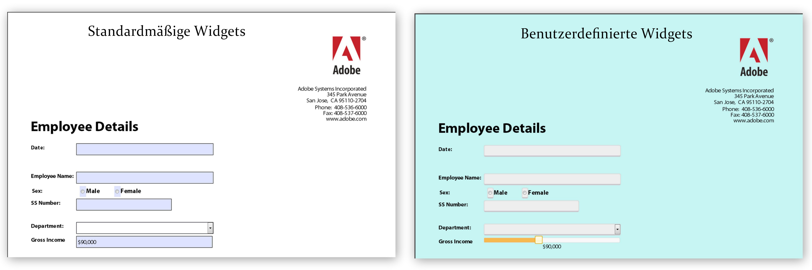

# Erstellen von benutzerspezifischen Erscheinungsbildern in HTML5-Formularen{#create-custom-appearances-in-html-forms}

Sie können mit Mobile Forms benutzerdefinierte Widgets einsetzen. Sie können mithilfe des Erscheinungsbild-Framework vorhandene jQuery Widgets erweitern oder Ihre eigenen benutzerdefinierten Widgets entwickeln. Die XFA-Engine verwendet verschiedene Widgets. Detaillierte Informationen finden Sie unter [Erscheinungsbild-Framework für adaptive und HTML5-Formulare](/help/forms/using/introduction-widgets.md).



Beispiel für ein standardmäßiges und benutzerdefiniertes Widget

## Integrieren benutzerdefinierter Widgets mit HTML5-Formularen {#integrating-custom-widgets-with-html-forms}

### Profil erstellen  {#create-a-profile-nbsp}

Erstellen Sie ein Profil oder wählen Sie ein vorhandenes Profil, um ein benutzerdefiniertes Widget hinzuzufügen. Weitere Informationen zum Erstellen von Profilen finden Sie unter [Erstellen benutzerdefinierter Profile](/help/forms/using/custom-profile.md).

### Widget erstellen {#create-a-widget}

HTML5-Formulare bieten eine Implementierung des Widget-Frameworks, das erweitert werden kann, um neue Widgets zu erstellen. Die Implementierung ist ein jQuery-Widget *abstractWidget*, dass zum Schreiben eines neuen Widgets erweitert werden kann. Das neue Widget kann nur durch Erweitern bzw. Überschreiben der unten erwähnten Funktionen ordnungsgemäß laufen.

<table>
 <tbody>
  <tr>
   <td>Funktion/Klasse</td>
   <td>Beschreibung</td>
  </tr>
  <tr>
   <td>render</td>
   <td>Die Renderfunktion gibt das jQuery-Objekt für das standardmäßige HTML-Element des Widgets zurück. Das standardmäßige HTML-Element sollte fokussierbar sein. Zum Beispiel &lt;a&gt;, &lt;input&gt; und &lt;li&gt;. Das zurückgegebene Element wird als $userControl verwendet. Wenn $userControl die oben genannte Einschränkung angibt, funktionieren die Funktionen der Klasse AbstractWidget erwartungsgemäß. Anderenfalls erfordern einige der allgemeinen APIs (Fokus, Klick) Änderungen. </td>
  </tr>
  <tr>
   <td>getEventMap</td>
   <td>Gibt eine Zuordnung zur Konvertierung von HTML-Elementen zu XFA-Ereignissen zurück. <br /> {<br /> blur: XFA_EXIT_EVENT,<br /> }<br /> Dieses Beispiel zeigt, dass der Weichzeichner ein HTML-Ereignis und XFA_EXIT_EVENT ein entsprechendes XFA-Ereignis ist. </td>
  </tr>
  <tr>
   <td>getOptionsMap</td>
   <td>Gibt eine Zuordnung mit detaillierten Informationen zurück, wie eine Option geändert werden kann. Die Schlüssel sind die Optionen, die dem Widget zur Verfügung gestellt werden, und Werte sind die Funktionen, die aufgerufen werden, sobald eine Änderung in dieser Option erkannt wird. Das Widget verfügt über Handler für alle allgemeinen Optionen (außer value und displayValue).</td>
  </tr>
  <tr>
   <td>getCommitValue</td>
   <td>Das Widget-Framework lädt Funktionen sobald der Wert des Widgets im XFAModel gespeichert wird (beispielsweise bei einem exit-Ereignis eines textField). Die Implementierung sollte den Wert zurückgeben, der im Widget gespeichert wird. Der Handler erhält den neuen Wert für die Option.</td>
  </tr>
  <tr>
   <td>showValue</td>
   <td>Standardmäßig wird in XFA beim Ereignis „enter“ der rawValue des Felds angezeigt. Diese Funktion wird aufgerufen, um dem Benutzer den „rawValue“ zu zeigen. </td>
  </tr>
  <tr>
   <td>showDisplayValue</td>
   <td>Standardmäßig wird in XFA beim Ereignis „exit“ der formattedValue des Felds angezeigt. Diese Funktion wird aufgerufen, um dem Benutzer den „formattedValue“ zu zeigen. </td>
  </tr>
 </tbody>
</table>

Um ein eigenes Widget im oben erstellen Profil zu erstellen, müssen Sie die Verweise der JavaScript-Datei einschließen, die die überschriebenen und neu hinzugefügten Funktionen enthält. Beispielsweise ist das *reglerNumericFieldWidget* ein Widget für numerische Felder. Um das Widget in Ihrem Profil in der Kopfzeile zu verwenden, fügen Sie die folgende Zeile hinzu:

```javascript
window.formBridge.registerConfig("widgetConfig" , widgetConfigObject);
```

### Registrieren von benutzerdefinierten Widgets mit XFA Scripting Engine   {#register-custom-widget-with-xfa-scripting-engine-nbsp}

Wenn der benutzerdefinierte Widget-Code fertig ist, registrieren Sie das Widget bei der Skripterstellungsmaschine, indem Sie die `registerConfig`API für [Form Bridge](/help/forms/using/form-bridge-apis.md) verwenden. Als Eingabe ist „widgetConfigObject“ erforderlich.

```javascript
window.formBridge.registerConfig("widgetConfig",
        {
        ".<field-identifier>":"<name-of-the-widget>"
        }
    );
```

#### widgetConfigObject {#widgetconfigobject}

Die Widget-Konfiguration wird als JSON-Objekt bereitgestellt (eine Sammlung von Schlüssel-Wert-Paaren), bei dem der Schlüssel die Felder identifiziert und der Wert für das Widget steht, das mit den Feldern verwendet werden soll. Eine Beispielkonfiguration sieht wie folgt aus:

```
*{*

*“identifier1” : “customwidgetname”,
“identifier2” : “customwidgetname2”,
..
}*
```

wobei &quot;identifier&quot;ein jQuery-CSS-Selektor ist, der ein bestimmtes Feld, eine Reihe von Feldern eines bestimmten Typs oder alle Felder darstellt. Im Folgenden ist der Wert des Bezeichners in verschiedenen Fällen aufgeführt:

| Typ des Bezeichners | ID | Beschreibung |
|---|---|---|
| Bestimmtes Feld mit Name „fieldname“ | Bezeichner:&quot;div.fieldname&quot; | Alle Felder mit dem Namen „fieldname“ werden mithilfe des Widgets gerendert. |
| Alle Felder des Typs &quot;type&quot;(wobei der Typ NumericField, DateField usw. ist): | Bezeichner: &quot;div.type&quot; | Für Timefield und DateTimeField ist der Typ textfield , da diese Felder nicht unterstützt werden. |
| Alle Felder | Kennung: &quot;div.field&quot; |  |
