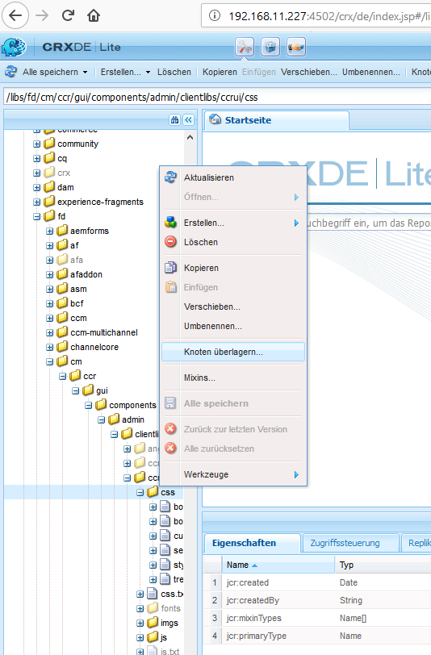
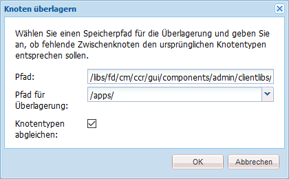

# Anpassen der Benutzeroberfläche „Korrespondenz erstellen“{#customize-create-correspondence-ui}

## Übersicht {#overview}

Mit Correspondence Management können Sie ein Rebranding der dazugehörigen Lösungsvorlage durchführen, sodass Sie einen besseren Markenwert erzielen und die Markenstandards Ihres Unternehmens erfüllt werden. Das Rebranding der Benutzeroberfläche umfasst das Ändern des Firmenlogos links oben in der Benutzeroberfläche „Korrespondenz erstellen“.

Sie können das Logo in der Benutzeroberfläche „Korrespondenz erstellen“ durch Ihr Firmenlogo ersetzen.


Das benutzerdefinierte Symbol in der Benutzeroberfläche „Korrespondenz erstellen“

### Ändern des Logos in der Benutzeroberfläche „Korrespondenz erstellen“ {#changing-the-logo-in-the-create-correspondence-ui}

Gehen Sie wie folgt vor, um ein Logobild Ihrer Wahl einzurichten:

1. Erstellen Sie die entsprechende [Ordnerstruktur in CRX](#creatingfolderstructure).
1. [Laden Sie die neue Logodatei](#uploadlogo) in den Ordner hoch, den Sie in CRX erstellt haben.

1. [Legen Sie das CSS](#createcss) auf CRX fest, um auf das neue Logo zu verweisen.
1. Löschen Sie den Browser-Verlauf und [aktualisieren Sie die Benutzeroberfläche „Korrespondenz erstellen“](#refreshccrui).

## Erstellen der erforderlichen Ordnerstruktur {#creatingfolderstructure}

Erstellen Sie die Ordnerstruktur wie nachfolgend beschrieben, um das benutzerdefinierte Logobild und das Stylesheet zu hosten. Die neue Ordnerstruktur mit dem /apps-Stammordner ähnelt der /libs-Ordnerstruktur.

Erstellen Sie bei jedweder Anpassung eine parallele Ordnerstruktur in der /apps-Verzweigung, wie nachfolgend beschrieben.

Die `/apps`-Verzweigung (Ordnerstruktur) ermöglicht Folgendes:

* Sie stellt sicher, dass Ihre Dateien im Falle einer Systemaktualisierung sicher sind. Bei einem Upgrade, Feature Pack oder Hotfix wird die `/libs`-Verzweigung aktualisiert. Wenn Sie Ihre Änderungen in der `/libs`-Verzweigung hosten, werden diese überschrieben.
* Sie hilft Ihnen dabei, das vorhandene System/die Verzweigung nicht zu beeinträchtigen, wozu es kommen kann, wenn Sie die Standardspeicherorte zum Speichern der benutzerdefinierten Dateien verwenden.
* Sie sorgt dafür, dass Ihre Ressourcen eine höhere Priorität erhalten, wenn AEM nach Ressourcen sucht. AEM ist so konfiguriert, dass bei der Suche nach einer Ressource zuerst die `/apps`-Verzweigung und dann die `/libs`-Verzweigung durchsucht wird. Dieser Mechanismus bedeutet, dass das System Ihre Überlagerung (und alle dort definierten Anpassungen) verwendet.

Führen Sie die folgenden Schritte aus, um die erforderliche Ordnerstruktur in der `/apps`-Verzweigung zu erstellen:

1. Wechseln Sie zu `https://'[server]:[port]'/[ContextPath]/crx/de` und melden Sie sich als „Administrator“ an.
1. Erstellen Sie im apps-Ordner einen Ordner namens `css` mit einem ähnlichen Pfad/einer ähnlichen Struktur wie der css-Ordner (im ccrui-Ordner).

   Schritte zum Erstellen des css-Ordners:

   1. Klicken Sie mit der rechten Maustaste im folgenden Pfad auf den Ordner **css** und wählen Sie **Überlagerungsknoten**: `/libs/fd/cm/ccr/gui/components/admin/clientlibs/ccrui/css`

      

   1. Stellen Sie sicher, dass das Dialogfeld „Überlagerungsknoten“ die folgenden Werte enthält:

      **Pfad:** `/libs/fd/cm/ccr/gui/components/admin/clientlibs/ccrui/css`

      **Pfad für Überlagerung:** `/apps/`

      **Knotentypen abgleichen:** Überprüft

      

      >[!NOTE]
      >
      >Ändern Sie nicht die `/libs`-Verzweigung. Alle Änderungen, die Sie vornehmen, gehen möglicherweise verloren, da diese Verzweigung sich ändern kann, wenn Sie:
      >
      >    
      >    
      >    * Ihre Instanz aktualisieren
      >    * einen Hotfix anwenden
      >    * ein Feature Pack installieren
      >    
      >

   1. Klicken Sie auf **OK**. Der css-Ordner wird im angegebenen Pfad erstellt.

1. Erstellen Sie im Apps-Ordner einen Ordner namens `imgs` mit einem ähnlichen Pfad bzw. einer ähnlichen Struktur wie der `imgs`-Ordner (im CCRUI-Ordner).

   1. Klicken Sie mit der rechten Maustaste auf den Ordner **imgs** im folgenden Pfad und wählen Sie **Überlagerungsknoten**: `/libs/fd/cm/ccr/gui/components/admin/clientlibs/ccrui/imgs`
   1. Stellen Sie sicher, dass das Dialogfeld „Überlagerungsknoten“ die folgenden Werte enthält:

      **Pfad:** /libs/fd/cm/ccr/gui/components/admin/clientlibs/ccrui/imgs

      **Überlagerungsspeicherort:** /apps/

      **Knotentypen abgleichen**: Kontrollkästchen aktiviert

   1. Klicken Sie auf **OK**.

      >[!NOTE]
      >
      >Sie können die Ordnerstruktur im /apps-Ordner auch manuell erstellen.

1. Klicken Sie auf **Alle speichern**, um die Änderungen auf dem Server zu speichern.

## Hochladen des neuen Logos in CRX {#uploadlogo}

Laden Sie Ihre benutzerdefinierte Logodatei in CRX hoch. Standard-HTML-Regeln steuern die Darstellung des Logos. Die unterstützten Bildformate werden vom Browser bestimmt, den Sie für den Zugriff auf AEM Forms verwenden. Alle Browser unterstützen JPEG, GIF und PNG. Weitere Informationen finden Sie in der Browser-spezifischen Dokumentation zu den unterstützten Bildformaten.

* Die Standardabmessungen des Logobilds sind 48 Pixel &#42; 48 Pixel. Stellen Sie sicher, dass Ihr Bild dieser Größe entspricht oder größer als 48 Pixel &#42; 48 Pixel ist.
* Bei einer Höhe des Logobilds von mehr als 50 Pixel verkleinert die Benutzeroberfläche „Korrespondenz erstellen“ das Bild auf eine maximale Höhe 50 Pixel – der Höhe der Kopfzeile. Beim Verkleinern des Bilds behält die Benutzeroberfläche „Korrespondenz erstellen“ das Seitenverhältnis bei.
* Die Benutzeroberfläche „Korrespondenz erstellen“ vergrößert Ihr Bild nicht, wenn es zu klein ist, daher sollten Sie ein Logobild mit einer Mindesthöhe von 48 Pixel und einer ausreichenden Breite verwenden.

Führen Sie die folgenden Schritte aus, um die benutzerdefinierte Logodatei auf CRX hochzuladen:

1. Wechseln Sie zu `https://'[server]:[port]'/[contextpath]/crx/de`. Falls erforderlich, melden Sie sich als Administrator an.
1. Klicken Sie in CRXDE mit der rechten Maustaste auf den Ordner **imgs** im folgenden Pfad und wählen Sie **Erstellen > Datei erstellen**:

   `/apps/fd/cm/ccr/gui/components/admin/clientlibs/ccrui/imgs/`

   

1. Im Dialogfeld „Datei erstellen“ geben Sie als Namen der Datei „CustomLogo.png“ (oder den Namen Ihrer Logodatei) an.

   

1. Klicken Sie auf **Alle speichern**.

   Unter der neuen, von Ihnen erstellten Datei (hier: BenutzerdefiniertesLogo.png) wird die Eigenschaft „jcr:content“ angezeigt.

1. Klicken Sie in der Ordnerstruktur auf „jcr:content“.

   Die Eigenschaften von „jcr:content“ werden angezeigt.

   

1. Doppelklicken Sie auf die Eigenschaft **jcr:data**.

   Das Dialogfeld „jcr:data bearbeiten“ wird angezeigt.

   Klicken Sie jetzt auf den Ordner „newlogo.png“, doppelklicken Sie auf „jcr:content“ (dim-Option) und legen Sie den Typ „nt:resource“ fest. Falls sie nicht vorhanden ist, erstellen Sie zuerst eine Eigenschaft mit dem Namen „jcr:content“.

1. Klicken Sie im Dialogfeld „jcr:data bearbeiten“, auf **Durchsuchen** und wählen Sie die Bilddatei, die Sie als Logo verwenden möchten (hier CustomLogo.png).

   Die unterstützten Bildformate werden vom Browser bestimmt, den Sie für den Zugriff auf AEM Forms verwenden. Alle Browser unterstützen JPEG, GIF und PNG. Weitere Informationen finden Sie in der Browser-spezifischen Dokumentation zu den unterstützten Bildformaten.

   

   Beispiel: Datei „BenutzerdefiniertesLogo.png“, die für das benutzerdefinierte Logo verwendet werden soll

1. Klicken Sie auf **Alle speichern**.

## Erstellen des CSS zum Rendern des Logos mit der Benutzeroberfläche {#createcss}

Das benutzerdefinierte Logobild erfordert ein zusätzliches, im Inhaltskontext zu ladendes Stylesheet.

Führen Sie die folgenden Schritte aus, um das Stylesheet zum Rendern des Logos mit der Benutzeroberfläche zu erstellen:

1. Rufen Sie `https://'[server]:[port]'/[contextpath]/crx/de` auf. Falls erforderlich, melden Sie sich als Administrator an.
1. Erstellen Sie eine Datei mit dem Namen customcss.css (Sie können keinen anderen Dateinamen verwenden) am folgenden Speicherort:

   `/apps/fd/cm/ccr/gui/components/admin/clientlibs/ccrui/css/`

   Schritte zum Erstellen der Datei „customcss.css“:

   1. Klicken Sie mit der rechten Maustaste auf den Ordner **css** und wählen Sie **Erstellen > Datei erstellen** aus.
   1. Geben Sie im Dialogfeld „Neue Datei“ als Namen des CSS `customcss.css` an (Sie können keinen anderen Dateinamen verwenden) und klicken Sie auf **OK**.
   1. Fügen Sie den folgenden Code zu der neu erstellten CSS-Datei hinzu. Geben Sie unter „content:url“ im Code den Namen des Bilds ein, das Sie in den imgs-Ordner in CRXDE hochgeladen haben.

      ```css
      .logo, .logo:after {
      content:url("../imgs/CustomLogo.png");
      }
      ```

   1. Klicken Sie auf **Alle speichern**.

## Aktualisieren der Benutzeroberfläche „Korrespondenz erstellen“ zum Anzeigen des benutzerdefinierten Logos {#refreshccrui}

Löschen Sie den Browser-Cache und öffnen Sie dann die Instanz der Benutzeroberfläche „Korrespondenz erstellen“ in Ihrem Browser, damit Sie Ihr benutzerdefiniertes Logo sehen können.


Das benutzerdefinierte Symbol in der Benutzeroberfläche „Korrespondenz erstellen“
