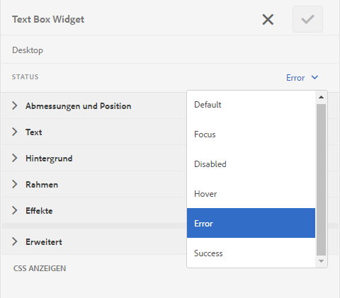

# Anpassen des Layouts und der Positionierung von Fehlermeldungen eines adaptiven Formulars{#customize-layout-and-positioning-of-error-messages-of-an-adaptive-form}

Sie können das Layout und die Positionierung der Fehlermeldungen eines adaptiven Formulars anpassen. Sie können die folgenden Anpassungen vornehmen:

* Position und Layout der Beschriftung eines Felds anpassen, ohne die entsprechenden CSS-Eigenschaften zu ändern
* Position von Inline-Fehlermeldungen anpassen
* Inhalt der dynamischen Hilfeanzeige anpassen
* Position der Feldkomponenten (Beschriftung, Widget, Kurzbeschreibung, Langbeschreibung und Komponenten der Hilfeanzeige) anpassen, ohne die entsprechenden CSS-Eigenschaften zu ändern

## Layout von Feldern anpassen {#customize-layout-of-fields}

Sie können das Layout eines einzelnen Felds oder aller Felder anpassen, um die Position von Beschriftungen und Fehlermeldungen zu ändern.

Gehen Sie wie folgt vor, um ein benutzerdefiniertes Layout auf ein Feld anzuwenden:

### Layout eines einzelnen Felds anpassen {#customize-layout-of-a-single-field}

1. Öffnen Sie das Formular im **Stilmodus**. Um das Formular im Stilmodus zu öffnen, tippen Sie in der Seitensymbolleiste auf  > **Stil**.
1. Wählen Sie in der Randleiste unter **Formularobjekte** das Feld aus und tippen Sie auf die Bearbeiten-Schaltfläche .
1. Wählen Sie den Status des Felds aus, das Sie anpassen möchten, und geben Sie den Stil für diesen Status an.

   

### Layout aller Felder eines Formulars anpassen {#customize-layout-of-all-the-fields-of-a-form}

Mit AEM Forms können Sie jetzt ein Design erstellen und es auf Ihr Formular anwenden. Mit dem Design-Editor können Sie die Formatierung von Formularkomponenten an einer Stelle festlegen. Wenn Sie ein Design erstellen, geben Sie die Formatierung auf Komponentenebene an. Weitere Informationen zu Themen finden Sie unter [Designs in AEM Forms](../../forms/using/themes.md).

Erstellen Sie ein Design mit dem Design-Editor, um das Layout aller Felder in Ihrem Formular anzupassen. Nachdem Sie ein Design erstellt haben, führen Sie die folgenden Schritte aus, um es auf ein Formular anzuwenden:

1. Öffnen Sie das Formular im Bearbeitungsmodus.
1. Wählen Sie im Bearbeitungsmodus eine Komponente aus und tippen Sie anschließend auf  > **Container für ein adaptives Formular** und dann auf .
1. Wählen Sie in der Seitenleiste unter Adaptives Formulardesign das Design aus, das Sie mit dem Design-Editor erstellt haben.

## Benutzerdefiniertes Feldlayout erstellen {#create-a-custom-field-layout}

1. Öffnen Sie CRXDE Lite. Die Standard-URL lautet https://&#39;[server]:[port]&#39;/crx/de.
1. Kopieren Sie ein Feldlayout vom Knoten /libs/fd/af/layouts/field (z. B. defaultFieldLayout) in den Knoten /apps (z. B. /apps/af-field-layout).
1. Benennen Sie den kopierten Knoten und die Datei defaultFieldLayout.jsp um. Beispielsweise in „errorOnRight.jsp“. 

1. Ändern Sie den Wert der Eigenschaften qtip und jcr:description des kopierten Knotens. Ändern Sie z. B. den Wert der Eigenschaften in „Error On Right“ 

1. Um neue Stile und Verhaltensweisen hinzuzufügen, erstellen Sie eine Client-Bibliothek im Knoten /etc .

   Erstellen Sie z. B. im Verzeichnis „/etc/af-field-layout-clientlib“ den Knoten „client-library“. Fügen Sie die categories-Eigenschaft mit dem Wert af.field.errorOnRight und die style.less-Datei mit dem folgenden Code hinzu:

   ```css
   .widgetErrorWrapper {
   
    height: 38px;
    margin: 5px;
   
    .guideFieldWidget{
    width: 60%;
    float: left; 
    }
   
    .guideFieldError{
    overflow:hidden;
    width:40%; 
    }
   
   }
   ```

1. Beziehen Sie zur Verbesserung des Erscheinungsbilds und der Verhaltensweise die in der Layout-Datei (errorOnRight.jsp) erstellte Clientbibliothek ein.
1. Öffnen Sie das Dialogfeld &quot;Bearbeiten&quot;des Felds und wählen Sie die **Formatierung** Registerkarte. Im **Feldlayout konfigurieren** in der Dropdown-Liste, das neu erstellte Layout auswählen und auf **OK**.

Das Package ErrorOnRight.zip enthält Code, um Fehlermeldungen auf der rechten Seite der Felder anzuzeigen.

[Datei laden](assets/erroronright.zip)
