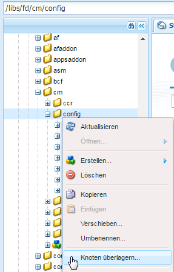
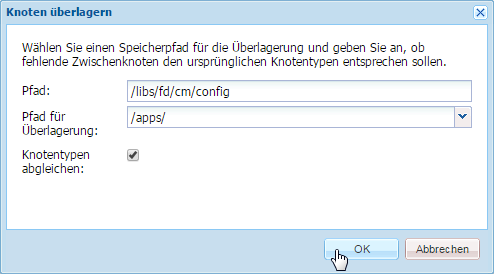
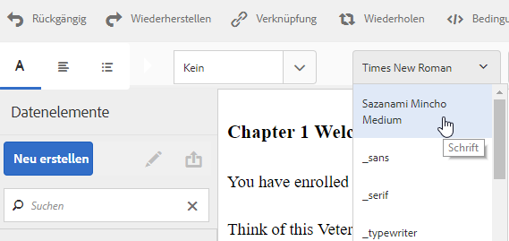

# Texteditor anpassen{#customize-text-editor}

## Überblick {#overview}

Sie können den Texteditor in der Benutzeroberfläche „Assets verwalten und Korrespondenz erstellen“ anpassen, um weitere Schriftarten und Schriftgrade hinzuzufügen. Diese Schriftarten enthalten englische und nicht-englische Schriftarten wie Japanisch.

Sie können die Folgendes in den Einstellungen für die Schriftart ändern:

* Schriftfamilie und -grad
* Eigenschaften wie Höhe und Zeichenabstand
* Standardwerte von Schriftfamilie und -grad, Höhe, Zeichenabstand und Datumsformat
* Einzüge für Aufzählungszeichen 

Wenn Sie so verfahren, müssen Sie folgende Schritte durchführen:

1. [Anpassen von Schriftarten, indem Sie die Datei „tbxeditor-config.xml“ in CRX bearbeiten ](#customizefonts)
1. [Fügen Sie dem Clientcomputer benutzerdefinierte Schriftarten hinzu](#addcustomfonts)

## Anpassen von Schriftarten, indem Sie die Datei „tbxeditor-config.xml“ in CRX bearbeiten  {#customizefonts}

Anpassen von Schriften durch Bearbeiten der Datei tbxeditor-config.xml führen Sie folgende Schritte durch:

1. Gehen Sie zu `https://'[server]:[port]'/[ContextPath]/crx/de` und melden Sie sich als Administrator an.
1. Erstellen Sie im Apps-Ordner einen Ordner mit dem Namen config mit einem ähnlichen Pfad/einer ähnlichen Struktur zum config-Ordner, der sich unter libs/fd/cm/config befindet, indem Sie die folgenden Schritte ausführen:

   1. Klicken Sie mit der rechten Maustaste auf den Ordner items im folgenden Pfad und wählen Sie **Überlagerungsknoten**:

      `/libs/fd/cm/config`

      

   1. Stellen Sie sicher, dass das Dialogfeld „Überlagerungsknoten“ die folgenden Werte enthält:

      **Pfad:** /libs/fd/cm/config

      **Speicherort:** /apps/

      **Knotentypen abgleichen:** Ausgewählt

      

   1. Klicken Sie auf **OK**. Die Ordnerstruktur wird im Apps-Ordner erstellt.

   1. Klicken Sie auf **Alle speichern**.

1. Erstellen Sie eine Kopie der Datei „tbxeditor-config.xml“ im neu erstellten config-Ordner, indem Sie folgende Schritte durchführen:

   1. Klicken Sie mit der rechten Maustaste auf die Datei „tbxeditor-config.xml“ unter libs/fd/cm/config und wählen Sie **Kopieren**.
   1. Klicken Sie mit der rechten Maustaste auf den folgenden Ordner und wählen Sie **Einfügen:** 

      `apps/fd/cm/config`

   1. Der Name der eingefügten Datei ist standardmäßig `copy of tbxeditor-config.xml.` Benennen Sie die Datei in `tbxeditor-config.xml` um und klicken Sie auf **Alle speichern**.

1. Öffnen Sie die Datei tbxeditor-config.xml unter apps/fd/cm/config und nehmen Sie dann die erforderlichen Änderungen vor.

   1. Doppelklicken Sie auf die Datei &quot;tbxeditor-config.xml&quot;unter apps/fd/cm/config. Die Datei wird geöffnet.

      ```xml
      <editorConfig>
         <bulletIndent>0.25in</bulletIndent>
      
         <defaultDateFormat>DD-MM-YYYY</defaultDateFormat>
      
         <fonts>
            <default>Times New Roman</default>
            <font>_sans</font>
            <font>_serif</font>
            <font>_typewriter</font>
            <font>Arial</font>
            <font>Courier</font>
            <font>Courier New</font>
            <font>Geneva</font>
            <font>Georgia</font>
            <font>Helvetica</font>
            <font>Tahoma</font>
            <font>Times New Roman</font>
            <font>Times</font>
            <font>Verdana</font>
         </fonts>
      
         <fontSizes>
            <default>12</default>
            <fontSize>8</fontSize>
            <fontSize>9</fontSize>
            <fontSize>10</fontSize>
            <fontSize>11</fontSize>
            <fontSize>12</fontSize>
            <fontSize>14</fontSize>
            <fontSize>16</fontSize>
            <fontSize>18</fontSize>
            <fontSize>20</fontSize>
            <fontSize>22</fontSize>
            <fontSize>24</fontSize>
            <fontSize>26</fontSize>
            <fontSize>28</fontSize>
            <fontSize>36</fontSize>
            <fontSize>48</fontSize>
            <fontSize>72</fontSize>
         </fontSizes>
      
         <lineHeights>
            <default>2</default>     
            <lineHeight>2</lineHeight>
            <lineHeight>3</lineHeight>
            <lineHeight>4</lineHeight>
            <lineHeight>5</lineHeight>
            <lineHeight>6</lineHeight>
            <lineHeight>7</lineHeight>
            <lineHeight>8</lineHeight>
            <lineHeight>9</lineHeight>
            <lineHeight>10</lineHeight>
            <lineHeight>11</lineHeight>
            <lineHeight>12</lineHeight>
            <lineHeight>13</lineHeight>
            <lineHeight>14</lineHeight>
            <lineHeight>15</lineHeight>
            <lineHeight>16</lineHeight>
         </lineHeights>
      
         <letterSpacings>
            <default>0</default>
            <letterSpacing>0</letterSpacing>
            <letterSpacing>1</letterSpacing>
            <letterSpacing>2</letterSpacing>
            <letterSpacing>3</letterSpacing>
            <letterSpacing>4</letterSpacing>
            <letterSpacing>5</letterSpacing>
            <letterSpacing>6</letterSpacing>
            <letterSpacing>7</letterSpacing>
            <letterSpacing>8</letterSpacing>
            <letterSpacing>9</letterSpacing>
            <letterSpacing>10</letterSpacing>
            <letterSpacing>11</letterSpacing>
            <letterSpacing>12</letterSpacing>
            <letterSpacing>13</letterSpacing>
            <letterSpacing>14</letterSpacing>
            <letterSpacing>15</letterSpacing>
            <letterSpacing>16</letterSpacing>
         </letterSpacings>
      </editorConfig>
      ```

   1. Nehmen Sie die erforderlichen Änderungen in der Datei vor, um Folgendes in den Einstellungen für die Schriftart zu ändern:

      * Hinzufügen oder Entfernen von Schriftfamilie und -grad
      * Eigenschaften wie Höhe und Zeichenabstand
      * Standardwerte von Schriftfamilie und -grad, Höhe, Zeichenabstand und Datumsformat
      * Einzüge für Aufzählungszeichen 

      Um zum Beispiel eine japanische Schriftart mit dem Namen Sazanami Mincho Medium hinzuzufügen, müssen Sie Folgendes eintragen in der  XML-Datei: `<font>Sazanami Mincho Medium</font>`. Sie müssen diese Schriftart auch auf dem Clientcomputer installieren, der für den Zugriff auf die Schriftartanpassung und die Bearbeitung dieser Schriftart verwendet wird. Weitere Informationen finden Sie unter[ Hinzufügen von benutzerdefinierten Schriften zum Clientcomputer](#addcustomfonts).

      Sie können auch die Standardeinstellungen für verschiedene Aspekte des Textes ändern und die Schriftarten aus dem Texteditor entfernen, indem Sie die Einträge entfernen.

   1. Klicken Sie auf **Alle speichern**.


## Fügen Sie dem Clientcomputer benutzerdefinierte Schriftarten hinzu {#addcustomfonts}

Wenn Sie auf eine Schriftart im Correspondence Management-Texteditor zugreifen, muss sie auf dem Client-Computer vorhanden sein, den Sie für den Zugriff auf Correspondence Management verwenden. Um eine benutzerdefinierte Schriftart im Texteditor verwenden zu können, müssen Sie diese zunächst auf dem Clientcomputer installieren.

Weitere Informationen zum Installieren von Schriftarten finden Sie hier:

* [Installieren oder Deinstallieren von Schriftarten unter Windows](https://windows.microsoft.com/en-us/windows-vista/install-or-uninstall-fonts) 
* [Mac-Grundlagen: Schriftartenbuch](https://support.apple.com/de-de/HT201749) 

## Zugriff auf Schriftartanpassungen {#access-font-customizations}

Nachdem Sie in der Datei tbxeditor-config.xml in CRX Änderungen an Schriftarten vorgenommen und die erforderlichen Schriftarten auf dem Clientcomputer installiert haben, der für den Zugriff auf AEM Forms verwendet wird, werden die Änderungen im Texteditor angezeigt.

Beispielsweise wird die Schriftart Sazanami Mincho Medium, die im Verfahren [Schriftarten anpassen hinzugefügt wurde, indem die Datei tbxeditor-config.xml in CRX](#customizefonts) bearbeitet wird, in der Benutzeroberfläche des Texteditors wie folgt angezeigt:



>[!NOTE]
>
>Damit Text auf Japanisch angezeigt wird, müssen Sie zuerst den Text mit japanischen Zeichen eingeben. Die Anwendung einer benutzerdefinierten japanischen Schriftart formatiert nur den Text auf eine bestimmte Art. Die Anwendung einer benutzerdefinierten japanischen Schriftart ändert englische oder andere Zeichen nicht in japanische Schriftzeichen.
