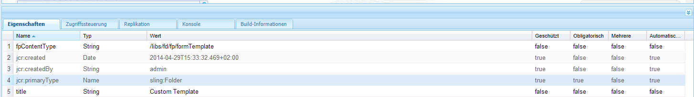

# Anpassen von Vorlagen für Forms Portal-Komponenten{#customizing-templates-for-forms-portal-components}

## Voraussetzungen {#prerequisites}

[Formularmetadaten verwalten](../../forms/using/manage-form-metadata.md)

Kenntnisse im Umgang mit HTML und CSS

## Überblick {#overview}

In der Benutzeroberfläche von AEM Forms können Sie jedem beliebigen Formular Metadaten hinzufügen. Mit benutzerdefinierten Metadaten können Sie die Benutzererfahrung bei der Auflistung und beim Durchsuchen von Formularen in Ihrem Unternehmen verbessern.

In Forms Portal können Sie benutzerdefinierte Metadaten in den Formularlisten verwenden. Beim Erstellen von benutzerdefinierten Vorlagen für Assets können Sie das Layout bearbeiten und benutzerdefinierte Metadaten mit Ihrem CSS-Vorlagensatz verwenden.

Führen Sie die folgenden Schritte aus, um eine benutzerdefinierte Vorlage für verschiedene Forms Portal-Komponenten zu erstellen.

## Erstellen einer benutzerdefinierten Vorlage {#creating-a-nbsp-custom-template}

1. Erstellen eines sling:Folder-Knotens unter /apps

   Fügen Sie eine fpContentType-Eigenschaft hinzu. Geben Sie entsprechende Werte für die Eigenschaft abhängig von der Komponente an, für die Sie die benutzerdefinierte Vorlage definieren.

   * Komponente „Search &amp; Lister“: &quot;/libs/fd/fp/formTemplate&quot;
   * Komponente &quot;Drafts &amp; Submissions&quot;:

      * Bereich „Drafts“: /libs/fd/fp/draftsTemplate
      * Bereich „Submissions“: /libs/fd/fp/submissionsTemplate
   * Komponente „Link“: /libs/fd/fp/linkTemplate

   Fügen Sie einen Titel hinzu, der während der Auswahl der Layoutvorlagen angezeigt werden soll.

   >[!NOTE]
   >
   >Der Titel kann sich vom Knotennamen des von Ihnen erstellten sling:Folder unterscheiden.

   Die folgende Abbildung zeigt die Konfiguration der Komponente „Search &amp; Lister“.
   

1. Erstellen Sie in diesem Ordner eine Datei „Template.html“, die als benutzerdefinierte Vorlage dienen soll.
1. Schreiben Sie die benutzerdefinierte Vorlage und verwenden Sie dafür benutzerdefinierte Metadaten wie unten beschrieben.

## Arbeitsbeispiel  {#working-example}

Beim Folgenden Beispiel handelt es sich um eine Implementierung einer benutzerdefinierten Vorlage, bei der Forms Portal ein benutzerdefiniertes Geometrixx Gov Card-Layout von der Komponente „Search &amp; Lister“ abruft.

```html
<div class="__FP_boxes-container __FP_single-color">
    <div class="boxes __FP_boxes __FP_single-color" data-repeatable="true">
 <div class="__FP_boxes-thumbnail">
     
        </div>
        <h3 class="__FP_single-color" title="${name}" tabindex="0">${name}</h3>
        <p>${description}</p>
        <div class="boxes-icon-cont __FP_boxes-icon-cont">
            <div class="op-dow">
                <a href="${formUrl}" target="_blank" class="__FP_button ${htmlStyle}" title="${config-htmlLinkText}">${localize-Apply}</a>
                <a href="${pdfUrl}" class="__FP_button ${pdfStyle}" title="${config-pdfLinkText}">${localize-Download}</a>
            </div>
        </div>
    </div>
</div>
```

## Technische Spezifikationen für benutzerdefinierte Vorlagen  {#technical-specifications-for-custom-templates}

Eine benutzerdefinierte Vorlage für eine Forms Portal-Komponente enthält wiederholbare und nicht wiederholbare Einträge. Wiederholbare Einträge sind die grundlegenden Einheiten für die Auflistung. Beispiele für wiederholbare Einträge sind Komponenten des Typs „Search &amp; Lister“, „Drafts &amp; Submissions“ sowie „Link“.

Forms Portal bietet eine Syntax für Platzhalter zur Anzeige von benutzerdefinierten bzw. OOTB-Metadaten. Die Platzhalter werden nach der Anzeige der Ergebnisse aus Formularen, Entwürfen oder Übermittlungen angezeigt.

Um einen wiederholbaren Eintrag einzuschließen, konfigurieren Sie den Wert des Attributs **data-repeatable** in **true**.

*Im gezeigten Beispiel sind oben in der benutzerdefinierten Vorlage zwei Div-Elemente vorhanden. Das erste mit der CSS-Klasse „__FP_boxes-container“ fungiert als Containerelement für die aufgelisteten Formulare. Das zweite mit der CSS-Klasse „__FP_boxes“ ist eine Vorlage für die Basiseinheiten, in diesem Fall ein Formular. Das Attribut **data-repeatable**im Div-Element hat den Wert **true**.*

Jeder Platzhalter verfügt über einen exklusiven OOTB-Metadatensatz. Um benutzerdefinierte Metadaten an einer bestimmten Stelle im Formular anzuzeigen, fügen Sie die Eigenschaft **${metadata_prop}** an der Stelle hinzu.

*Im Beispiel wird die Metadaten-Eigenschaft in mehreren Instanzen verwendet. Sie wird beispielsweise in **description**,**name**,**formUrl**,**htmlStyle**,**pdfUrl**,**pdfStyle**und **verwendet. 12/>path**in der vorgeschriebenen Weise.*

## Vorkonfigurierte Metadaten {#out-of-the-box-metadata}

Verschiedene Forms Portal-Komponenten bieten exklusive OOTB-Metadatensätze, die Sie für Auflistungen verwenden können.

### Komponente „Search &amp; Lister“{#search-amp-lister-component}

* **Title**: Titel des Formulars
* **name**: Name des Formulars (meist identisch mit dem Titel)
* **description**: Beschreibung des Formulars
* **formUrl**: URL zum Rendern des Formulars als HTML
* **pdfUrl**: URL zum Rendern des Formulars als PDF
* **assetType**: Typ des Assets Zu den gültigen Werten gehören **Form**,**PDF Form**, **Print Form** und **Adaptives Formular**

* **htmlStyle**&amp; **pdfStyle**: Anzeigestil für HTML- bzw. PDF-Symbole für die Ausgabe. Gültige Werte sind &quot;**__FP_display_none**&quot;oder leer.

>[!NOTE]
>
>Denken Sie daran, die Klasse __FP_display_none in Ihrem benutzerdefinierten Stylesheet zu verwenden.

* **downloadUrl**: URL für das Herunterladen eines Assets.

Unterstützung für Lokalisierung, Sortierung und Verwendung von Konfigurationseigenschaften in der Benutzeroberfläche (nur Search &amp; Lister):

1. **Lokalisierungsunterstützung**: Um statischen Text zu lokalisieren, verwenden Sie das -Attribut  `${localize-YOUR_TEXT}` und stellen Sie den lokalisierten Wert zur Verfügung, falls noch nicht vorhanden.
   *In dem Beispiel, das besprochen wurde,  `${localize-Apply}` werden die Attribute  `${localize-Download}` und verwendet, um den Text &quot;Anwenden&quot;und &quot;Herunterladen&quot;zu lokalisieren.*

1. **Unterstützung für die Sortierung**: Klicken Sie auf das HTML-Element, um die Suchergebnisse zu sortieren. Um Sortierung in ein Tabellenlayout einzufügen, fügen Sie dem jeweiligen Tabellen-Header das Attribut „data-sortKey“ hinzu. Fügen Sie außerdem seinen Wert als die Metadaten hinzu, nach denen Sie sortieren möchten.
So ist z. B. im Header „Title“ in der Rasteransicht der Wert für den Header „data-sortKey“ „title“. Klicken Sie auf die Überschrift, um die Werte in einer bestimmten Spalte zu sortieren.

1. **Verwenden von Konfigurationseigenschaften**: Die Komponente „Search &amp; Lister“ verfügt über mehrere Konfigurationen, die Sie in der Benutzeroberfläche verwenden können. Um beispielsweise HTML ToolTip-Text anzuzeigen, der im Bearbeitungsdialogfeld gespeichert wurde, verwenden Sie das Attribut `${config-htmlLinkText}` . **Verwenden Sie für PDF-QuickInfo-Text** `${config-pdfLinkText}` das -Attribut.

### Komponente „Link“{#link-component}

* **Title**: Titel des Formulars
* **formUrl**: URL zum Rendern des Formulars als HTML
* **target**: Zielattribut des Links. Gültige Werte sind „_blank“ und „_self“.
* **linkText**: Beschriftung des Links

### Komponente „Drafts &amp; Submissions“{#drafts-amp-submissions-component}

* **Path**: Pfad des Entwurfs-/Übermittlungs-Metadatenknotens Verwenden Sie ihn mit der .HTML-Erweiterung als URL, um einen Entwurf oder eine Übermittlung zu öffnen.
* **contextPath**: Kontextpfad der AEM-Instanz.
* **firstLetter**: Erster Buchstabe (groß) des Titels des adaptiven Formulars, das als Entwurf gespeichert oder übermittelt wurde.
* **formName**: Der Titel des adaptiven Formulars, das als Entwurf gespeichert oder übermittelt wurde.
* **draftID**: ID für den aufgelisteten Entwurf. (Nur in der Vorlage für den Bereich „Draft“ verwenden).
* **submitID**: ID für die aufgelistete Übermittlung. (Nur in der Vorlage für den Bereich „Submission“ verwenden).
* **Status**: Status des übermittelten Formulars. (Nur in der Vorlage für den Bereich „Submission“ verwenden).
* **description**: Beschreibung des adaptiven Formulars, das dem Entwurf/der Übermittlung zugewiesen ist.
* **diffTime**: Differenz zwischen der aktuellen Zeit und der letzten Speicheraktion für den Entwurf. Alternativ: Differenz zwischen der aktuellen Zeit und der letzten Übermittlungsaktion für die Übermittlung.
* **iconClass**: CSS-Klasse zur Anzeige des ersten Buchstabens des Entwurfs/der Übermittlung. Forms Portal umfasst die folgenden Klassen, die Hintergründe in verschiedenen Farben bereitstellen.
* **owner**: Benutzer, der den Entwurf/die Übermittlung erstellt hat.
* **Today**: Erstellungsdatum des Entwurfs/der Übermittlung im Format TT:MM:JJJJ.
* **TimeNow**: Erstellungszeitpunkt des Entwurfs/der Übermittlung im 24-Stunden-Format HH:MM:SS.

*Hinweis:*

1. Geben Sie der CSS-Klasse für die Löschoption im Bereich „Drafts“ in der Komponente „Drafts &amp; Submissions“ den Namen „__FP_deleteDraft“. Schließen Sie außerdem das Attribut &quot;draftID&quot;mit dem Wert **${draftID}** ein, der die Entwurfs-ID des entsprechenden Entwurfs ist.

1. Beim Erstellen von Links zu geöffneten Entwürfen und Übermittlungen können Sie **${path}.html** als Wert des Attributs **href** für das Anker-Tag angeben.


**A**. Container-Element

**B.**  &quot;Pfad&quot;-Metadaten mit einer festen Hierarchie, um die für jedes Formular gespeicherte Miniaturansicht abzurufen.

**C.** Datenwiederholbares Attribut für den Vorlagenbereich jedes Formulars

**D.** Lokalisieren der Zeichenfolge &quot;Apply&quot;

**E.** Verwenden der Konfigurationseigenschaft &quot;pdfLinkText&quot;

**F.** Verwenden der Metadaten &quot;pdfUrl&quot;

## Tipps, Tricks und bekannte Probleme {#tips-tricks-and-known-issues}

1. Verwenden Sie in keiner benutzerdefinierten Vorlage einfache Anführungszeichen (&#39;).
1. Für benutzerdefinierte Metadaten speichern Sie diese Eigenschaft nur im Knoten **jcr:content/metadata** . Wenn Sie sie an einem anderen Ort speichern, kann Forms Portal die Metadaten nicht anzeigen.
1. Stellen Sie sicher, dass der Name von benutzerdefinierten bzw. bereits vorhandenen Metadaten keinen Doppelpunkt (:) enthält. Wenn dies der Fall ist, können Sie ihn nicht auf der Benutzeroberfläche anzeigen.
1. **data-** repeatable hat keine Bedeutung für eine  **** Verknüpfungskomponente. Adobe empfiehlt, diese Eigenschaften in einer Vorlage für eine Komponente des Typs „Link“ zu vermeiden.

## Verwandte Artikel

* [Aktivieren von Forms Portal-Komponenten](/help/forms/using/enabling-forms-portal-components.md)
* [Forms Portal-Seite erstellen](/help/forms/using/creating-form-portal-page.md)
* [Auflisten von Formularen auf einer Webseite mithilfe von APIs](/help/forms/using/listing-forms-webpage-using-apis.md)
* [Komponente &quot;Drafts and Submissions&quot;verwenden](/help/forms/using/draft-submission-component.md)
* [Anpassen der Speicherung von Entwürfen und gesendeten Formularen](/help/forms/using/draft-submission-component.md)
* [Beispiel zur Integrierung der Komponente für Entwurf und Übermittlung in die Datenbank](/help/forms/using/integrate-draft-submission-database.md)
* [Anpassen von Vorlagen für Forms Portal-Komponenten](/help/forms/using/customizing-templates-forms-portal-components.md)
* [Einführung in das Veröffentlichen von Formularen in einem Portal](/help/forms/using/introduction-publishing-forms.md)