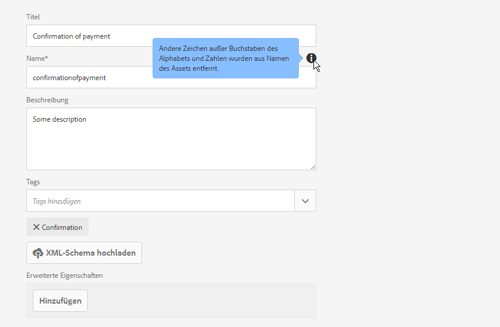
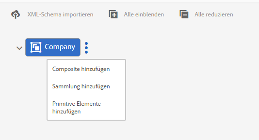
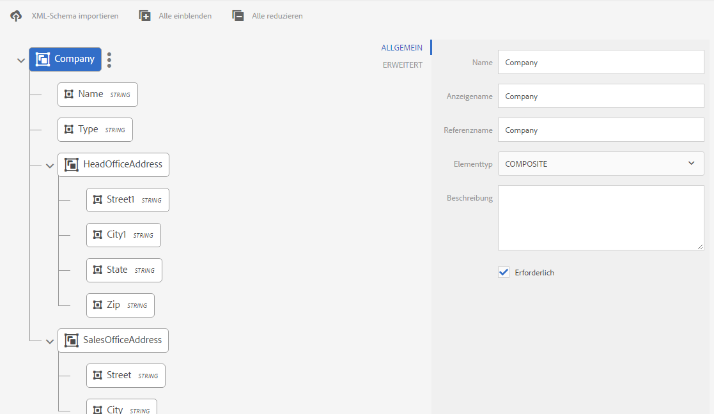
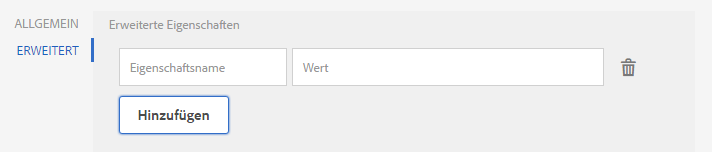
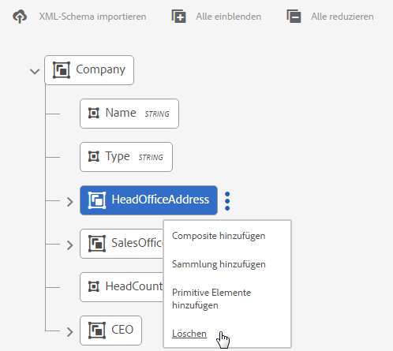
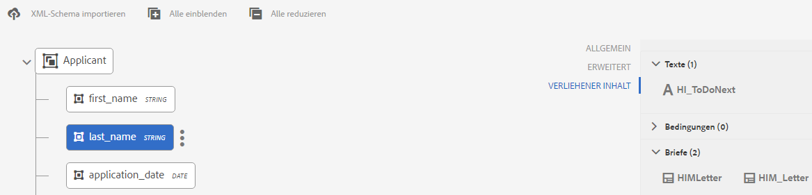

# Datenwörterbuch{#data-dictionary}

## Einführung {#introduction}

Mit Datenwörterbücher sind die Benutzer in der Lage, Informationen aus Back-End-Datenquellen zu verwenden, ohne technische Details der zugrunde liegenden Datenmodelle zu kennen. Ein Datenwörterbuch besteht aus Datenwörterbuchelementen (DDEs). Diese Datenelemente können Sie verwenden, um Back-End-Daten als Eingaben in Briefe einzufügen, um sie bei der Kundenkorrespondenz zu verwenden.

Ein Datenwörterbuch ist eine unabhängige Darstellung von Metadaten, die zu Grunde liegende Datenstrukturen und die dazugehörigen Attribute beschreibt. Ein Datenwörterbuch wird mit Hilfe von Unternehmensvokabular aufgebaut. Es kann einem oder mehreren zu Grunde liegenden Datenmodellen zugeordnet werden.

Ein Datenwörterbuch besteht aus Datenwörterbuchelementen (DDEs), von denen es drei Typen gibt: Elemente des Typs „Simple“, „Composite“ und „Collection“. Simple-DDEs sind Primitive-Elemente wie Zeichenfolgen, Zahlen, Daten und boolesche Werte, die Informationen wie z. B. den Stadtnamen enthalten. Ein Composite DDE enthält andere DDEs, die vom Typ „Primitive“, „Composite“ oder „Collection“ sein können. Das kann z. B. eine Adresse sein, die aus einer Straße, einer Stadt, einem Bezirk, einem Land und einer Postleitzahl besteht. Eine „Collection“ ist eine Liste von ähnlichen Simple- oder Composite-DDEs. Beispielsweise ein Kunde mit mehreren Wohnsitzen oder mit unterschiedlicher Rechnungs- und Versandadresse.

Correspondence Management verwendet die Daten Back-End, Customer oder Empfänger, die gemäß der Datenwörterbuchstruktur gespeichert werden, um Korrespondenz für verschiedene Kunden zu erstellen. Beispielsweise kann ein Dokument mit Anzeigenamen wie „Lieber {Vorname}“, „Herr {Nachname}“ erstellt werden.

In der Regel müssen Geschäftsbenutzer keine Kenntnisse über Metadatendarstellungen wie XSD (XML-Schema) und Java-Klassen haben. Sie müssen allerdings in der Regel Zugriff auf diese Datenstrukturen und Attribute haben, um Lösungen erstellen zu können.

### Datenwörterbuch - Arbeitsablauf {#data-dictionary-workflow}

1. Ein Autor [erstellt das Datenwörterbuch](#createdatadictionary) entweder durch Importieren eines Schemas oder durch vollständige Neuerstellung.
1. Der Verfasser erstellt Briefe und interaktive Kommunikation auf Grundlage des Datenwörterbuchs und verknüpft gegebenenfalls Datenwörterbuchelemente in Briefen und adaptiven Dokumenten.
1. Ein Verfasser kann Beispieldaten-XML-Dateien herunterladen, die auf einem Datenwörterbuchschema basieren. Der Autor kann die XML-Musterdatendatei ändern, die als Testdaten mit dem Datenwörterbuch verknüpft werden kann. Diese wird während der Briefvorschau verwendet.
1. Bei der [Vorschau eines Briefs](../../forms/using/create-letter.md#p-types-of-linkage-available-for-each-of-the-fields-p) wählt ein Verfasser den Brief mit den Daten (benutzerdefinierte Vorschau). Der Brief wird mit den vom Autor bereitgestellten Daten geöffnet. Er wird in „Korrespondenz erstellen“ geöffnet. Der Agent, der diesen Brief in der Vorschau anzeigt, kann den Inhalt, die Daten und die Anlagen in diesem Brief ändern und den fertigen Brief übermitteln. Weitere Informationen zum Erstellen von Briefen finden Sie unter [Korrespondenz erstellen](../../forms/using/create-letter.md).

## Voraussetzung {#prerequisite}

Installieren Sie das [Kompatibilitätspaket](compatibility-package.md), um die Option **Datenwörterbücher** auf der Seite **Forms** Ansicht.

## Datenwörterbuch erstellen {#createdatadictionary}

Verwenden Sie den Datenwörterbucheditor zum Erstellen eines Datenwörterbuchs oder laden Sie eine XSD-Schemadatei hoch, um ein Datenwörterbuch auf dieser Grundlage zu erstellen. Anschließend können Sie das Datenwörterbuch durch Hinzufügen weiterer erforderlicher Informationen, einschließlich Felder, erweitern. Unabhängig davon, wie ein Datenwörterbuch erstellt wurde, muss der Eigentümer des Geschäftsprozesses keine Kenntnisse über Back-End-Systeme haben. Er muss nur über Kenntnisse zu Domänenobjekten und deren Definitionen verfügen.

>[!NOTE]
>
>Bei mehreren Briefe, die ähnliche Elemente erfordern, können Sie ein allgemeines Datenwörterbuch erstellen. Ein großes Datenwörterbuch mit vielen Elementen kann jedoch Leistungseinbußen bei der Verwendung des Datenwörterbuchs und beim Laden der Elemente verursachen, etwa in Briefen und Dokumentfragmenten. Falls Leistungsprobleme auftreten, erstellen Sie separate Datenwörterbücher für verschiedene Briefe.

1. Wählen Sie **Formulare** > **Datenwörterbücher**.
1. Tippen Sie auf **Datenwörterbuch erstellen**.
1. Fügen Sie im Bildschirm „Eigenschaften“ Folgendes hinzu:

   * **Titel:** (Optional) Geben Sie den Titel für das Datenwörterbuch ein. Titel müssen nicht eindeutig sein und dürfen Sonderzeichen und nichtenglische Zeichen enthalten. Briefe und andere Dokumentfragmente werden durch ihren Titel (falls verfügbar) referenziert, z. B. in Miniaturansichten und Asset-Eigenschaften. Auf Datenwörterbücher wird nicht über ihre Titel, sondern über ihre Namen verwiesen.
   * **Name**: Der eindeutige Name des Datenwörterbuchs. Im Feld „Name“ können Sie nur englische Sprachzeichen, Zahlen und Bindestriche eingeben. Das Feld „Name“ wird automatisch basierend auf dem Feld „Titel“ ausgefüllt, wobei Sonderzeichen, Leerzeichen, Zahlen und nichtenglische Zeichen aus dem Feld „Titel“ durch Bindestriche ersetzt werden. Obwohl der Wert im Feld „Titel“ automatisch in das Feld „Name“ kopiert wird, können Sie den Wert bearbeiten.

   * **Beschreibung**: (Optional) Beschreibung des Datenwörterbuchs.
   * **Tags:** (Optional) Um ein benutzerdefiniertes Tag zu erstellen, geben Sie einen Wert in das Textfeld ein und drücken Sie die Eingabetaste. Sie können den Tag unterhalb des Textfeldes der Tags sehen. Wenn Sie diesen Text speichern, werden die neu hinzugefügten Tags auch erstellt.
   * **Erweiterte Eigenschaften**: (Optional) Tippen Sie auf  **Hinzufügen** Feld, um Metadatenattribute für Ihr Datenwörterbuch anzugeben. Geben Sie in der Spalte „Eigenschaftsname“ einen eindeutigen Namen für die Eigenschaft ein. Geben Sie in der Spalte „Wert“ einen Wert ein, der mit der Eigenschaft verknüpft werden soll.

   

1. (Optional) Um eine XSD-Schema-Definition für Ihr Datenwörterbuch hochzuladen, tippen Sie im Bereich &quot;Datenwörterbuchstruktur&quot;auf **XML-Schema hochladen**. Navigieren Sie zur XSD-Datei, wählen Sie sie aus und tippen Sie auf **Öffnen**. Ein Datenwörterbuch wird basierend auf dem hochgeladenen XML-Schema erstellt. Sie müssen die Anzeigenamen und Beschreibungen des Elements im Datenwörterbuch anpassen. Dazu müssen Sie die Namen der Elemente wählen, indem Sie darauf tippen und dann ihre Beschreibungen, Anzeigenamen und andere Details in den Feldern im rechten Bereich ändern.

   Weitere Informationen zu berechneten DD-Elementen finden Sie unter [Berechnete Datenwörterbuchelemente](#computedddelements).

   >[!NOTE]
   >
   >Sie können das Hochladen der Schemadatei überspringen und Ihr eigenes Datenwörterbuch von Grund auf mithilfe der Benutzeroberfläche erstellen. Hierzu überspringen Sie diesen Schritt und fahren Sie mit den nächsten Schritten fort.

1. Tippen Sie auf **Weiter**.
1. Fügen Sie im Bildschirm „Eigenschaften hinzufügen“ die Elemente zum Datenwörterbuch hinzu. Sie können auch Elemente hinzufügen/löschen und ihre Details bearbeiten, wenn Sie ein Schema hochgeladen haben, um eine Basisstruktur des Datenwörterbuchs zu erhalten.

   Sie können auf die drei Punkte auf der rechten Seite eines Elements tippen und der Datenwörterbuchstruktur ein Element hinzufügen.

   

   Wählen Sie entweder Composite-Element, Collection-Element oder Primitive-Element aus.

   * Ein Composite DDE enthält andere DDEs, die vom Typ „Primitive“, „Composite“ oder „Collection“ sein können. Das kann z. B. eine Adresse sein, die aus einer Straße, einer Stadt, einem Bezirk, einem Land und einer Postleitzahl besteht.
   * Primitive-DDEs sind Primitive-Elemente wie Zeichenfolgen, Zahlen, Daten und boolesche Werte, die Informationen wie z. B. den Stadtnamen enthalten.
   * Eine „Collection“ ist eine Liste von ähnlichen Simple- oder Composite-DDEs. Beispielsweise ein Kunde mit mehreren Wohnsitzen oder mit unterschiedlicher Rechnungs- und Versandadresse.

   Nachfolgend finden Sie einige Regeln zu Erstellen eines Datenwörterbuchs:

   * Nur der Composite-Typ ist als DDE der obersten Ebene in einem Datenwörterbuch zulässig.
   * Name, Referenzname und Elementtyp sind Pflichtfelder für ein Datenwörterbuch und DDEs.
   * Der Referenzname muss eindeutig sein.
   * Ein übergeordnetes DDE (Composite) darf nicht zwei untergeordnete DDE mit demselben Namen haben.
   * „Enums“ enthalten nur Primitive-Zeichenfolgentypen.

   Weitere Informationen zu Composite-, Collection- und Primitive-Elementen und zum Arbeiten mit Datenwörterbuchelementen finden Sie unter [Zuordnen von Datenwörterbuchelementen zu XML-Schema](#mappingddetoschema).

   Informationen zu Überprüfungen im Datenwörterbuch finden Sie unter [Validierungen für den Datenwörterbucheditor](#ddvalidations).

   

1. (Optional) Nach der Auswahl eines Elements können Sie auf der Registerkarte „Erweitert“ Eigenschaften (Attribute) hinzufügen. Sie können auch auf **Hinzufügen Feld** tippen und die Eigenschaften eines DD-Elements erweitern.

   

1. (Optional) Sie können ein beliebiges Element entfernen, indem Sie auf die drei Punkte auf der rechten Seite eines Elements tippen und **Löschen** auswählen.

   

   >[!NOTE]
   >
   >Beim Löschen eines Composite-/Collection-Elements mit untergeordneten Knoten werden seine untergeordneten Knoten auch gelöscht.

1. (Optional) Wählen Sie ein Element im Bereich „Datenwörterbuchstruktur“ und im Bereich „Feld- und Variablenliste“. Ändern Sie alle erforderlichen Attribute, die mit dem Element verknüpft sind, oder fügen Sie Attribute hinzu.
1. Tippen Sie auf **Speichern**.

### Kopien eines oder mehrerer Datenwörterbücher erstellen {#create-copies-of-one-or-more-data-dictionary}

Um schnell ein oder mehrere Datenwörterbücher mit Eigenschaften und Elementen zu erstellen, die denen von vorhandenen Datenwörterbüchern ähnlich sind, können Sie diese kopieren und einfügen.

1. Wählen Sie in der Liste der Datenwörterbücher die gewünschten Datenwörterbücher. Auf der Benutzeroberfläche wird das Symbol „Kopieren“ angezeigt.
1. Tippen Sie auf Kopieren. Auf der Benutzeroberfläche wird das Symbol „Einfügen“ angezeigt.
1. Wählen Sie „Einfügen“. Das Dialogfeld „Einfügen“ wird angezeigt. Das System weist automatisch die Namen und Titel der neuen Datenwörterbücher zu.
1. Bearbeiten Sie gegebenenfalls den Titel und Namen, mit dem Sie die Kopie des Datenwörterbuchs speichern möchten.
1. Wählen Sie „Einfügen“. Die Kopie des Datenwörterbuchs wird erstellt. Jetzt können Sie die erforderlichen Änderungen an Ihrem neu erstellten Datenwörterbuch vornehmen.

## Anzeigen der Dokumentfragmente oder Dokumente, die auf ein Datenwörterbuchelement verweisen {#see-the-document-fragments-or-documents-that-refer-to-a-data-dictionary-element}

Beim Bearbeiten oder Anzeigen des Datenwörterbuchs sehen Sie, welche Elemente des Datenwörterbuchs in welchen Texten, Bedingungen, Briefe und interaktive Kommunikation referenziert werden.

1. Führen Sie einen der folgenden Schritte aus, um das Datenwörterbuch zu bearbeiten:

   * Bewegen Sie den Mauszeiger über ein Datenwörterbuch und tippen Sie auf „Bearbeiten“.
   * Wählen Sie ein Datenwörterbuch aus und tippen Sie in der Kopfzeile auf „Bearbeiten“.
   * Bewegen Sie den Mauszeiger über ein Datenwörterbuch und tippen Sie auf „Auswählen“. Tippen Sie dann in der Kopfzeile auf „Bearbeiten“.

   Oder tippen Sie auf ein Datenwörterbuch, um es anzuzeigen.

1. Im Datenwörterbuch tippen Sie auf ein einfaches Element, um es auszuwählen. Composite- und Collection-Elemente haben keine Verweise.

   Zusammen mit den grundlegenden und erweiterten Eigenschaften des Elements wird auch geliehener Inhalt angezeigt.

1. Tippen Sie auf „Geliehener Inhalt“.

   Die Registrierkarte „Geliehener Inhalt“ mit dem folgenden Inhalten wird angezeigt: Texte, Bedingungen, Briefe und Interaktive Kommunikation. Bei jeder dieser Überschriften wird auch die Anzahl der Verweise auf das ausgewählte Element angezeigt.

1. Tippen Sie auf ein Überschrift, um den Namen des Assets, in dem auf das Element verwiesen wird, anzuzeigen.

   

1. Um geliehenen Inhalt für ein anderes Element anzuzeigen, tippen Sie auf das Element.
1. Um ein Asset anzuzeigen, das auf ein Element verweist, tippen Sie auf seinen Namen. Das Asset, der Brief oder das ainteraktive Kommunikation wird im Browser angezeigt.

## Arbeiten mit Testdaten {#working-with-test-data}

1. Tippen Sie auf der Seite &quot;Datenwörterbücher&quot;auf **Auswählen**.
1. Tippen Sie auf ein Datenwörterbuch, für das Sie Testdaten herunterladen möchten, und tippen Sie dann auf **XML-Beispieldaten herunterladen**.
1. Tippen Sie in der Warnmeldung auf **OK**. Eine XML-Datei wird heruntergeladen.
1. Öffnen Sie die XML-Datei mit Notepad oder einem anderen XML-Editor. Die XML-Datei hat dieselbe Struktur wie das Datenwörterbuch und die Platzhalterzeichenfolgen in den Elementen. Ersetzen Sie die Platzhalterzeichenfolgen mit den Daten, mit denen Sie einen Brief testen wollen.

   ```xml
   <?xml version="1.0" encoding="UTF-8" standalone="no"?>
   <Company>
   <Name>string</Name>
   <Type>string</Type>
   <HeadOfficeAddress>
   <Street>string</Street>
   <City>string</City>
   <State>string</State>
   <Zip>string</Zip>
   </HeadOfficeAddress>
   <SalesOfficeAddress>
   <Street>string</Street>
   <City>string</City>
   <State>string</State>
   <Zip>string</Zip>
   </SalesOfficeAddress>
   <HeadCount>1.0</HeadCount>
   <CEO>
   <PersonName>
   <FirstName>string</FirstName>
   <MiddleName>string</MiddleName>
   <LastName>string</LastName>
   </PersonName>
   <DOB>string</DOB>
   <CurrAddress>
   <Street>string</Street>
   <City>string</City>
   <State>string</State>
   <Zip>string</Zip>
   </CurrAddress>
   <DOJ>14-04-1973</DOJ>
   <Phone>1.0</Phone>
   </CEO>
   </Company>
   ```

   >[!NOTE]
   >
   >In diesem Beispiel erstellt XML Platz für drei Werte für ein Collection-Element, aber die Anzahl der Werte kann gemäß der Anforderung erhöht/verringert werden.

1. Nachdem die Dateneinträge vorgenommen wurden, können Sie diese XML-Datei verwenden, wenn Sie einen Brief mit Testdaten in der Vorschau anzeigen.

   Sie können diese Testdaten mit DD hinzufügen (Wählen Sie DD und tippen Sie auf Testdaten hochladen und laden Sie diese XML-Datei hoch)
Wenn Sie danach den Brief normal (nicht benutzerdefiniert) Vorschau haben, werden diese XML-Daten im Brief verwendet. Sie können auch auf „Benutzerdefiniert“ tippen und diese XML hochladen.

## Stichproben {#samples}

Im Folgenden sind Codebeispiele aufgelistet, die Implementierungsdetails für das Datenwörterbuch zeigen.

### Beispielschema, das in ein Datenwörterbuch hochgeladen werden kann {#sample-schema-that-can-be-uploaded-to-the-data-dictionary}

```xml
<?xml version="1.0" encoding="utf-8"?>
<xs:schema xmlns="DCT" targetNamespace="DCT" xmlns:xs="https://www.w3.org/2001/XMLSchema"
  elementFormDefault="qualified" attributeFormDefault="unqualified">
  <xs:element name="Company">
    <xs:complexType>
      <xs:sequence>
        <xs:element name="Name" type="xs:string"/>
        <xs:element name="Type" type="xs:anySimpleType"/>
        <xs:element name="HeadOfficeAddress" type="Address"/>
        <xs:element name="SalesOfficeAddress" type="Address" minOccurs="0"/>
        <xs:element name="HeadCount" type="xs:integer"/>
        <xs:element name="CEO" type="Employee"/>
        <xs:element name="Workers" type="Employee" maxOccurs="unbounded"/>
      </xs:sequence>
    </xs:complexType>
  </xs:element>
  <xs:complexType name="Employee">
    <xs:complexContent>
      <xs:extension  base="Person">
        <xs:sequence>
          <xs:element name="CurrAddress" type="Address"/>
          <xs:element name="DOJ" type="xs:date"/>
          <xs:element name="Phone" type="xs:integer"/>
        </xs:sequence>
      </xs:extension>
    </xs:complexContent>
  </xs:complexType>
  <xs:complexType name="Person">
    <xs:sequence>
      <xs:element name="PersonName" type="Name"/>
      <xs:element name="DOB" type="xs:dateTime"/>
    </xs:sequence>
  </xs:complexType>
  <xs:complexType name="Name">
    <xs:sequence>
      <xs:element name="FirstName" type="xs:string"/>
      <xs:element name="MiddleName" type="xs:string"/>
      <xs:element name="LastName" type="xs:string"/>
    </xs:sequence>
  </xs:complexType>
  <xs:complexType name="Address">
    <xs:sequence>
      <xs:element name="Street" type="xs:string"/>
      <xs:element name="City" type="xs:string"/>
      <xs:element name="State" type="xs:string"/>
      <xs:element name="Zip" type="xs:string"/>
    </xs:sequence>
  </xs:complexType>
</xs:schema>
```

## Allgemeine Attribute, die mit einem DDE verknüpft sind:{#common-attributes-associated-with-a-dde}

In der folgenden Tabelle werden allgemeine Attribute, die mit einem DDE verknüpft sind, gezeigt:

<table>
 <tbody>
  <tr>
   <td><strong>Attribut</strong></td>
   <td><strong>Typ</strong></td>
   <td><strong>Beschreibung</strong></td>
  </tr>
  <tr>
   <td>Name</td>
   <td>Zeichenfolge</td>
   <td>Erforderlich.<br /> Name des DDEs. Es muss eindeutig sein.</td>
  </tr>
  <tr>
   <td>Referenz<br />name</td>
   <td>Zeichenfolge</td>
   <td>Erforderlich. Eindeutiger Verweisname für das DDE, der Verweise auf das DDE ermöglicht, die unabhängig von Hierarchie- oder Strukturänderungen des Datenwörterbuchs sind. Textmodule werden mithilfe dieses Namens zugeordnet.</td>
  </tr>
  <tr>
   <td>Anzeigename</td>
   <td>Zeichenfolge</td>
   <td>Ein optionaler benutzerfreundlicher Name des DDEs.</td>
  </tr>
  <tr>
   <td>description</td>
   <td>Zeichenfolge</td>
   <td>Beschreibung des DDE.</td>
  </tr>
  <tr>
   <td>elementType</td>
   <td>Zeichenfolge</td>
   <td>Erforderlich. Der Typ des DDEs: STRING, NUMBER, DATE, BOOLEAN, COMPOSITE, COLLECTION.</td>
  </tr>
  <tr>
   <td>elementSubType</td>
   <td>Zeichenfolge</td>
   <td>Der Subtyp für DDE: ENUM. Nur für elementType STRING und NUMBER.</td>
  </tr>
  <tr>
   <td>Schlüssel</td>
   <td>Boolesch</td>
   <td>Ein boolesches Feld, um anzuzeigen, ob ein DDE ein Schlüsselelement ist.</td>
  </tr>
  <tr>
   <td>Berechnet</td>
   <td>Boolesch</td>
   <td>Ein boolesches Feld, um anzuzeigen, ob ein DDE berechnet wurde. Ein berechneter DDE-Wert ist eine Funktion anderer DDE-Werte. Standardmäßig werden JSP-Ausdruck unterstützt.</td>
  </tr>
  <tr>
   <td>Ausdruck</td>
   <td>Zeichenfolge</td>
   <td>Der Ausdruck für das „berechnete“ DDE. Der standardmäßig versandte Ausdrucksauswertungsdienst unterstützt JSP-EL-Ausdrücke. Sie können den Ausdrucksdienst durch eine benutzerdefinierte Implementierung ersetzen.</td>
  </tr>
  <tr>
   <td>valueSet</td>
   <td>Liste</td>
   <td>Ein Satz zulässiger Werte für ein DDE vom Typ „Enum“. Beispielsweise kann Accounttype nur zwei Werte (Sparkonto, Girokonto) haben.</td>
  </tr>
  <tr>
   <td>extendedProperties</td>
   <td>Object</td>
   <td>Eine Zuordnung von benutzerdefinierten Eigenschaften, die dem DDE hinzugefügt wurden (benutzeroberflächenspezifische oder andere Informationen).</td>
  </tr>
  <tr>
   <td>Erforderlich</td>
   <td>Boolesch</td>
   <td>Die Markierung gibt an, dass die dem Datenwörterbuch entsprechende Quelle von Instanzdaten den Wert dieses bestimmten DDE enthalten muss.</td>
  </tr>
  <tr>
   <td>Bindung</td>
   <td>BindingElement</td>
   <td>Die XML- oder Java-Bindung des Elements.</td>
  </tr>
 </tbody>
</table>

### Berechnete Datenwörterbuchelemente  {#computedddelements}

Ein Datenwörterbuch kann auch berechnete Elemente enthalten. Ein berechnetes Datenwörterbuchelement ist immer mit einem Ausdruck verknüpft. Der Ausdruck wird geprüft, um den Wert eines Datenwörterbuchelements zur Laufzeit abzurufen. Ein berechneter DDE-Wert ist eine Funktion anderer DDE-Werte oder Literale. Standardmäßig werden JSP-Expression Language(EL)-Ausdrücke unterstützt. Die EL-Ausdrücke verwenden die ${ }-Zeichen und gültige Ausdrücke können Literale, Operatoren, Variablen (Datenwörterbuchelementverweise) und Funktionsaufrufe enthalten. Beim Verweisen auf ein Datenwörterbuchelement im Ausdruck wird der Verweisname des DDE verwendet. Der Verweisname ist für jedes Datenwörterbuchelement in einem Datenwörterbuch eindeutig.

Ein berechneter DDE PersonFullName kann mit einem EL-Verkettungsausdruck wie ${PersonFirstName} ${PersonLastName} verknüpft werden.

## Datentypzuordnung zwischen XSD und Datenwörterbuch {#data-type-mapping-between-xsd-and-data-dictionary-br}

Das Exportieren einer XSD-Datei erfordert eine bestimmte Datenzuordnung, die in der folgenden Tabelle aufgeführt ist. Die DDI-Spalte gibt den Typ des DDE-Wertes an, wie er in der DDI verfügbar ist.

<table>
 <tbody>
  <tr>
   <td>XSD <br /> </td>
   <td><p>Datenwörterbuch <br /> </p> </td>
   <td>DDI (Datentyp des Instanzwertes)<br /> </p> </td>
  </tr>
  <tr>
   <td><p>xs:element des Typs „Composite“<br /> </p> </td>
   <td>DDE des Typs COMPOSITE<br /> </p> </td>
   <td>java.util.Map<br /> </td>
  </tr>
  <tr>
   <td><p>xs:element, wobei maxOccurs &gt; 1<br /> </p> </td>
   <td>DDE des Typs COLLECTION <br /> Ein DDE-Knoten wird neben dem COLLECTION-DDE erstellt, das Informationen aus dem übergeordneten COLLECTION-Knoten erfasst. Derselbe Knoten wird für die Collection der Simple-/Composite-Datentypen erstellt. Wenn Sie eine COLLECTION des Typs „Composite“ haben, erfasst die Baumstruktur des Datenwörterbuchs die einzelnen Felder in den untergeordneten Elementen des DDE, die zum Erfassen von Typinformationen erstellt wurden.<br /> - DDE (COLLECTION)<br /> - DDE(COMPOSITE für Typinfo)<br /> - DDE(STRING) field1<br /> - DDE(STRING) field2<br /> <br /> </p> </td>
   <td>java.util.List<br /> </td>
  </tr>
  <tr>
   <td>Attribut des Typs "xs:id <br />" </p> </td>
   <td>DDE des Typs STRING <br /> </td>
   <td>java.lang.String<br /> </td>
  </tr>
  <tr>
   <td>xs:attribute/xs:element des Typs „xs:string“</p> </td>
   <td>DDE des Typs STRING<br /> </td>
   <td>java.lang.String<br /> </td>
  </tr>
  <tr>
   <td>xs:attribute/xs:element des Typs "xs": boolean <br /> </td>
   <td>DDE des Typs Boolescher <br /> </td>
   <td>java.lang.Boolean<br /> </td>
  </tr>
  <tr>
   <td>xs:attribute/xs:element des Typs "xs:date" </td>
   <td>DDE des Typs DATE </td>
   <td>java.lang.String</td>
  </tr>
  <tr>
   <td>xs:attribute/xs:element des Typs "xs:integer" </td>
   <td>DDE des Typs NUMBER </td>
   <td>java.lang.Double</td>
  </tr>
  <tr>
   <td>xs:attribute/xs:element des Typs „xs:long“</td>
   <td>DDE des Typs NUMBER </td>
   <td>java.lang.Double</td>
  </tr>
  <tr>
   <td>xs:attribute/xs:element des Typs „xs:double“</td>
   <td>DDE des Typs NUMBER </td>
   <td>java.lang.Double</td>
  </tr>
  <tr>
   <td>Element des Typs „Enum“ und „baseType“ – xs: String</td>
   <td>DDE des<br /> Typs - STRING<br /> subtype - ENUM<br /> valueSet - der zulässige Wert für ENUM<br /> </td>
   <td>java.lang.String</td>
  </tr>
 </tbody>
</table>

## Beispieldatendatei aus einem Datenwörterbuch herunterladen  {#download-a-sample-data-file-from-a-data-dictionary}

Nachdem Sie ein Datenwörterbuch erstellt haben, können Sie es als XML-Musterdatendatei herunterladen, um darin Texteinträge vorzunehmen.

1. Tippen Sie auf der Seite &quot;Datenwörterbücher&quot;auf **Select** und dann auf ein Datenwörterbuch, um es auszuwählen.
1. Wählen Sie **XML-Beispieldaten herunterladen**.
1. Tippen Sie in der Warnmeldung auf **OK**.

   Correspondence Management erstellt eine XML-Datei, die auf der ausgewählten Datenwörterbuchstruktur basiert und lädt sie auf Ihren Computer mit dem Namen &lt;data-dictionary-name>-SampleData. Jetzt können Sie diese Datei in einer XML oder einem Texteditor bearbeiten, um Dateneinträge zu tätigen, während Sie [einen Brief](../../forms/using/create-letter.md) erstellen.

## Internationalisierung von Metadaten {#internationalization-of-meta-data}

Wenn Sie denselben Brief in unterschiedlichen Sprachen senden möchten, können Sie den Anzeigenamen, die Beschreibung und die Enum-Wertesätze des Datenwörterbuchs und der Datenwörterbuchelemente lokalisieren.

### Datenwörterbuch lokalisieren {#localize-data-dictionary}

1. Tippen Sie auf der Seite &quot;Datenwörterbücher&quot;auf **Select** und dann auf ein Datenwörterbuch, um es auszuwählen.
1. Tippen Sie auf **Daten zur Lokale Anpassung herunterladen**.
1. Tippen Sie im Warnhinweis auf **OK**. Correspondence Management lädt eine ZIP-Datei auf Ihrem Computer mit dem Namen DataDictionary-&lt;DDname>.zip herunter.
1. Die ZIP-Datei enthält eine Datei des Typs „.properties“. Diese Datei definiert das heruntergeladene Datenwörterbuch. Der Inhalt dieser Datei ist ähnliche wie folgender Inhalt:

   ```ini
   #Wed May 20 16:06:23 BST 2015
   DataDictionary.EmployeeDD.description=
   DataDictionary.EmployeeDD.displayName=EmployeeDataDictionary
   DataDictionaryElement.name.description=
   DataDictionaryElement.name.displayName=name
   DataDictionaryElement.person.description=
   DataDictionaryElement.person.displayName=person
   ```

   In der Struktur der Eigenschaftendatei definiert jeweils eine Zeile die Beschreibung und den Anzeigenamen des Datenwörterbuchs sowie jedes Datenwörterbuchelement im Datenwörterbuch. Darüber wird in der Eigenschaftendatei in jeweils einer Zeile ein Enum-Wertesatz für jedes Datenwörterbuchelement definiert. Wie ein Datenwörterbuch kann auch die entsprechende Eigenschaftendatei über mehrere Datenwörterbuch-Elementdefinitionen verfügen. Darüber hinaus kann die Datei die Definitionen für einen oder mehrere Enum-Wertesätze enthalten.

1. Um die .properties-Datei in einem anderen Gebietsschema zu aktualisieren, aktualisieren Sie die Anzeigenamen- und Beschreibungswerte in der Datei. Erstellen Sie weitere Instanzen der Datei für jede Sprache, die Sie lokalisieren wollen. Nur Französisch, Deutsch, Japanisch und Englisch werden unterstützt.

1. Speichern Sie die verschiedenen aktualisierten Eigenschaftendateien mit den folgenden Namen:

   _fr_FR.properties Französisch

   _de_DE.properties Deutsch

   _ja_JA.properties Japanisch

   _en_EN.properties Englisch

1. Archivieren Sie die .properties-Datei (oder bei mehreren Gebietsschemas die Dateien) in einer einzelnen ZIP-Datei.

1. Wählen Sie auf der Seite „Datenwörterbuch“ **Mehr** > **Lokalisierungsdaten hochladen** und wählen Sie die ZIP-Datei mit lokalisierten Eigenschaftendateien.
1. Um die durch die Lokalisierung vorgenommenen Änderungen anzuzeigen, ändern Sie das Gebietsschemas des Browsers.

## Validierungen für Datenwörterbuch  {#ddvalidations}

Der Datenwörterbucheditor erzwingt folgende Überprüfungen beim Erstellen oder Aktualisieren eines Datenwörterbuchs.

* Nur der zusammengesetzte Typ ist als DDE der obersten Ebene in einem Datenwörterbuch zulässig.
* Composite- und Collection-Elemente sind auf Blattebene nicht zulässig. Nur Primitive-Elemente (String, Date, Number, Boolean) sind auf Blattebene zulässig. Diese Überprüfung stellt sicher, dass es keine Composite- oder Collection-Elemente ohne untergeordnetes DDE gibt.
* Beim Hochladen von XSD-Dateien zum Erstellen eines Datenwörterbuchs werden Sie vom Datenwörterbucheditor aufgefordert, ein Element der obersten Ebene einzugeben, wenn mehrere dieser Elemente vorhanden sind.
* Der Name ist der einzige erforderliche Parameter für ein Datenwörterbuch.
* Ein übergeordnetes DDE (Composite) darf nicht zwei untergeordnete DDE mit demselben Namen haben.
* Stellt sicher, dass ein DDE nur als „berechnet“ gekennzeichnet ist, wenn es sich nicht um einen erforderlichen Parameter handelt. Ein erforderliches Element kann nicht berechnet werden und ein berechnetes Element kann nicht erforderlich sein. Außerdem dürfen Collection- und Composite-Elemente keine berechneten Elemente sein.
* Stellt sicher, dass ein DDE nur als „erforderlich“ gekennzeichnet ist, wenn es nicht berechnet wird. Außerdem wird sichergestellt, dass es sich nicht um das „collectionElement“ handelt, das den Typ von Collection (die einzigen untergeordneten Elemente eines Collection-Elements) angibt.
* Leere oder duplizierte Schlüssel sind nicht in den extendedProperties für ein Datenwörterbuch oder ein DDE zulässig.
* Verwenden Sie keinen Doppelpunkt (:) oder senkrechten Strich (|) im Schlüssel oder Wert einer erweiterten Eigenschaft. Es gibt keine Überprüfung für die Verwendung dieser nicht zulässigen Zeichen.

Überprüfungen, die auf Datenwörterbuchebene angewendet werden

* Der Name des Datenwörterbuchs darf nicht null sein.
* Der Name des Datenwörterbuchs darf nur alphanumerische Zeichen enthalten.
* Die Liste der untergeordneten Elemente im Datenwörterbuch darf nicht null oder leer sein.
* Das Datenwörterbuch darf nicht mehr als ein Element der obersten Ebene enthalten.
* Nur der Composite-Typ ist als DDE der obersten Ebene in einem Datenwörterbuch zulässig.

Überprüfungen, die auf Datenwörterbuchelementebene angewendet werden.

* Alle Namen des DDE dürfen nicht null sein und dürfen keine Leerzeichen enthalten.
* Alle DDEs müssen über einen Elementtyp „nicht null“ verfügen.
* Alle Verweisnamen des DDE dürfen nicht null sein.
* Alle Verweisnamen des DDE müssen eindeutig sein.
* Alle DDE-Verweise dürfen nur alphanumerische Zeichen und „_“ enthalten.
* Alle DDE-Anzeigenamen dürfen nur alphanumerische Zeichen und „_“ enthalten.
* Composite- und Collection-Elemente sind auf Blattebene nicht zulässig. Nur Primitive-Elemente (String, Date, Number, Boolean) sind auf Blattebene zulässig. Diese Überprüfung stellt sicher, dass es keine Composite- oder Collection-Elemente ohne untergeordnetes DDE gibt.
* Ein übergeordnetes Composite-DDE darf nicht zwei untergeordnete Elemente mit demselben Namen enthalten.
* Der ENUM-Subtyp wird nur für String- und Number-Elemente verwendet.
* Collection- und Composite-Elemente können nicht berechnet werden.
* Ein DDE darf nicht gleichzeitig berechnet und erforderlich sein.
* Berechnete DDEs müssen einen gültigen Ausdruck enthalten.
* Berechnete DDEs dürfen keine XML-Bindung haben.
* Ein DDE, das den Typ für ein Collection-DDE angibt, kann nicht berechnet oder erforderlich sein.
* DDEs des Subtyps ENUM dürfen keine null- oder leeren Wertesätze enthalten.
* Die XML-Bindung eines Collection-DDE darf nicht einem Attribut zugeordnet sein.
* Die XML-Bindungssyntax muss gültig sein, z. B. darf nur ein @-Zeichen erscheinen. Dieses Zeichen ist nur zulässig, wenn danach ein Attributname steht.

## Datenwörterbuchelemente dem XML-Schema zuordnen  {#mappingddetoschema}

Sie können ein Datenwörterbuch aus einem XML-Schema erstellen oder es mithilfe der Datenwörterbuch-Benutzeroberfläche erstellen. Alle Datenwörterbuchelemente innerhalb eines Datenwörterbuchs verfügen über ein XML-Bindungsfeld, um die Bindung des DDE an ein Element im XML-Schema zu speichern. Die Bindung in jedem DDE ist relativ zum übergeordneten DDE.

Im Folgenden sind Beispielmodelle und Codebeispiele aufgelistet, die Implementierungsdetails für das Datenwörterbuch zeigen.

## Simple (Primitive-)Elemente zuordnen {#mapping-simple-primitive-elements}

Ein Primitive-DDE stellt ein Feld oder ein Attribut dar, das atomisch ist. Primitive-DDEs, die außerhalb eines komplexen Typs (Composite-DDE) definiert werden, oder wiederholte Elemente (Collection-DDE) können an einem beliebigen Speicherort im XML-Schema gespeichert werden. Der Speicherort der Daten, die einem Primitive-DDE entsprechen, hängt nicht von der Zuordnung seines übergeordneten DDE ab. Ein Primitive-DDE verwendet Zuordnungsinformationen aus dem XML-Bindungsfeld, um seinen Wert zu bestimmen, und die Zuordnungen können eins der Folgenden sein:

* ein Attribut
* ein Element
* ein Textkontext
* nichts (ein ignoriertes DDE)

Das nachstehende Beispiel zeigt ein einfaches Schema.

```xml
<?xml version="1.0" encoding="UTF-8"?>
<xs:schema xmlns:xs="https://www.w3.org/2001/XMLSchema">
  <xs:element name='age' type='integer'/>
  <xs:element name='price' type='decimal'/>
</xs:schema>
```

| **Datenwörterbuchelement** | **XML-Standardbindung** |
|---|---|
| age | /age |
| price | /price |

### Composite-Elemente zuordnen  {#mapping-composite-elements}

Bindung wird nicht für Composite-Elemente unterstützt. Wenn Bindung bereitgestellt wird, wird sie ignoriert. Die Bindung für alle untergeordneten DDEs des Primitive-Typs muss absolut sein. Die Zulassung absoluter Zuordnung für untergeordnete Elemente eines Composite-DDE bietet mehr Flexibilität hinsichtlich der XPath-Bindung. Die Zuordnung eines Composite-DDE zu einem komplexen Elementtyp im XML-Schema schränkt den Bereich der Bindung für die untergeordneten Elemente ein.

Im folgenden Beispiel wird das Schema für eine Anmerkung gezeigt.

```xml
<xs:element name="note">
    <xs:complexType>
        <xs:sequence>
            <xs:element name="to" type="xs:string"/>
            <xs:element name="from" type="xs:string"/>
            <xs:element name="heading" type="xs:string"/>
            <xs:element name="body" type="xs:string"/>
        </xs:sequence>
    </xs:complexType>
</xs:element>
```

<table>
 <tbody>
  <tr>
   <td><strong>Datenwörterbuchelement</strong></td>
   <td><strong>XML-Standardbindung</strong></td>
  </tr>
  <tr>
   <td>Hinweis</td>
   <td>empty(null)<br /> </td>
  </tr>
  <tr>
   <td>in</td>
   <td>/note/to</td>
  </tr>
  <tr>
   <td>von</td>
   <td>/note/from</td>
  </tr>
  <tr>
   <td>heading</td>
   <td>/note/heading</td>
  </tr>
  <tr>
   <td>body</td>
   <td>/note/body</td>
  </tr>
 </tbody>
</table>

### Collection-Elemente zuordnen  {#mapping-collection-elements}

Ein Collection-Element wird nur einem anderen Collection-Element zugeordnet, das eine Kardinalität von > 1 aufweist. Die untergeordneten DDEs eines Collection-DDE verfügen über relative (lokale) XML-Bindung in Bezug auf ihre übergeordnete XML-Bindung. Da die untergeordneten DDEs eines Collection-Elements dieselbe Kardinalität wie die übergeordneten Elemente aufweisen müssen, ist die relative Bindung vorgeschrieben, um sicherzustellen, dass die Kardinalitätseinschränkungen derart sind, dass die untergeordneten DDEs nicht auf ein nicht wiederholtes XML-Schemaelement verweisen. Im nachfolgenden Beispiel muss die Kardinalität von „TokenID“ dieselbe sein wie „Token“, die die übergeordnete Collection DDE ist.

Beim Zuordnen eines Collection DDE zu einem XML-Schema muss Folgendes beachtet werden:

* Die Bindung für das DDE, das dem Collection-Element entspricht, muss der absolute XPfad sein

* Es darf keine Bindung für das DDE, das den Typ des Collection-Elements darstellt, bereitgestellt werden. Wenn eine Bindung bereitgestellt wird, wird sie ignoriert.

* Die Bindung für alle untergeordneten DDEs muss relativ zum übergeordneten Collection-Element sein.

Im folgenden XML-Schema wird ein Element mit den Namen „Tokens“ und ein Attribut „maxOccurs“ mit „unbounded“ gezeigt. Daher ist „Tokens“ ein Collection-Element.

```xml
<?xml version="1.0" encoding="utf-8"?>
<Root>
  <Tokens>
    <TokenID>string</TokenID>
    <TokenText>
      <TextHeading>string</TextHeading>
      <TextBody>string</TextBody>
    </TokenText>
  </Tokens>
  <Tokens>
    <TokenID>string</TokenID>
    <TokenText>
      <TextHeading>string</TextHeading>
      <TextBody>string</TextBody>
    </TokenText>
  </Tokens>
  <Tokens>
    <TokenID>string</TokenID>
    <TokenText>
      <TextHeading>string</TextHeading>
      <TextBody>string</TextBody>
    </TokenText>
  </Tokens>
</Root>
```

Die mit diesem Beispiel verknüpfte „Token.xsd“, lautet wie folgt:

```xml
<xs:element name="Root">
  <xs:complexType>
    <xs:sequence>
      <xs:element name="Tokens" type="TokenType" maxOccurs="unbounded"/>
    </xs:sequence>
  </xs:complexType>
</xs:element>

<xs:complexType name="TokenType">
  <xs:sequence>
    <xs:element name="TokenID" type="xs:string"/>
    <xs:element name="TokenText">
      <xs:complexType>
        <xs:sequence>
          <xs:element name="TextHeading" type="xs:string"/>
          <xs:element name="TextBody" type="xs:string"/>
        </xs:sequence>
      </xs:complexType>
    </xs:element>
  </xs:sequence>
</xs:complexType>
```

| **Datenwörterbuchelement** | **XML-Standardbindung** |
|---|---|
| Root | empty(null) |
| Tokens | /Root/Tokens |
| Composite | empty(null) |
| TokenID | TokenID |
| TokenText | empty(null) |
| TokenHeading | TokenText/TextHeading |
| TokenBody | TokenText/TextBody |

