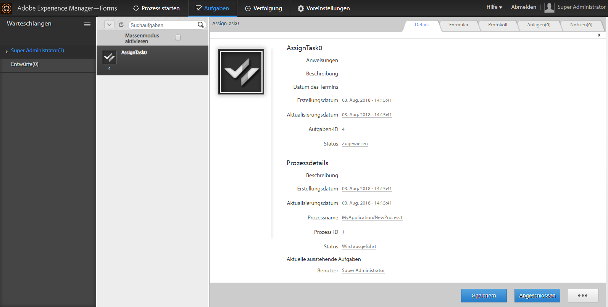

# Anzeigen zusätzlicher Daten in der ToDo-Liste{#displaying-additional-data-in-todo-list}

Standardmäßig zeigt die ToDo-Liste von A AEM Forms Workspace den Anzeigenamen und die Beschreibung von Aufgaben an. Sie können jedoch andere Informationen wie Erstellungsdatum und Termin hinzufügen. Sie können auch Symbole hinzufügen und den Stil der Anzeige ändern.



Dieser Artikel führt die einzelnen Schritte auf, um Anzeigeinformationen für jede Aufgabe in der ToDo-Liste hinzuzufügen.

## Was kann hinzugefügt werden {#what-can-be-added}

Sie können die verfügbaren Informationen der Datei in `task.json` hinzufügen, die vom Server gesendet wurde. Die Informationen können als normaler Text hinzugefügt werden, oder Sie können Stile verwenden, um die Informationen zu formatieren.

Weitere Informationen über die JSON-Objektbeschreibung finden Sie in [diesem](/help/forms/using/html-workspace-json-object-description.md) Artikel.

## Anzeigen von Informationen über eine Aufgabe  {#displaying-information-on-a-task}

1. Befolgen Sie die [generischen Schritte zur Anpassung von AEM Forms Workspace](../../forms/using/generic-steps-html-workspace-customization.md).
1. Um zusätzliche Information für eine Aufgabe anzuzeigen, müssen die entsprechenden Schlüssel-Wert-Paare innerhalb des Aufgabenblocks von `translation.json` hinzugefügt werden.

   Ändern Sie beispielsweise `/apps/ws/locales/en-US/translation.json` für Englisch:

   ```json
   "task" : {
           "reminder" : {
               "value" : "Reminder",
               "tooltip" : "This is reminder __reminderCount__, for this task."
           },
           "deadlined" : {
               "value" : "Deadlined",
               "tooltip" : "This task has deadlined"
           },
           "save" : {
               "message" : "Task has been saved successfully"
           },
           "status" : {
               "deadlined" : "Deadlined",
               "created" : "Created",
               "assignedsaved" : "Draft from assigned task",
               "terminated" : "Terminated",
               "assigned" : "Assigned",
               "unknown" : "Unknown",
               "createdsaved" : "Draft from created task",
               "completed" : "Completed"
           },
           "draft" : {
               "value" : "Saved",
               "tooltip" : "This task is marked as a draft"
           },
           "escalated" : {
               "value" : "Escalated",
               "tooltip" : "This task has been escalated"
           },
           "forward" : {
               "value" : "Forwarded",
               "tooltip" : "This task was forwarded"
           },
           "priority" : {
               "highest" : "Highest priority",
               "normal" : "Normal priority",
               "high" : "High priority",
               "low" : "Low priority",
               "lowest" : "Lowest priority"
           },
           "claimed" : {
               "value" : "Claimed",
               "tooltip" : "This task has been claimed"
           },
           "locked" : {
               "value" : "Locked",
               "tooltip" : "This task is locked"
           },
           "consulted" : {
               "value" : "Consulted",
               "tooltip" : "This task has been consulted"
           },
           "returned" : {
               "value" : "Returned",
               "tooltip" : "This task was returned back"
           },
           "multiplesubmitbuttons" : {
               "message" : "The form associated with this task has multiple submit buttons so the Workspace Complete button will be disabled. Click the appropriate button on the form to submit it."
           },
           "nosubmitbutton" : {
               "message" : "The form associated with this task does not appear to have submit buttons. You may need to upgrade your Adobe Reader version to 9.1 or greater and enable the Reader Submit option in your process."
           },
           "icon" : {
               "tooltip" : "open the task __taskName__"
           }
       }
   ```

   >[!NOTE]
   >
   >Fügen Sie entsprechende Schlüssel-Wert-Paare für alle unterstützten Sprachen hinzu.

1. Fügen Sie beispielsweise Informationen im Aufgabenblock hinzu:

   ```json
   "stepname" : {
               "value" : "Step Name",
               "tooltip" : "This task belongs to __stepName__ step"
   }
   ```

## Definieren von CSS für die neue Eigenschaft  {#defining-css-for-the-new-property}

1. Sie können einen Stil auf die einer Aufgabe hinzugefügten Informationen (Eigenschaft) anwenden. Dazu müssen Sie Stilinformationen für die neue Eigenschaft hinzufügen, die zu `/apps/ws/css/newStyle.css` hinzugefügt wird.

   Fügen Sie beispielsweise ein:

   ```css
   .task .taskProperties .stepname{
       width: 25px;
       background: url(../images/stepname.png) no-repeat; /*-------- Or just reuse background image / image-sprite defined .task .taskProperties span of style.css---------------------*/
       background-position: 0px 0px; /*-------- Dummy values, need to be configured as per user background image / image-sprite ---------------------*/
   }
   ```

## Hinzufügen eines Eintrags in der HTML-Vorlage  {#adding-entry-in-the-html-template}

Schließlich müssen Sie für jede Eigenschaft, die Sie der Aufgabe hinzufügen möchten, einen Eintrag ins Entwicklerpaket aufnehmen. Informationen zum Erstellen eines Eintrags finden Sie unter „Erstellen von AEM Forms Workspace-Code“.

1. Kopieren `task.html`:

   * von: `/libs/ws/js/runtime/templates/`
   * in: `/apps/ws/js/runtime/templates/`

1. Fügen Sie die neuen Informationen zu `/apps/ws/js/runtime/templates/task.html` hinzu.

   Fügen Sie beispielsweise unter `div class="taskProperties"` hinzu:

   ```jsp
   <span class="stepname" alt="<%= $.t('task.stepname.value')%>" title = '<%= $.t("task.stepname.tooltip",{stepName:stepName})%>'/>
   ```
