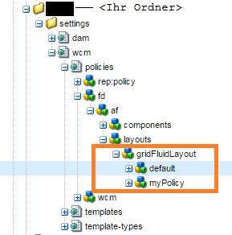
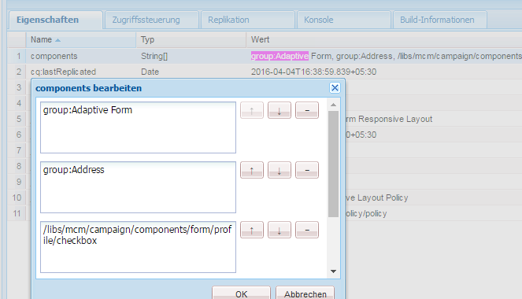
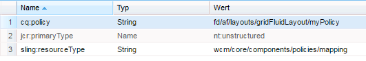

# Anzeigen von Komponenten basierend auf der verwendeten Vorlage{#displaying-components-based-on-the-template-used}

Wenn ein Formular anhand einer [Vorlage](../../forms/using/template-editor.md) erstellt wird, lassen sich basierend auf der Vorlagenrichtlinie bestimmte Komponenten sehen und verwenden. Sie können eine Inhaltsrichtlinie für Vorlagen angeben, mit der Sie eine Gruppe von Komponenten auswählen können, die Formularautorinnen und -autoren beim Verfassen des Formulars angezeigt wird.

## Ändern der Inhaltsrichtlinie einer Vorlage {#changing-the-content-policy-of-a-template}

Wenn Sie eine Vorlage erstellen, wird diese unter `/conf` im Content Repository erstellt. Basierend auf den Ordnern, die Sie im Verzeichnis `/conf` erstellt haben, lautet der Pfad zur Vorlage: `/conf/<your-folder>/settings/wcm/templates/<your-template>`.

Führen Sie die folgenden Schritte aus, um die Komponenten basierend auf der Content-Richtlinie einer Vorlage in der Seitenleiste anzuzeigen:

1. Öffnen Sie CRXDE Lite.\
   URL: `https://<server>:<port>/crx/de/index.jsp`
1. Gehen Sie in CRXDE zu dem Ordner, in dem die Vorlage erstellt werden soll.

   Beispiel: `/conf/<your-folder>/`

1. Navigieren Sie in CRXDE zu: `/conf/<your-folder>/settings/wcm/policies/fd/af/layouts/gridFluidLayout/`

   Zum Auswählen einer Komponentengruppe ist eine neue Inhaltsrichtlinie erforderlich. Kopieren Sie zum Erstellen einer Richtlinie die Standardrichtlinie, fügen Sie sie ein und benennen Sie sie um.

   Der Pfad zur Standardinhaltsrichtlinie lautet: `/conf/<your-folder>/settings/wcm/policies/fd/af/layouts/gridFluidLayout/default`

   Kopieren Sie im Ordner `gridFluidLayout` die Standardrichtlinie, fügen Sie sie ein und benennen Sie sie um. Beispiel: `myPolicy`.

   

1. Wählen Sie die neu zu erstellende Richtlinie und anschließend im rechten Bedienfeld die Eigenschaft **Komponenten** vom Typ `string[]` aus.

   Wenn Sie die Komponenteneigenschaft auswählen und öffnen, erscheint das Dialogfeld „Komponenten bearbeiten“. Im Dialogfeld „Komponenten bearbeiten“ können Sie Komponentengruppen mit den Tasten **+** und **-** hinzufügen oder entfernen. Sie können Komponentengruppen mit Komponenten hinzufügen, die Autoren für Formulare verwenden sollen. 

   

   Nachdem Sie eine Komponentengruppe hinzugefügt haben, klicken Sie auf **„OK“**, um die Liste zu aktualisieren, und klicken Sie dann auf **Alle speichern** über der CRXDE-Adressleiste und aktualisieren Sie.

1. Ändern Sie die Content-Richtlinie in der Vorlage vom Standard zu der neu erstellten Richtlinie. ( `myPolicy` in diesem Beispiel.)

   Um die Richtlinie zu ändern, navigieren Sie in CRXDE zu `/conf/<your-folder>/settings/wcm/templates/<your-template>/policies/jcr:content/guideContainer/rootPanel/items`.

   Ändern Sie in der Eigenschaft `cq:policy` den Eintrag `default` in den neuen Richtliniennamen (`myPolicy`).

   

   Wenn Sie ein Formular mit der Vorlage erstellen, werden die hinzugefügten Komponenten in der Seitenleiste angezeigt.
