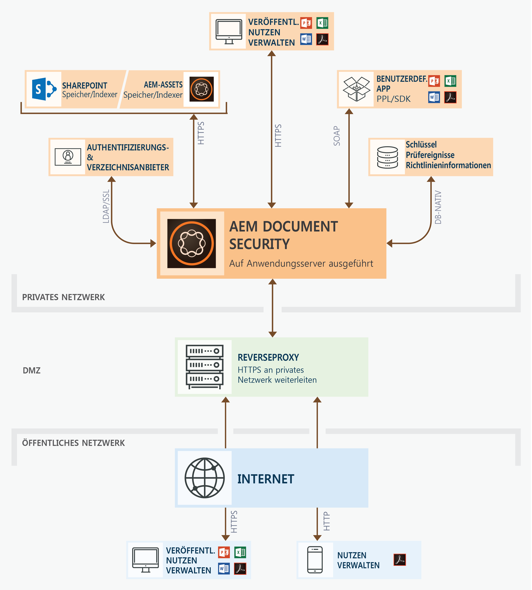
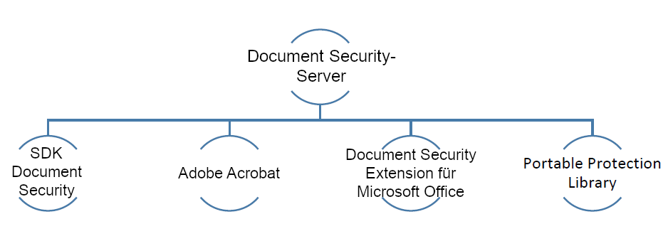

# Document Security-Angebote{#document-security-offerings}

Document Security stellt sicher, dass Ihre Dokumente nur von autorisierten Benutzern genutzt werden können. Mithilfe von Document Security können Sie Informationen sicher verteilen, die Sie in einem unterstützten Format gespeichert haben. Unterstützte Dateiformate beinhalten Adobe Portable Document Format (PDF) sowie Microsoft Word-, Excel- und PowerPoint-Dateien.

Sie können Dokumente durch Richtlinien schützen. Die Vertraulichkeitseinstellungen, die Sie in einer Richtlinie angeben, bestimmen, wie ein Empfänger ein Dokument nutzen darf, auf das Sie die Richtlinie anwenden. Sie können beispielsweise angeben, ob Empfänger Folgendes dürfen: Text drucken, kopieren oder bearbeiten, geschützten Dokumenten Signaturen und Kommentare hinzufügen.

Die Richtlinien werden zwar auf dem Document Security-Server gespeichert, Sie wenden sie jedoch über Ihre Client-Anwendung auf Dokumente an. Wenn Sie eine Richtlinie auf ein Dokument anwenden, werden die in der Datei enthaltenen Informationen durch die in der Richtlinie angegebenen Vertraulichkeitseinstellungen geschützt. Sie können das richtliniengeschützte Dokument an Empfänger verteilen, die durch die Richtlinie autorisiert sind.

Die folgende Abbildung zeigt die typische Architektur für AEM Forms Document Security:

## Document Security-Clients {#document-security-clients}

Document Security stellt verschiedene Clients bereit, um Dokumente zu schützen, geschützte Dokumente und Impulszähler anzuzeigen und zu bearbeiten, um die Volltextsuche in geschützten Dokumenten zu aktivieren. Sie können einen Client auswählen, der auf Ihren Anforderungen und Funktionen des Clients basiert.

Der Document Security-Server ist die zentrale Komponente, über die Document Security Transaktionen wie z. B. die Authentifizierung von Benutzern, die Richtlinienverwaltung in Echtzeit und das Durchsetzen der Vertraulichkeit ausführt. Der Server dient auch als zentraler Speicherort für Richtlinien, Prüfaufzeichnungen und andere dazugehörige Informationen.

Der Document Security-Server stellt eine webbasierte Oberfläche (Webseite) bereit, um Richtlinien zu erstellen, richtliniengeschützte Dokumente zu verwalten und Ereignisse im Zusammenhang mit richtliniengeschützten Dokumenten zu überwachen. Administratoren können auch globale Optionen konfigurieren, z. B. die Benutzerauthentifizierung, Prüfungen und Nachrichten an eingeladene Benutzer, sowie Konten eingeladener Benutzer verwalten.

Der Server ist im AEM Forms Document Security-Add-On-Angebot enthalten. Sie können sich an das [Verkaufsteam von AEM Forms](https://www.adobe.com/products/request-consultation/marketing-cloud.html?s_osc=70114000002JNwKAAW&amp;s_iid=70114000002JHs3AAG) wenden, um das Document Security-Add-On zu erwerben.

### Schützen Sie Dokumente {#protect-documents}

AEM Forms Document Security bietet verschiedene Werkzeuge, um Sicherheitsrichtlinien anzuwenden. Sie können ein Tool gemäß Ihren Bedürfnissen und Spezifikationen auswählen.

Sie können Document Security SDK, Adobe Acrobat, Document Security Extension für Microsoft Office oder Portable Protection Library verwendne, um die Sicherheitsrichtlinien anzuwenden und nachzuverfolgen:

* **Document Security SDK:** SDK ist ein Client mit vielen Funktionen. Sie können Document Security SDK verwenden, um auf Document Server-Funktion zuzugreifen, richtliniengeschützte Dokumente zu öffnen und benutzerdefinierte Erweiterungen, Plug-Ins oder Anwendungen zu entwickeln. Beispielsweise können Sie Erweiterungen erstellen, um benutzerdefinierte Dateiformate zu schützen oder SDK mit Data Loss Prevention(DLP)-Lösungen zu integrieren. Erweiterungen, Anwendungen und Plug-Ins, die mit Document Security SDK entwickelt wurden, senden Dokumente an bestimmte AEM Forms-Server und die Richtlinien werden auf den Server angewendet. Beachten Sie außerdem, dass der AEM Forms Document Security Client SDK (CSDK) die mit der Portable Protection Library (PPL) geschützten Dokumente nicht aufheben kann und umgekehrt.

   Das Document Security SDK ist für Java und C++ verfügbar. Java SDK ist in AEM Forms Document Security enthalten und wird bei der Bereitstellung von AEM Forms on JEE installiert. Sie können das [AEM-Support-Team](https://helpx.adobe.com/de/marketing-cloud/contact-support.html) kontaktieren, um C++ SDK zu erhalten. Das C++ SDK kann mit Microsoft Visual Studio 2013 kompiliert werden. Sie können die Seite [Document Security API-Dokumentation](https://help.adobe.com/en_US/livecycle/11.0/Services/WS92d06802c76abadb76c48dfe12dbeb3e281-7ff0.2.html) aufrufen, um mehr über die Funktionen des SDK zu erfahren.

* **Adobe Acrobat:** Sie können Adobe Acrobat verwenden, um Sicherheitsrichtlinien auf PDF-Dokumente anzuwenden, die bei mit gängigen Desktop-Applikationen wie Microsoft Office, Webbrowsern oder beliebigen Anwendungen, die den Druck von PDF-Formaten unterstützen, erstellt wurden.

   Sie können Adobe Acrobat von der [Adobe-Website erwerben und herunterladen](https://acrobat.adobe.com/de/de/free-trial-download.html). Im Adobe Acrobat-Artikel [Sicherheitsrichtlinien für PDF-Dateien einrichten](https://helpx.adobe.com/de/acrobat/using/setting-security-policies-pdfs.html) finden Sie ausführliche Informationen zum Erstellen und Anwenden von Richtlinien in Adobe Acrobat.

* **Document Security Extension für Microsoft Office**: Sie können Document Security Extension für Microsoft Office verwenden, um vordefinierte Richtlinien auf Ihre Microsoft Office-Dateien aus den Microsoft Office-Programmen anzuwenden. Die Erweiterung stellt sicher, dass nur autorisierte Personen richtliniengeschützte Microsoft Word-, Excel- und PowerPoint-Dateien verwenden dürfen. Nur autorisierte Benutzer, die das Plug-In installiert haben, können die richtliniengeschützten Dateien verwenden.

   Die Document Security-Erweiterung ist als Microsoft Office-Plug-In verfügbar. Sie können sich an das [AEM Supportteam](https://helpx.adobe.com/ca/marketing-cloud/contact-support.html) wenden, um die Erweiterung zu erhalten. Später können Sie die [Document Security Extension für Microsoft Office](https://helpx.adobe.com/aem-forms/aem-document-security/download-installer.html)-Hilfe zum Installieren, Konfigurieren und zur Verwendung der Erweiterung verwenden.

* **Portable Protection Library:** Portable Protection Library (PPL) schützt ein Dokument auf Ihrem Computer, ohne dass das Dokument an den AEM Forms-Server gesendet wird. Nur die Sicherheitsberechtigungen und Details der Schutzrichtlinie werden über das Netzwerk gesendet. Mit PPL können Sie außerdem den Zugriff auf Richtlinienabrufe auf nur angemeldete Benutzer beschränken. Sie können Richtlinien mit dem Kontext des Benutzers abrufen, der als AEM-Benutzer angemeldet ist.

   Zusammen mit den oben genannten Funktionen verfügt die Prortable Protection Library über alle Funktionen des Dokument Security SDK. Sie können Document Security SDK verwenden, um auf Document Server-Funktion zuzugreifen, richtliniengeschützte Dokumente zu öffnen und benutzerdefinierte Erweiterungen, Plug-Ins oder Anwendungen zu entwickeln. Beachten Sie außerdem, dass der AEM Forms Document Security Client SDK (CSDK) die mit der Portable Protection Library (PPL) geschützten Dokumente nicht aufheben kann und umgekehrt.

     Die Portable Protection Library ist für Java- und C++-Sprachen in 32-Bit- und 64-Bit-Versionen verfügbar.  Es ist auch als OSGi Bundle für AEM Forms unter OSGi erhältlich. Die C++ PPL kann mit Microsoft Visual Studio 2013 kompiliert werden. Wenn Sie AEM Forms Document Security-Add-On lizenziert haben, können Sie das Support-Team von [AEM Document Security](https://helpx.adobe.com/marketing-cloud/contact-support.html) kontaktieren, um die Portable Protection Library zu erhalten. Anschließend können Sie die Portable Protection Library-Hilfe (in einem Paket mit der Bibliothek) verwenden, um Portable Protection Library zu installieren und zu verwenden.

### Anzeigen oder Bearbeiten von geschützten Dokumenten  {#view-or-edit-protected-documents}

* Für **PDF-Dokumente** können Sie Adobe Acrobat DC, Acrobat Reader und Acrobat Reader Mobile verwenden, um geschützte PDF-Dokumente anzuzeigen. Die meisten Benutzer haben bereits Acrobat Reader auf ihren Geräten installiert, sodass sie keine zusätzliche Software erwerben müssen, um geschützte Dokumente anzuzeigen. Sie können Acrobat Reader von der [Acrobat Reader-Downloadwebsite](https://get.adobe.com/de/reader/) herunterladen.

* Für **Microsoft Office-Dokumente** benötigen Sie Microsoft Office- und AEM Forms Document Security-Erweiterungen für Microsoft Office. Die Document Security-Erweiterung ist als Microsoft Office-Plug-In verfügbar. Sie können die Erweiterung von der Adobe-Website herunterladen.

### Indexgeschützte Dokumente  {#index-protected-documents}

Microsoft Windows-Volltextsuchmaschinen (Sharepoint-Index-Server) und Adobe Experience Manager (AEM) können Volltext-Suche für häufig verwendete Dokumentformate, z. B. Textdateien, Microsoft Office-Dokumente und PDF-Dokumente durchführen. Sie können Document Security-Impulszähler verwenden, um Suchmaschinen für Volltext zu aktivieren, um geschützte PDF-Dokumente zu suchen:

* **iFilter-Indexer:** Sie können den iFilter-Indexer verwenden, um geschützte PDF-Dokumente zu indexieren und die Volltextsuche mit Microsoft Windows-Suchmaschinen (Desktop Indexing Service und SharePoint Indexserver) in geschützten PDF-Dokumenten zu ermöglichen. Ausführlichere Informationen finden Sie unter [AEM SharePoint IFilter für geschützte Dokumente erstellen](assets/sharepoint-ifilter-doc-security.pdf).

* **AEM Forms Document Security-Impulszähler:** Sie können den AEM Document Security-Impulszähler verwenden, um geschützte PDF-Dokumente mt einem Index zu versehen und die Adobe Experience Manager aktivieren, um geschützte PDF-Dokumente zu suchen. Die Indexer sind Teil des AEM Forms Dokument Security Angebots. Diese sind in AEM Forms in JEE-Installationsprogrammen enthalten.

