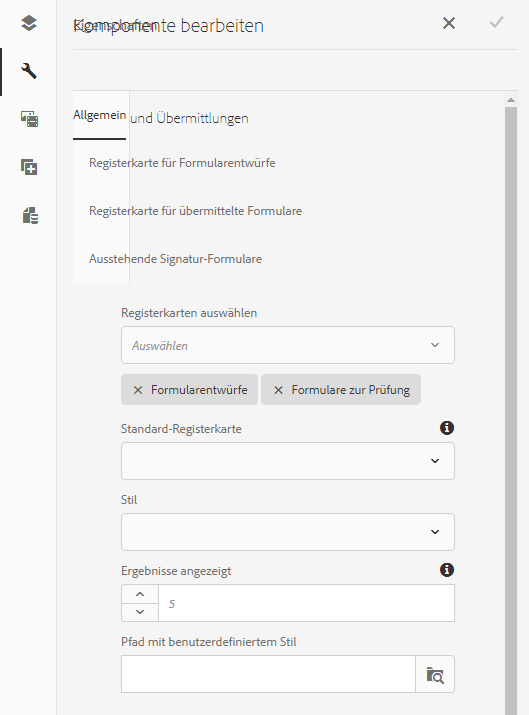

# Komponente „Drafts and Submissions“{#drafts-and-submissions-component}

Mit der Komponente „Drafts &amp;Submissions“ können Sie alle Formulare auflisten, die den Status „Entwurf“ aufweisen, und diejenigen, die bereits gesendet wurden. Die Komponente bietet separate Bereiche (Registerkarten) für Entwürfe und für gesendete Formulare. Die Benutzer können lediglich ihre eigenen Entwürfe und gesendeten Formulare anzeigen.

## Komponente konfigurieren {#configuring-the-component}

In der Komponente „Drafts and Submissions“ stehen die beiden Registerkarten „Drafts“ und „Submissions“ zur Verfügung.

Damit die Übermittlung eines adaptiven Formulars auf der Registerkarte für Übermittlungen angezeigt werden kann, setzen Sie die **Übermittlungsaktion** auf **[Forms Portal-Übermittlungsaktion](../../forms/using/configuring-submit-actions.md). Alternativ können Sie** die Option &quot;Forms Portal Submit&quot;aktivieren. Wenn ein Benutzer das Formular übermittelt, wird dieses der Registerkarte „Submissions“ hinzugefügt.

Die Entwurfsfunktion ist standardmäßig aktiviert. Wenn der Benutzer in einem adaptiven Formular auf **Speichern** klickt, wird dieses der Registerkarte „Drafts“ hinzugefügt.

Führen Sie die folgenden Schritte durch, um eine Komponente „Drafts and Submissions“ hinzuzufügen:

1. Ziehen Sie die Komponente **Drafts &amp; Submissions** unter Document Services-Kategorie im Komponenten-Browser zu Ihrer Seite per Drag &amp; Drop.
1. Tippen Sie auf die Komponente und dann auf  , um das Dialogfeld &quot;Bearbeiten&quot;für die Komponente zu öffnen.

   

1. Geen Sie im Dialogfeld „Bearbeiten“ die folgenden Details an und tippen Sie auf **Fertig**, um die Einstellungen zu speichern.

<table>
 <tbody>
  <tr>
   <th>Registerkarte</th>
   <th>Konfiguration</th>
   <th>Beschreibung</th>
  </tr>
  <tr>
   <td>Allgemein</td>
   <td>Gesamtergebnis</td>
   <td>Gibt die maximal mögliche Anzahl anzuzeigender Ergebnisse an. Sind mehr Ergebnisse vorhanden, als für Gesamtergebnis angegeben wurde, wird am unteren Ende der Komponente der Link <strong>Mehr</strong> angezeigt. Durch Klicken auf <strong>Mehr </strong>werden alle Formulare angezeigt. </td>
  </tr>
  <tr>
   <td> </td>
   <td>Style Type (Stiltyp)</td>
   <td>Legt den Stil der Komponente fest. Sie können <strong>No Style</strong>, <strong>Default Style</strong> oder <strong>Custom Style</strong> für die Auflistung der Formulare angeben. Für die Option „Custom Style“ können Sie den Pfad zu Ihrem benutzerdefinierten CSS im Feld <strong>Custom Style Path</strong> angeben<strong>.</strong></td>
  </tr>
  <tr>
   <td> </td>
   <td>Custom Style Path (Pfad für benutzerdefinierten Stil)</td>
   <td>Wenn Sie die Option <strong>Benutzerdefinierter Stil</strong> im Feld <strong>Stiltyp</strong> auswählen, geben Sie im Feld <strong>Benutzerdefinierter Stilpfad</strong> den Pfad der benutzerdefinierten CSS-Datei an. </td>
  </tr>
  <tr>
   <td> </td>
   <td>Anzeigeoptionen</td>
   <td>
Gibt die anzuzeigenden Registerkarten an. Sie können festlegen, ob Formularentwürfe, übermittelte Formulare oder beides angezeigt werden soll. 
 
<strong>Hinweis</strong>:<em> Wenn Sie für <strong>Anzeigeoptionen</strong> eine andere Option als <strong>Beide</strong> wählen, wird die Feldoption <strong>Standardregisterkarte</strong> nicht verwendet.</em>
 </td>
  </tr>
  <tr>
   <td> </td>
   <td>Standardregisterkarte</td>
   <td>Gibt an, welche Registerkarte beim Laden der Forms Portal-Seite angezeigt werden soll. Sie können eine der Registerkarten <strong>Draft Forms</strong> und <strong>Submitted Forms</strong> wählen.</td>
  </tr>
  <tr>
   <td>Konfiguration der Registerkarte für Formularentwürfe</td>
   <td>Benutzerdefinierter Titel</td>
   <td>Geben Sie den Titel der Registerkarte für <strong>Formularentwürfe</strong> an. Der Standardwert ist <strong>Draft Forms.</strong></td>
  </tr>
  <tr>
   <td> </td>
   <td>Layout-Vorlage</td>
   <td>Gibt das für die Liste der Formularentwürfe zu verwendende Layout an.</td>
  </tr>
  <tr>
   <td>Konfiguration der Registerkarte für übermittelte Formulare</td>
   <td>Benutzerdefinierter Titel </td>
   <td>Geben Sie den Titel der Registerkarte für <strong>übermittelte Formulare </strong> an. Der Standardwert ist <strong>Submitted Forms.</strong></td>
  </tr>
  <tr>
   <td> </td>
   <td>Layout-Vorlage</td>
   <td>Gibt das Layout an, das für die Liste "Submitted Forms<strong> </strong>list"verwendet werden soll. </td>
  </tr>
 </tbody>
</table>

## Anpassen des Speichers {#customizing-the-storage}

Wenn Sie die Forms Portal Aktion-Übermittlungsaktion verwenden oder die Store-Daten über die Forms-Portal-Optionen im adaptiven Formular aktivieren, werden die Formulardaten im AEM-Repository gespeichert. In einer Produktionsumgebung wird empfohlen, keine Entwurfs- oder gesendete Formulardaten nicht im AEM-Repository zu speichern. Stattdessen müssen Sie die Entwurfs- und Übermittlungskomponente mit einem sicheren Speicher wie der Unternehmensdatenbank integrieren, um Entwürfe und übermittelte Formulardaten zu speichern.

Mit dem Forms-Portal können Sie Daten im lokalen AEM-Repository, im Remote-AEM oder in einer Datenbank speichern. Mit AEM Forms können Sie die Implementierung der Speicherung von Benutzerdaten für Entwürfe und Übermittlungen anpassen. Sie können Standardmethoden überschreiben, um festzulegen, wie Entwurfs- und Sendedaten in einem Speicher Ihrer Wahl gespeichert werden. Beispiel: Sie können die Daten in einem Datenspeicher speichern, der derzeit in Ihrem Unternehmen implementiert ist.

Das Forms-Portal bietet vordefinierte Dienste (APIs) zum Speichern von Daten im CRX-Repository lokaler und Remote-AEM Forms-Veröffentlichungsinstanzen. Sie können die im Artikel [Konfigurieren von Speicherdiensten für Entwürfe und Übermittlungen](/help/forms/using/configuring-draft-submission-storage.md) beschriebenen Standardimplementierungen durch benutzerdefinierte Implementierungen ersetzen, um Standardfunktionen zu ersetzen. Detaillierte Informationen zu den Methoden, die in einer benutzerdefinierten Implementierung zum Speichern von Inhalten an einem gesicherten Speicherort erforderlich sind, finden Sie unter [Anpassen von Entwurfs- und Übermittlungsdatendiensten](/help/forms/using/custom-draft-submission-data-services.md) und [Benutzerdefinierter Speicher für Komponenten für Entwürfe und Übermittlungen](/help/forms/using/adding-custom-storage-provider-forms.md).

Die AEM Forms-Dokumentation enthält ein [Beispiel für die Integration der Komponente &quot;Drafts &amp; Submissions&quot;in die Datenbank](integrate-draft-submission-database.md). Sie können die Beispielimplementierung verwenden, um Ihre eigene benutzerdefinierte Implementierung zu entwickeln.

## Verwandte Artikel

* [Aktivieren von Forms Portal-Komponenten](/help/forms/using/enabling-forms-portal-components.md)
* [Forms Portal-Seite erstellen](/help/forms/using/creating-form-portal-page.md)
* [Auflisten von Formularen auf einer Webseite mithilfe von APIs](/help/forms/using/listing-forms-webpage-using-apis.md)
* [Komponente &quot;Drafts and Submissions&quot;verwenden](/help/forms/using/draft-submission-component.md)
* [Anpassen der Speicherung von Entwürfen und gesendeten Formularen](/help/forms/using/draft-submission-component.md)
* [Beispiel zur Integrierung der Komponente für Entwurf und Übermittlung in die Datenbank](/help/forms/using/integrate-draft-submission-database.md)
* [Anpassen von Vorlagen für Forms Portal-Komponenten](/help/forms/using/customizing-templates-forms-portal-components.md)
* [Einführung in das Veröffentlichen von Formularen in einem Portal](/help/forms/using/introduction-publishing-forms.md)
