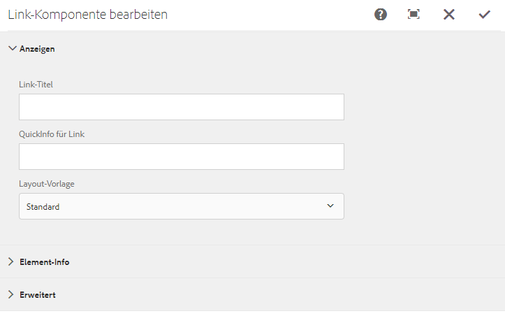

# Einbetten einer Komponente „Link“ in eine Seite{#embedding-link-component-in-a-page}

## Voraussetzungen {#prerequisites}

Die Komponente „Link“ gehört zur Kategorie „Document Services“. Stellen Sie sicher, dass die Document Services-Kategorie im AEM-Komponentenbrowser verfügbar ist. Wenn die Kategorie nicht aufgelistet ist, führen Sie die Schritte unter [Aktivieren der Komponenten im Forms Portal](/help/forms/using/enabling-forms-portal-components.md).

## Komponente „Link“ {#link-component}

Mithilfe der Komponente „Link“ können Forms Portal-Autoren auf einer beliebigen Seitenposition eine Verknüpfung zu einem adaptiven Formular erstellen. Die Komponente „Link“ ist im Document Services-Abschnitt im Komponentenbrowser verfügbar.

Gehen Sie wie folgt vor, um der Seite eine Komponente des Typs „Link“ hinzuzufügen:

1. Ziehen Sie die Komponente **Link** auf die Seite. Wählen Sie die Komponente aus und tippen Sie auf . Das Komponentendialogfeld „Link bearbeiten“ wird geöffnet.

   

1. Geben Sie auf der Registerkarte **Anzeige** Folgendes an:

   * **Link Caption**: Linktext oder Beschriftung des Links.
   * **Link Tooltip**: QuickInfo für den Link.
   * **Layout Template**: Vorlage für das Layout der Komponente „Link“.

1. Öffnen Sie die Registerkarte **Asset Info** und geben Sie den Typ des Assets an. Ein Asset kann ein **Formular** sein. Je nach ausgewähltem Assettyp können die unten aufgeführten Optionen angezeigt werden:

   * **Asset Path**: Pfad für das Repository, in dem das Asset gespeichert ist.

   * **Render Type**: Das Wiedergabeformat – PDF, HTML oder Auto Der Wiedergabetyp „Auto“ erkennt die Benutzerumgebung und gibt das Formular entsprechend im HTML- oder PDF-Format wieder. Wenn das Formular beispielsweise auf einem Mobilgerät aufgerufen wird, gibt der Wiedergabetyp „Auto“ das Formular im HTML-Format wieder.
   * **Sende-URL**: URL zu dem Servlet, an das die Formulardaten gesendet werden.
   * **HTML Profile**: Profil für die Wiedergabe des Formulars im HTML-Format.
   * **PDF Profile**: Profil für die Wiedergabe des Formulars als PDF-Dokument.

1. Öffnen Sie die Registerkarte **Erweitert**. Sie können zusätzliche Parameter in Form von Schlüssel-Wert-Paaren angeben. Wenn der Link angeklickt wird, werden diese zusätzlichen Parameter zusammen mit dem Formular übergeben.

   Tippen Sie auf **Fertig**, um die Konfiguration zu speichern.

## Best Practices für die Verwendung der Komponente „Link“  {#best-practices-for-using-link-component-br}

* Stellen Sie sicher, dass Sie als Wiedergabetyp „PDF“ auswählen, wenn der im Formularpfad angegebene Pfad auf ein Dokument verweist, bei dem das zulässige Wiedergabeformat das PDF-Format ist.
* Die Sende-URL für ein Formular kann an mehreren Stellen festgelegt werden. Ihre Prioritätsreihenfolge lautet wie folgt:

   1. Die Sende-URL, die in das Formular eingebettet ist (in der Senden-Schaltfläche), hat die höchste Priorität.
   1. Die Sende-URL, die in Forms Manager erwähnt wird, hat die mittlere Priorität.
   1. Die Sende-URL, die im Forms Portal erwähnt wird, hat die niedrigste Priorität.
