# Mitarbeiterrekrutierung Referenz-Website-Umgehung {#employee-recruitment-reference-site-walkthrough}

## Überblick {#overview}

We.Finance ist ein Unternehmen, das das Bewerben für eine Stelle über das Referenz-Website-Portal ermöglicht. Die Organisation nutzt das Portal auch zur Verwaltung der Terminplanung, der Kursauswahl und der internen Kommunikation der Kandidaten. Die Website verwaltet Folgendes:

* Personen, die nach Arbeit suchen und sich bewerben
* Vorauswahl und engere Auswahl von Bewerbern
* Ablauf der Vorstellungsgespräche 
* Sammlung von Bewerbungsunterlagen
* Hintergrundprüfung von Bewerbern
* Unterbreiten von Angeboten an ausgewählte Bewerber

>[!NOTE]
>
>Anwendungsfälle für Mitarbeiterrekrutierung sind sowohl auf We.Finance- als auch auf We.Gov-Referenz-Websites verfügbar. Die in den Anleitungen verwendeten Beispiele, Bilder und Beschreibungen beziehen sich auf die We.Finance-Referenz-Website. Sie können diese Anwendungsfälle jedoch auch mit We.Gov ausführen und dort Artefakte überprüfen. Ersetzen Sie dazu in den genannten URLs **we-finance** durch **we-gov**.

### Enthaltene Workflow-Modelle {#workflow-models-involved}

Der Anwendungsfall für die Mitarbeiterrekrutierung enthält zwei Workflows:

* Vor dem Vorstellungsgespräch - Workflow für die Mitarbeiterrekrutierung in We Finance
* Nach dem Vorstellungsgespräch - Workflow &quot;We Finance-Mitarbeiterrekrutierung nach dem Vorstellungsgespräch&quot;

Diese Workflows werden in AEM erstellt und sind verfügbar unter:

`https://[authorHost]:[authorPort]/libs/cq/workflow/admin/console/content/models.html/etc/workflow/models/`

#### Workflow „We Finance-Mitarbeiterrekrutierung“{#we-finance-employee-recruiting-workflow}

Im Folgenden ist das Modell des Workflows „We Finance-Mitarbeiterrekrutierung“ in diesem Dokument dargestellt.

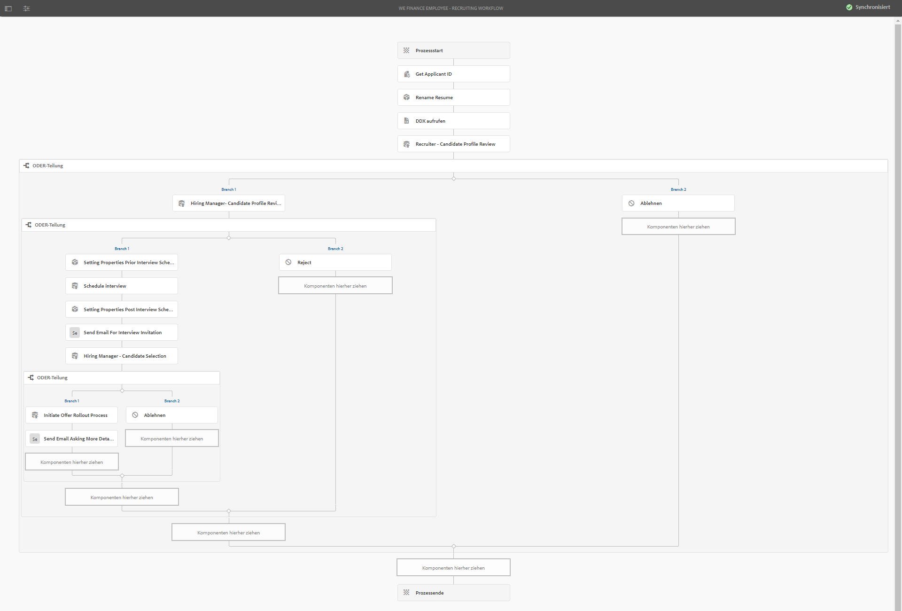

#### Workflow „We Finance-Mitarbeiterrekrutierung nach dem Vorstellungsgespräch“{#we-finance-employee-recruiting-post-interview-workflow}

Im Folgenden ist das Modell des Workflows „We Finance-Mitarbeiterrekrutierung nach dem Vorstellungsgespräch“ in diesem Dokument dargestellt.

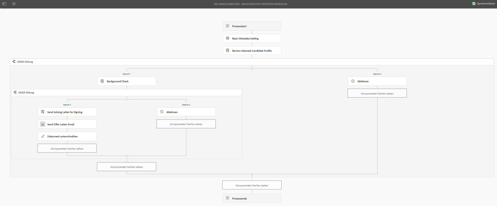

### Personen {#personas}

Das Szenario schließt folgende Personen ein:

* Sarah Rose, die Bewerberin für eine Stelle beim Unternehmen
* John Jacobs, Personalvermittler
* Gloria Rios, Personalverantwortliche
* John Doe, HR-Mitarbeiter

## Sarah bewirbt sich um eine Stelle  {#sarah-applies-for-a-job}

Sarah Rose sucht nach einem Stellenangebot im Unternehmen. Sie besucht sein Webportal und schaut sich die Stellenangebote an, die auf der Jobseite aufgeführt sind. Sie findet eine passende Ausschreibung und bewirbt sich.

Startseite von We.Finance

Jobseite von We.Finance

Sarah klickt in einem Stellenangebot auf „Bewerben“. Das Bewerbungsformular wird geöffnet. Sie füllt alle Angaben in der Bewerbung aus und sendet das Formular ab.

### Funktionsweise {#how-it-works}

Die Startseite von We.Finance und die Jobseite sind AEM-Siteseiten. Die Jobseite bettet ein adaptives Formular ein, das einen wiederholbaren Bereich verwendet, um Stellenangebote mithilfe eines Dienstes abzurufen und aufzulisten. Sie können das adaptive Formular unter `https://[authorHost]:[authorPort]/editor.html/content/forms/af/we-finance/employee/recruitment/jobs.html` überprüfen.

### Sehen Sie selbst{#see-it-yourself} 

Gehen Sie zu `https://[publishHost]:[publishPort]/content/we-finance/global/en.html` und klicken Sie auf **[!UICONTROL Karriere]**. Klicken Sie auf **[!UICONTROL Search]** (Suchen), um die Jobliste aufzufüllen, und klicken Sie anschließend für ein Stellenangebot auf **[!UICONTROL Apply]** (Bewerben). Füllen Sie das Formular aus und senden Sie die Bewerbung.

Stellen Sie sicher, dass Sie eine gültige E-Mail-Adresse in der Bewerbung angeben, da jede Nachricht in dieser Anleitung an diese gesendet wird.

## John Jacobs empfiehlt Sarah Roses Profil für die Vorauswahl durch den Personalverantwortlichen  {#john-jacobs-shortlists-sarah-rose-s-profile-for-the-hiring-manager-s-screening}

Das Unternehmen erhält die Bewerbung von Sarah. John Jacobs, ein Personalvermittler, wird die Aufgabe zugewiesen, Sarahs Profil anzusehen. Er überprüft die Aufgabe in seinem AEM-Posteingang, findet das Profil, das der Stellenanforderung entspricht, und klickt auf „Shortlist“ (engere Auswahl). Sarahs Profil wird an Gloria Rios, der Personalverantwortlichen, zur Genehmigung weitergeleitet.

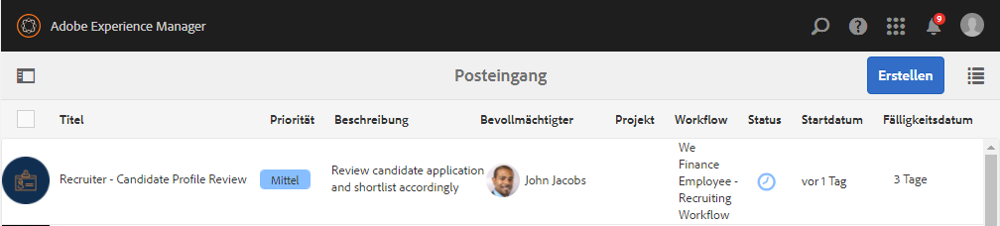

Johns AEM-Posteingang

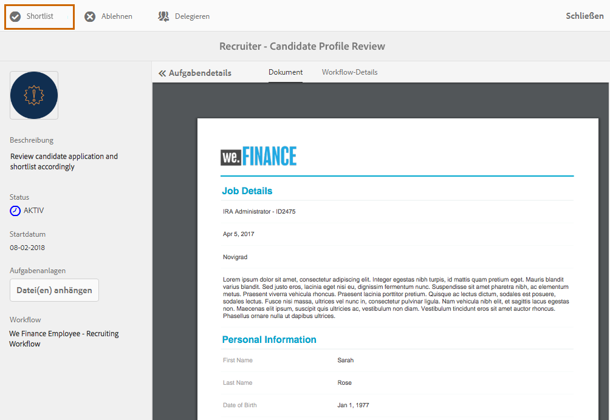

John Jacobs empfiehlt Sarah Roses Profil für die Vorauswahl durch den Personalverantwortlichen

**Funktionsweise**

Die Übermittlungsaktion im Bewerbungsformular löst einen Workflow aus, mit dem eine Aufgabe in John Jacobs&#39; Posteingang zur Vorauswahl der Bewerbung erstellt wird. Wenn John die Bewerbung überprüft und in die engere Auswahl aufnimmt, erstellt der Workflow eine Aufgabe im Posteingang von Gloria, der Personalverantwortlichen.

### Sehen Sie selbst  {#see-it-yourself-1}

Gehen Sie zu `https://[publishHost]:[publishPort]/content/we-finance/global/en/login.html?resource=/aem/inbox.html`und melden Sie sich mit jjacobs/password als Benutzername/Kennwort für John Jacobs an. Öffnen Sie die Aufgabe zur Überprüfung des Bewerberprofils und nehmen Sie den Bewerber in die Vorauswahl auf.

## Gloria überprüft die Bewerbung und genehmigt den Bewerber für ein Vorstellungsgespräch  {#gloria-reviews-the-application-and-approves-the-applicant-for-an-interview}

Gloria, die Personalverantwortliche, erhält das vorausgewählte Profil als Aufgabe in ihrem AEM-Posteingang. Sie überprüft es und genehmigt die Bewerberin, Sarah Rose, für das Vorstellungsgespräch.

Glorias AEM-Posteingang

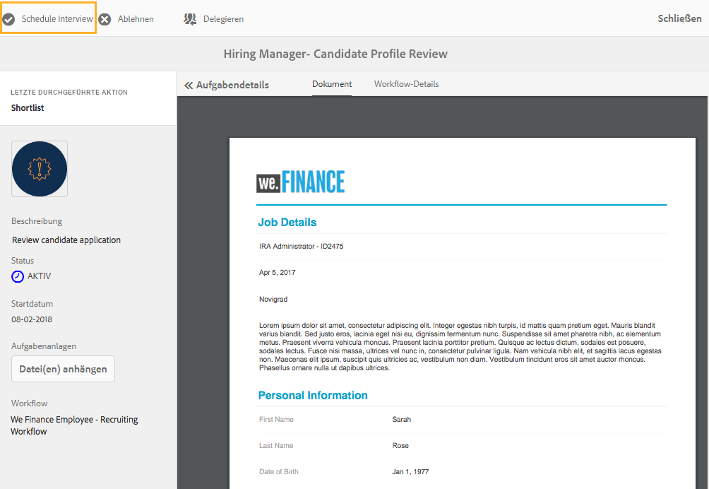

Gloria genehmigt Sarah Rose für ein Vorstellungsgespräch

**Funktionsweise**

Wenn Gloria den Kandidaten genehmigt, erstellt der Workflow eine Aufgabe im AEM-Posteingang von John Doe, der Personalvermittler für We.Finance ist.

### Sehen Sie selbst  {#see-it-yourself-2}

Gehen Sie zu `https://[publishHost]:[publishPort]/content/we-finance/global/en/login.html?resource=/aem/inbox.html` und melden Sie sich mit jjacobs/password als Benutzername/Kennwort für John Jacobs an. Öffnen Sie die Aufgabe zur Überprüfung des Bewerberprofils und nehmen Sie den Bewerber in die Vorauswahl auf.

Gehen Sie zu `https://[publishHost]:[publishPort]/content/we-finance/global/en/login.html?resource=/aem/inbox.html` und melden Sie sich mit grios/password als Benutzername/Kennwort für Gloria Rios an. Öffnen Sie die Aufgabe zur Überprüfung des Bewerberprofils und klicken Sie auf „Schedule Interview“ (Vorstellungsgespräch planen).

## John Doe plant ein Vorstellungsgespräch  {#john-doe-schedules-an-interview}

John Doe erhält die Aufgabe der Planung eines Gesprächs in seinem Posteingang. Er wählt und öffnet die Aufgabe und legt Datum, Uhrzeit, Ort sowie John Jacobs als verantwortliche HR-Person für das Vorstellungsgespräch fest. John Doe klickt auf „Send Invitation Email“ (Einladungs-E-Mail senden). Eine E-Mail wird an Sarah gesendet und Gloria, der Personalverantwortlichen, wird eine Aufgabe zugewiesen, das Vorstellungsgespräch mit Sarah zu führen.

John Does AEM-Posteingang

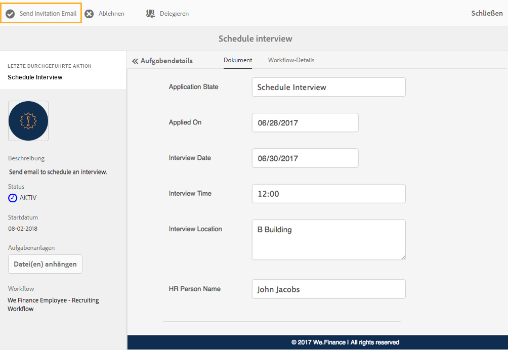

John Doe plant das Gespräch und sendet die Details an Sarah Rose

## Sarah Rose erhält die E-Mail mit dem Zeitplan für das Vorstellungsgespräch  {#sarah-rose-receives-the-email-with-interview-schedule}

Sarah Rose erhält die E-Mail mit zeitlichen Angaben, Ort und weiteren Details. Sie klickt auf „Accept“ (Akzeptieren), um ihr Einverständnis mit Zeit und Ort für das Gespräch zu geben. Anhand dieser genauen Informationen kommt Sarah zum Vorstellungsgespräch.

Sarah Rosé erhält den Zeitplan für das Vorstellungsgespräch

## Nach den Gesprächen nimmt die Personalverantwortliche Sarah Rose in die engere Wahl auf  {#after-the-interviews-the-hiring-manager-shortlists-sarah-rose}

Nachdem Sarah Rose erfolgreich in den Vorstellungsgesprächen war, öffnet die Personalverantwortliche Gloria Rios die Aufgabe zur Bewerberauswahl in ihrem Posteingang und klickt auf „Select“ (Auswählen). Gloria Rios&#39; Entscheidung wird an John Doe aus der Personalabteilung zur weiteren Bearbeitung weitergeleitet.

Glorias AEM-Posteingang

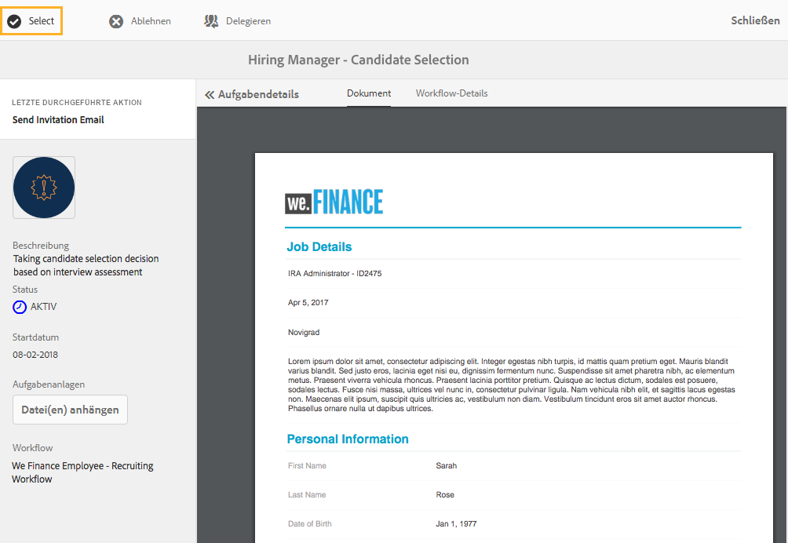

Gloria Rios wählt Sarah Rose nach den Gesprächen aus

## John Doe fordert weitere Informationen an  {#john-doe-requests-more-information}

Bevor einem Kandidaten ein konkretes Angebot unterbreitet wird, muss sein Hintergrund überprüft werden. John Doe öffnet und überprüft die Details des ausgewählten Bewerbers und stellt fest, dass einige Angaben zu bisheriger Tätigkeit und Ausbildung noch nicht ausgefüllt sind. John Doe klickt auf „Need More Information“ (Weitere Informationen erforderlich).

 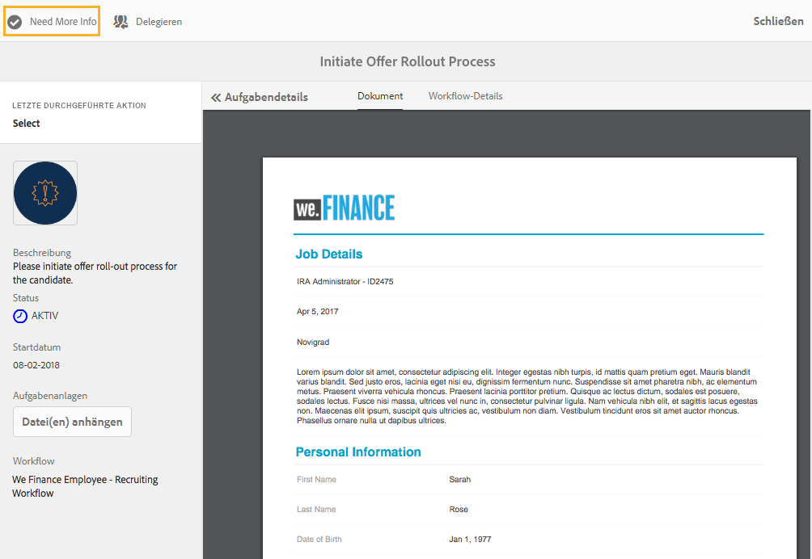

John Doe fordert weitere Informationen von Sarah Rose über ihre Ausbildung und Berufserfahrung an

## Sarah Rose erhält eine E-Mail, in der weitere Informationen angefordert werden  {#sarah-rose-receives-an-email-requesting-further-information}

Sarah Rose erhält eine E-Mail mit der Benachrichtigung, dass zur Bearbeitung ihrer Bewerbung weitere Informationen erforderlich sind. Die E-Mail enthält einen Link zum Formular, um die fehlenden Informationen auszufüllen.

Sarah Rose erhält eine E-Mail mit der Benachrichtigung, dass zur Bearbeitung ihrer Bewerbung weitere Informationen erforderlich sind

Sarah klickt auf den Link „Provide Details“ (Details hinzufügen) in der E-Mail. Ein Formular wird angezeigt. Sarah füllt die fehlenden Angaben zu bisheriger Tätigkeit und Ausbildung wie von John Doe gefordert aus und klickt auf „Submit“ (Senden).

Sarah öffnet das Formular für zusätzliche Informationen, indem sie auf den Link in der E-Mail klickt.

Sarah füllt die fehlenden Angaben wie von John Doe gefordert aus und klickt auf „Submit“ (Senden)

## John Doe überprüft das ausgewählte Bewerberprofil auf die hinzugefügten zusätzlichen Informationen  {#john-doe-reviews-the-selected-candidate-profile-for-the-additional-information-provided}

Er wählt die Bewerberüberprüfungsanforderung aus und öffnet sie. Er sieht, dass Sarah alle erforderlichen Informationen ausgefüllt hat. Nach Überprüfung der Bewerbung klickt John Doe auf „Approve“ (Genehmigen). Nach der Genehmigung durch John Doe wird die Anforderung, eine Hintergrundprüfung für Sarah Rose durchzuführen, an John Jacobs weitergeleitet.

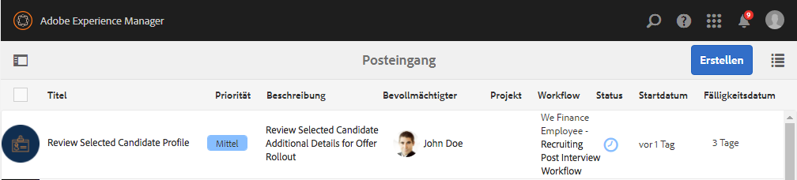

John Does AEM-Posteingang

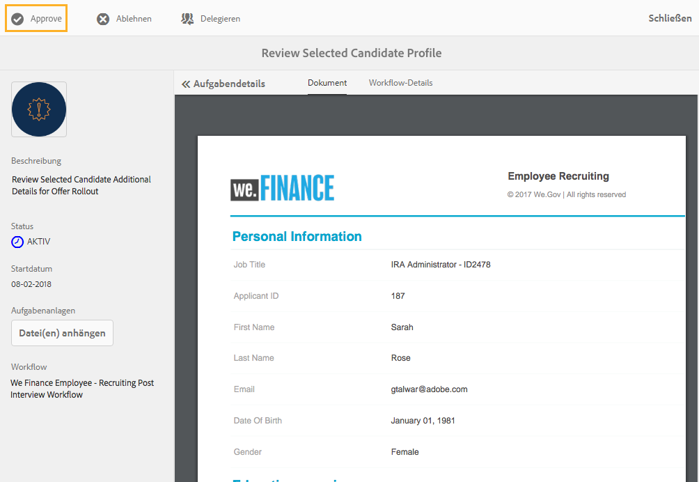

John Doe überprüft die zusätzlichen Informationen von Sarah und genehmigt sie

## John Jacobs erhält eine Anforderung zur Hintergrundüberprüfung  {#john-jacobs-receives-a-background-check-request}

John Jacobs sieht die Hintergrundüberprüfungsanforderung in seinem Posteingang. John Jacobs öffnet die Aufgabe und überprüft die Informationen von Sarah Rose. Nach einer Hintergrundprüfung klickt John Jacobs auf „Go Ahead“ (Grünes Licht), um anzuzeigen, dass die Prüfung erfolgreich war.

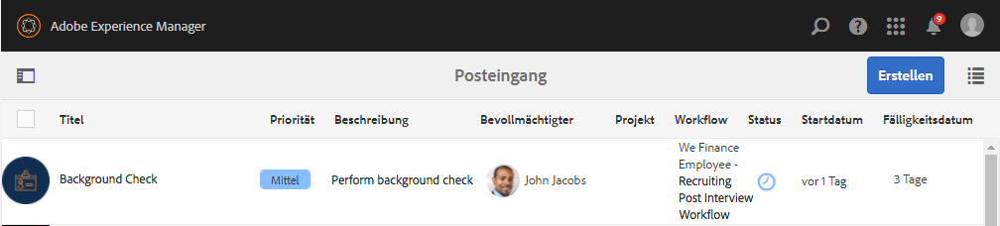

John Jacobs AEM-Posteingang

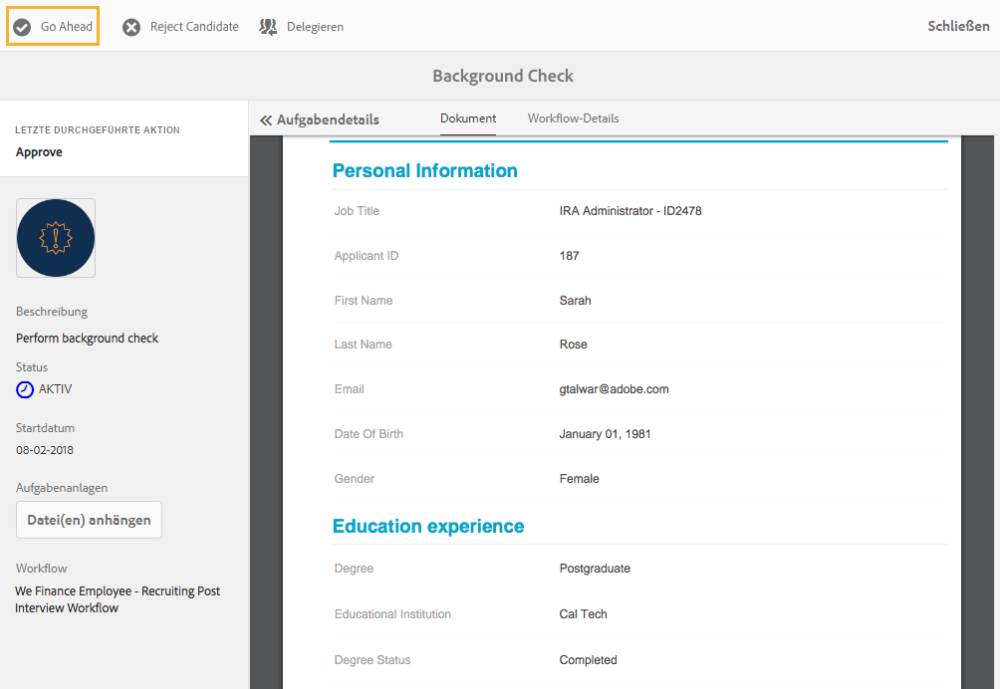

Nach der Hintergrundprüfung klickt John Jacobs auf „Go Ahead“ (Grünes Licht)

## John Doe sendet das Anstellungsschreiben an Sarah Rose  {#john-doe-sends-out-the-joining-letter-to-sarah-rose}

John Doe erhält in seinem AEM-Postfach eine Anforderung zum Senden des Anstellungsschreibens. John öffnet die Anforderung und sieht sich die Details an. John Doe fügt die PDF-Datei mit dem Anstellungsschreiben an und klickt auf „Attach &amp; Send Joining Letter“ (Anstellungsschreiben anhängen und senden).

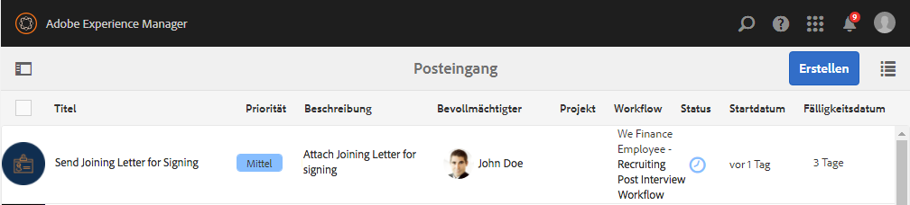

John Does AEM-Posteingang

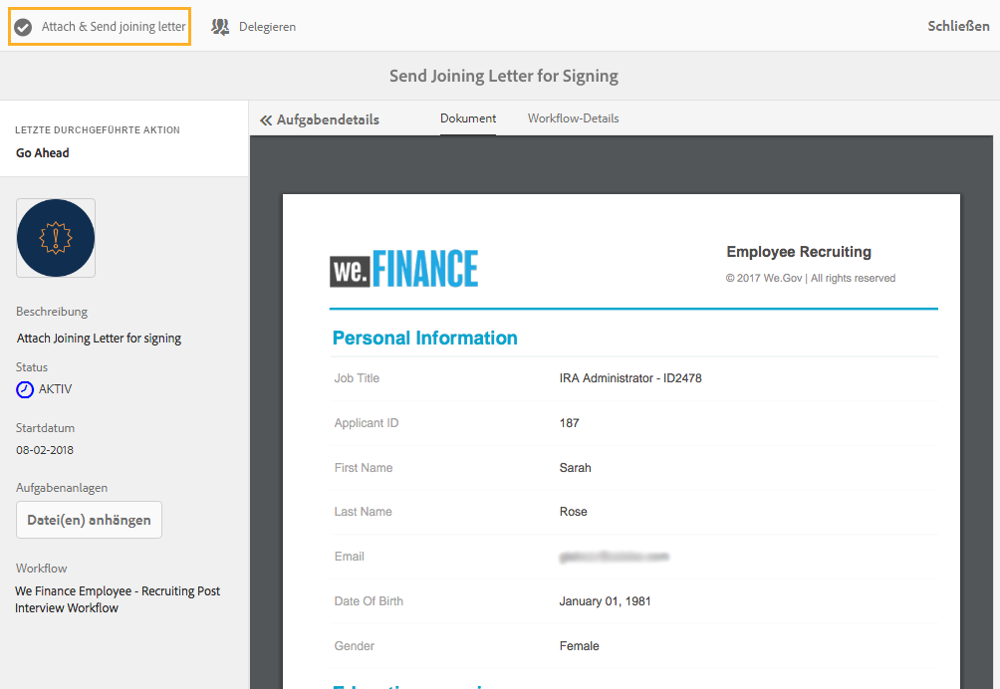

John Doe sendet das Anstellungsschreiben zur Unterschrift

## Sarah Rose erhält und unterschreibt das Anstellungsschreiben  {#sarah-rose-receives-and-signs-the-joining-letter}

Sarah Rose erhält das Anstellungsschreiben zur Unterschrift. Sarah klickt auf &quot;Click Here&quot;, um den Abschlussbrief zu überprüfen und zu unterschreiben. Die PDF-Datei mit dem Anstellungsschreiben wird geöffnet und enthält ein Feld für die Unterschrift.

Sarah Rose erhält das Anstellungsschreiben zur Unterschrift

Sarah kann wählen, ob sie ihre Unterschrift über die Tastatur oder mit der Zeichnenfunktion eingibt, ein Bild der Unterschrift einfügt oder den Touchscreen ihres Handys verwendet, um ihre Unterschrift zu zeichnen. Sarah gibt ihren Namen ein, klickt auf &quot;Click To Sign&quot;und lädt die signierte Kopie des Anstellungsschreibens herunter.

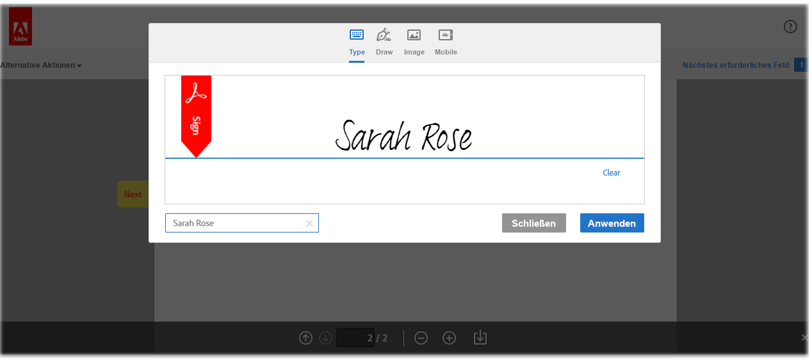

Sarah tippt ihren Namen ein, um das Anstellungsschreiben zu unterzeichnen

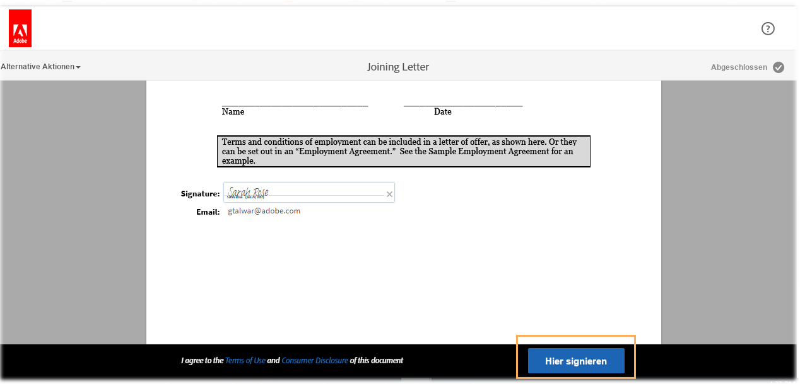

Sarah klickt auf &quot;Click To Sign&quot;, um die Unterzeichnung des Anstellungsschreibens abzuschließen
