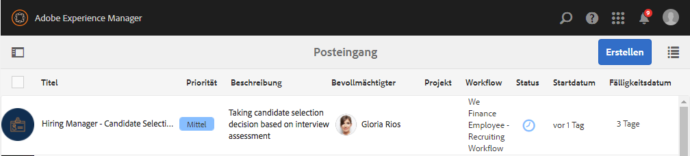

# Schrittweise Anleitung zum Einrichten einer Referenz-Website für Mitarbeiterrekrutierung {#employee-recruitment-reference-site-walkthrough}

## Übersicht {#overview}

We.Finance ist eine Organisation, die es Bewerberinnen und Bewerbern ermöglicht, sich über das Referenz-Website-Portal um eine Stelle zu bewerben. Die Organisation nutzt das Portal auch, um die Termine für Vorstellungsgespräche, die Liste der engeren Auswahl und die interne Kommunikation zu verwalten. Die Site verwaltet Folgendes:

* Bewerberinnen und Bewerber, die nach Stellen suchen und sich auf sie bewerben
* Vorauswahl und engere Auswahl von Bewerberinnen und Bewerbern
* Ablauf der Vorstellungsgespräche 
* Sammlung von Bewerbungsunterlagen
* Hintergrundprüfung der Bewerberinnen und Bewerber
* Unterbreiten von Angeboten für ausgewählte Bewerberinnen und Bewerber

>[!NOTE]
>
>Anwendungsfälle für die Mitarbeiterrekrutierung sind sowohl auf Referenz-Websites von We.Finance als auch von We.Gov verfügbar. Die in den Anleitungen verwendeten Beispiele, Bilder und Beschreibungen beziehen sich auf die Referenz-Website von We.Finance. Sie können diese Anwendungsfälle jedoch auch mit We.Gov ausführen und dort Artefakte überprüfen. Ersetzen Sie dazu in den genannten URLs **we-finance** mit **we-gov**.

### Beteiligte Workflow-Modelle {#workflow-models-involved}

Der Anwendungsfall der Mitarbeiterrekrutierung umfasst zwei Workflows:

* Vor dem Vorstellungsgespräch – Workflow „We Finance-Mitarbeiterrekrutierung“
* Nach dem Vorstellungsgespräch – Workflow „We Finance-Mitarbeiterrekrutierung nach dem Vorstellungsgespräch“

Diese Workflows werden in AEM erstellt und sind verfügbar unter:

`https://[authorHost]:[authorPort]/libs/cq/workflow/admin/console/content/models.html/etc/workflow/models/`

#### Workflow „We Finance-Mitarbeiterrekrutierung“ {#we-finance-employee-recruiting-workflow}

Im Folgenden finden Sie das Modell des Workflows „We Finance-Mitarbeiterrekrutierung“, dem dieses Dokument folgt.

#### Workflow „We Finance-Mitarbeiterrekrutierung nach dem Vorstellungsgespräch“ {#we-finance-employee-recruiting-post-interview-workflow}

Im Folgenden finden Sie das Modell des Workflows „We Finance-Mitarbeiterrekrutierung nach dem Vorstellungsgespräch“, dem dieses Dokument folgt.

### Personen {#personas}

Das Szenario schließt folgende Personen ein:

* Sarah Rose, die Bewerberin um eine Stelle beim Unternehmen
* John Jacobs, Personalvermittler
* Gloria Rios, einstellende Managerin
* John Doe, HR-Mitarbeiter

## Sarah bewirbt sich auf eine Stelle {#sarah-applies-for-a-job}

Sarah Rose sucht nach einer Beschäftigung in dem Unternehmen Sie besucht sein Web-Portal und durchsucht die Stellenangebote auf der Karriereseite. Sie findet eine passende Stellenausschreibung und bewirbt sich.

Startseite von We.Finance

We.Finance-Karriereseite

Sarah klickt in einem Stellenangebot auf „Bewerben“. Das Bewerbungsformular wird geöffnet. Sie füllt alle Angaben aus und sendet das Formular ab.

### Funktionsweise {#how-it-works}

Die Startseite von We.Finance und die Jobseite sind AEM Sites-Seiten. Die Karriereseite enthält ein eingebettetes adaptives Formular, das mithilfe eines wiederholbaren Bereichs Stellenangebote mit einem Dienst abruft und auf der Seite auflistet. Sie können das adaptive Formular unter `https://[authorHost]:[authorPort]/editor.html/content/forms/af/we-finance/employee/recruitment/jobs.html` überprüfen.

### Sehen Sie selbst {#see-it-yourself}

Navigieren Sie zu `https://[publishHost]:[publishPort]/content/we-finance/global/en.html` und klicken Sie auf **[!UICONTROL Career]** (Jobs). Klicken Sie auf **[!UICONTROL Suchen]**, sodass Sie die Stellenliste ausfüllen, und klicken Sie auf **[!UICONTROL Bewerben]**, um sich auf eine Stelle zu bewerben. Füllen Sie das Formular aus und reichen Sie die Bewerbung ein.

Stellen Sie sicher, dass Sie eine gültige E-Mail-ID in der Bewerbung angeben, da jede Kommunikation im Rahmen dieser exemplarischen Vorgehensweise an die angegebene E-Mail-ID gesendet wird.

## John Jacobs wählt Sarah Roses Profil für die Vorauswahl durch die Personalmanagerin aus. {#john-jacobs-shortlists-sarah-rose-s-profile-for-the-hiring-manager-s-screening}

Das Unternehmen erhält die von Sarah eingereichte Bewerbung. John Jacobs, ein Personalvermittler, wird die Aufgabe zugewiesen, Sarahs Profil zu überprüfen. John sieht die Aufgabe in seinem AEM-Posteingang durch, befindet, dass das Profil die Anforderungen der Stelle erfüllt, und klickt auf „In engere Auswahl aufnehmen“. Sarahs Profil wird zur Genehmigung an Gloria Rios, die Personalmanagerin, weitergeleitet.

Johns AEM-Posteingang

John Jacobs wählt Sarah Roses Profil für die Vorauswahl durch die Personalmanagerin aus.

**Funktionsweise**

Die Übermittlungsaktion im Bewerbungsformular löst einen Workflow aus, der eine Aufgabe im Posteingang von John Jacob erstellt, um eine Vorauswahl der Bewerbung durchzuführen. Wenn John die Bewerbung überprüft und in die engere Auswahl aufnimmt, erstellt der Workflow eine Aufgabe im Posteingang von Gloria, die Personalmanagerin.

### Sehen Sie selbst {#see-it-yourself-1}

Navigieren Sie zu `https://[publishHost]:[publishPort]/content/we-finance/global/en/login.html?resource=/aem/inbox.html` und melden Sie sich mit „jjacobs“ und „password“ als Benutzername/Kennwort für John Jacobs an. Öffnen Sie die Aufgabe zur Überprüfung des Bewerberprofils und nehmen Sie den Bewerber in die Vorauswahl auf.

## Gloria prüft die Bewerbung und genehmigt ein Vorstellungsgespräch mit der Bewerberin. {#gloria-reviews-the-application-and-approves-the-applicant-for-an-interview}

Gloria, die Personalmanagerin, erhält das in die engere Wahl aufgenommene Profil als Aufgabe in ihrem AEM-Posteingang. Sie überprüft es und genehmigt ein Vorstellungsgespräch mit der Kandidatin Sarah Rose.

Glorias AEM-Posteingang

Gloria genehmigt ein Vorstellungsgespräch für Sarah Rose

**Funktionsweise**

Wenn Gloria ein Interview für die Kandidatinnen und Kandidaten genehmigt, erstellt der Workflow eine Aufgabe im AEM-Posteingang von John Doe, der ein Personalvermittler für We.Finance ist.

### Sehen Sie selbst {#see-it-yourself-2}

Navigieren Sie zu `https://[publishHost]:[publishPort]/content/we-finance/global/en/login.html?resource=/aem/inbox.html` und melden Sie sich mit „jjacobs“ und „password“ als Benutzername/Kennwort für John Jacobs an. Öffnen Sie die Aufgabe zur Überprüfung des Bewerberprofils und nehmen Sie den Bewerber in die Vorauswahl auf.

Navigieren Sie zu `https://[publishHost]:[publishPort]/content/we-finance/global/en/login.html?resource=/aem/inbox.html` und melden Sie sich mit „grios“ und „password“ als Benutzername/Kennwort für Gloria Rios an. Öffnen Sie die Aufgabe „Profilprüfung für Kandidatin“ und klicken Sie auf „Vorstellungsgespräch planen“.

## John Doe plant ein Vorstellungsgespräch {#john-doe-schedules-an-interview}

John Doe erhält die Aufgabe in seinem Posteingang, ein Vorstellungsgespräch zu planen. John Doe wählt die Aufgabe aus, öffnet sie, legt Datum und Uhrzeit sowie den Ort fest und wählt John Jacob als den Personalvermittler aus, der für das Vorstellungsgespräch verantwortlich ist. John Doe klickt auf „Einladungs-E-Mail senden“. Es wird eine E-Mail an Sarah gesendet und Gloria, die Personalmanagerin, wird die Aufgabe zugewiesen, ein Vorstellungsgespräch mit Sarah zu führen.

John Does AEM-Posteingang

John Doe plant das Vorstellungsgespräch und sendet die Details an Sarah Rose 

## Sarah Rose erhält die E-Mail mit dem Zeitplan für das Vorstellungsgespräch {#sarah-rose-receives-the-email-with-interview-schedule}

Sarah Rose erhält die E-Mail mit Zeitplan, Ort und anderen Details. Sarah klickt auf „Akzeptieren“, um anzugeben, dass sie mit dem Zeitplan und dem Ort des Vorstellungsgesprächs einverstanden ist. Sarah folgt den präzisen Angaben in der E-Mail und erscheint zum Vorstellungsgespräch.

Sarah Rose erhält den Zeitplan für das Vorstellungsgespräch

## Nach den Gesprächen nimmt die Personalmanagerin Sarah Rose in die engere Auswahl auf. {#after-the-interviews-the-hiring-manager-shortlists-sarah-rose}

Nachdem Sarah Rose die Bewerbungsgespräche durchlaufen und gut abgeschnitten hat, öffnet Gloria Rios, die einstellende Managerin, die Aufgabe zur Bewerberauswahl in ihrem Posteingang und klickt auf „Auswählen“. Gloria Rios&#39; Entscheidung wird dem HR-Mitarbeiter John Doe zur weiteren Bearbeitung übermittelt.

Glorias AEM-Posteingang

Gloria Rios wählt Sarah Rose nach den Gesprächen aus

## John Doe fordert weitere Informationen an {#john-doe-requests-more-information}

Bevor der Bewerberin die Stelle angeboten wird, muss Sarahs Hintergrund überprüft werden. John Doe öffnet und überprüft die Details der ausgewählten Bewerberin und stellt fest, dass einige Details zu ihren früheren Beschäftigungen und ihrer Ausbildung noch nicht ausgefüllt sind. John Doe klickt auf „Weitere Informationen erforderlich“.

 

John Doe fordert weitere Informationen von Sarah Rose über ihre Ausbildung und Berufserfahrungen an

## Sarah Rose erhält eine E-Mail, in der um weitere Informationen gebeten wird {#sarah-rose-receives-an-email-requesting-further-information}

Sarah Rose erhält eine E-Mail, in der sie darüber informiert wird, dass weitere Informationen zur Bearbeitung ihrer Bewerbung erforderlich sind. Die E-Mail enthält einen Link zum Formular zum Ausfüllen der benötigten Informationen.

Sarah Rose erhält eine E-Mail, in der sie darauf hingewiesen wird, dass für die Bearbeitung ihrer Bewerbung weitere Informationen benötigt werden

Sarah klickt in der E-Mail auf den Link „Details angeben“. Ein Formular wird angezeigt. Sarah füllt die von John Doe angeforderten Angaben zu Ausbildung und Beschäftigung aus und klickt auf „Senden“.

Sarah öffnet das Formular für zusätzliche Informationen, indem sie auf den Link in der E-Mail klickt.

Sarah füllt zusätzliche Informationen aus, wie von John Doe angefordert, und klickt auf „Senden“

## John Doe überprüft die hinzugefügten zusätzlichen Informationen im ausgewählten Bewerberinnenprofil {#john-doe-reviews-the-selected-candidate-profile-for-the-additional-information-provided}

John Doe wählt die Anfrage zur Bewerberinnenüberprüfung aus und öffnet sie. John Doe stellt fest, dass Sarah alle benötigten Informationen angegeben hat. Nach der Überprüfung der Bewerbung klickt John Doe auf „Genehmigen“. Nach Genehmigung durch John Doe wird die Anfrage, eine Hintergrundprüfung für Sarah Rose durchzuführen, an John Jacobs weitergeleitet.

John Does AEM-Posteingang

John Doe prüft die von Sarah bereitgestellten zusätzlichen Informationen und genehmigt sie

## John Jacobs erhält eine Anfrage zur Hintergrundprüfung {#john-jacobs-receives-a-background-check-request}

John Jacobs sieht die Anfrage zur Hintergrundprüfung in seinem Posteingang. John Jacobs öffnet die Aufgabe und überprüft die von Sarah Rose bereitgestellten Informationen. Nach einer Hintergrundprüfung klickt John Jacobs auf „Fortfahren“ und gibt so an, dass die Hintergrundprüfung erfolgreich war.

AEM-Posteingang von John Jacobs

Nach der Hintergrundprüfung klickt John Jacobs auf „Fortfahren“

## John Doe sendet das Anstellungsschreiben an Sarah Rose {#john-doe-sends-out-the-joining-letter-to-sarah-rose}

John Doe erhält in seinem AEM-Posteingang eine Anfrage zum Senden des Anstellungsschreiben. John öffnet die Anfrage und sieht sich die Details an. John Doe fügt die PDF des Anstellungsschreibens an und klickt dann auf „Anstellungsschreiben anhängen und senden“.

AEM-Posteingang von John Doe

John Doe sendet das Anstellungsschreiben zur Unterschrift ab

## Sarah Rose erhält und unterzeichnet das Anstellungsschreiben {#sarah-rose-receives-and-signs-the-joining-letter}

Sarah Rose erhält das Anstellungsschreiben zur Unterschrift. Sarah klickt auf „Click Here To Review And Sign Joining Letter“ (Hier klicken, um Anstellungsschreiben anzuzeigen und zu unterschreiben). Die PDF-Datei mit dem Anstellungsschreiben wird geöffnet und enthält ein Feld für die Unterschrift.

Sarah Rose erhält das Anstellungsschreiben zur Unterschrift

Sarah kann wählen, ob sie ihre Unterschrift über die Tastatur oder mit der Funktion zum Zeichnen eingibt, ein Bild der Unterschrift einfügt oder den Touchscreen ihres Mobilgeräts verwendet, um ihre Unterschrift zu zeichnen. Sarah gibt ihren Namen ein, klickt auf „Zum Unterschreiben klicken“ und lädt das unterschriebene Exemplar des Anstellungsschreibens herunter.

Sarah tippt ihren Namen ein, um das Anstellungsschreiben zu unterzeichnen

Sarah klickt auf „Click To Sign“, um die Unterzeichnung des Anstellungsschreibens abzuschließen
