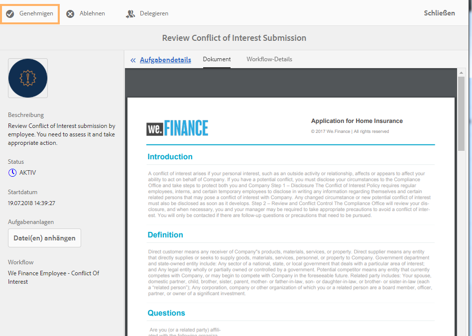
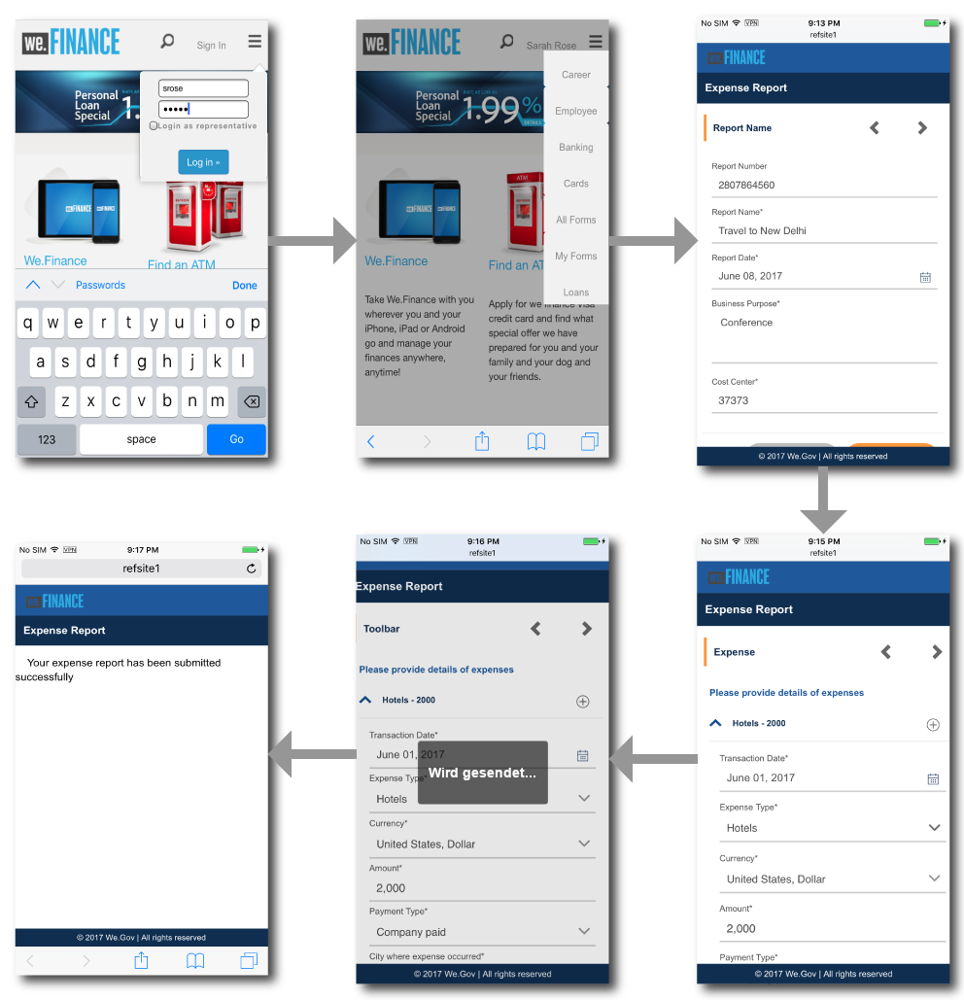

# Mitarbeiter-Self-Service exemplarische Vorgehensweise für Referenz-Website{#employee-self-service-reference-site-walkthrough}

## Voraussetzung {#prerequisite}

Richten Sie die Referenz-Websites ein wie in [Einrichten und Konfigurieren von AEM Forms-Referenz-Websites](../../forms/using/setup-reference-sites.md) beschrieben.

## Überblick {#overview}

Mitarbeiter-Self-Service-Systeme, die in der Regel im firmeneigenen Intranet gehostet werden, bieten Mitarbeitern Zugang zu einer Vielzahl von Informationen und Diensten, die sie von ihrem Schreibtisch aus nutzen können. Es gibt den Mitarbeitern die vollständige Kontrolle über die Durchführung von Maßnahmen wie den Zugang zu ihren Mitarbeiterdaten, die Beantragung von Urlaub und das Einreichen von Spesenabrechnungen. Umgekehrt hilft es Organisationen, die Prozesseffizienz zu verbessern und Kosten zu senken, während die Mitarbeiter informiert und engagiert bleiben.

Die Mitarbeiter-Self-Service-Referenzseite zeigt, wie Sie mit AEM Forms das Self-Services-System für Mitarbeiter in Ihrer Organisation implementieren können.

>[!NOTE]
>
>Die Beispiele, Bilder und Beschreibungen, die in der Anleitung zur Selbstbedienung des Mitarbeiters verwendet werden, verwenden die Referenz-Website We.Finance.

## Interessenkonflikt- Schrittweiser Fragebogen {#conflict-of-interest-questionnaire-walkthrough}

Organisationen von Zeit zu Zeit bitten ihre Mitarbeiter, einen Fragebogen zu Interessenskonflikten einzureichen, um externe Aktivitäten oder persönliche Beziehungen ihrer Mitarbeiter zu identifizieren, die möglicherweise mit ihrer Organisation kollidieren.

Die Compliance Abteilung der Sarah hat Mitarbeiter gebeten, den Fragebogen zu Interessenskonflikten einzureichen.

### Sarah reicht den Fragebogen zu Interessenkonflikten ein {#sarah-submits-the-conflict-of-interest-questionnaire}

Sarah geht zum Portal ihrer Organisation, meldet sich an und klickt auf „Mitarbeiter“, um auf das Mitarbeiter-Dashboard zuzugreifen. Sie findet den Fragebogen zu Interessenkonflikten auf dem Mitarbeiter-Dashboard und klickt auf **[!UICONTROL Beantragen.]**

Unternehmensportal

Mitarbeiter-Dashboard

Sarah navigiert durch das Formular mit der Schaltfläche „Weiter“ und liest die Abschnitte „Einführung“ und „Definition“. Sie beantwortet die Fragen im Abschnitt „Fragen“. Schließlich unterschreibt sie den Fragebogen und reicht ihn ein.

Das Unternehmensportal und der Fragebogen sind interaktiv und kann auf mobilen Geräten genutzt werden. Der folgende Workflow zeigt, wie Sarah den Fragebogen auf ihrem Mobilgerät durchsucht und übermittelt.

**Funktionsweise**

Das Unternehmensportal und das Mitarbeiter-Dashboard sind AEM-Sites. Das Dashboard listet verschiedene Self-Service-Optionen auf, z. B. den Fragebogen zu Interessenkonflikten. Die Schaltfläche „Beantragen“ ist mit einem adaptiven Formular verknüpft.

Das adaptive Formular verwendet Regeln, um Informationen basierend auf der Antwort auf der Registerkarte „Fragen“ ein- oder auszublenden. Außerdem verwendet das Formular die Scribble-Komponente zum Signieren auf der Registerkarte „Deklaration“. Überprüfen Sie das adaptive Formular unter `https://[authorHost]:[authorPort]/editor.html/content/forms/af/we-finance/employee/self-service/conflict-of-interest.html`.

**Sehen Sie selbst** 

Go to `https://[publishHost]:[publishPort]/content/we-finance/global/en/self-service-forms.html` and log in using `srose/srose` as username/password for Sarah. Klicken Sie auf **[!UICONTROL Mitarbeiter]**, um auf das Dashboard zuzugreifen, und klicken Sie anschließend auf **[!UICONTROL Beantragen]** im Fragebogen zu Interessenkonflikten. Überprüfen und übermitteln Sie den Fragebogen.

#### Gloria prüft und genehmigt die Übermittlung des Fragebogens zu Interessenkonflikten {#gloria-reviews-and-approves-the-conflict-of-interest-questionnaire-submission}

Der von Sarah eingereichte Fragebogen zum Interessenkonflikt wird Gloria Rios zur Überprüfung übergeben. Gloria arbeitet als Compliance Officer in dem Unternehmen. Gloria meldet sich bei ihrem AEM-Posteingang an und überprüft die ihr zugewiesenen Aufgaben. Sie genehmigt den von Sarah eingereichten Fragebogen und schließt die Aufgabe ab.

Glorias Posteingang

Offene Aufgabe

**Funktionsweise**

Die Übermittlungsaktion im Fragebogen „Interessenkonflikt“ löst einen Workflow aus, der eine Aufgabe in Glorias Posteingang zur Genehmigung erstellt. Überprüfen Sie den Arbeitsablauf für Formulare unter `https://[authorHost]:[authorPort]/editor.html/conf/global/settings/workflow/models/we-finance/employee/self-service/we-finance-employee-conflict-of-interest.html`

**Sehen Sie selbst** 

Go to `https://[publishHost]:[publishPort]/content/we-finance/global/en/login.html?resource=/aem/inbox.html` and log in using `grios/password` as username/password for Gloria Rios. Öffnen Sie die für den Fragebogen zu Interessenkonflikten erstellte Aufgabe und genehmigen Sie diese.

## Antrag auf Unternehmenskarte - Anleitung {#corporate-card-application-walkthrough}

Sarah reist viel geschäftlich und benötigt eine Unternehmenskreditkarte, um ihre Rechnungen unterwegs zu bezahlen. Sie beantragt eine Firmenkarte über das Mitarbeiterportal ihres Unternehmens.

### Sarah reicht den Antrag für die Unternehmenskarte ein {#sarah-submits-the-corporate-card-application}

Sarah geht zum Portal ihres Unternehmens, meldet sich an und klickt auf **[!UICONTROL Mitarbeiter]**, um auf das Mitarbeiter-Dashboard zuzugreifen. Sie findet den Antrag für die Unternehmenskarte auf dem Mitarbeiter-Dashboard und klickt auf **[!UICONTROL Übernehmen]**.

Unternehmensportal

Mitarbeiter-Dashboard

Sie klickt auf **[!UICONTROL Übernehmen]** im Antrag für die Unternehmenskarte. Ein Antrag auf einer einzelnen Seite wird geöffnet. Sie füllt alle Details aus und klickt auf **[!UICONTROL Übernehmen]**, um die Anwendung zu senden.

**Funktionsweise**

Das Unternehmensportal und das Mitarbeiter-Dashboard sind AEM-Sites. Das Dashboard listet verschiedene Self-Service-Optionen auf, z. B. den Antrag für die Unternehmenskarten. Die Schaltfläche „Übernehmen“ im Antrag ist mit einem adaptiven Formular verknüpft.

Das adaptive Formular für einen Antrag auf eine Unternehmenskarte ist ein einfaches, einseitiges, interaktives adaptives Formular. Es verwendet grundlegende adaptive Formularkomponenten wie Text, Telefon, numerisches Feld und numerischen Stepper. Überprüfen Sie das adaptive Formular unter:\
`https://[authorHost]:[authorPort]/editor.html/content/forms/af/we-finance/employee/self-service/corporate-card.html`.

**Sehen Sie selbst** 

Go to `https://[publishHost]:[publishPort]/content/we-finance/global/en/self-service-forms.html` and log in using `srose/srose` as username/password for Sarah. Klicken Sie auf **[!UICONTROL Mitarbeiter]**, um auf das Dashboard zuzugreifen, und klicken Sie dann auf **[!UICONTROL Übernehmen]** im Antrag auf die Unternehmenskarte. Geben Sie die Details ein und senden Sie den Antrag ab.

### Gloria prüft und genehmigt die Anwendung der Unternehmenskarte {#gloria-reviews-and-approves-the-corporate-card-application}

Der von Sarah eingereichte Antrag auf eine Unternehmenskarte wird zur Prüfung an Gloria Rios weitergeleitet. Gloria meldet sich bei ihrem AEM-Posteingang an und überprüft die ihr zugewiesenen Aufgaben. Sie genehmigt den von Sarah eingereichten Antrag und schließt die Aufgabe ab.

Glorias Posteingang

Offene Aufgabe

**Funktionsweise**

Der Workflow für die Einreichung auf dem Antrag auf eine Unternehmenskarte löst einen Workflow für Formulare aus, der eine Aufgabe in Glorias Posteingang zur Genehmigung erstellt. Überprüfen Sie den Arbeitsablauf für Formulare unter `https://[authorHost]:[authorPort]/editor.html/conf/global/settings/workflow/models/we-finance/employee/self-service/we-finance-employee-corporate-card.html`

**Sehen Sie selbst** 

Go to `https://[publishHost]:[publishPort]/content/we-finance/global/en/login.html?resource=/aem/inbox.html` and log in using `grios/password` as username/password for Gloria Rios. Öffnen Sie die Aufgabe, die für den Antrag auf eine Unternehmenskarte erstellt wurde, und genehmigen Sie sie.

## Einreichung von Spesenberichten - Anleitung {#expense-report-submission-walkthrough}

Da Sarah während Geschäftsreisen Ausgaben hat, muss sie Spesenberichte zur Genehmigung einreichen. Mit der Self-Service-Option in ihrem Unternehmen kann sie die Spesenabrechnung online einreichen.

### Sarah reicht den Antrag für den Spesenbericht ein {#sarah-submits-the-expense-report-application}

Sarah geht zum Portal ihres Unternehmens, meldet sich an und klickt auf **[!UICONTROL Mitarbeiter]**, um auf das Mitarbeiter-Dashboard zuzugreifen. Sie findet den Antrag für den Spesenbericht auf dem Mitarbeiter-Dashboard und klickt auf **[!UICONTROL Beantragen]**.

Unternehmensportal

Mitarbeiter-Dashboard

Sie klickt auf **[!UICONTROL Beantragen]** im Antrag für den Spesenbericht. Ein Antragsformular wird geöffnet, das zwei Registerkarten enthält: Berichtsname und Berichtsdetails. Mit dem **+**-Symbol auf der Registerkarte „Berichtsdetails“ kann sie mehr als nur Spesen in einem Bericht hinzufügen.

Das Unternehmensportal und die Anträge sind interaktiv und können auf mobilen Geräten genutzt werden. Der folgende Workflow zeigt, wie Sarah den Spesenbericht auf ihrem Mobilgerät durchsucht und einreicht.

**Funktionsweise**

Das Unternehmensportal und das Mitarbeiter-Dashboard sind AEM-Sites. Das Dashboard listet mehrere Self-Service-Optionen auf, z. B. den Antrag für den Spesenbericht. Die Schaltfläche „Beantragen“ ist mit einem adaptiven Formular verknüpft.

Die Registerkarten „Berichtsname“ und „Berichtsdetails“ im adaptiven Formular sind Bereichskomponenten. Der Bereich „Berichtdetails“ enthält den Bereich „Spesen“. Es ist einen wiederholbaren Bereich, mit dem mehrere Spesen im Bericht hinzugefügt werden können. Überprüfen Sie das adaptive Formular und seine Konfigurationen unter `https://[authorHost]:[authorPort]/editor.html/content/forms/af/we-finance/employee/expense-report.html`.

**Sehen Sie selbst** 

Go to `https://[publishHost]:[publishPort]/content/we-finance/global/en/self-service-forms.html` and log in using `srose/srose` as username/password for Sarah. Klicken Sie auf **[!UICONTROL Mitarbeiter]**, um auf das Dashboard zuzugreifen, und klicken Sie dann auf **[!UICONTROL Beantragen]** im Spesenbericht. Geben Sie die Details ein und übermitteln Sie den Antrag.

### Gloria überprüft und genehmigt die Spesenabrechnung {#gloria-reviews-and-approves-the-expense-report}

Der von Sarah eingereichte Spesenbericht wird Gloria Rios zur Prüfung übergeben. Gloria meldet sich bei ihrem AEM-Posteingang an und überprüft die ihr zugewiesenen Aufgaben. Sie genehmigt den von Sarah eingereichten Antrag und schließt die Aufgabe ab.

Glorias Posteingang

Offene Aufgabe

**Funktionsweise**

Der Übermittlungs-Workflow Antrag für den Spesenbericht löst einen Formular-Workflow aus, der eine Aufgabe in Glorias Posteingang zur Genehmigung erstellt. Überprüfen Sie den Arbeitsablauf für Formulare unter `https://[authorHost]:[authorPort]/editor.html/conf/global/settings/workflow/models/we-finance/employee/self-service/we-finance-employee-expense-report-workflow.html`

**Sehen Sie selbst** 

Go to `https://[publishHost]:[publishPort]/content/we-finance/global/en/login.html?resource=/aem/inbox.html` and log in using `grios/password` as username/password for Gloria Rios. Öffnen Sie die Aufgabe, die für den Antrag für den Spesenbericht erstellt wurde, und genehmigen Sie sie.

## Antrag auf Urlaub - Anleitung {#leave-application-walkthrough}

Sarah plant nächsten Monat einen Familienurlaub und will einen Antrag auf eine Woche Urlaub stellen.

### Sarah reicht den Urlaubsantrag ein {#sarah-submits-the-leave-application}

Sarah geht zum Portal ihres Unternehmens, meldet sich an und klickt auf **[!UICONTROL Mitarbeiter]**, um auf das Mitarbeiter-Dashboard zuzugreifen. Sie findet den Antrag auf Urlaub auf dem Mitarbeiter-Dashboard und klickt auf **[!UICONTROL Beantragen]**.

Unternehmensportal

Mitarbeiter-Dashboard

Der Antrag auf Urlaub wird mit dem Namen und der Angestellten-ID von Sarah geöffnet, die im Formular bereits ausgefüllt sind. Es zeigt auch ihr Urlaubsguthaben und den Verlauf. Sie füllt die Urlaubsdaten aus und reicht den Antrag zur Genehmigung ein.

Das Unternehmensportal und die Anträge sind interaktiv und können auf mobilen Geräten genutzt werden. Der folgende Workflow zeigt, wie Sarah durch den Antrag navigiert und diesen auf ihrem mobilen Gerät übermittelt.

**Funktionsweise**

Das Unternehmensportal und das Mitarbeiter-Dashboard sind AEM-Sites. Das Dashboard listet mehrere Self-Service-Optionen auf, z. B. den Antrag auf Urlaub. Die Schaltfläche „Beantragen“ ist mit einem adaptiven Formular verknüpft.

Das adaptive Formular für den Antrag auf Urlaub basiert auf dem Formulardatenmodell für Urlaub für Mitarbeiter. Im Abschnitt „Urlaubsstand“ wird die Tabelle für den Urlaubsstand mithilfe des `getLeavesOf`-Formulardatenmodelldienstes befüllt. Die Felder „Anfangsdatum“ und „Enddatum“ verwenden Regeln, um zu überprüfen, ob die Datumswerte gleich oder nach dem aktuellen Datum liegen. Die Urlaubsdauer wird mit der Funktion `calcBusinessDays` berechnet.

Sie können das adaptive Formular und das Formulardatenmodell an folgenden Stellen überprüfen:

`https://[authorHost]:[authorPort]/editor.html/content/forms/af/we-finance/employee/self-service/leave-application.html`

`https://[authorHost]:[authorPort]/aem/fdm/editor.html/content/dam/formsanddocuments-fdm/db`

**Sehen Sie selbst** 

Go to `https://[publishHost]:[publishPort]/content/we-finance/global/en/self-service-forms.html` and log in using `srose/srose` as username/password for Sarah. Klicken Sie auf **[!UICONTROL Mitarbeiter]**, um auf das Dashboard zuzugreifen, und klicken Sie dann auf **[!UICONTROL Beantragen]** im Urlaubsantrag. Geben Sie die Details ein und übermitteln Sie den Antrag.

#### Gloria geprüft und genehmigt den Urlaubsantrag {#gloria-reviews-and-approves-the-leave-application}

Der von Sarah eingereichte Urlaubsantrag wird Gloria Rios zur Überprüfung übergeben. Gloria meldet sich bei ihrem AEM-Posteingang an und überprüft die ihr zugewiesenen Aufgaben. Sie genehmigt den von Sarah eingereichten Antrag und schließt die Aufgabe ab.

Glorias Posteingang

Offene Aufgabe

**Funktionsweise**

Der Übermittlungs-Workflow im Urlaubsantrag löst einen Formular-Workflow aus, der eine Aufgabe in Glorias Posteingang zur Genehmigung erstellt. Überprüfen Sie den Arbeitsablauf für Formulare unter `https://[authorHost]:[authorPort]/editor.html/conf/global/settings/workflow/models/we-finance/employee/self-service/we-finance-employee-leave-application.html`

**Sehen Sie selbst** 

Go to `https://[publishHost]:[publishPort]/content/we-finance/global/en/login.html?resource=/aem/inbox.html` and log in using `grios/password` as username/password for Gloria Rios. Öffnen Sie die Aufgabe, die für den Antrag auf Urlaub erstellt wurde, und genehmigen Sie sie.
