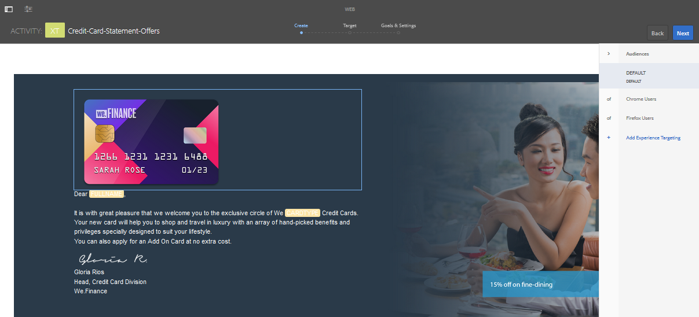

# Erstellen zielgerichteter Erlebnisse in AEM Forms {#create-targeted-experiences-in-aem-forms}

## Integrate Adobe Target with AEM Forms {#integrate-adobe-target-with-aem-forms}

Durch die Integration von Adobe Target mit AEM können Sie die personalisierte Erlebnisse für bestimmte Zielgruppen erstellen. Mit Adobe Target können Sie A/B-Tests erstellen, Benutzerreaktionen messen und personalisierte Web-Inhalte für die anzusprechenden Benutzer generieren. Sie können Adobe Target mit AEM Forms integrieren, um Bildkomponenten adaptiver Formulare und interaktiver Kommunikation als Ziel festzulegen.

Konfigurieren Sie Adobe Target in AEM, um es mit adaptiven Formularen und interaktiver Kommunikation zu verwenden, siehe [Erstellen einer Target-Konfiguration in AEM](/help/sites-administering/target.md) und [Hinzufügen eines Frameworks](/help/sites-administering/target.md).

>[!NOTE]
>
>Targeting funktioniert, wenn Ihr adaptives Formular oder Ihre interaktive Kommunikation mit einem Hostnamen oder einer IP-Adresse wiedergegeben wird. Es schlägt fehl, wenn Ihr adaptives Formular oder Ihre interaktive Kommunikation mit localhost wiedergegeben wird.

## Target- Aktivität erstellen {#creating-a-target-activity}

1. Tap **Adobe Experience Manager > Personalization > Activities**.

   `https://<hostname>:<port>/libs/cq/personalization/touch-ui/content/v2/activities.html`

1. In the Activities page, tap **Create > Create Brand**.
1. Sie werden aufgefordert, eine Vorlage auswählen und Eigenschaften einzugeben.

   Select a template, tap **Next.** Geben Sie im Abschnitt Eigenschaften den Titel Ihrer Marke ein und tippen Sie auf **Erstellen.**
Ihre Marke wird jetzt auf der Seite Aktivitäten aufgeführt.

1. Tippen Sie auf der Seite „Aktivitäten“ auf Ihre Marke.
1. In Master Area of your brand, tap **Create** > **Create Activity**.

   Beim Erstellen einer Aktivität geben Sie deren Details, Ziel und Einstellungen an.

   Der Detailbereich enthält den Namen, die Targeting-Engine und die Zielsetzung. Wenn Sie Adobe Target als Targeting-Engine wählen, wird die Option für die Target-Cloud-Konfiguration aktiviert. Choose your Target cloud configuration, choose Activity type, provide the objective of the activity, and tap **Next**. Interaktive Kommunikation unterstützt nur den Aktivitätstyp Erlebnis-Targeting.

   Im Abschnitt „Target“ können Sie das Erlebnis für die Zielgruppe hinzufügen und benennen. Click **Add Experience** to enable the **Select Audience** and **Name Experience** options. Tap **Select Audience** to see a list of audiences and their source. Wählen Sie eine Zielgruppe aus der Liste „Zielgruppenname“ aus. Tap **Add Experience** to name the experience, and tap **Next**.

   Im Abschnitt „Ziele und Einstellungen“ können Sie den Zeitplan und die Priorität für Ihre Aktivität festlegen. Set the start date, end date, and priority of the activity, goal metric, additional metric and tap **Save**.

   Die Aktivität wird jetzt in Ihrer Markenseite aufgeführt.

   >[!NOTE]
   >
   >Sie können die Fehlermeldung &quot;Ihre Aktivität wurde gespeichert, sie wurde jedoch nicht mit Target synchronisiert. Grund: Das folgende Erlebnis enthält keine Angebote&quot;, wenn es beim Speichern der Aktivität aufgetreten ist.

1. Um Target zu aktivieren, bearbeiten Sie die JSP-Datei, um Clientbibliotheken einzuschließen, die Ihre Vorlage für adaptive Formulare verwendet.

   For example, in the out-of-the-box implementation, click **Tools** >  **CRXDE Lite**.

   Geben Sie in der Adressleiste von CRXDE Lite /libs/fd/af/components/page/base/head.jsp ein, um die Datei head.jsp zu bearbeiten.

   Diese Implementierung verwendet die Vorlage simpleEnrollment. In dieser Implementierung müssen Sie die Datei head.jsp wie folgt ändern und dabei die folgenden Clientbibliotheken aufnehmen:

   `<cq:include script="/libs/cq/cloudserviceconfigs/components/servicelibs/servicelibs.jsp"/>`

   `<cq:include path="clientcontext_optimized" resourceType="/libs/cq/personalization/components/clientcontext_optimized"/>`

   `<cq:include path="config" resourceType="cq/personalization/components/clientcontext_optimized/config"/>`

1. Um das Target-Framework für adaptive Formulare zu aktivieren, navigieren Sie zu Ihrem Formular oder zu Ihrer interaktiven Kommunikation und öffnen Sie es im Bearbeitungsmodus.

   To open a form or interactive communication in edit mode, tap **Select** and then tap **Open**.

   Alternativ dazu werden vier Schaltflächen angezeigt, wenn Sie den Mauszeiger über das Formular- oder interaktive Kommunikationssymbol bewegen, ohne es auszuwählen. You can tap the **Edit** button that appears, to open the form in edit mode.

1. In the page toolbar, tap **Page Information**  > **Open Properties**.
1. Wählen Sie auf der Registerkarte &quot;Allgemein&quot;eine Konfiguration für das Feld &quot; **Adobe Target** &quot;aus. Tap **Save &amp; Close**.

## Anwenden der erstellten Aktivität auf ein adaptives Formularbild oder ein interaktives Kommunikationsbild {#applying-created-activity-to-an-adaptive-form-image-or-an-interactive-communication-image}

1. Öffnen Sie das adaptive Formular und die interaktive Kommunikation zur Bearbeitung. Wenn Sie eine interaktive Kommunikation öffnen, öffnen Sie den Webkanal.

1. Fügen Sie im Bearbeitungsmodus Ihrer interaktiven Kommunikation oder Ihres adaptiven Formulars ein Bild hinzu, das als Ziel dienen soll.

   >[!NOTE]
   >
   >AEM Forms unterstützt das Targeting nur von Bildkomponenten. Stellen Sie sicher, dass das Bedienfeld, in dem sich die Bildkomponente befindet, keine andere Komponente enthält und die Spaltenanzahl für das Bedienfeld auf 1 eingestellt ist.

1. Wechseln Sie vom **Bearbeitungsmodus** zum **Targeting** -Modus. Die Option zum Wechseln der Modi befindet sich in der oberen rechten Ecke.
1. Wählen Sie eine **MARKE**, wählen Sie **AKTIVITÄT** und tippen Sie auf **Targeting** starten. Das Menü &quot; **Zielgruppen** &quot;wird rechts im Editor angezeigt.

   

1. Wählen Sie eine Zielgruppe aus dem Menü &quot; **Zielgruppen** &quot;und tippen Sie auf das gewünschte Bild. Ein Menü wird angezeigt. Tippen Sie im Menü auf **Target**. Tippen Sie auf das Bild und dann auf **Konfigurieren**. Wählen Sie im Eigenschaftenfenster das Bild aus, das für die ausgewählte Zielgruppe angezeigt werden soll. Wiederholen Sie den Schritt für alle Zielgruppen. Das Erlebnis-Targeting ist für das Bild in der interaktiven Kommunikation oder im adaptiven Formular aktiviert.

## Überprüfen Sie, ob die erstellte Aktivität mit dem Target-Server synchronisiert wird.{#check-if-the-created-activity-syncs-with-the-target-server}

Aktivitäten, die für das Targeting verwendet werden, werden mit dem Target-Server synchronisiert. Um zu überprüfen, ob Ihre Aktivität mit dem Zielserver synchron ist, überprüfen Sie den Status Ihrer Aktivität auf Ihrer Markenseite.

Vergewissern Sie sich, dass die Aktivität den Status „Synchronisiert“ aufweist.

## Target-Verhalten validieren {#validate-target-behavior}

Target-Verhalten validieren:

* Use targeting with `wcmmode preview` in the author mode
* Verwenden des Targeting mit `wcmmode preview` und im `wcmmode disabled` Veröffentlichungsmodus

## Targeting für die Bildkomponente überwachen {#monitor-targeting-for-the-image-component}

Um das Targeting für Bildkomponenten in Ihrem Formular zu überwachen, veröffentlichen Sie Ihre Bilder und Aktivitäten sowie das adaptive Formular.

## Offene Probleme {#open-issues}

Ausdruck für die Sichtbarkeit: Festlegen des Fokus schläft für Targeting-Bilder auf adaptiven Formularen fehl.
