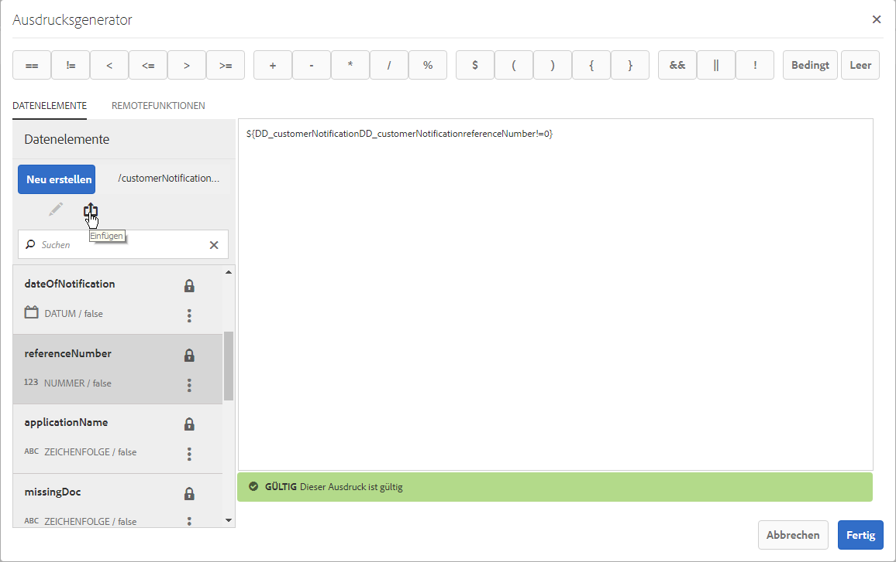
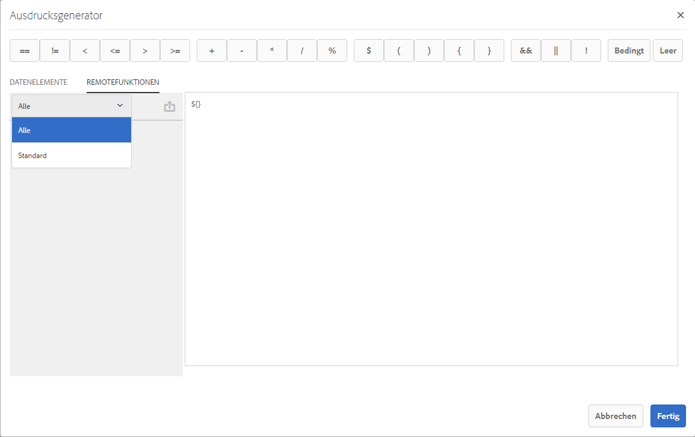

# Remote-Funktionen im Ausdrucksgenerator{#remote-functions-in-expression-builder}

Mithilfe des Ausdrucksgenerators können Sie Ausdrücke oder Bedingungen erstellen, die Berechnungen mit Datenwerten durchführen, die vom Datenwörterbuch oder von Endbenutzern bereitgestellt werden. Correspondence Management nutzt das Ergebnis der Ausdrucksberechnung, um Assets wie Text, Bilder, Listen und Bedingungen auszuwählen und sie nach Bedarf in der Korrespondenz einzufügen.

## Erstellen von Ausdrücken und Remote-Funktionen mit dem Ausdrucksgenerator {#creating-expressions-and-remote-functions-with-expression-builder}

Der Ausdruck Builder verwendet intern JSP-EL-Bibliotheken, sodass der Ausdruck die JSPEL-Syntax einhält. Weitere Informationen finden Sie unter [Beispielausdrücke](#exampleexpressions).



### Operatoren  {#operators}

Die zur Verwendung in Ausdrücken verfügbaren Operatoren sind auf der oberen Leiste des Ausdrucksgenerators verfügbar.

### Beispielausdrücke {#exampleexpressions}

Im Folgenden werden einige Beispiele für häufige JSP-EL-Verwendungszwecke gezeigt, die Sie für Ihre Correspondence Management-Lösung verwenden können.

* So fügen Sie zwei Zahlen hinzu: ${number1 + number2}
* So verketten Sie zwei Zeichenfolgen: ${str1} ${str2}
* So vergleichen Sie zwei Zahlen: ${age &lt; 18}

Weitere Informationen finden Sie in der [JSP-EL-Spezifikation](https://download.oracle.com/otn-pub/jcp/jsp-2.1-fr-spec-oth-JSpec/jsp-2_1-fr-spec-el.pdf). Der clientseitige Expression Manager unterstützt nicht alle Variablen und Funktionen in der JSP-EL-Spezifikation. Dabei gilt:

* Sammlungsindizes und Zuordnungsschlüssel (unter Verwendung der []-Notation) werden in Variablennamen für clientseitig ausgewertete Ausdruck nicht unterstützt.
* Die folgenden Parameter sind als Parametertypen oder Rückgabetypen für in Ausdrücken verwendete Funktionen unterstützt:

   * java.lang.String
   * java.lang.Character
   * Char
   * java.lang.Boolean
   * Boolesch
   * java.lang.Integer
   * Int
   * java.util.list
   * java.lang.Short
   * Short
   * java.lang.Byte
   * byte
   * java.lang.Double
   * Double
   * java.lang.Long
   * Long
   * java.lang.Float
   * Float
   * java.util.Calendar
   * java.util.Date
   * java.util.List

### Remote-Funktion {#remote-function}

Remote-Funktionen ermöglichen die Nutzung von benutzerdefinierter Logik in Ausdrücken. Sie können benutzerdefinierte Logik schreiben, die in Ausdrücken als Methode in Java verwendet wird. Dieselbe Funktion kann innerhalb von Ausdrücken verwendet werden. Verfügbare Remote-Funktionen werden unter der Registerkarte „Remote-Funktionen“ im Ausdruckseditor links aufgelistet.



#### Benutzerdefinierte Remote-Funktionen hinzufügen {#adding-custom-remote-functions}

Sie können ein benutzerdefiniertes Bundle erstellen, um Ihre eigenen Remote-Funktionen zur Verwendung in Ausdrücken zu exportieren. Um ein benutzerdefiniertes Bundle zum Exportieren Ihrer eigenen Remote-Funktionen zu erstellen, führen Sie folgende Schritte aus. Sie demonstrieren, wie Sie eine benutzerdefinierte Funktion schreiben, deren Eingabezeichenfolge groß geschrieben wird.

1. Definieren Sie eine Schnittstelle für den OSGi-Dienst, die Methoden enthält, die zur Verwendung in Expression Manager exportiert werden sollen.
1. Deklarieren Sie Methoden auf der Schnittstelle A und kommentieren Sie sie mit der Anmerkung &quot;@ServiceMethod&quot;(com.adobe.exm.expeval.ServiceMethod). Expression Manager ignoriert alle Methoden, bei denen keine Anmerkungen vorhanden sind. Die ServiceMethod-Anmerkung verfügt über die folgenden optionalen Attribute, die ebenfalls angegeben werden können:

   1. **Enabled**: Bestimmt, ob diese Methode aktiviert ist. Expression Manager ignoriert deaktivierte Methoden.
   1. **familyId**: Legt die Familie (Gruppe) der Methode fest. Wenn dieses Attribut leer ist, geht Expression Manager davon aus, dass die Methode zur Standardfamilie gehört. Es ist keine Registrierung für Familien (außer der Standardeinstellung) vorhanden, um die Auswahl von Funktionen zu ermöglichen. Expression Manager erstellt die Registrierung dynamisch durch Zusammenführen aller Familien-IDs, die durch sämtliche von den verschiedenen Bundles exportierte Funktionen angegeben werden. Stellen Sie sicher, dass hier eine lesbare ID angegeben wird, da diese auch in der Authoring-Benutzeroberfläche für die Ausdrücke angezeigt wird.
   1. **displayName**: Ein für Menschen lesbarer Name für die Funktion. Dieser Name wird für die Anzeige in der Authoring-Benutzeroberfläche verwendet. Wenn dieses Attribut leer bleibt, erstellt Expression Manager einen Standardnamen aus dem Präfix und dem lokalen Namen der Funktion.
   1. **Description**: Eine detaillierte Beschreibung der Funktion. Diese Beschreibung wird für die Anzeige in der Authoring-Benutzeroberfläche verwendet. Wenn dieses Attribut leer bleibt, erstellt Expression Manager eine Standardbeschreibung aus dem Präfix und dem lokalen Namen der Funktion.

   ```java
   package mergeandfuse.com;
   import com.adobe.exm.expeval.ServiceMethod;
   
   public interface RemoteFunction {
    @ServiceMethod(enabled=true,displayName="Returns_all_caps",description="Function to convert to all CAPS", familyId="remote")
    public String toAllCaps(String name);
   
   }
   ```

   Die Parameter der Methoden können optional auch mit der Anmerkung &quot;@ServiceMethodParameter&quot;(com.adobe.exm.expeval.ServiceMethodParameter) kommentiert werden. Diese Anmerkung wird nur dazu verwendet, für Menschen lesbare Namen und Beschreibungen von Methodenparametern für die Verwendung in der Authoring-Benutzeroberfläche anzugeben. Stellen Sie sicher, dass die Parameter und Rückgabewerte der Methoden für die Schnittstelle zu den folgenden Typen gehören:

   * java.lang.String
   * java.lang.Character
   * Zeichen
   * java.lang.Boolean
   * Boolesch
   * java.lang.Integer
   * Int
   * java.lang.Short
   * Short
   * java.lang.Byte
   * byte
   * java.lang.Double
   * Dublette
   * java.lang.Long
   * lang
   * java.lang.Float
   * Float
   * java.util.Calendar
   * java.util.Date
   * java.util.List


1. Definieren Sie die Implementierung der Schnittstelle, konfigurieren Sie sie als OSGI-Dienst und definieren Sie die folgenden Diensteigenschaften:

```jsp
@org.apache.felix.scr.annotations.Properties({
  @org.apache.felix.scr.annotations.Property(name = "connectors.jsoninvoker", boolValue = true),
  @org.apache.felix.scr.annotations.Property(name = "connectors.jsoninvoker.alias", value = "<service_id>"),
  @org.apache.felix.scr.annotations.Property(name = "exm.service", boolValue = true)})
```

Der Eintrag exm.service=true meldet Expression Manager, dass der Dienst Remote-Funktionen enthält, die für die Verwendung in Ausdrücken geeignet sind. Der Wert für &lt;Dienst-ID> muss ein gültiger Java-Bezeichner sein (alphanumeric,$, _ ohne weitere Sonderzeichen). Dieser Wert bildet mit vorangestelltem Schlüsselwort REMOTE_ das Präfix für die Verwendung in Ausdrücken. Wenn beispielsweise in einer Schnittstelle die mit einer Anmerkung versehene Methode bar() vorhanden ist und die Dienst-ID in den Eigenschaften für den Dienst foo lautet, kann die Methode in Ausdrücken mithilfe von REMOTE_foo:bar() referenziert werden.

```java
package mergeandfuse.com;

import org.apache.felix.scr.annotations.Component;
import org.apache.felix.scr.annotations.Service;

@Component(metatype = true, immediate = true, label = "RemoteFunctionImpl")
@Service(value = RemoteFunction.class)
@org.apache.felix.scr.annotations.Properties({
  @org.apache.felix.scr.annotations.Property(name = "connectors.jsoninvoker", boolValue = true),
  @org.apache.felix.scr.annotations.Property(name = "connectors.jsoninvoker.alias", value = "test1"),
  @org.apache.felix.scr.annotations.Property(name = "exm.service", boolValue = true)})
public class RemoteFuntionImpl implements RemoteFunction {

 @Override
 public String toAllCaps(String name) {
  System.out.println("######Got######"+name);
  
  return name.toUpperCase();
 }
 
}
```

Nachfolgend finden Sie Beispiel-Archive:

* **GoodFunctions.jar.** zipis die JAR-Datei mit Bundle, die eine Definition für eine Muster-Remote-Funktion enthält. Laden Sie die GoodFunctions.jar.zip-Datei herunter und dekomprimieren Sie diese, um die JAR-Datei zu erhalten.
* **GoodFunctions.zip** ist das Paket des Quellcodes zum Definieren einer benutzerdefinierten Remote-Funktion und eines Bundles dafür.

GoodFunctions.jar.zip

[Datei laden](assets/goodfunctions.jar.zip)

GoodFunctions.zip

[Datei laden](assets/goodfunctions.zip)
