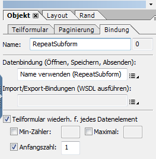

# Häufig gestellte Fragen (FAQ) für HTML5-Formulare{#frequently-asked-questions-faq-for-html-forms}

Es gibt einige häufig gestellte Fragen (FAQ) zu Layout, Skriptunterstützung und dem Umfang von HTML5-Formularen.

## Layout {#layout}

1. Warum werden Barcodes und Unterschriftsfelder nicht in meinem Formular angezeigt?

   Antwort: Barcodes und Unterschriftsfelder sind in HTML- oder Mobilgerät-Szenarien nicht wichtig. Diese Felder werden als nicht interaktiver Bereich angezeigt. AEM Forms Designer bietet allerdings ein neues Scribble-Unterschriftsfeld, das anstelle des Unterschriftsfeldes verwendet werden kann. Sie können auch ein [benutzerdefiniertes Widget](../../forms/using/custom-widgets.md) für Barcodes hinzufügen und integrieren.

1. Wird im XFA-Textfeld Rich Text unterstützt?

   Antwort: Das XFA-Feld, das umfangreiche Inhalte in AEM Forms Designer zulässt, wird nicht unterstützt, sondern als normaler Text dargestellt, der nicht über die Benutzeroberfläche formatiert werden kann. Auch XFA-Felder mit Kombinationseigenschaft werden als normales Feld angezeigt, obwohl je nach dem Wert der Kombinationszahlen Einschränkungen hinsichtlich der zulässigen Zeichenanzahl möglich sind.

1. Gibt es Einschränkungen bei der Verwendung wiederholbarer Teilformulare?

   Antwort: Wiederholbare Teilformulare müssen eine Anfangsanzahl von 1 oder höher haben. Wiederholbare Teilformulare mit einer anfänglichen Anzahl von Null werden nicht unterstützt. Sie können auch ein wiederholbares Teilformular verwenden und es nicht anzeigen, wenn das Formular geladen wird. Um den Anwendungsfall zu erreichen: 

   1. Legen Sie die Anfangszahl des wiederholbaren Teilformulars auf 1 fest.

      

   1. Verwenden Sie das initialize-Ereignis des Formulars, um die primäre Instanz des Teilformulars auszublenden. Der folgende Code beispielsweise blendet die primäre Instanz des Teilformulars bei der Formularinitialisierung aus. Außerdem überprüft es den App-Typ, um sicherzustellen, dass das Skript nur auf der Clientseite ausgeführt wird: 

      ```javascript
      if ((xfa.host.appType == "HTML 5" || xfa.host.appType == "Exchange-Pro" || xfa.host.appType == "Reader")&&(_RepeatSubform.count == 1)&&(form1.Page1.Subform1.RepeatSubform.Key.rawValue == null)) {
      RepeatSubform.presence = "hidden";
      }
      ```

   1. Öffnen Sie das Skript zum Hinzufügen einer Instanz des Teilformulars zum Bearbeiten. Fügen Sie den folgenden Code hinzu, um eine Instanz des Teilformularskripts hinzuzufügen.

      Der folgende Code überprüft die ausgeblendete Instanz des Teilformulars. Wenn die ausgeblendete Instanz des Teilformulars gefunden wird, löschen Sie die ausgeblendete Instanz des Teilformulars, und fügen Sie eine neue Instanz ein. Wenn die ausgeblendete Instanz des Teilformulars nicht gefunden wird, fügen Sie einfach eine neue Instanz des Teilformulars ein.

      ```javascript
      if (RepeatSubform.presence == "hidden")
      {
      RepeatSubform.instanceManager.insertInstance(0);
      RepeatSubform.instanceManager.removeInstance(1);
      }
      else
      {
      RepeatSubform.instanceManager.addInstance(1);
      }
      ```

   1. Öffnen Sie das Skript zum Entfernen einer Instanz des Teilformulars zum Bearbeiten. Fügen Sie Code ähnlich dem folgenden zum Entfernen einer Instanz des Teilformulars hinzu.

      Der Code überprüft die Anzahl der Teilformulare. Wenn die Anzahl der Teilformulare 1 erreicht, blendet der Code das Teilformular aus, anstatt es zu löschen.

      ```javascript
      if (RepeatSubform.instanceManager.count == 1) {
      RepeatSubform.presence = "hidden";
      } else {
      RepeatSubform.instanceManager.removeInstance(RepeatSubform.instanceManager.count - 1);
      }
      ```

   1. Öffnen Sie das presubmit-Ereignis des Formulars zum Bearbeiten. Fügen Sie dem Ereignis das folgende Skript hinzu, um die ausgeblendete Instanz des Skripts vor der Bearbeitung zu entfernen. Es verhindert das Senden von Daten des ausgeblendeten Teilformulars bei der Übermittlung.

      ```javascript
      if(RepeatSubform.instanceManager.count == 1 && RepeatSubform.presence == "hidden") {
      RepeatSubform.instanceManager.removeInstance(0);
      }
      ```

1. Gibt es Einschränkungen bei der Verwendung ausgeblendeter Teilformulare?

   Antwort: Ein ausgeblendetes Teilformular mit einer komplexen Hierarchie, die auf mehrere Seiten aufgeteilt ist, führt zu Problemen mit dem Layout. Eine Option besteht darin, das Teilformular am Anfang als sichtbar zu markieren und es anschließend in einem auf Logik oder Daten basierenden Initialisierungsskript auszublenden.

1. Warum wird Text in HTML5 abgeschnitten oder falsch angezeigt?

   Antwort: Wenn nicht genügend Platz zum Anzeigen des Inhalts eines Zeichnungs- oder Beschriftungs-Textelements vorhanden ist, werden manche Texte im Rendering von Mobile Forms abgeschnitten angezeigt. Diese Kürzung ist auch in der Design-Ansicht von AEM Forms Designer sichtbar. Zwar kann eine solche Kürzung im PDF-Format bearbeitet werden, in HTML5-Formularen ist dies jedoch nicht möglich. Wenn Sie dieses Problem vermeiden möchten, stellen Sie genügend Platz zum Zeichnen oder für Beschriftungen zur Verfügung, damit der Text im Designmodus von AEM Forms Designer nicht abgeschnitten wird.

1. Ich habe beim Layout Probleme mit fehlenden oder überlagerten Inhalten. Was ist der Grund dafür?

   Antwort: Wenn sich an der gleichen Position ein Element zum Zeichnen von Text oder ein Bild mit einem anderen überlappenden Element befindet (z. B. ein Rechteck), ist der Inhalt zum Zeichnen von Text nicht sichtbar, wenn er später in der Reihenfolge des Dokuments (in der Ansicht der AEM Forms Designer-Hierarchie) erscheint. PDF unterstützt eine transparente Überlagerung, HTML/Browser unterstützen jedoch keine transparente Überlagerung.

1. Warum werden einige Schriften im HTML-Formular in anderer Form angezeigt als beim Entwerfen des Formulars?

   Antwort: In HTML5-Formularen werden keine Schriften eingebettet (im Gegensatz zu PDF-Formularen, in denen Schriften in das Formular eingebettet sind). Damit die HTML-Version eines Formulars erwartungsgemäß dargestellt wird, stellen Sie sicher, dass Die in der XDP angegebenen Schriftarten auf dem Server und dem Clientcomputer verfügbar sind. Wenn die erforderlichen Schriftarten nicht auf dem Server verfügbar sind, werden Ersatzschriftarten verwendet. Wenn Sie darüber hinaus in der Formularvorlage Schriftarten verwenden, die auf dem Client-Gerät nicht verfügbar sind, werden zur Darstellung von diesem Text die Standardschriftarten des Browsers verwendet.

1. Werden die Attribute „vAlign“ und „hAlign“ in HTML-Formularen unterstützt?

   Ja, die Attribute „vAlign“ und „hAlign“ werden in HTML-Formularen unterstützt. Das Attribut vAlign wird in Internet Explorer und in mehrzeiligen Feldern nicht unterstützt.

1. Unterstützen HTML5-Formulare hebräische Zeichen?

   HTML5-Formulare unterstützen hebräische Zeichen in allen Browsern außer Microsoft Internet Explorer.

1. Gibt es in HTML5-Formularen Beschränkungen für numerische Felder?

   Antwort: Ja, HTML5-Formulare haben einige Einschränkungen. Wenn die Anzahl der Ziffern die in der Picture-Klausel festgelegte Anzahl überschreitet, werden die Zahlen nicht lokalisiert, sondern im englischen Gebietsschema angezeigt.

1. Warum sind HTML-Formulare größer als PDF-Formulare?

   Eine Vielzahl von Daten-Zwischenstrukturen und Objekte wie Formular-DOM, Daten-DOM und Layout-DOM sind zum Rendern einer XDP in einem HTML-Formular erforderlich.

   Für PDF-Formulare verfügt Adobe Acrobat über eine integrierte XTG-Engine zum Erstellen von Daten-Zwischenstrukturen und Objekten. Acrobat übernimmt auch Layout und Skripte.

   Für HTML5-Formulare verfügen Browser nicht über eine integrierte XTG-Engine zum Erstellen von Daten-Zwischenstrukturen und Objekten aus rohen XDP-Byte. D. h. für HTML5-Formulare werden Zwischenstrukturen auf dem Server generiert und an den Client gesendet. Auf dem Client verwenden JavaScript-basierte Skript- und Layout-Engine diese Zwischenstrukturen.

   Die Größe der Zwischenstruktur hängt von der Größe der Original-XDP und der mit der XDP zusammengeführten Daten ab.

1. Gibt es Einschränkungen bei der Verwendung von Tabellen in meinem XDP?

   Antwort: Komplexe Tabellen verursachen Probleme beim Rendering.

   * Abschnitte (Teilformularsätze) innerhalb einer Tabelle werden nicht unterstützt.
   * Die Kopf- oder Fußzeilen in einigen Tabellen sind für eine Wiederholung markiert. Die Aufteilung von Tabellen über mehrere Seiten kann zu Problemen führen.

1. Haben barrierefreie Tabellen Beschränkungen?

   Antwort: Ja barrierefreie Tabellen haben die folgenden Einschränkungen:

   * Verschachtelte Tabellen und Teilformulare innerhalb einer Tabelle werden nicht unterstützt.
   * Kopfzeilen werden nur für die erste Zeile bzw. die linken Spalten der Tabelle unterstützt. Kopfzeilen werden nicht für die Tabellenelemente unterstützt. Sie können Kopfzeilen auf mehrere Zeilen anwenden und Spaltenüberschriften und Spaltenüberschriften werden unterstützt, wenn alle derartigen Zeilen und Spalten auf der obersten Zeile oder in der ganz linken Spalte der Tabelle sind. 
   * `Rowspan`   und`colspan`   von einer beliebigen Stelle in der Tabelle wird nicht unterstützt. 

   * Sie können Instanzen von Zeilen, die Elemente mit rowspan-Werten größer als 1 enthalten, nicht dynamisch hinzufügen oder entfernen.

1. Was ist die Lesereihenfolge der QuickInfo und Beschriftung für Bildschirmleseprogramme?

   * Wird  QuickInfo und Beschriftung vorhanden sind, wird nur die Beschriftung gelesen. Wenn die Beschriftung nicht verfügbar ist, wird die QuickInfo gelesen. Sie können den Vorrang für das Lesen in einem XDP auch mit Hilfe des Formulardesigners festlegen.
   * Wenn Sie den Mauszeiger über einem Element bewegen, wird die QuickInfo angezeigt. Wenn die QuickInfo nicht verfügbar ist, wird Sprachtext angezeigt. Wenn Sprachtext nicht verfügbar ist, dann wird der Feldname angezeigt.

1. Wenn Sie den Mauszeiger über ein Feld bewegen, wird eine QuickInfo angezeigt. Wie deaktiviert man sie?

   Um den Tooltip beim Daraufzeigen zu deaktivieren, wählen Sie in der Eingabehilfe des Designers „Keine“ aus.

1. In Designer kann ein Benutzer benutzerdefinierte Erscheinungsbildeigenschaften von Optionsfeldern und Kontrollkästchen konfigurieren. Berücksichtigen HTML5-Formulare beim Rendern von Formularen auch diese benutzerdefinierten Erscheinungsbildeigenschaften?

   Antwort: HTML5-Formulare ignorieren die benutzerdefinierten Erscheinungsbildeigenschaften von Optionsfeldern und Kontrollkästchen. Die Optionsfeldern und Kontrollkästchen werden entsprechend den Spezifikationen des zugrundeliegenden Browsers angezeigt.

1. Wenn ein HTML5-Formular in einem unterstützten Browser geöffnet wird, wird der Rand der angrenzenden Felder nicht richtig ausgerichtet oder Teilformulare erscheinen überlappend. Wenn das gleiche HTML5-Formular im Forms Designer in der Vorschau angezeigt wird, erscheinen die Felder und das Layout nicht falsch ausgerichtet und die Teilformulare erscheinen an der richtigen Position. Wie behebt man das Problem?

   Wenn ein Unterformular auf Flussinhalt gesetzt ist und das Teilformular ein ausgeblendetes Randelement hat, wird der Rand der angrenzenden Felder nicht richtig ausgerichtet oder die Teilformulare erscheinen überlappend. Um das Problem zu beheben, können Sie die versteckten &lt;border>-Elemente aus dem entsprechenden XDP entfernen oder mit Kommentaren versehen. Beispielsweise wird das folgende &lt;border>-Element als Kommentar markiert:

   ```xml
               <!--<border>
                  <edge presence="hidden"/>
                  <corner thickness="0.175mm" presence="hidden"/>
               </border> -->
   ```

1. Warum funktionieren Bildschirmlesehilfen nicht korrekt mit dem Datums-/Uhrzeitfeldobjekt?

   Bildschirmlesehilfen unterstützen keine Datums-/Uhrzeitfelder. Sie können das Datum/die Uhrzeit jedoch manuell in das Feld eingeben, damit die Bildschirmlesehilfe es lesen kann. Verwenden Sie QuickInfo oder Bildschirmlesehilfen-Text, um den Benutzer anzuweisen, das Datum/die Uhrzeit für das Feld manuell auszuwählen.

1. Unterstützen HTML5-Formulare Anzeigemuster für schwebende Felder?

   Antwort: HTML5-Formulare unterstützen keine Anzeigemuster für schwebende Felder.

### Skripterstellung {#scripting}

1. Gibt es Einschränkungen bei der Implementierung von JavaScript in HTML-Formularen?

   Antwort:

   * Das Skript xfa.connectionSet wird nur eingeschränkt unterstützt. Für connectionSet wird nur der serverseitige Aufruf des Webdiensts unterstützt. Ausführliche Informationen finden Sie unter [Skriptunterstützung](/help/forms/using/scripting-support.md).
   * In clientseitigen Skripten werden $record und $data nicht unterstützt. Wenn die Skripten jedoch in einen formReady-, layoutReady-Block geschrieben werden, funktionieren die Skripten weiterhin, da diese Ereignisse serverseitig ausgeführt werden.
   * XFA-Zeichnungselement-spezifische Skripte wie eine Änderung des Zeichnungstextes (oder im Falle von Feldern des Beschriftungstextes) werden nicht unterstützt.

1. Gibt es Einschränkungen bei der Verwendung von formCalc?

   Antwort: Derzeit ist nur eine Untergruppe der formCalc-Skripten implementiert. Ausführliche Informationen finden Sie unter [Skriptunterstützung](/help/forms/using/scripting-support.md).

1. Gibt es eine empfohlene Benennungskonvention und gibt es reservierte Schlüsselwörter, die vermieden werden sollten?

   * In AEM Forms Designer wird empfohlen, den Namen eines Objekts (wie etwa ein Unterformular oder ein Textfeld) nicht mit einem Unterstrich (_) beginnen zu lassen. Um den Unterstrich am Anfang des Namens zu verwenden, fügen Sie nach dem Unterstrich ein Präfix _&lt;Präfix>&lt;Objektname> hinzu.
   * Alle HTML5-Formular-APIs sind reservierte Schlüsselwörter. Bei benutzerdefinierten APIs/Funktionen müssen Sie einen Namen verwenden, der nicht mit den [HTML5 Forms APIs](/help/forms/using/scripting-support.md) identisch ist.

1. Unterstützen HTML5-Formulare schwebende Felder?

   Ja, HTML5-Formulare unterstützen schwebende Felder. Um schwebende Felder zu aktivieren, fügen Sie folgende Eigenschaften zum Renderprofil hinzu:

   >[!NOTE]
   >
   >Standardmäßig werden die Felder nicht als schwebende Felder aktiviert. Sie können den Forms Designer verwenden, um die schwebenden Eigenschaften der Felder festzulegen.

   1. Öffnen Sie CRXde lite und navigieren Sie zum Knoten `/content/xfaforms/profiles/default`.
   1. hinzufügen Sie eine Eigenschaft des Typs String und setzen Sie den Wert der Eigenschaft auf `true`.`mfDataDependentFloatingField`
   1. Klicken Sie auf **Alle speichern**. Jetzt sind die schwebenden Felder für die HTML-Formulare mit dem aktualisierten Renderprofil aktiviert.

      >[!NOTE]
      >
      >Um schwebende Felder für ein spezifisches Formular zu aktivieren, ohne das Renderprofil zu aktualisieren, geben Sie die Eigenschaft „mfDataDependentFloatingField=true“ als URL-Parameter weiter.

1. Führt HTML5-Formulare das Initialisierungsskript und das Ereignis „Form Ready“ mehrmals aus?

   Ja, die Initialisierungsskripts und formularbereiten Ereignisse werden mehrmals ausgeführt, mindestens einmal auf dem Server und einmal auf der Clientseite. Es wird empfohlen, Skripten wie initialize oder form:ready-Ereignis zu schreiben, die auf einer Geschäftslogik (Formular- oder Felddaten) basieren, sodass die Aktion auf der Grundlage des Datenstatus und der Idempotent (wenn die Daten identisch sind) durchgeführt wird.

### XDP entwerfen {#designing-xdp}

1. Gibt es reservierte Schlüsselwörter in HTML5-Formularen?

   Antwort: Alle HTML5-Formular-APIs sind reservierte Schlüsselwörter. Bei benutzerdefinierten APIs/Funktionen müssen Sie einen Namen verwenden, der nicht mit den [HTML5 Forms APIs](/help/forms/using/scripting-support.md) identisch ist. Wenn Sie, abgesehen von reservierten Schlüsselwörtern, Objektnamen verwenden, die mit einem Unterstrich (_) beginnen, wird empfohlen, nach dem Unterstrich ein Präfix einzufügen. Das Einfügen eines Präfix verhindert mögliche Konflikte mit HTML5-Formular-internen APIs. Beispiel: `_fpField1`
