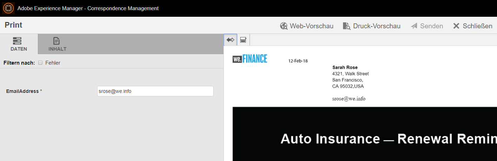

# Anleitung zur Erneuerung der Kfz-Versicherung auf der Referenz-Site von We.Finance{#we-finance-auto-insurance-renewal-reference-site-walkthrough}

## Szenario für We.Finance-Referenz-Site  {#we-finance-reference-site-scenario}

Die Website We.Finance ist eine Website für Finanzdienstleistungen, die Ihnen dabei hilft, die interaktiven Kommunikationsfunktionen von AEM Forms kennenzulernen.

Lesen Sie eine ausführliche exemplarische Vorgehensweise eines We.Finance-Anwendungsbeispiels für Kfz-Versicherungen, in dem erläutert wird, wie AEM Formulare und seine Integration mit Microsoft® Dynamics zur Personalisierung des Kundenerlebnisses in einem Finanzdienstleistungsunternehmen beitragen. Die interaktive Anleitung hat das Ziel, die Implementierung komplexer digitaler Transaktionen und Kundenkommunikationen in einem Finanzunternehmen zu erleichtern.

**Das Ganze beginnt mit dem Benutzerszenario:** 

Sarah Rose ist bereits We.Finance-Kundin und hat eine Kfz-Versicherungspolice erworben. Es ist an dieser Jahreszeit, dass Sarah ihre Versicherungspolice erneuert. Gloria Rios ist ihre Versicherungsvermittlerin. We.Finance sendet eine Erinnerung an Sarah über ihre Richtlinienverlängerung. Sarah folgt den Anweisungen in der E-Mail und schließt den Prozess erfolgreich ab.

## Anleitung zur Anwendung für Kfz-Versicherungen {#auto-insurance-application-walkthrough}

Das Szenario für den Antrag auf Kfz-Versicherung von We.Finance ist eine visuelle Schilderung für den Benutzer und basiert auf zwei Personen:

* Sarah Rose, eine We.Finance-Kundin
* Gloria Rios, Versicherungs-Agent, We.Finance

### Gloria sendet eine Mitteilung zur Erneuerung einer Versicherungspolice von We.Finance {#gloria-sends-an-insurance-policy-renewal-communication-from-we-finance}

Gloria meldet sich bei der AEM-Instanz an, klickt auf **Erneuerung der Kfz-Versicherung** und dann auf **Agent-Benutzeroberfläche öffnen**. Durch das Klicken wird das Versicherungsdokument mit den Vertragsdetails von Sarah Rose vorausgefüllt. Gloria-Klicks **Einsenden** und eine Meldung wird auf dem Bildschirm &quot;Sendung initiiert&quot;und dann in einigen Sekunden &quot;Gesendet erfolgreich gesendet&quot;angezeigt.

Sarah erhält eine E-Mail mit dem Betreff „Erneuerung Ihrer Kfz-Versicherung“.

#### Sehen Sie selbst {#see-it-yourself}

Wechseln Sie zu **Adobe Experience Manager** > **Formulare** > **Formulare und Dokumente** > **We.Finance** > **Kfz-Versicherung**. Wählen Sie die **interaktive Kommunikation** „Erneuerung der Kfz-Versicherung“ und klicken Sie auf **Agent-Benutzeroberfläche öffnen**. Die interaktive Kommunikation wird in der Agent UI geöffnet. Geben Sie eine gültige E-Mail-Adresse ein, damit sie die E-Mail mit dem angehängten Richtliniendokument empfangen können, und klicken Sie auf Senden.

Sie können direkt unter `https://[authorHost]: authorPort]/aem/formdetails.html/content/dam/formsanddocuments/we-finance/autoinsurance/auto-insurance-renewal.` auf die interaktive Kommunikation zur Erneuerung der Kfz-Versicherung zugreifen und sie dort überprüfen.

### Sarah erhält von We.Finance eine Mitteilung zur Erneuerung der Kfz-Versicherung und entscheidet sich für eine Erneuerung. {#sarah-receives-an-insurance-policy-renewal-communication-from-we-finance-and-decides-to-renew}

Sarah erhält eine E-Mail mit einer Anlage von We.Finance, in der Sarah daran erinnert wird, dass ihre Kfz-Versicherungspolice bald abläuft. Der Anhang ist die Druckversion von Sarahs Kfz-Versicherungsbrief.

Sarah klickt auf **Jetzt erneuern** und wird zur Web-Version des Schreibens zu ihrer Kfz-Versicherung weitergeleitet. Zusätzlich zu diesem Brief findet Sarah die Zeit, die ihr für die Richtlinie noch bleibt, bevor sie abläuft. Die Seite bietet Sarah einen grundlegenden Überblick über die Details ihrer Versicherungspolice wie die Nummer der Police, den fälligen Betrag und andere Informationen wie Rabattangebote und Treueprämien. Sarah klickt auf **Jetzt erneuern** am Ende der Police.

#### Funktionsweise {#how-it-works}

Die Web- und Druckausgabe Ihres Schreibens zur Kfz-Versicherung wird mithilfe der Mehrkanalfunktionen der interaktiven Kommunikation erstellt.

Die Schaltfläche Jetzt erneuern in der E-Mail ist mit der Anwendung zur Erneuerung der Kfz-Versicherung verknüpft, bei der es sich um eine interaktive Kommunikation auf einer Veröffentlichungsinstanz handelt.

#### Sehen Sie selbst {#see-it-yourself-1}

Sie müssen eine E-Mail mit einer angehängten PDF erhalten haben. Die PDF-Datei ist eine Druckversion dieses Schreibens zur Kfz-Versicherung. Klicken Sie auf **Jetzt erneuern**, um zur Web-Version der Police zu gelangen. Überprüfen Sie Ihre persönlichen Angaben und Details der Police und klicken Sie auf **Jetzt erneuern**, um zu einer anderen interaktiven Kommunikation zu gelangen.

Die **Jetzt erneuern** -Schaltfläche in der E-Mail leitet Sarah zur Richtlinie im Internet weiter. Sie können folgende URL aufrufen:

`https://[authorServer]:[authorPort]/content/document.html?schema=fdm&documentId=/content/forms/af/we-finance/autoinsurance/auto-insurance-renewal/channels/web.html&customerId=1`

Sie können die detaillierte Zusammenfassung der Erneuerung Ihrer Kfz-Versicherung überprüfen und auf **Jetzt erneuern** unten auf der Seite klicken.

### Sarah wird auf die Zahlungsseite geleitet. {#sarah-reaches-the-payment-page}

We.Finance leitet Sarah zur Zahlungsseite. Sarah vergleicht ihre Police-Nummer und das Ablaufdatum mit ihren Unterlagen. Auf der rechten Seite der Seite prüft Sarah die Zahlungszusammenfassung der Verlängerung mit einem Prämienrabatt von 10 % auf den Gesamtbetrag.

#### Funktionsweise {#how-it-works-1}

Die Schaltfläche „Jetzt erneuern“ leitet Sarah auf die Zahlungsseite. Die Zahlungsseite ist ein adaptives Formular.

#### Sehen Sie selbst {#see-it-yourself-2}

Klicken Sie auf **Jetzt erneuern**, um zur Zahlungsseite zu gelangen. Geben Sie Ihre Kreditkarteninformationen ein und klicken Sie auf **Zahlung ausführen**.

Sie werden zur Zahlungsseite in der Authoring-Instanz geleitet:

`https://[authorServer]:[authorPort]/content/document.html?documentId=/content/forms/af/we-finance/credit-card/ccbillpayment.html&schema=fdm&customerId=1`

### Sarah nimmt die Zahlung vor und schließt den Prozess ab. {#sarah-makes-the-payment-and-completes-the-process}

Sarah gibt ihre Kreditkartendetails ein und klickt auf **Zahlung ausführen**.

#### Funktionsweise {#how-it-works-2}

Wenn Sarah die Kreditkartendetails ausfüllt und auf Senden klickt, wird ihre Kreditkartenzahlung verarbeitet und eine im adaptiven Formular konfigurierte Dankesnachricht wird auf dem Bildschirm angezeigt.

#### Sehen Sie selbst {#see-it-yourself-3}

Sie können die Bestätigungsmeldung anzeigen, nachdem Sie auf „Zahlung ausführen“ geklickt haben

`https://[authorServer]:[authorPort]/content/forms/af/we-finance/credit-card/ccbillpayment/jcr:content/guideContainer.guideThankYouPage.html?owner=admin&status=Submitted`
