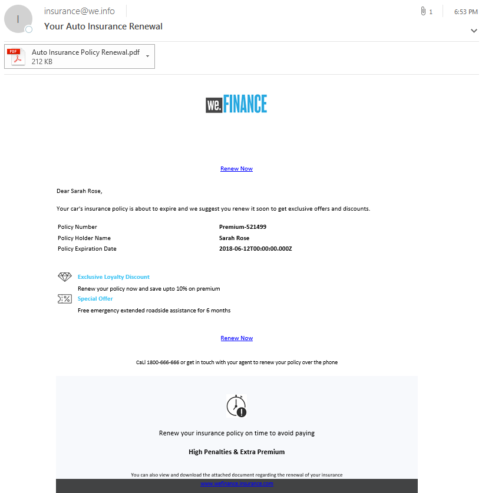

# Schrittweise Anleitung zur We.Finance-Referenz-Site{#we-finance-reference-site-walkthrough}

## Voraussetzungen {#pre-requisites}

Richten Sie die Referenz-Websites ein wie in [Einrichten und Konfigurieren von AEM Forms-Referenz-Websites](../../forms/using/setup-reference-sites.md) beschrieben.

## Szenarien zur We.Finance-Referenz-Site {#we-finance-reference-site-scenarios}

We.Finance ist ein führendes Finanzdienstleistungsunternehmen, das umfassende und personalisierte Finanzlösungen bereitstellt, um die Anforderungen verschiedener Kundenprofile zu erfüllen. Sie bieten Kreditkarten, Haushypotheken und Hausratsversicherungen.

Ihr Ziel ist es, bestehende und potenzielle Kunden auf ihrem bevorzugten Gerät anzusprechen, die Vorteile ihrer Dienstleistungen zu erklären und ihnen dabei zu helfen, sich bei ihren Dienstleistungen anzumelden. Darüber hinaus suchen sie nach weiteren Finanzprodukten wie Add-On-Karten, die für die Kunden interessant sein könnten.

Lesen Sie weiter, um detaillierte Anleitungen zu Anwendungsfällen von We.Finance zu erhalten und zu verstehen, wie AEM Forms Finanzorganisationen dabei hilft, ihre Ziele zu erreichen. Die folgenden exemplarischen Vorgehensweisen werden behandelt:

* [Anleitung für einen Antrag auf Kreditkarten](#credit-card-application-walkthrough)
* [Haushypothekantrag - Anleitung](#home-mortgage-application-walkthrough)
* [Hypothekenantrag - Anleitung mit Microsoft Dynamics](#home-mortgage-application-walkthrough-with-microsoft-dynamics)
* [Antrag auf Hypothek - Anleitung](#home-insurance-application-walkthrough)
* [exemplarische Vorgehensweise für das Vermögensmanagement](#wealthmanagementwalkthrough)
* [Anleitung zur Auto-Versicherung](#autoinsuranceapplicationwalkthrough)

## Anleitung für einen Antrag auf Kreditkarten {#credit-card-application-walkthrough}

Das Szenario für einen Antrag auf eine We.Finance-Kreditkarte umfasst folgende Personen:

* Sarah Rose, einen We.Finance-Kunden
* Gloria Rios, Direktor von Kreditkarten und Hypotheken bei We.Finance

Die folgende Infografik zeigt eine Schritt-für-Schritt-Anleitung für einen Antrag auf eine Kreditkarte.

Schauen wir uns das Referenz-Site-Szenario im Detail an, um zu verstehen, wie die AEM-Formulare We.Finance dabei helfen, ihre Ziele zu erreichen.

### Sarah erhält einen Newsletter von We.Finance und beantragt eine Kreditkarte {#sarah-receives-a-newsletter-from-we-finance-and-applies-for-a-credit-card}

Sarah Rose ist bereits eine We.Finance-Kundin. Sie erhält einen Newsletter von We.Finance über neue Kreditkartenangebote. Sie findet die Angebote spannend und beschließt, eine Kreditkarte zu beantragen. Sie klickt im Newsletter auf die Schaltfläche „Jetzt beantragen“, was sie zum Kreditkartenantrag auf dem Portal We.Finance leitet.

#### Funktionsweise {#how-it-works}

Der an Sarah gesendete Newsletter ist eine benutzerdefinierte Implementierung, die eine E-Mail an die angegebene E-Mail-ID auslöst. Die Schaltfläche „Jetzt beantragen“ in der E-Mail ist mit dem Kreditkartenantrag verknüpft, bei dem es sich um ein adaptives Formular für eine Veröffentlichungsinstanz handelt.

#### Sehen Sie selbst{#see-it-yourself} 

Öffnen Sie die folgende URL in der Veröffentlichungsinstanz, um eine Newsletter-E-Mail auszulösen. Ensure that you replace `[emailID]` with a valid email account to receive the newsletter. Öffnen Sie den Newsletter und klicken Sie auf **[!UICONTROL Jetzt beantragen]**, um zum Kreditkartenantrag zu gelangen.

`https://[publishServer]:[publsihPort]/content/campaigns/we-finance/start.html?app=cc&email=[emailID]&givenName=Sarah&familyName=Rose`

### Sarah findet das Angebot interessant und beschließt, einen Antrag zu stellen{#sarah-finds-the-offer-interesting-and-chooses-to-apply} 

Sarah decides to apply for the credit card and taps **Apply Now** button on the email. Sarah wird zum Kreditkartenantrag auf dem We.Finance-Portal geleitet.  Das Antragsformular besteht aus verschiedenen Abschnitten, wie beispielsweise dem Kartenlayout.

Sarah wählt eine Kreditkarte aus den verfügbaren Optionen aus und klickt auf **[!UICONTROL Weiter]**.

Auf der Seite „Persönliche Daten“ erhält Sarah, da sie ihre Sozialversicherungsnummer angibt, eine Aufforderung, sich mit ihren Zugangsdaten anzumelden.

Sarah ist bereits eine We.Finance-Kundin. Sie meldet sich mit ihren We.Finance-Kontoanmeldeinformationen an und ihre persönlichen Daten werden im Formular automatisch ausgefüllt. Sarah füllt das Antragsformular weiter aus, und dann erscheint eine Erinnerung für ein Meeting, an dem sie teilnehmen muss. She clicks **[!UICONTROL Save my progress]** on the application form. Es speichert alle Informationen, die Sarah bisher eingegeben hat, und es wird ein Dialogfeld angezeigt, in dem Sie bestätigen kann, ob sie eine E-Mail mit einem Link zu ihrem Entwurf anfordern möchte, den sie später ausfüllen möchte.

Sarah klickt auf **[!UICONTROL E-Mail senden]**. Sie erhält eine E-Mail mit einem Link, um ihren Kreditkartenantrag fortzusetzen.

**Sarah greift auf den Kreditkartenantrag von ihrem Mobilgerät zu**

Wenn Sarah von ihrem Mobilgerät aus auf den Kreditkartenantrag zugreift, wird der interaktive Antrag in einer für mobile Geräte optimierten Ansicht geöffnet. In dieser Ansicht wird das Antragsformular als ein Abschnitt wiedergegeben. Es ermöglicht Sarah, Informationen progressiv zu sehen und zu liefern, während sie durch den Antrag navigiert.

**Funktionsweise**

Über die Schaltfläche **Jetzt beantragen** wird Sarah zum Kreditkartenantrag geleitet. The application is an adaptive form, which you can review in the authoring instances at `https://[host]:'port'/editor.html/content/forms/af/we-finance/cc-app.html`.

Einige der wichtigsten Funktionen, die Sie im adaptiven Formular überprüfen können, sind:

* Es basiert auf einem XSD-Schema.
* Es wird mit dem We Finance-Design A für Stile und der We.Finance-Vorlage für Layout erstellt. Außerdem verwendet es im Formularkopfzeilenlayout für die mobile Navigation Layout ohne Bereichstitel. Es wird ein progressives Layout für Mobilgeräte angezeigt, wenn es von einem Mobilgerät aus geöffnet wird. Sie können die Vorlage unter `https://[host]:'port'/libs/wcm/core/content/sites/templates.html/conf/we-finance` und das Design unter `https://[host]:'port'/editor.html/content/dam/formsanddocuments-themes/we-finance/we-finance-theme-a/jcr:content`.
* Es enthält adaptive Formularregeln zum Aufrufen von Formulardatenmodelldiensten, um Benutzerdetails des angemeldeten Benutzers vorab zu befüllen. Es ruft auch Dienste auf, um Informationen anhand der im Formular angegebenen Sozialversicherungsnummer oder E-Mail-Adresse vorab zu befüllen. You can review the Form Data Models and their services at `https://[host]:'port'/aem/forms.html/content/dam/formsanddocuments-fdm`.
* Es verwendet verschiedene adaptive Formularkomponenten, um Eingaben zu erfassen und sich an Benutzerreaktionen anzupassen. Es verwendet auch Komponenten wie E-Mail, die HTML5-Eingabetypen unterstützen.
* Es verwendet die Signaturschrittkomponente, um das ausgefüllte Formular anzuzeigen, und ermöglicht die elektronische Unterschrift auf dem Formular.
* Die Schaltfläche „Fortschritt speichern“ generiert eine eindeutige ID für den Benutzer und speichert die teilweise ausgefüllte Anwendung als Entwurf in einem Knoten im AEM-Repository. Außerdem wird ein Dialogfeld mit einer Bitte um Bestätigung angezeigt, damit eine E-Mail mit einer Verknüpfung zu dem Knoten gesendet werden kann, der den Antragsentwurf enthält. Über die im Bestätigungsdialogfeld angezeigte Schaltfläche E-Mail senden wird die Versendung einer E-Mail mit einer Verknüpfung zu dem Knoten ausgelöst, der den Entwurf enthält.
* Es verwendet die Aktion „AEM-Workflow aufrufen“, um den Kreditkarten-Genehmigungs-Workflow auszulösen. You can review the workflow used in this form at `https://[host]:'port'/editor.html/conf/global/settings/workflow/models/we-finance-credit-card-workflow.html`

Es wird empfohlen, das Formular zu lesen, um das Schema, die Komponenten, die Regeln, die Formulardatenmodelle, den Formularworkflow und die Aktion zum Erstellen des Formulars zu verstehen.

In der folgenden Dokumentation finden Sie weitere Informationen zu Funktionen, die im adaptiven Formular des Kreditkartenantrags verwendet werden:

* [Einführung in das Authoring adaptiver Formulare](../../forms/using/introduction-forms-authoring.md)
* [Adaptive Formulare mithilfe des XML-Schemas erstellen](../../forms/using/adaptive-form-xml-schema-form-model.md)
* [Regeleditor](../../forms/using/rule-editor.md)
* [Designs](../../forms/using/themes.md)
* [Datenintegration](../../forms/using/data-integration.md)
* [Verwenden von Adobe Sign in adaptiven Formularen](../../forms/using/working-with-adobe-sign.md) 
* [Formularzentrierte Workflows in OSGi](../../forms/using/aem-forms-workflow.md)

**Sehen Sie selbst** 

Wenn Sie als Sarah Rose angemeldet sind, klicken Sie im Kreditkartenantrag auf **Jetzt beantragen**. Vervollständigen Sie Angaben, sehen Sie sich verschiedene adaptive Formularkomponenten an, und klicken Sie auf **Fortschritt speichern**, um eine weitere E-Mail mit der Schaltfläche **Fortsetzen** zu enthalten, die eine Verknüpfung mit dem Antragsentwurf enthält. Stellen Sie sicher, dass Sie Ihre E-Mail-ID des Antragsformulars angeben, um E-Mails zu empfangen.

Überprüfen Sie das We.Finance-Design, das verfügbar ist:

`https://<host>:<AuthorPort>/editor.html/content/dam/formsanddocuments-themes/we-Finance/we-Finance-Theme-A/jcr:content`

Sie können die We.Finance-Vorlage hier ansehen:

`https://<host>:<AuthorPort>/editor.html/conf/we-finance/settings/wcm/templates/we-finance-template/structure.html`

### Sarah setzt den Vorgang fort und sendet den Antrag{#sarah-resumes-and-submits-the-application} 

Sarah kommt später zurück und findet eine E-Mail von We.Finance. Sie klickt auf die Schaltfläche **Fortsetzen** in der E-Mail, die sie zu ihrem Kreditkartenantrag führt. Die Informationen, die Sie zuvor eingetragen hat, sind bereits vorausgefüllt. Sie füllt das verbleibende Antragsformular aus, unterschreibt den Antrag und reicht ihn ein.

Alternativ kann sie auf der Homepage von **Meine Formulare** unter We.Finance auf ihren Entwurf zugreifen.

#### Funktionsweise {#how-it-works-1}

Mithilfe der in der E-Mail angezeigten Schaltfläche „Fortsetzen“ gelangt Sarah zu dem Knoten, der ihren Antragsentwurf enthält.

#### Sehen Sie selbst.  {#see-it-yourself-1}

Sie müssen eine E-Mail mit einem Link zum Antragsentwurf in Ihrer E-Mail-ID erhalten haben, die Sie beim Ausfüllen des Antragsformulars angegeben haben. Füllen Sie die übrigen Abschnitte des Antrags aus und senden Sie ihn. 

### We.Finance erhält und genehmigt den Antrag {#approving-the-application}

We.Finance erhält den Kreditkartenantrag von Sarah. Eine Aufgabe wird Gloria Rios zugewiesen. Sie überprüft die Aufgabe in ihrem AEM-Posteingang und genehmigt sie.

#### Funktionsweise {#how-it-works-2}

Wenn Sarah den Kreditkartenantrag ausfüllt und abschickt, wird ein Formularworkflow ausgelöst und eine Aufgabe in Glorias AEM-Posteingang erstellt.

AEM Forms on OSGi bietet formularbasierte Workflows, mit denen Sie adaptive formularbasierte Workflows erstellen können. Diese Workflows können für Überprüfungen und Genehmigungen, Geschäftsprozessabläufe, zum Starten von Dokumentdiensten, zur Integration mit Adobe Sign-Signatur-Workflows usw. verwendet werden. For more information, see [Forms-centric workflow on OSGi](../../forms/using/aem-forms-workflow.md).

Die folgende Abbildung zeigt den AEM-Workflow, der den Kreditkartenantrag verarbeitet und eine PDF-Ausgabe des Antrags generiert. 

#### Sehen Sie selbst{#see-it-yourself-2} 

Sie können auf den AEM-Posteingang für die Website we.finance unter https://&lt;*Hostname*>:&lt;*PublishPort*>/content/we-finance/global/en.html zugreifen. Tippen Sie auf der Seite auf **Anmelden**, aktivieren Sie das Kontrollkästchen **Als repräsentativ** anmelden, melden Sie sich beim AEM-Posteingang mit `grios/password` dem Benutzernamen/Kennwort für Gloria Rios an und genehmigen Sie den Kreditkartenantrag. For information about using AEM Inbox for forms-centric workflow tasks, see [Manage Forms applications and tasks in AEM Inbox](../../forms/using/manage-applications-inbox.md).

Wenn Sie dden Antrag genehmigen, erhält Sarah eine E-Mail mit einem Wilkommens-Kit.

### Sarah erhält das Willkommenspaket und beantragt eine Zusatzkarte {#sarah-receives-the-welcome-kit-and-applies-for-an-add-on-card}

Während der von Sarah gestellte Kreditkartenantrag genehmigt wird, erhält sie eine E-Mail mit einer Verknüpfung zum Begrüßungs-Kit. Sie öffnet das Begrüßungs-Kit, das Angaben zu ihrem Kreditkartekonto enthält. Das Begrüßungs-Kit enthält auch für Sarah personalisierte Werbeanzeigen. Wenn Alison nach unten blättert, sieht sie, dass das Begrüßungs-Kit ein eingebettetes Formular für die Beantragung einer Zusatzkarte enthält. Sarah füllt schnell die erforderlichen Details aus dem Begrüßungs-Kit aus und beantragt die Zusatzkarte. Ein Bestätigungsdialogfeld für den Zusatzkartenantrag wird angezeigt. 

Das Begrüßungs-Kit ist für Sarah personalisiert und zeigt Informationen, die für sie relevant sind. Es bietet die Möglichkeit, eine PDF-Version des Begrüßungs-Kits herunterzuladen.

Das Begrüßungspaket enthält ein weiteres Antragsformular, das Sarah ausfüllen und einreichen kann, um eine Zusatzkarte aus dem Willkommenspaket zu beantragen, ohne das We.Finance-Portal zu besuchen.

#### Funktionsweise {#how-it-works-3}

The welcome kit is an interactive communication included in the `cq-we-finance-content-pkg.zip` package. Die interaktiven Karten in der Desktopversion, welche die Vorteile der Kreditkarte im Begrüßungs-Kit zeigt, haben ein benutzerdefiniertes Layout, das mithilfe des Standardkartenlayouts eines Dokumentfragments erstellt wird. 

Der Zusatzkartenantrag ist ein eingebettetes adaptives Formular in der interaktiven Kommunikation des Begrüßungs-Kits.

#### Sehen Sie selbst{#see-it-yourself-3} 

Klicken Sie in der E-Mail, die Sie im vorherigen Schritt erhalten haben, auf die Schaltfläche Fortsetzen. Dadurch wird der Antragsentwurf geöffnet. Tragen Sie alle Angaben ein und senden Sie den Antrag. Dann erhalten Sie ein Begrüßungs-Kit. Prüfen Sie das Begrüßungs-Kit. 

Sie können das Willkommenspaket auch unter der folgenden URL anzeigen:

https://&lt;*Host*>: &lt;*port*>/content/aemforms-refsite/doclink.html?Dokument=/content/forms/af/we-finance/credit-card/creditcardwelcomekit&amp;customerId=197&amp;Kanal=web

Sie können auf sie in den Autor- und Veröffentlichungsinstanzen zugreifen.

### Sarah erhält einen Kreditkartenauszug{#sarah-receives-a-credit-card-statement} 

Als Sarah anfängt, die Kreditkarte zu benutzen, erhält sie eine weitere E-Mail von We.Finance, die ihre Kreditkartenabrechnung enthält. Die folgenden Abbildungen zeigen die E-Mail mit einer Verknüpfung zum Kreditkartenauszug auf dem Mobilgerät. 

Sarah klickt in der E-Mail auf „Auszug anzeigen“, um den Kreditkartenauszug anzuzeigen. Der Auszug ist eine interaktive Kommunikation. Es enthält sowohl Web- als auch Print-Versionen (PDF). Die Anweisung wird in das Forms-Datenmodell integriert, um kundenspezifische Daten aus der Datenbank abzurufen. Der interaktive Auszug besteht aus verschiedenen Elementen:

* Auszugsübersicht
* Ausführlicher Ausgabenbericht 
* Grafische Ausgabenanalyse 
* Option für die Tätigung der Zahlung eines fälligen Betrags innerhalb des Auszugs 
* Zahlungsbeleg herunterladen 

Sarah muss nicht zum Portal gehen oder in ihren E-Mails nach PDF-Version des Kreditkartenauszugs für die Offline-Archivierung suchen. Sie klickt einfach auf die Download-Anweisung, um eine PDF-Version des Auszugs herunterzuladen.

Die ausführliche Erklärung ist in einer reagierenden Tabelle aufgeführt. Der Auszug bietet auch die Möglichkeit, einen Teil oder den gesamten fälligen Betrag innerhalb des Auszugs zu zahlen.

Sarah plant die Zahlung innerhalb des Auszugs. Sarah kann auch die Flexi-Pay-Option verwenden, um die Zahlung in gleiche Teile zu unterteilen.

#### Funktionsweise {#how-it-works-4}

Der Kreditkartenauszug ist eine interaktive Kommunikation. Die detaillierte Ausgabentabelle im Auszug ist reagibel. Die Grafik zur Analyse der Kosten ist eine Diagrammkomponente, liest die Ausgabentabelle und generiert das Kreisdiagramm.

#### Sehen Sie selbst{#see-it-yourself-4} 

Sie können den interaktiven Kreditkartenauszug unter folgender URL einsehen: 

https://&lt;*Hostname*>:&lt;*Anschluss*>/content/aemforms-refsite/doclink.html?Dokument=/content/forms/af/we-finance/credit-card/credit-card-statement&amp;customerId=197&amp;Kanal=web

Sie können auf sie in den Autor- und Veröffentlichungsinstanzen zugreifen.

Der Kreditkartenauszug zeigt Promo-Angebote gegen Ende des Auszugs an. Sie können Adobe-Zielgruppen in die interaktive AEM Forms-Kommunikation integrieren, um zielgerichtete Angebot für Werbezwecke basierend auf bestimmten Kundensegmenten bereitzustellen. Informationen zum Konfigurieren Ihrer interaktiven Kommunikation für die Verwendung der Adobe-Zielgruppe für benutzerdefinierte und zielgerichtete Angebot finden Sie unter [Erstellen zielgerichteter Erlebnisse](/help/forms/using/experience-targeting-forms.md).

### We.Finance analysiert die Leistung des Kreditkartenantrags {#we-finance-analyzes-the-performance-of-the-credit-card-application}

We.Finance überprüft von Zeit zu Zeit die Leistung seiner Kreditkarteanwendung, um festzustellen, ob Probleme auftreten, mit denen Kunden konfrontiert werden können. Das Unternehmen verwendet diese Analyse, um fundierte Entscheidungen über erforderliche Änderungen an der Kreditkarteanwendung zu treffen. Auf diese Weise wird die Benutzerfreundlichkeit verbessert und die Abbruchrate der Formulare reduziert, wodurch die Konversionsrate erhöht wird. Zur Analyse nutzt das Unternehmen die Integration von AEM Forms mit Adobe Analytics. Die folgende Abbildung zeigt das Analyse-Dashboard des Unternehmens.

Weitere Informationen zur Interpretation des Analyse-Dashboards finden Sie unter [Anzeigen und Verstehen von AEM Forms-Analyseberichten](../../forms/using/view-understand-aem-forms-analytics-reports.md).

#### Funktionsweise {#how-it-works-5}

Die Leistungsmetriken für das Kreditkartenantragsformular werden mit Adobe Analytics verfolgt. Weitere Informationen zur Konfiguration von Adobe Analytics und zum Anzeigen der Berichte finden Sie unter [Konfigurieren der Analyse für Formulare und Dokumente](../../forms/using/configure-analytics-forms-documents.md).

#### Sehen Sie selbst{#see-it-yourself-br} 

Damit Sie den Analysebericht anzeigen und prüfen können, stellen wir Seed-Daten für die Kreditkarteanwendung in der Referenz-Website bereit. Bevor Sie Seed-Daten verwenden, lesen Sie[ Konfigurieren von Analytics](../../forms/using/setup-reference-sites.md#configureanalytics). Führen Sie folgende Schritte im Autorenmodus aus, um den Bericht mit den Seed-Daten anzuzeigen: 

1. Go to **Forms &amp; Documents** UI at https://&lt;*hostname*>:&lt;*AuthorPort*>/aem/forms.html/content/dam/formsanddocuments.

1. Klicken Sie auf den Ordner **We.Finance**, um ihn zu öffnen.
1. Wählen Sie das adaptive Formular **Kreditkartenantrag** und klicken Sie dann in der Symbolleiste auf Analyse **[!UICONTROL aktivieren]**.

1. Wählen Sie das adaptive Formular erneut aus und klicken Sie in der Symbolleiste auf **[!UICONTROL Analytics-Bericht]** , um den Bericht zu erstellen. Zunächst wird ein leerer Bericht angezeigt.

So erstellen Sie einen Analysebericht mit Seed-Daten:

1. Im Adressbrowser von CRXDE Lite, geben Sie Folgendes ein: `/apps/we-finance/demo-artifacts/analyticsTestData/Credit card Analytics Test Data`
1. Die Testdaten werden in der linken Seitenstruktur ausgewählt.
1. Doppelklicken Sie auf die ausgewählte Datei, um ihren Inhalt im rechten Seitenbereich zu öffnen.
1. Kopieren Sie den gesamten Inhalt der Seed-Datendatei.
1. In CRXDE, navigate to: `/content/dam/formsanddocuments/we-finance/cc-app/jcr:content/analyticsdatanode/lastsevendays`
1. In the **[!UICONTROL analyticsdata]** field under **[!UICONTROL Properties]**, paste the copied content of the seed data file.

1. Wählen Sie das adaptive Formular **Kreditkartenantrag** und klicken Sie in der Symbolleiste auf **[!UICONTROL Analysebericht]** , um den Bericht mit Seed-Daten zu erstellen.

**A/B-Tests der Kreditkarteanwendung** 

Zusätzlich zur Analyse und kontinuierlichen Verbesserung der Kreditkartenanwendung nutzt We.Finance die Integration von AEM Forms mit Target, um A/B-Tests zu erstellen. Dadurch ist es möglich, auf verschiedene Erlebnisse im Zusammenhang mit der Bearbeitung des Kreditkartenantragsformulars zu reagieren und Erlebnisse zu bestimmen, die zu einer besseren Konversionsrate in Bezug auf das Ausfüllen und Übermitten von Formularen führen. 

To configure Target in AEM Forms server, see [Set up and integrate Target in AEM Forms](../../forms/using/ab-testing-adaptive-forms.md#set%20up%20and%20integrate%20target%20in%20aem%20forms).

Führen Sie folgende Schritte aus, um die Erstellung eines A/B-Tests für das We.Finance-Kreditkartenantragsformular zu erleben: 

1. Go to **Forms &amp; Documents** at https://&lt;*hostname*>:&lt;*AuthorPort*>/aem/forms.html/content/dam/formsanddocuments.

1. Klicken Sie auf den Ordner **We.Finance**, um ihn zu öffnen.
1. Wählen Sie das adaptive Formular **Kreditkartenantrag**.
1. Klicken Sie in der Symbolleiste auf **Mehr** und wählen Sie **A/B-Tests konfigurieren**. Die Seite „A/B-Tests konfigurieren“ wird geöffnet.

1. Geben Sie eine **Aktivitätsbezeichnung** an.
1. Wählen Sie in der Dropdown-Liste „Zielgruppe“ die Zielgruppe, deren Reaktionen auf verschiedene Varianten des Formulars Sie testen möchten. Dies könnten beispielsweise **Besucher, die Chrome verwenden** sein.
1. Geben Sie in den Feldern für **Erlebnisverteilung** für die Erlebnisvarianten A und B deren Verteilung auf die Gesamtzielgruppe in Prozent an. Wenn Sie beispielsweise „40“ und „60“ für Erlebnis A bzw. B angeben, wird Erlebnis A für 40 % der Zielgruppe und Erlebnis B für die verbleibenden 60 % angezeigt.
1. Klicken Sie auf **Konfigurieren**. Es wird ein Dialogfeld angezeigt, in dem die Erstellung des A/B-Tests bestätigt wird.
1. Klicken Sie auf **Fertig**.
1. Select the **Application for Credit Card** form and click **Edit**. Es bietet die Möglichkeit, eines der Erlebnisse zu öffnen. Klicken Sie auf **Erlebnis B**. Das Formular wird im Bearbeitungsmodus geöffnet. 

1. Ändern Sie beliebig das Formular, um ein anderes Erlebnis als das Standarderlebnis A zu erstellen. 
1. Wechseln Sie zur Benutzeroberfläche für Formulare und Dokumente, wählen Sie das Formular aus, klicken Sie auf **Mehr** und wählen Sie **A/B-Tests starten**.
1. Öffnen Sie das Formular nun mehrmals im Chrome-Browser unter Verwendung der folgenden URL:

   `https://[hostname]:[port]/content/dam/formsanddocuments/we-finance/cc-app/jcr:content?wcmmode=disabled`

   >[!NOTE] Entfernen Sie das Cookie mit dem Namen **mbox** aus der Cookiepersistenz des Browsers, bevor Sie das Formular das nächste Mal öffnen. Sie sehen dann das Erlebnis A und B des Formulars in zufälliger Ordnung.

1. Wählen Sie das Formular aus, klicken Sie auf **Mehr**, und klicken Sie dann auf **A/B-Testbericht**. Sie werden nicht viele Daten im Bericht finden, da Sie gerade erst mit dem Testen begonnen haben. Jetzt werden wir einige Seed-Daten bereitstellen, um zu sehen, wie der A/B-Testbericht aussehen wird. 
1. Öffnen Sie CRXDE Lite und erstellen Sie eine Sicherungskopie der folgenden Datei: /libs/fd/fmaddon/gui/components/admin/targetreport/clientlibs/targetreport/js/targetreport.js
1. Ersetzen Sie die Definition der Funktion `onReportLoadSuccess` in der oben genannten Datei durch die Funktionsdefinition in der folgenden Datei: /apps/we-finance/demo-artifacts/targetreport.js

   Hinweis: Diese Änderungen dienen nur dem Zweck der Demo. Stellen Sie unbedingt den Dateiinhalt wieder her, nachdem Sie dieses Verfahren abgeschlossen haben. 

1. Aktualisieren Sie den von Ihnen erstellten Bericht. Dann sehen Sie Folgendes. Prüfen Sie das Berichts-Dashboard. 

Um den A/B-Test zu beenden, klicken Sie im Berichts-Dashboard auf die Schaltfläche **A/B-Test beenden**. An diesem Punkt Sie aufgefordert, ein Erlebnis anzugeben. Wählen Sie einen Gewinner und bestätigen Sie, dass Sie den A/B-Test beenden möchten.

Wenn Sie Erlebnis A als Gewinner auswählen, wird der A/B-Test beendet, und in Zukunft wird nur Erlebnis A für sämtliche Zielgruppen (einschließlich Chrome-Benutzer) angezeigt.

## Haushypothekantrag - Anleitung {#home-mortgage-application-walkthrough}

Das Szenario der Hypothek von We.Finance umfasst folgende Personen:

* Sarah Rose, einen We.Finance-Kunden
* Gloria Rios, Direktor von Kreditkarten und Hypotheken bei We.Finance
* John Doe, Kundenbetreuer, We.Finance

Die folgende Infografik zeigt eine Schritt-für-Schritt-Anleitung für einen Antrag auf eine Hypothek.

Schauen wir uns nun an, wie die Schritte des Referenz-Website-Szenarios im Einzelnen aussehen, um Aufschluss zu erhalten, wie AEM Forms dem Unternehmen We.Finance hilft, das Ziel zu erreichen. 

### Sarah besucht die Website von We.Finance und beantragt eine Hypothek {#sarah-visits-we-finance-website-and-applies-for-home-mortgage}

Sarah Rose plant, ein Haus zu kaufen und nach einem Hypotheksplan zu suchen. Sie ist eine We.Finance-Kundin und besucht daher das We.Finance-Portal, um Hypothekenangebote zu erkunden. Sie geht in den Bereich „Kredite“ und findet einen Hypothekenrechner auf dem Portal. Sie füllt die Details aus und klickt auf „Meine Hypothek berechnen“, die einen Hypothekenplan zurückgibt.

 

Hypothekenrechner

Ergebnis des Hypothekenrechners

#### Funktionsweise {#how-it-works-6}

Der Hypothekenrechner auf der Seite „Darlehen“ ist ein eingebettetes adaptives Formular in der AEM-Seite. You can review the Loans page in edit mode at `https://[authorHost]:[authorPort]/editor.html/content/we-finance/global/en/loan-landing-page.html`.

Der eingebettete Hypothekenrechner, bei dem es sich um ein adaptives Formular handelt, verwendet Regeln zur Berechnung des EMI-Betrags basierend auf den Kreditdetails, die in den Rechnerfeldern angegeben sind. Sie können das adaptive Formular unter `https://[authorHost]:[authorPort]/editor.html/content/forms/af/we-finance/hm-calc.html`.

#### Sehen Sie selbst{#see-it-yourself-5} 

Go to We.Finance portal at `https://<publishHost>:<publishPort>/content/we-finance/global/en.html` and click **[!UICONTROL Loans]**. Geben Sie Details in den Hypothekenrechner ein und sehen Sie sich die Ergebnisse an.

### Sarah findet das Angebot interessant und beschließt, einen Antrag zu stellen  {#sarah-finds-the-offer-interesting-and-chooses-to-apply-1}

Sarah chooses to apply for home mortgage and clicks **[!UICONTROL Apply Now]** on home mortgage calculator results. Es wird der Antrag für Hypotheken geöffnet.

Wenn Sarah von ihrem Mobilgerät aus auf den Antrag für die Hypothek zugreift, wird das Antragsformular in einer Ansicht geöffnet, die für die Anzeige auf einem mobilen Gerät optimiert ist. In dieser Ansicht rendert das Antragsformular jeweils einen Abschnitt. Es ermöglicht Sarah, Informationen progressiv zu sehen und zu liefern, während sie durch das Antragsformular navigiert.

Die folgenden Bilder zeigen den Arbeitsablauf, während Sarah auf ihrem Mobilgerät durch die Hypothekenanwendung navigiert.

Wenn Sarah von ihrem Desktop aus auf **Jetzt beantragen** klickt, öffnet sich das Antragsformular für Hypotheken wie folgt. Die Informationen, die Sarah im Hypothekenrechner zur Verfügung stellt, sind im Antragsformular vorgefüllt. Sarah füllt die restlichen Details aus und klickt auf **Weiter**.

Basierend auf den Informationen, die Sarah in den Hypothekenrechner eingegeben hat, werden ihr einige Hypothekenpläne vorgelegt. Sie wählt den Plan, der ihren Anforderungen entspricht, und füllt weiterhin den Antrag aus. Sie unterschreibt und reicht den Antrag ein.

Der eingereichte Antrag geht an We.Finance zur Genehmigung.

#### Funktionsweise {#how-it-works-7}

Die Schaltfläche **Jetzt beantragen** leitet Sarah zum Hypothekenantrag weiter. The application is an adaptive form, which you can review in the authoring instances at `https://[host]:'port'/editor.html/content/forms/af/we-finance/hm-app.html`.

Einige der wichtigsten Funktionen, die Sie im adaptiven Formular überprüfen können, sind:

* Es basiert auf einem XSD-Schema, `homeMortgageApplication.xsd`.
* Es wird mit dem We Finance-Design B für Stile und der We.Finance-Vorlage für Layout erstellt. Außerdem verwendet es im Formularkopfzeilenlayout für die mobile Navigation Layout ohne Bereichstitel. Es wird ein progressives Layout für Mobilgeräte angezeigt, wenn es von einem Mobilgerät aus geöffnet wird. Sie können die Vorlage und das im adaptiven Formular verwendete Design an den folgenden Stellen in Ihrer AEM-Autoreninstanz anzeigen:

   * `https://[host]:'port'/libs/wcm/core/content/sites/templates.html/conf/we-finance`
   * `https://[host]:'port'/editor.html/content/dam/formsanddocuments-themes/we-finance/we-finance-theme-b/jcr:content`

* Die erste Registerkarte „Erste Schritte“ im Antrag ist ein dynamischer Hypothekenrechner, der Optionen basierend auf der Benutzerauswahl anzeigt. Zum Beispiel sind die Felder und Werte für Kauf- und Refinanzierungsoptionen unterschiedlich. Diese Funktionalität wird mithilfe von Regeln zum Ein- bzw. Ausblenden erreicht. Wenn Sie auf „Weiter“ klicken und die Registerkarte „Pläne“ initialisiert wird, ruft sie außerdem einen Web-Dienst auf, der in einem Formulardatenmodell zum Abrufen und Anzeigen von Hypothekenplänen konfiguriert ist. You can review the Form Data Models and configured services at `https://[host]:'port'/aem/forms.html/content/dam/formsanddocuments-fdm`.
* Es verwendet verschiedene adaptive Formularkomponenten, um Eingaben zu erfassen und sich an Benutzerreaktionen anzupassen. Es verwendet auch Komponenten wie E-Mail, die HTML5-Eingabetypen unterstützen.
* Es verwendet die Signaturschrittkomponente, um das ausgefüllte Formular anzuzeigen, und ermöglicht die elektronische Unterschrift auf dem Formular.
* Es verwendet die Aktion „AEM Workflow senden“, um den We.Finance AEM-Workflow zur Hypothek auszulösen. You can review the workflow used in this form at `https://[host]:'port'/editor.html/conf/global/settings/workflow/models/we-finance-home-mortgage-workflow.html`

Es wird empfohlen, das Formular zu lesen, um das Schema, die Komponenten, die Regeln, die Formulardatenmodelle, den Formularworkflow und die Aktion zum Erstellen des Formulars zu verstehen.

In der folgenden Dokumentation finden Sie weitere Informationen zu Funktionen, die im adaptiven Formular für Hypothekendarlehen verwendet werden:

* [Einführung in das Authoring adaptiver Formulare](../../forms/using/introduction-forms-authoring.md)
* [Adaptive Formulare mithilfe des XML-Schemas erstellen](../../forms/using/adaptive-form-xml-schema-form-model.md)
* [Regeleditor](../../forms/using/rule-editor.md)
* [Designs](../../forms/using/themes.md)
* [Datenintegration](../../forms/using/data-integration.md)
* [Verwenden von Adobe Sign in adaptiven Formularen](../../forms/using/working-with-adobe-sign.md) 
* [Formularzentrierte Workflows in OSGi](../../forms/using/aem-forms-workflow.md)

#### Sehen Sie selbst {#see-it-yourself-6}

Go to `https://'[server]:[port]'/content/we-finance/global/en/all-forms.html` and click the **Apply now** button on Home Mortgage Application. Füllen Sie die Details auf der Registerkarte „Erste Schritte“ aus, probieren Sie verschiedene Optionen aus und senden Sie den Antrag.

Stellen Sie sicher, dass Sie im Antrag eine gültige E-Mail-ID angeben, um eine Bestätigungsnachricht in Ihrem Posteingang zu empfangen.

### We.Finance erhält den Antrag {#approving_the_application-1}

We.Finance empfängt den von Sarah gesendeten Hypothekenantrag. Die Aufgabe, den Antrag zu genehmigen oder abzulehnen, wird Gloria Rios zugewiesen. Sie überprüft den Antrag und stellt fest, dass Sarahs Regierungs-ID fehlt.

Gloria öffnet die Aufgabe und klickt auf „Weitere Informationen werden benötigt“ und gibt einen Kommentar zur fehlenden ID ab.

Die Aufgabe wird nun John Doe, einem Kundenbetreuer bei We.Finance, übertragen. Er öffnet die Aufgabe und überprüft Glorias Kommentar. Er kontaktiert Sarah und bittet sie, eine Kopie ihres Ausweises zu schicken. Nachdem er eine Kopie von Sarahs ID erhalten hat, hängt er sie an die Aufgabe an und reicht den Antrag zur Neubewertung ein.

Die Aufgabe wird Gloria wieder zugewiesen. Sie überprüft die beigefügte ID und genehmigt den Antrag.

#### Funktionsweise {#how-it-works-8}

Wenn Sarah den Hypothekenantrag ausfüllt und einreicht, wird ein Formular-Workflow ausgelöst und eine Aufgabe in Glorias AEM-Posteingang erstellt. Während Gloria den Antrag prüft und weitere Informationen anfordert, wird die Aufgabe John Doe zugewiesen. Wenn John Doe die ID anfügt und den Antrag erneut absendet, wird sie Gloria zugewiesen. Dies ist in dem mit dem Hypothekenantrag verknüpften AEM-Workflow definiert.

AEM Forms on OSGi bietet formularbasierte Workflows, mit denen Sie adaptive formularbasierte Workflows erstellen können. Diese Workflows können für Überprüfungen und Genehmigungen, Geschäftsprozessabläufe, zum Starten von Dokumentdiensten, zur Integration mit Adobe Sign-Signatur-Workflows usw. verwendet werden. For more information, see [Forms-centric workflow on OSGi](../../forms/using/aem-forms-workflow.md).

Das folgende Bild zeigt den AEM-Workflow, der mit dem Hypothekenantrag verknüpft ist.

#### Sehen Sie selbst{#see-it-yourself-7} 

You can access the AEM inbox at `https://<hostname>:<AuthorPort>/content/we-finance/global/en/login.html?resource=/aem/inbox.html`. Log in to the AEM inbox using `grios/password` as the username/password for Gloria Rios and `jdoe/jdoe` for John Doe, and explore the home mortgage application workflow.

For information about using AEM Inbox for forms-centric workflow tasks, see [Manage Forms applications and tasks in AEM Inbox](../../forms/using/manage-applications-inbox.md).

### Sarah erhält das Begrüßungs-Kit {#sarah-receives-the-welcome-kit}

Während der von Sarah gestellte Hypothekenantrag genehmigt wird, erhält sie eine E-Mail mit einer Verknüpfung zum Begrüßungs-Kit. Sie öffnet das Willkommenspaket, das ein Karussell mit für Sarah personalisierten Werbeangeboten enthält.

Das Begrüßungs-Kit ist für Sarah personalisiert und zeigt Informationen, die für sie relevant sind. Es bietet die Möglichkeit, eine PDF-Version des Begrüßungs-Kits herunterzuladen. Mit der Pfeiltaste am unteren Rand kann Sarah nach unten blättern und durch andere Abschnitte des Begrüßungs-Kits navigieren. 

#### Funktionsweise {#how-it-works-9}

The welcome kit is an interactive communication included in the `cq-we-finance-content-pkg.zip` package. Die Werbeangebote im Begrüßungs-Kit werden vom Adobe Target-Server bereitgestellt. Die angepassten Angebote sind auf bestimmte Kundensegmente ausgerichtet. Das Begrüßungs-Kit ruft von einem vorkonfigurierten Adobe Target-Server Angebote für ein Zielgruppensegment mit weiblichen Kunden ab.

Die interaktiven Karten in der Desktopversion des Begrüßgungs-Kits haben ein benutzerdefiniertes Layout, das mithilfe des Standardkartenlayouts eines Dokumentfragments erstellt wird.

#### Sehen Sie selbst.  {#see-it-yourself-8}

Wenn Sie beim Ausfüllen des Hypothekenantrags Ihre E-Mail-ID angegeben haben, sollten Sie eine E-Mail mit einem Link zum Willkommenspaket erhalten haben. Überprüfen Sie Ihren Posteingang und schauen Sie sich das Willkommenspaket an.

Sie können es in der AEM-Veröffentlichungsinstanz unter der folgenden URL ansehen:

`https://[host]:'port'/content/forms/af/we-finance/mortgage-loan-welcome-kit.html`

### Sarah erhält einen Kontoauszug {#sarah-receives-an-account-statement}

Als Sarah das Darlehen in Anspruch nimmt und mit der Bezahlung der Raten beginnt, erhält sie eine weitere E-Mail von We.Finance, die ihren monatlichen Kontoauszug enthält.

Sarah klickt in der E-Mail auf „Kontoauszug anzeigen“, um den Hypothekenkontoauszug anzuzeigen. Der interaktive Auszug besteht aus verschiedenen Elementen:

* Auszugsübersicht
* Anweisungs-Details

Die folgende Abbildung zeigt einen anderen Teil des Kontoauszugs auf dem Desktop.

Der in einer reagiblen Tabelle angezeigte detaillierte Auszug bietet die Möglichkeit, den fälligen Betrag teilweise oder vollständig innerhalb des Auszugs zu zahlen. 

#### Funktionsweise {#how-it-works-10}

Der Hypothekenauszug ist eine interaktive Kommunikation. Es wird mithilfe des JSON-Batchprozesses generiert. Die detaillierte Ausgabentabelle im Auszug ist reagibel.

#### Sehen Sie selbst{#see-it-yourself-9} 

Sie können den interaktiven Hypothekenkontoauszug unter folgender URL einsehen:

https://&lt;*hostname*>:&lt;*port*>/content/forms/af/we-finance/mortgage-account-statement.html?wcmmode=disabled

Sie können auf sie in den Autor- und Veröffentlichungsinstanzen zugreifen.

### We.Finance analysiert die Leistung des Hypothekenantrags {#we-finance-analyzes-the-performance-of-the-mortgage-application}

Von Zeit zu Zeit überprüft We.Finance die ihre Hypothekenanträge, um nach Problemen zu suchen, denen die Kunden möglicherweise ausgesetzt sind. Das Unternehmen verwendet diese Analyse, um fundierte Entscheidungen über erforderliche Änderungen an der Hypothekenanwendung zu treffen. Auf diese Weise wird die Benutzerfreundlichkeit verbessert und die Abbruchrate der Formulare reduziert, wodurch die Konversionsrate erhöht wird. Zur Analyse nutzt das Unternehmen die Integration von AEM Forms mit Adobe Analytics. Die folgende Abbildung zeigt das Analyse-Dashboard des Unternehmens.

Weitere Informationen zur Interpretation des Analyse-Dashboards finden Sie unter [Anzeigen und Verstehen von AEM Forms-Analyseberichten](../../forms/using/view-understand-aem-forms-analytics-reports.md).

#### Funktionsweise {#how-it-works-11}

Die Leistungsmetriken für das Hypothekenantragsformular werden mit Adobe Analytics verfolgt. Weitere Informationen zur Konfiguration von Adobe Analytics und zum Anzeigen der Berichte finden Sie unter [Konfigurieren der Analyse für Formulare und Dokumente](../../forms/using/configure-analytics-forms-documents.md).

#### Sehen Sie selbst{#see-it-yourself-br-1} 

Damit Sie den Analysebericht anzeigen und prüfen können, stellen wir Seed-Daten für die Hypothekenanwendung in der Referenz-Website bereit. Bevor Sie Seed-Daten verwenden, lesen Sie[ Konfigurieren von Analytics](../../forms/using/setup-reference-sites.md#configureanalytics). Führen Sie folgende Schritte im Autorenmodus aus, um den Bericht mit den Seed-Daten anzuzeigen: 

1. Go to **Forms &amp; Documents** UI at https://&lt;*hostname*>:&lt;*AuthorPort*>/aem/forms.html/content/dam/formsanddocuments.

1. Klicken Sie auf „Öffnen“, um den **We-Finance**-Ordner zu öffnen.
1. Wählen Sie das adaptive Formular **[!UICONTROL Anwendung für Hypothekendarlehen]** aus und klicken Sie dann in der Symbolleiste auf Analyse **[!UICONTROL aktivieren]**.

1. Wählen Sie das Formular erneut aus und klicken Sie in der Symbolleiste auf **[!UICONTROL Analytics-Bericht]** , um den Bericht zu erstellen. Zunächst wird ein leerer Bericht angezeigt.

So erstellen Sie einen Analysebericht mit Seed-Daten:

1. In the address browser of CRXDE lite, type the following: `/apps/we-finance/demo-artifacts/analyticsTestData/HomeMortgageAnalyticsTestData`
1. Die Testdaten werden in der linken Seitenstruktur ausgewählt.
1. Doppelklicken Sie auf die ausgewählte Datei, um ihren Inhalt im rechten Seitenbereich zu öffnen.
1. Kopieren Sie den gesamten Inhalt der Seed-Datendatei.
1. In CRXDE, navigate to: `/content/dam/formsanddocuments/we-finance/hm-app/jcr:content/analyticsdatanode/lastsevendays`
1. Fügen Sie den kopierten Inhalt der Seed-Datendatei im Feld &quot;analyticsData&quot;unter &quot;Eigenschaften&quot;ein.
1. Erstellen Sie jetzt erneut den Analysebericht für das Hypothekenantragsformular. Der Bericht wird mit Seed-Daten angezeigt.

**A/B-Tests der Kreditkarteanwendung**

Zusätzlich zur Analyse und kontinuierlichen Verbesserung der Hypothekenanwendung nutzt We.Finance die Integration von AEM Forms mit Target, um A/B-Tests zu erstellen. Dadurch ist es möglich, auf verschiedene Erlebnisse im Zusammenhang mit der Bearbeitung des Antragsformulars zu reagieren und Erlebnisse zu bestimmen, die zu einer besseren Konversionsrate in Bezug auf das Ausfüllen und Übermitteln von Formularen führen. 

To configure Target in AEM Forms server, see [Set up and integrate Target in AEM Forms](../../forms/using/ab-testing-adaptive-forms.md#set%20up%20and%20integrate%20target%20in%20aem%20forms).

Führen Sie folgende Schritte im Autorenmodus aus, um A/B-Tests für das We.Finance-Hypothekenantragsformular zu erstellen:

1. Go to **Forms &amp; Documents** at https://&lt;*hostname*>:&lt;*AuthorPort*>/aem/forms.html/content/dam/formsanddocuments.

1. Klicken Sie auf den Ordner **We.Finance**, um ihn zu öffnen.
1. Wählen Sie das adaptive Formular **für den Hypothekenantrag** .
1. Klicken Sie in der Symbolleiste auf **Mehr** und wählen Sie **A/B-Tests konfigurieren**. Die Seite „A/B-Tests konfigurieren“ wird geöffnet.

1. Geben Sie eine **Aktivitätsbezeichnung** an.
1. Wählen Sie in der Dropdown-Liste „Zielgruppe“ die Zielgruppe, deren Reaktionen auf verschiedene Varianten des Formulars Sie testen möchten. Dies könnten beispielsweise **Besucher, die Chrome verwenden** sein.
1. Geben Sie in den Feldern für **Erlebnisverteilung** für die Erlebnisvarianten A und B deren Verteilung auf die Gesamtzielgruppe in Prozent an. Wenn Sie beispielsweise „40“ und „60“ für Erlebnis A bzw. B angeben, wird Erlebnis A für 40 % der Zielgruppe und Erlebnis B für die verbleibenden 60 % angezeigt.
1. Klicken Sie auf **Konfigurieren**. Es wird ein Dialogfeld angezeigt, in dem die Erstellung des A/B-Tests bestätigt wird.
1. Klicken Sie auf **Fertig**.
1. Wählen Sie das adaptive Formular **für den Hypothekenantrag** aus und klicken Sie auf **Bearbeiten**. Es bietet die Möglichkeit, eines der Erlebnisse zu öffnen. Klicken Sie auf **Erlebnis B**. Das Formular wird im Bearbeitungsmodus geöffnet. 
1. Ändern Sie beliebig das Formular, um ein anderes Erlebnis als das Standarderlebnis A zu erstellen. 
1. Wechseln Sie zur Benutzeroberfläche für Formulare und Dokumente, wählen Sie das Formular aus, klicken Sie auf **Mehr** und wählen Sie **A/B-Tests starten**.
1. Öffnen Sie das Formular nun mehrmals im Chrome-Browser unter Verwendung der folgenden URL:
   `https://[hostname]:[port]/content/dam/formsanddocuments/we-finance/hm-app/jcr:content?wcmmode=disabled`

   >[!NOTE]
   > Entfernen Sie das Cookie mit dem Namen **mbox** aus der Cookiepersistenz des Browsers, bevor Sie das Formular das nächste Mal öffnen. Sie sehen dann das Erlebnis A und B des Formulars in zufälliger Ordnung.

1. Wählen Sie das Formular aus, klicken Sie auf **Mehr**, und klicken Sie dann auf **A/B-Testbericht**. Sie werden nicht viele Daten im Bericht finden, da Sie gerade erst mit dem Testen begonnen haben. Jetzt werden wir einige Seed-Daten bereitstellen, um zu sehen, wie der A/B-Testbericht aussehen wird. 
1. Öffnen Sie CRXDE Lite und erstellen Sie eine Sicherungskopie der folgenden Datei: /libs/fd/fmaddon/gui/components/admin/targetreport/clientlibs/targetreport/js/targetreport.js
1. Ersetzen Sie die Definition der `onReportLoadSuccess` Funktion in der oben genannten Datei durch die Funktionsdefinition in der folgenden Datei: /apps/we-finance/demo-artifacts/targetreport.js

   Hinweis: Diese Änderungen dienen nur dem Zweck der Demo. Stellen Sie unbedingt den Dateiinhalt wieder her, nachdem Sie dieses Verfahren abgeschlossen haben. 

1. Aktualisieren Sie den von Ihnen erstellten Bericht. Dann sehen Sie Folgendes. Prüfen Sie das Berichts-Dashboard. 

Um den A/B-Test zu beenden, klicken Sie im Berichts-Dashboard auf die Schaltfläche **A/B-Test beenden**. An diesem Punkt Sie aufgefordert, ein Erlebnis anzugeben. Wählen Sie einen Gewinner und bestätigen Sie, dass Sie den A/B-Test beenden möchten.

Wenn Sie Erlebnis A als Gewinner auswählen, wird der A/B-Test beendet, und in Zukunft wird nur Erlebnis A für sämtliche Zielgruppen (einschließlich Chrome-Benutzer) angezeigt.

## Hypothekenantrag - Anleitung mit Microsoft Dynamics {#home-mortgage-application-walkthrough-with-microsoft-dynamics}

Die Hypothek von We.Finance mit Microsoft Dynamics umfasst die folgenden Personen:

* Sarah Rose, einen We.Finance-Kunden
* Den Administrator der We.Finance Microsoft Dynamics-Instanz

Die exemplarische Vorgehensweise bei der Hypothekenanwendung mit Microsoft Dynamics zeigt, wie ein We.Finance-Kunde die Website nutzen kann, um eine Hypothek zu beantragen, wenn die Referenz-Website die Microsoft Dynamics für die Datenintegration verwendet. Die Anleitung endet mit den Daten, die vom Benutzer ausgefüllt wurden und von Microsoft Dynamics empfangen wurden. Before you proceed with this scenario, you need to complete the [Microsoft Dynamics 365 configuration for the home mortgage workflow of the We.Finance reference site](/help/forms/using/ms-dynamics-configuration-home-mortgage.md).

### Sarah besucht die Website von We.Finance und beantragt eine Hypothek {#sarah-visits-we-finance-website-and-applies-for-home-mortgage-1}

Sarah Rose plant, ein Haus zu kaufen und nach einem Hypotheksplan zu suchen. Sie ist eine We.Finance-Kundin und besucht daher das We.Finance-Portal, um Hypothekenangebote zu erkunden. Sie geht in den Bereich „Kredite“ und findet einen Hypothekenrechner auf dem Portal. Sie füllt die Details aus und klickt auf „Meine Hypothek berechnen“, die einen Hypothekenplan zurückgibt.

 

Hypothekenrechner

Ergebnis des Hypothekenrechners

#### Funktionsweise {#how-it-works-12}

Der Hypothekenrechner auf der Seite „Darlehen“ ist ein eingebettetes adaptives Formular in der AEM-Seite. You can review the Loans page in edit mode at `https://[authorHost]:[authorPort]/editor.html/content/we-finance/global/en/loan-landing-page.html`.

Der eingebettete Hypothekenrechner, bei dem es sich um ein adaptives Formular handelt, verwendet Regeln zur Berechnung des EMI-Betrags basierend auf den Kreditdetails, die in den Rechnerfeldern angegeben sind. Sie können das adaptive Formular unter `https://[authorHost]:[authorPort]/editor.html/content/forms/af/we-finance/ms-dynamics/home-mortgage-calculator.html`.

#### Sehen Sie selbst{#see-it-yourself-10} 

Go to We.Finance portal at `https://<publishHost>:<publishPort>/content/we-finance/global/en.html` and click **[!UICONTROL Loans]**. Geben Sie Details in den Hypothekenrechner ein und sehen Sie sich die Ergebnisse an.

### Sarah findet das Angebot interessant und beschließt, einen Antrag zu stellen  {#sarah-finds-the-offer-interesting-and-chooses-to-apply-2}

Sarah chooses to apply for home mortgage and clicks **[!UICONTROL Apply Now]** on home mortgage calculator results. Es wird der Antrag für Hypotheken geöffnet.

Wenn Sarah von ihrem Mobilgerät aus auf den Antrag für die Hypothek zugreift, wird das Antragsformular in einer Ansicht geöffnet, die für die Anzeige auf einem mobilen Gerät optimiert ist. In dieser Ansicht rendert das Antragsformular jeweils einen Abschnitt. Es ermöglicht Sarah, Informationen progressiv zu sehen und zu liefern, während sie durch das Antragsformular navigiert.

Die folgenden Bilder zeigen den Arbeitsablauf, während Sarah auf ihrem Mobilgerät durch die Hypothekenanwendung navigiert.

Wenn Sarah von ihrem Desktop aus auf **Jetzt beantragen** klickt, öffnet sich das Antragsformular für Hypotheken wie folgt. Die Informationen, die Sarah im Hypothekenrechner zur Verfügung stellt, sind im Antragsformular vorgefüllt. Sarah füllt die restlichen Details aus und klickt auf **Weiter**.

Basierend auf den Informationen, die Sarah in den Hypothekenrechner eingegeben hat, werden ihr einige Hypothekenpläne vorgelegt. Sie wählt den Plan, der ihren Anforderungen entspricht, und füllt weiterhin den Antrag aus. Sie unterschreibt und reicht den Antrag ein.

Der eingereichte Antrag geht an We.Finance zur Genehmigung.

#### Funktionsweise {#how-it-works-13}

Die Schaltfläche **Jetzt beantragen** leitet Sarah zum Hypothekenantrag weiter. The application is an adaptive form, which you can review in the authoring instances at `https://[host]:'port'/editor.html/content/forms/af/we-finance/ms-dynamics/application-for-home-mortgage.html`.

Einige der wichtigsten Funktionen, die Sie im adaptiven Formular überprüfen können, sind:

* Es basiert auf einem XSD-Schema, `homeMortgageApplication.xsd`.
* Es wird mit dem We Finance-Design B für Stile und der We.Finance-Vorlage für Layout erstellt. Außerdem verwendet es im Formularkopfzeilenlayout für die mobile Navigation Layout ohne Bereichstitel. Es wird ein progressives Layout für Mobilgeräte angezeigt, wenn es von einem Mobilgerät aus geöffnet wird. Sie können die Vorlage und das im adaptiven Formular verwendete Design an den folgenden Stellen in Ihrer AEM-Autoreninstanz anzeigen:

   * `https://[host]:'port'/libs/wcm/core/content/sites/templates.html/conf/we-finance`
   * `https://[host]:'port'/editor.html/content/dam/formsanddocuments-themes/we-finance/we-finance-theme-b/jcr:content`

* Die erste Registerkarte „Erste Schritte“ im Antrag ist ein dynamischer Hypothekenrechner, der Optionen basierend auf der Benutzerauswahl anzeigt. Zum Beispiel sind die Felder und Werte für Kauf- und Refinanzierungsoptionen unterschiedlich. Diese Funktionalität wird mithilfe von Regeln zum Ein- bzw. Ausblenden erreicht. Wenn Sie auf „Weiter“ klicken und die Registerkarte „Pläne“ initialisiert wird, ruft sie außerdem einen Web-Dienst auf, der in einem Formulardatenmodell zum Abrufen und Anzeigen von Hypothekenplänen konfiguriert ist. You can review the Form Data Models and configured services at `https://[host]:'port'/aem/forms.html/content/dam/formsanddocuments-fdm`.
* Es verwendet verschiedene adaptive Formularkomponenten, um Eingaben zu erfassen und sich an Benutzerreaktionen anzupassen. Es verwendet auch Komponenten wie E-Mail, die HTML5-Eingabetypen unterstützen.
* Es verwendet die Signaturschrittkomponente, um das ausgefüllte Formular anzuzeigen, und ermöglicht die elektronische Unterschrift auf dem Formular.

Es wird empfohlen, das Formular zu lesen, um das Schema, die Komponenten, die Regeln, die Formulardatenmodelle, den Formularworkflow und die Aktion zum Erstellen des Formulars zu verstehen.

### Der Administrator zeigt die übermittelten Daten in der Microsoft Dynamics-Instanz an {#the-administrator-views-the-submitted-data-in-the-microsoft-dynamics-instance}

We.Finance erhält den von Sarah gestellten Hypothekenantrag auf der Microsoft Dynamics-Instanz. Der Administrator tippt auf den Eintrag in der Hauptspalte, um zu dem für Sarah Rose erstellten Führungsdatensatz zu gelangen.

## Antrag auf Hypothek - Anleitung {#home-insurance-application-walkthrough}

Im We.Finance-Hausversicherungsszenario kommen die folgenden Personen vor:

* Sarah Rose, einen We.Finance-Kunden
* Gloria Rios, Direktor von Kreditkarten und Hypotheken bei We.Finance
* Frank De Costa, Versicherungsagent, We.Finance

Die folgende Infografik zeigt eine Schritt-für-Schritt-Anleitung für einen Antrag auf eine Hausversicherung.

Schauen wir uns nun an, wie die Schritte des Referenz-Website-Szenarios im Einzelnen aussehen, um Aufschluss zu erhalten, wie AEM Forms dem Unternehmen We.Finance hilft, das Ziel zu erreichen. 

### Sarah erhält einen Newsletter von We.Finance und beantragt eine Hausversicherung  {#sarah-receives-a-newsletter-from-we-finance-and-applies-for-home-insurance}

Sarah Rose ist eine Haushypothekenkundin von We.Finance und auf der Suche nach einem guten Angebot für eine Hausversicherung. Sie besucht das We.Finance-Portal und sucht nach Hausversicherungsplänen. We.Finance identifizierte sie als bestehende Kundin und schickt ihr einen gezielten Newsletter per E-Mail. Der Newsletter enthält Hausversicherungen.

#### Funktionsweise {#how-it-works-14}

Der an Sarah gesendete Newsletter ist eine benutzerdefinierte Implementierung, die eine E-Mail an die angegebene E-Mail-ID auslöst. Die Schaltfläche „Jetzt beantragen“ im Newsletter ist mit dem Hausversicherungsantrag verknüpft, bei dem es sich um ein adaptives Formular für eine Veröffentlichungsinstanz handelt.

#### Sehen Sie selbst{#see-it-yourself-11} 

Öffnen Sie die folgende URL, um eine Newsletter-E-Mail auszulösen. Ensure that you replace `[emailID]` with a valid email account to receive the newsletter. Open the newsletter and click **[!UICONTROL Apply Now]** to go to the home insurance application.

`https://[authorServer]:[authorPort]/content/campaigns/we-finance/start.html?app=ins&email=[emailID]&givenName=Sarah&familyName=Rose`

### Sarah findet das Angebot interessant und beschließt, einen Antrag auf eine Hausversicherung zu stellen {#sarah-finds-the-home-insurance-offer-interesting-and-chooses-to-apply}

Sarah mag die Hausversicherung im Newsletter und beschließt, einen Antrag zu stellen. Sie klickt auf „Jetzt beantragen“ im Newsletter, der den Hausversicherungsantrag auf dem We.Finance-Portal öffnet.  Das Antragsformular besteht aus verschiedenen Abschnitten, wie beispielsweise dem Kartenlayout.

Auf der Seite „Persönliche Daten“ erhält Sarah, da sie ihre Sozialversicherungsnummer angibt, eine Aufforderung, sich mit ihren Zugangsdaten anzumelden.

Sarah ist bereits eine We.Finance-Kundin. Sie meldet sich mit ihren We.Finance-Kontoanmeldeinformationen an und ihre persönlichen Daten werden im Formular automatisch ausgefüllt. Sie füllt den Antrag weiterhin aus und reicht ihn ein.

Wenn Sarah den Antrag auf einem mobilen Gerät eingereicht hat, sieht sie die folgenden Bildschirme.

#### Funktionsweise {#how-it-works-15}

Über die Schaltfläche **Jetzt beantragen“ im Newsletter wird Sarah zum Hausversicherungsantrag auf dem We.Finance-Portal weitergeleitet.** The application is an adaptive form, which you can review in the authoring instance at `https://[host]:'port'/editor.html/content/forms/af/we-finance/insurance/application-for-insurance.html`.

Einige der wichtigsten Funktionen, die Sie im adaptiven Formular überprüfen können, sind:

* Es basiert auf einem XSD-Schema, `insurance.xsd`.
* Er wird unter Verwendung von „Versicherung“ für das Design erstellt und verwendet Layout ohne Bereichstitel im Formularüberschriften-Layout für die mobile Navigation. Es wird ein progressives Layout für Mobilgeräte angezeigt, wenn es von einem Mobilgerät aus geöffnet wird. Sie können die Vorlage unter `https://[host]:'port'/libs/wcm/core/content/sites/templates.html/conf/we-finance` und das Design unter `https://[host]:'port'/editor.html/content/dam/formsanddocuments-themes/we-finance/insurance/jcr:content`.

* Es enthält adaptive Formularregeln zum Aufrufen von Formulardatenmodelldiensten, um Benutzerdetails des angemeldeten Benutzers vorab zu befüllen. Es ruft auch Dienste auf, um Informationen anhand der im Formular angegebenen Sozialversicherungsnummer oder E-Mail-Adresse vorab zu befüllen. You can review the Form Data Models and their services at `https://[host]:'port'/aem/forms.html/content/dam/formsanddocuments-fdm`.
* Es verwendet verschiedene adaptive Formularkomponenten, um Eingaben zu erfassen und sich an Benutzerreaktionen anzupassen. Es verwendet auch Komponenten wie E-Mail, die HTML5-Eingabetypen unterstützen.
* Die Schaltfläche „Fortschritt speichern“ generiert eine eindeutige ID für den Benutzer und speichert die teilweise ausgefüllte Anwendung als Entwurf in einem Knoten im AEM-Repository. Außerdem wird ein Dialogfeld mit einer Bitte um Bestätigung angezeigt, damit eine E-Mail mit einer Verknüpfung zu dem Knoten gesendet werden kann, der den Antragsentwurf enthält. Über die im Bestätigungsdialogfeld angezeigte Schaltfläche E-Mail senden wird die Versendung einer E-Mail mit einer Verknüpfung zu dem Knoten ausgelöst, der den Entwurf enthält.
* Es verwendet die Aktion „AEM-Workflow aufrufen“, um den Hausversicherungs-Genehmigungs-Workflow auszulösen. You can review the workflow used in this form at `https://[host]:'port'/editor.html/conf/global/settings/workflow/models/we-finance-insurance-workflow.html`

Es wird empfohlen, das Formular zu lesen, um das Schema, die Komponenten, die Regeln, die Formulardatenmodelle, den Formularworkflow und die Aktion zum Erstellen des Formulars zu verstehen.

In der folgenden Dokumentation finden Sie weitere Informationen zu Funktionen, die im adaptiven Formular für den Antrag auf Hausversicherungen verwendet werden:

* [Einführung in das Authoring adaptiver Formulare](../../forms/using/introduction-forms-authoring.md)
* [Adaptive Formulare mithilfe des XML-Schemas erstellen](../../forms/using/adaptive-form-xml-schema-form-model.md)
* [Regeleditor](../../forms/using/rule-editor.md)
* [Designs](../../forms/using/themes.md)
* [Datenintegration](../../forms/using/data-integration.md)
* [Verwenden von Adobe Sign in adaptiven Formularen](../../forms/using/working-with-adobe-sign.md) 
* [Formularzentrierte Workflows in OSGi](../../forms/using/aem-forms-workflow.md)

#### Sehen Sie selbst {#see-it-yourself-12}

Klicken Sie auf die Schaltfläche **Jetzt beantragen** im Newsletter, den Sie in Ihrer E-Mail erhalten haben. Alternatively, go to `https://[publishHost]:[publishPort]/content/we-finance/global/en/all-forms.html` and click **[!UICONTROL Apply]** on the insurance application. Geben Sie`123456789`   im Feld „Sozialversicherungsnummer“ ein. Wenn Sie dazu aufgefordert werden, melden Sie sich mit `srose/srose` als Benutzername/Passwort an.

Füllen Sie die Details aus, untersuchen Sie verschiedene adaptive Formularkomponenten und senden Sie den Antrag. Sie können das adaptive Formular unter `https://[authorHost]:[authorPort]/editor.html/content/forms/af/we-finance/insurance/application-for-insurance.html`.

### We.Finance genehmigt den Antrag und ein Vertrag wird unterschrieben {#we-finance-approves-the-application-and-a-contract-is-signed}

We.Finance erhält den von Sarah gestellten Antrag auf Hausversicherung. Eine Aufgabe wird Gloria Rios zugewiesen. Sie überprüft den Antrag in ihrem AEM-Posteingang und genehmigt ihn.

Wenn Gloria Sarahs Hausversicherungsantrag genehmigt, wird eine Aufgabe im AEM-Posteingang von Frank De Costa erstellt. Frank prüft die Aufgabe. Er bereitet einen Hausversicherungsvertrag für Sarah vor, hängt den Vertrag an ihren Antrag und sendet ihn an Sarah, um den Vertrag zu unterzeichnen. Der Vertrag, der unten in der Benutzeroberfläche des Agenten angezeigt wird, ist die Druckversion der interaktiven Kommunikation.

Sarah erhält eine E-Mail mit einem Link zum Vertrag mit der Hausversicherung zur Unterzeichnung. Sarah prüft und unterzeichnet den Vertrag.

#### Funktionsweise {#how-it-works-16}

Wenn Sarah den Hausversicherungsantrag einreicht, wird ein Formular-Workflow ausgelöst und eine Aufgabe in Glorias AEM-Posteingang erstellt. Wenn Gloria den Antrag prüft und genehmigt, wird die Aufgabe Frank De Costa zugewiesen. Der Fluss der Aufgaben von einer Person zur anderen wird im AEM-Arbeitsablauf definiert, der mit der Versicherungsanwendung verknüpft ist. For more information about workflows, see [Forms-centric workflow on OSGi](../../forms/using/aem-forms-workflow.md).

Das folgende Bild zeigt den AEM-Workflow, der mit dem Hausversicherungsantrag verknüpft ist.

Frank verwendet das Correspondence Management, um einen Vertrag für eine Hausversicherung zu erstellen. Er lädt das Vertrags-PDF herunter und hängt es an die Anwendung von Sarah an und klickt auf „Vertrag senden“. Der Workflow löst eine E-Mail an Sarah aus, die den Vertrag mit der Hausversicherung zum Unterzeichnen unterzeichnet.

#### Sehen Sie selbst {#see-it-yourself-13}

Gehen Sie folgendermaßen vor:

1. Go to AEM Inbox, `https://[publishHost]:[publishPort]/content/we-finance/global/en/login.html?resource=/aem/inbox.html`, and log in with `grios/grios` as username password for Gloria&#39;s persona. Genehmigen Sie die Aufgabe für Sarahs Hausversicherungsantrag.

1. Melden Sie sich dann beim AEM-Posteingang mit `fdcosta/password` als Benutzername für Franks Person an. Sehen Sie sich die Aufgabe an.
1. Gehen Sie nun zur `https://[authorHost]:[authorPort]/aem/forms.html/content/dam/formsanddocuments/we-finance/insurance` und Vorschau der Briefvorlage für HomeInsuranceWelcomeKit.
1. Geben Sie Informationen im Datenbereich an. Klicken Sie auf **[!UICONTROL Vorschau]** und laden Sie dann die PDF-Datei auf Ihr lokales Dateisystem herunter. Stellen Sie sicher, dass die PDF-Datei mit dem Dateinamen „contract.pdf“ gespeichert wird.
1. Gehen Sie zu Franks AEM-Posteingang, öffnen Sie die Aufgabe, hängen Sie die heruntergeladene Vertrags-PDF an und klicken Sie auf **[!UICONTROL Vertrag senden]**.
1. Öffnen Sie die E-Mail mit Vertrag und unterschreiben Sie das Dokument.

### Sarah erhält ein Willkommenspaket {#sarah-receives-a-welcome-kit}

Als Sarah den Hausversicherungsvertrag unterschreibt, erhält sie eine E-Mail mit den Versicherungsbedingungen.

Dann erhält sie eine weitere E-Mail von We.Finance mit einem Willkommenspaket für ihre Versicherungspolice. Mit dem Willkommenspaket kann Sarah auf ihre Richtliniendokumente zugreifen und Auszüge anzeigen.

#### Sehen Sie selbst{#see-it-yourself-14} 

Wenn Sie Ihre E-Mail-ID im Antrag angegeben haben, haben Sie eine E-Mail mit einem Link zum Willkommenspaket erhalten. Klicken Sie auf „Mein Willkommenspaket“, um das Willkommenspaket zu öffnen.****

## Prospekt zum Vermögensmanagement - exemplarische Vorgehensweise {#wealth-management-prospectus-walkthrough}

Das Web.Finance-Szenario &quot;Vermögensverwaltung&quot;umfasst die folgende Person:

* Sarah Rose, einen We.Finance-Kunden

Die exemplarische Vorgehensweise des Vermögensmanagements zeigt, wie ein We.Finance-Kunde die Site nutzen kann, um mehr über einen Fonds auf Gegenseitigkeit zu erfahren, den Blue Chip Growth Fund. Die Referenz-Website verwendet eine interaktive Kommunikation, um Informationen über den Fonds anzuzeigen. Die Informationen stehen sowohl im Web- als auch im PDF-Format zur Verfügung. Die exemplarische Vorgehensweise endet mit der E-Mail-Versendung der PDF-Version der Informationen an ihren Bruder durch den Kunden.

Die folgende Abbildung zeigt den Arbeitsablauf der exemplarischen Vorgehensweise zum Vermögensmanagement:

### Sarah besucht die Website We.Finance und öffnet den Blue Chip Growth Fund Prospekt {#sarah-visits-we-finance-website-and-opens-the-blue-chip-growth-fund-prospectus}

Sarah Rose plant, in einen Fonds auf Gegenseitigkeit zu investieren. Sie ist ein bestehender Wir.Finance-Kunde und besucht daher das Web.Finance-Portal, um verfügbare Investmentfonds zu erkunden. Sie geht in den Bereich Vermögensverwaltung und öffnet die Seite We.Finance Blue Chip Growth Fund. Die Seite enthält Links zum Prospekt, die Details zu aktuellen und historischen Preisen, zur monatlichen Performance, zur sektorspezifischen Diversifizierung, zu Ausgaben, Gebühren, Steuern und weiteren Informationen über die Fonds enthalten.

#### Funktionsweise {#how-it-works-17}

Der Blue Chip Growth Fund Prospekt ist eine interaktive Kommunikation. Es verwendet Texte, Bilder, Diagramme und Tabellenkomponenten (Dokument-Fragmente), um die Produktzusammenfassung, den Aktienstil, die Fondsleistung, Fondsdetails und andere zugehörige Informationen anzuzeigen. Sie können die interaktive Kommunikation im Bearbeitungsmodus unter `https://[authorHost]:[ authorPort]/editor.html/content/forms/af/we-finance/wealth-management/wealth-management/channels/web.html`

Die Diagramme und Tabellen rufen Daten aus einem Formulardatenmodell ab. Das Formulardatenmodell stellt eine Verbindung zu konfigurierten Datenquellen her, einer Datenbank in dieser exemplarischen Vorgehensweise, um fondsspezifische Informationen abzurufen. Sie können das Formulardatenmodell unter `https://[authorHost]:[authorPort]/aem/fdm/editor.html/content/dam/formsanddocuments-fdm/we-finance/wealth-management`

#### Sehen Sie selbst{#see-it-yourself-15} 

Gehen Sie zum Web.Finance-Portal unter `https://[publishHost]:[publishPort]/wefinance`, tippen Sie auf Vermögensverwaltung, erweitern Sie die Fonds nach Asset-Klasse und tippen Sie auf Wir.Finance Blue Chip Growth Fund. Der Prospekt des Blue Chip Growth Fund wird eröffnet.

### Sarah erkundet den Prospekt des Blue Chip Growth Fund, um mehr über den Fonds zu erfahren {#sarah-explores-the-blue-chip-growth-fund-prospectus-to-learn-about-the-fund}

Sarah untersucht die Registerkarten Überblick, Preis und Leistung, Portfoliomanagement, Gebühren und Minimum sowie Steuern und Zahlungen des Prospekts, um aktuelle und historische Preise, historisches Wachstum, Vergleich mit S&amp;P 500 Index, sektorbezogene Diversifizierung, Fondsverwalter und mit dem Fonds verbundene Ausgaben zu erlernen. Die zugehörigen Informationen sind in verschiedene Registerkarten unterteilt. Der Prospekt ist eine interaktive Kommunikation. Die interaktiven Kommunikationen haben ein reaktionsfähiges Design. Sie kann die interaktive Kommunikation auf einem Gerät beliebiger Bildschirmgröße öffnen und die interaktive Kommunikation passt sich an das zugrunde liegende Gerät an.

#### Funktionsweise {#how-it-works-18}

Die interaktive Kommunikation des Blue Chip Growth Fund nutzt die Bereiche Eltern und Kinder, um damit zusammenhängende Informationen in verschiedene Abschnitte zu unterteilen. Im übergeordneten Bedienfeld werden alle untergeordneten Bedienfelder in Registerkarten organisiert.

Das Layout der übergeordneten Registerkarte ist auf &quot;Registerkarten oben&quot;eingestellt, um alle untergeordneten Bereiche in Registerkarten zu konvertieren. Sie können die Bereiche der interaktiven Kommunikation im Bearbeitungsmodus unter `https://[authorHost]:[ authorPort]/editor.html/content/forms/af/we-finance/wealth-management/wealth-management/channels/web.html`.

#### Sehen Sie selbst{#see-it-yourself-16} 

Gehen Sie zum Blue Chip Growth Fund interaktive Kommunikation unter `https://[publishHost]:[ publishPort]/content/forms/af/we-finance/wealth-management/wealth-management/channels/web.html?wcmmode=disabled`. Entdecken Sie alle Registerkarten.

### Sarah Ansichten und E-Mails an die PDF-Version der Seite &quot;Blue Chip Growth Fund&quot; {#sarah-views-and-emails-the-pdf-version-of-the-blue-chip-growth-fund-page}

Sarah reist am Wochenende auf das Land. Sie plant, den Blue Chip Growth Fund mit ihrem älteren Bruder zu diskutieren. Ihr älterer Bruder arbeitet mit einer Bank und hilft ihr bei Entscheidungen im Zusammenhang mit der Finanzierung. Sarah lädt eine Kopie der PDF-Version der Seite &quot;Blue Chip Growth Fund&quot;auf ihren Laptop herunter, um sie offline zu lesen. Sie sendet ihrem Bruder auch eine Kopie der PDF-Version per E-Mail.

#### Funktionsweise {#how-it-works-19}

Der Blue Chip Growth Fund Prospekt ist eine interaktive Kommunikation. Es verfügt über einen Web- und PDF-Kanal. Die interaktive Kommunikation wird mit AEM Workflows integriert, um die PDF-Version per E-Mail zu senden. Sie können das Workflow-Modell unter `https://[authorHost]:[ authorPort]/editor.html/conf/global/settings/workflow/models/wealthmanagement.html`.

#### Sehen Sie selbst{#see-it-yourself-17} 

Um die PDF-Version herunterzuladen, gehen Sie zur interaktiven Kommunikation des Blue Chip Growth Fund `https://[publishHost]:[ publishPort]/content/forms/af/we-finance/wealth-management/wealth-management/channels/web.html`und tippen Sie auf PDF herunterladen.

Um PDF-Dateien per E-Mail zu senden, rufen Sie die interaktive Kommunikation des Blue Chip Growth Fund auf `https://[publishHost]:[ publishPort]/content/forms/af/we-finance/wealth-management/wealth-management/channels/web.html`und tippen Sie auf E-MAIL-PDF. Geben Sie den **vollständigen Namen** und die **E-Mail-Adresse** an. Klicken Sie auf E-Mail **senden**.

## Anleitung zur Auto-Versicherung {#auto-insurance-application-walkthrough}

Das Szenario der automatischen Versicherungsanwendung für We.Finance umfasst die folgende Person:

* Sarah Rose, einen We.Finance-Kunden
* Conrad Simms, Versicherungsvertreter, We.Finance

Sarah Rose ist bereits We.Finance-Kundin und hat eine Kfz-Versicherungspolice erworben. Jetzt wird es Zeit für die Erneuerung ihrer Versicherungspolice. Conrad Simms, Versicherungs-Agent, We.Finance sendet eine Erinnerung an Sarah über ihre Verlängerung ihrer Politik. Die E-Mail-Erinnerung enthält eine PDF-Datei mit Details zur Richtlinienverlängerung und einen Link zur Webversion der interaktiven Kommunikation. Die interaktive Kommunikation hat ein mobiles, benutzerfreundliches und reaktionsfähiges Design. Sie kann die interaktive Kommunikation auf jedem Gerät öffnen und die interaktive Kommunikation wird an die Bildschirmgröße des zugrunde liegenden Geräts angepasst. Die PDF-Version der interaktiven Kommunikation, die an E-Mail angehängt ist, ist beim Offline-Lesen hilfreich.

Sarah befolgt die Anweisungen in der E-Mail und erneuert den Prozess erfolgreich. Die folgende Abbildung zeigt den Arbeitsablauf der exemplarischen Vorgehensweise der Anwendung für die automatische Versicherung:  Anleitung 

### Conrad sends an insurance policy renewal communication from We.Finance {#conrad-sends-an-insurance-policy-renewal-communication-from-we-finance}

Conrad meldet sich bei der AEM-Instanz an, öffnet das Auto Insurance-Dashboard, gibt Sarahs **Kunden-ID** an und klickt auf **Erneuerungsrichtlinie**. Die **Agent-Benutzeroberfläche** wird mit den Richtliniendetails von Sarah Rose geöffnet, die bereits ausgefüllt sind. Conrad hat die E-Mail-Adresse von Sarah angegeben und klickt auf **Senden**. Sarah receives an email with the subject **Your Auto Insurance Renewal**.

#### Funktionsweise {#how-it-works-20}

Die Kommunikation zur Erneuerung der Versicherungspolice ist eine interaktive Kommunikation. Conrad Simms verwendet die Agent-Benutzeroberfläche, um die Mitteilung zur Verlängerung der Versicherungspolice an Sarah zu senden. Die Kommunikation beinhaltet Print (PDF) und einen Link zum Web-Kanal der interaktiven Kommunikation. Die interaktive Kommunikation verwendet AEM Workflow, um die E-Mail zu senden. Sie können den Workflow unter `https://[authorHost]:[ authorPort]/editor.html/conf/global/settings/workflow/models/we-finance-auto-insurance-renewal.html`

#### Sehen Sie selbst{#see-it-yourself-18} 

Melden Sie sich bei **We.Finance Auto Insurance Dashboard** als Conrad Simms (csimms/password) an. The URL is `https://[publishhost]:[publishport]/content/we-finance/global/en/login.html?resource=/content/we-finance/ccdashboard.html`. Geben Sie die **Kunden-ID** an. Kunden-ID von Sarah Rose ist 900001. Klicken Sie auf Richtlinie **verlängern**. Die interaktive Kommunikation wird in der Agent UI geöffnet. Geben Sie in der Benutzeroberfläche des Agenten eine gültige E-Mail-Adresse ein, um die E-Mail mit dem angehängten Dokument zu senden, und klicken Sie auf **Senden**. Eine Meldung, &quot;Sendung initiiert&quot;, wird auf dem Bildschirm angezeigt und in wenigen Sekunden wird eine weitere Meldung angezeigt, &quot;erfolgreich gesendet&quot;. Eine E-Mail mit dem Betreff **Ihre Auto-Versicherung Verlängerung** und wird an die angegebene E-Mail-Adresse gesendet. Die Politik, die Sarah Rose angeboten wird, ist eine Premiumpolitik.

Die exemplarische Vorgehensweise für die automatische Versicherung enthält auch einen anderen Kunden, Alison Jones. Die Kunden-ID von Alison Jones lautet 900002. Wenn Sie die interaktive Kommunikation an Alison Jones senden, wird eine Standardrichtlinie gesendet. Der Unterschied zwischen der Standard- und der Prämienpolitik ist:

* Die Premium-Richtlinie hat ein Bannerbild, und die Standardrichtlinie enthält nur Text unter dem Adressblock.
* Die Standardpolitik kostet weniger als die Prämienpolitik.
* Die Prämienpolitik hat eine Belohnung gegen Diebstahl und die Standardpolitik hat eine intelligente Prämie

Beide Richtlinien verwenden dieselbe interaktive Kommunikation. Die Abschnitte in der Richtlinie werden je nach der Bedingung des Richtlinientyps geändert oder ausgeblendet. You can access and review the auto insurance renewal interactive communication directly from `https://[authorHost]: authorPort]/aem/formdetails.html/content/dam/formsanddocuments/we-finance/autoinsurance/auto-insurance-renewal`

**Verwenden von Microsoft Dynamics als Datenquelle**

Die Referenz-Website bietet auch eine interaktive Kommunikation, die Microsoft Dynamics als Datenquelle für das Formulardatenmodell verwendet. Führen Sie die folgenden Schritte aus, um die interaktive Kommunikation für die exemplarische Anleitung zur automatischen Versicherung zu konfigurieren:

1. Melden Sie sich bei `https://[author]:'port'/crx/de as an administrator` an.
1. Open the `/apps/we-finance/components/ccrui/ccrui.jsp`file.
1. Legen Sie den Wert von `FormFieldRequestParameter`auf `/content/dam/formsanddocuments/we-finance/autoinsurance/auto-insurance-renewal-dynamics`
1. Tippen Sie auf **Alle speichern**. Die Referenz-Website ist so konfiguriert, dass sie interaktive Kommunikation nutzt, die MS Dynamics als Datenquelle verwendet.

Melden Sie sich jetzt bei **We.Finance Auto Insurance Dashboard** als Conrad Simms (csimms/password) an. The URL is `https://[publishhost]:[publishport]/content/we-finance/global/en/login.html?resource=/content/we-finance/ccdashboard.html`. Geben Sie die **Kunden-ID** an. Kunden-ID von Sarah Rose ist 900001. Klicken Sie auf Richtlinie **verlängern**. Die interaktive Kommunikation wird in der Agent UI geöffnet. Geben Sie in der Benutzeroberfläche des Agenten eine gültige E-Mail-Adresse ein, um die E-Mail mit dem angehängten Dokument zu senden, und klicken Sie auf **Senden**. Eine Meldung, &quot;Sendung initiiert&quot;, wird auf dem Bildschirm angezeigt und in wenigen Sekunden wird eine weitere Meldung angezeigt, &quot;erfolgreich gesendet&quot;. An die angegebene E-Mail-Adresse wird eine E-Mail mit dem Betreff **Ihre Autoversicherungsverlängerung** gesendet.

>[!NOTE]
>
>Wenn Sie die interaktive Kommunikation verwenden, die Microsoft Dynamics als Datenquelle verwendet, verweisen die Links in den an Sarah gesendeten E-Mails auf interaktive Kommunikation, die nicht Microsoft Dynamics verwendet. Um das Problem zu beheben, müssen Sie die Links in den E-Mail-Vorlagen manuell ändern.

### Sarah erhält von We.Finance eine Mitteilung zur Erneuerung der Kfz-Versicherung und entscheidet sich für eine Erneuerung.{#sarah-receives-an-insurance-policy-renewal-communication-from-we-finance-and-decides-to-renew}

Sarah erhält eine E-Mail mit einer Anlage von We.Finance, die sie daran erinnert, dass ihre Kfz-Versicherung bald abläuft. Die Anlage ist die Druckversion ihrer Details zur Erneuerung ihrer Auto-Versicherung.

Sarah clicks **Renew Now** and is directed to the web version of her auto insurance letter. Über diesem Brief hinaus findet Sarah noch einige Tage, bis ihre Richtlinie abläuft. Die Seite bietet Sarah einen Überblick über ihre Versicherungsrichtlinien wie Versicherungsnummer, Fälligkeitsbetrag und andere Informationen wie Rabatt-Angebot und Treuebelohnungen. Sarah again clicks **Renew Now** at the bottom of the policy.

#### Funktionsweise  {#how-it-works-21}

Die Web- und Druckausgabe Ihres Autoversicherungsanschreibens werden mit den Funktionen von Interactive Communications (mit mehreren Kanälen) erstellt. **Die Schaltfläche &quot;Jetzt** verlängern&quot;in der E-Mail ist mit der Anwendung zur automatischen Versicherungsverlängerung verknüpft, bei der es sich um eine interaktive Kommunikation auf einer Veröffentlichungsinstanz handelt.

#### Sehen Sie selbst{#see-it-yourself-19} 

Sie müssen eine E-Mail mit einem angehängten PDF-Dokument erhalten haben. Die PDF ist eine Druckversion Ihres Autoversicherungsantrags. Click **Renew Now** to reach to the web version of the policy. Überprüfen Sie Ihre persönlichen Daten und Richtliniendetails und klicken Sie auf **Jetzt** verlängern. Es führt Sie zur Zahlung zu einem adaptiven Formular.

The **Renew Now** button in the email directs Sarah to the web version of the policy. Sie können folgende URL aufrufen:

`https://[publishServer]:[publishPort]/content/document.html?schema=fdm&documentId=/content/forms/af/we-finance/autoinsurance/auto-insurance-renewal/channels/web.html&customerId=900001`

You can check the detailed summary of your auto insurance renewal and click **Renew Now** at the bottom of the page.

### Sarah öffnet die Zahlungsseite, leistet die Zahlung und schließt den Prozess ab {#sarah-opens-the-payment-page-and-makes-the-payment-and-completes-the-process}

Wenn Sarah in der Webversion der interaktiven Kommunikation auf **Jetzt** verlängern klickt, wird die Zahlungsseite geöffnet. Sarah überprüft ihre Richtliniennummer und ihr Ablaufdatum mit ihren Aufzeichnungen. Auf der rechten Seite der Seite prüft sie die Zahlungszusammenfassung ihrer Verlängerung mit 10% Premium Rabatt auf den Gesamtbetrag. Sarah gibt ihre Kreditkartendetails ein und klickt auf **Zahlung ausführen**.

#### Funktionsweise  {#how-it-works-22}

Über die Schaltfläche &quot;Jetzt verlängern&quot;wird Sarah zur Zahlungsseite geleitet. Die Zahlungsseite ist ein adaptives Formular. Sarah füllt die Kreditkartendetails aus und klickt auf **Senden**. Ihre Kreditkartenzahlung wird verarbeitet und eine im adaptiven Formular konfigurierte Dankesnachricht wird auf dem Bildschirm angezeigt.

#### Sehen Sie selbst{#see-it-yourself-20} 

Klicken Sie auf **Jetzt erneuern**, um zur Zahlungsseite zu gelangen. Fill in your Credit Card information, and click **Make Payment**. Sie können die Zahlungsseite in der Authoring-Instanz aufrufen unter:

`https://[authorServer]:[authorPort]/content/document.html?documentId=/content/forms/af/we-finance/credit-card/ccbillpayment.html&schema=fdm&customerId=900001`

Die Dankesmeldung wird angezeigt, nachdem auf die Schaltfläche &quot;Zahlung vornehmen&quot;geklickt wurde.
