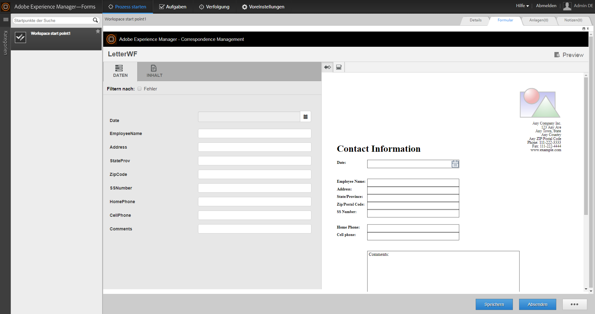

# Arbeiten mit Formularsätzen in AEM Forms Workspace{#working-with-formsets-in-aem-forms-workspace}

Ein Formularsatz ist eine Sammlung von HTML5-Formularen, die gruppiert sind und Endbenutzenden als einzelner Formularsatz bereitgestellt werden. Wenn der Benutzer einen Formularsatz ausfüllt, werden diese Informationen von einem Formular auf ein anderes übertragen. Der Formularsatz kann dann mit nur einem Klick gesendet werden. Weitere Informationen zu Formularsätzen und dazu, wie sie eingerichtet werden, finden Sie unter [Formularsätze in AEM Forms](../../forms/using/formset-in-aem-forms.md).

AEM Forms Workspace unterstützt Formularsätze. Mit Formularsätzen können mehrere zu einem Dienst oder Prozess gehörige Formulare gruppiert werden, um einen Geschäftsprozess zu automatisieren, und anschließend für die Endbenutzenden bereitgestellt werden. In einem solchen Fall können die Benutzenden den gesamten Formularsatz als einzelnes Formular ausfüllen. Es besteht zudem keine Notwendigkeit, einzelne Formulare oder Prozesse zu archivieren, zu übermitteln oder nachzuverfolgen.

## Ein Formularsatz in der AEM Forms Workspace-App dem Startpunkt zuweisen  {#attaching-a-formset-to-startpoint-in-an-aem-forms-workspace-app-br}

1. Erstellen Sie den Geschäftsprozess-Arbeitsablauf in Workbench. Weitere Informationen finden Sie in der [Workbench-Hilfe](https://www.adobe.com/go/learn_aemforms_workbench_63_de).
1. In den Prozesseigenschaften des Startpunkts wählen Sie **Ein CRX-Element verwenden** in „Präsentation und Daten“ aus.

   

1. Klicken Sie  (Durchsuchen) neben dem CRX-Elementpfad. Das Dialogfeld „Formularelement“ wird angezeigt.

   

1. Klicken Sie auf die Registerkarte **Formularsatz**, wählen Sie in der Liste den betreffenden Formularsatz aus und klicken Sie dann auf **OK**.

1. Stellen Sie das Programm bereit, nachdem Sie andere relevante Prozesseigenschaften aktualisiert haben. 

## Die Verwendung von Formularsätzen in AEM Forms Workspace {#using-formset-in-nbsp-aem-forms-workspace}

Sobald einem Startpunkt ein Formularsatz zugewiesen wurde, kann der Startpunkt wie jeder andere Startpunkt über AEM Forms Workspace aufgerufen werden.

Folgende Vorgänge von Formularsätzen werden von AEM Forms Workspace unterstützt:

* Als Entwurf speichern
* Sperren
* Abbrechen
* Absenden
* Add Attachments
* Anmerkungen hinzufügen
* Wechseln Sie zwischen den Formularen in einem Formularsatz mit den Schaltflächen „Zurück“ und „Weiter“

>[!NOTE]
>
>Um eine Leistungsverbesserung zu erreichen, sind alle Workspace-Schaltflächen (Zurück, Weiter, Speichern, Senden und weitere) während des Wechselns zwischen Formularen innerhalb eines Formularsatzes deaktiviert, bis das entsprechende Formular vollständig generiert wird.
