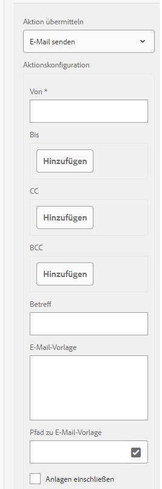

# Senden einer Formularsendebestätigung per E-Mail {#sending-a-form-submission-acknowledgement-via-email}

## Senden der Daten adaptiver Formulare {#adaptive-form-data-submission}

Adaptive Formulare bieten mehrere standardmäßige [Übermittlungsaktionen](../../forms/using/configuring-submit-actions.md)-Workflows, um die Formulardaten an verschiedene Endpunkte zu senden.

Beispielsweise sendet die Übermittlungsaktion **[!UICONTROL E-Mail senden]** eine E-Mail bei erfolgreicher Übermittlung eines adaptiven Formulars. Sie kann auch so konfiguriert werden, dass die Formulardaten und die PDF-Datei in der E-Mail gesendet werden.

In diesem Artikel werden die Schritte erläutert, mit denen die E-Mail-Aktion für ein adaptives Formular aktiviert wird, sowie die verschiedenen bereitgestellten Konfigurationen.

>[!NOTE]
>
>Sie können auch die Option **[!UICONTROL PDF per E-Mail senden]** verwenden, um das ausgefüllte Formular per E-Mail als PDF-Anhang zu senden. Die für diese Aktion verfügbaren Konfigurationsoptionen sind mit den Optionen identisch, die für die Aktion **[!UICONTROL E-Mail senden]** verfügbar sind. Die E-Mail-PDF-Aktion ist nur für XFA-basierte adaptive Formulare verfügbar.

## E-Mail-Aktion senden {#email-action}

Mit der Aktion E-Mail senden kann ein Autor bei erfolgreicher Übermittlung eines adaptiven Formulars automatisch eine E-Mail an einen oder mehrere Empfänger senden.

>[!NOTE]
>
>Um die Aktion E-Mail senden zu verwenden, müssen Sie den AEM-E-Mail-Dienst wie unter [Konfigurieren des E-Mail-Dienstes](/help/sites-administering/notification.md#configuring-the-mail-service) beschrieben konfigurieren.

### Aktivieren der Aktion &quot;E-Mail senden&quot;in einem adaptiven Formular {#enabling-email-action-on-an-adaptive-form}

1. Öffnen Sie ein adaptives Formular im Modus **[!UICONTROL edit]** .

1. Tippen Sie auf der Registerkarte **[!UICONTROL Inhalt]** auf **[!UICONTROL Formular-Container]** und tippen Sie auf  , um die Eigenschaften des adaptiven Formulars anzuzeigen.

1. Wählen Sie im Abschnitt **[!UICONTROL Submission]** die Option **[!UICONTROL Send email]** aus der Dropdownliste **[!UICONTROL Submit Action]**.

   

1. Geben Sie gültige E-Mail-IDs in die Felder **[!UICONTROL To]**, **[!UICONTROL CC]** und **[!UICONTROL BCC]** ein.

   Geben Sie den Betreff und den Text der E-Mail in die Felder **[!UICONTROL Betreff]** bzw. **[!UICONTROL E-Mail-Vorlage]** ein.

   Sie können auch variable Platzhalter in den Feldern angeben. In diesem Fall werden die Feldwerte verarbeitet, wenn das Formular erfolgreich von einem Endbenutzer gesendet wurde. Weitere Informationen finden Sie unter [Verwenden der Feldnamen in adaptiven Formularen, um E-Mail-Inhalte dynamisch zu erstellen](../../forms/using/form-submission-receipt-via-email.md#p-using-adaptive-form-field-names-to-dynamically-create-email-content-p).

   Wählen Sie **[!UICONTROL Anlagen einschließen]** aus, wenn das Formular Dateianlagen enthält und Sie diese Dateien an die E-Mail anhängen möchten.

   >[!NOTE]
   >
   >Wenn Sie die Option **[!UICONTROL PDF per E-Mail senden]** wählen, müssen Sie die Option Anlagen einschließen auswählen.

1. Klicken Sie auf  , um die Änderungen zu speichern.

### Verwenden der Feldnamen in adaptiven Formularen, um E-Mail-Inhalte dynamisch zu erstellen {#using-adaptive-form-field-names-to-dynamically-create-email-content}

Die Feldnamen in einem adaptiven Formular werden als Platzhalter bezeichnet, die durch den Wert dieses Felds ersetzt werden, wenn ein Benutzer das Formular sendet.

In der Aktion **[!UICONTROL E-Mail senden]** können Sie Platzhalter verwenden, die verarbeitet werden, wenn die Aktion ausgeführt wird. Dies bedeutet, dass die Kopfzeilen der E-Mail (wie **[!UICONTROL To]**, **[!UICONTROL CC]**, **[!UICONTROL BCC]**, **[!UICONTROL Betreff]**) generiert werden, wenn der Benutzer das Formular sendet.

Um einen Platzhalter zu definieren, geben Sie `${<field name>}` in ein Feld ein, nachdem Sie **[!UICONTROL E-Mail senden]** als Übermittlungsaktion ausgewählt haben.

Wenn das Formular beispielsweise das Feld **[!UICONTROL E-Mail-Adresse]** mit dem Namen `email_addr` zur Erfassung der E-Mail-ID eines Benutzers enthält, können Sie Folgendes in den Feldern **[!UICONTROL To]**, **[!UICONTROL CC]** oder **[!UICONTROL BCC]** angeben.

`${email_addr}`

Wenn ein Benutzer das Formular sendet, wird eine E-Mail an die E-Mail-Adresse gesendet, die in das Feld `email_addr` des Formulars eingegeben wurde.

>[!NOTE]
>
>Sie finden den Namen eines Feldes im Dialogfeld **[!UICONTROL Bearbeiten]** für das Feld.

Variable Platzhalter können auch in den Feldern **[!UICONTROL Betreff]** und **[!UICONTROL E-Mail-Vorlage]** verwendet werden.

Beispiel:

`Hi ${first_name} ${last_name},`

`Your form has been received by our department. It usually takes ten business days to process the request.`

`Regards`

`Administrator`

>[!NOTE]
>
>Felder in wiederholbaren Bereichen können nicht als variable Platzhalter verwendet werden.
