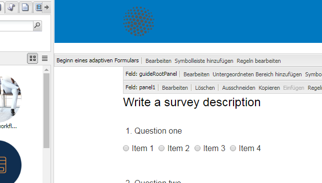
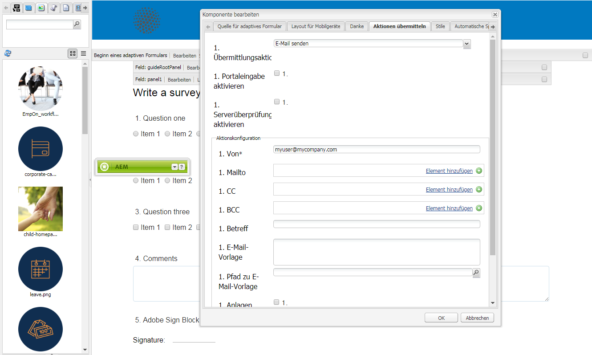

# Senden einer Formularsendebestätigung per E-Mail{#sending-a-form-submission-acknowledgement-via-email}

## Senden der Daten adaptiver Formulare {#adaptive-form-data-submission}

Adaptive Formulare bieten mehrere standardmäßige [Übermittlungsaktionen](../../forms/using/configuring-submit-actions.md)-Workflows, um die Formulardaten an verschiedene Endpunkte zu senden.

For example, the **Email action** submit action sends an email on successful submission of an adaptive form. Sie kann auch so konfiguriert werden, dass die Formulardaten und die PDF-Datei in der E-Mail gesendet werden.

In diesem Artikel werden die Schritte erläutert, mit denen die E-Mail-Aktion für ein adaptives Formular aktiviert wird, sowie die verschiedenen bereitgestellten Konfigurationen.

>[!NOTE]
>
>You can also use the **Email PDF action** to send the completed form by email as a PDF attachment. Die für diese Aktion verfügbaren Konfigurationsoptionen sind mit den Optionen identisch, die für die E-Mail-Aktion verfügbar sind. Die E-Mail-PDF-Aktion ist nur für XFA-basierte adaptive Formulare verfügbar.

## E-Mail-Aktion {#email-action}

Mit der E-Mail-Aktion kann ein Autor automatisch eine E-Mail an einen oder mehrere Empfänger senden, wenn das adaptive Formular erfolgreich gesendet wurde.

>[!NOTE]
>
>Um die E-Mail-Aktion verwenden zu können, müssen Sie dem AEM-E-Mail-Dienst konfigurieren, wie in [Konfigurieren des E-Mail-Diensts](/help/sites-administering/notification.md#configuring-the-mail-service) beschrieben.

### Aktivieren der E-Mail-Aktion in einem adaptiven Formular {#enabling-email-action-on-an-adaptive-form}

1. Öffnen Sie ein adaptives Formular im Bearbeitungsmodus.

1. Klicken Sie neben der Symbolleiste **Beginn eines adaptiven Formulars** auf **Bearbeiten**.

   Das Dialogfeld Komponente bearbeiten wird geöffnet.

   

1. Select the **Submit actions** tab and choose **Email action** from the Submit action drop-down list.

   Auf der Registerkarte werden die Optionen angezeigt, mit denen die E-Mail-Aktion für das aktuelle Formular konfiguriert werden.

   

1. Geben Sie gültige E-Mail-IDs in den Feldern „Mailto“, „CC“ und „BCC“ an.

   Geben Sie den Betreff und den Text der E-Mail in die entsprechenden Felder ein.

   Sie können auch variable Platzhalter in den Feldern angeben. In diesem Fall werden die Feldwerte verarbeitet, wenn das Formular erfolgreich von einem Endbenutzer gesendet wurde. Weitere Informationen finden Sie unter [Verwenden der Feldnamen in adaptiven Formularen, um E-Mail-Inhalte dynamisch zu erstellen](../../forms/using/form-submission-receipt-via-email.md#p-using-adaptive-form-field-names-to-dynamically-create-email-content-p).

   Aktivieren Sie „Anlagen einschließen“, wenn das Formular Dateianhänge enthält und Sie diese Dateien an die E-Mail anhängen möchten.

   >[!NOTE]
   >
   >Wenn Sie die **E-Mail-PDF-Aktion** auswählen, müssen Sie die Option „Anlagen einschließen“ aktivieren.

1. Klicken Sie auf **OK**, um die Änderungen zu speichern.

### Verwenden der Feldnamen in adaptiven Formularen, um E-Mail-Inhalte dynamisch zu erstellen {#using-adaptive-form-field-names-to-dynamically-create-email-content}

Die Feldnamen in einem adaptiven Formular werden als Platzhalter bezeichnet, die durch den Wert dieses Felds ersetzt werden, wenn ein Benutzer das Formular sendet.

In der Registerkarte „E-Mail-Aktion“ können Sie Platzhalter verwenden, die verarbeitet werden, wenn die Aktion ausgeführt wird. Das bedeutet, dass die Header der E-Mail (wie Mailto, CC, BCC, Betreff) erstellt werden, wenn der Benutzer das Formular sendet.

To define a placeholder, specify `${<field name>}` in a field in the Submit actions tab.

Beispiel: Wenn das Formular das Feld **E-Mail-Adresse** mit dem Namen `email_addr` zur Erfassung der E-Mail-ID eines Benutzers enthält, können Sie Folgendes im Feld „Mailto“, „CC“ oder „BCC“ angeben.

`${email_addr}`

Wenn ein Benutzer das Formular sendet, wird eine E-Mail an die E-Mail-Adresse gesendet, die in das Feld `email_addr` des Formulars eingegeben wurde.

>[!NOTE]
>
>Sie finden den Namen eines Feldes im Dialogfeld **Bearbeiten** für das Feld.

Variable Platzhalter können auch in den Feldern **Betreff** und **E-Mail-Vorlage** verwendet werden.

Beispiel:

`Hi ${first_name} ${last_name},`

`Your form has been received by our department. It usually takes ten business days to process the request.`

`Regards`

`Administrator`

>[!NOTE]
>
>Felder in wiederholbaren Bereichen können nicht als variable Platzhalter verwendet werden.

