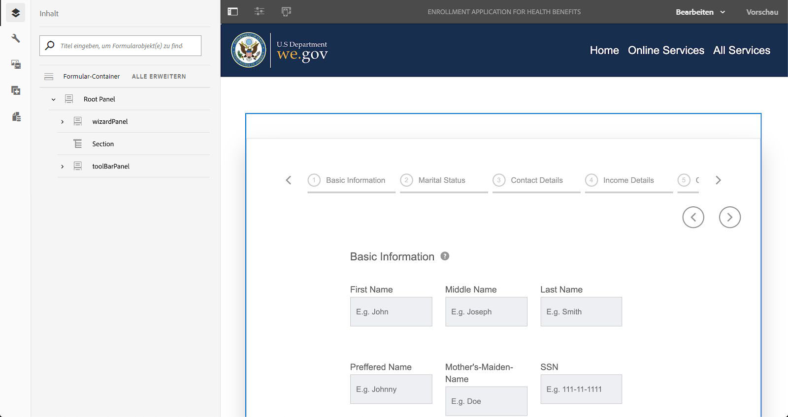

# Schrittweise Anleitung zur We.Gov- und We.Finance-Referenz-Website {#we-gov-reference-site-walkthrough}

## Voraussetzungen {#pre-requisites}

Richten Sie die Referenz-Website ein, wie unter [Einrichten und Konfigurieren der Referenz-Website We.Gov und We.Finance](../../forms/using/forms-install-configure-gov-reference-site.md) beschrieben.

## Benutzergeschichte {#user-story}

* AEM Forms

   * Automatisierte Formularkonvertierung
   * Authoring – 
   * Formulardatenmodelle/Datenquellen

* AEM Forms

   * Datenerfassung
   * (Optional) Datenintegration (MS Dynamics)
   * (Optional) Adobe Sign

* Workflow
* E-Mail-Benachrichtigungen
* (Optional) Kundenkommunikation

   * Druckkanal
   * Webkanal

* Adobe Analytics
* Datenquellenintegrationen

### Fiktive Benutzer und Gruppen {#fictitious-users-and-groups}

Das Demopaket &quot;We.Gov&quot;enthält die folgenden integrierten fiktiven Benutzer:

* **Aya Tan**: Bürger, die für eine Dienstleistung von einer Regierungsstelle in Betracht kommen


* **George Lang**: We.Gov Agency Business Analyst


* **Camila Santos**: We.Gov Agency CX Lead


Die folgenden Gruppen sind ebenfalls enthalten:

* **We.Gov Forms-Benutzer**

   * George Lang (Mitglied)
   * Camila Santos (Mitglied)

* **We.Gov-Benutzer**

   * George Lang (Mitglied)
   * Camila Santos (Mitglied)
   * Aya Tan (Mitglied)

### Demo - Übersicht - Begriffslegende {#demo-overview-terms-legend}

1. **Identität annehmen**: Definierte Benutzer und Gruppen in AEM Demo.
1. **Schaltfläche**: Farbige Rechtecke oder umkreiste Pfeile für die Navigation.
1. **Klicken Sie auf**: So führen Sie eine Aktion in der Benutzergeschichte aus.
1. **Links**: Befindet sich oben im Hauptmenü auf der We.Gov-Site.
1. **Benutzeranweisungen**: Eine Reihe numerischer Schritte, die beim Navigieren durch die Benutzergeschichte ausgeführt werden müssen.
1. **Forms Portal**:  *https://&lt;aemserver>:&lt;port>/content/we-gov/formsportal.html*
1. **Mobile-Ansicht**: Benutzer &quot;We.Gov&quot;, um eine Mobile-Ansicht mit einem Browser zu replizieren, dessen Größe geändert wurde.
1. **Desktop-Ansicht**: We.gov-Benutzer, um Demo auf einem Laptop oder Desktop anzuzeigen.
1. **Formular** für Vorbildschirme: Formular auf der Startseite der Site &quot;We.Gov&quot;.
1. **Adaptives Formular**: Antragsformular für die Anmeldung für die Demo We.gov.

   *https://&lt;aemserver>:&lt;port>/content/forms/af/adobe-gov-forms/enrollment-application-for-health-benefits.html*

1. **Adobe-We.Gov-Site**:  *https://&lt;aemserver>:&lt;port>/content/we-gov/home.html*
1. **Adobe Inbox**: Die obere Menüleiste  [Bell-](assets/bell.svg) Symbol AEM Backend gefunden.

   *https://&lt;aemserver>:&lt;port>/aem/start.html*

1. **Email Client**: Bevorzugte Methode zum Anzeigen von E-Mails (Gmail, Outlook)
1. **CTA**: Aktionsaufruf
1. **Navigieren Sie**: So suchen Sie einen bestimmten Referenzpunkt auf der Browser-Seite.
1. **AFC**: automated forms conversion

## automated forms conversion (Camila) {#automated-forms-conversion}

**Dieser Abschnitt**: Camila the CX Lead verfügt über ein vorhandenes PDF-basiertes Formular, das als Teil eines papierbasierten Prozesses verwendet wurde. Im Rahmen der Modernisierung möchte sie dieses PDF-Formular verwenden, um automatisch eine neue moderne adaptive Forms zu erstellen.

### automated forms conversion - We.Gov (Camila) {#automated-forms-conversion-wegov}

1. Navigieren Sie zu *https://&lt;aemserver>:&lt;port>/aem/start.html*

1. Anmelden mit:
   * **Benutzer**: camila.santos
   * **Kennwort:** password
1. Wählen Sie auf der Hauptseite Forms > Forms &amp; Documents > AEM Forms We.gov Forms > AFC.
1. Camila lädt die PDF-Datei in AEM Forms hoch.

   

1. Camilla wählt dann das PDF-Formular aus und klickt auf **Automatische Konvertierung starten** , um den Konvertierungsprozess zu starten. Wenn Sie das Formular konvertiert haben, müssen Sie möglicherweise auf **Konvertierung überschreiben** klicken.

   >[!NOTE]
   >
   >Beachten Sie, dass die Einstellungen in AFC für den Endbenutzer vorkonfiguriert sind, was bedeutet, dass sie nicht geändert werden sollten.

   * **Optional**: Wenn Sie das Thema Accessible Ultramarine verwenden möchten, klicken Sie einfach auf das Thema Adaptives Formular angeben und wählen Sie das Thema Accessible-Ultramarine aus, das in der Liste der Optionen angezeigt wird.

   

   

   Der prozentuale Abschlussstatus wird während der Konvertierung angezeigt. Sobald der Status **Converted** anzeigt, klicken Sie auf den Ordner **output**, wählen Sie das adaptive Formular aus und klicken Sie auf **Bearbeiten**, um das konvertierte Formular zu öffnen.

1. Camilla prüft dann das Formular und stellt sicher, dass alle Felder vorhanden sind

   

1. Camilla beginnt dann mit der Bearbeitung des Formulars. Sie wählt im Dropdown-Menü Bedienfeldlayout die Option Stammbereich > Bearbeiten (Schraubenschlüssel) > Registerkarten oben aus und markiert das Kontrollkästchen.

   

1. Camilla fügt dann alle notwendigen CSS- und Feldänderungen hinzu, um das Endprodukt zu produzieren.

   

### Formulardatenmodell und Datenquellen (Camila) {#data-sources}

**Dieser Abschnitt**: Nachdem das Dokument konvertiert und in einem adaptiven Formular erstellt wurde, muss Camila das adaptive Formular mit einer Datenquelle verbinden.

1. Camila öffnet die Eigenschaften des Formulars, das in [Automated forms conversion - We.Gov](#automated-forms-conversion-wegov) konvertiert wurde.

1. Camila wählt dann Formularmodell > Auswahl des Formulardatenmodells aus dem Dropdown-Menü Auswählen > Wählt We.gov Enrollment FDM aus der Liste der Optionen aus.

1. Klicken Sie auf die Schaltfläche Speichern und schließen .

   

1. Camila klickt auf den Ordner **output**, wählt das adaptive Formular aus und klickt auf **Bearbeiten** , um das ausgefüllte We.Gov-Formular zu öffnen.
1. Camila wählt ein Feld im adaptiven Formular aus und klickt auf &quot;. Sie erstellt mithilfe des Felds **Bindungsverweis** eine Bindung mit den Entitäten des Formulardatenmodells. Sie wiederholt diesen Schritt für alle Felder im adaptiven Formular.

### Prüfung der Barrierefreiheit von Formularen (Camila) {#form-accessibility-testing}

Camila überprüft auch, ob die erstellten Inhalte korrekt erstellt wurden und gemäß den Unternehmensstandards vollständig zugänglich sind.

1. Camila klickt auf den Ordner **output**, wählt das adaptive Formular aus und klickt auf **Vorschau** , um das ausgefüllte We.Gov-Formular zu öffnen.

1. Öffnet die Registerkarte &quot;Verfolgung&quot;im Chrome Developer Tool.

1. Führt eine Barrierefreiheitsprüfung durch, um das adaptive Formular zu überprüfen.

   

## Demo zur Mobile-Ansicht des adaptiven Formulars (Aya) {#mobile-view-demo}

**Dieser Abschnitt muss vor der Demonstration durchgeführt werden.**

**Benutzeranweisungen:**

1. Navigieren Sie zu: *https://&lt;aemserver>:&lt;port>/content/we-gov/home.html*
1. Anmelden mit:

   1. **Benutzer**: aya.tan
   1. **Kennwort:** password

1. Ändern Sie die Größe des Browser-Fensters oder verwenden Sie den Emulator des Browsers, um eine Mobilgerätegröße zu replizieren.

### We.Gov-Website (Aya) {#aya-user-story-we-gov-website}


**Dieser Abschnitt**: Aya ist ein Bürger. Sie hört von einer Freundin, dass sie möglicherweise berechtigt ist, einen Dienst von einer Regierungsstelle zu erhalten. Aya navigiert von ihrem Mobiltelefon zur We.Gov-Website, um mehr über Dienste zu erfahren, für die sie berechtigt ist.

### We.Gov Pre-Screener (Aya) {#aya-user-story-we-gov-pre-screener}

Aya beantwortet einige Fragen, um ihre Eignung zu bestätigen, indem sie ein kurzes adaptives Formular auf ihrem Mobiltelefon ausfüllt.

**Benutzeranweisungen:**

1. Treffen Sie in jedem Dropdown-Feld eine Auswahl.

   >[!NOTE]
   >
   >Wenn der Benutzer mehr als 200.000 USD pro Jahr verdient, sind diese nicht berechtigt.

1. Klicken Sie auf &quot;**Bin ich berechtigt?**” button.
1. Klicken Sie auf die Schaltfläche &quot;**Jetzt anwenden**&quot;, um fortzufahren.

   

### We.Gov Adaptive Form (Aya) {#aya-user-story-we-gov-adaptive-form}

Aya stellt fest, dass sie berechtigt ist, und beginnt mit dem Ausfüllen ihres Antrags, um einen Dienst auf ihrem Mobilgerät anzufordern.

Aya muss einige Dokumente zu Hause überprüfen, bevor sie den Antrag auf Dienstanfrage ausführen kann. Sie speichert und beendet die Anwendung von ihrem Mobilgerät aus.

**Benutzeranweisungen:**

1. Füllen Sie die Felder Grundlegende Informationen aus. Die folgenden Felder sind Pflichtfelder und Dropdown-Listen:

   1. Grundlegende Informationen

      1. Vorname
      1. Nachname
      1. Geburtsdatum
      1. E-Mail

1. Verwenden Sie die folgende **dynamische Logik**, um mithilfe des Dropdown-Menüs **Familienstand** eine dynamische Funktion zu demonstrieren:

   1. **Einzelne**: Nächstes Bedienfeld des Verwandten anzeigen
   1. **Verheiratet**: Fenster für eheliche abhängige Personen anzeigen
   1. **Geschieden**: Nächstes Bedienfeld des Verwandten anzeigen
   1. **Gelöscht**: Nächstes Bedienfeld des Verwandten anzeigen
   1. **Haben Sie Kinder?**: (Ja/Nein) Optionsfeld, um untergeordneten abhängigen Bereich anzuzeigen.

      1. (Hinzufügen/Entfernen)-Schaltfläche zum Hinzufügen/Entfernen mehrerer untergeordneter Bedienfelder.

1. Klicken Sie in der grauen Menüleiste auf den Pfeil nach rechts.
1. Klicken Sie unten auf die Schaltfläche Speichern .

   

## Desktop-Demo {#desktop-demo}

**Dieser Abschnitt:** Zurück zu Hause hat Aya die benötigten Informationen gefunden und die Anwendung von ihrem Desktop aus fortgesetzt. Aya navigiert zum Online-Formularportal, um ihren Antrag wiederaufzunehmen. Mit einer einfachen Anpassung können Agenturen auch automatisch einen Link generieren und per E-Mail versenden, um die Anwendung wiederaufzunehmen.

### Kontinuierliches adaptives Formular (Aya) {#aya-user-story-continued-adaptive-form}

**Benutzeranweisungen:**

1. Navigieren Sie zu *https://&lt;aemserver>:&lt;port>/content/we-gov/home.html*
1. Klicken Sie in der Navigationsleiste auf &quot;**Online Services**&quot;.
1. Wählen Sie im Bedienfeld &quot;Forms-Entwurf&quot;die vorhandene &quot;Registrierungsanwendung für Gesundheitsvorteile&quot;aus.

   

   Das Erscheinungsbild ist identisch, und sie muss keine Daten erneut eingeben.

   **Benutzeranweisungen:**

1. Klicken Sie auf den rechten Kreis-CTA , um zum nächsten Abschnitt zu wechseln.

   

   Das Formular wird bis zum letzten Eintrag von Aya ausgefüllt. Aya hat alle ihre Informationen eingegeben und ist bereit zum Senden.

   

   >[!NOTE]
   >
   >Wenn Aya das Telefonnummernfeld ausfüllt, muss sie es als fortlaufende 11-stellige Zahl ohne Bindestriche, Leerzeichen oder Bindestriche ausfüllen.

   Nach dem Senden erhält Aya eine Dankeseite. Optional erhält sie auch eine E-Mail, die sie zur elektronischen Unterzeichnung des Datensatzdokuments mit Adobe Sign öffnen kann.

### Optional: Adobe Sign (Aya) {#adobe-sign}

**Benutzeranweisungen:**

1. Navigieren Sie zu Ihrem E-Mail-Client und suchen Sie die Adobe Sign-E-Mail.
1. Klicken Sie auf den Link zu Adobe Sign.

   

**Benutzeranweisungen:**

1. Markieren Sie das Kontrollkästchen &quot;**Ich stimme**&quot;.
1. Klicken Sie auf &quot;**Accept**&quot;.
1. Scrollen Sie zum unteren Rand des überprüften Dokuments.
1. Klicken Sie auf die hervorgehobene gelbe Registerkarte, um das Dokument zu signieren.

    

## Regierungsagent (George) {#government-agent-george}


**Dieser Abschnitt:** George ist ein Geschäftsanalyst bei der Regierungsagentur, von der aus Aya einen Dienst anfordert. George verfügt über ein Dashboard, in dem er alle Anwendungen für Serviceanfragen sehen kann, die ihm zur Überprüfung zugewiesen wurden.

### AEM Posteingang (George) {#george-user-story-aem-inbox}

**Benutzeranweisungen:**

1. Navigieren Sie zu *https://&lt;aemserver>:&lt;port>/aem/start.html*
1. Klicken Sie auf das Benutzersymbol (obere rechte Ecke) und verwenden Sie die Menüoption &quot;**Abmelden**&quot;oder &quot;**Identität annehmen als**&quot;, wenn Sie derzeit mit einem Administrator angemeldet sind.

   1. Anmelden mit:

      1. **Benutzer:** george.lang
      1. **Kennwort:** password
   1. Oder stellvertretend agieren:

      1. Geben Sie &quot;**George**&quot;in das Feld &quot;**Identität annehmen als**&quot;ein.

      1. Klicken Sie auf OK , um sich zu imitieren.


1. Klicken Sie oben rechts auf das Symbol Benachrichtigung (Glocke).
1. Klicken Sie auf &quot;**Alle anzeigen**&quot;, um zum Posteingang zu navigieren.
1. Öffnen Sie im Posteingang die neueste Aufgabe &quot;**Health Benefits Application Review**&quot;.

   

### Optional: AEM Posteingang und MS Dynamics (George) {#george-user-story-aem-inbox-and-ms-dynamics}

Dank Datenintegrationen und automatisierten Workflows wird die Aya-Anwendung zusammen mit einem CRM-Datensatz angezeigt, der beim Senden der Daten automatisch generiert wurde.

**Benutzeranweisungen:**

1. Öffnen und überprüfen Sie das schreibgeschützte adaptive Formular.
1. Klicken Sie auf die Schaltfläche &quot;**MS Dynamics öffnen**&quot;, um den MS Dynamics-Datensatz in einem neuen Fenster zu öffnen.
1. Im CRM können Sie alle Informationen aktualisieren

   1. Optional können Sie einige Prüfungsnotizen direkt in Dynamics hinzufügen.

1. Schließen Sie AEM Posteingang und kehren Sie dorthin zurück.

   

### Zurück zum AEM Posteingang (George) {#george-user-story-back-to-aem-inbox}

George genehmigt die Anwendung von Aya und dank eines bereits existierenden automatisierten Workflows wird auch eine Bestätigungs-E-Mail an Aya gesendet.

**Benutzeranweisungen:**

1. Navigieren Sie zur oberen linken Ecke und klicken Sie auf &quot;**Genehmigen**&quot;, um den Antrag zu genehmigen.
1. Im Modal können Sie eine Meldung für den CX-Lead hinterlassen.
1. Klicken Sie auf Fertig.
1. (Bürgerrolle) Öffnen Sie Ihren E-Mail-Client, um die an Aya gesendete E-Mail anzuzeigen.

   

## CX Lead (Camila) {#cx-lead-camila}


**In diesem Abschnitt:**  Camila the CX Lead richtet mit Aya einen Willkommens-Telefonanruf ein, um zu erklären, wie die von ihr genehmigten Regierungsdienste genutzt werden können.

### (Optional) AEM Posteingang und MS Dynamics {#camila-user-story-aem-inbox-ms-dynamics}

**Benutzeranweisungen:**

1. Navigieren Sie zu *https://&lt;aemserver>:&lt;port>/aem/start.html*
1. Klicken Sie auf das Benutzersymbol (obere rechte Ecke) und verwenden Sie die Menüoption &quot;**Abmelden**&quot;oder &quot;**Identität annehmen als**&quot;, wenn Sie derzeit mit einem Administrator angemeldet sind.

   1. Anmelden mit:

      1. **Benutzer**: camila.santos
      1. **Kennwort:** password
   1. Oder stellvertretend agieren:

      1. Geben Sie &quot;**Camila**&quot;in das Feld &quot;**Identität annehmen als**&quot;ein.

      1. Klicken Sie auf OK , um sich zu imitieren.


1. Klicken Sie oben rechts auf das Symbol Benachrichtigung (Glocke).
1. Klicken Sie auf &quot;**Alle anzeigen**&quot;, um zum Posteingang zu navigieren.
1. Öffnen Sie im Posteingang die neueste Aufgabe &quot;**Neue Kontaktgenehmigung**&quot;.


**(Optional) Benutzeranweisungen:**

1. Öffnen und überprüfen Sie das schreibgeschützte adaptive Formular.
1. Klicken Sie auf die Schaltfläche &quot;**MS Dynamics öffnen**&quot;, um den MS Dynamics-Datensatz in einem neuen Fenster zu öffnen.
1. Im CRM können Sie alle Informationen aktualisieren

   1. Fügen Sie optional eine neue Aufruffaktivität direkt in Dynamics hinzu.
   1. Öffnen Sie den Abschnitt &quot;**Aktivitäten**&quot;.
   1. Klicken Sie auf die Option &quot;**Neuer Telefonaufruf**&quot;.
   1. Fügen Sie Telefonanrufdetails hinzu.
   1. Speichern und schließen Sie das Fenster.

1. Navigieren Sie in AEM oberen linken Ecke und klicken Sie auf &quot;**Submit**&quot;, um den Antrag zu senden.
1. Im Modal können Sie eine Nachricht hinterlassen.
1. Klicken Sie auf Fertig.

    

## (Optional) Welcome Kit Citizen (Aya) {#welcome-kit-citizen-aya}

**Dieser Abschnitt:** Aya erhält eine E-Mail mit einem Link zu einer interaktiven Kommunikation, die ihre Vorteile zusammenfasst, sowie Formularfelder zum Ausfüllen enthält. PDF-Vorteile-Anweisung angehängt und Link zum interaktiven Kommunikationsbrief in der E-Mail (mit demselben Design/Branding wie die interaktive Kommunikation).

### E-Mail-Client-Benachrichtigung (Aya) {#aya-user-story-email-client}

**Benutzeranweisungen:**

1. Suchen und öffnen Sie die Begrüßungs-Kit-E-Mail.
1. Blättern Sie zum PDF-Anhang unten auf der Seite.
1. Klicken Sie auf , um den PDF-Anhang zu öffnen.
1. Scrollen Sie in Ihrem E-Mail-Client nach oben und klicken Sie auf &quot;**Willkommenspaket online anzeigen**&quot;.

   1. Dadurch wird die Webkanalversion desselben Dokuments geöffnet.

1. Für eine schnelle Referenz zu PDF direkt:

   *https://&lt;aemserver>:&lt;port>/aem/formdetails.html/content/dam/formsanddocuments/adobe-gov-forms/welcome-handbook/we-gov-welcome-handbuch*

1. Kurzanleitung zu IC:

   *https://&lt;aemserver>:&lt;port> /content/dam/formsanddocuments/adobe-gov-forms/welcome-handbook/we-gov-welcome-handbook/jcr:content?channel=web&amp;mode=preview&amp;wcmmode=disabled*

    

## Bürger der Erneuerbaren Erinnerung (Aya) {#renewal-reminder-citizen-aya}

**Dieser Abschnitt:** Camila plant auch eine Erinnerung an eine Nachricht, die ein Jahr später erfolgt. (Workflow-Schritt, der automatisiert/ausführt und E-Mail sendet).

### E-Mail-Client-Benachrichtigung (Aya) {#aya-user-story-email-client-updated}

**Benutzeranweisungen:**

1. Navigieren Sie zu Ihrem E-Mail-Client.
1. Suchen und öffnen Sie die E-Mail Erneuerbare Erinnerung .
1. Klicken Sie auf die Schaltfläche &quot;**Submit a new application**&quot;, um das adaptive Formular zu öffnen.

   1. Dieser Abschnitt wird absichtlich leer gelassen, um das Vorausfüllen von Daten in Phase 2 zu unterstützen.

   

## (Optional) Formulardatenmodell (Camila) {#form-data-model}

**Dieser Abschnitt**: Camila navigiert zu AEM Forms Data Integrations , wo sie einen schnellen Test durchführen kann, um zu sehen, ob die über die Formulardatenmodellintegration an die externe Datenquelle gesendeten Informationen tatsächlich vorhanden sind.

### Formulardatenmodell (Camila) {#form-data-model-camila}

**Dieser Abschnitt**: Camila navigiert zur Seite &quot;Data Sources&quot;, um die Daten zu überprüfen, die der Server in der Derby-Datenbank repliziert hat.

1. Sobald das Benutzererlebnis abgeschlossen ist und die Benutzereingabe abgeschlossen ist, navigiert Camila in AEM Forms zur Registerkarte Data Sources (**Forms** > **Datenintegrationen**).

1. Camila wählt dann AEM Forms **We.gov FDM** aus und bearbeitet dann das **We.gov-Registrierungs-FDM**.

1. Camila wählt dann den zu testenden **Contact** > **Read Service** aus.

   

1. Camila stellt dem Testdienst dann eine Kontakt-ID zur Verfügung und klickt dann auf die Schaltfläche Testen . Beispiel: 1 oder 2, wenn Sie das Formular gesendet haben. Wenn Sie das Formular nicht gesendet haben, werden keine Daten zurückgegeben.

   

1. Camila kann dann überprüfen, ob die Daten erfolgreich in die Datenquelle eingefügt wurden.

   * Die Daten im Derby DS ähneln dem folgenden Format:

   ```xml
      [
         {
         "ADDRESS_COUNTRY": "USA",
         "LAST_NAME": "Tan",
         "ADDRESS_CITY": "New York",
         "FIRST_NAME": "Aya",
         "ADDRESS_STATE": "AL",
         "ADDRESS_LINE1": "123 Street crescent",
         "GENDER_CODE": "2",
         "ADDRESS_LINE2": "123 Street crescent",
         "ADDRESS_POSTAL_CODE": "90210",
         "BIRTH_DATE": "1991-12-12",
         "CONTACT_ID": 1,
         "MIDDLE_NAME": "M",
         "HAS_CHILDREN_CODE": "0"
         }
   ]
   ```

## (Optional) Analytics (Camila) {#analytics-cx-lead-camila}

**Dieser Abschnitt:** Camila navigiert zu einem Dashboard, in dem sie die KPIs der Agentur sehen kann, z. B. den Prozentsatz der Bürger, die mit dem Ausfüllen eines Formulars für Serviceanfragen und Abbruch beginnen, die durchschnittliche Zeitdauer von der Antragstellung bis zur Antwort auf eine Genehmigung/Ablehnung und Interaktionsstatistiken für die den Bürgern gesendeten Sozialleistungs-Handbücher.

### Adobe Analytics Sites Reporting (Camila) {#camila-reviews-sites-reporting-we-gov-adobe-analytics}

1. Navigieren Sie zu *https://&lt;aemserver>:&lt;port>/sites.html/content*
1. Wählen Sie die Site &quot;**AEM Forms We.Gov Site**&quot;aus, um die Seiten der Site anzuzeigen.
1. Wählen Sie eine der Seiten der Site aus (z. B. Startseite) und wählen Sie &quot;**Analytics und Recommendations**&quot;.

   

1. Auf dieser Seite werden abgerufene Informationen aus Adobe Analytics angezeigt, die sich auf die AEM Sites-Seite beziehen (HINWEIS: Diese Informationen werden regelmäßig von Adobe Analytics aktualisiert und nicht in Echtzeit angezeigt.

   

1. Zurück auf der Seitenansichtsseite (Zugriff in Schritt 3) können Sie die Seitenansichtsinformationen auch anzeigen, indem Sie die Anzeigeeinstellung ändern und Elemente in der Listenansicht **anzeigen.**
1. Suchen Sie das Dropdown-Menü &quot;**Ansicht**&quot;und wählen Sie &quot;**Listenansicht**&quot;aus.

   

1. Wählen Sie im selben Menü &quot;**Anzeigeeinstellung**&quot;aus und wählen Sie die Spalten aus dem Abschnitt &quot;**Analytics**&quot;aus, die angezeigt werden sollen.

   

1. Klicken Sie auf &quot;**Update**&quot;, um die neuen Spalten verfügbar zu machen.

   

### Adobe Analytics Forms Reporting (Camila) {#camila-reviews-forms-reporting-we-gov-adobe-analytics}

1. Navigieren Sie zu

   *https://&lt;aemserver>:&lt;port>/aem/forms.html/content/dam/formsanddocuments/adobe-gov-forms*

1. Wählen Sie das adaptive Formular &quot;**Registrierungsanwendung für Gesundheitsvorteile**&quot;und wählen Sie die Option &quot;**Analytics-Bericht**&quot;aus.

   

1. Warten Sie, bis die Seite geladen wurde, und zeigen Sie die Daten des Analytics-Berichts an.

   
