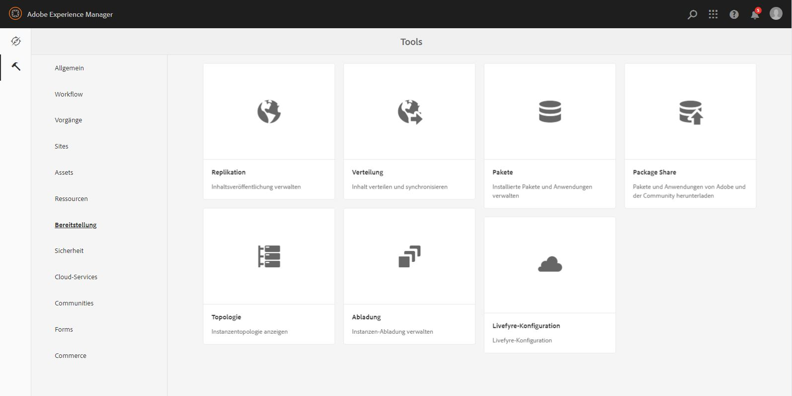
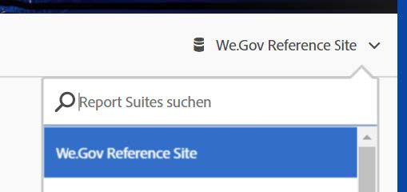

# Einrichten der Web.Gov-Referenz-Website{#set-up-and-configure-we-gov-reference-site}

## Details zum Demopaket {#demo-package-details}

### Installationsvoraussetzungen {#installation-prerequisites}

Dieses Paket wurde für **AEM Forms 6.4 OSGI Author** erstellt, wurde getestet und wird daher auf den folgenden Plattformversionen unterstützt:

| AEM-VERSION | AEM FORMS-PAKET-VERSION | STATUS |
|---|---|---|
| 6.4 | 5.0.86 | **Unterstützt** |
| 6.5 | 6.0.80 | **Unterstützt** |

Dieses Paket enthält eine Cloud-Konfiguration, die die folgenden Plattformversionen unterstützt:

| CLOUD-ANBIETER | DIENSTVERSION | STATUS |
|---|---|---|
| Adobe Sign | v5 API | **Unterstützt** |
| Microsoft Dynamics 365 | 1710 (9.1.0.3020) | **Unterstützt** |

**Überlegungen zur Paketinstallation:**

* Es wird erwartet, dass das Paket auf einem sauberen Server installiert wird, der frei von anderen Demopaketen oder älteren Demopaketversionen ist
* Das Paket wird voraussichtlich auf einem OSGI-Server installiert und im Autorenmodus ausgeführt

### Was beinhaltet dieses Paket? {#what-does-this-package-include}

Das AEM Forms We.Gov-Demopaket ( **we-gov-forms.pkg.all-&lt;version>.zip **) wird als Paket bereitgestellt, das mehrere weitere Unterpakete und Dienste enthält. Das Paket umfasst die folgenden Module:

* **we-gov-forms.pkg.all-&lt;version>.zip** -* Komplettdemo-Paket*

   * **we-gov-forms.ui.apps-&lt;version>.zip** *- Enthält alle Komponenten, Client-Bibliotheken, Beispielbenutzer, Workflow-Modelle usw.*

      * **we-gov-forms.core-&lt;version>.jar*** - Enthält alle OSGI-Dienste, Implementierung benutzerdefinierter Arbeitsablaufschritte usw.*

      * **core.wcm.components.all-2.0.4.zip** - *Auflistung von WCM-Beispielkomponenten*

      * **grid-aem.ui.apps-1.0-SNAPSHOT.zip** - *AEM-Sites-Rasterlayoutpaket für Seitenspaltensteuerung*
   * **we-gov-forms.ui.content-&lt;version>.zip*** - Enthält alle Inhalte, Seiten, Bilder, *Formulare, interaktive Kommunikationselemente usw.

   * **we-gov-forms.config.public-&lt;version>.zip** - *Enthält alle Standardkonfigurationsknoten einschließlich Platzhalter-Cloud-Konfigurationen, um Formulardatenmodelle und Service-Bindungsprobleme zu vermeiden.*

Zu den in diesem Paket enthaltenen Elementen gehören:

* AEM-Site-Seiten mit bearbeitbaren Vorlagen
* Adaptive AEM Forms-Formulare
* Interaktive AEM Forms-Kommunikation (Druck und Webkanal)
* AEM Forms XDP-Dokument aus Datensatz
* AEM Forms MS Dynamics Forms-Datenmodell
* Adobe Sign-Integration
* AEM Workflow-Modell
* AEM Assets-Beispielbilder

## Konfigurationsoptionen {#configuration-options}

Dieser Abschnitt enthält Details zu Konfigurationsoptionen. Derzeit ist dieser Abschnitt absichtlich leer.

## Installation des Demopakets {#demo-package-installation}

Dieser Abschnitt enthält Informationen zum Installieren des Demopakets.

### From package share {#from-package-share}

1. Navigieren Sie zu *https://&lt;aemserver>:&lt;port>/crx/packageshare/*

   Oder klicken Sie in AEM auf &quot;Bereitstellung&quot;und navigieren Sie zum Symbol für die Paketfreigabe.

   

1. Melden Sie sich mit Ihrer Adobe ID an.
1. Suchen Sie das **Paket we-gov-forms.pkg.all-&lt;version>** und suchen Sie es.
1. Wählen Sie die Option &quot;Herunterladen&quot;und akzeptieren Sie die Geschäftsbedingungen.
1. Wählen Sie nach dem Herunterladen die Option &quot;Heruntergeladen&quot;, um das Paket im Package Manager zu suchen.
1. Wählen Sie die Option &quot;Installieren&quot;, um das Paket zu installieren.

   

1. Warten Sie, bis der Installationsprozess abgeschlossen ist.
1. Navigieren Sie zu *https://&lt;aemserver>:&lt;port>/content/we-gov/home.html?wcmmode=disabled* , um sicherzustellen, dass die Installation erfolgreich war.

### Von einer lokalen ZIP-Datei {#from-a-local-zip-file}

1. Laden Sie die Datei **we-gov-forms.pkg.all-&lt;version>.zip herunter und suchen Sie sie** .
1. Navigieren Sie zu *https://&lt;aemserver>:&lt;port>/crx/packmgr/index.jsp*.
1. Wählen Sie die Option &quot;Paket hochladen&quot;.

   

1. Verwenden Sie den Dateibrowser, um zur heruntergeladenen ZIP-Datei zu navigieren und diese auszuwählen.
1. Klicken Sie zum Hochladen auf &quot;Öffnen&quot;.
1. Wählen Sie nach dem Hochladen die Option &quot;Installieren&quot;, um das Paket zu installieren.

   

1. Warten Sie, bis der Installationsprozess abgeschlossen ist.
1. Navigieren Sie zu *https://&lt;aemserver>:&lt;port>/content/we-gov/home.html?wcmmode=disabled* , um sicherzustellen, dass die Installation erfolgreich war.

### Installieren neuer Paketversionen {#installing-new-package-versions}

Gehen Sie wie in 4.1 und 4.2 beschrieben vor, um eine neue Paketversion zu installieren. Es ist möglich, eine neuere Paketversion zu installieren, während ein anderes älteres Paket bereits installiert ist. Es wird jedoch empfohlen, die ältere Paketversion zuerst zu deinstallieren. Gehen Sie dazu wie folgt vor.

1. Navigieren Sie zu *https://&lt;aemserver>:&lt;port>/crx/packmgr/index.jsp*
1. Suchen Sie die ältere Datei **we-gov-forms.pkg.all-&lt;version>.zip** .
1. Wählen Sie die Option &quot;Mehr&quot;.
1. Wählen Sie aus der Dropdownliste die Option &quot;Deinstallieren&quot;.

   

1. Wählen Sie bei Bestätigung erneut &quot;Deinstallieren&quot;und lassen Sie den Deinstallationsprozess abschließen.

## Demopaket-Konfiguration {#demo-package-configuration}

Dieser Abschnitt enthält Details und Anweisungen zur Konfiguration des Demopakets nach der Bereitstellung vor der Präsentation.

### Fakultative Benutzerkonfiguration {#fictional-user-configuration}

1. Navigieren Sie zu *https://&lt;aemserver>:&lt;port>/libs/granite/security/content/groupadmin.html*
1. Suchen Sie nach &quot;**Workflow**&quot;.
1. Wählen Sie die Gruppe &quot;**Workflow-Benutzer**&quot; und klicken Sie auf &quot;Eigenschaften&quot;.
1. Navigieren Sie zur Registerkarte &quot;Mitglieder&quot;.
1. Geben Sie **wegov** in das Feld &quot;Benutzer oder Gruppe auswählen&quot; ein.
1. Wählen Sie aus der Dropdownliste &quot;**Wir.Gov-Formularbenutzer**&quot;.

   

1. Klicken Sie in der Menüleiste auf &quot;Speichern &amp; Schließen&quot;.
1. Wiederholen Sie die Schritte 2 bis 7, indem Sie nach &quot;**Analytics**&quot;suchen, die Gruppe &quot;**Analytics-Administratoren**&quot;auswählen und die Gruppe &quot;**Wir.Gov-Formularbenutzer**&quot;als Mitglied hinzufügen.
1. Wiederholen Sie die Schritte 2 bis 7, indem Sie nach &quot;**Formularbenutzer**&quot;suchen, die Gruppe &quot;**Formularbenutzer**&quot;auswählen und die Gruppe &quot;**Wir.Gov-Formularbenutzer**&quot;als Mitglied hinzufügen.
1. Wiederholen Sie die Schritte 2 bis 7, indem Sie nach &quot;**Formularbenutzer**&quot;suchen, die Gruppe &quot;**Formularbenutzer**&quot;auswählen und diesmal die Gruppe &quot;** We.Gov-Benutzer**&quot;als Mitglied hinzufügen.

### E-Mail-Serverkonfiguration {#email-server-configuration}

1. Dokumentation zum Einrichten [der E-Mail-Benachrichtigung überprüfen](/help/sites-administering/notification.md)

1. Navigate to *https://&lt;aemserver>:&lt;port>/system/console/configMgr*
1. Klicken Sie auf den **Day CQ Mail Service **Dienst, um ihn zu konfigurieren.

   

1. Konfigurieren Sie den Dienst für die Verbindung mit dem SMTP-Server Ihrer Wahl:

   1. **Hostname** des SMTP-Servers: z. B. (smtp.gmail.com)
   1. **Serveranschluss**: z. B. (465) für Gmail mit SSL
   1. **** SMTP-Benutzer: demo@ &lt;companyname>.com
   1. **&quot;Von&quot;-Adresse**: aemformsdemo@adobe.com
   

1. Klicken Sie auf &quot;Speichern&quot;, um die Konfiguration zu speichern.

### AEM SSL-Konfiguration {#aemsslconfig}

Dieser Abschnitt enthält Details zum Konfigurieren von SSL auf der AEM-Instanz, um die Adobe Sign Cloud-Konfiguration konfigurieren zu können.

**Verweise:**

1. [Die Funktion „SSL By Default“ (SSL als Standard)](/help/sites-administering/ssl-by-default.md)

**Hinweise:**

1. Navigieren Sie zu https://&lt;aemserver>:&lt;port>/aem/inbox, wo Sie den unter dem Link zur Referenzdokumentation beschriebenen Prozess abschließen können.
1. Das Paket **we-gov-forms.pkg.all-&lt;version>.zip** enthält einen SSL-Beispielschlüssel und ein Zertifikat, auf das zugegriffen werden kann, indem der **Ordner we-gov-forms.pkg.all-.zip/ssl** extrahiert wird, der Teil des Pakets ist.

1. SSL-Zertifikat und Schlüsseldetails:

   1. herausgegeben an &quot;CN=localhost&quot;
   1. 10-jährige Gültigkeit
   1. password value of &quot;password&quot;

### Adobe Sign cloud configuration {#adobe-sign-cloud-configuration}

Dieser Abschnitt enthält Details und Anweisungen zur Adobe Sign Cloud-Konfiguration.

**Verweise:**

1. [Integrieren von Adobe Sign mit AEM Forms](adobe-sign-integration-adaptive-forms.md)

#### Cloud configuration {#cloud-configuration}

1. **Überprüfen Sie die Voraussetzungen. Die erforderliche SSL-Konfiguration finden Sie unter[AEM SSL-Konfiguration](../../forms/using/forms-install-configure-gov-reference-site.md#aemsslconfig).**
1. Navigieren Sie zu:

   *https://&lt;aemserver>:&lt;port>/libs/adobesign/cloudservices/adobesign.html/conf/we-gov*

   >[!NOTE]
   >
   >Die URL, die für den Zugriff auf den AEM-Server verwendet wird, sollte mit der URL übereinstimmen, die im Adobe Sign OAuth-Umleitungs-URI konfiguriert wurde, um Konfigurationsprobleme zu vermeiden ( *https://&lt;aemserver>:&lt;port>/mnt/overlay/adobesign/cloudservices/adobesign/properties.html*))

1. Wählen Sie die Konfiguration &quot;We.gov Adobe Sign&quot;.
1. Klicken Sie auf &quot;Eigenschaften&quot;.
1. Navigieren Sie zur Registerkarte &quot;Einstellungen&quot;.
1. Geben Sie die Auth-URL ein, z. B.: [https://secure.na1.echosign.com/public/oauth](https://secure.na1.echosign.com/public/oauth)
1. Geben Sie die konfigurierte Client-ID und den geheimen Clientschlüssel aus der konfigurierten Adobe-Signaturinstanz ein.
1. Klicken Sie auf &quot;Mit Adobe Sign verbinden&quot;.
1. Klicken Sie nach erfolgreicher Verbindung auf &quot;Speichern &amp; Schließen&quot;, um die Integration abzuschließen.

### MS Dynamics Cloud-Konfiguration {#ms-dynamics-cloud-configuration}

Dieser Abschnitt enthält Details und Anweisungen zur MS Dynamics Cloud-Konfiguration.

**Verweise:**

1. [Microsoft Dynamics OData-Konfiguration](https://docs.adobe.com/content/help/en/experience-manager-64/forms/form-data-model/ms-dynamics-odata-configuration.html)
1. [Konfigurieren von Microsoft Dynamics für AEM Forms](https://helpx.adobe.com/experience-manager/kt/forms/using/config-dynamics-for-aem-forms.html)

#### MS Dynamics OData cloud service {#ms-dynamics-odata-cloud-service}

1. Navigieren Sie zu:

   https://&lt;aemserver>:&lt;port>/libs/fd/fdm/gui/components/admin/fdmcloudservice/fdm.html/conf/we-gov

   1. Stellen Sie sicher, dass Sie auf den Server mit derselben Umleitungs-URL zugreifen, die in der Registrierung der MS Dynamics-Anwendung konfiguriert ist.

1. Wählen Sie die Konfiguration &quot;Microsoft Dynamics OData Cloud Service&quot;.
1. Klicken Sie auf &quot;Eigenschaften&quot;.

   

1. Navigieren Sie zur Registerkarte &quot;Authentifizierungseinstellungen&quot;.
1. Geben Sie die folgenden Details ein:

   1. **** Dienststamm: z. B. https://msdynamicsserver.api.crm3.dynamics.com/api/data/v9.1/
   1. **** Authentifizierungstyp: OAuth 2.0
   1. **Authentifizierungseinstellungen** (siehe [MS Dynamics Cloud-Konfigurationseinstellungen](../../forms/using/forms-install-configure-gov-reference-site.md#dynamicsconfig) , um diese Informationen zu erfassen):

      1. Client-ID - auch als Bewerbungs-ID bezeichnet
      1. Client-Geheimnis
      1. OAuth-URL, z. B. [https://login.windows.net/common/oauth2/authorize](https://login.windows.net/common/oauth2/authorize)
      1. URL des Tokens aktualisieren, z. B. [https://login.windows.net/common/oauth2/token](https://login.windows.net/common/oauth2/token)
      1. Zugriffstoken-URL - z. B. [https://login.windows.net/common/oauth2/token](https://login.windows.net/common/oauth2/token)
      1. Autorisierungsbereich - **offen**
      1. Authentifizierungskopfzeile - **Autorisierungsanbieter**
      1. Ressource - z. B. [https://msdynamicsserver.api.crm3.dynamics.com](https://msdynamicsserver.api.crm3.dynamics.com)
   1. Klicken Sie auf &quot;Mit OAuth verbinden&quot;.

1. Klicken Sie nach erfolgreicher Authentifizierung auf &quot;Speichern und schließen&quot;, um die Integration abzuschließen.

#### Konfigurationseinstellungen für MS Dynamics {#dynamicsconfig}

Die Schritte, die in diesem Abschnitt beschrieben werden, helfen Ihnen, die Client-ID, den geheimen Clientschlüssel und Details aus Ihrer MS Dynamics Cloud-Instanz zu finden.

1. Navigieren Sie zu [https://portal.azure.com/](https://portal.azure.com/) und melden Sie sich an.
1. Wählen Sie im Menü links &quot;Alle Dienste&quot;.
1. Suchen Sie nach &quot;App-Registrierung&quot;oder navigieren Sie zu &quot;App-Registrierung&quot;.
1. Erstellen oder wählen Sie eine bestehende Anwendungsregistrierung aus.
1. Kopieren Sie die **Anwendungs-ID** , die als OAuth- **Client-ID** in der AEM-Cloud-Konfiguration verwendet werden soll
1. Klicken Sie auf &quot;Einstellungen&quot;oder &quot;Manifest&quot;, um die **Antworten-URLs zu konfigurieren.**

   1. Diese URL muss mit der URL übereinstimmen, die beim Konfigurieren des OData-Dienstes für den Zugriff auf Ihren AEM-Server verwendet wird.

1. Klicken Sie in der Ansicht &quot;Einstellungen&quot;auf &quot;Schlüssel&quot;, um einen neuen Schlüssel anzuzeigen (dieser wird in AEM als geheimer Clientschlüssel verwendet).

   1. Achten Sie darauf, eine Kopie des Schlüssels zu behalten, da Sie ihn später nicht in AEM oder Azurblau anzeigen können.

1. Um die Ressourcen-URL/Dienststamm-URL zu suchen, navigieren Sie zum Dashboard MS Dynamics-Instanz.
1. Klicken Sie in der oberen Navigationsleiste auf &quot;Vertrieb&quot;oder Ihren eigenen Instanztyp und &quot;Einstellungen auswählen&quot;.
1. Klicken Sie unten rechts auf &quot;Anpassungen&quot; und &quot;Entwicklerressourcen&quot;.
1. Dort finden Sie die Dienststamm-URL: z.B.

* [https://msdynamicsserver.api.crm3.dynamics.com/api/data/v9.1/](https://msdynamicsserver.api.crm3.dynamics.com/api/data/v9.1/)*

1. Details zur URL für Aktualisieren und Zugriffstoken finden Sie hier:

* [https://docs.microsoft.com/en-us/rest/api/datacatalog/authenticate-a-client-app](https://docs.microsoft.com/en-us/rest/api/datacatalog/authenticate-a-client-app)*

#### Formulardatenmodell testen {#testing-the-form-data-model}

Nach Abschluss der Cloud-Konfiguration sollten Sie das Formulardatenmodell testen.

1. Navigieren Sie zu

   *https://&lt;aemserver>:&lt;port>/aem/forms.html/content/dam/formsanddocuments-fdm/we-gov*

1. Wählen Sie &quot;We.gov Microsoft Dynamics CRM FDM&quot; und wählen Sie &quot;Eigenschaften&quot;.

   

1. Navigieren Sie zur Registerkarte &quot;Quelle aktualisieren&quot;.
1. Stellen Sie sicher, dass die &quot;Context-Aware-Konfiguration&quot;auf &quot;/conf/we-gov&quot;eingestellt ist und dass die konfigurierte Datenquelle &quot;ms-dynamik-odata-cloud-service&quot;lautet.

   

1. Bearbeiten Sie das Formulardatenmodell.

   >[!NOTE]
   Klicken Sie auf **Abbrechen** , anstatt auf **Speichern und Schließen** , um Probleme zu vermeiden, die eine Neuinstallation erfordern.

1. Testen Sie die Dienste, um sicherzustellen, dass sie erfolgreich eine Verbindung zur konfigurierten Datenquelle herstellen.

   >[!NOTE]
   Es wurde berichtet, dass ein Neustart von AEM Server erforderlich war, damit die Datenquelle erfolgreich an den FDM gebunden werden konnte.

### Adobe Analytics-Konfiguration {#adobe-analytics-configuration}

Dieser Abschnitt enthält Details und Anweisungen zur Adobe Analytics Cloud-Konfiguration.

**Verweise:**

1. [https://helpx.adobe.com/experience-manager/6-5/help/sites-administering/adobeanalytics.html](https://helpx.adobe.com/experience-manager/6-5/help/sites-administering/adobeanalytics.html)
1. [https://helpx.adobe.com/experience-manager/6-5/help/sites-administering/adobeanalytics-connect.html](https://helpx.adobe.com/experience-manager/6-5/help/sites-administering/adobeanalytics-connect.html)
1. [https://helpx.adobe.com/experience-manager/6-5/help/sites-authoring/pa-using.html](https://helpx.adobe.com/experience-manager/6-5/help/sites-authoring/pa-using.html)
1. [https://helpx.adobe.com/experience-manager/6-5/forms/using/configure-analytics-forms-documents.html](https://helpx.adobe.com/experience-manager/6-5/forms/using/configure-analytics-forms-documents.html)
1. [https://helpx.adobe.com/experience-manager/6-5/forms/using/view-understand-aem-forms-analytics-reports.html](https://helpx.adobe.com/experience-manager/6-5/forms/using/view-understand-aem-forms-analytics-reports.html)

### Konfiguration des Adobe Analytics-Cloud-Dienstes {#adobe-analytics-cloud-service-configuration}

Dieses Paket ist für die Verbindung mit Adobe Analytics vorkonfiguriert. Die folgenden Schritte werden zur Aktualisierung dieser Konfiguration bereitgestellt.

1. Navigieren Sie zu *https://&lt;aemserver>:&lt;port>/libs/cq/core/content/tools/cloudservices.html*
1. Suchen Sie im Abschnitt Adobe Analytics den Link &quot;Konfigurationen anzeigen&quot;.
1. Wählen Sie die Konfiguration &quot;We.Gov Adobe Analytics (Analytics-Konfiguration)&quot;aus.

   

1. Klicken Sie auf die Schaltfläche &quot;Bearbeiten&quot;, um die Adobe Analytics-Konfiguration zu aktualisieren (Sie müssen den gemeinsamen geheimen Schlüssel angeben). Klicken Sie auf &quot;Mit Analytics verbinden&quot;, um eine Verbindung herzustellen, und auf &quot;OK&quot;, um die Verbindung abzuschließen.

   

1. Klicken Sie auf derselben Seite auf &quot;We.Gov Adobe Analytics Framework (Analytics Framework)&quot;, wenn Sie die Framework-Konfigurationen aktualisieren möchten (siehe AEM-Authoring [aktivieren](../../forms/using/forms-install-configure-gov-reference-site.md#enableauthoring) , um Authoring zu aktivieren).

### Adobe Analytics-Berichte {#adobe-analytics-reporting}

#### Berichte zu Adobe Analytics-Sites anzeigen {#view-adobe-analytics-sites-reporting}

1. Navigieren Sie zu *https://&lt;aemserver>:&lt;port>/sites.html/content*
1. Wählen Sie die &quot;AEM Forms Web.Gov-Site&quot;, um die Seiten der Site anzuzeigen.
1. Wählen Sie eine der Siteseiten (z.B. Startseite) und wählen Sie &quot;Analytics &amp; Recommendations&quot;.

   

1. Auf dieser Seite sehen Sie Informationen aus Adobe Analytics, die zur Seite AEM-Sites abgerufen werden (Hinweis: Diese Informationen werden regelmäßig von Adobe Analytics aktualisiert und nicht in Echtzeit angezeigt.

   

1. Zurück auf der Seite &quot;Seitenansicht&quot;(Zugriff in Schritt 3) können Sie auch die Seitenansichtsinformationen anzeigen, indem Sie die Anzeigeeinstellung ändern und Elemente in der &quot;Listenansicht&quot;anzeigen.
1. Suchen Sie das Dropdown-Menü &quot;Ansicht&quot;und wählen Sie &quot;Listenansicht&quot;.

   

1. Wählen Sie im gleichen Menü die Option &quot;Einstellung anzeigen&quot;und wählen Sie die anzuzeigenden Spalten im Abschnitt &quot;Analyse&quot;aus.

   

1. Klicken Sie auf &quot;Aktualisieren&quot;, um die neuen Spalten verfügbar zu machen.

   

#### Berichte zu Adobe Analytics-Formularen anzeigen {#view-adobe-analytics-forms-reporting}

1. Navigieren Sie zu

   *https://&lt;aemserver>:&lt;port>/aem/forms.html/content/dam/formsanddocuments/adobe-gov-forms*

1. Wählen Sie das adaptive Formular &quot;Registrierungsantrag für Gesundheitsvorteile&quot;und dann die Option &quot;Analytics-Bericht&quot;.

   

1. Warten Sie, bis die Seite geladen wurde, und zeigen Sie die Analyseberichtdaten an.

   

#### Anzeigen von Adobe Analytics-Berichten {#view-adobe-analytics-reporting}

Optional können Sie direkt zu Adobe Analytics navigieren, um die Analysedaten anzuzeigen.

1. Navigieren Sie zu [https://my.omniture.com/login/](https://my.omniture.com/login/)
1. Melden Sie sich mit Ihren Anmeldedaten an:

   1. **** Unternehmen: AEM Forms-Demo
   1. **** Benutzer: &lt;auf Anfrage verfügbar>
   1. **** Kennwort: &lt;auf Anfrage verfügbar>

1. Wählen Sie die &quot;We.Gov-Referenz-Website&quot;aus den Report Suites.

   

1. Wählen Sie einen der verfügbaren Berichte aus, um die Analysedaten dieses Berichts anzuzeigen.

   

## Anpassung des Demopakets {#demo-package-customizations}

Dieser Abschnitt enthält Anweisungen zur Anpassung der Demo.

### AEM-Authoring aktivieren {#enableauthoring}

Dieses Demopaket enthält eine OSGI-Dienstkonfigurationsdatei, die das Verhalten des WCM-Filterdienstes auf dem Zielautor-Server steuert. Durch diese Konfiguration wird der Server im deaktivierten Autorenmodus (entsprechend ?wcmmode=disabled) betrieben, um eine Demonstration zu ermöglichen. So aktualisieren Sie diese Konfiguration und aktivieren das Authoring:

1. Navigate to *https://&lt;aemserver>:&lt;port>/system/console/configMgr*
1. Klicken Sie auf den **Day CQ WCM Filter **Service-Dienst, um ihn zu konfigurieren.

   

1. Legen Sie den Wert &quot;**WCM-Modus**&quot;auf &quot;**Bearbeiten**&quot;fest.
1. Click “**Save**” to apply the configuration.

### Anpassung von Vorlagen {#templates-customization}

Bearbeitbare Vorlagen finden Sie unter:

*https://&lt;aemserver>:&lt;port>/libs/wcm/core/content/sites/templates.html/conf/we-gov*

Zu diesen Vorlagen gehören die Vorlagen für AEM-Site, adaptive Formulare und interaktive Kommunikation, die mit Komponenten erstellt und zusammengestellt werden, die unter folgender Adresse zu finden sind:

*https://&lt;aemserver>:&lt;port>/crx/de/index.jsp#/apps/we-gov/components*

#### Style system {#customizetemplates}

Diese Seite enthält auch Client-Bibliotheken, von denen eine Bootstrap 4 importiert ( [https://getbootstrap.com/](https://getbootstrap.com/) ). Diese Client-Bibliothek ist verfügbar unter

*https://&lt;aemserver>:&lt;port>/crx/de/index.jsp#/apps/we-gov/clientlibs/clientlib-base/css/bootstrap*

Die in diesem Paket enthaltenen bearbeitbaren Vorlagen sind auch mit Vorlagen-/Seitenrichtlinien vorkonfiguriert, die die Bootstrap 4 CSS-Klassen für Paginierung, Stil usw. verwenden. Nicht alle Klassen wurden zu den Vorlagenrichtlinien hinzugefügt, aber alle von Bootstrap 4 unterstützten Klassen können den Richtlinien hinzugefügt werden. Eine Liste der verfügbaren Klassen finden Sie auf der Seite Erste Schritte:

[https://getbootstrap.com/docs/4.1/getting-started/introduction/](https://getbootstrap.com/docs/4.1/getting-started/introduction/)

Die in diesem Paket enthaltenen Vorlagen unterstützen auch das Stilsystem:

[https://helpx.adobe.com/ca/experience-manager/6-5/help/sites-authoring/style-system.html](https://helpx.adobe.com/ca/experience-manager/6-5/help/sites-authoring/style-system.html)

#### Vorlagen-Logos {#template-logos}

Die DAM Assets des Projekts enthalten auch We.Gov-Logos und -Bilder. Diese Assets sind verfügbar unter:

*https://&lt;aemserver>:&lt;port>/assets.html/content/dam/we-gov*

Beim Bearbeiten der Seiten- und Formularvorlagen können Sie die Markenlogos durch Bearbeiten der Komponenten Navigation und Fußzeile aktualisieren. Diese Komponenten bieten ein konfigurierbares Dialogfeld für Marke und Logo, das zur Aktualisierung von Logos verwendet werden kann:

Weitere Informationen finden Sie unter Bearbeiten von Seiteninhalten:

[https://helpx.adobe.com/ca/experience-manager/6-5/help/sites-authoring/editing-content.html#main-pars_title_32](https://helpx.adobe.com/ca/experience-manager/6-5/help/sites-authoring/editing-content.html#main-pars_title_32)

### Seiten anpassen {#sites-pages-customization}

Alle Siteseiten stehen zur Verfügung unter: *https://&lt;aemserver>:&lt;port>/sites.html/content/we-gov*

Diese Siteseiten verwenden auch das AEM-Grid-Paket, um das Layout einiger Komponenten zu steuern.

#### Style system {#style-system}

Die in diesem Paket enthaltenen Seiten unterstützen auch das Stilsystem:

[https://helpx.adobe.com/ca/experience-manager/6-5/help/sites-authoring/style-system.html](https://helpx.adobe.com/ca/experience-manager/6-5/help/sites-authoring/style-system.html)

Die Dokumentation zu unterstützten Stilen finden Sie auch unter [Vorlagenanpassungsstilsystem](../../forms/using/forms-install-configure-gov-reference-site.md#customizetemplates) .

### Anpassung adaptiver Formulare {#adaptive-forms-customization}

Alle adaptiven Formulare sind verfügbar unter:

*https://&lt;aemserver>:&lt;port>/aem/forms.html/content/dam/formsanddocuments/adobe-gov-forms*

Diese Formulare können an bestimmte Verwendungsfälle angepasst werden. Beachten Sie, dass bestimmte Felder und Übermittlungslogik nicht geändert werden sollten, um sicherzustellen, dass das Formular weiterhin korrekt funktioniert. Hierzu gehört Folgendes:

**Antrag auf Zulassung von Gesundheitsleistungen:**

* contact_id - Ausgeblendetes Feld, das zum Empfangen der MS Dynamics-Kontakt-ID während der Übermittlung verwendet wird
* Senden - Für die Logik der Senden-Schaltfläche ist eine Anpassung erforderlich, um Rückrufe zu unterstützen. Die Anpassung ist dokumentiert, es war jedoch ein großes Skript erforderlich, um das Formular zu senden, während gleichzeitig ein POST- und GET-Vorgang über das Formulardatenmodell an MS Dynamics durchgeführt wurde.
* Stammbereich - Das Initialisierungsereignis wird verwendet, um dem AEM-Posteingang eine MS Dynamics-Schaltfläche so wenig wie möglich hinzuzufügen, da alle AEM Inbox Granite-UI-Komponenten nicht geändert werden können.

#### Adaptiver Formularstil {#adaptive-form-styling}

Adaptive Formulare können auch mit dem Stileditor oder dem Design-Editor formatiert werden:

* [https://helpx.adobe.com/experience-manager/6-5/forms/using/inline-style-adaptive-forms.html](https://helpx.adobe.com/experience-manager/6-5/forms/using/inline-style-adaptive-forms.html)
* [https://helpx.adobe.com/ca/experience-manager/6-5/forms/using/themes.html](https://helpx.adobe.com/ca/experience-manager/6-5/forms/using/themes.html)

### Workflow-Anpassung {#workflow-customization}

Das adaptive Registrierungsformular wird zur Verarbeitung an einen OSGI-Workflow gesendet. Dieser Workflow kann unter* https://&lt;aemserver>:&lt;port>/conf/we-gov/settings/models/we-gov-process.html* gefunden werden.

Aufgrund bestimmter Einschränkungen enthält dieser Workflow mehrere Skripte und benutzerdefinierte OSGI-Workflow-Prozessschritte. Diese Workflow-Schritte wurden als allgemeine Schritte erstellt und nicht mit Konfigurationsdialogen erstellt. Derzeit beruht die Konfiguration der Workflow-Schritte auf Prozessargumenten.

Der gesamte Workflow-Schritt-Java-Code ist im Bundle **we-gov-forms.core-&lt;version>.jar** enthalten.

## Überlegungen zur Demo und bekannte Probleme {#demo-considerations-and-known-issues}

Dieser Abschnitt enthält Informationen zu Demo-Funktionen und Designentscheidungen, die während des Demonstrationsprozesses besondere Überlegungen erfordern können.

### Überlegungen zur Demo {#demo-considerations}

* Stellen Sie gemäß AGRS-159 sicher, dass der Name (erster, mittlerer und letzter) des Kontakts, der im adaptiven Registrierungsformular verwendet wird, eindeutig ist.
* Das adaptive Registrierungsformular sendet die Adobe Sign-E-Mail an die E-Mail-Adresse, die im E-Mail-Feld des Formulars angegeben ist. Diese E-Mail-Adresse darf nicht mit der E-Mail-Adresse übereinstimmen, mit der die Adobe Sign-Cloud-Konfiguration konfiguriert wurde.
* Standardmäßig enthält das Demopaket mehrere OSGI-Dienstkonfigurationen, um das allgemeine Verhalten des Zielservers, auf dem die Demo gehostet wird, zu steuern. Diese Konfiguration umfasst eine WCM-Filterdienstkonfiguration, die den Server standardmäßig im **deaktivierten Autorenmodus** (entsprechend ?wcmmode=disabled) betreibt. Siehe AEM-Authoring [aktivieren](../../forms/using/forms-install-configure-gov-reference-site.md#enableauthoring) , um das Erstellen von Seiten zuzulassen.

### Bekannte Probleme {#known-issues}

* (AGRS-120) Die Komponente &quot;Site-Navigation&quot;unterstützt derzeit keine verschachtelten untergeordneten Seiten mit einer Tiefe von mehr als 2 Ebenen.
* (AGRS-159) Der aktuelle MS Dynamics FDM muss zunächst zwei Vorgänge durchführen, um die Daten des adaptiven Registrierungsformulars an Dynamics zu senden und dann den Benutzerdatensatz abzurufen, um die Kontakt-ID abzurufen. In ihrem aktuellen Zustand schlägt das Abrufen der Kontakt-ID fehl, wenn in Dynamics mehr als zwei Benutzer mit demselben Namen vorhanden sind. Dies verhindert, dass das adaptive Registrierungsformular gesendet werden kann.

## Nächste Schritte {#next-steps}

Jetzt sind Sie alle bereit, die Web.Gov Referenz-Website zu erkunden. Weitere Informationen über den Arbeitsablauf und die Schritte auf der Referenzseite &quot;Wir.Gov&quot;finden Sie unter [exemplarische Vorgehensweise](../../forms/using/forms-gov-reference-site-user-demo.md).
