# Einrichten und Konfigurieren der Referenzseite &quot;We.Gov&quot;und &quot;We.Finance&quot;{#set-up-and-configure-we-gov-reference-site}

## Details zum Demopaket {#demo-package-details}

### Installationsvoraussetzungen {#installation-prerequisites}

Dieses Paket wurde für **AEM Forms 6.4 OSGI Author** erstellt, wurde getestet und wird daher auf den folgenden Plattformversionen unterstützt:

| AEM VERSION | AEM Forms PACKAGE VERSION | STATUS |
|---|---|---|
| 6.4 | 5,0,86 | **Unterstützt** |
| 6.5 | 6,0,80 | **Unterstützt** |
| 6.5.3 | 6,0,122 | **Unterstützt** |

Dieses Paket enthält eine Cloud-Konfiguration, die die folgenden Plattformversionen unterstützt:

| CLOUD-ANBIETER | DIENSTVERSION | STATUS |
|---|---|---|
| Adobe Sign | v5 API | **Unterstützt** |
| Microsoft Dynamics 365 | 1710 (9.1.0.3020) | **Unterstützt** |
| Adobe Analytics | v1.4 Rest-API | **Unterstützt** |
**Überlegungen zur Paketinstallation:**

* Es wird erwartet, dass das Paket auf einem sauberen Server installiert wird, der frei von anderen Demopaketen oder älteren Demopaketversionen ist
* Das Paket wird voraussichtlich auf einem OSGI-Server installiert und im Autorenmodus ausgeführt

### Was beinhaltet dieses Paket {#what-does-this-package-include}

Das [AEM Forms We.Gov-Demopaket](https://experience.adobe.com/#/downloads/content/software-distribution/en/aem.html?package=/content/software-distribution/en/details.html/content/dam/aem/public/adobe/packages/cq650/featurepack/we-gov-forms.pkg.all-2.0.2.zip) (**we-gov-forms.pkg.all-&lt;version>.zip**) wird als Paket bereitgestellt, das mehrere weitere Unterpakete und Dienste enthält. Das Paket umfasst die folgenden Module:

* **we-gov-forms.pkg.all-&lt;version>.zip** -  *Vollständiges Demopaket*

   * **we-gov-forms.ui.apps-&lt;version>.zip** *- Enthält alle Komponenten, Client-Bibliotheken, Beispielbenutzer, Workflow-Modelle usw.*

      * **we-gov-forms.core-&lt;version>.jar** -  *Enthält alle OSGI-Dienste, Implementierung benutzerdefinierter Arbeitsablaufschritte usw.*

      * **we-gov-forms.derby&lt;version>.jar** -  *Enthält alle OSGI-Dienste, Datenbank-Schema usw.*

      * **core.wcm.components.all-2.0.4.zip** -  *Auflistung von WCM-Beispielkomponenten*

      * **grid-aem.ui.apps-1.0-SNAPSHOT.zip** -  *AEM Sites-Rasterlayoutpaket für Seitenspaltensteuerung für Sites*
   * **we-gov-forms.ui.content-&lt;version>.zip** -  *Enthält alle Inhalte, Seiten, Bilder, Formulare, interaktiven Kommunikationselemente usw.*

   * **we-gov-forms.ui.analytics-&lt;version>.zip** -  *Enthält alle We.Gov Forms Analytics-Daten, die im Repository gespeichert werden sollen.*

   * **we-gov-forms.config.public-&lt;version>.zip** -  *Enthält alle Standardkonfigurationsknoten einschließlich Platzhalter-Cloud-Konfigurationen, um Formulardatenmodelle und Service-Bindungsprobleme zu vermeiden.*

Zu den in diesem Paket enthaltenen Assets gehören:

* AEM von Seiten mit bearbeitbaren Vorlagen
* AEM Forms Adaptives Forms
* AEM Forms Interactive Communications (Print and Web Kanal)
* AEM Forms XDP-Dokument aus Datensatz
* AEM Forms MS Dynamics Forms Datenmodell
* Adobe Sign-Integration
* AEM Workflow-Modell
* AEM Assets-Beispielbilder
* Beispiel-Apache-Derby-Datenbank (In-Memory-Datenbank)
* Apache Derby-Datenquelle (zur Verwendung mit dem Formulardatenmodell)

## Installation des Demopakets {#demo-package-installation}

Dieser Abschnitt enthält Informationen zum Installieren des Demopakets.

### Von der Softwareverteilung {#from-software-distribution}

1. Öffnen Sie [Software-Distribution](https://experience.adobe.com/downloads). Zum Anmelden bei Software Distribution benötigen Sie eine Adobe ID.
1. Tippen Sie im Kopfzeilenmenü auf **[!UICONTROL Adobe Experience Manager]**.
1. Im Abschnitt **[!UICONTROL Filter]**:
   1. Wählen Sie **[!UICONTROL Formulare]** aus der Dropdown-Liste **[!UICONTROL Lösung]**.
   2. Wählen Sie die Version und den Typ für das Paket aus. Sie können die Ergebnisse auch mit der Option **[!UICONTROL Downloads suchen]** filtern.
1. Tippen Sie auf den Paketnamen **we-gov-forms.pkg.all-&lt;version>.zip**, wählen Sie **[!UICONTROL EULA-Begriffe akzeptieren]** und tippen Sie auf **[!UICONTROL Herunterladen]**.
1. Öffnen Sie [Package Manager](https://docs.adobe.com/content/help/en/experience-manager-65/administering/contentmanagement/package-manager.html) und klicken Sie auf **[!UICONTROL Paket hochladen]**, um das Paket hochzuladen.
1. Wählen Sie das Paket aus und klicken Sie auf **[!UICONTROL Installieren]**.

   

1. Warten Sie, bis der Installationsprozess abgeschlossen ist.
1. Navigieren Sie zu *https://&lt;aemserver>:&lt;port>/content/we-gov/home.html?wcmmode=disabled*, um sicherzustellen, dass die Installation erfolgreich war.

### Von einer lokalen ZIP-Datei {#from-a-local-zip-file}

1. Laden Sie die Datei **we-gov-forms.pkg.all-&lt;version>.zip** herunter und suchen Sie sie.
1. Navigieren Sie zu *https://&lt;aemserver>:&lt;port>/crx/packmgr/index.jsp*.
1. Wählen Sie die Option &quot;Paket hochladen&quot;.

   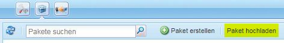

1. Verwenden Sie den Dateibrowser, um zur heruntergeladenen ZIP-Datei zu navigieren und diese auszuwählen.
1. Klicken Sie zum Hochladen auf &quot;Öffnen&quot;.
1. Wählen Sie nach dem Hochladen die Option &quot;Installieren&quot;, um das Paket zu installieren.

   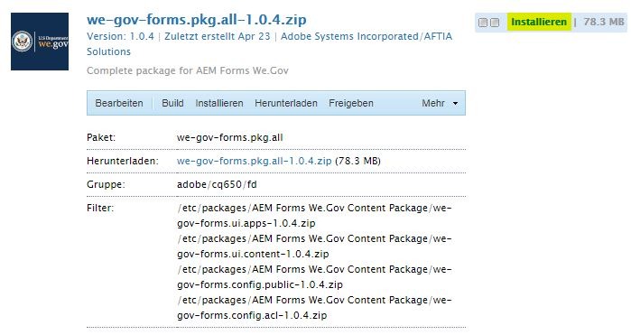

1. Warten Sie, bis der Installationsprozess abgeschlossen ist.
1. Navigieren Sie zu *https://&lt;aemserver>:&lt;port>/content/we-gov/home.html?wcmmode=disabled*, um sicherzustellen, dass die Installation erfolgreich war.

### Installieren neuer Paketversionen {#installing-new-package-versions}

Gehen Sie wie in 4.1 und 4.2 beschrieben vor, um eine neue Paketversion zu installieren. Es ist möglich, eine neuere Paketversion zu installieren, während ein anderes älteres Paket bereits installiert ist. Es wird jedoch empfohlen, die ältere Paketversion zuerst zu deinstallieren. Gehen Sie dazu wie folgt vor.

1. Navigieren Sie zu *https://&lt;aemserver>:&lt;port>/crx/packmgr/index.jsp*
1. Suchen Sie die ältere Datei **we-gov-forms.pkg.all-&lt;version>.zip**.
1. Wählen Sie die Option &quot;Mehr&quot;.
1. Wählen Sie aus der Dropdownliste die Option &quot;Deinstallieren&quot;.

   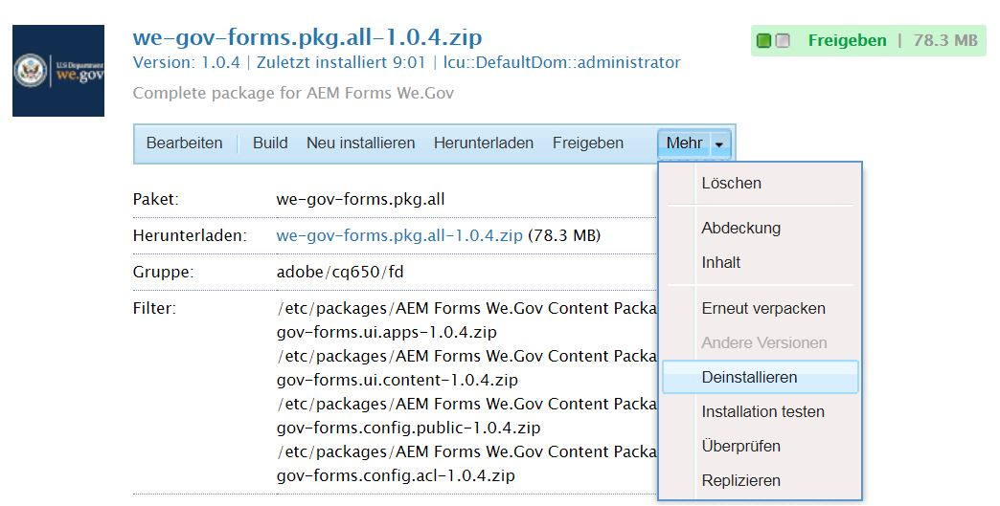

1. Wählen Sie bei der Bestätigung erneut &quot;Deinstallieren&quot;und lassen Sie den Deinstallationsprozess abschließen.

## Demopaket-Konfiguration {#demo-package-configuration}

Dieser Abschnitt enthält Details und Anweisungen zur Konfiguration des Demopakets nach der Bereitstellung vor der Präsentation.

### Fakultative Benutzerkonfiguration {#fictional-user-configuration}

1. Navigieren Sie zu *https://&lt;aemserver>:&lt;port>/libs/granite/security/content/groupadmin.html*
1. Melden Sie sich als Administrator an, um die unten stehenden Aufgaben durchzuführen.
1. Blättern Sie nach unten bis zum Ende der Seite, um alle Benutzergruppen zu laden.
1. Suchen Sie nach &quot;**workflow**&quot;.
1. Wählen Sie die Gruppe &quot;**workflow-users**&quot;und klicken Sie auf &quot;Eigenschaften&quot;.
1. Navigieren Sie zur Registerkarte &quot;Mitglieder&quot;.
1. Geben Sie in das Feld &quot;Benutzer oder Gruppe auswählen&quot;den Wert **wegov** ein.
1. Wählen Sie aus der Dropdownliste &quot;**We.Gov Forms Users**&quot;.

   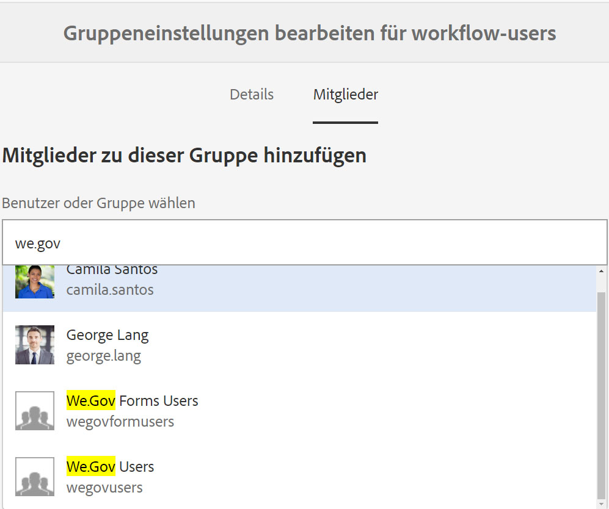

1. Klicken Sie in der Menüleiste auf &quot;Speichern &amp; Schließen&quot;.
1. Wiederholen Sie die Schritte 2-7, indem Sie nach &quot;**analytics**&quot;suchen, die Gruppe &quot;**Analytics-Administratoren**&quot;auswählen und die Gruppe &quot;**We.Gov-Forms-Benutzer**&quot;als Mitglied hinzufügen.
1. Wiederholen Sie die Schritte 2-7, indem Sie nach &quot;**Formularbenutzer**&quot;suchen, die Gruppe &quot;**forms-power-users**&quot;auswählen und die Gruppe &quot;**We.Gov Forms Users**&quot;als Mitglied hinzufügen.
1. Wiederholen Sie die Schritte 2-7, indem Sie nach &quot;**forms-users**&quot;suchen, die Gruppe &quot;**forms-users**&quot;auswählen und diesmal die Gruppe &quot;**We.Gov Users**&quot;als Mitglied hinzufügen.

### E-Mail-Serverkonfiguration {#email-server-configuration}

1. Überprüfen Sie die Setup-Dokumentation [E-Mail-Benachrichtigung konfigurieren](/help/sites-administering/notification.md)
1. Melden Sie sich als Administrator an, um diese Aufgabe durchzuführen.
1. Navigieren Sie zu *https://&lt;aemserver>:&lt;port>/system/console/configMgr*
1. Suchen Sie den Dienst **Day CQ Mail Service** und klicken Sie darauf, um ihn zu konfigurieren.

   

1. Konfigurieren Sie den Dienst, um eine Verbindung zum SMTP-Server Ihrer Wahl herzustellen:

   1. **Hostname** des SMTP-Servers: z. B. (smtp.gmail.com)
   1. **Serveranschluss**: z. B. (465) für Gmail mit SSL
   1. **SMTP-Benutzer:** demo@  &lt;companyname> .com
   1. **&quot;Von&quot;-Adresse**: aemformsdemo@adobe.com

   

1. Klicken Sie auf &quot;Speichern&quot;, um die Konfiguration zu speichern.

### (Optional) AEM SSL-Konfiguration {#aemsslconfig}

Dieser Abschnitt enthält Details zum Konfigurieren von SSL auf der AEM Instanz, um die Adobe Sign Cloud-Konfiguration konfigurieren zu können.

**Verweise:**

1. [Die Funktion „SSL By Default“ (SSL als Standard)](/help/sites-administering/ssl-by-default.md)

**Hinweise:**

1. Navigieren Sie zu https://&lt;aemserver>:&lt;port>/aem/inbox, wo Sie den unter dem Link zur Referenzdokumentation beschriebenen Prozess abschließen können.
1. Das `we-gov-forms.pkg.all-[version].zip`-Paket enthält einen SSL-Beispielschlüssel und ein Zertifikat, auf das zugegriffen werden kann, indem der `we-gov-forms.pkg.all-[version].zip/ssl`-Ordner extrahiert wird, der Teil des Pakets ist.

1. SSL-Zertifikat und Schlüsseldetails:

   1. herausgegeben an &quot;CN=localhost&quot;
   1. 10-jährige Gültigkeit
   1. password value of &quot;password&quot;
1. Der private Schlüssel ist *localhostprivate.der*.
1. Zertifikat ist *localhost.crt*.
1. Klicken Sie auf Weiter.
1. HTTPS-Hostname sollte auf *localhost* eingestellt werden.
1. Der Anschluss sollte auf einen Anschluss eingestellt sein, der vom System offen gelegt wurde.

### (Optional) Adobe Sign-Cloud-Konfiguration {#adobe-sign-cloud-configuration}

Dieser Abschnitt enthält Details und Anweisungen zur Adobe Sign Cloud-Konfiguration.

**Verweise:**

1. [Integrieren von Adobe Sign mit AEM Forms](adobe-sign-integration-adaptive-forms.md)

#### Cloud-Konfiguration {#cloud-configuration}

1. Überprüfen Sie die Voraussetzungen. Die erforderliche SSL-Konfiguration finden Sie unter [AEM SSL-Konfiguration](../../forms/using/forms-install-configure-gov-reference-site.md#aemsslconfig).
1. Navigieren Sie zu:

   *https://&lt;aemserver>:&lt;port>/libs/adobesign/cloudservices/adobesign.html/conf/we-gov*

   >[!NOTE]
   >
   >Die URL, die für den Zugriff auf den AEM-Server verwendet wird, sollte mit der URL übereinstimmen, die im Adobe Sign OAuth-Umleitungs-URI konfiguriert ist, um Konfigurationsprobleme zu vermeiden (z. *https://&lt;aemserver>:&lt;port>/mnt/overlay/adobesign/cloudservices/adobesign/properties.html*)

1. Wählen Sie die Konfiguration &quot;We.gov Adobe Sign&quot;.
1. Klicken Sie auf &quot;Eigenschaften&quot;.
1. Navigieren Sie zur Registerkarte &quot;Einstellungen&quot;.
1. Geben Sie die Auth-URL ein, z. B.: [https://secure.na1.echosign.com/public/oauth](https://secure.na1.echosign.com/public/oauth)
1. Geben Sie die konfigurierte Client-ID und den geheimen Clientschlüssel aus der konfigurierten Adobe Sign-Instanz ein.
1. Klicken Sie auf &quot;Mit Adobe Sign verbinden&quot;.
1. Klicken Sie nach erfolgreicher Verbindung auf &quot;Speichern &amp; Schließen&quot;, um die Integration abzuschließen.

### (Optional) MS Dynamics Cloud-Konfiguration {#ms-dynamics-cloud-configuration}

Dieser Abschnitt enthält Details und Anweisungen zur MS Dynamics Cloud-Konfiguration.

**Verweise:**

1. [Microsoft Dynamics OData-Konfiguration](https://docs.adobe.com/content/help/en/experience-manager-64/forms/form-data-model/ms-dynamics-odata-configuration.html)
1. [Konfigurieren von Microsoft Dynamics for AEM Forms](https://helpx.adobe.com/experience-manager/kt/forms/using/config-dynamics-for-aem-forms.html)

#### MS Dynamics OData Cloud Service {#ms-dynamics-odata-cloud-service}

1. Navigieren Sie zu:

   https://&lt;aemserver>:&lt;port>/libs/fd/fdm/gui/components/admin/fdmcloudservice/fdm.html/conf/we-gov

   1. Stellen Sie sicher, dass Sie auf den Server mit derselben Umleitungs-URL zugreifen, die in der Registrierung der MS Dynamics-Anwendung konfiguriert ist.

1. Wählen Sie die Konfiguration &quot;Microsoft Dynamics OData Cloud Service&quot;.
1. Klicken Sie auf &quot;Eigenschaften&quot;.

   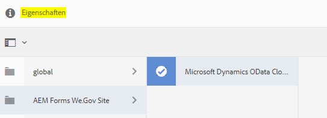

1. Navigieren Sie zur Registerkarte &quot;Authentifizierungseinstellungen&quot;.
1. Geben Sie die folgenden Details ein:

   1. **Dienststamm:** z. B. https://msdynamicsserver.api.crm3.dynamics.com/api/data/v9.1/
   1. **Authentifizierungstyp:** OAuth 2.0
   1. **Authentifizierungseinstellungen**  (siehe  [MS Dynamics Cloud-Konfigurationseinstellungen ](../../forms/using/forms-install-configure-gov-reference-site.md#dynamicsconfig) zur Erfassung dieser Informationen):

      1. Client-ID - auch als Anwendungs-ID bezeichnet
      1. Client-Geheimnis
      1. OAuth-URL - z. B. [https://login.windows.net/common/oauth2/authorize](https://login.windows.net/common/oauth2/authorize)
      1. Aktualisieren der Token-URL, z. B. [https://login.windows.net/common/oauth2/token](https://login.windows.net/common/oauth2/token)
      1. Zugriffstoken-URL - z. B. [https://login.windows.net/common/oauth2/token](https://login.windows.net/common/oauth2/token)
      1. Autorisierungsbereich - **openid**
      1. Authentifizierungskopfzeile - **Autorisierungsanbieter**
      1. Ressource - z. B. [https://msdynamicsserver.api.crm3.dynamics.com](https://msdynamicsserver.api.crm3.dynamics.com)
   1. Klicken Sie auf &quot;Mit OAuth verbinden&quot;.

1. Klicken Sie nach erfolgreicher Authentifizierung auf &quot;Speichern und schließen&quot;, um die Integration abzuschließen.

#### MS Dynamics Cloud-Konfigurationseinstellungen {#dynamicsconfig}

Die Schritte, die in diesem Abschnitt beschrieben werden, helfen Ihnen, die Client-ID, den geheimen Clientschlüssel und Details aus Ihrer MS Dynamics Cloud-Instanz zu finden.

1. Navigieren Sie zu [https://portal.azure.com/](https://portal.azure.com/) und melden Sie sich an.
1. Wählen Sie im Menü links &quot;Alle Dienste&quot;.
1. Suchen Sie nach &quot;App-Registrierung&quot;oder navigieren Sie zu &quot;App-Registrierung&quot;.
1. Erstellen oder wählen Sie eine bestehende Anwendungsregistrierung aus.
1. Kopieren Sie die **Anwendungs-ID**, die als OAuth **Client-ID** in der AEM Cloud-Konfiguration verwendet werden soll.
1. Klicken Sie auf &quot;Einstellungen&quot; oder &quot;Manifest&quot;, um die **Antworten-URLs zu konfigurieren.**

   1. Diese URL muss mit der URL übereinstimmen, die beim Konfigurieren des OData-Dienstes für den Zugriff auf Ihren AEM-Server verwendet wird.

1. Klicken Sie in der Ansicht &quot;Einstellungen&quot;auf &quot;Schlüssel&quot;, um einen neuen Schlüssel zu erstellen (dieser wird als geheimer Clientschlüssel in AEM verwendet).

   1. Achten Sie darauf, eine Kopie des Schlüssels zu behalten, da Sie nicht in der Lage sein, es später in Azurblaus oder AEM.

1. Um die Ressourcen-URL/Dienststamm-URL zu suchen, navigieren Sie zum Dashboard MS Dynamics-Instanz.
1. Klicken Sie in der oberen Navigationsleiste auf &quot;Vertrieb&quot;oder Ihren eigenen Instanztyp und &quot;Einstellungen auswählen&quot;.
1. Klicken Sie unten rechts auf &quot;Anpassungen&quot; und &quot;Entwicklerressourcen&quot;.
1. Dort finden Sie die Dienststamm-URL: z.B.

   *[https://msdynamicsserver.api.crm3.dynamics.com/api/data/v9.1/](https://msdynamicsserver.api.crm3.dynamics.com/api/data/v9.1/)*

1. Details zur Aktualisieren- und Zugriffstoken-URL finden Sie hier:

   *[https://docs.microsoft.com/en-us/rest/api/datacatalog/authenticate-a-client-app](https://docs.microsoft.com/en-us/rest/api/datacatalog/authenticate-a-client-app)*

#### Testen des Forms-Datenmodells (Dynamics) {#testing-the-form-data-model}

Nach Abschluss der Cloud-Konfiguration sollten Sie das Formulardatenmodell testen.

1. Navigieren Sie zu

   *https://&lt;aemserver>:&lt;port>/aem/forms.html/content/dam/formsanddocuments-fdm/we-gov*

1. Wählen Sie &quot;We.gov Microsoft Dynamics CRM FDM&quot; und wählen Sie &quot;Eigenschaften&quot;.

   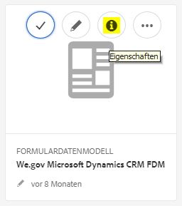

1. Navigieren Sie zur Registerkarte &quot;Quelle aktualisieren&quot;.
1. Stellen Sie sicher, dass die &quot;Context-Aware-Konfiguration&quot;auf &quot;/conf/we-gov&quot;eingestellt ist und dass die konfigurierte Datenquelle &quot;ms-dynamik-odata-cloud-service&quot;lautet.

   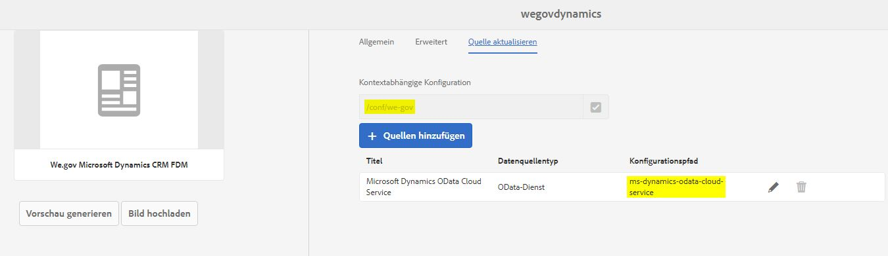

1. Bearbeiten Sie das Formulardatenmodell.

1. Testen Sie die Dienste, um sicherzustellen, dass sie erfolgreich eine Verbindung zur konfigurierten Datenquelle herstellen.

   >[!NOTE]
   Klicken Sie nach dem Testen der Dienste auf **Abbrechen**, um sicherzustellen, dass unbeabsichtigte Änderungen nicht an das Formulardatenmodell weitergegeben werden.

   >[!NOTE]
   Es wurde berichtet, dass ein Neustart AEM Servers erforderlich war, damit die Datenquelle erfolgreich an den FDM gebunden werden konnte.

#### Testen des Forms-Datenmodells (Derby) {#test-fdm-derby}

Nach Abschluss der Cloud-Konfiguration sollten Sie das Formulardatenmodell testen.

1. Navigieren Sie zu *https://&lt;aemserver>:&lt;port>/aem/forms.html/content/dam/formsanddocuments-fdm/we-gov*

1. Wählen Sie den FDM **We.gov Enrollment FDM** und wählen Sie **Eigenschaften**.

   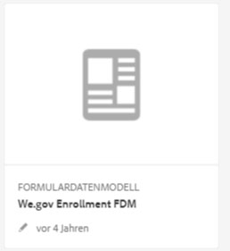

1. Navigieren Sie zur Registerkarte **Quelle aktualisieren**.

1. Stellen Sie sicher, dass die **Context-Aware-Konfiguration** auf `/conf/we-gov` eingestellt ist und dass die konfigurierte Datenquelle **We.Gov Derby DS** lautet.

   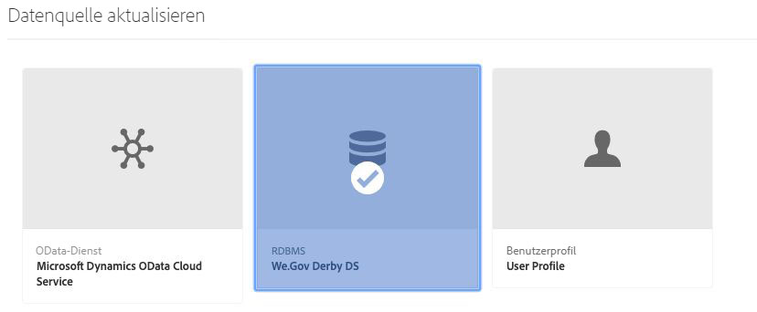

1. Klicken Sie auf **Speichern und Schließen**.

1. [Testen Sie die ](work-with-form-data-model.md#test-data-model-objects-and-services) Dienste, um sicherzustellen, dass sie erfolgreich eine Verbindung zur konfigurierten Datenquelle herstellen

   * Um die Verbindung zu testen, wählen Sie **HOMEMORTGAGEACCOUNT** und geben Sie ihr einen get-Dienst. Testen Sie den Dienst und Systemadministratoren können sehen, wie Daten abgerufen werden.

### Adobe Analytics-Konfiguration (optional) {#adobe-analytics-configuration}

Dieser Abschnitt enthält Details und Anweisungen zur Adobe Analytics Cloud-Konfiguration.

**Verweise:**

* [Integration mit Adobe Analytics](../../sites-administering/adobeanalytics.md)

* [Herstellen einer Verbindung mit Adobe Analytics und Erstellen von Frameworks](../../sites-administering/adobeanalytics-connect.md)

* [Anzeigen von Seitenanalysedaten](../../sites-authoring/pa-using.md)

* [Konfigurieren von Analysen und Berichten](configure-analytics-forms-documents.md)

* [Anzeigen und Verstehen der Analytics-Berichte in AEM Forms](view-understand-aem-forms-analytics-reports.md)

### Adobe Analytics Cloud-Dienstkonfiguration {#adobe-analytics-cloud-service-configuration}

Dieses Paket ist für die Verbindung mit Adobe Analytics vorkonfiguriert. Die folgenden Schritte werden zur Aktualisierung dieser Konfiguration bereitgestellt.

1. Navigieren Sie zu *https://&lt;aemserver>:&lt;port>/libs/cq/core/content/tools/cloudservices.html*
1. Suchen Sie im Abschnitt &quot;Adobe Analytics&quot;den Link &quot;Konfigurationen anzeigen&quot;.
1. Wählen Sie die Konfiguration &quot;We.Gov Adobe Analytics (Analytics-Konfiguration)&quot;aus.

   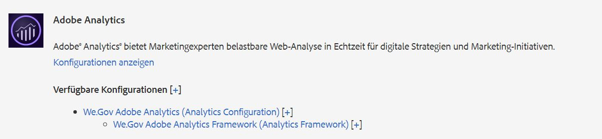

1. Klicken Sie auf die Schaltfläche &quot;Bearbeiten&quot;, um die Adobe Analytics-Konfiguration zu aktualisieren (Sie müssen das Shared Secret angeben). Klicken Sie auf &quot;Verbindung zu Analytics herstellen&quot;, um eine Verbindung herzustellen, und auf &quot;OK&quot;, um die Verbindung abzuschließen.

   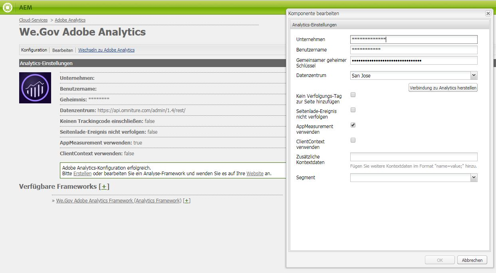

1. Klicken Sie auf derselben Seite auf &quot;We.Gov Adobe Analytics Framework (Analytics Framework)&quot;, wenn Sie die Framework-Konfigurationen aktualisieren möchten (siehe [Aktivieren Sie AEM Authoring](../../forms/using/forms-install-configure-gov-reference-site.md#enableauthoring), um Authoring zu aktivieren).

#### Adobe Analytics mit Benutzeranmeldeinformationen {#analytics-locating-user-credentials}

Um die Benutzeranmeldeinformationen für ein Adobe Analytics-Konto zu finden, muss der Kontoadministrator die folgenden Aufgaben ausführen.

1. Navigieren Sie zum Adobe Experience Cloud-Portal.
   * Anmelden mit Ihren Administratoranmeldeinformationen
1. Wählen Sie im Hauptmenü das Symbol Adobe Analytics aus.
   
1. Navigieren Sie zur Registerkarte &quot;Admin&quot;und wählen Sie das Element &quot;Benutzerverwaltung (Legacy)&quot;aus.
   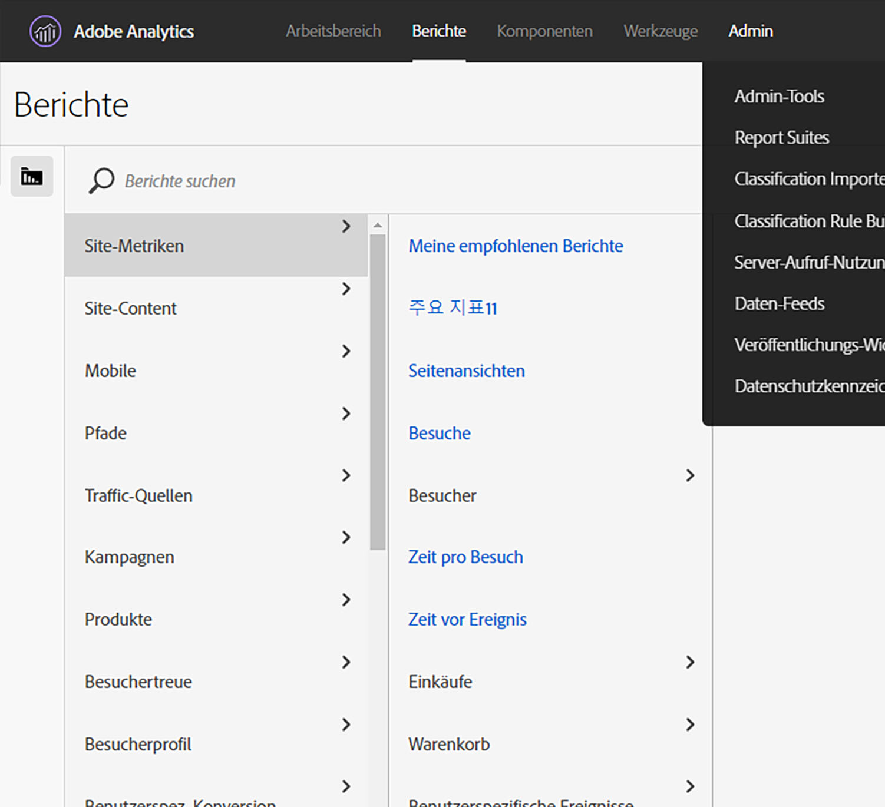
1. Wählen Sie die Registerkarte **Benutzer**.
   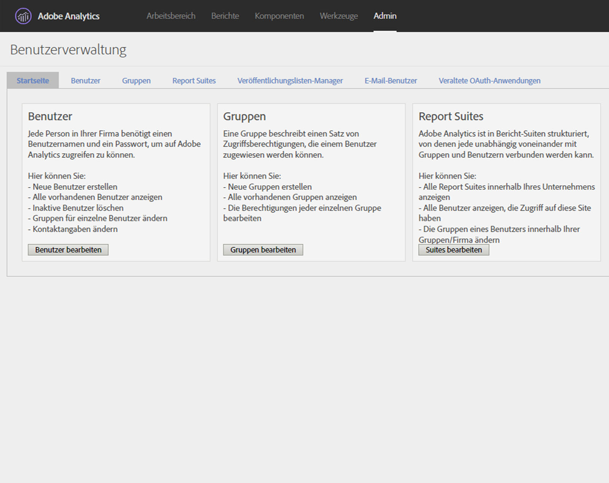
1. Wählen Sie in der Liste der Benutzer den gewünschten Benutzer aus.
1. Blättern Sie nach unten auf der Seite, und die Authentifizierungsinformationen für Benutzer werden unten auf der Seite angezeigt.
   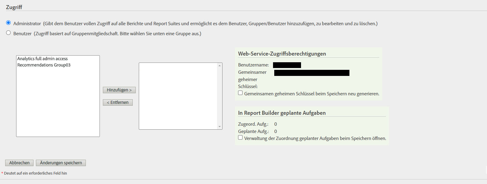
1. Der Benutzername und die Shared-Secret-Informationen werden auf der rechten Seite des Berechtigungsfelds angezeigt.
1. Beachten Sie, dass der Benutzername einen Doppelpunkt im Namen enthält. Alle Informationen links vom Doppelpunkt sind der Benutzername und alle Informationen rechts vom Doppelpunkt sind der Name der Firma.
   * Hier ein Beispiel: *Benutzername: Name der Firma*

#### Einrichten der Benutzerauthentifizierung in Adobe Analytics {#setup-user-authentication}

Administratoren können Benutzern AEM Analyseberechtigungen erteilen, indem sie die folgenden Aktionen ausführen.

1. Navigieren Sie zum Adobe Admin Console.

1. Klicken Sie auf die Analytics-Instanz, die der Admin-Konsole angezeigt wird.

   * Dieser befindet sich auf der Hauptseite der Admin-Seite.

1. Wählen Sie Analytics mit vollem Administratorzugriff.

1. hinzufügen einem Benutzer zum Profil.

   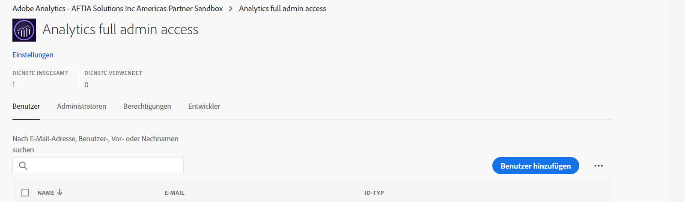

1. Klicken Sie auf die Registerkarte &quot;Berechtigungen&quot;, nachdem die Benutzer-ID dem Profil zugeordnet wurde.

1. Vergewissern Sie sich, dass dem Profil alle Berechtigungen zugeordnet sind.

   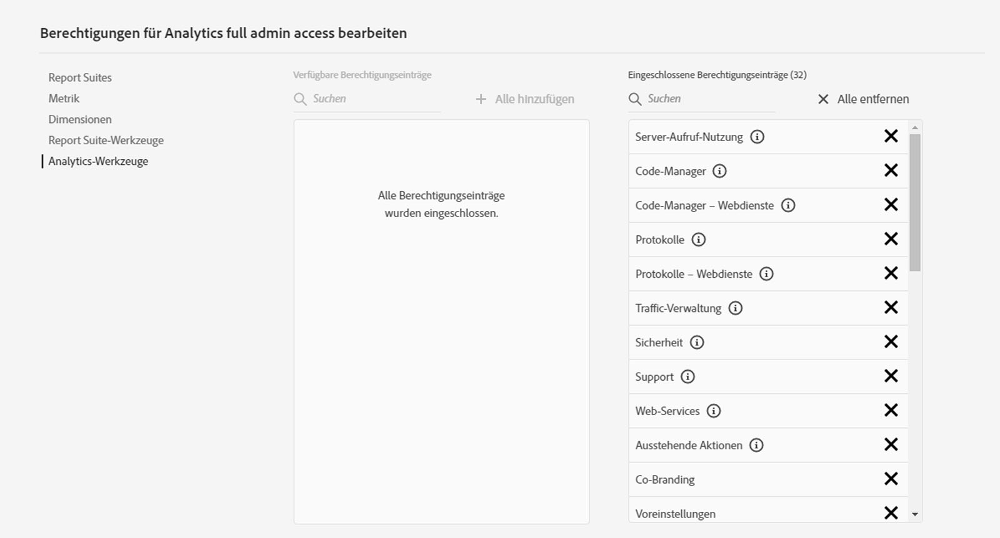

1. Beachten Sie, dass es nach der Zuordnung der Berechtigungen einige Stunden dauern kann, bis ein Benutzer sich anmelden kann.

### Adobe Analytics Berichte {#adobe-analytics-reporting}

#### Ansicht Adobe Analytics Sites Berichte {#view-adobe-analytics-sites-reporting}

>[!NOTE]
AEM Forms Analytics-Daten sind im Offline- oder ohne Adobe Analytics-Cloud-Konfiguration verfügbar, wenn das `we-gov-forms.ui.analytics-<version>.zip`-Paket installiert ist. Für AEM Sites-Daten ist jedoch eine aktive Cloud-Konfiguration erforderlich.

1. Navigieren Sie zu *https://&lt;aemserver>:&lt;port>/sites.html/content*
1. Wählen Sie die &quot;AEM Forms We.Gov Site&quot;, um die Seiten der Website Ansicht.
1. Wählen Sie eine der Siteseiten (z.B. Home) und wählen Sie &quot;Analytics &amp; Recommendations&quot;.

   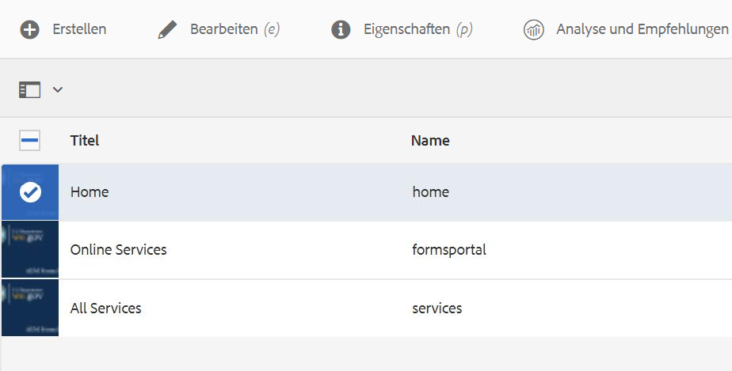

1. Auf dieser Seite sehen Sie Informationen aus Adobe Analytics, die zur Seite AEM Sites gehören (Hinweis: Diese Informationen werden von Adobe Analytics regelmäßig aktualisiert und nicht in Echtzeit angezeigt.

   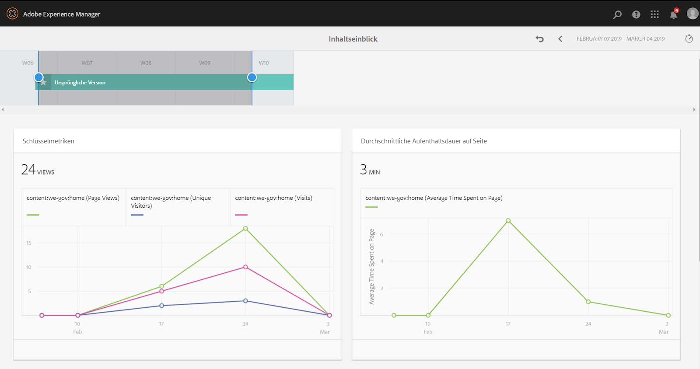

1. Zurück auf der Seite &quot;Ansicht&quot;(Zugriff in Schritt 3) können Sie die Seiteninformationen auch durch Ändern der Anzeigeeinstellung in &quot;Ansicht&quot;-Elemente in der Ansicht &quot;Liste&quot; Ansicht der Ansicht ändern.
1. Suchen Sie das Dropdown-Menü &quot;Ansicht&quot;und wählen Sie &quot;Liste Ansicht&quot;.

   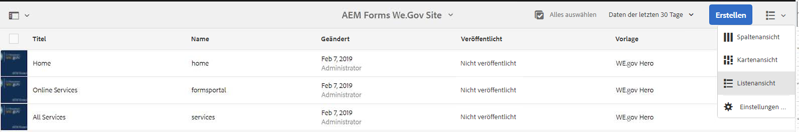

1. Wählen Sie im gleichen Menü die Option &quot;Ansicht einstellen&quot;und wählen Sie die anzuzeigenden Spalten im Bereich &quot;Analytics&quot;aus.

   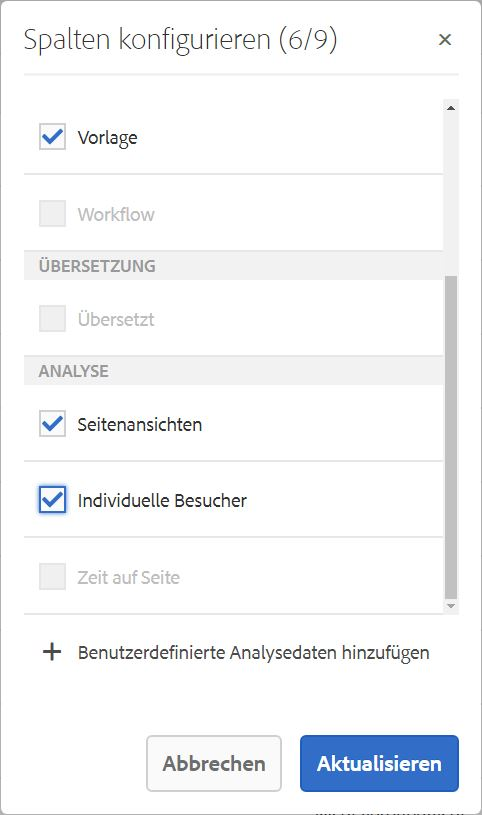

1. Klicken Sie auf &quot;Aktualisieren&quot;, um die neuen Spalten verfügbar zu machen.

   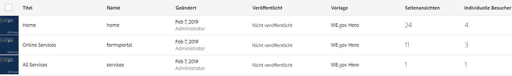

#### Ansicht Adobe Analytics Forms Berichte {#view-adobe-analytics-forms-reporting}

>[!NOTE]
AEM Forms Analytics-Daten sind im Offline- oder ohne Adobe Analytics-Cloud-Konfiguration verfügbar, wenn das `we-gov-forms.ui.analytics-<version>.zip`-Paket installiert ist. Für AEM Sites-Daten ist jedoch eine aktive Cloud-Konfiguration erforderlich.

1. Navigieren Sie zu

   *https://&lt;aemserver>:&lt;port>/aem/forms.html/content/dam/formsanddocuments/adobe-gov-forms*

1. Wählen Sie das adaptive Formular &quot;Registrierungsantrag für Gesundheitsvorteile&quot;und dann die Option &quot;Analytics-Bericht&quot;.

   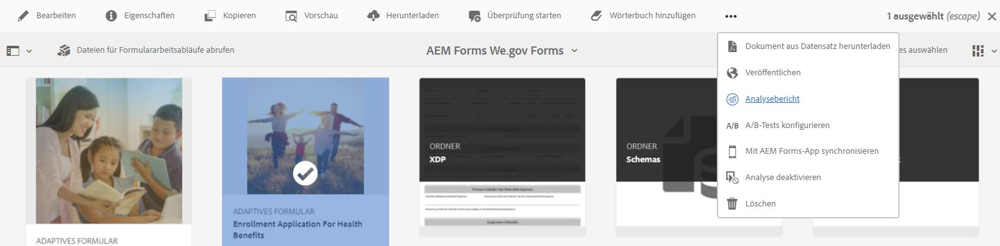

1. Warten Sie, bis die Seite geladen wurde, und Ansicht der Analytics-Berichtsdaten.

   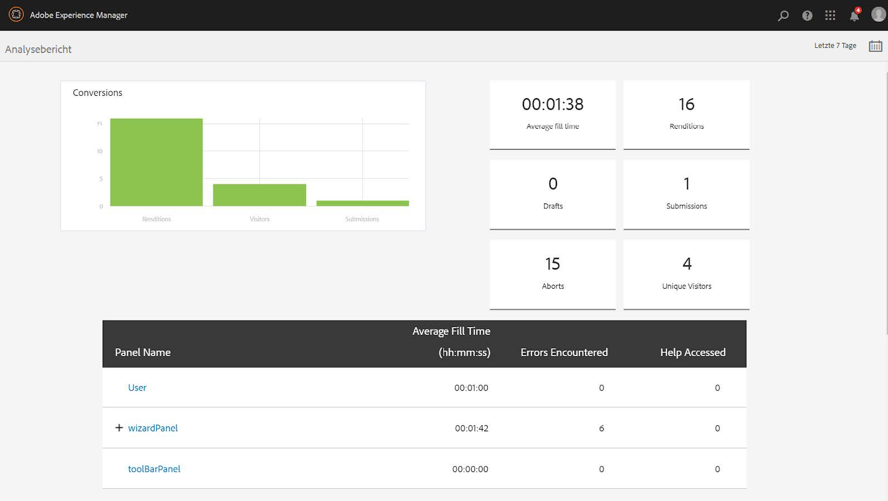

### Adobe-Automatisierte Forms-Konfigurationsaktivierung {#automated-forms-enablement}

Um AEM Forms mit der Adobe Forms zu installieren und zu konfigurieren, müssen die Benutzer des Umrechnungstools über Folgendes verfügen.

1. Zugang zu Adobe I/O.

1. Berechtigung zum Erstellen einer Integration mit dem Forms Conversion-Dienst der Adobe.

1. Adobe AEM 6.5 Service Pack, das als Autor ausgeführt wird.

Bitte lesen Sie die folgenden Hinweise, bevor Sie weitere Anweisungen lesen:

* [Dienst zur automatischen Formularkonvertierung konfigurieren](https://docs.adobe.com/content/help/en/aem-forms-automated-conversion-service/using/configure-service.html)

#### Erstellen einer IMS-Konfiguration Teil 1 {#creating-ims-config}

Um den Dienst für eine korrekte Kommunikation mit dem Formular-Konvertierungstool zu konfigurieren, müssen die Benutzer den Dienst Identity Management System (IMS) konfigurieren, damit sie sich bei Adobe I/O registrieren können.

1. Navigieren Sie zu https://&lt;aemserver>: &lt;port> > Klicken Sie auf Adobe Experience
Manager oben links > Tools > Security > Adobe IMS Configuration.

1. Klicken Sie auf Erstellen.

1. Führen Sie die Aktionen in der Abbildung unten durch.

   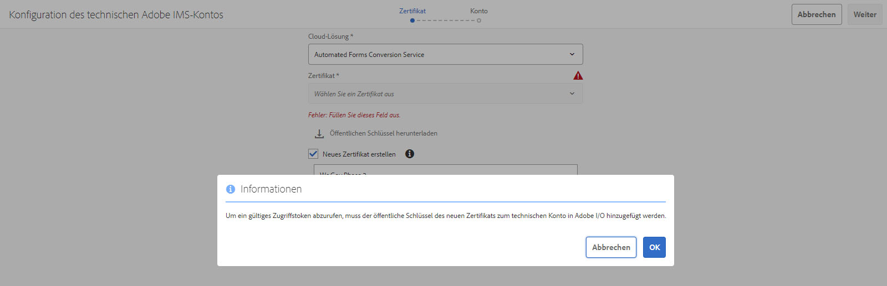

1. Laden Sie das Zertifikat unbedingt herunter.

1. Fahren Sie nicht mit dem Rest der Konfiguration fort - Abschnitt [Integration in Adobe I/O erstellen](#create-integration-adobeio)

>[!NOTE]
Das in diesem Abschnitt erstellte Zertifikat wird verwendet, um den Integrationsdienst in Adobe I/O zu erstellen. Sobald die Benutzer im Integrationsdienst erstellt haben, können sie diese Informationen aus Adobe I/O verwenden, um die Konfiguration abzuschließen.

#### Integration in Adobe I/O {#create-integration-adobeio}

Vergewissern Sie sich, dass Sie die Möglichkeit haben, eine Integration in Ihrer Adobe-Domäne zu erstellen, wenn Sie sich hierzu nicht an Ihren Systemadministrator wenden.

1. Navigieren Sie zur [Adobe I/O-Konsole](https://console.adobe.io/).

1. Klicken Sie auf Integration erstellen.

1. Wählen Sie Zugriff auf eine API.

1. Vergewissern Sie sich, dass Sie sich in der richtigen Liste befinden (Dropdown-Liste oben rechts).

1. Wählen Sie im Bereich Experience Cloud das Forms-Konvertierungstool.

1. Klicken Sie auf Weiter.

1. Geben Sie den Namen und die Beschreibung Ihrer Integration ein.

1. Mit dem öffentlichen Schlüssel aus Abschnitt 2.1 fügen Sie ihn in die Integration des Schlüssels ein.

1. Wählen Sie ein Profil für Ihre automated forms conversion aus.

   

#### Erstellen der IMS-Konfiguration Teil 2 {#create-ims-config-part-next}

Nachdem Sie eine Integration erstellt haben, können wir die Installation der IMS-Konfiguration abschließen.

1. Klicken Sie auf Ihre Integration in Adobe I/O, um die Verbindungsdetails anzuzeigen.

1. Navigieren Sie zu Ihrer IMS-Konfiguration in AEM (&quot;Tools&quot;> &quot;Sicherheit&quot;> &quot;IMS&quot;)

1. Klicken Sie im Bildschirm &quot;IMS-Konfiguration&quot;auf Weiter.

1. Geben Sie den Autorisierungsserver ein (im Screenshot angezeigter Wert).

1. Geben Sie den API-Schlüssel ein.

1. Geben Sie den geheimen Clientschlüssel ein (muss auf der Integration in Adobe I/O offen legen klicken, damit er angezeigt wird).

1. Klicken Sie in Adobe I/O auf die Registerkarte JWT, um die JWT-Nutzlast abzurufen und in die Nutzlast der IMS-Konfiguration einzufügen.

   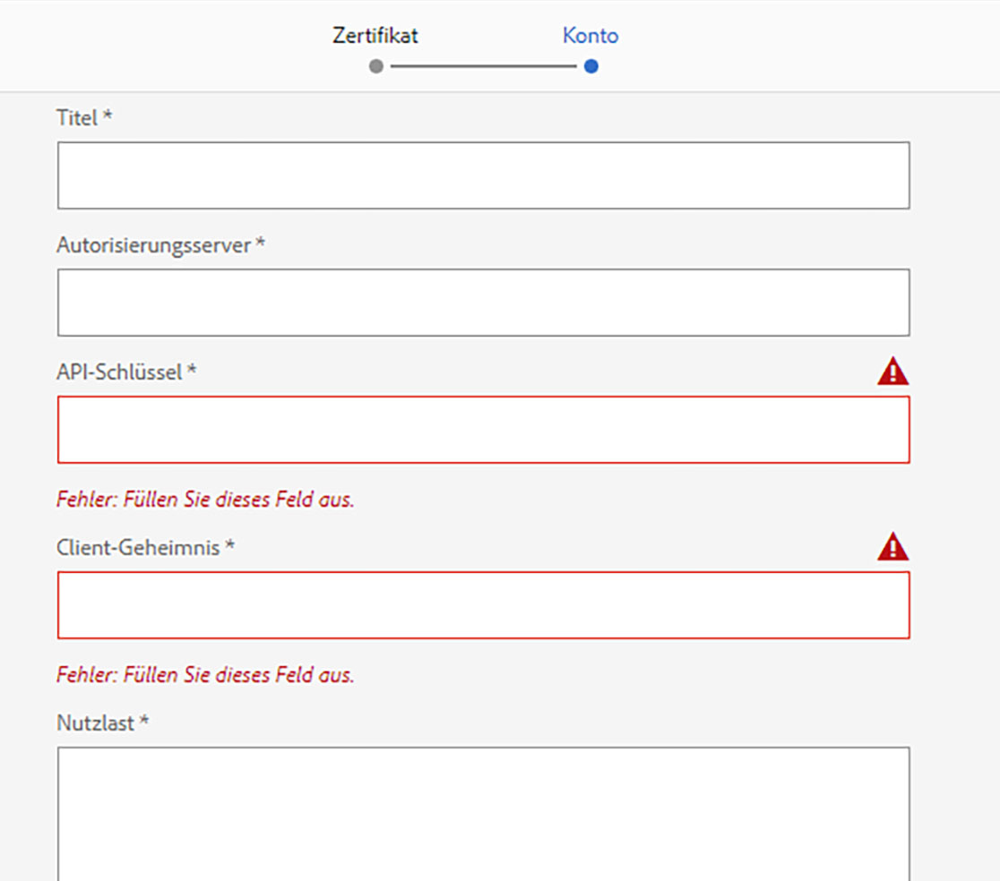

1. Nach der Erstellung klicken Sie auf die IMS-Konfiguration und wählen Sie Health Check aus. Benutzer sollten das folgende Ergebnis sehen.

   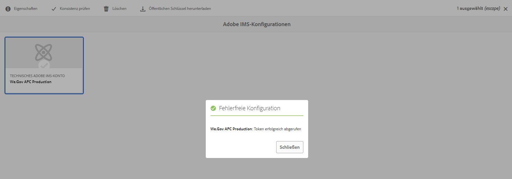

#### Konfigurieren der Cloud-Konfiguration (We.Gov AFC Production) {#configure-cloud-configuration}

Sobald die IMS-Konfiguration abgeschlossen ist, können wir die Cloud-Konfiguration in AEM überprüfen. Wenn die Konfiguration nicht vorhanden ist, führen Sie die folgenden Schritte aus, um die Cloud-Konfiguration in AEM zu erstellen:

1. Öffnen Sie den Browser und navigieren Sie zur System-URL https://&lt;domain_name>:&lt;system_port>

1. Klicken Sie in der oberen linken Ecke des Bildschirms auf Adobe Experience Manager > Extras > Cloud Services > Automatisierte Forms-Konversationskonfiguration.

1. Wählen Sie den Konfigurationsordner aus, in dem Sie die Konfiguration ablegen möchten.

1. Klicken Sie auf Erstellen.

1. Geben Sie die Informationen in den Screenshot unten ein.

   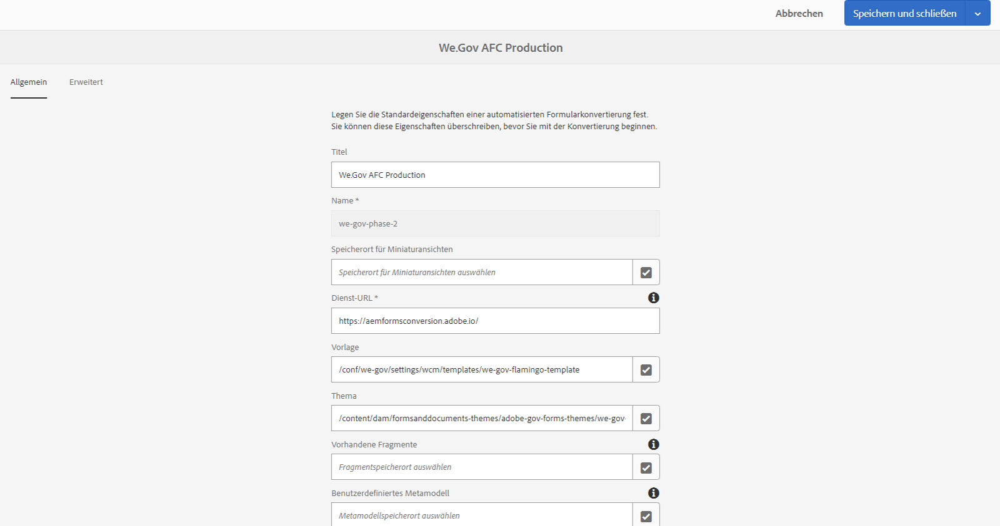

1. Geben Sie der Konfiguration einen Titel und einen Namen ein.

1. Die Dienst-URL für das System ist auf https://aemformsconversion.adobe.io/ eingestellt.

1. Vorlagen-URL */conf/we-gov/settings/wcm/templates/we-gov-flamingo-template*.

1. Design-URL: */content/dam/formsanddocuments-Themen/adobe-gov-forms-Themen/we-gov-theme*

1. Klicken Sie auf Weiter.

1. Für diese Konfiguration bleiben die beiden Kontrollkästchenwerte leer.

   * Weitere Informationen zu diesen Optionen finden Sie unter [Cloud-Dienst konfigurieren](https://docs.adobe.com/content/help/en/aem-forms-automated-conversion-service/using/configure-service.html#configure-the-cloud-service).

#### Konfigurieren der Cloud-Konfiguration (We.Finance AFC Production) {#configure-cloud-configuration-wefinance}

Sobald die IMS-Konfiguration abgeschlossen ist, können wir die Cloud-Konfiguration in AEM erstellen.

1. Öffnen Sie den Browser und navigieren Sie zur System-URL https://&lt;domain_name>:&lt;system_port>

1. Klicken Sie in der oberen linken Ecke des Bildschirms auf Adobe Experience Manager > Extras > Cloud Services > Automatisierte Forms-Konversationskonfiguration.

1. Wählen Sie den Konfigurationsordner aus, in dem Sie die Konfiguration ablegen möchten.

1. Klicken Sie auf Erstellen.

1. Geben Sie die Informationen in den Screenshot unten ein.

   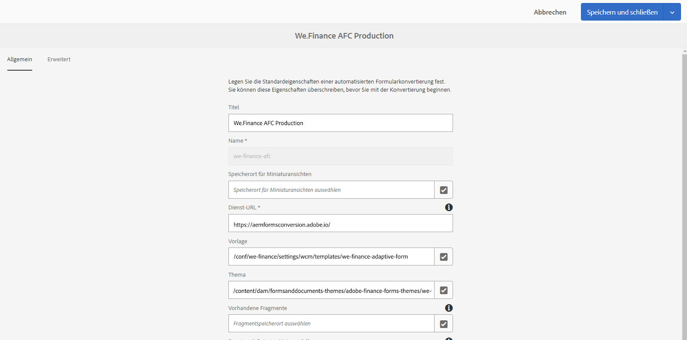

1. Geben Sie der Konfiguration einen Titel und einen Namen ein.

1. Die Dienst-URL für das System ist auf https://aemformsconversion.adobe.io/ eingestellt.

1. Vorlagen-URL: */conf/we-finance/settings/wcm/templates/we-finance-adaptive-form*

1. Design-URL: */content/dam/formsanddocuments-Themen/adobe-finance-forms-Themen/we-finance-theme*

1. Klicken Sie auf Weiter.

1. Für diese Konfiguration bleiben die beiden Kontrollkästchenwerte leer.

   * Weitere Informationen zu diesen Optionen finden Sie unter [Cloud-Dienst konfigurieren](https://docs.adobe.com/content/help/en/aem-forms-automated-conversion-service/using/configure-service.html#configure-the-cloud-service).

#### Testen der Formularumrechnung (We.Gov-Registrierungsanwendung) {#test-forms-conversion}

Sobald die Konfiguration eingerichtet ist, können Benutzer sie testen, indem sie ein PDF-Dokument hochladen.

1. Navigieren Sie zum AEM System https://&lt;domain_name>:&lt;system_port>

1. Klicken Sie auf Forms > Forms &amp; Dokumente > AEM Forms We.gov Forms > AFC.

1. Wählen Sie die PDF-Datei &quot;We.Gov Enrollment Application&quot;.

1. Klicken Sie oben rechts auf die Schaltfläche **Beginn Automatisierte Konversion**.

1. Benutzer sollten die Option wie unten dargestellt sehen können.

   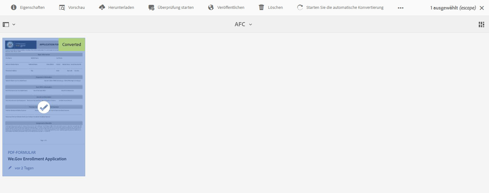

1. Nach Auswahl der Schaltfläche werden den Benutzern die folgenden Optionen angezeigt

   * Stellen Sie sicher, dass die Benutzer die Konfiguration *We.Gov AFC Production* auswählen

   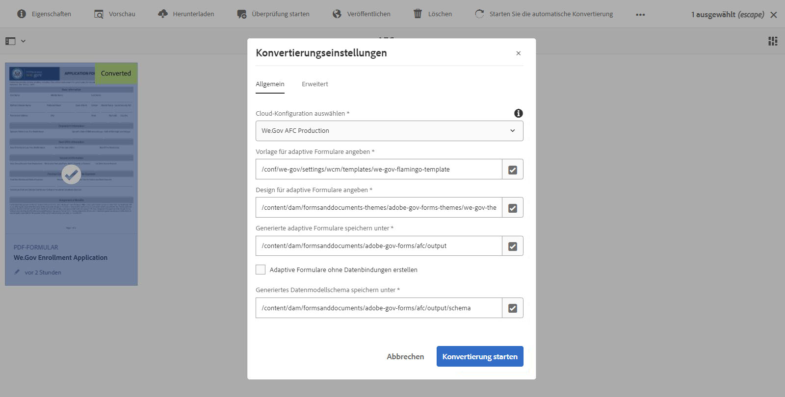

   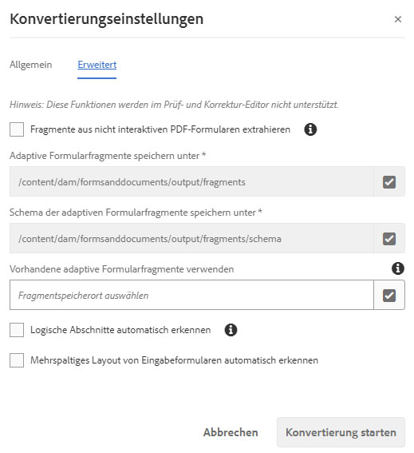

1. Wählen Sie die Konvertierung des Beginns aus, nachdem Sie alle gewünschten Optionen konfiguriert haben.

1. Wenn der Konvertierungsprozess beginnt, sollte den Benutzern der folgende Bildschirm angezeigt werden:

   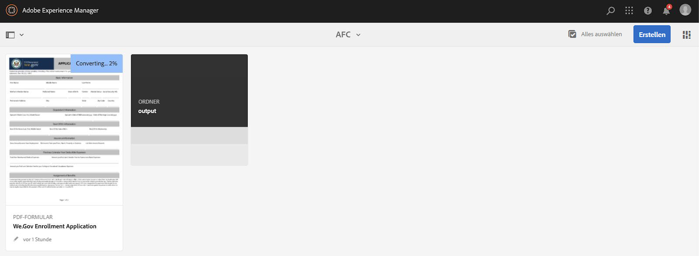

1. Nach Abschluss der Konvertierung wird dem Benutzer der folgende Bildschirm angezeigt:

   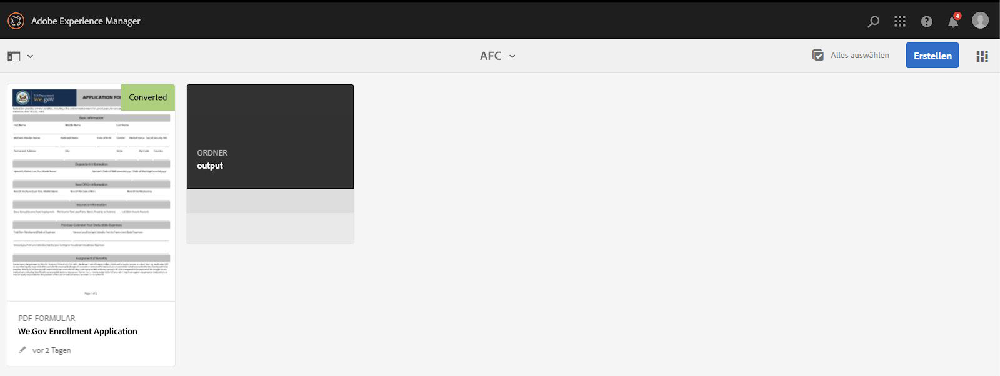

   Klicken Sie auf den Ordner **Output**, um das erstellte adaptive Formular Ansicht.

#### Bekannte Probleme und Hinweise {#known-issues-notes}

Der Automated forms conversion-Dienst umfasst bestimmte [Best Practices, bekannte komplexe Muster](https://docs.adobe.com/content/help/en/aem-forms-automated-conversion-service/using/styles-and-pattern-considerations-and-best-practices.html) und [bekannte Probleme](https://docs.adobe.com/content/help/en/aem-forms-automated-conversion-service/using/known-issues.html). Überprüfen Sie diese, bevor Sie mit der Verwendung des AEM Forms Automated forms conversion-Dienstes beginnen.

1. Generieren Sie das Formular mit aktivierten Generate adaptive form(s) without data bindings, wenn Sie das Formular nach der Konvertierung an ein FDM binden möchten.

1. Vergewissern Sie sich, dass im Vorlagenordner die Berechtigung &quot;jcr:read&quot;aktiviert ist. Andernfalls kann der Dienstbenutzer die Vorlage nicht aus dem Repository lesen, und die Konvertierung schlägt fehl.

## Anpassung des Demopakets {#demo-package-customizations}

Dieser Abschnitt enthält Anweisungen zur Anpassung der Demo.

### Vorlagenanpassung {#templates-customization}

Bearbeitbare Vorlagen finden Sie unter:

*https://&lt;aemserver>:&lt;port>/libs/wcm/core/content/sites/templates.html/conf/we-gov*

Zu diesen Vorlagen gehören die Vorlagen für AEM Site, adaptive Formulare und interaktive Kommunikation, die mit Komponenten erstellt und zusammengestellt werden, die Sie finden unter:

*https://&lt;aemserver>:&lt;port>/crx/de/index.jsp#/apps/we-gov/components*

#### Stilsystem {#customizetemplates}

Auf dieser Website finden Sie auch Client-Bibliotheken, von denen einer Bootstrap 4 importiert ( [https://getbootstrap.com/](https://getbootstrap.com/) ). Diese Client-Bibliothek ist verfügbar unter

*https://&lt;aemserver>:&lt;port>/crx/de/index.jsp#/apps/we-gov/clientlibs/clientlib-base/css/bootstrap*

Die in diesem Paket enthaltenen bearbeitbaren Vorlagen sind auch mit Vorlagen-/Seitenrichtlinien vorkonfiguriert, die die CSS-Klassen von Bootstrap 4 für Paginierung, Formatierung usw. verwenden. Nicht alle Klassen wurden den Vorlagenrichtlinien hinzugefügt, aber alle Klassen, die von Bootstrap 4 unterstützt werden, können den Richtlinien hinzugefügt werden. Eine Liste der verfügbaren Klassen finden Sie auf der Seite &quot;Erste Schritte&quot;:

[https://getbootstrap.com/docs/4.1/getting-started/introduction/](https://getbootstrap.com/docs/4.1/getting-started/introduction/)

Die in diesem Paket enthaltenen Vorlagen unterstützen auch das Stilsystem:

[Stilsystem](../../sites-authoring/style-system.md)

#### Vorlagenlogos {#template-logos}

Die DAM Assets des Projekts enthalten auch We.Gov-Logos und -Bilder. Diese Assets sind verfügbar unter:

*https://&lt;aemserver>:&lt;port>/assets.html*

Beim Bearbeiten der Seiten- und Formularvorlagen können Sie die Markenlogos durch Bearbeiten der Komponenten Navigation und Fußzeile aktualisieren. Diese Komponenten Angebot eines konfigurierbaren Dialogfelds für Marke und Logo, mit dem Logos aktualisiert werden können:

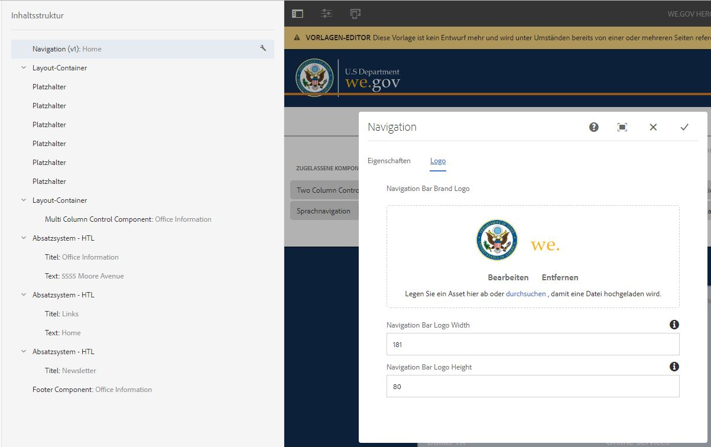

Weitere Informationen finden Sie unter Bearbeiten von Seiteninhalten:

[Bearbeiten des Seiteninhalts](../../sites-authoring/editing-content.md)

### Seiten-Anpassung {#sites-pages-customization}

Alle Siteseiten stehen zur Verfügung unter: *https://&lt;aemserver>:&lt;port>/sites.html/content/we-gov*

Diese Siteseiten nutzen auch das AEM-Rasterpaket, um das Layout einiger Komponenten zu steuern.

#### Stilsystem {#style-system}

Die in diesem Paket enthaltenen Seiten unterstützen auch das Stilsystem:

[Stilsystem](../../sites-authoring/style-system.md)

Die Dokumentation zu unterstützten Stilen finden Sie auch unter [Templates customization style system](../../forms/using/forms-install-configure-gov-reference-site.md#customizetemplates).

### Anpassung adaptiver Formulare {#adaptive-forms-customization}

Alle adaptiven Formulare sind verfügbar unter:

*https://&lt;aemserver>:&lt;port>/aem/forms.html/content/dam/formsanddocuments/adobe-gov-forms*

Diese Formulare können an bestimmte Verwendungsfälle angepasst werden. Beachten Sie, dass bestimmte Felder und Übermittlungslogik nicht geändert werden sollten, um sicherzustellen, dass das Formular weiterhin korrekt funktioniert. Hierzu gehört Folgendes:

**Antrag auf Zulassung von Gesundheitsleistungen:**

* contact_id - Ausgeblendetes Feld, das zum Empfangen der MS Dynamics-Kontakt-ID während der Übermittlung verwendet wird
* Senden - Für die Logik der Senden-Schaltfläche ist eine Anpassung erforderlich, um Rückrufe zu unterstützen. Die Anpassung ist dokumentiert, es war jedoch ein umfangreiches Skript erforderlich, um das Formular zu senden und gleichzeitig eine POST und GET über das Forms-Datenmodell an MS Dynamics durchzuführen.
* Stammebene - Das Ereignis Initialisieren wird verwendet, um dem AEM-Posteingang eine MS Dynamics-Schaltfläche hinzuzufügen, die so wenig wie möglich eingreift, da alle Inbox-Granite-UI-Komponenten nicht verändert werden können.

#### Adaptiver Formularstil {#adaptive-form-styling}

Adaptive Formulare können auch mit dem Stileditor oder dem Design-Editor formatiert werden:

* [Inline-Stile für Komponenten adaptiver Formulare](inline-style-adaptive-forms.md)
* [Erstellen und Verwenden von Designs](themes.md)

### Workflow-Anpassung {#workflow-customization}

Das adaptive Registrierungsformular wird zur Verarbeitung an einen OSGI-Workflow gesendet. Dieser Arbeitsablauf befindet sich unter *https://&lt;aemserver>:&lt;port>/conf/we-gov/settings/models/we-gov-process.html*.

Aufgrund bestimmter Einschränkungen enthält dieser Workflow mehrere Skripte und benutzerdefinierte OSGI-Workflow-Prozessschritte. Diese Workflow-Schritte wurden als allgemeine Schritte erstellt und nicht mit Konfigurationsdialogen erstellt. Derzeit beruht die Konfiguration der Workflow-Schritte auf Prozessargumenten.

Der gesamte Java-Code für den Workflow-Schritt ist im Bundle **we-gov-forms.core-&lt;version>.jar** enthalten.

## Überlegungen zur Demo und bekannte Probleme {#demo-considerations-and-known-issues}

Dieser Abschnitt enthält Informationen zu Demo-Funktionen und Designentscheidungen, die während des Demonstrationsprozesses besondere Überlegungen erfordern können.

### Überlegungen zur Demo {#demo-considerations}

* Stellen Sie gemäß AGRS-159 sicher, dass der Name (erster, mittlerer und letzter) des Kontakts, der im adaptiven Registrierungsformular verwendet wird, eindeutig ist.
* Das adaptive Registrierungsformular sendet die Adobe Sign-E-Mail an die im E-Mail-Feld des Formulars angegebene E-Mail-Adresse. Diese E-Mail-Adresse darf nicht mit der E-Mail-Adresse übereinstimmen, mit der die Adobe Sign-Cloud-Konfiguration konfiguriert wurde.

### Bekannte Probleme {#known-issues}

* (AGRS-120) Die Komponente &quot;Site-Navigation&quot;unterstützt derzeit keine verschachtelten untergeordneten Seiten mit einer Tiefe von mehr als 2 Ebenen.
* (AGRS-159) Der aktuelle MS Dynamics FDM muss zunächst zwei Vorgänge durchführen, um die Daten des adaptiven Formulars für die Registrierung auf Dynamics POST und dann den Benutzerdatensatz abzurufen, um die Kontakt-ID abzurufen. In ihrem aktuellen Zustand schlägt das Abrufen der Kontakt-ID fehl, wenn in Dynamics mehr als zwei Benutzer mit demselben Namen vorhanden sind. Dies verhindert, dass das adaptive Registrierungsformular gesendet werden kann.

## Konfigurieren der Barrierefreiheitsprüfung {#configure-accessibility-testing}

### Aktivieren der Barrierefreiheitsprüfung von Chrome Hinzufügen {#enable-chrome-add-on}

Um Barrierefreiheitstests durchzuführen, müssen Sie zunächst das Chrome-Plugin installieren. Dies finden Sie unter [hier](https://chrome.google.com/webstore/detail/accessibility-developer-t/fpkknkljclfencbdbgkenhalefipecmb?hl=en).

Laden Sie nach der Installation die Seite, die Sie im Chrome Browser testen möchten (Hinweis: Wenn mehrere Registerkarten geöffnet sind, kann sich dies auf Ihre Punktzahl auswirken. Es ist empfehlenswert, nur eine Registerkarte zu öffnen.) Sobald die Seite geladen wurde
**Klicken Sie mit der rechten Maustaste auf** auf der Seite und wählen Sie **Audits** Registerkarte. Dort können Entwickler den Typ der Prüfung auswählen, die vom Plugin für Ein-/Ausgabehilfe durchgeführt werden soll. Nachdem alle gewünschten Optionen ausgewählt wurden, kann der Benutzer die Schaltfläche Bericht erstellen auswählen. Dadurch wird ein PDF-Dokument generiert, das die Gesamteinstiegsberechtigung und die zur Verbesserung der Barrierefreiheit insgesamt verwendbaren Werte anzeigt.

Sobald der Bericht ausgeführt wurde, können die Benutzer Folgendes erwarten:

Die Anzahl, die vor den Benutzern angezeigt wird, ist die Gesamtzahl der Zugriffsberechtigungen, die sie erworben haben. Es gibt auch eine Beschreibung, wie dies nach dem Ergebnis berechnet wurde.

Wenn Sie diese Datei exportieren möchten, können Sie auf die drei Schaltflächen rechts neben dem Bildschirm klicken und aus den weiteren Optionen auswählen, die das Plugin Angebot.

### Ultramarine-Design {#ultramarine-theme}

Das öffentlich zugängliche Ultramarine-Thema, das von der Adobe gepflegt wird, ist in der
`we-gov-forms.pkg.all-<version>.zip` installierbare ZIP-Datei. Sobald dieses Paket mit CRX installiert wurde.

Package Manager können Benutzer auf das Ultramarine-Design in AEM Forms zugreifen, indem sie zu **Forms** > **Themen** > **Referenz-Themen** > **Ultramarine-Accessible** navigieren.

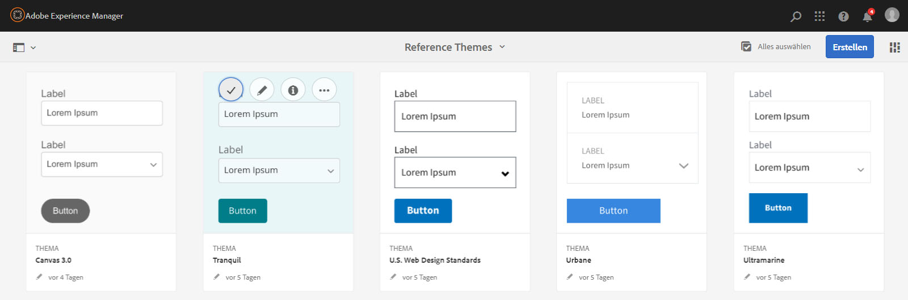

## Konfigurationsoptionen {#configuration-options}

Benutzer haben die Möglichkeit, verschiedene Workflow-Dienstoptionen zu konfigurieren, darunter die folgenden:

1. Microsoft Dynamics Entry
1. Adobe Sign
1. AEM benutzerdefiniertes Kommunikationsmanagement
1. Adobe Analytics

Damit sie im Workflow aktiviert werden können, müssen die Benutzer die folgenden Aufgaben ausführen.

1. Navigieren Sie zu https://&#39;[server]:[port]&#39;/system/console/configMgr.

1. Suchen Sie die Konfigurationen *WeGov*.

1. Öffnen Sie die Dienstdefinition und aktivieren Sie den Aufruf der ausgewählten Dienste im Workflow.

   >[!NOTE]
   Nur weil ein Benutzer den Dienst auf der Seite &quot;Configuration Manager&quot;aktiviert, müssen Benutzer eine Dienstkonfiguration einrichten, um mit den angeforderten externen Diensten zu kommunizieren.

   

1. Klicken Sie nach Abschluss des Vorgangs auf die Schaltfläche Speichern, um die Einstellungen zu speichern.

## Nächste Schritte {#next-steps}

Jetzt sind Sie alle bereit, die Web.Gov Referenz-Website zu erkunden. Weitere Informationen über den Arbeitsablauf und die Schritte der Web.Gov-Referenz-Website finden Sie unter [Wir.Gov-Referenz-Website - Umgehungslösung](../../forms/using/forms-gov-reference-site-user-demo.md).
