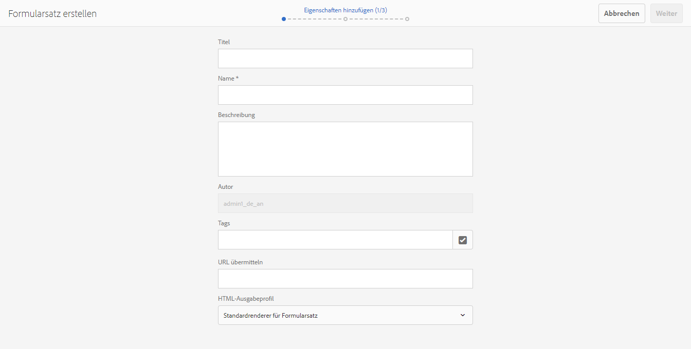
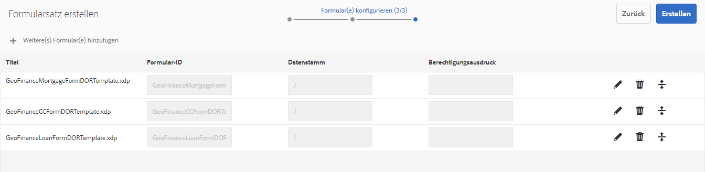
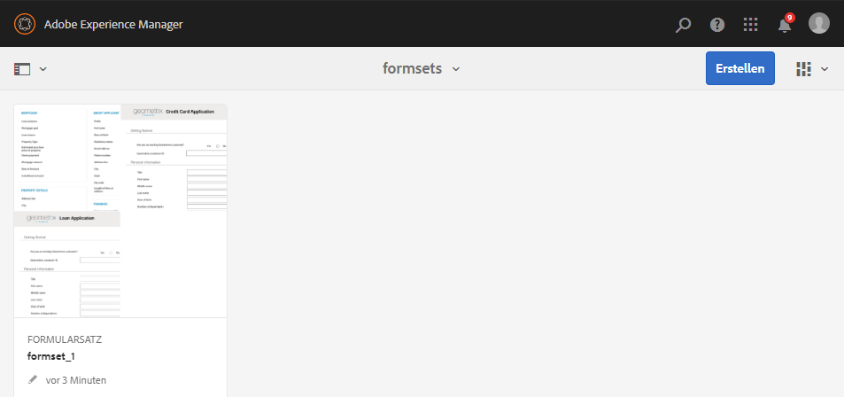
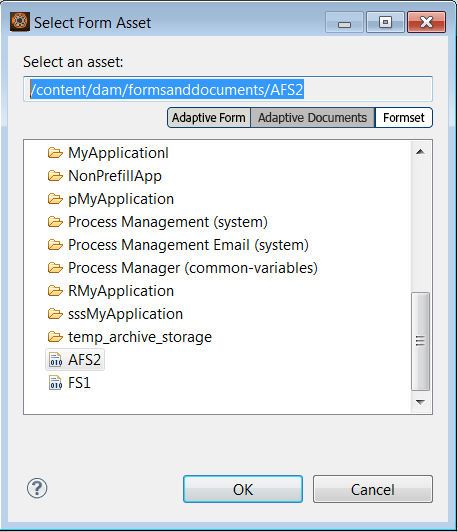

# Formularsatz in AEM Forms{#form-set-in-aem-forms}

## Überblick {#overview}

Ihre Kunden müssen oft mehrere Formulare senden, um sich bei einem Dienst oder anzumelden. Dazu gehört die Suche aller relevanter Formular sowie das Ausfüllen und Nachverfolgen. Außerdem müssen sie allgemeine Informationen mehrmals ausfüllen. Der gesamte Prozess ist mühsam und fehleranfällig, wenn eine große Anzahl von Formularen verwendet wird. Die Funktion von AEM Forms kann das Benutzererlebnis in derartigen Situationen vereinfachen.

Ein Formularsatz ist eine Sammlung von HTML5-Formularen, die zusammen gruppiert sind und als einzelner Formularsatz dem Endbenutzern präsentiert wird. Wenn der Benutzer ein Formularsatz ausfüllt, werden diese Informationen von einem Formular zu einem anderen übertragen. Am Ende können sie alle Formulare mit nur einem Mausklick senden. 

AEM Forms bietet eine intuitive Benutzeroberfläche zum Erstellen, Konfigurieren und Verwalten von Formularsätzen. Als Autor können Sie Formulare in einer bestimmten Reihenfolge anfordern, in der Endanwender sie ausfüllen sollen. Sie können auch Bedingungen oder Berechtigungsausdrücke in einzelnen Formularen verwenden, um ihre Sichtbarkeit aufgrund Benutzereingaben zu steuern. Beispielsweise können Sie das Formular zum Ehepartner so konfigurieren, dass es nur dann angezeigt wird, wenn der Familienstand als „Verheiratet“ angegeben wurde. 

Darüber hinaus können Sie allgemeine Datenfelder in unterschiedlichen Formularen konfigurieren, um allgemeine Daten zu teilen. Mit den richtigen Datenbindungen müssen Endbenutzer allgemeine Informationen nur einmal ausfüllen. Diese werden dann in den nachfolgenden Formularen automatisch ausgefüllt. 

Formularsätze werden auch in der AEM Forms-App unterstützt, wodurch Ihre Außendienstmitarbeiter ein Formularsatz offline bearbeiten können, Kunden besuchen können, Daten eingeben können und später mit dem AEM Forms-Server synchronisieren können, um Formulardaten an Geschäftsprozessen zu senden.

## Formularsatz erstellen und verwalten {#creating-and-managing-form-set}

Sie können mehrere mit Designer erstellte XDPs oder Formularvorlagen mit einem Formularsatz verknüpfen. Formularsätze können dann selektiv verwendet werden, um die XDPs basierend auf den Werten wiederzugeben, die von den Benutzern in den Anfangsformularen und deren Profilen eingegeben wurden.

Verwenden Sie [AEM Forms-Benutzeroberfläche](../../forms/using/introduction-managing-forms.md), um alle Formulare, Formularsätze und zugehörigen Assets zu verwalten.

### Formularsatz erstellen{#create-a-form-set} 

Um Formularsätze zu erstellen, führen Sie folgende Schritte durch: 

1. Wählen Sie Formulare > Formulare und Dokumente.
1. Klicken Sie auf „Erstellen“ > „Formularsatz“. 

1. Fügen Sie auf der Seite „Eigenschaften hinzufügen“ die folgenden Angaben hinzu, und klicken Sie auf „Weiter“.

   * Titel: Geben Sie den Titel des Dokuments an. Der Titel erleichtert Ihnen die Identifizierung von Formularsätze in der Benutzeroberfläche von AEM Forms.
   * Beschreibung: Gibt die detaillierten Informationen zum Dokument an.
   * Tags: Gibt Tags an, die eine eindeutige Identifizierung des Formularsatzes ermöglichen. Tags erleichtern die Suche nach Formularsätzen. Um die Tags zu erstellen, geben Sie neue Tag-Namen in das Feld Tags ein.
   * Sende-URL: Gibt die URL an, unter der die gesendeten Daten bei eigenständiger Ausgabe eines Formularsatzes veröffentlicht werden (Anwendungsfall ohne AEM Forms-App). Die Daten werden als mehrteilige Formulardaten mit den folgenden Anforderungsparametern gesendet:
   * dataXML: Dieser Parameter enthält eine XML-Darstellung der gesendeten Formularsatzdaten. Wenn alle Formulare in den Formularsätzen ein allgemeines Schema verwenden, wird die XML nach diesem Schema generiert. Andernfalls enthält das XML-Stamm-Tag ein untergeordnetes Tag für jedes ausgefüllte Formular im Formularsatz, das Daten für die Formularanhänge enthält.
   * formsetPath: Der Pfad des Formularsatzes in CRXDE, der eingereicht wurde.
   * HTML-Renderprofil: Sie können bestimmte Optionen wie Gleitfelder, Anlagen und Entwurfsunterstützung konfigurieren (nur für eigenständiges Formularsatzrendering), um das Erscheinungsbild, Verhalten und die Interaktionen der Formularsätze anzupassen. Sie können das vorhandene Profil anpassen oder erweitern, um alle HTML Form-Profileinstellungen zu ändern. 

   

1. Der Bildschirm „Formular(e) auswählen“ zeigt die verfügbaren XDP-Formulare- oder als XDP-Dateien an. Suchen Sie nach den Formularen, die Sie den Formularsatz aufnehmen möchten, wählen Sie sie aus und klicken Sie auf „Zum Formularsatz hinzufügen“. Suchen Sie nötigenfalls nach weiteren hinzuzufügenden Formularen. Nachdem Sie die Formulare dem Formularsatz hinzugefügt haben, klicken Sie auf „Weiter“. 

   >[!NOTE]
   >
   >Stellen Sie sicher, dass die Feldnamen in den XDP-Formularen keinen Punkt enthalten. Andernfalls können die Skripte, die versuchen, die Felder zu beheben, in denen Punkte enthalten sind, diese nicht beheben.

1. Auf der Seite „Formular(e) konfigurieren“ haben Sie folgende Möglichkeiten:

   * Reihenfolge der Formulare: Ziehen Sie die Formulare per Drag&amp;Drop, um die Anordnung zu ändern. Die Formularreihenfolge definiert die Reihenfolge, in der die Formulare dem Endbenutzer in der AEM Forms-App und in der eigenständigen Wiedergabe angezeigt werden.
   * Formular-ID: Gibt eine eindeutige ID an, damit die Formulare in den Berechtigungsausdrücken verwendet werden können. 
   * Datenstamm: Der Autor kann für jedes Formular im Formularsatz den XPATH konfigurieren, unter dem die Daten des betreffenden Formulars im gesendeten XML-Code dauerhaft positioniert bleiben sollen. Der Standardwert ist /. Wenn Sie alle Formulare in Formularsätzen schemagebunden sind und das gleiche XML-Schema haben, können Sie diesen Wert ändern. Es wird empfohlen, für jedes Feld im Formular in der XDP-Datei die korrekte Datenbindung anzugeben. Wenn zwei Felder in zwei verschiedenen Formularen die allgemeine Datenbindung gemeinsam nutzen, dann zeigt das Feld im zweiten Formular vorausgefüllte Werte aus dem ersten Formular an. Binden Sie zwei Teilformulare mit dem gleichen internen Inhalt nicht an denselben XML-Knoten. Weitere Informationen zur XML-Struktur des Formularsatzes finden Sie unter [XML zum Vorausfüllen für Formularsatz](../../forms/using/formset-in-aem-forms.md#p-prefill-xml-for-form-set-p).
   * Berechtigungsausdruck: Gibt einen JavaScript-Ausdruck an, der einen booleschen Wert angibt, und anzeigt, ob ein Formular im Formularsatz zum Ausfüllen zulässig ist. Wenn dies „false“ ist, wird der Benutzer nicht gefragt und es wird ihm auch nicht das Formular zum Ausfüllen angezeigt. Der Ausdruck basiert normalerweise auf den Werten der Felder, die in den diesem Formular vorangehenden Formularen erfasst werden. Darüber hinaus enthalten Ausdrücke auch Aufrufe von fs.valueOf in der Formularsatz-API, um die vom Benutzer im entsprechenden Feld eines Formulars im Formularsatz eingegebenen Werte abzurufen:

   *fs.valueOf(&lt;form Identifier=&quot;&quot;>,  &lt;fieldsom expression=&quot;&quot;>) >  &lt;value>*

   Wenn Sie beispielsweise zwei Formulare im Formularsatz hat: Geschäftsausgaben und Reisekosten, können Sie ein JavaScript-Codefragment im Feld „Berechtigungsausdruck“ für beide Formulare hinzufügen, sodass beide Formulare die Benutzereingabe für Kosten in einem Formular überprüfen. Wenn der Benutzer Geschäftsausgaben wählt, wird das Formular „Geschäftsausgaben“ für den Endbenutzer gerendert. Wenn der Benutzer „Reisekosten“ wählt, wird ein anderes Formular gerendert und angezeigt. Weitere Informationen finden Sie unter Berechtigungsausdruck.

   Darüber hinaus hat der Verfasser die Möglichkeit, ein Formular mithilfe des Löschsymbols am rechten Ende jeder Zeile aus dem Formularsatz zu entfernen oder mithilfe des „**+**“ Symbols in der Symbolleiste einen weiteren Formularsatz hinzuzufügen. Über das Symbol „**+**“ gelangt der Benutzer zurück zum vorherigen Schritt des Assistenten, d. h. zur Auswahl der Formulare. Die bestehende Auswahl bleibt erhalten, zusätzlich ausgewählte Formulare müssen dem Formularsatz über das Symbol „Zum Formularsatz hinzufügen“ auf dieser Seite hinzugefügt werden.

   

   >[!NOTE]
   >
   >Alle Formulare in Formularsätzen werden in der Benutzeroberfläche von AEM Forms verwaltet.

### Verwalten eines Formularsatzes   {#managing-a-form-set}

Nachdem ein Formular erstellt wurde, können Sie die folgenden Vorgänge für den Formularsatz durchführen:

* Einfaches Klicken: Wenn der Formularsatz erstellt wurde und in der Liste auf der Asset-Hauptseite angezeigt wird, kann der Benutzer den Formularsatz durch einfaches Klicken anzeigen. Der Formularsatz wird geöffnet und alle darin enthaltenen Formularvorlagen (XDPs) werden angezeigt.
* Bearbeiten: Wenn Sie einen Formularsatz auswählen und anschließend auf „Bearbeiten“ klicken, wird der oben unter „Schritte zum Erstellen eines Formularsatzes“ gezeigte Bildschirm „Formular(e) konfigurieren“ geöffnet. Sie können alle hier beschriebenen Funktionen durchführen.
* Kopieren und Einfügen: Mithilfe dieser Funktion können Sie den gesamten Formularsatz von einem Speicherort kopieren und am gewünschten Speicherort bzw. in den Ordner einfügen.
* Herunterladen: Sie können den Formularsatz mit sämtlichen Abhängigkeiten herunterladen.
* Prüfung starten/verwalten: Nachdem der Formularsatz erstellt wurde, können Sie dessen Überprüfung durch Klicken auf das Symbol zum Starten einer Überprüfung einrichten. Sobald die Überprüfung für einen Formularsatz gestartet wurde, wird die Option zum Verwalten der Überprüfung angezeigt. Im Bildschirm zum Verwalten einer Überprüfung können Sie diese aktualisieren oder beenden. Reviews, die Sie hinzugefügt haben, können Sie überprüfen und Kommentare hinzufügen, wenn erforderlich. 
* Löschen: Löscht den vollständigen Formularsatz. Die Formulare im gelöschten Formularsatz bleiben im Repository.
* Veröffentlichen/Veröffentlichung rückgängig machen: Mithilfe dieser Funktion können Sie den Formularsatz einschließlich aller darin enthaltenen Formulare und der zu diesen gehörigen Assets veröffentlichen oder seine Veröffentlichung rückgängig machen.
* Vorschau: Für die Vorschau stehen zwei Optionen zur Verfügung: HTML-Vorschau (ohne Daten) und. benutzerdefinierte Vorschau mit Musterdaten.
* Eigenschaften anzeigen/bearbeiten: Sie können die Metadateneigenschaften des ausgewählten Formularsatzes anzeigen/bearbeiten.



### Formularsatz bearbeiten{#edit-a-form-set} 

Um Formularsätze zu bearbeiten, führen Sie folgende Schritte durch: 

1. Wählen Sie Formulare > Formulare und Dokumente.
1. Suchen Sie nach dem Formularsatz, den Sie bearbeiten möchten. Bewegen Sie den Mauszeiger darüber und wählen Sie Bearbeiten ( ).
1. Auf der Seite „Formular(e) konfigurieren“ können Sie Folgendes bearbeiten:

   * Formular-Reihenfolge
   * Formular-  ID
   * Datenstamm
   * Berechtigungsausdruck

   Sie können auch auf das entsprechenden Löschen-Symbol klicken, um das Formular aus dem Formularsatz zu löschen.

## Formularsätze in der Prozessverwaltung  {#form-set-in-process-management}

Nachdem Sie einen Formularsatz in der Verwaltungsoberfläche von AEM Forms erstellt haben, können Sie ihn in Workbench für die Vorgänge „Ausgangspunkt“ oder „Aufgabe zuweisen“ verwenden.

### Formularsätze für Aufgaben oder Ausgangspunkte verwenden  {#using-form-set-in-task-or-start-point}

1. Wählen Sie beim Entwickeln eines Prozesses im Bereich „Präsentation und Daten“ von „Ausgangspunkt“ bzw. „Aufgabe zuweisen“ die Option zum **Verwenden eines CRX-Assets**. Der Browser für CRX-Assets wird angezeigt.

   

1. Wählen Sie den Formularsatz, um den Formularsatz im AEM-Repository (CRX) zu filtern.

   

1. Wählen Sie einen Formularsatz aus und klicken Sie auf &quot;OK&quot;.

## Berechtigungsausdrücke {#eligibility-expressions}

Mithilfe von Berechtigungsausdrücken können Sie die Formulare, die für bestimmte Benutzer angezeigt werden sollen, definieren und dynamisch steuern. So können Sie beispielsweise festlegen, dass ein bestimmtes Formular nur für Benutzer angezeigt werden soll, die zu einer bestimmten Altersgruppe gehören. Geben Sie einen Berechtigungsausdruck mithilfe des Formularmanagers an und bearbeiten Sie ihn. 

Als Berechtigungsausdruck kann jede gültige JavaScript-Aussage verwendet werden, die einen booleschen Wert zurückgibt. Die letzte Aussage im JavaScript-Codesnippet wird als boolescher Wert behandelt, der die Berechtigung des Formulars bestimmt, basierend auf der Verarbeitung im Rest (vorangehende Zeilen) des JavaScript-Codesnippets. Wenn der Wert des Ausdrucks „wahr“ ist, bedeutet dies, dass das Formular für den Benutzer angezeigt werden soll. Solche Formulare sind als berechtigte Formulare bekannt. 

>[!NOTE]
>
>Der Berechtigungsausdruck für das erste Formular des Formularsatzes wird nicht ausgeführt. Das erste Formular wird unabhängig vom Berechtigungsausdruck stets angezeigt. 

Neben der normalen JavaScript-Funktion wird im Formularsatz die fs.valueOf-API genutzt, die Zugriff auf den Wert eines Formularfelds in einem Formularsatz bietet. Verwenden Sie diese API für den Zugriff auf den Wert eines Formularfelds in einem Formularsatz. Für die API wird die folgende Syntax verwendet: fs.valueOf (formUid, fieldSOM). Dabei gilt:

* formUid (String): Eine eindeutiger ID eines Formulars im Formularsatz. Sie können dies während der Erstellung des Formularsatzes in der Benutzeroberfläche von Forms Manager angeben. Standardmäßig ist dies der Name des Formulars.
* fieldSOM (string): Ein SOM-Ausdruck des Felds im durch formUid angegebenen Formular. SOM-Ausdruck- oder Skriptobjekt-Modellausdruck wird verwendet, um die Werte, Eigenschaften und Methoden innerhalb eines bestimmten Dokumentobjektmodells (DOM) zu referenzieren. Sie können dieses in Form Designer auf der Registerkarte „Skripten“ anzeigen, während das Feld ausgewählt ist.

>[!NOTE]
>
>Die Parameter „formUid“ und „fieldSOM“ müssen Stringliterale sein.

### Beispiele {#examples}

Gültige Verwendung der API:

`fs.valueOf("form1", "xfa.form.form1.subform1.field1")`

Ungültige Verwendung der API:

```javascript
var formUid = "form1";
 var fieldSOM = “xfa.form.form1.subform1.field1"; fs.valueOf(formUid, fieldSOM);
```

## XML zum Vorausfüllen in Formularsätzen {#prefill-xml-for-form-set}

Ein Formularsatz ist eine Sammlung mehrerer HTML5-Formulare mit einem gemeinsamen oder mehreren unterschiedlichen Schemata. Formularsätze unterstützen das Vorausfüllen von Formularfeldern mithilfe einer XML-Datei. Sie können eine XML-Datei mit einem Formularsatz verknüpfen, sodass, wenn Sie ein Formular in einem Formularsatz öffnen, einige der Felder im Formular voraufgefüllt werden.

Das Vorauffüllen einer XML-Datei wird mithilfe des dataRef-Parameters der URL des Formularsatzes angegeben. Der Parameter dataRef gibt den absoluten Pfad der XML-Datendatei an, die mit dem Formularsatz zusammengeführt wird.

Nehmen wir z. B. an, Sie haben drei Formulare (Formular1, Formular2 und Formular3) in den Formularsätzen mit der folgenden Struktur: 

form1

Field form1field

form2

Field form2field

form3

Field form3field

Jedes Formular hat ein Feld mit gemeinsamem Namen namens „Feld“ und ein eindeutig benanntes Feld namens „form&lt;i>field“. 

Sie können dieses Formular mithilfe einer XML-Datei automatisch mit der folgenden Struktur ausfüllen lassen:

```xml
<?xml version="1.0" encoding="UTF-8" ?>
<formSetRootTag>
 <field>common field value</field>
 <form1field>value1</form1field>
 <form2field>value2</form2field>
 <form3field>value3</form3field>
</formSetRootTag>
```

>[!NOTE]
>
>Das XML-Root-Tag kann jeden beliebigen Namen annehmen, aber die Element-Tags, die den Feldern entsprechen, müssen denselben Namen wie die Felder haben. Die Hierarchie der XML-Datei muss die Hierarchie des Formulars nachahmen. Das bedeutet, dass die XML-Datei entsprechende Tags für das Umbrechen von Teilformularen aufweisen muss.

Das obige XML-Codefragment zeigt an, dass die XML zum Vorausfüllen des Formularsatzes eine Vereinigung der XML-Codefragmente zum Vorausfüllen der einzelnen Formulare darstellt. Wenn bestimmte Felder in unterschiedlichen Formularen eine ähnliche Datenhierarchie/Schema haben, werden die Felder mit den gleichen Werten vorausgefüllt. In diesem Beispiel werden alle drei Formulare mit demselben Wert für das gemeinsame Feld &quot;Feld&quot;vorausgefüllt. Dies ist eine einfache Möglichkeit, Daten von einem Formular ans nächste weiterzuleiten. Dies kann auch erzielt werden, indem die Felder an das gleiche Schema oder die gleiche Datenreferenz gebunden werden. Angenommen, Sie möchten Formularsatzdaten basierend auf dem Schema des Formulars trennen. Dies kann erzielt werden, indem Sie während der Formularsatzerstellung das „data root“-Attribut des Formulars angeben (der Standardwert für die Zuordnung zum Formularsatz-Root-Tag ist „/“).

Wenn Sie im vorherigen Beispiel die Datenstämme für die drei Formulare angeben: „/form1“, „/form2“ und „/form3“, müssen Sie eine XML zum Vorausfüllen mit der folgenden Struktur verwenden:

```xml
<?xml version="1.0" encoding="UTF-8" ?>
<formSetRootTag>
 <form1>
  <field>field value1</field>
  <form1field>value1</form1field>
 </form1>
 <form2>
  <field>field value2</field>
  <form2field>value2</form2field>
 </form2>
 <form3>
  <field>field value3</field>
  <form3field>value3</form3field>
 </form3>
</formSetRootTag>
```

In einem Formularsatz definierte die XML ein XML-Schema mit der folgenden Syntax:

```xml
<formset>
 <fs_data>
  <xdp:xdp xmlns:xdp="https://ns.adobe.com/xdp/">
  <xfa:datasets xmlns:xfa="https://www.xfa.org/schema/xfa-data/1.0/">
   <xfa:data>
   <rootElement>
    ... data ....
   </rootElement>
   </xfa:data>
  </xfa:datasets>
  </xdp:xdp>
 </fs_data>
 <fs_draft>
  ... private data...
 </fs_draft>
</formset>
```

>[!NOTE]
>
>Wenn zwei Formulare mit überlappenden Datenstämmen vorhanden sind oder die Elementhierarchie eines Formulars sich mit der Datenstamm-Hierarchie eines anderen Formulars überschneidet, werden in der XML zum Vorausfüllen die Werte der überlappenden Elemente zusammengeführt. Die Senden-XML hat eine ähnliche Struktur wie die XML zum Vorausfüllen, die Senden-XML hat jedoch mehr Wrapper-Tags und am Ende sind einige Kontextdaten-Tags des Formularsatzes angehängt.

### Vorauffüllen von XML-Elementen – Beschreibung  {#prefill-xml-elements-description}

Syntaxregeln zum Erstellen einer XML-Datei zu Vorauffüllen:

* Übergeordnete Elemente: Elemente, die dem betreffenden Element übergeordnet sein können. Null bedeutet, dass das Element auf der Stammebene des XML-Codes stehen kann.
* Kardinalität: Gibt an, wie oft das Element innerhalb des ihm übergeordneten Elements verwendet werden kann.
* submitXML: Gibt an, ob das Element in der Sende-XML immer vorhanden (P) oder (O) ist.
* prefillXML: Gibt an, ob das Element in der XML zum Vorausfüllen erforderlich (R) oder optional (O) ist.
* Untergeordnete Elemente: Gibt an, welche Elemente dem betreffenden Element untergeordnet sein können.

### FORMSET {#formset}

`parent elements:`

`null`

`cardinality: [0,1]`

`submitXML: P`

`prefillXML: O`

`children: fs_data`

Das Stammelement der XML für den Formularsatz. Es wird empfohlen, dieses Wort nicht als Namen für rootSubform in den Formularen innerhalb des Formularsatzes zu verwenden.

### FS_DATA  {#fs-data}

`parent elements:`

`formset`

Kardinalität: [1]

submitXML: P

prefillXML: O

`children: xdp:xdp/rootElement`

Die Unterstruktur gibt die Daten der Formulare im Formularsatz an. Das Element ist in der XML zum Vorausfüllen nur dann optional, wenn das Formularsatz-Element nicht vorhanden ist.

### XDP:XDP {#xdp-xdp}

`parent elements: fs_data/null`

`cardinality: [0,1]`

`submitXML: O`

`prefillXML: O`

`children: xfa:datasets`

Dieses Tag gibt den Anfang der XML für das HTML5-Formular an. Dies wird in der Sende-XML hinzugefügt, sofern es in der der XML zum Vorausfüllen angegeben wurde oder diese nicht vorhanden ist. Dieses Tag kann aus der XML zum Vorausfüllen entfernt werden.

### XFA:DATASETS {#xfa-datasets}

`parent elements: xdp:xdp`

`cardinality: [1]`

`submitXML: O`

`prefillXML: O`

`children: xfa:data`

### XFA:DATA {#xfa-data}

`parent elements: xfa:datasets`

`cardinality: [1]`

`submitXML: O`

`prefillXML: O`

`children: rootElement`

### ROOTELEMENT {#rootelement}

`parent elements: xfa:datasets/fs_data/null`

`cardinality: [0,1]`

`submitXML: P`

`prefillXML: O`

`children: controlled by the Forms in Form set`

Der Name „rootElement“ dient hier lediglich als Platzhalter. Der tatsächliche Name wird aus den im Formularsatz verwendeten Formularen übernommen. Die mit rootElement beginnende Unterstruktur enthält die Daten der Felder und Teilformulare in der Forms im Formularsatz. Die Struktur des rootElement und der ihm untergeordneten Elemente wird durch mehrere Faktoren bestimmt.

Dieses Tag ist in der XML zum Vorausfüllen optional, fehlt es jedoch, wird die gesamte XML ignoriert.

NAME DES STAMMELEMENT-TAGS

Ist in der XML zum Vorausfüllen ein Stammelement vorhanden, wird der Name dieses Elements auch für die Senden-XML übernommen. Falls keine XML zum Vorausfüllen vorhanden ist, wird der Name des Unterformulars auf der Stammebene des ersten Formulars im Formularsatz, dessen dataRoot-Eigenschaft auf „/“ eingestellt wurde, als Name für das rootElement übernommen. Ist kein solches Formular vorhanden, wird das reservierte Schlüsselwort **fs_dummy_root** als Name für das rootElement verwendet.

## Formularsatz in der AEM Forms-App  {#formset-in-workspace-app}

Die AEM Forms-App ermöglicht es Außendienstmitarbeitern, ihre Mobilgeräte mit einem AEM Forms-Server zu synchronisieren und Aufgaben zu bearbeiten. Die Anwendung funktioniert nahtlos, wenn das Gerät offline ist, da Daten lokal auf dem Gerät gespeichert werden. Unter Verwendung von Anmerkungen wie Fotos können Außendienstmitarbeiter genaue Informationen bereitstellen, die in den Geschäftsprozess integriert werden können.

<!-- Update link as it is a 404 - For more information on AEM Forms app, see [AEM Forms app overview](/help/forms/using/mobile-workspace-overview.md).-->

## Bekannte Einschränkungen- Muster, die in Formularsätzen nicht vollständig unterstützt werden{#known-limitations-patterns-not-fully-supported-in-form-set} 

Die folgenden Datenmuster werden nicht vollständig in Formularsätzen unterstützt: 

<table>
 <tbody>
  <tr>
   <td><strong>Muster werden nicht vollständig in Formularsätzen unterstützt </strong></td>
   <td><strong>Beispiel</strong></td>
  </tr>
  <tr>
   <td>Abweichungen von Eingabe-und Mustergröße</td>
   <td><p>Wenn Muster= num{z, zzz} </p> <p>Und Input=</p> <p>12,345 oder</p> <p>1,23</p> </td>
  </tr>
  <tr>
   <td>Bildklausel-Muster mit Klammern „(" ")“</td>
   <td>num{(zz,zzz)}</td>
  </tr>
  <tr>
   <td>Mehrere Datenmuster</td>
   <td>num{zz,zzz} | num{z,zzz,zzz}</td>
  </tr>
  <tr>
   <td>Kurzmuster </td>
   <td><p>num.integer{},</p> <p>num.decimal{},</p> <p>num.percent{} oder</p> <p>num.currency{}</p> </td>
  </tr>
 </tbody>
</table>
