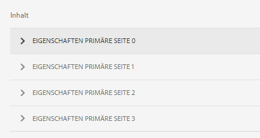

# Generierung eines Datensatzdokuments für adaptive Formulare oder adaptive Formularfragmente {#generate-document-of-record-for-adaptive-forms}

<span class="preview"> Adobe empfiehlt, die modernen und erweiterbaren [Kernkomponenten](https://experienceleague.adobe.com/docs/experience-manager-core-components/using/adaptive-forms/introduction.html?lang=de) zur Datenerfassung zu verwenden, um [neue adaptive Formulare zu erstellen](/help/forms/using/create-an-adaptive-form-core-components.md) oder [adaptive Formulare zu AEM Sites-Seiten hinzuzufügen](/help/forms/using/create-or-add-an-adaptive-form-to-aem-sites-page.md). Diese Komponenten stellen einen bedeutenden Fortschritt bei der Erstellung adaptiver Formulare dar und sorgen für beeindruckende Anwendererlebnisse. In diesem Artikel wird der ältere Ansatz zum Erstellen adaptiver Formulare mithilfe von Foundation-Komponenten beschrieben. </span>

| Version | Artikel-Link |
| -------- | ---------------------------- |
| AEM as a Cloud Service | [Hier klicken](https://experienceleague.adobe.com/docs/experience-manager-cloud-service/content/forms/adaptive-forms-authoring/authoring-adaptive-forms-foundation-components/generate-document-of-record-for-non-xfa-based-adaptive-forms.html?lang=de) |
| AEM 6.5 | Dieser Artikel |


## Übersicht {#overview}

Nachdem Ihre Kunden ein Formular gesendet haben, möchten sie im Allgemeinen einen Beleg (in gedruckter Form oder im Dokumentformat) über die eingegebenen Informationen behalten, um später darauf Bezug nehmen zu können. Dies wird als Datensatzdokument bezeichnet.

In diesem Artikel erfahren Sie, wie Sie ein Datensatzdokument für adaptive Formulare oder adaptive Formularfragmente erstellen können.

>[!NOTE]
>
> Die Unterstützung zum Anpassen Ihrer adaptiven Formularfragmente und ihrer Felder im Editor für adaptive Formulare wurde mit AEM 6.5 Forms Service Pack 19 (6.5.19.0) eingeführt.


>[!NOTE]
>
>Die automatische Generierung von Datensatzdokumenten wird für XFA-basierte adaptive Formulare nicht unterstützt. Sie können jedoch die zum Erstellen des adaptiven Formulars verwendete XDP-Datei als Datensatzdokument verwenden.

## Typen adaptiver Formulare und ihre Datensatzdokumente {#adaptive-form-types-and-their-documents-of-record}

Beim Erstellen eines adaptiven Formulars können Sie ein Formularmodell auswählen. Ihre Optionen sind:

* [Formularvorlagen](../../forms/using/creating-adaptive-form.md#create-an-adaptive-form-based-on-an-xfa-form-template) Sie können eine XFA-Vorlage für Ihr adaptives Formular auswählen. Wenn Sie eine XFA-Vorlage auswählen, können Sie die dazugehörige XDP-Datei als Datensatzdokument verwenden (siehe oben). 

* [XML-Schema](../../forms/using/creating-adaptive-form.md#create-an-adaptive-form-based-on-xml-or-json-schema) Sie können eine XML-Schemadefinition für Ihr adaptives Formular auswählen. Wenn Sie ein XML-Schema für Ihr adaptives Formular auswählen, können Sie:

   * eine XFA-Vorlage für das Datensatzdokument verknüpfen. Vergewissern Sie sich, dass die verknüpfte XFA-Vorlage dasselbe XML-Schema verwendet wie Ihr adaptives Formular.
   * Datensatzdokument automatisch generieren

* Mit der Option „Ohne“ können Sie ein adaptives Formular ohne Formularmodell erstellen. Das Datensatzdokument für Ihr adaptives Formular wird automatisch generiert.

Wenn Sie ein Formularmodell auswählen, konfigurieren Sie das Datensatzdokument mithilfe der Optionen, die unter „Konfiguration von Dokument aus Datensatzvorlage“ verfügbar sind. Weitere Informationen dazu finden Sie unter [Konfiguration der Datensatzdokument-Vorlage](#document-of-record-template-configuration).

## Automatisch generiertes Datensatzdokument {#automatically-generated-document-of-record}

Mit einem Datensatzdokument erhalten Ihre Kundinnen und Kunden eine Kopie des übermittelten Formulars, das sie dann ausdrucken können. Wenn Sie automatisch ein Datensatzdokument generieren, wird jedes Mal das Datensatzdokument sofort aktualisiert, wenn Sie das Formular ändern. Beispiel: Sie entfernen für Kunden, die als ihr Land die USA angeben, das Feld „Alter“. Wenn diese Kundinnen oder Kunden ein Datensatzdokument erstellen, ist das Altersfeld im Datensatzdokument für sie nicht sichtbar.

 Ein automatisch generiertes Datensatzdokument bietet folgende Vorteile:

* Es kümmert sich um die Datenbindung.
* Dadurch werden automatisch Felder ausgeblendet, die im Datensatzdokument zum Zeitpunkt des Sendens entsprechend markiert sind. Zusätzlicher Aufwand ist nicht erforderlich.
* Dies spart Zeit für die Entwicklung der Datensatzdokument-Vorlage.
* Außerdem können Sie auch verschiedene Formatierungsstile und Erscheinungsbilder ausprobieren, indem Sie unterschiedliche Basisvorlagen verwenden und dann das beste Design für Ihr Datensatzdokument auswählen. Stil und Erscheinungsbild sind optional. Wenn Sie sich auf keinen Stil festlegen, werden Systemstile als Standard festgelegt.
* Es stellt sicher, dass eine Änderung im Formular sofort im Datensatzdokument umgesetzt wird.

## Komponenten zum automatischen Generieren eines Datensatzdokuments {#components-to-automatically-generate-a-document-of-record}

Sie benötigen die folgenden Komponenten, um ein Datensatzdokument für adaptive Formulare zu generieren:

**Adaptives Formular** Das adaptive Formular, für das Sie ein Datensatzdokument generieren möchten.

**Adaptives Formularfragment** Das adaptive Formularfragment, für das Sie ein Datensatzdokument generieren möchten.

**Basisvorlage (empfohlen)** Das ist eine in AEM Designer erstellte XFA-Vorlage (XDP-Datei). Eine Basisvorlage wird verwendet, um die Stile und Branding-Informationen für die Datensatzdokument-Vorlage festzulegen.

Siehe [Basisvorlage eines Datensatzdokuments](#base-template-of-a-document-of-record)

>[!NOTE]
>
>Die Basisvorlage eines Datensatzdokuments wird auch als Metavorlage des Datensatzdokuments bezeichnet.

**Datensatzdokument-Vorlage** Eine aus einem adaptiven Formular generierte XFA-Vorlage (XDP-Datei).

Weitere Informationen dazu finden Sie unter [Konfiguration der Datensatzdokument-Vorlage](#document-of-record-template-configuration).

**Formulardaten** Informationen, die von einem Benutzer in das adaptive Formular eingetragen werden. Sie werden mit der Datensatzdokument-Vorlage zusammengeführt, um das Datensatzdokument zu generieren.

## Zuordnen von adaptiven Formularelementen {#mapping-of-adaptive-form-elements}

In den folgenden Abschnitten wird beschrieben, wie adaptive Formularelemente im Datensatzdokument angezeigt werden.

### Felder {#fields}

<table>
 <tbody>
  <tr>
   <th>Komponente des adaptiven Formulars</th>
   <th>Zugehörige XFA-Komponente</th>
   <th>Standardmäßig in der Datensatzdokument-Vorlage enthalten?</th>
   <th>Anmerkungen</th>
  </tr>
  <tr>
   <td>Schaltfläche</td>
   <td>Schaltfläche</td>
   <td>Falsch</td>
   <td> </td>
  </tr>
  <tr>
   <td>Kontrollkästchen</td>
   <td>Kontrollkästchen</td>
   <td>Ja</td>
   <td> </td>
  </tr>
  <tr>
   <td>Datumsauswahl</td>
   <td>Datum-/Uhrzeitfeld</td>
   <td>Ja</td>
   <td> </td>
  </tr>
  <tr>
   <td>Dropdown-Liste</td>
   <td>Dropdown-Liste</td>
   <td>Ja</td>
   <td> </td>
  </tr>
  <tr>
   <td>Freihändige Unterschrift</td>
   <td>Freihändige Unterschrift</td>
   <td>Ja</td>
   <td> </td>
  </tr>
  <tr>
   <td>Numerisches Feld</td>
   <td>Numerisches Feld</td>
   <td>Ja</td>
   <td> </td>
  </tr>
  <tr>
   <td>Kennwortfeld</td>
   <td>Kennwortfeld</td>
   <td>Falsch</td>
   <td> </td>
  </tr>
  <tr>
   <td>Optionsfeld</td>
   <td>Optionsfeld</td>
   <td>Ja</td>
   <td> </td>
  </tr>
  <tr>
   <td>Textfeld</td>
   <td>Textfeld</td>
   <td>Ja</td>
   <td> </td>
  </tr>
  <tr>
   <td>Schaltfläche „Zurücksetzen“</td>
   <td>Schaltfläche „Zurücksetzen“</td>
   <td>Falsch</td>
   <td> </td>
  </tr>
  <tr>
   <td>Schaltfläche „Senden“</td>
   <td><p>Schaltfläche „E-Mail senden“</p> <p>Schaltfläche „HTTP senden“</p> </td>
   <td>Falsch</td>
   <td> </td>
  </tr>
  <tr>
   <td>Allgemeine Geschäftsbedingungen</td>
   <td> </td>
   <td>Ja</td>
   <td> </td>
  </tr>
  <tr>
   <td>Dateianhang</td>
   <td> </td>
   <td>Falsch</td>
   <td>In Datensatzdokument-Vorlage nicht verfügbar. In Datensatzdokument-Vorlage nur über Anlagen verfügbar.</td>
  </tr>
 </tbody>
</table>

### Container {#containers}

<table>
 <tbody>
  <tr>
   <th>Komponente des adaptiven Formulars</th>
   <th>Zugehörige XFA-Komponente</th>
   <th>Anmerkungen</th>
  </tr>
  <tr>
   <td>Bereich<br /> </td>
   <td>Teilformular<br /> </td>
   <td>Wiederholbare Bedienfelder werden wiederholbaren Teilformularen zugeordnet.</td>
  </tr>
 </tbody>
</table>

### Statische Komponenten {#static-components}

| Komponente des adaptiven Formulars | Zugehörige XFA-Komponente | Anmerkungen |
|---|---|---|
| Bild | Bild | Die Komponenten TextDraw und Image (egal ob gebunden oder nicht) werden immer im Datensatzdokument eines XSD-basierten adaptiven Formulars angezeigt, es sei denn, sie werden mithilfe der Datensatzdokument-Einstellungen ausgeschlossen. |
| Text | Text |

>[!NOTE]
>
>In der klassischen Benutzeroberfläche sind verschiedene Registerkarten zum Bearbeiten der Feldeigenschaften vorhanden.

### Tabellen {#tables}

Die Tabellenkomponenten adaptiver Formulare (wie Kopf- und Fußzeile sowie Zeilen) sind den entsprechenden XFA-Komponenten zugeordnet. Sie können wiederholbare Bereiche Tabellen im Datensatzdokument zuordnen.

## Basisvorlage eines Datensatzdokuments {#base-template-of-a-document-of-record}

Die Basisvorlage liefert Informationen zu Stil und Erscheinungsbild des Datensatzdokuments. Sie bietet Ihnen die Möglichkeit, das Standarderscheinungsbild des automatisch generierten Datensatzdokuments anzupassen. Beispiel: Sie möchten das Logo Ihres Unternehmens in der Kopfzeile und die Copyright-Informationen in der Fußzeile des Datensatzdokuments einfügen. Die Musterseite aus der Basisvorlage wird als Musterseite für die Datensatzdokument-Vorlage verwendet. Die Musterseite kann Informationen wie Kopfzeile, Fußzeile und Seitenzahl enthalten, die Sie auf das Datensatzdokument anwenden können. Sie können solche Informationen mithilfe der Basisvorlage für die automatische Erstellung des Datensatzdokuments auf das Datensatzdokument anwenden. Die Verwendung der Basisvorlage ermöglicht es Ihnen, die Standardeinstellungen von Feldern zu ändern.

Folgen Sie bei der Entwicklung Ihrer Basisvorlage unbedingt den [Konventionen für Basisvorlagen](#base-template-conventions).

## Konventionen für Basisvorlagen {#base-template-conventions}

Eine Basisvorlage wird verwendet, um Kopf- und Fußzeile, Stil und Erscheinungsbild eines Datensatzdokuments zu definieren. Die Kopf- und die Fußzeile können Informationen wie Firmenlogo und Copyright-Vermerk enthalten. Die erste Masterseite in der Basisvorlage wird als Masterseite für das Datensatzdokument kopiert und verwendet. Sie enthält Kopfzeile, Fußzeile und Seitenanzahl oder auch andere Informationen, die im Datensatzdokument auf allen Seiten angezeigt werden sollen. Wenn Sie eine Basisvorlage verwenden, die nicht den Konventionen für Basisvorlagen entspricht, wird die erste Masterseite aus der Basisvorlage dennoch in der Datensatzdokument-Vorlage verwendet. Es wird ausdrücklich empfohlen, dass Sie Ihre Basisvorlage gemäß den entsprechenden Konventionen entwerfen und sie für die automatische Erstellung von Datensatzdokumenten verwenden.

**Konventionen für Musterseiten**

* In der Basisvorlage sollten Sie das Stamm-Unterformular mit `AF_METATEMPLATE` und die Musterseite mit `AF_MASTERPAGE` benennen.

* Die Musterseite mit dem Namen `AF_MASTERPAGE`, die sich unterhalb des Stamm-Unterformulars `AF_METATEMPLATE` befindet, hat beim Extrahieren von Kopfzeilen-, Fußzeilen- und Stilinformationen Vorrang.

* Wenn `AF_MASTERPAGE` fehlt, wird die erste Musterseite in der Basisvorlage verwendet.

**Stilkonventionen für Felder**

* Wenn Sie einen Stil auf die Felder im Nachweis anwenden, stellt die Basisvorlage die Felder im Teilformular `AF_FIELDSSUBFORM` bereit, das sich unter dem Stammteilformular `AF_METATEMPLATE` befindet.

* Die Eigenschaften dieser Felder werden auf die Felder im Datensatzdokument angewendet. Benennungen für diese Felder sollten der Form `AF_<name of field in all caps>_XFO` folgen. So sollte beispielsweise der Feldname für ein Kontrollkästchen `AF_CHECKBOX_XFO` lauten.

Gehen Sie wie folgt vor, um eine Basisvorlage in AEM Designer zu erstellen:

1. Klicken Sie auf **Datei > Neu**.
1. Wählen Sie die Option **Auf Basis einer Vorlage** aus.

1. Wählen Sie die Kategorie **Formulare – Aufzuzeichnendes Dokument**.
1. Wählen Sie **DoR-Basisvorlage** aus.
1. Klicken Sie auf **Weiter** und geben Sie die erforderlichen Informationen ein.

1. (Optional) Ändern Sie den Stil und das Erscheinungsbild von Feldern, die auf die Felder im Datensatzdokument angewendet werden sollen.
1. Speichern Sie das Formular.

Sie können das gespeicherte Formular jetzt als Basisvorlage für das Datensatzdokument verwenden.
Ändern oder entfernen Sie keine Skripte, die in der Basisvorlage vorhanden sind.

**Ändern der Basisvorlage**

* Wenn Sie auf Felder in der Basisvorlage keinen Stil anwenden, wird empfohlen, diese Felder aus der Basisvorlage zu entfernen, damit alle Aktualisierungen der Basisvorlage automatisch übernommen werden.
* Während des Änderns der Basisvorlage dürfen Sie keine Skripte entfernen, hinzufügen oder ändern.

>[!NOTE]
>
>Entwickeln Sie die Basisvorlage gemäß den Konventionen und folgen Sie dabei genau den oben beschriebenen Schritten.

## Konfiguration von Vorlagen für Datensatzdokumente {#document-of-record-template-configuration}

Konfigurieren Sie die Datensatzdokument-Vorlage Ihres Formulars, damit Ihre Kunden eine benutzerfreundliche Kopie des gesendeten Formulars zum Drucken herunterladen können. Als Datensatzdokument-Vorlage dient eine XDP-Datei. Das vom Kunden heruntergeladene Datensatzdokument ist entsprechend dem Layout formatiert, das in der XDP-Datei festgelegt ist.

Führen Sie die folgenden Schritte aus, um ein Datensatzdokument für adaptive Formulare zu konfigurieren:

1. Klicken Sie in der AEM-Autor-Instanz auf **Formulare > Formulare und Dokumente**.
1. Wählen Sie ein Formular aus und klicken Sie auf **Eigenschaften anzeigen**.
1. Wählen Sie im Fenster „Eigenschaften“ **Formularmodell** aus.
Sie können ein Formularmodell auch bei der Erstellung eines Formulars auswählen.

   >[!NOTE]
   >
   >Achten Sie auf der Registerkarte „Formularmodell“ darauf, dass Sie **Schema** oder **Ohne** aus dem Dropdown-Menü **Auswählen** auswählen. **[!UICONTROL Das Datensatzdokument wird nicht für XFA-basierte oder adaptive Formulare mit einer Formularvorlage als Formularmodell unterstützt.]**

1. Wählen Sie auf der Registerkarte „Formularmodell“ im Abschnitt „Konfiguration von Nachweisvorlagen“ eine der folgenden Optionen aus:

   **Keines** Wählen Sie diese Option, wenn Sie das Datensatzdokument für das Formular nicht konfigurieren möchten.

   **Formularvorlage als Dokument einer Datensatzvorlage verknüpfen** Wählen Sie diese Option, wenn Sie eine XDP-Datei haben, die Sie als Vorlage für das Datensatzdokument verwenden möchten. Wenn Sie diese Option wählen, werden alle im AEM Forms-Repository verfügbaren XDP-Dateien angezeigt. Wählen Sie die entsprechende Datei aus.

   Die ausgewählte XDP-Datei wird mit dem adaptiven Formular verknüpft.

   **Datensatzdokument generieren** Wählen Sie diese Option aus, um eine XDP-Datei als Basisvorlage zum Definieren von Stil und Erscheinungsbild des Datensatzdokuments zu verwenden. Wenn Sie diese Option wählen, werden alle im AEM Forms-Repository verfügbaren XDP-Dateien angezeigt. Wählen Sie die entsprechende Datei aus.

   >[!NOTE]
   >
   >Stellen Sie in folgenden Fällen sicher, dass das Schema, das für die Erstellung von adaptivem Formular und Schema (Datenschema) des XFA-Formulars verwendet wird, gleich sind:
   >
   >
   >
   >    * Ihr adaptives Formular ist schemabasiert.
   >    * Sie verwenden die Datensatzdokument-Option „**Formularvorlage als Dokument aus Datensatzvorlage zuordnen**“.
   >
   >

1. Klicken Sie auf **Fertig**.

## Anpassen der Branding-Informationen im Datensatzdokument {#customize-the-branding-information-in-document-of-record}

Beim Generieren eines Datensatzdokuments können Sie auf der Registerkarte „Datensatzdokument“ die Branding-Informationen für das Datensatzdokument ändern. Die Registerkarte „Datensatzdokument“ enthält Optionen für Logos, Aussehen, Layout, Kopf- und Fußzeile, zum Anpassen des Haftungsausschlusses sowie eine Optionen zum Entscheiden, ob Sie deaktivierte Kontrollkästchen und Optionsfeldern berücksichtigen möchten.

Für die Lokalisierung der Branding-Informationen, die Sie auf der Registerkarte für das Datensatzdokument eingeben, müssen Sie sicherstellen, dass das Gebietsschema des Browsers richtig eingestellt ist. Um die Branding-Informationen im Datensatzdokument anzupassen, führen Sie die folgenden Schritte aus:

1. Wählen Sie im Datensatzdokument einen Bereich (Stammbereich) und dann  aus.
1. Wählen Sie  aus. Die Registerkarte „Datensatzdokument“ wird angezeigt.
1. Wählen Sie entweder die Standardvorlage oder eine benutzerdefinierte Vorlage aus, um das Datensatzdokument zu rendern. Wenn Sie die Standardvorlage auswählen, wird eine Miniaturvorschau des Datensatzdokuments unterhalb der Dropdown-Liste „Vorlage“ angezeigt.

   

   Wenn Sie sich für eine benutzerdefinierte Vorlage entscheiden, navigieren zu einer XDP-Datei auf Ihrem AEM Forms-Server und wählen Sie sie aus. Wenn Sie eine Vorlage verwenden möchten, die sich noch nicht auf Ihrem AEM Forms-Server befindet, müssen Sie die XDP-Datei zuerst auf Ihren AEM Forms-Server hochladen.

1. Abhängig davon, ob Sie eine standardmäßige oder benutzerdefinierte Vorlage auswählen, werden einige oder alle der folgenden Eigenschaften auf der Registerkarte „Datensatzdokument“ angezeigt. Legen Sie die folgenden entsprechend fest:

   * **Logo-Bild:** Sie können entweder das Logo-Bild des adaptiven Formulars verwenden, eines in DAM auswählen oder eines von Ihrem Computer hochladen.
   * **Formulartitel**
   * **Kopfzeilentext**
   * **Haftungsausschluss-Bezeichnung**
   * **Haftungsausschluss**
   * **Text des Haftungsausschlusses**
   * **Akzentfarbe:** Die Farbe, in der Kopfzeilentext und Trennlinien im PDF des aufzuzeichnenden Dokuments dargestellt werden.
   * **Schriftfamilie:** Schriftfamilie des Textes im Datensatzdokument-PDF. 
   * **Für Kontrollkästchen und Optionsschaltflächenkomponenten nur ausgewählte Werte einblenden**
   * **Trennzeichen für mehrere ausgewählte Werte**
   * **Formularobjekte, die nicht mit dem Datenmodell verbunden sind, einschließen**
   * **Ausgeblendete Felder vom Datensatzdokument ausschließen**
   * **Beschreibung von Bereichen ausblenden**

   Wenn die von Ihnen ausgewählte benutzerdefinierte XDP-Vorlage mehrere Masterseiten enthält, werden die Eigenschaften für diese Seiten im Abschnitt **[!UICONTROL Inhalt]** auf der Registerkarte **[!UICONTROL Datensatzdokument]** angezeigt.

   

   Die Eigenschaften der Masterseiten umfassen Logobild, Kopfzeilentext, Formulartitel, Haftungsausschlussüberschrift und Haftungsausschlusstext. Sie können Eigenschaften für adaptive Formulare oder XDP-Vorlagen auf das Datensatzdokument anwenden. AEM Forms wendet standardmäßig die Vorlageneigenschaften auf das Datensatzdokument an. Sie können auch benutzerdefinierte Werte für die Eigenschaften der Masterseiten definieren. Informationen zum Anwenden mehrerer Masterseiten in einem Datensatzdokument finden Sie unter [Anwenden mehrerer Masterseiten in einem Datensatzdokument](#apply-multiple-master-pages-dor).

   >[!NOTE]
   >
   >Wenn Sie eine Vorlage für ein adaptives Formular verwenden, die mit einer Version von Designer vor 6.3 erstellt wurde, müssen Sie sicherstellen, dass im Root-Unterformular der Vorlage für das adaptive Formular folgendes vorhanden ist, damit Akzentfarbe und Schriftfamilie funktionieren:

   ```xml
   <proto>
   <font typeface="Arial"/>
   <fill>
   <color value="4,166,203"/>
   </fill>
   <edge>
   <color value="4,166,203"/>
   </edge>
   </proto>
   ```

1. Wählen Sie „Fertig“ aus, um die Branding-Änderungen zu speichern.

## Tabellen- und Spalten-Layouts für Bereiche im Datensatzdokument {#table-and-column-layouts-for-panels-in-document-of-record}

Ihr adaptives Formular ist möglicherweise sehr lange und umfasst mehrere Formularfelder. Sie möchten vielleicht nicht, dass ein Datensatzdokument als eine exakte Kopie des adaptiven Formulars gespeichert wird. Nun können Sie zum Speichern eines oder mehrerer Bereiche des adaptiven Formulars in der Datensatzdokument-PDF ein Tabellen- oder Spalten-Layout auswählen.

Legen Sie vor dem Generieren eines Datensatzdokuments in den Einstellungen eines Bedienfelds unter „Layout für Datensatzdokument“ entweder „Tabelle“ oder „Spalte“ für dieses Bedienfeld fest. Die Felder im Bedienfeld werden in dem Datensatzdokument entsprechend angeordnet.


Felder in einem Bedienfeld, im Datensatzdokument im Tabellenlayout angeordnet


Felder in einem Bedienfeld, im Datensatzdokument im Spalten-Layout angeordnet

## Einstellungen für Datensatzdokumente {#document-of-record-settings}

Über die Datensatzdokument-Einstellungen können Sie Optionen festlegen, die Sie in das Datensatzdokument aufnehmen möchten. Eine Bank akzeptiert zum Beispiel Name, Alter, Sozialversicherungsnummer und Telefonnummer in einem Formular. Das Formular generiert eine Bankkontonummer und Details zur Zweigstelle. Sie können festlegen, dass nur Name, Sozialversicherungsnummer, Bankkonto und Filialdetails im Datensatzdokument angezeigt werden.

Die Datensatzdokument-Einstellungen einer Komponente sind unter den Eigenschaften verfügbar. Um auf die Eigenschaften einer Komponente zuzugreifen, wählen Sie die Komponente aus und klicken Sie auf  in der Überlagerung. Die Eigenschaften werden in der Seitenleiste mit den folgenden Einstellungen angezeigt.

**Einstellungen auf Feldebene**

* **Aus Datensatzdokument ausschließen**: Wird diese Eigenschaft festgelegt, wird das Feld aus dem Datensatzdokument ausgeschlossen. Dies ist eine skriptfähige Eigenschaft namens `excludeFromDoR`. Ihr Verhalten ist von der auf Formularebene befindlichen Eigenschaft **Felder aus DoR ausschließen, wenn sie ausgeblendet sind** abhängig.

* **Bereich als Tabelle anzeigen:** Durch die Aktivierung dieser Eigenschaft wird der Bereich im Datensatzdokument als Tabelle angezeigt, wenn er weniger als 6 Felder enthält. Gilt nur für den Bereich.
* **Titel aus Datensatzdokument ausschließen:** Wird diese Eigenschaft aktiviert, erscheint der Titel des Bereichs bzw. der Tabelle im Datensatzdokument nicht. Gilt nur für Bereiche und Tabellen.
* **Beschreibung aus Datensatzdokument ausschließen:** Wird diese Eigenschaft aktiviert, erscheint die Beschreibung des Bereichs bzw. der Tabelle im Datensatzdokument nicht. Gilt nur für Bereiche und Tabellen.
* **[!UICONTROL Seitenumbruch]** > **[!UICONTROL Ort]**: Legt fest, wo Sie das Bedienfeld platzieren möchten.
   * **[!UICONTROL Platzieren nach]** > **[!UICONTROL Vorherigem]**: Platziert den Bereich nach dem vorherigen Objekt im übergeordneten Bereich.
   * **[!UICONTROL Platzieren im]** > **[!UICONTROL Inhaltsbereich]** > Name des Inhaltsbereichs: Platziert den Bereich im angegebenen Inhaltsbereich.
   * **[!UICONTROL Ort]** > **[!UICONTROL Anfang des nächsten Inhaltsbereichs]**: Platziert das Bedienfeld am Anfang des nächsten Inhaltsbereichs.
   * **[!UICONTROL Ort]** > **[!UICONTROL Anfang des Inhaltsbereichs]** > Name des Inhaltsbereichs: Platziert das Bedienfeld am Anfang des angegebenen Inhaltsbereichs.
   * **[!UICONTROL Ort]** > **[!UICONTROL Auf Seite]** > Name der Master-Seite: Platziert den Bereich auf der angegebenen Seite. Wenn ein Seitenumbruch nicht automatisch eingefügt wird, fügt [!DNL AEM Forms] einen Seitenumbruch hinzu.
   * **[!UICONTROL Ort]** > **[!UICONTROL Anfang der nächsten Seite]**: Platziert das Bedienfeld am Anfang der nächsten Seite. Wenn ein Seitenumbruch nicht automatisch eingefügt wird, fügt [!DNL AEM Forms] einen Seitenumbruch hinzu.
   * **[!UICONTROL Ort]** > **[!UICONTROL Seitenanfang]** > Name der Master-Seite: Platziert das Bedienfeld am Anfang der Seite, wenn die angegebene Seite gerendert wird. Wenn ein Seitenumbruch nicht automatisch eingefügt wird, fügt [!DNL AEM Forms] einen Seitenumbruch hinzu.
* **[!UICONTROL Paginierung]** > **[!UICONTROL Nachher]**: Legt fest, welcher Bereich ausgefüllt werden soll, nachdem ein Bedienfeld platziert wurde. Die folgenden Felder sind im Abschnitt **[!UICONTROL Nachher]** vorhanden:
   * **[!UICONTROL Nachher]** > **[!UICONTROL Fortsetzen von übergeordnetem Ausfüllen]**: Setzt das Zusammenführen von Daten für alle Objekte fort, die im übergeordneten Bereich noch ausgefüllt werden sollen.
   * **[!UICONTROL Nachher]** > **[!UICONTROL Wechseln zum nächsten Inhaltsbereich]**: Startet das Füllen des nächsten Inhaltsbereichs nach dem Platzieren des Bedienfelds.
   * **[!UICONTROL Nachher]** > **[!UICONTROL Wechseln zum Inhaltsbereich]** > Name des Inhaltsbereichs: Startet das Füllen des angegebenen Inhaltsbereichs nach dem Platzieren des Bedienfelds.
   * **[!UICONTROL Nachher]** > **[!UICONTROL Wechseln zur nächsten Seite]**: Startet das Füllen der nächsten Seite, nachdem der Bereich platziert wurde.
   * **[!UICONTROL Nachher]** > **[!UICONTROL Wechseln zur Seite]** > Name der Seite: Startet das Füllen der angegebenen Seite nach dem Platzieren des Bedienfelds.
* **[!UICONTROL Paginierung]** > **[!UICONTROL Überlauf]**: Legt einen Überlauf für einen Bereich oder eine Tabelle fest, der/die sich über Seiten spannt. Die folgenden Felder sind im Abschnitt **[!UICONTROL Überlauf]** verfügbar:
   * **[!UICONTROL Überlauf]** > **[!UICONTROL Keines]**: Startet das Füllen der nächsten Seite. Wenn ein Seitenumbruch nicht automatisch eingefügt wird, fügt [!DNL AEM Forms] einen Seitenumbruch hinzu.
   * **[!UICONTROL Überlauf]** > **[!UICONTROL Wechseln zum Inhaltsbereich]** > Name des Inhaltsbereichs: Startet das Füllen des angegebenen Inhaltsbereichs.
   * **[!UICONTROL Überlauf]** > **[!UICONTROL Wechseln zu Seite]** > Name der Seite: Startet das Füllen der angegebenen Seite.

  >[!NOTE]
  >
  > Die Eigenschaft „Seitenumbruch“ ist nicht für adaptive Formularfragmente verfügbar.

Informationen zum Anwenden von Seitenumbrüchen und zum Anwenden mehrerer Master-Seiten in einem Datensatzdokument finden Sie unter [Anwenden eines Seitenumbruchs in einem Datensatzdokument](#apply-page-breaks-in-dor) und [Anwenden mehrerer Master-Seiten auf ein Datensatzdokument](#apply-multiple-master-pages-dor).

**Einstellungen auf Formularebene**

* **Ungebundene Felder in DoR einbeziehen:** Durch Festlegen dieser Eigenschaft werden ungebundenen Felder aus dem Schema-basierten adaptiven Formular im Datensatzdokument berücksichtigt. Diese Option ist standardmäßig aktiviert.
* **Felder aus DoR ausschließen, falls ausgeblendet**: Legen Sie die Eigenschaft fest, um beim Senden des Formulars die ausgeblendeten Felder vom [!UICONTROL Datensatzdokument] auszuschließen. Wenn Sie [Auf dem Server erneut überprüfen](/help/forms/using/configuring-submit-actions.md#server-side-revalidation-in-adaptive-form-server-side-revalidation-in-adaptive-form) aktivieren, berechnet der Server die ausgeblendeten Felder neu, bevor er diese Felder aus dem [!UICONTROL Datensatzdokument] ausschließt.

## Anwenden eines Seitenumbruchs in einem Datensatzdokument {#apply-page-breaks-in-dor}

Sie können Seitenumbrüche in einem Datensatzdokument mithilfe mehrerer Methoden anwenden.

So wenden Sie einen Seitenumbruch auf ein Datensatzdokument an:

1. Wählen Sie den Bereich und dann  aus.
1. Erweitern Sie das **[!UICONTROL Datensatzdokument]**, um die Eigenschaften anzuzeigen.

1. Wählen Sie im Bereich **[!UICONTROL Seitenumbruch]**  im Feld **[!UICONTROL Ort]** aus.
1. Wählen Sie **[!UICONTROL Anfang der nächsten Seite]** und dann **[!UICONTROL Auswählen]** aus. Sie können auch **[!UICONTROL Seitenanfang]**, dann die primäre Seite und **[!UICONTROL Auswählen]** auswählen, um den Seitenumbruch anzuwenden.
1. Wählen Sie  aus, um die Eigenschaften zu speichern.

Das ausgewählte Bedienfeld wechselt zur nächsten Seite.

## Anwenden mehrerer Master-Seiten auf ein Datensatzdokument {#apply-multiple-master-pages-dor}

Wenn die von Ihnen ausgewählte benutzerdefinierte XDP-Vorlage mehrere Master-Seiten enthält, werden die Eigenschaften für diese Seiten im Abschnitt [!UICONTROL Inhalt] der Registerkarte [!UICONTROL Datensatzdokument] angezeigt. Weitere Informationen finden Sie unter [Anpassen der Branding-Informationen im Datensatzdokument](#customize-the-branding-information-in-document-of-record).

Sie können mehrere übergeordnete Seiten auf ein Datensatzdokument anwenden, indem Sie verschiedene Master-Seiten auf die Komponenten eines adaptiven Formulars anwenden. Verwenden Sie den Abschnitt [Paginierung](#document-of-record-settings) der Datensatzeigenschaften, um mehrere Master-Seiten anzuwenden.

Im Folgenden finden Sie ein Beispiel dafür, wie Sie mehrere Master-Seiten auf ein Datensatzdokument anwenden: 
Sie laden eine XDP-Vorlage, die vier Master-Seiten enthält, auf den [!DNL AEM Forms]-Server hoch. [!DNL AEM Forms] wendet die Vorlageneigenschaften standardmäßig auf das Datensatzdokument an. [!DNL AEM Forms] wendet auch die ersten Master-Seiteneigenschaften in der Vorlage auf das Datensatzdokument an.

Führen Sie die folgenden Schritte aus, um die zweiten Master-Seiteneigenschaften auf ein Bedienfeld und die dritten Master- Seiteneigenschaften auf die nachfolgenden Bedienfelder anzuwenden:

1. Wählen Sie den Bereich aus, um die zweite Musterseite anzuwenden, und wählen Sie dann  aus.
1. Wählen Sie im Bereich **[!UICONTROL Seitenumbruch]** im Feld **[!UICONTROL Ort]** die Option  aus.
1. Wählen Sie **[!UICONTROL Auf Seite]**, dann die zweite Musterseite und schließlich **[!UICONTROL Auswählen]** aus.
AEM Forms wendet die zweite Musterseite auf den Bereich und alle nachfolgenden Bereiche im adaptiven Formular an.
1. Wählen Sie im Bereich **[!UICONTROL Seitenumbruch]** im Feld **[!UICONTROL Nachher]** die Option  aus.
1. Wählen Sie **[!UICONTROL Wechseln zu Seite]**, dann die dritte Musterseite und schließlich **[!UICONTROL Auswählen]** aus.
1. Wählen Sie  aus, um die Eigenschaften zu speichern.
AEM Forms wendet die dritte Musterseite auf den Bereich und alle nachfolgenden Bereiche im adaptiven Formular an.

>[!NOTE]
>
> Sie können nicht mehrere Masterseiten auf ein Datensatzdokument für ein adaptives Formularfragment anwenden.

## Wichtige Aspekte beim Arbeiten mit einem Datensatzdokument {#key-considerations-when-working-with-document-of-record}

Beachten Sie die folgenden Hinweise und Einschränkungen beim Arbeiten mit einem Datensatzdokument für adaptive Formulare.

* Datensatzdokument-Vorlagen unterstützen keinen Rich-Text. Rich-Text im statischen adaptiven Formular oder bei den von der Endbenutzerin oder dem Endbenutzer ausgefüllten Informationen wird daher im Datensatzdokument als Nur-Text angezeigt.
* Dokumentfragmente in einem adaptiven Formular werden im Datensatzdokument nicht angezeigt. Adaptive Formularfragmente werden jedoch unterstützt.
* Die Inhaltsbindung in Datensatzdokumenten, die für XML-Schema-Basierte adaptive Formulare generiert werden, wird nicht unterstützt.
* Lokalisierte Versionen des Datensatzdokuments werden für ein Gebietsschema nach Bedarf erstellt, wenn die Benutzerin oder der Benutzer das Rendering des Datensatzdokuments anfordert. Die Lokalisierung des Datensatzdokuments erfolgt zusammen mit der Lokalisierung des adaptiven Formulars. Siehe [Verwenden von AEM-Übersetzungs-Arbeitsablauf zum Lokalisieren von adaptiven Formularen und Datensatzdokumenten](/help/forms/using/using-aem-translation-workflow-to-localize-adaptive-forms.md).

## Verwenden einer benutzerdefinierten XCI-Datei

Mit einer XCI-Datei können Sie verschiedene Eigenschaften eines Dokuments festlegen. <!-- Forms as a Cloud Service has a master XCI file.--> Sie können eine benutzerdefinierte XCI-Datei verwenden, um eine oder mehrere Standardeigenschaften zu überschreiben, die in der vorhandenen XCI-Datei angegeben sind. Sie können beispielsweise eine Schriftart in ein Dokument einbetten oder eine getaggte Eigenschaft für alle Dokumente aktivieren. Die folgende Tabelle gibt die XCI-Optionen an:

| XCI-Option | Beschreibung |
|--- |--- |
| config/present/pdf/creator | Identifiziert den Ersteller des Dokuments mithilfe des Eintrags „Ersteller“ im Wörterbuch zu Dokumentinformationen. Weitere Informationen zu diesem Wörterbuch finden Sie im [Handbuch zu PDF-Referenzen](https://opensource.adobe.com/dc-acrobat-sdk-docs/acrobatsdk/). |
| config/present/pdf/producer | Identifiziert den Produzenten des Dokuments mithilfe des Eintrags „Produzent“ im Wörterbuch zu Dokumentinformationen. Weitere Informationen zu diesem Wörterbuch finden Sie im [Handbuch zu PDF-Referenzen](https://opensource.adobe.com/dc-acrobat-sdk-docs/acrobatsdk/). |
| config/present/layout | Steuert, ob es sich bei der Ausgabe um einen einzelnen Bereich handelt oder ob sie paginiert wird. |
| config/present/pdf/compression/level | Gibt den Komprimierungsgrad an, der beim Generieren eines PDF-Dokuments verwendet werden soll. |
| config/present/pdf/fontInfo/embed | Steuert die Einbettung von Schriftarten in das Ausgabedokument. |
| config/present/pdf/scriptModel | Steuert, ob XFA-spezifische Informationen im PDF-Ausgabedokument enthalten sind. |
| config/present/common/data/adjustData | Steuert, ob die XFA-Anwendung die Daten nach dem Zusammenführen anpasst. |
| config/present/pdf/renderPolicy | Steuert, ob die Erstellung des Seiteninhalts auf dem Server erfolgt oder zum Client ausgelagert wird. |
| config/present/common/locale | Gibt das im Ausgabedokument verwendete Standardgebietsschema an. |
| config/present/destination | Gibt das Ausgabeformat an, wenn es in einem vorhandenen Element enthalten ist. Gibt die Aktion an, die beim Öffnen des Dokuments in einem interaktiven Client ausgeführt werden soll, wenn sie in einem openAction-Element enthalten ist. |
| config/present/output/type | Gibt entweder die Art der Komprimierung an, die auf eine Datei angewendet werden soll, oder den Typ der zu erzeugenden Ausgabe. |
| config/present/common/temp/uri | Gibt den Formular-URI an. |
| config/present/common/template/base | Liefert einen Basisspeicherort für URIs im Formular-Design. Wenn dieses Element fehlt oder leer ist, wird der Speicherort des Formular-Designs als Basis verwendet. |
| config/present/common/log/to | Steuert den Speicherort, an den Protokolldaten oder Ausgabedaten geschrieben werden. |
| config/present/output/to | Steuert den Speicherort, an den Protokolldaten oder Ausgabedaten geschrieben werden. |
| config/present/script/currentPage | Gibt die Anfangsseite an, auf der das Dokument geöffnet wird. |
| config/present/script/exclude | Informiert Forms as a Cloud Service, welche Ereignisse ignoriert werden sollen. |
| config/present/pdf/linearized | Steuert, ob das ausgegebene PDF-Dokument linearisiert ist. |
| config/present/script/runScripts | Steuert, welcher Satz von Skripten von Forms as a Cloud Service ausgeführt wird. |
| config/present/pdf/tagged | Steuert die Einbeziehung von Tags in das PDF-Ausgabedokument. Tags sind im Kontext von PDF zusätzliche Informationen, die in einem Dokument enthalten sind, um die logische Struktur des Dokuments anzuzeigen. Tags unterstützen Barrierefreiheitshilfen und die Neuformatierung. Beispielsweise kann eine Seitenzahl als Artefakt getaggt werden, sodass eine Bildschirmlesehilfe sie nicht in der Mitte des Textes anzeigt. Obwohl Tags ein Dokument nützlicher machen, erhöhen sie auch die Größe des Dokuments und die Verarbeitungszeit bei der Erstellung. |
| config/present/pdf/fontInfo/alwaysEmbed | Gibt eine Schriftart an, die in das Ausgabedokument eingebettet ist. |
| config/present/pdf/fontInfo/neverEmbed | Gibt eine Schrift an, die niemals in das Ausgabedokument eingebettet werden darf. |
| config/present/pdf/pdfa/part | Gibt die Versionsnummer der PDF/A-Spezifikation an, der das Dokument entspricht. |
| config/present/pdf/pdfa/amd | Gibt die Änderungsebene der PDF/A-Spezifikation an. |
| config/present/pdf/pdfa/conformance | Gibt die Konformitätsstufe mit der PDF/A-Spezifikation an. |
| config/present/pdf/version | Gibt die Version des zu erzeugenden PDF-Dokuments an |
| config/present/pdf/version/map | Gibt die Fallback-Schriften für das Dokument an |


<!--

### Use a custom XCI file in your AEM Forms environment

  1. Add the custom XCI file to your development project.
  1. Specify the following inline property:(/help/implementing/deploying/configuring-osgi.md)
  1. Deploy the project to your AEM Forms environment. <!--Cloud Service environment
  
-->

### Verwenden einer benutzerdefinierten XCI-Datei in Ihrer lokalen Forms-Entwicklungsumgebung

1. Laden Sie die XCI-Datei in Ihre lokale Entwicklungsumgebung hoch.
1. Öffnen <!--Cloud Service SDK--> Konfigurationsmanager. <!--The default URL is: <http://localhost:4502/system/console/configMgr>.-->
1. Suchen und öffnen Sie die Konfiguration **[!UICONTROL Web-Kanal für adaptive Formulare und Interaktive Kommunikation]**.
1. Geben Sie den Pfad der XCI-Datei an und klicken Sie auf **[!UICONTROL Speichern]**.


