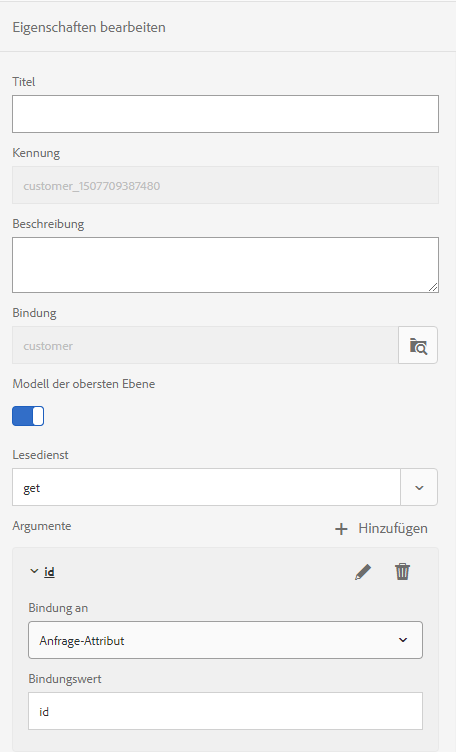

# Generieren mehrerer interaktiver Kommunikation mit der Batch-API {#use-batch-api-to-generate-multiple-ic}

Sie können die Batch-API verwenden, um mehrere interaktive Kommunikationen aus einer Vorlage zu erstellen. Die Vorlage ist eine interaktive Kommunikation ohne Daten. Die Batch-API kombiniert Daten mit einer Vorlage, um eine interaktive Kommunikation zu erzeugen. Die API ist bei der Massenproduktion interaktiver Kommunikation nützlich. Zum Beispiel Telefonrechnungen, Kreditkartenauszüge für mehrere Kunden.

Die Batch-API akzeptiert Datensätze (Daten) im JSON-Format und aus einem Formulardatenmodell. Die Anzahl der erzeugten interaktiven Kommunikation entspricht den Datensätzen, die in der JSON-Eingabedatei im konfigurierten Formulardatenmodell angegeben sind. Sie können die API verwenden, um sowohl Druck- als auch Webausgaben zu erstellen. Die PRINT -Option erzeugt ein PDF-Dokument und die WEB -Option erzeugt Daten im JSON-Format für jeden einzelnen Datensatz.

## Verwenden der Batch-API {#using-the-batch-api}

Sie können die Batch-API zusammen mit überwachten Ordnern oder als eigenständige REST-API verwenden. Sie konfigurieren eine Vorlage, einen Ausgabetyp (HTML, PRINT oder beides), ein Gebietsschema, einen Vorbefüllungs-Dienst und einen Namen für die generierte interaktive Kommunikation, um die Batch-API zu verwenden.

Sie kombinieren einen Datensatz mit einer Vorlage für interaktive Kommunikation, um eine interaktive Kommunikation zu erzeugen. Batch-APIs können Datensätze (Daten für interaktive Kommunikationsvorlagen) direkt aus einer JSON-Datei oder aus einer externen Datenquelle lesen, auf die über das Formulardatenmodell zugegriffen wird. Sie können jeden Datensatz in einer separaten JSON-Datei speichern oder ein JSON-Array erstellen, um alle Datensätze in einer Datei zu speichern.

**Ein einzelner Datensatz in einer JSON-Datei**

```json
{
   "employee": {
       "name": "Sara",
       "id": 3,
       "mobileNo": 9871996463,
       "age": 37
   }
}
```

**Mehrere Datensätze in einer JSON-Datei**

```json
[{
   "employee": {
       "name": "John",
       "id": 1,
       "mobileNo": 9871996461,
       "age": 39
   }
},{
   "employee": {
       "name": "Jacob",
       "id": 2,
       "mobileNo": 9871996462,
       "age": 38
   }
},{
   "employee": {
       "name": "Sara",
       "id": 3,
       "mobileNo": 9871996463,
       "age": 37
   }
}]
```

### Verwenden der Batch-API mit überwachten Ordnern {#using-the-batch-api-watched-folders}

Um die API einfach zu erleben, stellt AEM Forms einen Dienst für überwachte Ordner bereit, der für die Verwendung der Batch-API konfiguriert ist. Sie können über die Benutzeroberfläche von AEM Forms auf den Dienst zugreifen, um mehrere interaktive Kommunikationen zu generieren. Sie können auch benutzerdefinierte Dienste entsprechend Ihren Anforderungen erstellen. Sie können die unten aufgeführten Methoden verwenden, um die Batch-API mit dem überwachten Ordner zu verwenden:

* Geben Sie Eingabedaten (Datensätze) im JSON-Dateiformat an, um eine interaktive Kommunikation zu erstellen
* Verwenden Sie Eingabedaten (Datensätze), die in einer externen Datenquelle gespeichert sind und über ein Formulardatenmodell aufgerufen werden, um eine interaktive Kommunikation zu erstellen.

#### Geben Sie Eingabedatendatensätze im JSON-Dateiformat an, um eine interaktive Kommunikation zu erstellen {#specify-input-data-in-JSON-file-format}

Sie kombinieren einen Datensatz mit einer Vorlage für interaktive Kommunikation, um eine interaktive Kommunikation zu erzeugen. Sie können für jeden Datensatz eine separate JSON-Datei erstellen oder ein JSON-Array erstellen, um alle Datensätze in einer Datei zu speichern:

So erstellen Sie eine interaktive Kommunikation aus Datensätzen, die in einer JSON-Datei gespeichert sind:

1. Erstellen Sie einen [überwachten Ordner](https://docs.adobe.com/content/help/en/experience-manager-64/forms/publish-process-aem-forms/creating-configure-watched-folder.html) und konfigurieren Sie ihn für die Verwendung der Batch-API:
   1. Melden Sie sich bei der AEM Forms-Autoreninstanz an.
   1. Navigieren Sie zu **[!UICONTROL Tools]** > **[!UICONTROL Forms]** > **[!UICONTROL Überwachten Ordner konfigurieren]**. Tippen Sie auf **[!UICONTROL Neu]**.
   1. Geben Sie den **[!UICONTROL Namen]** und den physischen **[!UICONTROL Pfad]** des Ordners an. Beispiel: `c:\batchprocessing`.
   1. Wählen Sie die Option **[!UICONTROL Service]** im Feld **[!UICONTROL Prozessdatei mit]** aus.
   1. Wählen Sie den Dienst **[!UICONTROL com.adobe.fd.ccm.multichannel.batch.impl.service.InteractiveCommunicationBatchServiceImpl]** im Feld **[!UICONTROL Dienstname]** aus.
   1. Geben Sie ein **[!UICONTROL Output File Pattern]** an. Beispielsweise gibt %F/ [pattern](https://helpx.adobe.com/experience-manager/6-5/forms/using/admin-help/configuring-watched-folder-endpoints.html#about_file_patterns) an, dass der überwachte Ordner Eingabedateien in einem Unterordner des Ordners &quot;Überwachter Ordner\input&quot;finden kann.
1. Erweiterte Parameter konfigurieren:
   1. Öffnen Sie die Registerkarte **[!UICONTROL Erweitert]** und fügen Sie die folgenden benutzerdefinierten Eigenschaften hinzu:

      | Eigenschaft | Typ | Beschreibung |
      |--- |--- |--- |
      | templatePath | Zeichenfolge | Geben Sie den Pfad der zu verwendenden interaktiven Kommunikationsvorlage an. Beispiel: /content/dam/formsanddocuments/testsample/mediumic. Dies ist eine obligatorische Eigenschaft. |
      | recordPath | Zeichenfolge | Der Wert des Felds recordPath hilft beim Festlegen des Namens einer interaktiven Kommunikation. Sie können den Pfad eines Datensatzfelds als Wert des Felds recordPath festlegen. Wenn Sie beispielsweise /employee/Id angeben, wird der Wert des ID-Felds zu Name für die entsprechende interaktive Kommunikation. Der Standardwert ist eine zufällige [zufällige UUID](https://docs.oracle.com/javase/7/docs/api/java/util/UUID.html#randomUUID()). |
      | usePrefillService | Boolesch | Legen Sie den Wert auf False fest. Sie können den Parameter usePrefillService verwenden, um die interaktive Kommunikation mit Daten vorzufüllen, die aus dem Vorbefüllungs-Dienst abgerufen wurden und für die entsprechende interaktive Kommunikation konfiguriert sind. Wenn usePrefillService auf &quot;true&quot;gesetzt ist, werden Eingabe-JSON-Daten (für jeden Datensatz) als FDM-Argumente behandelt. Der Standardwert lautet false. |
      | batchType | Zeichenfolge | Setzen Sie den Wert auf PRINT, WEB oder WEB_AND_PRINT. Der Standardwert ist WEB_AND_PRINT. |
      | locale | Zeichenfolge | Geben Sie das Gebietsschema für die Ausgabe der interaktiven Kommunikation an. Der vordefinierte Dienst verwendet nicht die Sprachoption, Sie können jedoch einen benutzerdefinierten Dienst erstellen, um lokalisierte interaktive Kommunikation zu generieren. Der Standardwert ist en_US . |

   1. Tippen Sie auf **[!UICONTROL Erstellen]** Der überwachte Ordner wird erstellt.
1. Verwenden Sie den überwachten Ordner, um interaktive Kommunikation zu generieren:
   1. Öffnen Sie den überwachten Ordner. Navigieren Sie zum Eingabeordner.
   1. Erstellen Sie einen Ordner im Eingabeordner und legen Sie die JSON-Datei im neu erstellten Ordner ab.
   1. Warten Sie, bis der überwachte Ordner die Datei verarbeitet hat. Wenn die Verarbeitung beginnt, werden die Eingabedatei und der Unterordner, die die Datei enthalten, in den Staging-Ordner verschoben.
   1. Öffnen Sie den Ordner &quot;Output&quot;, um die Ausgabe anzuzeigen:
      * Wenn Sie die PRINT-Option in der Konfiguration des überwachten Ordners angeben, wird die PDF-Ausgabe für die interaktive Kommunikation generiert.
      * Wenn Sie die WEB-Option in der Konfiguration des überwachten Ordners angeben, wird eine JSON-Datei pro Datensatz generiert. Sie können die JSON-Datei verwenden, um [eine Webvorlage vorab auszufüllen](#web-template).
      * Wenn Sie sowohl PRINT- als auch WEB-Optionen angeben, werden sowohl PDF-Dokumente als auch eine JSON-Datei pro Datensatz generiert.

#### Verwenden Sie Eingabedaten, die in einer externen Datenquelle gespeichert sind und über das Formulardatenmodell aufgerufen werden, um eine interaktive Kommunikation zu erzeugen {#use-fdm-as-data-source}

Sie kombinieren in einer externen Datenquelle gespeicherte Daten (Datensätze) mit einer interaktiven Kommunikationsvorlage, um eine interaktive Kommunikation zu erzeugen. Wenn Sie eine interaktive Kommunikation erstellen, verbinden Sie sie über ein Formulardatenmodell (FDM) mit einer externen Datenquelle, um auf Daten zuzugreifen. Sie können den Batch-Prozessdienst für überwachte Ordner konfigurieren, um Daten mit demselben Formulardatenmodell aus einer externen Datenquelle abzurufen. Erstellen Sie nach [eine interaktive Kommunikation aus Datensätzen, die in einer externen Datenquelle](https://docs.adobe.com/content/help/en/experience-manager-64/forms/form-data-model/work-with-form-data-model.html) gespeichert sind:

1. Konfigurieren Sie das Formulardatenmodell der Vorlage:
   1. Öffnen Sie das Formulardatenmodell, das mit der Vorlage für interaktive Kommunikation verknüpft ist.
   1. Wählen Sie das MODELLOBJEKT AUF DER OBERSTEN EBENE aus und tippen Sie auf Eigenschaften bearbeiten .
   1. Wählen Sie den Dienst zum Abrufen oder Abrufen aus dem Feld Dienst lesen im Bereich Eigenschaften bearbeiten aus.
   1. Tippen Sie auf das Stiftsymbol für das Argument des Lesedienstes, um das Argument an ein Anforderungsattribut zu binden, und geben Sie den Bindungswert an. Er bindet das Dienstargument an das angegebene Bindungsattribut oder den angegebenen Literalwert, der an den Dienst als Argument übergeben wird, um mit dem angegebenen Wert verknüpfte Details aus der Datenquelle abzurufen.

      <br>
        In diesem Beispiel nimmt das id-Argument den Wert des id-Attributs des Benutzerprofils und übergibt ihn als Argument an den Lesedienst. Sie liest Werte der zugehörigen Eigenschaften aus dem Datenmodellobjekt employee für die angegebene ID und gibt sie zurück. Wenn Sie also 00250 im Feld ID im Formular angeben, liest der Lesedienst die Details des Mitarbeiters mit der Mitarbeiter-ID 00250.
        <br>

      

   1. Speichern Sie Eigenschaften und Formulardatenmodell.
1. Wert für Anforderungsattribut konfigurieren:
   1. Erstellen Sie eine JSON-Datei in Ihrem Dateisystem und öffnen Sie sie zur Bearbeitung.
   1. Erstellen Sie ein JSON-Array und geben Sie das primäre Attribut an, um Daten aus dem Formulardatenmodell abzurufen. Beispielsweise fordert die folgende JSON-Datei FDM auf, Daten von Datensätzen mit einer ID von 27126 oder 27127 zu senden:

      ```json
          [
              {
                  "id": 27126
              },
              {
                  "id": 27127
              }
          ]
      ```

   1. Speichern und schließen Sie die Datei.

1. Erstellen Sie einen [überwachten Ordner](https://docs.adobe.com/content/help/en/experience-manager-64/forms/publish-process-aem-forms/creating-configure-watched-folder.html) und konfigurieren Sie ihn für die Verwendung des Batch-API-Dienstes:
   1. Melden Sie sich bei der AEM Forms-Autoreninstanz an.
   1. Navigieren Sie zu **[!UICONTROL Tools]** > **[!UICONTROL Forms]** > **[!UICONTROL Überwachten Ordner konfigurieren]**. Tippen Sie auf **[!UICONTROL Neu]**.
   1. Geben Sie den **[!UICONTROL Namen]** und den physischen **[!UICONTROL Pfad]** des Ordners an. Beispiel: `c:\batchprocessing`.
   1. Wählen Sie die Option **[!UICONTROL Service]** im Feld **[!UICONTROL Prozessdatei mit]** aus.
   1. Wählen Sie den Dienst **[!UICONTROL com.adobe.fd.ccm.multichannel.batch.impl.service.InteractiveCommunicationBatchServiceImpl]** im Feld **[!UICONTROL Dienstname]** aus.
   1. Geben Sie ein **[!UICONTROL Output File Pattern]** an. Beispielsweise gibt %F/ [pattern](https://helpx.adobe.com/experience-manager/6-5/forms/using/admin-help/configuring-watched-folder-endpoints.html#about_file_patterns) an, dass der überwachte Ordner Eingabedateien in einem Unterordner des Ordners &quot;Überwachter Ordner\input&quot;finden kann.
1. Erweiterte Parameter konfigurieren:
   1. Öffnen Sie die Registerkarte **[!UICONTROL Erweitert]** und fügen Sie die folgenden benutzerdefinierten Eigenschaften hinzu:

      | Eigenschaft | Typ | Beschreibung |
      |--- |--- |--- |
      | templatePath | Zeichenfolge | Geben Sie den Pfad der zu verwendenden interaktiven Kommunikationsvorlage an. Beispiel: /content/dam/formsanddocuments/testsample/mediumic. Dies ist eine obligatorische Eigenschaft. |
      | recordPath | Zeichenfolge | Der Wert des Felds recordPath hilft beim Festlegen des Namens einer interaktiven Kommunikation. Sie können den Pfad eines Datensatzfelds als Wert des Felds recordPath festlegen. Wenn Sie beispielsweise /employee/Id angeben, wird der Wert des ID-Felds zu Name für die entsprechende interaktive Kommunikation. Der Standardwert ist eine zufällige [zufällige UUID](https://docs.oracle.com/javase/7/docs/api/java/util/UUID.html#randomUUID()). |  |
      | usePrefillService | Boolesch | Legen Sie den Wert auf True fest. Der Standardwert lautet false.  Wenn der Wert auf &quot;true&quot;gesetzt ist, liest die Batch-API Daten aus dem konfigurierten Formulardatenmodell und füllt sie in die interaktive Kommunikation. Wenn usePrefillService auf &quot;true&quot;gesetzt ist, werden Eingabe-JSON-Daten (für jeden Datensatz) als FDM-Argumente behandelt. |
      | batchType | Zeichenfolge | Setzen Sie den Wert auf PRINT, WEB oder WEB_AND_PRINT. Der Standardwert ist WEB_AND_PRINT. |
      | locale | Zeichenfolge | Geben Sie das Gebietsschema für die Ausgabe der interaktiven Kommunikation an. Der vordefinierte Dienst verwendet nicht die Sprachoption, Sie können jedoch einen benutzerdefinierten Dienst erstellen, um lokalisierte interaktive Kommunikation zu generieren. Der Standardwert ist en_US. |

   1. Tippen Sie auf **[!UICONTROL Erstellen]** Der überwachte Ordner wird erstellt.
1. Verwenden Sie den überwachten Ordner, um interaktive Kommunikation zu generieren:
   1. Öffnen Sie den überwachten Ordner. Navigieren Sie zum Eingabeordner.
   1. Erstellen Sie einen Ordner im Eingabeordner. Platzieren Sie die in Schritt 2 erstellte JSON-Datei im neu erstellten Ordner.
   1. Warten Sie, bis der überwachte Ordner die Datei verarbeitet hat. Wenn die Verarbeitung beginnt, werden die Eingabedatei und der Unterordner, die die Datei enthalten, in den Staging-Ordner verschoben.
   1. Öffnen Sie den Ordner &quot;Output&quot;, um die Ausgabe anzuzeigen:
      * Wenn Sie die PRINT-Option in der Konfiguration des überwachten Ordners angeben, wird die PDF-Ausgabe für die interaktive Kommunikation generiert.
      * Wenn Sie die WEB-Option in der Konfiguration des überwachten Ordners angeben, wird eine JSON-Datei pro Datensatz generiert. Sie können die JSON-Datei verwenden, um [eine Webvorlage vorab auszufüllen](#web-template).
      * Wenn Sie sowohl PRINT- als auch WEB-Optionen angeben, werden sowohl PDF-Dokumente als auch eine JSON-Datei pro Datensatz generiert.

## Rufen Sie die Batch-API mithilfe von REST-Anfragen auf.

Sie können [die Batch-API](https://helpx.adobe.com/de/experience-manager/6-5/forms/javadocs/index.html) über REST-Anfragen (Reational State Transfer) aufrufen. Damit können Sie anderen Benutzern einen REST-Endpunkt bereitstellen, um auf die API zuzugreifen und Ihre eigenen Methoden zur Verarbeitung, Speicherung und Anpassung der interaktiven Kommunikation zu konfigurieren. Sie können Ihr eigenes benutzerdefiniertes Java-Servlet entwickeln, um die API auf Ihrer AEM-Instanz bereitzustellen.

Stellen Sie vor der Bereitstellung des Java-Servlets sicher, dass Sie über eine interaktive Kommunikation und entsprechende Datendateien verfügen. Führen Sie die folgenden Schritte aus, um das Java-Servlet zu erstellen und bereitzustellen:

1. Melden Sie sich bei Ihrer AEM-Instanz an und erstellen Sie eine interaktive Kommunikation. Um die interaktive Kommunikation zu verwenden, die im folgenden Beispielcode erwähnt wird, klicken Sie [hier](assets/SimpleMediumIC.zip).
1. [Erstellen und stellen Sie ein AEM Projekt mithilfe von Apache ](https://helpx.adobe.com/experience-manager/using/maven_arch13.html) Mavenon in Ihrer AEM-Instanz bereit.
1. Fügen Sie [AEM Forms Client SDK Version 6.0.12](https://repo.adobe.com/nexus/content/repositories/public/com/adobe/aemfd/aemfd-client-sdk/) oder höher in der Abhängigkeitsliste der POM-Datei Ihres AEM-Projekts hinzu. Beispiel:

   ```xml
       <dependency>
           <groupId>com.adobe.aemfd</groupId>
           <artifactId>aemfd-client-sdk</artifactId>
           <version>6.0.122</version>
       </dependency>
   ```

1. Öffnen Sie das Java-Projekt und erstellen Sie eine .java-Datei, z. B. CCMBatchServlet.java. Fügen Sie der Datei den folgenden Code hinzu:

   ```java
           package com.adobe.fd.ccm.multichannel.batch.integration;
   
           import java.io.File;
           import java.io.FileInputStream;
           import java.io.FileOutputStream;
           import java.io.IOException;
           import java.io.InputStream;
           import java.io.PrintWriter;
           import java.util.List;
           import javax.servlet.Servlet;
           import org.apache.commons.io.IOUtils;
           import org.apache.sling.api.SlingHttpServletRequest;
           import org.apache.sling.api.SlingHttpServletResponse;
           import org.apache.sling.api.servlets.SlingAllMethodsServlet;
           import org.json.JSONArray;
           import org.json.JSONObject;
           import org.osgi.service.component.annotations.Component;
           import org.osgi.service.component.annotations.Reference;
   
           import com.adobe.fd.ccm.multichannel.batch.api.builder.BatchConfigBuilder;
           import com.adobe.fd.ccm.multichannel.batch.api.factory.BatchComponentBuilderFactory;
           import com.adobe.fd.ccm.multichannel.batch.api.model.BatchConfig;
           import com.adobe.fd.ccm.multichannel.batch.api.model.BatchInput;
           import com.adobe.fd.ccm.multichannel.batch.api.model.BatchResult;
           import com.adobe.fd.ccm.multichannel.batch.api.model.BatchType;
           import com.adobe.fd.ccm.multichannel.batch.api.model.RecordResult;
           import com.adobe.fd.ccm.multichannel.batch.api.model.RenditionResult;
           import com.adobe.fd.ccm.multichannel.batch.api.service.BatchGeneratorService;
           import com.adobe.fd.ccm.multichannel.batch.util.BatchConstants;
           import java.util.Date;
   
   
           @Component(service=Servlet.class,
           property={
                   "sling.servlet.methods=GET",
                   "sling.servlet.paths="+ "/bin/batchServlet"
           })
           public class CCMBatchServlet extends SlingAllMethodsServlet {
   
               @Reference
               private BatchGeneratorService batchGeneratorService;
               @Reference
               private BatchComponentBuilderFactory batchBuilderFactory;
               public void doGet(SlingHttpServletRequest req, SlingHttpServletResponse resp) {
                   try {
                       executeBatch(req,resp);
                   } catch (Exception e) {
                       e.printStackTrace();
                   }
               }
               private void executeBatch(SlingHttpServletRequest req, SlingHttpServletResponse resp) throws Exception {
                   int count = 0;
                   JSONArray inputJSONArray = new JSONArray();
                   String filePath = req.getParameter("filePath");
                   InputStream is = new FileInputStream(filePath);
                   String data = IOUtils.toString(is);
                   try {
                       // If input file is json object, then create json object and add in json array, if not then try for json array
                       JSONObject inputJSON = new JSONObject(data);
                       inputJSONArray.put(inputJSON);
                   } catch (Exception e) {
                       try {
                           // If input file is json array, then iterate and add all objects into inputJsonArray otherwise throw exception
                           JSONArray inputArray = new JSONArray(data);
                           for(int i=0;i<inputArray.length();i++) {
                               inputJSONArray.put(inputArray.getJSONObject(i));
                           }
                       } catch (Exception ex) {
                           throw new Exception("Invalid JSON Data. File name : " + filePath, ex);
                       }
                   }
                   BatchInput batchInput = batchBuilderFactory.getBatchInputBuilder().setData(inputJSONArray).setTemplatePath("/content/dam/formsanddocuments/[path of the interactive communcation]").build();
                   BatchConfig batchConfig = batchBuilderFactory.getBatchConfigBuilder().setBatchType(BatchType.WEB_AND_PRINT).build();
                   BatchResult batchResult = batchGeneratorService.generateBatch(batchInput, batchConfig);
                   List<RecordResult> recordList = batchResult.getRecordResults();
                   JSONObject result = new JSONObject();
                   for (RecordResult recordResult : recordList) {
                       String recordId = recordResult.getRecordID();
                       for (RenditionResult renditionResult : recordResult.getRenditionResults()) {
                           if (renditionResult.isRecordPassed()) {
                               InputStream output = renditionResult.getDocumentStream().getInputStream();
                               result.put(recordId +"_"+renditionResult.getContentType(), output);
   
                               Date date= new Date();
                               long time = date.getTime();
   
                               // Print output
                               if(getFileExtension(renditionResult.getContentType()).equalsIgnoreCase(".json")) {
                                   File file = new File(time + getFileExtension(renditionResult.getContentType()));
                                   copyInputStreamToFile(output, file);
                               } else
                               {
                                   File file = new File(time + getFileExtension(renditionResult.getContentType()));
                                   copyInputStreamToFile(output, file);
                               }
                           }
                       }
                   }
                   PrintWriter writer = resp.getWriter();
                   JSONObject resultObj = new JSONObject();
                   resultObj.put("result", result);
                   writer.write(resultObj.toString());
               }
   
   
               private static void copyInputStreamToFile(InputStream inputStream, File file)
                       throws IOException {
   
                       try (FileOutputStream outputStream = new FileOutputStream(file)) {
   
                           int read;
                           byte[] bytes = new byte[1024];
   
                           while ((read = inputStream.read(bytes)) != -1) {
                               outputStream.write(bytes, 0, read);
                           }
   
                       }
   
                   }
   
   
               private String getFileExtension(String contentType) {
                   if (contentType.endsWith(BatchConstants.JSON)) {
                       return ".json";
                   } else return ".pdf";
               }
   
   
           }
   ```

1. Ersetzen Sie im obigen Code den Vorlagenpfad (setTemplatePath) durch den Pfad Ihrer Vorlage und legen Sie den Wert der setBatchType-API fest:
   * Wenn Sie die PRINT-Option angeben, wird die PDF-Ausgabe für die interaktive Kommunikation generiert.
   * Wenn Sie die WEB-Option angeben, wird eine JSON-Datei pro Datensatz generiert. Sie können die JSON-Datei verwenden, um [eine Webvorlage vorab auszufüllen](#web-template).
   * Wenn Sie sowohl PRINT- als auch WEB-Optionen angeben, werden sowohl PDF-Dokumente als auch eine JSON-Datei pro Datensatz generiert.

1. [Verwenden Sie Maven, um den aktualisierten Code für Ihre AEM-Instanz](https://helpx.adobe.com/experience-manager/using/maven_arch13.html#BuildtheOSGibundleusingMaven) bereitzustellen.
1. Rufen Sie die Batch-API auf, um die interaktive Kommunikation zu generieren. Die Batch-API druckt einen Stream von PDF- und JSON-Dateien abhängig von der Anzahl der Datensätze zurück. Sie können die JSON-Datei verwenden, um [eine Webvorlage vorab auszufüllen](#web-template). Wenn Sie den obigen Code verwenden, wird die API unter `http://localhost:4502/bin/batchServlet` bereitgestellt. Der Code druckt und gibt einen Stream von PDF- und JSON-Dateien zurück.

### Vorausfüllen einer Webvorlage {#web-template}

Wenn Sie batchType auf die Wiedergabe des Webkanals festlegen, generiert die API eine JSON-Datei für jeden Datensatz. Sie können die folgende Syntax verwenden, um die JSON-Datei mit dem entsprechenden Webkanal zusammenzuführen und eine interaktive Kommunikation zu generieren:

**Syntax**
`http://host:port/<template-path>/jcr:content?channel=web&mode=preview&guideMergedJsonPath=<guide-merged-json-path>`

****
Beispiel: Wenn sich Ihre JSON-Datei unter befindet  `C:\batch\mergedJsonPath.json` und Sie die folgende interaktive Kommunikationsvorlage verwenden:  `http://host:port/content/dam/formsanddocuments/testsample/mediumic/jcr:content?channel=web`

Anschließend zeigt die folgende URL auf dem Veröffentlichungsknoten den Webkanal der interaktiven Kommunikation an
`http://host:port/<path-to-ic>/jcr:content?channel=web&mode=preview&guideMergedJsonPath=file:///C:/batch/mergedJsonData.json`

Sie speichern nicht nur die Daten im Dateisystem, sondern auch JSON-Dateien im CRX-Repository, Dateisystem oder Webserver oder können über den OSGi-Vorbefüllungs-Service auf Daten zugreifen. Syntax zum Zusammenführen von Daten mithilfe verschiedener Protokolle:

* **CRX-Protokoll**

   `http://host:port/<path-to-ic>/jcr:content?channel=web&mode=preview&guideMergedJsonPath=crx:///tmp/fd/af/mergedJsonData.json`

* **Dateiprotokoll**

   `http://host:port/<path-to-ic>/jcr:content?channel=web&mode=preview&guideMergedJsonPath=file:///C:/Users/af/mergedJsonData.json`

* **Vorbefüllungs-Dienstprotokoll**

   `http://host:port/<path-to-ic>/jcr:content?channel=web&mode=preview&guideMergedJsonPath=service://[SERVICE_NAME]/[IDENTIFIER]`

   SERVICE_NAME verweist auf den Namen des OSGI-Vorbefüllungs-Dienstes. Lesen Sie Erstellen und Ausführen eines Vorbefüllungs-Dienstes.

   BEZEICHNER bezieht sich auf alle Metadaten, die vom OSGI-Vorbefüllungs-Dienst erforderlich sind, um die Daten zum Vorbefüllen aufzurufen. Ein Bezeichner für den angemeldeten Benutzer ist ein Beispiel für die Metadaten, die verwendet werden könnten.

* **HTTP-Protokoll**

   `http://host:port/<path-to-ic>/jcr:content?channel=web&mode=preview&guideMergedJsonPath=http://localhost:8000/somesamplexmlfile.xml`

>[!NOTE]
>
>Standardmäßig ist nur das CRX-Protokoll aktiviert. Informationen zum Aktivieren anderer unterstützter Protokolle finden Sie unter [Konfigurieren des Vorbefüllungs-Dienstes mit Configuration Manager](https://helpx.adobe.com/experience-manager/6-5/forms/using/prepopulate-adaptive-form-fields.html#ConfiguringprefillserviceusingConfigurationManager).
