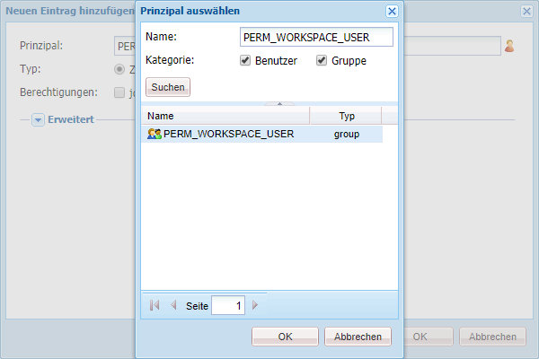

# Generische Schritte zur Anpassung von AEM Forms Workspace{#generic-steps-for-aem-forms-workspace-customization}

Für jede Anpassung gelten die folgenden generischen Schritte:

1. Log in to CRXDE Lite by accessing `https://'[server]:[port]'/lc/crx/de/index.jsp`.
1. Create a folder named `ws`at `/apps`, if it does not exist. Klicken Sie auf **[!UICONTROL Alle speichern]**.
1. Browse to `/apps/ws`, and navigate to the **[!UICONTROL Access Control]** tab.
1. In the **[!UICONTROL Access Control]** list, click **[!UICONTROL +]** to add a new entry. Klicken Sie erneut auf **[!UICONTROL +]**.
1. Search and select the **PERM_WORKSPACE_USER** Principal.

   

1. Give `jcr:read` privilege to the Principal.
1. Klicken Sie auf **[!UICONTROL Alle speichern]**.
1. Copy the `GET.jsp` and `html.jsp`files from the `/libs/ws`folder to the `/apps/ws` folder.
1. Kopieren Sie den `/libs/ws/locales` Ordner im `/apps/ws` Ordner. Klicken Sie auf **[!UICONTROL Alle speichern]**.
1. Update the references and relative paths in the `GET.jsp` file, as shown below, and click **[!UICONTROL Save all]**.

   ```
   <meta http-equiv="refresh" content="0;URL='/lc/apps/ws/index.html'" />
   ```

1. Führen Sie die folgenden Schritte für CSS-Anpassungen aus:

   1. Navigate to the `/apps/ws` folder and create a new folder named `css`.

   1. Erstellen Sie im Ordner `css` eine neue Datei mit dem Namen `newStyle.css`.

   1. Open `/apps/ws/html`.jsp and change from

   ```css
   <link lang="en" rel="stylesheet" type="text/css" href="css/style.css" />
   <link lang="en" rel="stylesheet" type="text/css" href="css/jquery-ui.css"/>
   ```

   in

   ```css
   <link lang="en" rel="stylesheet" type="text/css" href="../../libs/ws/css/style.css" />
   <link lang="en" rel="stylesheet" type="text/css" href="css/newStyle.css" />
   <link lang="en" rel="stylesheet" type="text/css" href="../../libs/ws/css/jquery-ui.css"/>
   ```

   >[!NOTE]
   >
   >Platzieren Sie den Eintrag für die benutzerdefinierte CSS-Datei hinter demjenigen für die Datei newStyle.css, wie oben gezeigt.

1. Ändern Sie in der Datei „apps/ws/html.jsp“ von

   ```css
   <script data-main="js/main" src="js/libs/require/require.js"></script>
   ```

   in

   ```css
   <script data-main="js/main" src="../../libs/ws/js/libs/require/require.js"></script>
   ```

1. Gehen Sie folgendermaßen vor:

   1. Erstellen Sie einen Ordner mit dem Namen `js`at `/apps/ws`. Klicken Sie auf **[!UICONTROL Alle speichern]**.

   1. Erstellen Sie einen Ordner mit dem Namen `libs`at `/apps/ws/js`. Klicken Sie auf **[!UICONTROL Alle speichern]**.

   1. Erstellen Sie einen Ordner mit dem Namen `jqueryui`at `/apps/ws/js/libs`. Klicken Sie auf **[!UICONTROL Alle speichern]**.

   1. Kopieren `/libs/ws/js/libs/jqueryui/jquery.ui.datepicker-ja.js` nach `/apps/ws/js/libs/jqueryui`. Klicken Sie auf **[!UICONTROL Alle speichern]**.

1. Führen Sie die folgenden Schritte für HTML-Anpassungen aus:

   1. Erstellen Sie `/apps/ws/js`unter einen Ordner mit dem Namen `runtime`. Klicken Sie auf **[!UICONTROL Alle speichern]**.

   1. Erstellen Sie `/apps/ws/js/runtime`unter einen Ordner mit dem Namen `templates`. Klicken Sie auf **[!UICONTROL Alle speichern]**.

   1. Kopieren `/libs/ws/js/main.js` nach `/apps/ws/js/main.js`.

   1. Copy /libs/ws/js/registry.js to `/apps/ws/js/registry.js`.

1. Klicken Sie auf **[!UICONTROL Alle speichern]**, löschen Sie den Cache und aktualisieren Sie AEM Forms Workspace.

   Access the URL `https://'[server]:[port]'/lc/ws` and log in with administrator/password credentials. Der Browser leitet Sie zu `https://'[server]:[port]'/lc/apps/ws/index.html`.

[Support kontaktieren](https://www.adobe.com/account/sign-in.supportportal.html)
