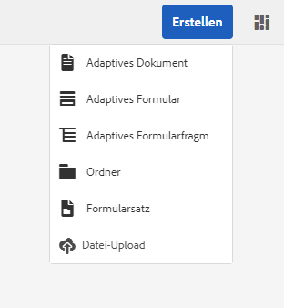
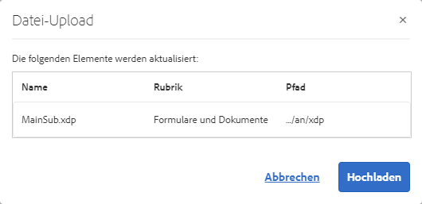
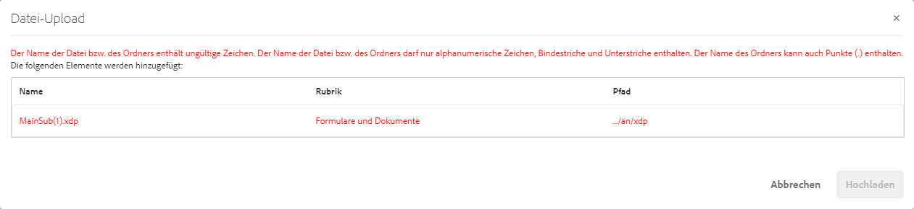
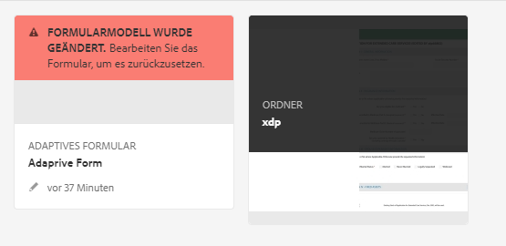
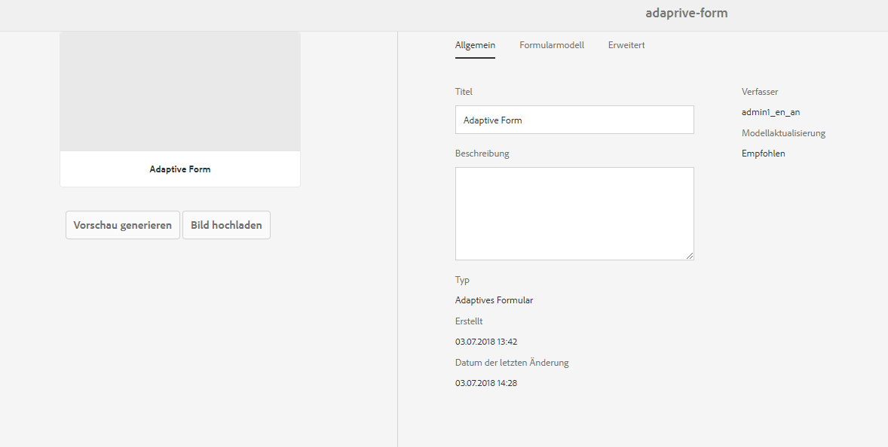

# XDP- und PDF-Dokumente in AEM Forms übernehmen{#getting-xdp-and-pdf-documents-in-aem-forms}

## Übersicht {#overview}

Sie können Formulare aus Ihrem lokalen Dateisystem in das CRX-Repository importieren, indem Sie sie in AEM Forms hochladen. Der Upload-Vorgang wird für die folgenden Assettypen unterstützt:

* Formularvorlagen (XFA-Formulare)
* PDF-Formulare
* Dokumente (reduzierte PDF-Dokumente)

Sie können die unterstützten Assettypen einzeln oder als ZIP-Archiv hochladen. Sie können ein Asset des Typs `Resource` nur zusammen mit einem XFA-Formular in einem ZIP-Archiv hochladen.

>[!NOTE]
>
>Vergewissern Sie sich, dass Sie Mitglied der Gruppe `form-power-users` sind, um XDP-Dateien hochladen zu können. Wenden Sie sich an Ihren Administrator, um Mitglied der Gruppe zu werden.

## Hochladen von Formularen {#uploading-forms}

1. Melden Sie sich bei der Benutzeroberfläche von AEM Forms an, indem Sie auf `https://'[server]:[port]'/aem/forms.html` zugreifen.
1. Navigieren Sie zu dem Ordner, in den Sie das Formular oder die Ordner mit Formularen hochladen möchten.
1. Auf der Aktionensymbolleiste klicken Sie auf **Erstellen > Datei hochladen**.

   

1. Mit dem Uploadformular- oder Paketdialogfeld können Sie die Datei suchen und auswählen, die Sie hochladen möchten. Im Dateibrowser werden nur die unterstützten Dateiformate angezeigt (ZIP, XDP und PDF).

   >[!NOTE]
   >
   >Ein Dateiname darf nur alphanumerische Zeichen, Bindestriche oder Unterstriche enthalten.

1. Klicken Sie nach der Dateiauswahl auf „Hochladen“, um die Dateien hochzuladen, oder klicken Sie auf „Abbrechen“, um den Upload abzubrechen. In einem Popup-Fenster werden die Assets aufgelistet, die hinzugefügt werden und die im aktuellen Speicherort aktualisiert werden.

   >[!NOTE]
   >
   >Bei einer ZIP-Datei werden die relativen Pfade aller unterstützten Assets angezeigt. Nicht unterstützte Assets in der ZIP-Datei werden ignoriert und nicht aufgelistet. Wenn das ZIP-Archiv jedoch nur die nicht unterstützten Assets enthält, wird anstelle des Popup-Dialogfensters eine Fehlermeldung angezeigt.

   

1. Wenn der Dateiname von einem oder mehreren Assets ungültig ist, wird ein Fehler angezeigt. Korrigieren Sie die rot markierten Dateinamen und laden Sie die Dateien erneut hoch.

   

Wenn der Upload abgeschlossen ist, wird basierend auf der Asset-Vorschau über einen Workflow im Hintergrund für jedes Asset eine Miniatur generiert. Wenn neuere Versionen von Assets hochgeladen werden, werden die vorhandenen Assets überschrieben.

### Geschützter Modus {#protected-mode}

AEM Forms-Server ermöglicht es Ihnen, JavaScript-Code auszuführen. Ein schadhafter JavaScript-Code kann eine AEM Forms-Umgebung beschädigen. Der abgesicherte Modus beschränkt AEM Forms darauf, XDP-Dateien nur von vertrauenswürdigen Assets und Speicherorten auszuführen. Alle XDPs, die in der AEM Forms-Benutzeroberfläche verfügbar sind, gelten als vertrauenswürdige Assets.

Der abgesicherte Modus ist standardmäßig aktiviert. Bei Bedarf können Sie den abgesicherten Modus deaktivieren:

1. Melden Sie sich bei der AEM Web-Konsole als Administrator an. Die URL lautet https://&#39;[server]:[port]&#39;/system/console/configMgr
1. Öffnen Sie Mobile Forms Konfigurationen für die Bearbeitung.
1. Wählen Sie die Option „Abgesicherter Modus“ und klicken Sie auf **Speichern**. Der abgesicherte Modus ist deaktiviert.

## Aktualisieren von referenzierten XFA-Formularen {#updating-referenced-xfa-forms}

In AEM Forms kann eine XFA-Formularvorlage durch ein adaptives Formular oder eine andere XFA-Formularvorlage referenziert werden. Des Weiteren kann eine Vorlage auf eine Ressource oder eine andere XFA-Vorlage verweisen.

Die Felder eines adaptiven Formulars, das auf eine XFA verweist, sind mit den Feldern verbunden, die in der XFA verfügbar sind. Nach dem Aktualisieren einer Formularvorlage, versucht das zugehörige adaptive Formular, sich mit der XFA zu synchronisieren. Weitere Informationen finden Sie unter[ Synchronisieren von adaptiven Formularen mit der zugehörigen XFA](../../forms/using/synchronizing-adaptive-forms-xfa.md).

Wenn eine Formularvorlage entfernt wird, wird das abhängige adaptive Formular bzw. die Formularvorlage beschädigt. Ein solches adaptives Formular wird manchmal auch als schmutziges Formular bezeichnet. In der AEM Forms-Benutzeroberfläche stehen Ihnen zwei Möglichkeiten zur Verfügung, die nachfolgend beschrieben werden, um die schmutzigen Formulare zu finden.

* In der Asset-Auflistung wird auf der Miniatur des adaptiven Formulars ein Warnsymbol angezeigt. Außerdem wird die folgende Nachricht angezeigt, wenn Sie den Zeiger über das Warnsymbol bewegen.\
   `Schema/Form Template for this adaptive form has been updated so please go to Authoring mode and rebase it with new version.`

Die Kennzeichnung bleibt bestehen, damit schmutzige adaptive Formulare erkannt werden. Diese Informationen befinden sich neben den Metadaten auf der Seite mit den Formulareigenschaften. Lediglich für unsaubere adaptive Formulare zeigt eine Metadateneigenschaft `Model Refresh` den Wert `Recommended` an.

