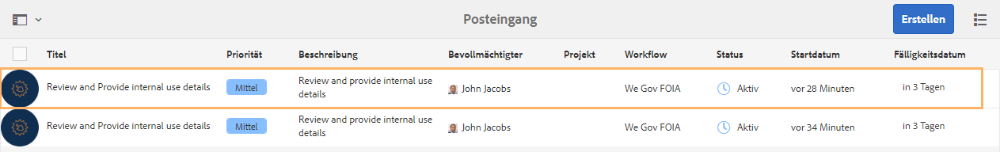
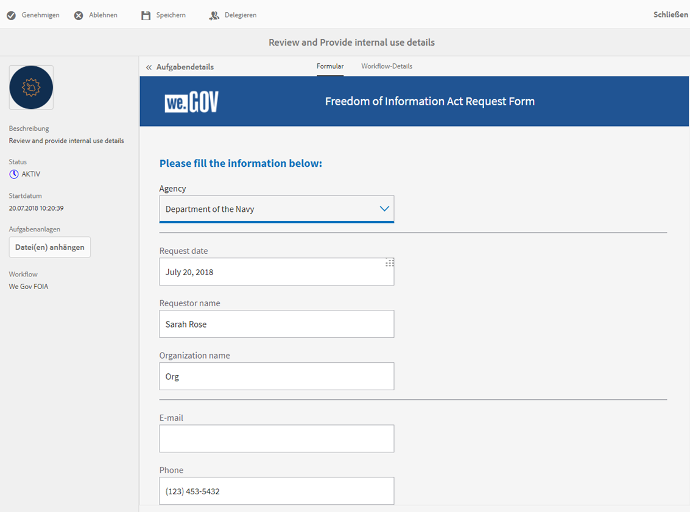
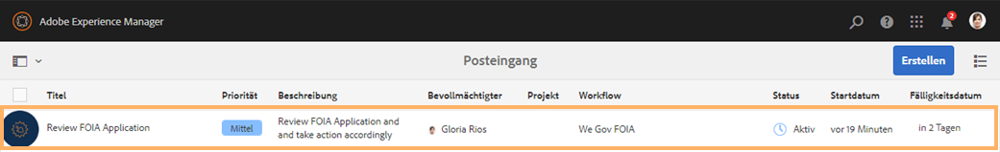
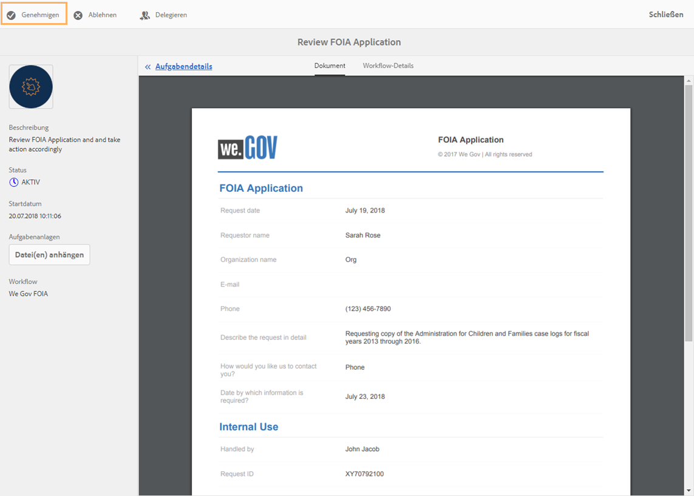

# FOIA-Anleitung zur We.Gov-Referenzwebsite {#we-gov-reference-site-foia-walkthrough}

## Freedom of Information Act-Szenario für Referenz-Website {#reference-site-freedom-of-information-act-scenario}

We.Gov ist eine staatliche Organisation, bei der Adoptiveltern für ihr adoptiertes Kind Kindergeld beantragen können. We.Gov ermöglicht es zudem Eltern, Informationen von den folgenden US-Regierungsstellen gemäß dem Freedom of Information Act (US-Bundesgesetz zur Informationsfreiheit) anzufordern:

* Defense Logistics Agency
* Department of Defense – Office of Inspector General
* Department of Justice – Office of Information Policy
* Department of the Navy
* Environmental Protection Agency

Weitere Informationen zum Freedom of Information Act finden Sie unter [https://www.foia.gov/](https://www.foia.gov).

Das Szenario schließt folgende Personen ein:

* Sarah Rose, die Person, die die Herausgabe von Informationen beantragt
* John Jacobs, die Person, die den Antrag bearbeitet und an die entsprechende Abteilung weiterleitet
* Gloria Rios, die Regierungsangestellte, die Informationen gemäß dem Antrag bereitstellt

## Sarah stellt einen Antrag auf Informationsherausgabe gemäß FOIA {#sarah-initiates-request-for-information-under-foia}

Unter dem Freedom of Information Act fordert Sarah eine Kopie der Fallprotokolle von der Behörde Administration for Children and Families für die Jahre (GJ) 2013 bis 2016 an. Sarah reicht diesen Antrag beim Department of Justice – Office Of Information Policy ein und gibt an, dass sie bereit ist, bis zu 100 USD für Druck- und Portokosten zu bezahlen.

### Funktionsweise {#how-it-works}

### Sehen Sie selbst {#see-it-yourself}

Öffnen Sie in Ihrem Browser `https://<hostname>:<PublishPort>/wegov`. Wählen Sie auf der We.Gov-Website „Applications > All Applications“ (Anträge > Alle Anträge) aus. Wählen Sie auf der Seite „All Applications“ (Alle Anträge) unter „Application for FOIA Request“ (Antrag für FOIA-Anfrage) „Apply“ (Beantragen) aus.

## Sarah stellt ihren Antrag auf Informationen gemäß FOIA. {#sarah-starts-her-application-for-information-under-foia}

Sarah klickt auf **Apply** (Beantragen) und gibt auf der Seite für das Freedom of Information Act-Antragsformular Informationen ein, darunter:

* **Agency** (Behörde): Sarah gibt die Behörde an, an die der Antrag gerichtet werden soll: Department of Justice – Office of Information Policy (Justizministerium – Büro für Informationspolitik).

* **Will Pay Up To** (Zahle bis zu): Sarah gibt an, dass sie bereit ist, bis zu 100 USD für Druck- und Portokosten zu zahlen.
* **Describe the request in detail** (Beschreiben Sie den Antrag im Detail): Sarah gibt an: „Anforderung einer Kopie der Fallprotokolle von Administration for Children and Families für die Geschäftsjahre 2013 bis 2016“.

Anfordern einer Kopie der Fallprotokolle von Administration for Children and Families für die Geschäftsjahre 2013 bis 2016

Sarah kann jederzeit **Save** (Speichern) auswählen, um den Entwurf des Formulars zu speichern und später zurückzukehren, um das Formular fertig auszufüllen und abzusenden. Sarah sendet das Formular ab.

>[!NOTE]
>
>Der Workflow „Von E-Mail fortsetzen“ funktioniert nur bei angemeldeten Benutzenden. Stellen Sie im Szenario für die Referenz-Website sicher, dass Sarah Rose als Benutzerin hinzugefügt wird. Sarahs Anmeldedaten lauten `srose/password`.

## John Jacobs erhält und genehmigt den Antrag {#john-jacobs-receives-and-approves-the-application}

John Jacobs erhält den Antrag und leitet ihn an die richtige Person weiter. Im AEM-Posteingang sieht John alle eingereichten Anträge an einem Ort.

### Funktionsweise {#how-it-works-1}

Wenn Sarah den FOIA-Antrag ausfüllt und absendet, wird ein entsprechender Datensatz an den Posteingang von John Jacobs gesendet. John Jacobs kann den eingereichten Antrag anzeigen und akzeptieren oder ablehnen.

### Sehen Sie selbst {#see-it-yourself-1}

Sie können auf den AEM-Posteingang unter „https://&lt;***Host-Name***>:&lt;***Veröffentlichungs-Port***>/content/we-finance/global/en/login.html?resource=/aem/inbox.html“ zugreifen. Melden Sie sich beim AEM-Posteingang mit „jjacobs/password“ (dem Benutzernamen/Kennwort von John Jacobs) an und zeigen Sie den FOIA-Antrag an. Weitere Informationen zur Verwendung des AEM-Posteingangs für formularzentrierte Workflow-Aufgaben finden Sie unter [Verwalten von Formularanwendungen und Aufgaben im AEM-Posteingang](/help/forms/using/manage-applications-inbox.md).

John Jacobs kann den Antrag vom Antrags-Dashboard aus anzeigen, genehmigen oder ablehnen. John Jacobs wählt den Antrag aus, öffnet die Antragsdetails, prüft den Antrag und genehmigt ihn.

### <strong>Sarah erhält eine Bestätigungs-E-Mail</strong> {#strong-sarah-receives-an-acknowledgement-email-strong}

Nachdem John Jacobs den Antrag genehmigt hat, erhält Sarah eine Bestätigungs-E-Mail von der We.Gov-Site. Sarah wird über die Gebühren und die Bearbeitungsdauer für ihren Antrag informiert. Die E-Mail enthält auch E-Mail- und Telefon-Kontaktdaten, über die Sarah sich über den Status ihres Antrags informieren kann.

## Gloria erhält den FOIA-Antrag zur Genehmigung auf zweiter Ebene {#gloria-receives-the-foia-request-for-second-level-approval}

Nachdem John Jacobs die erforderlichen Informationen eingegeben und Sarahs Antrag genehmigt hat, wird er Gloria Rios zur endgültigen Genehmigung vorgelegt. Gloria überprüft das beigefügte Datensatzdokument und genehmigt den Antrag.

### Funktionsweise {#how-it-works-2}

Wenn John Jacobs den FOIA-Antrag genehmigt, wird ein PDF- oder Datensatzdokument des Antrags erstellt und an Gloria Rios&#39; Posteingang gesendet. Gloria kann den eingereichten Antrag anzeigen und akzeptieren oder ablehnen.

### Sehen Sie selbst {#see-for-yourself}

Sie können auf den AEM-Posteingang unter „https://&lt;***Host-Name***>:&lt;***Veröffentlichungs-Port***>/content/we-finance/global/en/login.html?resource=/aem/inbox.html“ zugreifen. Melden Sie sich beim AEM-Posteingang mit „grios/password“ (dem Benutzernamen/Kennwort von Gloria Rios) an und sehen Sie sich den FOIS-Antrag an.

Gloria öffnet den Antrag und sieht sich die Details des FOIA-Antrags an. Nach Prüfung der Antragsdetails und der Durchführbarkeit der Bereitstellung der gewünschten Unterlagen genehmigt Gloria den Antrag.

## Sarah wird benachrichtigt, dass ihr Antrag genehmigt wurde {#sarah-receives-notification-that-her-request-is-approved}

Nachdem Gloria den FOIA-Antrag genehmigt hat, erhält Sarah eine E-Mail, in der sie darüber informiert wird, dass ihr Antrag genehmigt wurde. Die E-Mail enthält auch Informationen über den vorläufigen Zeitplan für die Bereitstellung der Unterlagen sowie Kontaktdetails für die Weiterverfolgung des Antrags.

