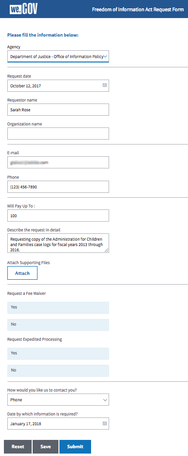

# FOIA-Anleitung zur We.Gov-Referenzwebsite {#we-gov-reference-site-foia-walkthrough}

## Freedom of Information Act-Szenario für Referenzwebsite {#reference-site-freedom-of-information-act-scenario}

We.Gov ist ein vom Staat geleitetes Unternehmen, bei dem sich Adoptiveltern für Kindergeld registrieren können, wenn sie ein Kind adoptiert haben. We.Gov ermöglicht auch Eltern, Informationen von den folgenden US-Regierungsstellen gemäß des Freedom of Information Act (Gesetz zur Informationsfreiheit) anzufordern:

* Defense Logistics Agency
* Department of Defense - Office of Inspector General
* Department of Justice - Office of Information Policy
* Department of the Navy
* Environmental Protection Agency

Weitere Informationen zum Freedom of Information Act finden Sie unter [www.foia.gov](https://www.foia.gov).

Das Szenario schließt folgende Personen ein:

* Sarah Rose, die Person, die die Herausgabe von Informationen beantragt
* John Jacobs, die Person, die den Antrag bearbeitet und an die entsprechende Abteilung weiterleitet
* Gloria Rios, die Regierungsangestellte, die Informationen gemäß Antrag bereitstellt

## Sarah stellt den Antrag auf Informationsherausgabe gemäß FOIA. {#sarah-initiates-request-for-information-under-foia}

Nach dem Freedom of Information Act fordert Sarah eine Kopie der Fallprotokolle von Administration for Children and Families für die Jahre (FY) 2013 bis 2016 an. Sarah sendet diesen Antrag an das Departent of Justice - Office Of Information Policy und gibt dabei an, dass sie bereit ist, bis zu 100 USD für Druck- und Portokosten zu bezahlen.

### Funktionsweise {#how-it-works}

### Sehen Sie selbst{#see-it-yourself} 

Öffnen Sie in Ihrem Browser `https://<hostname>:<PublishPort>/wegov`. Klicken Sie auf der We.Gov-Website auf „Applications“ > „All Applications“ (Anträge > Alle Anträge). Tippen Sie auf der Seite Alle Anwendungen unter Anwendung für FOIA-Anfrage auf Anwenden .

## Sarah stellt ihren Antrag auf Informationen gemäß FOIA.{#sarah-starts-her-application-for-information-under-foia}

Sarah klickt auf **Apply** und gibt auf der Seite &quot;Freedom of Information Act Request Form&quot;Informationen ein, darunter:

* **Agentur:** Sarah gibt die Agentur an, an die der Antrag gerichtet war, als Justizministerium - Amt für Informationspolitik.

* **Will Pay Up To** (Zahle bis zu): Sarah gibt an, dass sie bereit ist, bis zu 100 USD für Druck- und Portoausgaben zu zahlen.
* **Beschreiben Sie die Anforderung detailliert**: Sarah gibt &quot;Anfordern einer Kopie der Fallprotokolle von Administration for Children and Families für die Geschäftsjahre 2013 bis 2016&quot;an.

Anfordern einer Kopie der Fallprotokolle von Administration for Children and Families für die Geschäftsjahre 2013 bis 2016

Sarah kann jederzeit auf „Save“ (Speichern) tippen, um den Entwurf des Formulars zu speichern und später zurückzukehren, um das Formular fertig auszufüllen und zu senden. Sarah sendet das Formular.

>[!NOTE]
>
>Der Von-E-Mail-Arbeitsablauf funktioniert nur mit angemeldeten Benutzern. Im Referenzwebsite-Szenario stellen Sie sicher, dass der Benutzer Sarah Rose hinzugefügt wird. Sarahs Anmeldedaten sind `srose/password`.

## John Jacobs erhält und genehmigt den Antrag {#john-jacobs-receives-and-approves-the-application}

John Jacobs erhält den Antrag und leitet ihn an die richtige Person weiter. Im AEM-Posteingang können alle eingereichten Anträge an einem Ort angezeigt werden.

### Funktionsweise {#how-it-works-1}

Wenn Sarah den FOIA-Antrag ausfüllt und abschickt, wird eine Aufzeichnung davon an den Posteingang von John Jacobs gesendet. John Jacobs kann den eingereichten Antrag anzeigen und akzeptieren oder ablehnen.

### Sehen Sie selbst{#see-it-yourself-1} 

Sie können auf den AEM-Posteingang unter https://&lt;***Hostname***:&lt;***PublishPort***>/content/we-finance/global/en/login.html?resource=/aem/inbox.html zugreifen. Melden Sie sich beim AEM-Posteingang mit jjacobs/password als Benutzernamen/Kennwort für John Jacobs an und sehen Sie sich den FOIA-Antrag an. Informationen zur Verwendung AEM Posteingangs für formularzentrierte Workflow-Aufgaben finden Sie unter [Verwalten von Forms-Anwendungen und -Aufgaben in AEM Posteingang](/help/forms/using/manage-applications-inbox.md).

John Jacobs kann den Antrag vom Antrags-Dashboard aus anzeigen, genehmigen oder ablehnen. John Jacobs wählt und öffnet die Antragsdetails, prüft den Antrag und genehmigt ihn.

### <strong>Sarah erhält eine Bestätigungs-E-Mail</strong> {#strong-sarah-receives-an-acknowledgement-email-strong}

Nachdem John Jacobs den Antrag genehmigt hat, erhält Sarah eine Bestätigungs-E-Mail von der We.Gov-Website. Sarah wird über die Gebühren und die Bearbeitungsdauer für ihren Antrag informiert. Die E-Mail enthält auch E-Mail- und Telefondetails, über die Sarah Kontakt aufnehmen kann, um Neuigkeiten zu ihrem Antrag zu erhalten.

## Gloria erhält den FOIA-Antrag zur Genehmigung auf der zweiten Ebene {#gloria-receives-the-foia-request-for-second-level-approval}

Nachdem John Jacobs die erforderlichen Informationen eingegeben und Sarahs Anfrage genehmigt hat, geht der Antrag an Gloria Rios zur endgültigen Genehmigung. Gloria überprüft das beigefügte Dokument und genehmigt den Antrag.

### Funktionsweise {#how-it-works-2}

Wenn John Jacobs den FOIA-Antrag genehmigt, wird ein PDF-Dokument oder ein Datensatzdokument des Antrags erstellt und an Gloria Rios Posteingang gesendet. Gloria kann den eingereichten Antrag anzeigen und akzeptieren oder ablehnen.

### Sehen Sie selbst {#see-for-yourself}

Sie können auf den AEM-Posteingang unter https://&lt;***Hostname***:&lt;***PublishPort***>/content/we-finance/global/en/login.html?resource=/aem/inbox.html zugreifen. Melden Sie sich mit grios/password als Benutzernamen/Kennwort für Gloria Rios beim AEM-Posteingang an und sehen Sie sich die FOIS-Anfrage an.

Gloria öffnet den Antrag und sieht sich die Details an. Nach Prüfung der Antragsdetails und der Durchführbarkeit der Bereitstellung der erforderlichen Unterlagen genehmigt Gloria den Antrag.

## Sarah erhält eine Benachrichtigung, dass ihr Antrag genehmigt wurde {#sarah-receives-notification-that-her-request-is-approved}

Nachdem Gloria den FOIA-Antrag genehmigt hat, erhält Sarah eine E-Mail, in der sie darüber informiert wird, dass ihr Antrag genehmigt wurde. Die E-Mail enthält auch Informationen über den vorläufigen Zeitplan für die Bereitstellung des Dokuments sowie Kontaktdetails für die Weiterverfolgung des Antrags.

