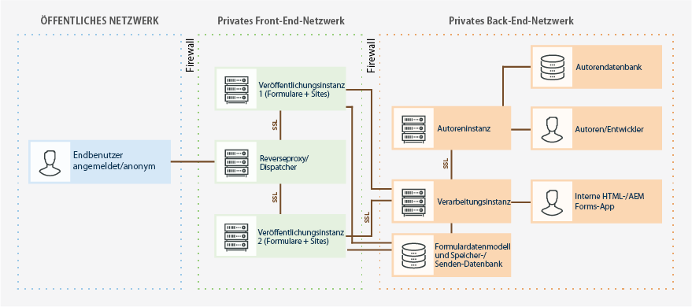

# Härten (Absichern) und Schutz von AEM Forms in OSGi-Umgebungen {#hardening-and-securing-aem-forms-on-osgi-environment}

Hier finden Sie Empfehlungen und Best Practices zum Schutz von AEM Forms auf einem OSGi-Server.

Der Schutz der Serverumgebung ist von größter Wichtigkeit für ein Unternehmen. In diesem Artikel werden Empfehlungen und Best Practices für den Schutz der Server beschrieben, auf denen AEM Forms ausgeführt wird. Dieses Dokument stellt keine umfassende Anleitung zum Härten (Absichern) des Betriebssystems dar. Stattdessen wird in diesem Artikel eine Reihe von Einstellungen zum Stärken der Sicherheit beschrieben, die Sie implementieren sollten, um die Sicherheit der bereitgestellten Anwendung zu verbessern. Um den Schutz der Anwendungsserver sicherzustellen, sollten Sie jedoch außer den in diesem Artikel empfohlenen Maßnahmen auch Überwachungs-, Erkennungs- und Reaktionsabläufe für die Sicherheit implementieren. Das Dokument enthält ferner Best Practices und Richtlinien zum Schützen von PII (personenbezogenen Informationen).

Die Zielgruppe dieses Artikels sind IT-Berater, Sicherheitsexperten, Systemarchitekten und IT-Spezialisten, die für die Planung der Anwendungs- oder Infrastrukturentwicklung sowie die Bereitstellung von AEM Forms verantwortlich sind. Zu diesen Rollen zählen die folgenden gängigen Rollen:

* IT- und Produktionsingenieure, die sichere Webanwendungen und -server in ihren eigenen oder Kundenorganisationen bereitstellen müssen.
* Architekten und Systemplaner mit der Aufgabe, die Architekturentwicklung für die Kunden in ihren Unternehmen zu planen.
* IT-Sicherheitsspezialisten, die schwerpunktmäßig für die plattformübergreifende Sicherheit innerhalb ihrer Unternehmen zuständig sind.
* Berater von Adobe und Partner, die detaillierte Ressourcen für Kunden und Partner benötigen.

Die folgende Abbildung zeigt Komponenten und Protokolle, die in einer typischen AEM Forms-Bereitstellung verwendet werden, einschließlich der entsprechenden Firewall-Topologie:

AEM Forms kann in hohem Maß angepasst und in vielen verschiedenen Umgebungen eingesetzt werden. Einige der Empfehlungen sind möglicherweise für Ihr Unternehmen nicht relevant.

## Sichere Transportschicht {#secure-transport-layer}

Sicherheitslücken in der Transportschicht gehören zu den Hauptbedrohungen für Internet- oder Intranet-orientierte Anwendungsserver. In diesem Abschnitt wird der Prozess zum Absichern von Hostrechnern im Netzwerk gegen diese Schwachstellen beschrieben. Zu den behandelten Themen gehören die Netzwerksegmentierung, das Absichern des TCP/IP-Stacks (Transmission Control Protocol/Internet Protocol) und die Verwendung von Firewalls für den Hostschutz.

### Offene Endpunkte begrenzen  {#limit-open-endpoints}

In einem Unternehmen kann eine externe Firewall vorhanden sein, um den Zugriff zwischen den Endbenutzern und der AEM Forms-Veröffentlichungsfarm zu begrenzen. Das Unternehmen kann außerdem eine interne Firewall verwenden, um den Zugriff zwischen einer Veröffentlichungsfarm und anderen unternehmensinternen Elementen (z. B. Authoring-Instanz, Verarbeitungsinstanz usw.) zu begrenzen. Lassen Sie mithilfe von Firewalls den Zugriff auf eine begrenzte Anzahl von AEM Forms-URLs für Endbenutzer und zwischen den Elementen innerhalb des Unternehmens zu:

#### Externe Firewall konfigurieren  {#configure-external-firewall}

Sie können eine externe Firewall konfigurieren, um für bestimmte AEM Forms-URLs den Zugriff auf das Internet zu erlauben. Der Zugriff auf diese URLs ist erforderlich zum Ausfüllen eines adaptiven Formulars, für HTML5, einen Correspondence Management-Brief oder die Anmeldung bei einem AEM Forms-Server:

<table> 
 <tbody>
  <tr>
   <td>Komponente</td> 
   <td>URI</td> 
  </tr>
  <tr>
   <td>Adaptive Formulare</td> 
   <td>
    <ul> 
     <li>/content/dam/formsanddocuments/AF_PATH/jcr:content</li> 
     <li>/etc/clientlibs/fd/</li> 
     <li>/content/forms/af/AF_PATH</li> 
     <li>/libs/granite/csrf/</li> 
    </ul> </td> 
  </tr>
  <tr>
   <td>HTML5-Formulare</td> 
   <td>
    <ul> 
     <li>/content/forms/formsets/profiles/</li> 
    </ul> </td> 
  </tr>
  <tr>
   <td>Correspondence Management </td> 
   <td>
    <ul> 
     <li>/aem/forms/createcorrespondence* </li> 
    </ul> </td> 
  </tr>
  <tr>
   <td>Formularportal </td> 
   <td>
    <ul> 
     <li>/content/forms/portal/</li> 
     <li>/libs/cq/ui/widgets*</li> 
     <li>/libs/cq/security/</li> 
    </ul> </td> 
  </tr>
  <tr>
   <td> AEM Forms-App</td> 
   <td>
    <ul> 
     <li>/j_security_check*</li> 
     <li>/soap/services/AuthenticationManagerService</li> 
    </ul> </td> 
  </tr>
 </tbody>
</table>

#### Interne Firewall konfigurieren   {#configure-internal-firewall}

Sie können die interne Firewall konfigurieren, um bestimmten Komponenten von AEM Forms (z. B. Authoring-Instanz, Verarbeitungsinstanz, Datenbanken) die Kommunikation mit der Veröffentlichungsfarm und anderen im Topologiediagramm genannten internen Komponenten zu ermöglichen:

<table> 
 <tbody>
  <tr>
   <td>Host  </td> 
   <td>URI</td> 
  </tr>
  <tr>
   <td>Veröffentlichungsfarm (Veröffentlichungsknoten)</td> 
   <td>/bin/receive</td> 
  </tr>
  <tr>
   <td>Verarbeitungsserver</td> 
   <td>/content/forms/fp/*</td> 
  </tr>
  <tr>
   <td>Forms Workflow-Add-On-Server (AEM Forms auf JEE-Server)</td> 
   <td>/soap/sdk</td> 
  </tr>
 </tbody>
</table>

#### Repository-Berechtigungen und Zugriffskontrolllisten (ACLs) einrichten {#setup-repository-permissions-and-access-control-lists-acls}

Standardmäßig sind Assets auf den Veröffentlichungsknote für alle Benutzer zugänglich. Für alle Assets ist der Lesezugriff aktiviert. Dies ist erforderlich, um anonymen Zugriff zuzulassen. Wenn Sie die Formularansicht einschränken und nur authentifizierten Benutzern Zugriff gewähren möchten, verwenden Sie eine gemeinsame Gruppe, um nur authentifizierten Benutzern schreibgeschützten Zugriff auf die auf den Veröffentlichungsknoten verfügbaren Assets zu gewähren. Die folgenden Speicherorte/Verzeichnisse enthalten Formularkomponenten, die durch Beschränken des Lesezugriffs auf authentifizierte Benutzer abgesichert („gehärtet“) werden müssen:

* /content/&amp;ast;
* /etc.clientlibs/fd/&amp;ast;
* /libs/fd/&amp;ast;

## Formulardaten sicher verarbeiten  {#securely-handle-forms-data}

AEM Forms speichert Daten unter vordefinierten Speicherorten und temporären Ordnern. Schützen Sie diese Daten, um eine unbefugte Nutzung zu verhindern.

### Periodische Bereinigung des temporären Ordners einrichten {#setup-periodic-cleanup-of-temporary-folder}

Wenn Sie Formulare für Dateianhänge konfigurieren, überprüfen oder Komponenten in der Vorschau anzeigen, werden die entsprechenden Daten auf den Veröffentlichungsknoten unter /tmp/fd/ gespeichert. Die Daten werden regelmäßig bereinigt. Sie können den standardmäßigen Datenbereinigungsauftrag ändern und aggressiver einstellen. Um den geplanten Auftrag zur Bereinigung der Daten zu ändern, öffnen Sie die AEM Web-Konsole und dann die Aufgabe zum Bereinigen des temporären Speichers von AEM Forms und ändern Sie den Cron-Ausdruck.

In den oben genannten Szenarien werden die Daten nur für authentifizierte Benutzer gespeichert. Darüber hinaus sind die Daten durch Zugriffskontrolllisten (ACLs) geschützt. Die Änderung der Datenbereinigung ist damit ein weiterer Schritt zum Schutz der Informationen.

### Durch Übermittlungsaktion für Forms Portal gespeicherte Daten sichern  {#secure-data-saved-by-forms-portal-submit-action}

Standardmäßig speichert die Übermittlungsaktion für Forms Portal in adaptiven Formularen Daten im lokalen Repository des Veröffentlichungsknotens. Die Daten werden unter /content/forms/fp gespeichert. **Wir raten davon ab, Daten auf der Veröffentlichungsinstanz zu speichern.**

Sie können den Speicherdienst so konfigurieren, dass er über das Netzwerk an den Verarbeitungscluster sendet, ohne dass Daten lokal auf dem Veröffentlichungsknoten gespeichert werden. Der Verarbeitungscluster befindet sich in einer sicheren Zone hinter der privaten Firewall und die Daten bleiben sicher.

Verwenden Sie die Anmeldedaten des Verarbeitungsservers für den AEM DS-Einstellungsdienst, um Daten vom Veröffentlichungsknoten an den Verarbeitungsserver zu senden. Es wird empfohlen, die Anmeldedaten eines Benutzers mit eingeschränkten Rechten, der kein Administrator ist und über Lese- und Schreibzugriff auf das Repository des Verarbeitungsservers verfügt, zu verwenden. Weitere Informationen finden Sie unter [Konfigurieren von Speicherdiensten für Entwürfe und Übermittlungen](/help/forms/using/configuring-draft-submission-storage.md).

### Durch das Formulardatenmodell (FDM) verarbeitete Daten sichern  {#secure-data-handled-by-form-data-model-fdm}

Verwenden Sie Benutzerkonten mit dem minimal erforderlichen Berechtigungen zum Konfigurieren der Datenquellen für das Formulardatenmodell (FDM). Wenn Sie ein Konto mit administrativen Rechten verwenden, erhalten nicht autorisierte Benutzer möglicherweise offenen Zugriff auf Metadaten und Schema-Entitäten.\
Die Datenintegration stellt außerdem Methoden zum Autorisieren von FDM-Dienstanfragen bereit. Sie können Autorisierungsmechanismen vor und nach der Ausführung einfügen, um Anfragen zu validieren. Die Dienstanforderungen werden beim Vorausfüllen und beim Senden eines Formulars sowie beim Aufrufen von Diensten mithilfe einer Regel generiert.

**Autorisierung vor Verarbeitung:** Mithilfe der Autorisierung vor Verarbeitung können Sie die Authentizität einer Anfrage validieren, bevor diese ausgeführt wird. Dabei können Sie die Ausführung mithilfe von Eingaben sowie Dienst- und Anfragedetails zulassen oder blockieren. Für den Fall, dass der Vorgang blockieret wird, können Sie die Datenintegrationsausnahme OPERATION_ACCESS_DENIED ausgeben lassen. Sie können darüber hinaus die Client-Anfrage ändern, bevor sie zur Ausführung übermittelt wird. So könnten Sie beispielsweise die Eingabe ändern und zusätzliche Informationen hinzufügen.

**Autorisierung nach Verarbeitung:** Mithilfe der Autorisierung nach Verarbeitung können Sie die Ergebnisse validieren und kontrollieren, bevor sie an den Anforderer zurückgegeben werden. Sie können darüber hinaus Daten filtern, bereinigen und zusätzlich Daten hinzufügen.

### Benutzerzugriff begrenzen  {#limit-user-access}

Für die Authoring-, Veröffentlichungs- und Verarbeitungsinstanz sind jeweils unterschiedliche User Personas erforderlich. Führen Sie keine Instanzen mit Administrator-Anmeldedaten aus.

**Auf der Veröffentlichungsinstanz:**

* Nur Benutzer in der Gruppe „forms-users“ können Formulare in der Vorschau anzeigen, Entwürfe erstellen und Formulare senden.
* Nur Benutzer in der Gruppe „cm-user-agent“ können Correspondence Management-Briefe in der Vorschau anzeigen.
* Den gesamten, nicht erforderlichen anonymen Zugriff deaktivieren.

**Auf der Authoring-Instanz:**

* Für jede Persona steht jeweils eine Reihe vordefinierter Gruppen mit spezifischen Rechten zur Verfügung. Benutzer zu Gruppe zuordnen.

   * Benutzer der Gruppe „forms-users“:

      * können Formulare erstellen, ausfüllen, veröffentlichen und senden
      * können keine XDP-basierten adaptiven Formulare erstellen
      * haben keine Berechtigung zum Schreiben von Skripten für adaptive Formulare
      * können weder XDP noch Pakete importieren, die XDP enthalten
   * Benutzer der Gruppe „forms-power-user“ können alle Typen von Formularen erstellen, ausfüllen, veröffentlichen und senden, Skripte für adaptive Formulare schreiben und Pakete importieren, die XSP enthalten.
   * Benutzer der Gruppen „template-authors“ und „template-power-user“ können Vorlagen in der Vorschau anzeigen und erstellen.
   * Benutzer der Gruppe „fdm-authors“ können Formulardatenmodelle erstellen und ändern.
   * Benutzer der Gruppe „cm-user-agent“ können Correspondence Management-Briefe erstellen, in der Vorschau anzeigen und veröffentlichen.
   * Benutzer der Gruppe „workflow-editors“ können Posteingang-Anwendungen und Workflow-Modelle erstellen.

**Verarbeitungs-Authoring:**

* Für Remote-Speichern und -Senden erstellen Sie einen Benutzer mit Lese-, Erstellungs- und Änderungsrechten für den Pfad „content/form/fp“ des crx-Repositorys.
* Fügen Sie den Benutzer der Gruppe „workflow-user“ hinzu, um ihm die Verwendung der AEM-Posteingang-Anwendungen zu ermöglichen.

## Intranetelemente einer AEM Forms-Umgebung sichern  {#secure-intranet-elements-of-an-aem-forms-environment}

Verarbeitungscluster und das Forms Workflow-Add-On (AEM Forms on JEE) werden im Allgemeinen hinter einer Firewall ausgeführt. Sie können daher als sicher betrachtet werden. Dennoch können Sie diese Umgebungen mit einigen weiteren Maßnahmen absichern:

### Verarbeitungscluster sichern {#secure-processing-cluster}

Ein Verarbeitungscluster wird im Authoring-Modus ausgeführt, verwenden Sie ihn jedoch nicht für Entwicklungszwecke. Lassen Sie nicht zu, dass normale Benutzer in die Gruppen „content-authors“ und „form-users“ aufgenommen werden.

### AEM Forms-Umgebung mithilfe von Best Practices sichern {#use-aem-best-practices-to-secure-an-aem-forms-environment}

In diesem Dokument finden Sie spezielle Anweisungen für die AEM Forms-Umgebung. Sorgen Sie dafür, dass Ihre zugrunde liegende AEM-Installation bei der Bereitstellung sicher ist. Detaillierte Anweisungen finden Sie in der Dokumentation zur [AEM-Sicherheits-Checkliste](/help/sites-administering/security-checklist.md).
