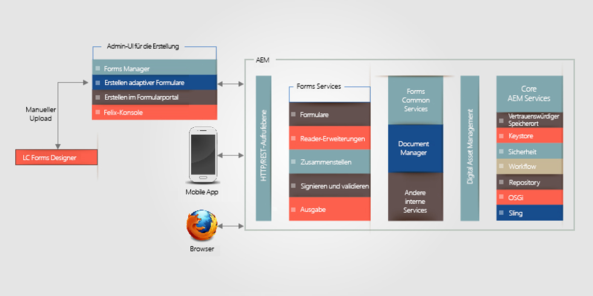
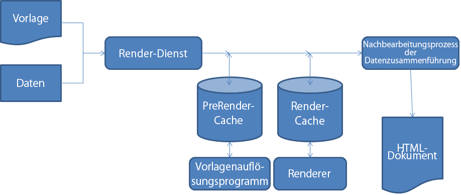

# Architektur von HTML5-Formulare{#architecture-of-html-forms}

## Architektur {#architecture}

Die HTML5-Formularfunktionen werden als Paket innerhalb der eingebetteten AEM-Instanz bereitgestellt. Die Bereitstellung erfolgt mithilfe einer REST-konformen [Apache Sling Architecture](https://sling.apache.org/) als REST-Endpunkt über HTTP/S.

### Über das Sling Framework {#using-sling-framework}

[Apache Sling](https://sling.apache.org/) ist ressourcenzentriert. Es verwendet zunächst eine Anforderungs-URL, um die Ressource aufzulösen. Jede Ressource hat eine **sling:resourceType** (oder **sling:resourceSuperType**)-Eigenschaft. Anhand dieser Eigenschaft, der Anforderungsmethode und der Eigenschaften der Anforderungs-URL wird ein Sling-Skript ausgewählt, um die Anforderung zu bearbeiten. Dieses Sling-Skript kann ein JSP oder ein Servlet sein. Im Falle von HTML5-Formulare dienen **Profil**-Knoten als Sling-Ressourcen, und der **Profil-Renderer** dient als Sling-Skript, das die Anforderung bearbeitet, das mobile Formular mit einem bestimmten Profil zu rendern. Ein **Profil-Renderer** ist ein JSP, das Parameter aus einer Anforderung ausliest und den Forms OSGi-Dienst aufruft.

Weitere Informationen über REST-Endpunkte und unterstützte Anforderungsparameter finden Sie unter [Rendern einer Formularvorlage](/help/forms/using/rendering-form-template.md).

Wenn ein Benutzer eine Anforderung von einer Clientanwendung wie einem iOS- oder Android-Browser startet, löst Sling zuerst den Profilknoten auf Basis der Anforderungs-URL auf. Aus diesem Profilknoten liest es **sling:resourceSuperType** und **sling:resourceType** aus, um alle verfügbaren Skripten zu ermitteln, die diese Anforderung, ein Formular zu rendern, bearbeiten können. Abschließend verwendet es Sling-Anforderungsselektoren zusammen mit der Anforderungsmethode, um das Skript zu identifizieren, das am besten für die Bearbeitung dieser Anforderung geeignet ist. Wenn die Anforderung ein Profil-Renderer-JSP erreicht, ruft das JSP den Forms OSGi-Dienst auf.

Weitere Informationen zur Auflösung von Sling-Skripten finden Sie unter [AEM Sling-Spickzettel](https://docs.adobe.com/content/docs/de/cq/current/developing/sling_cheatsheet.html) oder [Apache Sling-URL-Auflösung](https://sling.apache.org/site/url-decomposition.html).

#### Typisches Formular zur Verarbeitung von Call-Flows {#typical-form-processing-call-flow}

HTML5-Formulare speichert alle Zwischenobjekte zwischen, die für die Verarbeitung (Rendering oder Senden) eines Formulars bei der ersten Anforderung nötig sind. Objekte, die von Daten abhängig sind, werden nicht zwischengespeichert, da diese wahrscheinlich geändert werden.

Mobile Forms bietet zwei unterschiedliche Zwischenspeicher-Ebenen: den PreRender-Cache und den Render-Cache. Der PreRender-Cache enthält alle Fragmente und Bilder einer gelösten Vorlage und Render-Cache enthält gerenderten Inhalt wie HTML.

Arbeitsablauf für HTML5-Formulare

HTML5-Formulare speichert Vorlagen nicht zwischen, die fehlende Verweise auf Fragmente und Bilder aufweisen. Wenn HTML5-Formulare länger als gewöhnlich lädt, prüfen Sie die Server-Protokolle auf fehlende Verweise und Warnungen. Stellen Sie auch sicher, dass die maximale Größe des Objekts nicht erreicht wurde.

Der Forms OSGi-Dienst verarbeitet eine Anforderung in zwei Schritten:

* **Generierung eines Layouts und des anfänglichen Formularstatus**: Der Forms OSGi-Renderdienst ruft die Formular-Cachekomponente auf, um zu bestimmen, ob das Formular bereits zwischengespeichert wurde und ob es noch gültig ist. Wenn das Formular zwischengespeichert und gültig ist, liefert es das generierte HTML aus dem Cache. Wenn das Formular ungültig ist, generiert der Forms OSGi-Render-Dienst das anfängliche Formularlayout und den Formularstatus im XML-Format. Diese XML-Datei wird vom Forms OSGi-Dienst in HTML-Layout und in den anfänglichen JSON-Formularstatus umgewandelt sowie für folgende Anforderungen zwischengespeichert.
* **Vorausgefüllte Formulare**: Wenn ein Benutzer außerdem während des Renderings anfordert, dass Formulare vorab mit Daten ausgefüllt werden sollen, ruft der Forms OSGi-Renderdienst den Forms-Dienstcontainer auf und generiert einen neuen Formularstatus mit zusammengeführten Daten. Da das Layout jedoch schon im ersten Schritt generiert wird, ist dieser Aufruf schneller als der erste. Dieser Aufruf führt nur die Zusammenführung von Daten durch und führt die Skripten auf den Daten aus.

Wenn in einem Formular ein Update vorhanden ist oder Elemente verwendet werden, wird dies von der Formular-Cachekomponente erkannt, und der Cache für dieses bestimmte Formular ist ungültig. Wenn die Verarbeitung durch den Forms OSGi-Dienst abgeschlossen ist, fügt das Profil-Renderer-JSP JavaScript-Bibliotheksverweise in das Formular ein und gibt die Antwort an den Client zurück. Hierfür kann ein typischer Webserver wie [Apache](https://httpd.apache.org/) mit aktivierter HTML-Komprimierung verwendet werden. Ein Webserver würde die Antwortgröße, den Netzwerkverkehr und die für das Streaming zwischen dem Server und dem Client-Rechner erforderliche Zeit erheblich verringern.

Wenn ein Benutzer das Formular ausfüllt, sendet der Browser den Formularstatus im JSON-Format an den [Sendedienst-Proxy](../../forms/using/service-proxy.md). Dann generiert der Sendedienst-Proxy eine Daten-XML mit JSON-Daten und sendet die Daten-XML an den Sende-Endpunkt.

## Komponenten {#components}

Sie benötigen das AEM Forms-Add-On-Paket, um HTML5-Formulare zu aktivieren. Weitere Informationen zum Installieren des Add-On-Pakets finden Sie unter [Installieren und Konfigurieren von AEM Forms](../../forms/using/installing-configuring-aem-forms-osgi.md).

### OSGi-Komponenten (adobe-lc-forms-core.jar) {#osgi-components-adobe-lc-forms-core-jar}

In der Bundle-Ansicht der Felix Admin-Konsole (https://[host]:[port]/system/console/bundles) wird als Name des OSGi-Bundles der HTML5-Formulare **Adobe XFA Forms Renderer (com.adobe.livecycle.adobe-lc-forms-core)** angezeigt.

Diese Komponente enthält OSGi-Komponenten für Rendering, Cachemanagement und Konfigurationseinstellungen.

#### Forms OSGi-Dienst {#forms-osgi-service}

Dieser OSGi-Dienst enthält die Logik zum Rendern einer XDP als HTML und verarbeitet Sendungen von Formularen zur Generierung einer Daten-XML. Dieser Dienst verwendet Forms-Dienstcontainer. Der Forms-Dienstcontainer ruft intern die native Komponente`XMLFormService.exe` auf, die anschließend die Verarbeitung durchführt.

Wenn eine Render-Anforderung eingeht, ruft diese Komponente den Forms-Servicecontainer auf, um das Layout und die Statusinformationen zu generieren, die dann weiter verarbeitet werden, um den HTML- und JSON-DOM-Status eines Formulars zu generieren.

Diese Komponente ist auch für die Generierung der Daten-XML aus dem Status-JSON des gesendeten Formulars zuständig.

#### Cachekomponente {#cache-component}

HTML5-Formulare verwendet eine Zwischenspeicherung, um den Durchsatz zu maximieren und die Antwortzeit zu optimieren. Sie können die Ebene des Cachedienstes konfigurieren, um einen Kompromiss zwischen Leistung und Platznutzung festzulegen.

<table>
 <tbody>
  <tr>
   <th>Cachestrategie</th>
   <th>Beschreibung</th>
  </tr>
  <tr>
   <td>Ohne</td>
   <td>Keine Artefakte zwischenspeichern  </td>
  </tr>
  <tr>
   <td>Konservativ</td>
   <td>Es werden nur Zwischenartefakte zwischengespeichert, die vor dem Rendering des Formulars generiert werden, z. B. die Vorlage, die die Inline-Fragmente und Bilder enthält.</td>
  </tr>
  <tr>
   <td>Stark</td>
   <td>Den gerenderten HTML-Inhalt zwischenspeichern Es werden alle Artefakte gespeichert, die in der Ebene „Konservativ“ zwischengespeichert wurden.  <strong>Hinweis</strong>: Diese Strategie ergibt die beste Leistung, verbraucht jedoch mehr Platz für die Speicherung der zwischengespeicherten Artefakte.</td>
  </tr>
 </tbody>
</table>

HTML5-Formulare führt eine Zwischenspeicherung im Arbeitsspeicher durch und verwendet dafür die LRU-Strategie. Wenn die Cachestrategie auf „Keine“ gestellt ist, wird kein Cachespeicher erstellt, und alle Cachedaten (falls vorhanden) werden gelöscht. Außer der Cachestrategie können Sie auch die Größe des gesamten Arbeitsspeichercaches konfigurieren. Dies kann hilfreich sein, um die maximale Cachegröße festzulegen und, falls diese überschritten wird, mithilfe des LRU-Modus Cacheressourcen freizugeben.

>[!NOTE]
>
>Der Arbeitsspeichercache wird nicht zwischen Clusterknoten freigegeben.

#### Konfigurationsdienst {#configuration-service}

Der Konfigurationsdienst ermöglicht die Einstellung der Konfigurationsparameter und der Cacheeinstellungen für HTML5-Formulare.

Wenn Sie diese Einstellungen aktualisieren möchten, wählen Sie in der CQ Felix Admin Console (verfügbar unter https://&lt;&#39;[server]:[port]&#39;/system/console/configMgr) den Punkt Mobile Forms Configuration.

Mit dem Konfigurationsdienst können Sie die Cachegröße konfigurieren oder den Cache deaktivieren. Sie können auch mithilfe des Parameters „Debug Options“ das Debugging aktivieren. Weitere Informationen über das Debugging von Formularen finden Sie unter [Debugging von HTML5-Formularen](/help/forms/using/debug.md).

### Laufzeitkomponenten (adobe-lc-forms-runtime-pkg.zip) {#runtime-components-adobe-lc-forms-runtime-pkg-zip}

Das Laufzeitpaket enthält die clientseitigen Bibliotheken, die verwendet werden, um HTML-Formulare zu rendern.

**Im Laufzeitpaket verfügbare wichtige Komponenten:**

#### Scripting Engine {#scripting-engine}

Die Implementierung von Adobe XFA unterstützt zwei Arten von Skriptsprachen, um die Ausführung einer benutzerdefinierten Logik in Formularen zu aktivieren: JavaScript und FormCalc.

Die Scripting Engine für HTML-Formulare ist in JavaScript geschrieben, um die XFA-Skript-API in diesen beiden Sprachen zu unterstützen.

Während des Renderns wird das FormCalc-Skript für den Benutzer oder Designer sichtbar in JavaScript übersetzt (und zwischengespeichert).

Die Scripting Engine verwendet einige der Funktionen von ECMAScript5, z. B. Object.defineProperty. Die Engine/Bibliothek wird als CQ-Client-Bibliothek mit dem Kategorienamen **xfaforms.profile** bereitgestellt. Sie enthält auch die **FormBridge API** zur Interaktion externer Portale oder Apps mit dem Formular. Mit FormBridge kann eine externe App bestimmte Elemente programmgesteuert ausblenden, ihre Werte abrufen oder einstellen oder ihre Attribute ändern.

Weitere Informationen finden Sie im Artikel [Form Bridge](/help/forms/using/form-bridge-apis.md).

#### Layout-Engine {#layout-engine}

Das Layout und das visuelle Erscheinungsbild von HTML5-Formulare basiert auf Funktionen von SVG 1.1, jQuery, BackBone und CSS3. Das anfängliche Erscheinungsbild eines Formulars wird auf dem Server erstellt und zwischengespeichert. Die Optimierung dieses ersten Layouts und alle anderen schrittweisen Änderungen am Formularlayout werden auf dem Client verwaltet. Um dies zu erreichen, enthält das Laufzeitpaket eine Layout-Engine, die in JavaScript geschrieben ist und auf jQuery/Backbone basiert. Diese Engine verwaltet das gesamte dynamisches Verhalten, wie das Hinzufügen/Entfernen wiederholbarer Instanzen und das Layout von Objekten, die vergrößert werden können. Diese Layout-Engine rendert nicht mehr als eine Formularseite gleichzeitig. Der Benutzer sieht zu Anfang nur eine Seite, und auch die horizontale Bildlaufleiste gilt nur für die erste Seite. Wenn der Benutzer allerdings abwärts scrollt, beginnt das Rendering der nächsten Seite. Dieses Seite für Seite erfolgende Rendering verringert den Zeitraum, der benötigt wird, um die erste Seite in einem Browser zu rendern, und erhöht die wahrgenommene Leistung des Formulars. Diese Engine/Bibliothek ist Teil der CQ-Client-Bibliothek mit dem Kategorienamen **xfaforms.profile.**

Die Layout-Engine enthält auch eine Reihe von Widgets, die verwendet werden, um den Wert von Formularfeldern eines Benutzers zu erfassen. Diese Widgets werden als [jQuery UI Widgets](https://api.jqueryui.com/jQuery.widget/) modelliert, die bestimmte zusätzliche Kontrakte für einen nahtlose Zusammenarbeit mit der Layout-Engine bereitstellen.

Weitere Informationen über Widgets und die entsprechenden Kontrakte finden Sie unter [Benutzerdefinierte Widgets für HTML5-Formulare](/help/forms/using/introduction-widgets.md).

#### Stile {#styling}

Die den HTML-Elementen zugeordneten Formatierungselemente werden entweder intern oder im eingebetteten CSS-Block hinzugefügt. Einige allgemeine Formatierungselemente, die nicht vom Formular abhängig sind, sind Teil der CQ-Client-Bibliothek mit dem Kategorienamen xfaforms.profile.

Zusätzlich zu den Standardformatierungseigenschaften enthält jedes Formularelement auch bestimmte CSS-Klassen, die auf dem Elementtyp, dem Namen und anderen Eigenschaften basieren. Mithilfe dieser Klassen können Sie Elemente durch Festlegen von deren eigener CSS umformatieren.

Weitere Informationen über Standardformatierung und Klassen finden Sie unter [Einführung zu Stilen](/help/forms/using/css-styles.md).

#### Serverseitiges Skript und Webdienste {#server-side-script-and-web-services}

Skripten, die für eine Ausführung auf dem Server oder für den Aufruf eines Webdienstes markiert sind (unabhängig davon, wo dieser Webdienst ausgeführt werden soll), werden immer auf dem Server ausgeführt.

Die Client-Scripting Engine:

1. Führt einen synchronen Aufruf an den Server durch und leitet den Status des aktuellen Formulars in Form von JSON an diesen weiter
1. Führt das Skript oder den Webdienst auf dem Server aus
1. Erstellt einen neuen JSON-Status
1. Führt den neuen JSON-Status auf dem Client zusammen, wenn die Antwort zurückgegeben wird.

#### Lokalisierungsressourcen-Bundles {#localization-resource-bundles}

HTML5-Formulare unterstützt die Sprachen Italienisch (it), Spanisch (es), Portugiesisch (Brasilien) (pt_BR), Chinesisch (vereinfacht) (zh_CN), Chinesisch (traditionell) (begrenzte Unterstützung) (zh_TW), Koreanisch (ko_KR), Englisch (en_US), Französisch (fr_FR), Deutsch (de_DE) und Japanisch (ja). Nach dem im Anforderungsheader empfangenen Gebietsschema richtet sich, welches Ressourcenbündel an den Client geleitet wird. Dieses Ressourcenbündel wird zur Profil-JSP als CQ-Client-Bibliothek mit dem Kategorienamen **xfaforms.I18N** hinzugefügt. Sie können die Logik überschreiben, dass das Gebietsschema-Paket im Profil aufgenommen wird.

### Sling-Komponenten (adobe-lc-forms-content-pkg.zip) {#sling-components-adobe-lc-forms-content-pkg-zip}

Das Sling-Paket enthält Inhalte zu den Profilen und zum Profil-Renderer.

#### Profile {#profiles}

Profile sind die Ressourcenknoten im Sling, die ein Formular oder eine Familie von Formularen repräsentieren. Auf der CQ-Ebene sind diese Profile JCR-Knoten Die Knoten befinden sich im Ordner **/content** im JCR-Repository und können sich auch in allen Unterordnern des Ordners **/content** befinden.

#### Profil-Renderer {#profile-renderers}

Der Profilknoten hat ein Eigenschafts-**Sling: resourceSuperType** mit dem Wert **xfaforms/profile**. Diese Eigenschaft sendet intern Anforderungen an das Sling-Skript für Profilknoten im Ordner **/libs/xfaforms/profile**. Diese Skripten sind JSP-Seiten, die als Container für die Zusammenfügung der HTML-Formulare und der erforderlichen JS/CSS-Artefakte dienen. Die Seiten enthalten Verweise auf:

* **xfaforms.I18N.&lt;locale>**: Diese Bibliothek enthält lokalisierte Daten.
* **xfaforms.profile**: Diese Bibliothek enthält die Implementierung für XFA Scripting und für die Layout-Engine.

Diese Bibliotheken sind als CQ-Client-Bibliotheken modelliert, um Nutzen aus den automatischen Verkettungs-, Minimierungs- und Komprimierungsfunktionen der CQ Framework JavaScript-Bibliotheken zu ziehen.
Weitere Informationen zu CQ-Client-Bibliotheken finden Sie unter [Dokumentation zu CQ Client-Bibliotheken](https://docs.adobe.com/docs/de/cq/current/developing/components/clientlibs.html).

Wie oben beschrieben ruft der Profil-Renderer JSP den Formulardienst über einen Sling auf. Dieses JSP legt auch verschiedene Debugging-Optionen auf Basis der Admin-Konfiguration oder von Anforderungsparametern ein.

HTML5-Formulare ermöglicht Entwicklern, Profile und Profil-Renderer zu erstellen, um das Erscheinungsbild der Formulare anzupassen. Beispielsweise können Entwickler HTML-Formulare in ein Bedienfeld oder einen &lt;div>-Abschnitt eines vorhandenen HTML-Portals integrieren.
Weitere Informationen über das Erstellen benutzerdefinierter Profile finden Sie unter [Erstellen eines benutzerfreundlichen Profils](/help/forms/using/custom-profile.md).
