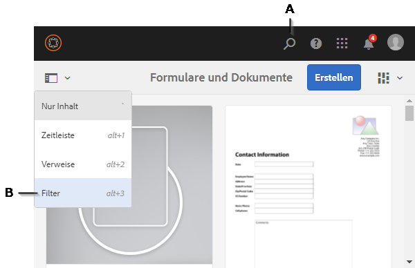

# Importieren und Exportieren von Assets in AEM Forms{#importing-and-exporting-assets-to-aem-forms}

Sie können Formulare und zugehörige Assets, Designs, Datenwörterbücher, Dokumentfragmente und Briefe zwischen verschiedenen AEM Forms-Instanzen verschieben. Ein solches Verschieben ist bei der Migration von Systemen oder beim Verschieben von Formularen von einem Staging Server auf einen Produktionsserver erforderlich. Für diejenigen Assets, für die das Hochladen und Importieren über die AEM Forms-Benutzeroberfläche unterstützt wird, ist die Verwendung der Forms-Benutzeroberfläche der empfohlene Weg für den Export oder Import. Die Verwendung des AEM Package Manager zum Exportieren oder Importieren solcher Assets wird nicht empfohlen.

>[!NOTE]
>
>* In AEM 6.4 Forms hat sich die Struktur und die Pfade des CRX-Repository geändert. Wenn Sie Assets aus einer früheren Version in AEM 6.4 Forms importieren und das Formular einige Abhängigkeiten von der älteren Struktur aufweist, müssen Sie die Abhängigkeiten manuell exportieren. Weitere Informationen zu Änderungen an der Struktur und den Pfaden des Repositorys finden Sie unter [Repository-Neustrukturierung in AEM](/help/sites-deploying/repository-restructuring.md).

>

## Assets für Formulare und Dokumente herunterladen undhochladen {#download-or-upload-forms-amp-documents-assets}

Mithilfe der AEM Forms-Benutzeroberfläche können Sie Assets aus einer AEM-Instanz exportieren, indem Sie sie als CRX-Paket oder Binärdateien herunterladen. Sie können dann das heruntergeladene AEM CRX-Paket oder die Binärdatei in eine andere AEM-Instanz importieren.

Der Export und Import über die AEM Forms-Benutzeroberfläche wird für alle Assets unterstützt, mit Ausnahme von Vorlagen für adaptive Formulare und Inhaltsrichtlinien für adaptive Formulare. Darum werden beim Exportieren eines adaptiven Formulars von der AEM Forms-Benutzeroberfläche die verknüpfte adaptive Formularvorlage und Inhaltsrichtlinien nicht wie andere verknüpfte Assets automatisch exportiert.

Sie müssen AEM Package Manager verwenden, um ein CRX-Paket dieser Elemente auf dem AEM-Quellserver zu erstellen und das Paket auf dem Zielserver zu installieren. Weitere Informationen zum Erstellen und Installieren von Paketen finden Sie unter [Arbeiten mit Paketen](/help/sites-administering/package-manager.md).

### Assets für Formulare und Dokumente herunterladen {#download-forms-amp-documents-assets}

Herunterladen von Forms- und Dokumenten-Assets:

1. Melden Sie sich bei der AEM Forms-Instanz an.
1. Tippen Sie auf das Symbol Experience Manager  > navigation  Symbol> Forms > Forms und Dokumente.
1. Wählen Sie die AEM Forms-Assets und klicken Sie auf das Symbol **Herunterladen**.
1. Wählen Sie unter Asset(s) herunterladen eine der folgenden Optionen aus und tippen Sie auf **Download**.

   * **Als CRX-Paket herunterladen:** Verwenden Sie die Option zum Herunterladen und Verschieben des/aller ausgewählten Elements/Elemente und der zugehörigen Abhängigkeiten von einer AEM Forms-Instanz in eine andere. Dadurch werden alle Assets und Ordner als CRX-Paket heruntergeladen. Jegliche Formular-Assets, einschließlich in AEM erstellter Formulare (adaptive Formulare, interaktive Kommunikation und adaptive Formularfragmente), Formularsätze, Formularvorlagen, PDF-Dokumente und Ressourcen (XSDs, XFS, Bilder) können über die AEM Forms-Benutzeroberfläche als Paket heruntergeladen werden.
Der Vorteil des Herunterladens von Assets als Paket besteht darin, dass dabei auch Assets, die vom zum Herunterladen ausgewählten Assets verwendet wurden, heruntergeladen werden. Beispiel: Sie haben ein adaptives Formular, das eine Formularvorlage, XSD und ein Bild verwendet. Wenn Sie dieses adaptive Formular auswählen und es als Paket herunterladen, enthält das heruntergeladene Paket auch die Formularvorlage, XSD und das Bild. Alle mit dem Asset verknüpften Metadateneigenschaften (einschließlich benutzerdefinierter Eigenschaften) werden ebenfalls heruntergeladen.

   * **Asset(s) als Binärdateien herunterladen:** Verwenden Sie die Option nur zum Herunterladen von Formularvorlagen (XDP), PDF-Formularen(PDF), Dokumenten (PDF) und Ressourcen (Bilder, Schemata, Stylesheets). Sie können diese Assets mit externen Anwendungen bearbeiten. Es werden die Forms-Assets als .zip-Datei heruntergeladen, die Binärdaten enthalten, wie XSDs, XDPs, Bilder, PDFs, und XDPs.
Sie können adaptive Formulare, interaktive Kommunikation, adaptive Formularfragmente, Designs und Formularsätze mit der Option **Asset(s) als Binärdateien herunterladen** nicht herunterladen. Um diese Assets herunterzuladen, müssen Sie die Option **Als CRX-Paket herunterladen** verwenden.

   Die ausgewählten Assets werden als ein Archiv (.zip-Datei) heruntergeladen.

   >[!NOTE]
   >
   >Das AEM-Paket und die Binärdateien werden als ein Archiv (.zip-Datei) heruntergeladen. Die Vorlagen für die Assets werden nicht zusammen mit den Assets heruntergeladen. Sie müssen die Assetvorlagen separat exportieren.

### Hochladen von Assets für Formulare und Dokumente {#upload-forms-amp-documents-assets}

Hochladnen von Assets für  Formulare und Dokumente:

>[!VIDEO](https://vimeo.com/)

1. Melden Sie sich bei der AEM Forms-Instanz an.
1. Tippen Sie auf Experience Manager  Symbol > Navigation  Symbol> Forms> Forms &amp; Documents.
1. Tippen Sie auf **Erstellen** > **Datei hochladen**. Ein Dialogfeld zum Hochladen von Formularen oder Paketen wird angezeigt.
1. Navigieren Sie im Dialogfeld zum Paket oder Archiv, das importiert werden soll, und wählen Sie es aus. Sie können auch PDF-Dokumente, XSDs, Bilder, Stylesheets und XDP-Formulare auswählen. Tippen Sie auf **Öffnen**. Der ausgewählte Ordner oder Dateiname darf keine Sonderzeichen enthalten.

   Überprüfen Sie im Dialogfeld die Details der hochgeladenen Assets und tippen Sie auf **Upload**.

   Wenn Sie ein vorhandenes Formular-Asset hochladen, wird das Element aktualisiert.

   >[!NOTE]
   >
   >Beim Hochladen eines Pakets wird eine vorhandene Ordnerhierarchie nicht ersetzt. Beispiel: Angenommen, Sie haben ein adaptives Formular mit dem Namen „Training“ am Speicherort „/content/dam/formsanddocuments“ auf einem Server. Sie laden das adaptive Formular herunter und laden es auf einem anderen Server hoch. Und der zweite Server hat ebenfalls einen Ordner „Training“ am selben Standort „/content/dam/formsanddocuments“. Der Hochladevorgang schlägt fehl.

## Herunterladen oder Hochladen eines Designs {#downloading-or-uploading-a-theme}

Mit AEM Forms können Sie Designs erstellen, herunterladen und hochladen. Ein Design wird wie andere Assets erstellt, z. B. Formulare, Dokumente und Briefe. Sie können ein Design erstellen, herunterladen und auf einer anderen Instanz hochladen, um es erneut zu verwenden. Weitere Informationen zu Designs finden Sie unter [Designs in AEM Forms](../../forms/using/themes.md).

### Herunterladen eines Designs  {#downloading-a-theme}

Sie können Designs in AEM Forms exportieren und in anderen Projekten oder Instanzen verwenden. Mit AEM können Sie ein Design als ZIP-Datei herunterladen, die Sie in die Instanz hochladen können.

So laden Sie ein Design herunter:

1. Melden Sie sich bei der AEM Forms-Instanz an.
1. Tippen Sie auf Experience Manager  Symbol > Navigation  Symbol> Forms> Designs.
1. Wählen Sie das Design und tippen Sie auf **Herunterladen**. Das Design wird als Archiv (.zip-Datei) heruntergeladen.

### Hochladen eines Designs {#uploading-a-theme}

Sie können erstellte Designs mit Formatierungsvorgaben für Ihr Projekt verwenden. Sie können von Anderen erstellte Design-Pakete importieren, indem Sie diese in Ihr Projekt hochladen.

Hochladen von Designs:

1. In Experience Manager navigieren Sie zu **Formulare > Designs**.
1. Auf der Seite „Designs“ klicken Sie auf **Erstellen > Dateiaktualisierung**.
1. In der Eingabeaufforderung zur Dateiaktualisierung suchen Sie ein Designpaket auf Ihrem Computer, wählen es aus und klicken auf **Hochladen**.
Das hochgeladene Design ist auf der Designseite verfügbar.

1. Melden Sie sich bei der AEM Forms-Instanz an.
1. Tippen Sie auf Experience Manager  Symbol > Navigation  Symbol> Forms> Designs.
1. Klicken Sie auf **Erstellen**> **Datei hochladen**. In der Eingabeaufforderung zur Dateiaktualisierung suchen Sie ein Designpaket auf Ihrem Computer, wählen es aus und klicken auf **Hochladen**. Das Design wird hochgeladen.

## Assets in Correspondence Manager importieren und exportieren  {#import-and-export-assets-in-correspondence-management}

Um Assets wie Datenwörterbücher, Schreiben und Dokumentfragmente an zwei verschiedene Implementierungen von Correspondence Management freizugeben, können Sie .cmp-Dateien erstellen und freigeben. Eine CMP-Datei kann ein(en) oder mehrere Datenwörterbücher, Schreiben, Dokumentfragmente und Formulare enthalten.

### Exportieren von Dokumentfragmenten, Briefen und/oder Datenwörterbüchern {#export-document-fragments-letters-and-or-data-dictionaries}

1. Tippen Sie auf den Seiten für die Briefe, Dokumentfragmente oder Datenwörterbücher auf die Assets, die Sie in ein einzelnes Paket exportieren möchten, und tippen Sie dann auf „Warteschlange für den Download“. Die Elemente werden für den Export aufgelistet.
1. Wiederholen Sie den oben erwähnten Schritt zum Hinzufügen von Schreiben, Dokumentfragmenten und Datenwörterbüchern nach Bedarf.
1. Tippen Sie auf **Herunterladen**.
1. Correspondence Management zeigt das Dialogfeld Asset(s) herunterladen mit einer Liste von Assets in der Exportliste an.

   

1. Um die Abhängigkeiten anzeigen, die exportiert werden, tippen Sie auf „Auflösen“. Oder überspringen Sie diesen Schritt und fahren Sie mit dem nächsten fort. Auch wenn Sie nicht auf „Auflösen“ tippen, werden die Abhängigkeiten dennoch exportiert.
1. Um die .cmp-Datei herunterzuladen, tippen Sie auf **OK**.
1. Correspondence Management lädt eine .cmp-Datei auf Ihren Computer herunter.

   Die .cmp-Datei umfasst die importierten Assets. Sie können die .cmp-Datei mit anderen tielen. Andere Benutzer können die .cmp-Datei auf einen anderen Server importieren, um auf alle Assets auf dem neuen Server aufrufen zu können.

### Exportieren Sie alle Correspondence Management-Assets als Paket  {#export-all-the-correspondence-management-assets-as-a-package}

Verwenden Sie diese Option, um alle Correspondence Management-Assets und die zugehörigen Abhängigkeiten als Paket aus einer AEM Forms-Instanz herunterzuladen.

Beispiel: Wenn Correspondence Management ein Schreiben verwendet, das ein Bild und Text enthält, dann enthält auch das heruntergeladene Paket das Bild und den Text des Schreibens. Alle mit dem Asset verknüpften Metadateneigenschaften (einschließlich benutzerdefinierter Eigenschaften) werden ebenfalls heruntergeladen. Sobald Sie das Paket (.cmp) heruntergeladen haben, können Sie [das Paket in eine andere AEM Forms-Instanz importieren](../../forms/using/import-export-forms-templates.md#p-upload-forms-documents-assets-p).

Um alle Correspondence Management-Assets und die zugehörigen Abhängigkeiten als Paket herunterzuladen, befolgen Sie die folgenden Schritte:

1. Melden Sie sich beim AEM Forms-Server als Forms-Benutzer an.
1. Tippen Sie auf **Adobe Experience Manager** in der Menüleiste für globale Navigation.
1. Tippen Sie auf Tools ( ) und dann auf **Forms**.
1. Tippen Sie auf **Correspondence Management-Assets exportieren**.

   

   ( &quot;Die Seite &quot;Alle Correspondence Management-Assets exportieren&quot;wird angezeigt und enthält Informationen zum letzten Versuch des Exportvorgangs sowie einen Link zum Herunterladen des zuletzt erfolgreich exportierten Pakets.

   

1. Tippen Sie auf **Export** und dann in der Bestätigungsmeldung auf **OK**.

   Nachdem ein Stapel abgeschlossen ist, werden die Details der letzten Ausführung und der Link, um das Paket herunterzuladen, aktualisiert. Unter anderem werden Informationen zu Administrator-Anmeldedaten angezeigt und ob die Stapelausführung erfolgreich war. Die Assets werden in ein Paket exportiert und der Link „Exportiertes Paket herunterladen“ erscheint.

   >[!NOTE]
   >
   >Der Vorgang „Alle Assets exportieren“ kann nicht abgebrochen werden, sobald er gestartet wurde. Des Weiteren sollten Sie darauf achten, während der Vorgang „Alle Assets exportieren“ ausgeführt wird, keine Assets zu erstellen, zu löschen, zu modifizieren oder zu veröffentlichen, und nicht den Vorgang „Alle Assets veröffentlichen“ zu starten.

1. Tippen Sie auf den Link **Exportiertes Paket herunterladen**, um die Paketdatei herunterzuladen.

   Um die Assets im Paket zu einer anderen Instanz von Correspondence Management hinzuzufügen, importieren Sie das Paket [in eine AEM Forms-Instanz](../../forms/using/import-export-forms-templates.md#p-upload-forms-documents-assets-p).

### Importieren von Dokumentfragmenten, Briefen und/oder Datenwörterbüchern in Correspondence Management {#import-document-fragments-letters-and-or-data-dictionaries-into-correspondence-management}

Sie können in eine .cmp-Datei exportierte Assets importieren. Eine .cmp-Datei kann ein oder mehrere Schreiben, Datenwörterbücher, Dokumentfragmente und abhängige Assets beinhalten. 

>[!NOTE]
>
>Beim Importieren älterer Correspondence Management-Assets für die Migration, müssen Sie sich mithilfe eines Administratorkontos anmelden. Weitere Informationen zum Migrieren alter Correspondence Management-Assets finden Sie unter [Migrieren von Correspondence Management-Assets zu AEM 6.1 forms](/help/forms/using/migration-utility.md).

1. Tippen Sie auf der Seite &quot;Datenwörterbuch, Schreiben oder Dokumentfragmente&quot;auf **Erstellen > Datei-Upload** und wählen Sie die .cmp-Datei aus.
1. Correspondence Management zeigt das Dialogfeld „Assets importieren“ mit der Liste der Assets, die importiert werden, an. Tippen Sie auf **Import**.

   Nachdem Sie die Assets importiert haben, werden die folgenden Eigenschaften des Assets aktualisiert, während die anderen Eigenschaften unverändert bleiben:

   * Autor: Gibt die ID des Benutzers an, der die Elemente auf dem Server importierte
   * Geändert: Die Uhrzeit, zu der die Assets auf den Server importiert wurden

   >[!NOTE]
   >
   >Damit Sie XDPs hochladen können (als Teil der cmp-Datei oder anderweitig), müssen Sie ein Teil der Gruppe der Formular-Hauptbenutzer sein. Für Zugriffsrechte wenden Sie sich an den Administrator.

## Exportieren einer Workflow-Anwendung  {#export-a-workflow-application}

Sie können AEM-Paketmanager verwenden, um Workflow-Anwendungen zu exportieren. Das Verfahren wird unten aufgeführt:

1. Öffnen Sie AEM Forms Paketmanager. Die URL des Paketmanagers lautet https://&lt;Server>:&lt;Port>/crx/packmgr.
1. Klicken Sie auf **[!UICONTROL Paket erstellen]**. Das Dialogfeld **[!UICONTROL Neues Paket]** wird angezeigt.
1. Geben Sie Name, Version und Gruppe für das Paket an. Klicken Sie auf **[!UICONTROL OK]**.
1. Klicken Sie auf **[!UICONTROL Bearbeiten]** und öffnen Sie die Registerkarte **[!UICONTROL Filter]**. Klicken Sie auf **[!UICONTROL Filter hinzufügen]**. Geben Sie den Pfad der Workflow-Anwendung ein. Beispiel: /etc/fd/dashboard/startpoints/homemortgage. Klicken Sie auf **[!UICONTROL Regel hinzufügen]**.

1. Öffnen Sie die Registerkarte **[!UICONTROL Erweitert.]** Wählen Sie **[!UICONTROL Zusammenführen]** oder **[!UICONTROL Überschreiben]** im Feld „ACL-Bearbeitung“. Klicken Sie auf **[!UICONTROL Speichern]**.
1. Klicken Sie auf **[!UICONTROL Erstellen]**, um das Paket zu erstellen.

   Nachdem das Paket erstellt wurde, können Sie es herunterladen und auf den anderen Server importieren. Der Arbeitsablauf wird auf dem Server, auf dem das Paket hochgeladen wird, angezeigt.

   >[!NOTE]
   >
   >Damit die Workflow-Anwendung ordnungsgemäß funktioniert, exportieren Sie auch das entsprechende adaptive Formular und Workflow-Muster mit der Arbeitsanwendung.

## Ordner und Organisieren von Assets  {#folders-and-organizing-assets}

Die Benutzeroberfläche von AEM Forms verwendet Ordner zum Anordnen von Assets.  Diese Ordner werden für Elemente verwendet, die in der Benutzeroberfläche von AEM Forms erstellt werden. In diesen Ordnern können Sie Dateien umbenennen, Unterordner erstellen und Assets und Dokumente ablegen. Wenn Sie Dokumente und Assets in einem Ordner organisieren, können Sie die Dateien für einfache Verwaltung gruppieren. Sie können einen Ordner auswählen und ihn herunterladen oder löschen.

Führen Sie die folgenden Schritte aus, um einen Ordner zu erstellen:

### Erstellen von Ordnern {#create-a-folder}

1. Melden Sie sich bei der AEM Forms-Benutzeroberfläche unter `https://<server>:<port>/aem/forms.html` an.
1. Navigieren Sie zum Speicherort, unter dem Sie einen Ordner erstellen möchten.
1. Tippen Sie auf „Erstellen“ > „Ordner“.
1. Geben Sie die folgenden Details ein:

   * **Titel:** Anzeigename für den Ordner
   * **Name:***(Obligatorisch)* Der Knotenname, unter dem Sie den Ordner im Repository speichern möchten

   >[!NOTE]
   >
   >Standardmäßig wird der Wert des Namensfelds automatisch aus dem Titel ausgefüllt. Der Name darf nur alphanumerische Zeichen oder die Sonderzeichen Bindestrich (-) und Unterstrich (_) enthalten. Andere Sonderzeichen, die in den Titel eingegeben wurden, werden automatisch durch einen Bindestrich ersetzt und Sie werden aufgefordert, den neuen Namen zu bestätigen. Sie können mit dem vorgeschlagenen Namen fortfahren oder diesen weiter bearbeiten.

1. Ein neuer Ordner mit dem definierten Titel wird an der aktuellen Position in der Asset-Liste angezeigt.

   Wenn ein Ordner mit dem angegebenen Namen vorhanden ist, schlägt die Übermittlung mit einem Fehler fehl. Sie können die Fehlermeldung anzeigen, indem Sie den Mauszeiger über das Fehlersymbol  bewegen, das neben dem Namensfeld angezeigt wird.

   Sie können auf den neu erstellten Ordner tippen, um innerhalb des Ordners zu navigieren und Assets oder Ordner innerhalb des Ordners zu erstellen. Außerdem können Sie einen Ordner auswählen und ihn für den Download in die Warteschlange stellen, ihn löschen oder seinen Namen bearbeiten.

   

### Erstellen Sie Kopien eines oder mehrerer Elemente oder Breife {#create-copies-of-one-or-more-assets-or-letters}

Sie können vorhandene Assets und Briefe verwenden, um schnell und einfach Assets und Briefe mit ähnlichen Eigenschaften, Inhalten und vererbten Assets zu erstellen. Sie können Datenwörterbücher, Dokumentfragmente und Briefe kopieren und einfügen.

Führen Sie die folgenden Schritte aus, um Kopien von Elementen und Briefen zu erstellen:

1. Auf der relevanten Assets- oder Brief-Seite wählen Sie eine oder mehrere Assets/Briefe aus. Auf der Benutzeroberfläche wird das Symbol „Kopieren“ angezeigt.
1. Tippen Sie auf Kopieren. Auf der Benutzeroberfläche wird das Symbol „Einfügen“ angezeigt. Sie können innerhalb eines Ordners vor dem Einfügen navigieren. Verschiedene Ordner können Assets mit demselben Namen enthalten. Weitere Informationen zu Ordnern finden Sie unter [Ordner und Organisieren von Assets](#folders-and-organizing-assets).
1. Wählen Sie „Einfügen“. Das Dialogfeld „Einfügen“ wird angezeigt. Das System generiert automatisch Namen und Titel für die neuen Kopien von Assets/Briefen, aber Sie können die Titel und Namen der Assets/Briefe bearbeiten.

   Wenn Sie die Assets/Briefe an derselben Stelle kopieren und einfügen, wird dem vorhandenen Namen des Assets/Briefs das Suffix &quot;-CopyXX&quot;hinzugefügt. Wenn für das kopierte Asset/den Brief kein Titel vorhanden war, bleibt das automatisch generierte Titelfeld leer.

1. Bearbeiten Sie gegebenenfalls den Titel und den Namen, mit denen Sie die Kopie des Assets/Briefs speichern möchten.
1. Wählen Sie „Einfügen“. Neue Kopien der kopierten Assets erstellt.

## Suche {#search-forms}

Mit der AEM Forms-Benutzeroberfläche können Sie Ihren Inhalt suchen. In der oberen Leiste können Sie auf Suchen **[A]** tippen, um Ihren Inhalt nach Ressourcen wie Assets und Dokumenten zu durchsuchen.

Wenn Sie nach Assets suchen, zeigt AEM Forms den Seitenbereich an. Sie können auch auf  > Filter **[B]** tippen, um den Seitenbereich aufzurufen. Mithilfe verschiedener Filter im Seitenbereich können Sie Ihre Suche ebenfalls einschränken. Der Seitenbereich bietet Ihnen auch die Möglichkeit, Ihre Sucheinstellungen zu speichern.

**A.** Suche  **B.** Filter

Seitenbereich - Filter

Auf der Seitenleiste können Sie die folgenden Funktionen verwenden, um Ihre Suchergebnisse einzugrenzen:

* Verzeichnisse, die durchsucht werden sollen
* Tags
* Suchkriterien, z. B. Änderungsdatum, Veröffentlichungsstatus, Live Copy-Status. 

Der Seitenbereich ermöglicht es Ihnen, Ihre Sucheinstellungen mit dem Namen Ihrer Wahl zu speichern.

Weitere Informationen und Anweisungen zur Verwendung von Suche, Filtern, gespeicherter Suche und Seitenbereich finden Sie unter [Suche](/help/sites-authoring/search.md).
