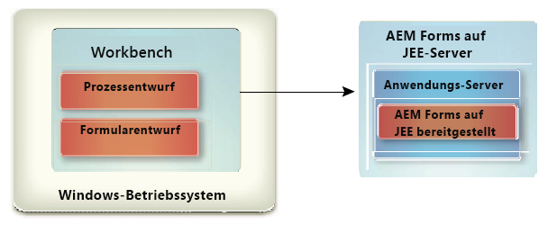

# Installieren von Workbench {#install-workbench}

Dieses Dokument enthält Anweisungen zum Installieren und Konfigurieren von AEM Forms Workbench. Das Programm für die Installation installiert auch Forms Designer.

## Wer sollte dieses Dokument lesen? {#who-should-read-this-doc}

Die Informationen in diesem Dokument richten sich an Administratoren und Entwickler, die für die Installation, Konfiguration, Verwaltung oder Bereitstellung von Workbench zuständig sind. Außerdem finden Sie hier die Informationen, die Sie benötigen, um Ihr System zur Unterstützung der aktualisierten AEM Forms-Prozesse zu konfigurieren. Die bereitgestellten Informationen basieren auf der Annahme, dass jeder, der dieses Dokument liest, mit dem Betriebssystem Microsoft® Windows® vertraut ist.

## Zusätzliche Informationen {#additional-information}

Die Ressourcen in dieser Tabelle können Ihnen dabei helfen, mehr über AEM Forms zu erfahren und die ersten Schritte zu unternehmen.
<table>
 <tbody>
  <tr>
   <td>
<strong>Informationen</strong>
 </td>
   <td>
<strong>Siehe</strong>
 </td>
  </tr>
  <tr>
   <td>
Informationen bezüglich der Prozesse für Workbench
 </td>
   <td>
<a href="https://helpx.adobe.com/content/dam/help/de/experience-manager/6-5/forms/pdf/WorkbenchHelp.pdf">Workbench-Hilfe</a>    
 </td>
  </tr>
  <tr>
   <td>
Allgemeine Informationen über AEM Forms und seine Integration mit anderen Produkten der Adobe
 </td>
   <td>
<a href="http://adobe.com/go/learn_aemforms_introduction_65">AEM Forms-Übersicht</a>    
 </td>
  </tr>
  <tr>
   <td>
Die gesamte Dokumentation für AEM Forms
 </td>
   <td>
<a href="http://adobe.com/go/learn_aemforms_introduction_65">AEM Forms-Dokumentation</a>    
 </td>
  </tr>
  <tr>
   <td>
Patch-Updates, technische Hinweise und zusätzliche Informationen zu dieser Produktversion
 </td>
   <td>
Wenden Sie sich an den Adobe Enterprise-Support</a>    
 </td>
  </tr>
 </tbody>
</table>

>[!NOTE]
>
>Der Flex Workspace ist für AEM Forms nicht mehr unterstützt. Es ist für die AEM Forms-Version verfügbar.

## Vor der Installation {#before-you-install}

### Installation von Workbench – Übersicht {#workbench-installation-overview}

Workbench ist eine integrierte Entwicklungsumgebung (IDE), die Entwickler und Formularersteller verwenden, um automatisierte Geschäftsprozesse und Formulare zu erstellen. Sie wird auch verwendet, um die Ressourcen und Dienste zu verwalten, die die Prozesse und die Formulare verwenden.

Die folgende Abbildung zeigt die Workbench-Installation, einschließlich:
* Process Design mit Workbench
* Formularentwickler mit Designer

>[!NOTE]
>
>Für den AEM Forms-Server ist ein separates Programm erforderlich. Weitere Informationen finden Sie in der Installationsdokumentation zu AEM Forms on JEE.

## Systemanforderungen {#system-prerequisites}

In diesem Abschnitt werden die Hardware- und Softwareanforderungen und die unterstützten Plattformen dargelegt.

### Mindestanforderungen an Hardware und Software {#minimum-hardware-software-requirements}

****
WorkbenchDie folgenden Anforderungen werden als Mindestanforderung empfohlen: Speicherplatz für die Installation:
* 680 MB nur für Workbench.
* 2,15 GB auf einem einzigen Laufwerk für eine vollständige Installation von Workbench, Designer und die Assemblierung der Beispiele.
* 400 MB für temporäre Installationsordner – 200 MB im temporären Ordner des Benutzers und 200 MB im temporären Ordner von Windows.

>[!NOTE]
>
>Wenn sich alle diese Speicherorte auf einem einzigen Laufwerk befinden, müssen während der Installation 1,5 GB Speicherplatz verfügbar sein. Die Dateien, die in den temporären Ordner kopiert werden, werden nach Abschluss der Installation gelöscht.

* Hardware-Anforderung: Intel® Pentium® 4 oder gleichwertiger AMD-Prozessor, 1 GHz.
* Java™ Runtime Umgebung (JRE) 7.0 Update 51 oder höher auf 7.0.
* Minimale Bildschirmauflösung 1024 x 768 Pixel oder höher mit 16-Bit-Farbtiefe oder höher.
* TCP/IPv4- oder TCP/IPv6-Netzwerkverbindung zum AEM Forms-Server.
* Installieren Sie Visual C++ Redistributable Runtime Packages 2012 32-Bit.
* Installieren Sie Visual C++ Redistributable Runtime Packages 2013 32-Bit.

>[!NOTE]
>
>Sie müssen über Administratorrechte verfügen, um Workbench installieren zu können. Wenn Sie die Installation nicht unter einem Administratorkonto durchführen, werden Sie vom Installationsprogramm zur Eingabe der Berechtigungen für ein passendes Konto aufgefordert.

### Unterstützte Plattformen {#supported-platforms}

Die vollständige Liste der unterstützten Plattformen für Workbench finden Sie unter [Unterstützte Plattformen für AEM Forms](http://adobe.com/go/learn_aemforms_supportedplatforms_65_de).

## Überlegungen zur Installation von Designer {#designer-installation-considerations}

Standardmäßig enthält die Workbench-Installation eine entsprechende englische Version von Designer. Wenn die Workbench-Installationsanwendung eine vorhandene Version von Designer auf Ihrem Computer erkennt, wird die Installation möglicherweise abgebrochen und Sie müssen die aktuelle Version von Designer entfernen, bevor Sie fortfahren können.
Die folgende Tabelle enthält eine vollständige Liste der möglicherweise auftretenden Installationsszenarien von Designer, sowie alle Aktionen, die Sie ausführen müssen, wenn Sie Workbench installieren.

<table>
 <tbody>
  <tr>
   <td>
<strong>Aktuell installierte Version von Designer</strong>
 </td>
   <td>
<strong>Erforderliche Aktionen</strong>
 </td>
  </tr>
  <tr>
   <td>
Acrobat Pro oder Acrobat Pro Extended (mit Designer)
 </td>
   <td>
Kein.  
Die Workbench-Installation erkennt auf Ihrem Computer eine Instanz von Designer, die entweder mit Acrobat Pro oder Acrobat Pro Extended installiert wurde. 
Verschiedene Versionen von Designer können auf demselben System nebeneinander bestehen, z. B. Designer 6.4.x für Workbench 6.4 und Designer 6.5.0.x für Workbench 6.5. Es ist nicht erforderlich, die mit Acrobat 10 Pro oder Acrobat 10 Pro Extended oder höher installierte Version von Designer zu deinstallieren.
 
 </td>
  </tr>
  <tr>
   <td>
Designer (eigenständig)
 </td>
   <td>
Kein.  Die Version von Designer in Workbench ist nur in englischer Sprache verfügbar.  Das Workbench-Installationsprogramm installiert keine neue Version von Designer. Stattdessen wird eine aktualisierte Version, zusammen mit dem Installationsprogramm von Workbench, gepatcht. Dies ermöglicht es Ihnen auch, Ihre lokalisierte Version von Designer in Workbench zu verwenden.  
 </td>
  </tr>
 </tbody>
</table>

### Deinstallation von Designer (eigenständig) unter Windows 10 {#uninstall-designer-standalone-windows10}

1. Gehen Sie zu **Systemsteuerung > Programme > Programm und Funktionen**
1. Wählen Sie unter Aktuell installierte Programm das Programm **Adobe Designer**.
1. Klicken Sie auf **Deinstallieren** und dann auf **Ja**.

## Workbench installieren {#installing-workbench}

In diesem Kapitel wird beschrieben, wie Workbench installiert wird.

### Installieren und Ausführen von Workbench {#installing-and-running-workbench}

Bevor Sie Workbench installieren, müssen Sie sicherstellen, dass Ihre Umgebung über die Software und Hardware verfügt, die zum Ausführen von Workbench erforderlich sind (siehe Abschnitt: **Vor der Installation**).

**Installation und Ausführung von Workbench:**

1. Führen Sie eine der folgenden Aufgaben aus:
   * Navigieren Sie zum Ordner \Workbench auf dem Installationsmedium und doppelklicken Sie auf die Datei „run_windows_installer.bat“.
   * Laden Sie Workbench auf Ihr Dateisystem herunter und entpacken Sie es. Nach dem Herunterladen navigieren Sie zum Ordner \Workbench und doppelklicken Sie auf die Datei „run_windows_installer.bat“.

   >[!IMPORTANT]
   >
   >Das Workbench-Installationsprogramm wird nur von einem lokalen Laufwerk ausgeführt. Es kann nicht von einer Remote-Site aus ausgeführt werden.

   >[!NOTE]
   >
   >Wenn die Fehlermeldung &quot;Java Virtual Machine konnte nicht erstellt werden&quot;angezeigt wird, erstellen Sie eine Umgebung mit dem Wert _JAVA_OPTIONS mit dem Wert -Xmx512M und führen Sie das Installationsprogramm aus.

1. Klicken Sie im Begrüßungsbildschirm auf Weiter.
1. Lesen Sie die Lizenzvereinbarung für das Produkt, wählen Sie Ich akzeptiere die Bedingungen der Lizenzvereinbarung und klicken Sie dann auf Weiter.
1. (Optional) Wählen Sie Adobe Designer installieren, wenn Sie dieses Werkzeug benötigen, um Formulare zu erstellen und zu ändern.

   >[!NOTE]
   >
   >Sie können weiterhin den mit Acrobat 10 installierten Designer verwenden, indem Sie diese Option deaktiviert lassen.

1. Akzeptieren Sie den Standardordner wie aufgelistet oder   Klicken Sie auf Auswählen und wechseln Sie zum Ordner, in dem Sie Workbench installieren möchten, und klicken Sie dann auf Weiter.

   >[!NOTE]
   >
   >Der Installationsordnerpfad darf keine #- (Raute-) und $- (Dollar-)Zeichen enthalten.

1. Lesen Sie die Vorinstallationsübersicht und klicken Sie auf Installieren. Das Installationsprogramm zeigt den Status der Installation an.
1. Lesen Sie die Installationsübersicht. Wählen Sie Beginn AEM Forms Workbench, um Workbench zu starten, und klicken Sie auf Weiter.
1. Lesen Sie die Versionshinweise und klicken Sie auf Fertig.
1. Jetzt sind die folgenden Elemente auf Ihrem Computer installiert:
   * **Workbench**: Um Workbench im Menü &quot;Beginn&quot;auszuführen, wählen Sie &quot;Alle Programm&quot;> &quot;AEM Forms&quot;> &quot;Workbench&quot;, wenn Sie den Kontextordner dort speichern möchten. Für weitere Informationen:   finden Sie in der Dokumentation <a href="https://helpx.adobe.com/content/dam/help/en/experience-manager/6-5/forms/pdf/WorkbenchHelp.pdf">Verwenden von Workbench</a>.
   * **Designer**: Sie können von Workbench aus auf Designer zugreifen. Weitere Informationen finden Sie unter Erste Schritte unter <a href="https://helpx.adobe.com/content/dam/help/en/experience-manager/6-5/forms/pdf/using-designer.pdf">Designer-Hilfe</a>.
   * **AEM Forms SDK**: Weitere Informationen zur Verwendung des SDK finden Sie unter  <a href="http://www.adobe.com/go/learn_aemforms_programming_65">Programmieren mit AEM Forms</a>.

## Aktualisieren von Prozessen {#upgrading-processes}

AEM Forms on JEE-Prozesse können mit dem Upgrade-Assistenten auf AEM Forms-Anwendungen aktualisiert werden. Weitere Informationen finden Sie in der Dokumentation zum Aktualisieren älterer Artefakte in der Workbench-Hilfe.

### Konfigurierung und Anmeldung bei einem Server {#configuring-and-logging-server}

Um Workbench verwenden zu können, muss eine Instanz von AEM Forms ausgeführt werden, üblicherweise auf einem separaten Computer. Sie müssen über einen Benutzernamen und ein Kennwort für die Anmeldung bei AEM Forms sowie über Details zum Serverstandort verfügen.

>[!NOTE]
>
>Wenn Sie AEM Forms für die Verwendung des EMC Documentum- oder IBM FileNet-Repository-Providers konfiguriert haben und Sie sich bei einem anderen Repository als dem Repository anmelden möchten, das in AEM Forms Administration Console als Standard konfiguriert ist, geben Sie den Benutzernamen username@Repository an.

### Konfigurieren von Zeitlimiteinstellungen {#configuring-timeout-settings}

Standardmäßig beträgt das Zeitlimit von Workbench, unabhängig von Aktivität bzw. Inaktivität, zwei Stunden. Informationen zum Bearbeiten der Zeitlimiteinstellung finden Sie unter &quot;Konfigurieren von User Management > Erweiterte Systemattribute konfigurieren&quot;in der <a href="https://docs.adobe.com/content/help/en/experience-manager-65/forms/administrator-help/configure-user-management/configure-advanced-system-attributes.html">Administration Console-Hilfe</a>.

### Konfigurieren von Workbench, um eine Verbindung über HTTPS herzustellen {#configuring-workbench-to-connect-over-HTTPS}

Um Workbench über HTTPS mit einem AEM Forms-Server zu verbinden, müssen Sie sicherstellen, dass die Zertifizierungsstelle (CA), die den öffentlichen Schlüssel ausgestellt hat, von Workbench als vertrauenswürdig anerkannt wird. Wenn das Zertifikat nicht als von einer vertrauenswürdigen Quelle stammt, müssen Sie die Datei &quot;cacert&quot;im Ordner [Workbench_HOME]/workbench/jre/lib/security aktualisieren.

>[!NOTE]
>
>[Workbench_] HOMEstellt den Ordner dar, in dem Workbench installiert wurde. Der Standardspeicherort ist C:\Program Files (x86)\Adobe Experience Manager Forms Workbench.

Stellen Sie sicher, dass Sie die Verbindung mit HTTPS herstellen, indem Sie den im Zertifikat angegebenen Namen verwenden. Dieser Name ist in der Regel der vollständig qualifizierte Hostname.

**So aktualisieren Sie die Datei** &quot;cacert&quot;:
1. Stellen Sie sicher, dass Sie eine Kopie des Secure Sockets Layer- (SSL-)Zertifikats haben. Kontaktieren Sie entweder den Administrator, der den SSL-Server konfiguriert hat, oder exportieren Sie das Zertifikat, indem Sie einen Webbrowser verwenden.

   >[!NOTE]
   >
   >Um das Zertifikat zu exportieren, öffnen Sie einen Webbrowser und melden Sie sich bei Administration Console an, installieren Sie das Zertifikat im Browser und exportieren Sie es dann vom Browser an einen temporären Speicherort für die Datenspeicherung (oder direkt in den Ordner [Workbench_HOME]/workbench/jre/lib/security).

1. Kopieren Sie das Zertifikat in den Ordner [Workbench_HOME]/workbench/jre/lib/security.

1. Öffnen Sie ein Eingabeaufforderungsfenster, navigieren Sie zu [Workbench_HOME]/workbench/jre/bin und geben Sie dann den folgenden Befehl ein:
   `keytool -import -storepass changeit -file [Workbench_HOME]\workbench\jre\lib\security\ssl_cert_for_certname.cer -keystore [Workbench_HOME]\workbench\jre\lib\security\cacerts -alias example`
Hierbei gilt:
   * changeit ist das Standardkennwort zum Keystore „cacerts“.
   * certname ist das Zertifikat, das Sie in Schritt 1 ausgewählt haben.
   * example ist der Aliasname, den Sie für das Zertifikat auswählen. Dieser Wert kann geändert werden

1. Wenn Sie dazu aufgefordert werden, das Zertifikat als vertrauenswürdig festzulegen, geben Sie Ja ein und drücken Sie danach die Eingabetaste. Das Keytool fährt damit fort, die Datei &quot;cacerts&quot;in den Ordner [Workbench_HOME]/workbench/jre/lib/security zu importieren.

1. Schließen Sie Workbench und starten Sie es neu, um Änderungen anzuwenden.

### Konfiguration von Cache-Einstellungen für dynamisch erstellte Vorlagen {#configuring-cache-settings-for-dynamically-generated-templates}

Die folgenden Aspekte der Cache-Operation sollten Sie in Betracht gezogen werden, wenn Ihre Anwendung eindeutige Vorlagen spontan erstellt, indem XFA-Inhalte automatisch aktualisiert werden. In Wirklichkeit verwendet jede Transaktion eine neue, eindeutige Vorlage.

Wenn der Formularersteller oder die Formularausgabe im Cache nach Einträgen für eine bestimmte Formularvorlage sucht oder sie aktualisiert, verwendet er/sie mehrere Schlüsselwerte, um den entsprechenden Cache-Eintrag zu finden, auf den zugegriffen wird.

* **Dateiname der Vorlage**: Als primäre eindeutige Kennung des zwischengespeicherten Formulars wird der Pfad und der Dateiname der Vorlage verwendet.
* **Zeitstempel**: Die Vorlagedatei enthält einen Zeitstempel, der verwendet wird, um den Zeitpunkt der letzten Aktualisierung des Formulars zu bestimmen.
* **Vorlage-UUID**: Designer fügt in die jeweilige Vorlage eine eindeutige Kennung (UUID) für das Formular und seine Version ein. Immer wenn das Formular aktualisiert wird, wird die eingebettete UUID aktualisiert. Die XDP-Vorlage könnte zum Beispiel den folgenden Inhalt anzeigen:

   `<?xml version="1.0" encoding="UTF-8"?>`
   `<?xfa generator="AdobeAEM formsDesignerES_V8.2" APIVersion="2.6.7185.0"?><xdp:xdp xmlns:xdp=http://ns.adobe.com/xdp/ timeStamp="2008-07-29T21:22:12Z" uuid="823e538f-ff6c-4961-b759-f7626978a223"><template xmlns="http://www.xfa.org/schema/xfa-template/2.6/">`

* **Wiedergabeoptionen**: Im Formularwiedergabecache werden die Cache-Inhalte für jeden Satz von eindeutigen Wiedergabeoptionen separat gespeichert.

Der Forms-Dienst erhält Vorlagen durch Verweis auf Dateinamen oder Repository-Speicherort oder durch einen Wert als XML-Objekt im Speicher.
* **Durch Verweis übergebene Vorlagen**: Verwendet den Inhaltsstamm und den Formularnamen. Wenn bei jeder Anforderung eindeutige Vorlagen mit unterschiedlichem Dateinamen mithilfe dieser Methode übergeben werden, wächst der Datenträger-Cache endlos und wird nie wieder verwendet. Um dies zu verhindern, sollten eindeutige Vorlagen mit demselben Dateinamen übergeben werden, um sicherzustellen dass für alle Anforderungen derselbe Cache aktualisiert wird.
* **Nach Wert übergebene Vorlagen**: Verwendet die Vorlagen-Bytes, die zusammen mit den Daten übergeben werden, mithilfe des Parameters theinDataDoc. Wenn eindeutige Vorlagen mit unterschiedlichem UUID mithilfe dieser Methode übergeben werden, wächst der Datenträger-Cache endlos und wird nie wieder verwendet. Um dies zu verhindern, sollte das UUID-Attribut aus allen Vorlagen entfernt werden, um sicherzustellen, dass für die Vorlage kein Cache erstellt wird. Alternativ werden durch die Übergabe derselben UUID, deren Wert nicht Null ist, Cache-Objekte erstellt, es wird jedoch sichergestellt, dass bei jeder Anforderung derselbe Cache aktualisiert wird.

Um zu verhindern, dass der Cache endlos wächst, sollten Sie die folgenden Faktoren berücksichtigen, um dynamisch generierte Vorlagen mit den neuen AEM Forms-APIs zu rendern: renderHTMLForm2 und renderPDFForm2.

Wenn Sie neue APIs verwenden, wird die Vorlage als ein Dokumentobjekt übergeben, das im Forms-Dienst bearbeitet wird, je nachdem, ob es passiviert ist oder nicht.

Für passivierte Dokumente, in denen die UUID und der Inhaltsstamm als Cache-Schlüssel dienen, sollten Sie folgende Aspekte beachten:
* Der Cache wird nicht für passivierte Eingabevorlagen ohne UUID erstellt.
* Wenn mehr als eine passivierte Eingabevorlage mit derselben UUID und demselben Inhaltsstamm übergeben werden, wird derselbe Cache überschrieben.

Für nicht passivierte Dokumente, in denen der Dateiname und der Inhaltsstamm als Cache-Schlüssel dienen, sollten Sie folgende Aspekte beachten:
* Bei nicht-passivierten Eingabevorlagen hängt das Zwischenspeichern vom Inhaltsstamm und vom Dateinamen ab, von wo aus das Dokument erstellt wurde.
Derselbe Cache wird nur für Anforderungen mit demselben Inhaltsstamm und demselben Dateinamen der Vorlage verwendet.
Die folgenden bewährten Methoden stellen sicher, dass der Cache nicht endlos wächst, wenn dynamisch erstellte Vorlagen an den Forms-Dienst übergeben werden:
   * Entfernen Sie die UUID oder übergeben Sie dieselbe UUID in allen dynamisch generierten Vorlagen.
   * Generieren Sie das Dokument entweder aus Vorlage-Bytes oder aus demselben Dateinamen auf der Festplatte.

### Deinstallieren von Workbench  {#uninstalling-workbench}

Verwenden Sie die Funktion &quot;Programm Hinzufügen oder entfernen&quot;in der Systemsteuerung, um das Deinstallationsprogramm Beginn. Die Workbench- und Designer-Anwendungen haben unterschiedliche Deinstallationsprogramme.

## Konfigurieren von AEM Forms XDC Editor {#configuring-aem-forms-xdc-editor}

Mit dem XDC Editor können Administratoren von Netzwerkdruckern XML Forms Architecture Device Configuration-(XDC-)Dateien erstellen und ändern. XDC-Dateien beschreiben die Eigenschaften von Druckern, wie die Druckersprache oder die Korrelation zwischen Papierformat und Position des Druckschachts.

Bevor der Administrator des Netzwerkdruckers den XDC-Editor verwendet, verschieben Sie die XDC-Beispiel-Dateien und lesen Sie die Datei Geräteprofile mit XDC-Editor erstellen.

**Abrufen der Beispiel-XDC-Dateien**:
1. Suchen Sie auf dem AEM Forms-Server den XDC-Ordner in [AEM Forms-Stammordner]\sdk\samples\Output\IVS.
1. Kopieren Sie den Inhalt dieses Ordners in ein Verzeichnis, auf das vom Workbench- oder Eclipse-System aus zugegriffen werden kann.

**Abrufen der XDC Editor-Hilfe**:
1. Rufen Sie die AEM Forms-Dokumentation auf.
1. Klicken Sie auf die Schaltfläche **Entwickeln** und navigieren Sie zu Erstellen von Geräteprofilen mit XDC Editor. Laden Sie die Datei xdc_editor_help_web.zip herunter und installieren Sie die Hilfedateien, indem Sie die Anweisungen befolgen, die in der Readme-Datei angeführt sind.

