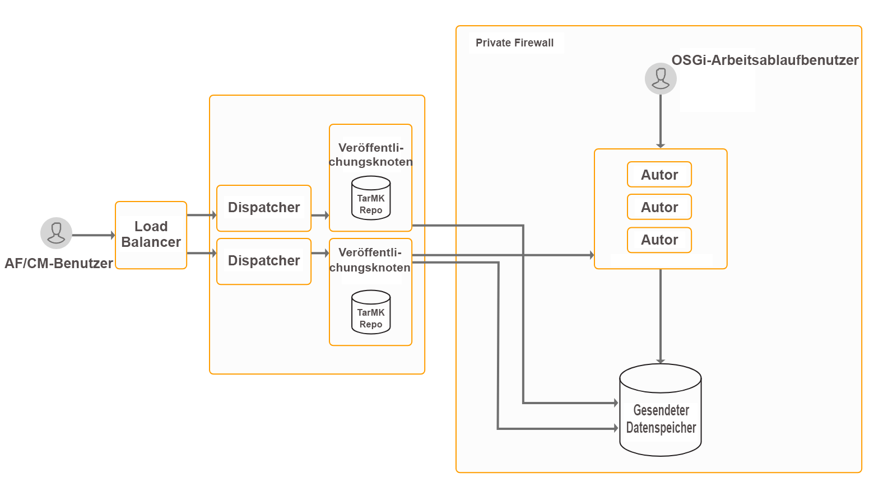

# Installieren und konfigurieren Sie Datenerfassungsfunktionen{#install-and-configure-data-capture-capabilities}

## Einführung {#introduction}

AEM Forms bietet eine Reihe von Formularen zum Abrufen von Daten von Endbenutzenden: adaptive Formulare, HTML5-Formulare und PDF-Formulare. Es bietet außerdem Tools, mit denen Sie alle verfügbaren Formulare auf einer Web-Seite auflisten, die Nutzung von Formularen analysieren und Benutzende anhand ihres Profils ansprechen können. Diese Funktionen sind im Add-On-Paket von AEM Forms enthalten. Das Add-On-Paket wird auf einer Autoren- oder Veröffentlichungsinstanz von AEM bereitgestellt.

**Adaptive Formulare:** Diese Formulare ändern das Erscheinungsbild je nach Bildschirmgröße des Geräts, sind ansprechend und interaktiv. Adaptive Formulare können auch in Adobe Analytics, Adobe Sign und Adobe Target integriert werden. Sie ermöglichen die Bereitstellung personalisierter Formulare und prozessorientierter Erlebnisse für Benutzende, die auf ihrer Demografie und anderen Merkmalen basieren. Sie können adaptive Formulare auch in Adobe Sign integrieren.

**PDF-Formulare** sind für pixelgenaues Drucken und digitale Informationserfassung in einem PDF-Dokument geeignet. Im digitalen Avatar können Sie diese Formulare mit Adobe Acrobat oder Acrobat Reader ausfüllen. Sie können diese Formulare auf Ihrer Website hosten oder das Formularportal verwenden, um diese Formulare auf einer AEM-Site aufzulisten. Sie können diese Formulare auch als Anhänge an andere senden. Diese Formulare eignen sich am besten für Desktop-Umgebungen.

**HTML5-Formulare** sind die Browser-freundliche Version von PDF-Formularen. HTML5-Formulare eignen sich für Umgebungen, die keine PDF-Plug-ins unterstützen. HTML5-Formulare ermöglichen die Wiedergabe von XFA-basierten Formularen auf Mobilgeräten und Desktop-Browsern, auf denen XFA-basierte PDFs nicht unterstützt werden. Diese Formulare eignen sich am besten für Tablets und Desktop-Umgebungen.

AEM Forms ist eine leistungsstarke Plattform für Unternehmen, und die Datenerfassung (adaptive Formulare, PDF-Formulare und HTML5-Formulare) ist nur eine der Funktionen von AEM Forms. Eine vollständige Liste der Funktionen finden Sie in der [Einführung in AEM Forms](/help/forms/using/introduction-aem-forms.md).

## Bereitstellungstopologie {#deployment-topology}

Das AEM Forms Add-On-Paket ist eine Anwendung, die auf AEM bereitgestellt wird. Sie benötigen nur mindestens eine Autoren- und eine Veröffentlichungsinstanz von AEM, um die Datenerfassungsfunktionen von AEM Forms ausführen zu können. Die folgende Topologie wird empfohlen, um die Datenerfassungsfunktionen von AEM Forms auszuführen. Detaillierte Informationen zu Topologien finden Sie unter [Architektur und Bereitstellungstopologien für AEM Forms](/help/forms/using/aem-forms-architecture-deployment.md).



## Systemanforderungen {#system-requirements}

Bevor Sie mit der Installation und Konfiguration der Datenerfassungsfunktion von AEM Forms beginnen, stellen Sie Folgendes sicher:

* Hardware- und Software-Infrastruktur ist eingerichtet. Eine detaillierte Liste der unterstützten Hardware und Software finden Sie unter [Technische Anforderungen](/help/sites-deploying/technical-requirements.md).

* Der Installationspfad der AEM-Instanz enthält keine Leerzeichen.
* Eine AEM Instanz läuft. Installieren Sie für Windows-Benutzer die AEM-Instanz im erweiterten Modus. In der AEM-Terminologie entspricht eine „Instanz“ einer Kopie von AEM, die auf einem Server im Autor- oder Veröffentlichungsmodus ausgeführt wird. Sie benötigen mindestens zwei [AEM-Instanzen (Autor und Veröffentlichung)](/help/sites-deploying/deploy.md), um die Datenerfassungsfunktionen von AEM Forms auszuführen:

   * **Autor**: Eine zum Erstellen, Hochladen und Bearbeiten von Inhalten sowie zum Verwalten der Website verwendete AEM-Instanz. Sobald der Inhalt für die Veröffentlichung bereit ist, wird er an die Veröffentlichungsinstanz repliziert.
   * **Veröffentlichung**: Eine AEM-Instanz, die die veröffentlichten Inhalte über das Internet oder ein internes Netzwerk öffentlich zugänglich macht.

* Es gibt gewisse Arbeitsspeicheranforderungen. Für das Add-on-Paket für AEM Forms ist Folgendes erforderlich:

   * 15 GB temporärer Speicherplatz für Microsoft Windows-basierte Installationen.
   * 6 GB temporärer Speicherplatz für UNIX-basierte Installationen.

* Die Replikation und Rückwärtsreplikation für die Autoren- und die Veröffentlichungsinstanz ist festgelegt. Weitere Informationen finden Sie unter [Replikation](/help/sites-deploying/replication.md).
* Für UNIX-basierte Systeme:

   * Installieren Sie die folgenden 32-Bit-Pakete vom Installationsmedium:

<table>
 <tbody>
  <tr>
   <td>expat</td>
   <td>fontconfig</td>
   <td>freetype</td>
   <td>glibc</td>
  </tr>
  <tr>
   <td>libcurl</td>
   <td>libICE</td>
   <td>libicu</td>
   <td>libSM</td>
  </tr>
  <tr>
   <td>libuuid</td>
   <td>libX11</td>
   <td><p>libXau</p> </td>
   <td>libxcb</td>
  </tr>
  <tr>
   <td>libXext</td>
   <td>libXinerama</td>
   <td>libXrandr</td>
   <td>libXrender</td>
  </tr>
  <tr>
   <td>nss-softokn-freebl</td>
   <td>OpenSSL</td>
   <td>zlib</td>
   <td> </td>
  </tr>
 </tbody>
</table>

>[!NOTE]
>
>* Wenn OpenSSL bereits auf dem Server installiert ist, aktualisieren Sie es auf die neueste Version.
>* Erstellen Sie die Sym-Links libcurl.so, libcrypto.so und libssl.so, die auf die neueste Version der Bibliotheken libcurl, libcrypto und libssl verweisen.
>

* Installieren Sie das folgende 64-Bit-Paket vom Installationsmedium:

   * libicu

* Installieren Sie [Microsoft Visual Studio 2019 – 32-Bit-Redistributable](https://learn.microsoft.com/de-de/cpp/windows/latest-supported-vc-redist?view=msvc-170).


## Installieren des AEM Forms-Add-on-Pakets {#install-aem-forms-add-on-package}

Das AEM Forms Add-On-Paket ist eine Anwendung, die auf AEM bereitgestellt wird. Das Paket enthält AEM Forms bildet Datenerfassung und andere Funktionen. Führen Sie die folgenden Schritte aus, um das Add-On-Paket zu installieren:

1. Öffnen Sie [Software Distribution](https://experience.adobe.com/downloads). Zum Anmelden bei Software Distribution benötigen Sie eine Adobe ID.
1. Auswählen **[!UICONTROL Adobe Experience Manager]** im Kopfzeilenmenü verfügbar.
1. Im Abschnitt **[!UICONTROL Filter]**:
   1. Wählen Sie **[!UICONTROL Formulare]** aus der Dropdown-Liste **[!UICONTROL Lösung]** aus.
   2. Wählen Sie die Version aus und geben Sie sie für das Paket ein. Sie können auch die Option **[!UICONTROL Downloads durchsuchen]** verwenden, um die Ergebnisse zu filtern.
1. Wählen Sie den für Ihr Betriebssystem zutreffenden Paketnamen aus und wählen Sie **[!UICONTROL EULA-Bedingungen akzeptieren]** und wählen Sie **[!UICONTROL Herunterladen]**.
1. Öffnen Sie [Package Manager](https://experienceleague.adobe.com/docs/experience-manager-65/administering/contentmanagement/package-manager.html?lang=de) und klicken Sie auf **[!UICONTROL Paket hochladen]**, um das Paket hochzuladen.
1. Wählen Sie das Paket aus und klicken Sie auf **[!UICONTROL Installieren]**.

   Sie können das Paket auch über den direkten Link herunterladen, der im Artikel [AEM Forms-Versionen](https://helpx.adobe.com/de/aem-forms/kb/aem-forms-releases.html) aufgeführt ist.
1. Sobald das Paket installiert ist, werden Sie aufgefordert, die AEM-Instanz neu zu starten. **Starten Sie den Server nicht sofort neu.** Warten Sie vor dem Anhalten des AEM Forms-Servers, bis die Meldungen „ServiceEvent REGISTERED“ und „ServiceEvent UNREGISTERED“ nicht mehr in der Datei `[AEM-Installation-Directory]/crx-quickstart/logs/error.log` angezeigt werden und das Protokoll stabil ist.

   >[!NOTE]
   >
   > Es wird empfohlen, den Befehl „Strg + C“ zu verwenden, um das SDK neu zu starten. Das Neustarten des AEM SDK mithilfe alternativer Methoden, z. B. dem Beenden von Java-Prozessen, kann zu Inkonsistenzen in der AEM-Entwicklungsumgebung führen.

1. Wiederholen Sie Schritten 1-7 für alle Autor- und Veröffentlichungsinstanzen. 

### (Nur Windows) Automatische Installation von verteilbaren Visual Studio-Dateien {#automatic-installation-visual-studio-redistributables}

Wenn Sie eine AEM-Instanz im erhöhten Modus installieren, werden die verteilbaren 32-Bit-Dateien von Visual Studio während der Installation des Add-on-Pakets von AEM Forms automatisch installiert.

Um zu prüfen, ob die verteilbaren Visual Studio-Dateien automatisch installiert wurden, öffnen Sie die Datei `error.log` im Verzeichnis `/crx-repository/logs/`. Die Protokolle enthalten die folgende Meldung:

`Redist <service name> already installed on system, will not attempt re-installation`

Wenn die verteilbaren Dateien nicht installiert werden können, enthalten die Protokolle die folgende Meldung:

`Current user does not have elevated privileges, aborting installation of redist <service name>`

Um das Problem zu beheben, starten Sie den AEM-Server neu, installieren Sie AEM im erhöhten Modus und installieren Sie dann das AEM Forms-Add-on-Paket.

Wenn die Berechtigungsprüfung fehlschlägt, enthalten die Protokolle die folgende Meldung:

`Privilege escalation check failed with error: <error message>`

## Auf die Installation folgende Konfigurationen {#post-installation-configurations}

Einige der Konfigurationen von AEM Forms sind obligatorisch und andere optional. Zu den obligatorischen Konfigurationen gehören die Konfiguration von BouncyCastle-Bibliotheken und Serialisierungsagenten. Zu den optionalen Konfigurationen gehören die Konfiguration von Dispatcher, Forms Portal, Adobe Sign, Adobe Analytics und Adobe Target.

### Obligatorische Konfigurationen nach der Installation {#mandatory-post-installation-configurations}

#### Konfigurieren von RSA- und BouncyCastle-Bibliotheken  {#configure-rsa-and-bouncycastle-libraries}

Führen Sie sowohl auf der Autor- als auch auf der Veröffentlichungsinstanz folgende Schritte zum Boot-Delegate der Bibliotheken aus:

1. Beenden Sie die zugrunde liegenden AEM-Instanz.
1. Öffnen Sie die Datei `[AEM installation directory]\crx-quickstart\conf\sling.properties`, um sie zu bearbeiten.

   Wenn Sie `[AEM installation directory]\crx-quickstart\bin\start.bat` zum Starten von AEM verwenden, bearbeiten Sie „sling.properties“ unter `[AEM_root]\crx-quickstart\`.

1. Fügen Sie die folgenden Eigenschaften der sling.properties-Datei hinzu:

   ```shell
   sling.bootdelegation.class.com.rsa.jsafe.provider.JsafeJCE=com.rsa.*  
   ```

1. Speichern und schließen Sie die Datei und starten Sie die AEM-Instanz.
1. Wiederholen Sie Schritte 1-4 für alle Autor- und Veröffentlichungsinstanzen.

#### Konfigurieren Sie den Serialisierungsagenten {#configure-the-serialization-agent}

Führen Sie auf allen Autoren- und Veröffentlichungsinstanzen folgende Schritte aus, um das Paket zur Zulassungsliste hinzuzufügen:

1. Öffnen Sie AEM Configuration Manager in einem Browserfenster. Die Standardeinstellung ist `https://'[server]:[port]'/system/console/configMgr`.
1. Suchen Sie nach **com.adobe.cq.deserfw.impl.DeserializationFirewallImpl.name** und öffnen Sie die Konfiguration.
1. Fügen Sie das Paket **sun.util.calendar** zum Feld **Zulassungsliste** hinzu. Klicken Sie auf **Speichern**.
1. Wiederholen Sie Schritte 1-3 für alle Autor- und Veröffentlichungsinstanzen.

### Optionale Konfigurationen nach der Installation {#optional-post-installation-configurations}

#### Konfiguration des Dispatchers {#configure-dispatcher}

Der Dispatcher ist das Werkzeug für das Caching und/oder den Lastenausgleich von Adobe Experience Manager, das in Verbindung mit einem Web-Server der Enterprise-Klasse verwendet werden kann. Wenn Sie [Dispatcher](https://helpx.adobe.com/de/experience-manager/dispatcher/using/dispatcher-configuration.html) verwenden, führen Sie die folgenden Konfigurationen für AEM Forms durch:

1. Konfigurieren des Zugriffs für AEM Forms:

   Öffnen Sie die Datei „dispatcher.any“ zum Bearbeiten. Navigieren Sie zum Filterabschnitt und fügen Sie ihm den folgenden Filter hinzu:

   `/0025 { /type "allow" /glob "* /bin/xfaforms/submitaction*" } # to enable AEM Forms submission`

   Speichern und schließen Sie die Datei. Detaillierte Informationen zu Filtern finden Sie in der [Dispatcher-Dokumentation](https://helpx.adobe.com/de/experience-manager/dispatcher/using/dispatcher-configuration.html).

1. So konfigurieren Sie den Referrer-Filterdienst:

   Melden Sie sich beim Apache Felix Configuration Manager als Admin an. Die Standard-URL für den Configuration Manager lautet `https://[server]:[port_number]/system/console/configMgr`. Wählen Sie im Menü **Configurations** die Option **Apache Sling Referrer Filter.** Geben Sie im Feld „Hosts zulassen“ den Hostnamen des Dispatchers ein, um ihn als Referrer zuzulassen, und klicken Sie auf **Speichern**. Das Format des Eintrags ist `https://[server]:[port]`.

#### Konfigurieren des Cache {#configure-cache}

Caching ist ein Mechanismus zur Verkürzung von Datenzugriffszeiten, zur Verringerung von Latenzzeiten und zur Verbesserung der Ein-/Ausgabegeschwindigkeit (I/O). Der Cache für adaptive Formulare speichert nur HTML-Inhalte und JSON-Strukturen eines adaptiven Formulars, ohne die vorausgefüllten Daten zu speichern. Er trägt dazu bei, die für die Darstellung eines adaptiven Formulars erforderliche Zeit zu verkürzen.

* Wenn Sie den Cache für adaptive Formulare verwenden, verwenden Sie den [AEM Dispatcher](https://helpx.adobe.com/de/experience-manager/dispatcher/using/dispatcher-configuration.html), um Client-Bibliotheken (CSS und JavaScript) eines adaptiven Formulars zwischenzuspeichern.
* Halten Sie beim Entwickeln benutzerdefinierter Komponenten den Cache für adaptive Formulare auf dem für die Entwicklung verwendeten Server deaktiviert.

Führen Sie die folgenden Schritte aus, um den Cache für adaptive Formulare zu konfigurieren:

1. Wechseln Sie zum Konfigurations-Manager der AEM-Web-Konsole unter https://&#39;[server]:[port]&#39;/system/console/configMgr.
1. Klicken Sie auf **Konfiguration für adaptive Formulare und interaktiven Kommunikations-Web-Kanal**, um die Konfigurationswerte zu bearbeiten. Geben Sie im Dialogfeld „Konfigurationswerte bearbeiten“ die maximale Anzahl von Formularen oder Dokumenten an, die eine Instanz des AEM Forms-Servers im Feld **Anzahl adaptiver Formulare** zwischenspeichern kann. Der Standardwert ist 100. Klicken Sie auf **Speichern**.

   >[!NOTE]
   >
   >Um den Cache zu deaktivieren, legen Sie den Wert im Feld „Anzahl adaptiver Formulare“ auf **0** fest. Der Cache wird zurückgesetzt, und alle Formulare und Dokumente werden aus dem Cache entfernt, wenn Sie die Cachekonfiguration deaktivieren oder ändern.

#### Konfigurieren der SSL-Kommunikation für das Formulardatenmodell {#configure-ssl-communcation-for-form-data-model}

Sie können für das Formulardatenmodell die SSL-Kommunikation aktivieren. Um die SSL-Kommunikation für das Formulardatenmodell zu aktivieren, fügen Sie vor dem Starten einer AEM Forms-Instanz Zertifikate zum Java Trust Store aller Instanzen hinzu. Sie können den folgenden Befehl ausführen, um die Zertifikate hinzuzufügen: 

`keytool -import -alias <alias-name> -file <pathTo .cer certificate file> -keystore <<pathToJRE>\lib\security\cacerts>`

#### Konfigurieren von Adobe Sign {#configure-adobe-sign}

Adobe Sign ermöglicht Workflows für die elektronische Signatur für adaptive Formulare. E-Signaturen verbessern die Workflows bei der Verarbeitung von Dokumenten in den Bereichen Recht, Vertrieb, Gehaltsabrechnung, Personalverwaltung u. v. a..

In einem typischen Szenario mit Adobe Sign und adaptiven Formularen füllt der Benutzer ein adaptives Formular aus, um eine **Dienstleistung zu beantragen**. Dies könnte beispielsweise ein Antrag für eine Kreditkarte oder ein Formular für Dienstleistungen für Bürger sein. Wenn ein Benutzer das Antragsformular ausfüllt und signiert, wird dieses zur Bearbeitung an den Dienstleister gesendet. Der Dienstanbieter prüft den Antrag und markiert ihn mit Adobe Sign als genehmigt. Sie können ähnliche Workflows für elektronische Signaturen ermöglichen, indem Sie Adobe Sign in AEM Forms integrieren.

Um Adobe Sign mit AEM Forms zu verwenden, [integrieren Sie Adobe Sign mit AEM Forms](/help/forms/using/adobe-sign-integration-adaptive-forms.md).

#### Konfigurieren von Adobe Analytics {#configure-adobe-analytics}

AEM Forms ermöglicht die Integration mit Adobe Analytics, sodass Sie Leistungsmetriken für Ihre veröffentlichten Formulare und Dokumente erfassen und verfolgen können. Ziel dieser Analyse ist es, informierte, auf Daten basierende Entscheidungen zu erforderlichen Formularänderungen treffen zu können, durch die Formulare oder Dokumente benutzerfreundlicher werden.

Adobe Analytics mit AEM Forms finden Sie unter [Konfigurieren von Analytics und Berichte](/help/forms/using/configure-analytics-forms-documents.md).

#### Integrieren mit Adobe Target {#integrate-adobe-target}

Ihre Kunden werden ein Formular wahrscheinlich verlassen, wenn sie nicht davon angesprochen fühlen. Für die Kunden ist dies ein frustrierendes Erlebnis. Für Ihr Unternehmen kann es zusätzlichen Supportaufwand und Mehrkosten bedeuten. Das Kundenerlebnis optimal zu gestalten und dadurch eine höhere Konvertierungsrate zu erzielen, ist absolut unverzichtbar und stellt zugleich eine große Herausforderung dar. AEM Forms ist der Schlüssel zu diesem Problem.

AEM forms kann mit der Adobe Marketing Cloud-Lösung Adobe Target integriert werden, um den Kunden ein personalisiertes und ansprechendes Erlebnis über verschiedene digitale Kanäle zu bieten. Um Adobe Target für A/B-Tests für adaptive Formulare zu verwenden, [integrieren Sie Adobe Target in AEM Forms](/help/forms/using/ab-testing-adaptive-forms.md#setupandintegratetargetinaemforms).

## Nächste Schritte {#next-steps}

Sie haben eine Umgebung für die Verwendung der AEM Forms-Datenerfassungsfunktionen konfiguriert. Die nächsten Schritte zur Verwendung der Funktionen, sind Folgende:

* [Erstellen Sie Ihr erstes adaptives Formular](/help/forms/using/create-your-first-adaptive-form.md)
* [Erstellen Sie Ihr erstes PDF Formular](https://www.adobe.com/go/learn_aemforms_designer_quick_start_65_de)
* [Einführung in HTML5-Formulare](/help/forms/using/introduction.md)
