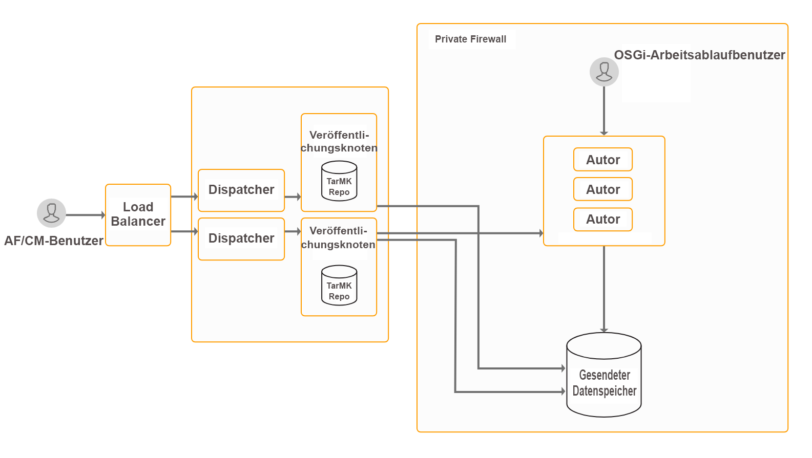

# Installieren und konfigurieren Sie Interaktive Kommunikationen{#install-and-configure-interactive-communications}

## Einführung {#introduction}

AEM Form bietet die Möglichkeit, die Erstellung, Zusammenstellung, Verwaltung und Bereitstellung von sicheren und interaktiven Dokumenten wie Geschäftskorrespondenzen, Dokumenten, Mitteilungen, Leistungsbenachrichtigungen, Marketing-E-Mails, Rechnungen und Willkommenskits zu zentralisieren. Diese Funktion wird als interaktive Kommunikation bezeichnet. Die Funktion ist im AEM Forms Add-On-Paket enthalten. Das Add-On-Paket wird auf einer Autor- oder Veröffentlichungsinstanz von AEM bereitgestellt.

Sie können die interaktive Kommunikationsfunktion verwenden, um Kommunikation in mehreren Formaten zu erstellen. Zum Beispiel Web und PDF. Sie können interaktive Kommunikation mit AEM Workflow integrieren, um die zusammengestellte Kommunikation auf dem Kanal ihrer Wahl zu verarbeiten und an Kunden zu liefern. Zum Beispiel Senden einer Nachricht an Endbenutzer per E-Mail.

Wenn Sie ein Upgrade von einer früheren Version durchführen und bereits in Correspondence Management investiert haben, können Sie das [Kompatibilitätspaket](../../forms/using/installing-configuring-intreactive-communication-correspondence-management.md#install-compatibility-package) installieren, um das Correspondence Management weiterhin zu verwenden. Informationen zu den Unterschieden zwischen interaktiver Kommunikation und Korrespondenzverwaltung finden Sie unter [Übersicht über interaktive Kommunikation](/help/forms/using/interactive-communications-overview.md#interactive-communications-vs-correspondence-management).

AEM Forms ist eine leistungsstarke Plattform der Enterprise-Klasse. Interaktive Kommunikation ist nur eine der Möglichkeiten von AEM Forms. Eine vollständige Liste der Funktionen finden Sie unter [Einführung in AEM Forms](../../forms/using/introduction-aem-forms.md).

## Bereitstellungstopologie {#deployment-topology}

AEM Forms-Add-On-Paket ist eine Anwendung, die auf AEM bereitgestellt wird. Sie benötigen nur eine AEM Autor- und Verarbeitungsinstanz, um die Interaktive Kommunikations-Funktion auszuführen. Die folgende Topologie ist eine indikative Topologie zum Ausführen von AEM Forms Interactive Communications, Correspondence Management, AEM Forms-Datenerfassung und Forms-Centric-Workflow für OSGi-Funktionen. Detaillierte Informationen zu Topologien finden Sie unter [Architektur und Bereitstellungstopologien für AEM Forms](/help/forms/using/aem-forms-architecture-deployment.md).



AEM Forms Interaktive Kommunikation führt Admin-, Autor- und Agentenbenutzeroberflächen auf den Autorinstanzen von AEM Forms aus. Die Veröffentlichungsinstanzen hosten die endgültige Version der interaktiven Kommunikation, die für den Endbenutzer bereit ist.

## Systemanforderungen {#system-requirements}

Bevor Sie mit der Installation und Konfiguration der Funktionen für interaktive Kommunikation und Korrespondenzverwaltung von AEM Forms beginnen, stellen Sie Folgendes sicher:

* Hardware- und Software-Infrastruktur ist eingerichtet. Eine detaillierte Liste der unterstützten Hardware und Software finden Sie unter [Technische Anforderungen](/help/sites-deploying/technical-requirements.md).

* Der Installationspfad der AEM-Instanz enthält keine Leerzeichen.
* Eine AEM-Instanz wird ausgeführt. In der AEM-Terminologie entspricht eine „Instanz“ einer Kopie von AEM, die auf einem Server im Autor- oder Veröffentlichungsmodus ausgeführt wird. Sie benötigen mindestens eine AEM Instanzen (Autor oder Verarbeitung), um die interaktiven Kommunikations- und Correspondence Management-Funktionen von AEM Forms ausführen zu können:

   * **Autor**: Eine zum Erstellen, Hochladen und Bearbeiten von Inhalten sowie zum Verwalten der Website verwendete AEM-Instanz. Sobald der Inhalt für die Veröffentlichung bereit ist, wird er an die Veröffentlichungsinstanz repliziert.
   * **Verarbeitung:** Eine Verarbeitungsinstanz ist eine [extrasichere Instanz von AEM Autor](/help/forms/using/hardening-securing-aem-forms-environment.md). Sie können eine Autoreninstanz einrichten und nach der Installation härten.

   * **Veröffentlichen**: Eine AEM-Instanz, die den Inhalt über das Internet oder ein internes Netzwerk veröffentlicht.

* Speicheranforderungen werden erfüllt. Für das Add-on-Paket für AEM Forms ist Folgendes erforderlich:

   * 15 GB temporärer Speicherplatz für Microsoft Windows-basierte Installationen.
   * 6 GB temporärer Speicherplatz für UNIX-basierte Installationen.

* Wenn Sie das UNIX-basierte Betriebssystem verwenden, installieren Sie die folgenden-Pakete aus den Installationsmedien des jeweiligen Betriebssystems.

<table>
 <tbody>
  <tr>
   <td>expat</td>
   <td>libxcb</td>
   <td>freetype</td>
   <td>libXau</td>
  </tr>
  <tr>
   <td>libSM</td>
   <td>zlib</td>
   <td>libICE</td>
   <td>libuuid</td>
  </tr>
  <tr>
   <td>glibc</td>
   <td>libXext</td>
   <td><p>nss-softokn-freebl</p> </td>
   <td>fontconfig</td>
  </tr>
  <tr>
   <td>libX11</td>
   <td>libXrender</td>
   <td>libXrandr</td>
   <td>libXinerama</td>
  </tr>
 </tbody>
</table>

## Installieren des AEM Forms-Add-on-Pakets {#install-aem-forms-add-on-package}

AEM Forms-Add-On-Paket ist eine Anwendung, die auf AEM bereitgestellt wird. Das Paket enthält die interaktive Kommunikation mit AEM Forms, Correspondence Management und andere Funktionen. Führen Sie die folgenden Schritte aus, um das Add-On-Paket zu installieren:

1. Öffnen Sie [Software Distribution](https://experience.adobe.com/downloads). Zum Anmelden bei Software Distribution benötigen Sie eine Adobe ID.
1. Tippen Sie im Kopfzeilenmenü auf **[!UICONTROL Adobe Experience Manager]**.
1. Im Abschnitt **[!UICONTROL Filter]**:
   1. Wählen Sie **[!UICONTROL Formulare]** aus der Dropdown-Liste **[!UICONTROL Lösung]**.
   2. Wählen Sie die Version und den Typ für das Paket aus. Sie können auch die Option **[!UICONTROL Downloads suchen]** verwenden, um die Ergebnisse zu filtern.
1. Tippen Sie auf den Paketnamen für Ihr Betriebssystem, wählen Sie **[!UICONTROL Endbenutzer-Lizenzbedingungen akzeptieren]** und tippen Sie auf **[!UICONTROL Download]**.
1. Öffnen Sie [Package Manager](https://docs.adobe.com/content/help/en/experience-manager-65/administering/contentmanagement/package-manager.html) und klicken Sie auf **[!UICONTROL Paket hochladen]**, um das Paket hochzuladen.
1. Wählen Sie das Paket aus und klicken Sie auf **[!UICONTROL Installieren]**.

   Sie können das Paket auch über den direkten Link herunterladen, der im Artikel [AEM Forms releases](https://helpx.adobe.com/aem-forms/kb/aem-forms-releases.html) aufgeführt ist.

1. Sobald das Paket installiert ist, werden Sie aufgefordert, die AEM-Instanz neu zu starten. **Starten Sie den Server nicht sofort neu.** Warten Sie vor dem Anhalten des AEM Forms-Servers, bis die Meldungen ServiceEvent REGISTERED und ServiceEvent UNREGISTERED nicht mehr in der Datei  [AEM-Installation-Directory]/crx-quickstart/logs/error.log angezeigt werden und das Protokoll stabil ist.
1. Wiederholen Sie Schritten 1-7 für alle Autor- und Veröffentlichungsinstanzen.  

## Auf die Installation folgende Konfigurationen {#post-installation-configurations}

AEM Forms verfügt über einige obligatorische und optionale Konfigurationen. Zu den obligatorischen Konfigurationen gehören die Konfiguration von BouncyCastle-Bibliotheken und des Serialisierungsagenten. Zu den optionalen Konfigurationen gehören die Konfiguration von Dispatcher und Adobe Target.

### Obligatorisch Konfigurationen nach der Installation {#mandatory-post-installation-configurations}

#### Konfigurieren von RSA- und BouncyCastle-Bibliotheken  {#configure-rsa-and-bouncycastle-libraries}

Führen Sie sowohl auf der Autor- als auch auf der Veröffentlichungsinstanz folgende Schritte zum Boot-Delegate der Bibliotheken aus:

1. Beenden Sie die zugrunde liegenden AEM-Instanz.
1. Öffnen Sie die Datei [AEM Installationsverzeichnis]\crx-quickstart\conf\sling.properties zur Bearbeitung.

   Wenn Sie [AEM Installationsordner]\crx-quickstart\bin\start.bat zum Starten von AEM verwendet haben, bearbeiten Sie die sling.properties-Datei unter [AEM_root]\crx-quickstart\.

1. Fügen Sie die folgenden Eigenschaften der sling.properties-Datei hinzu:

   ```shell
   sling.bootdelegation.class.com.rsa.jsafe.provider.JsafeJCE=com.rsa.*
   ```

1. Speichern und schließen Sie die Datei und starten Sie die AEM-Instanz.
1. Wiederholen Sie Schritten 1-4 für alle Autor- und Veröffentlichungsinstanzen.  

#### Konfigurieren Sie den Serialisierungsagenten {#configure-the-serialization-agent}

Führen Sie die folgenden Schritte für alle Autoren- und Veröffentlichungsinstanzen aus, um das Paket zur Zulassungsliste hinzuzufügen:

1. Öffnen Sie AEM Configuration Manager in einem Browserfenster. Die Standard-URL lautet https://&#39;[server]:[port]&#39;/system/console/configMgr.
1. Suchen und öffnen Sie die **Deserialisierungs-Firewallkonfiguration**.
1. Fügen Sie das Paket **sun.util.calendar** zum Feld **Zulassungsliste** hinzu. Klicken Sie auf Speichern.
1. Wiederholen Sie Schritten 1-3 für alle Autor- und Veröffentlichungsinstanzen.  

### Optionale Konfigurationen nach der Installation {#optional-post-installation-configurations}

#### Installieren Sie das Kompatibilitäts-Paket {#install-compatibility-package}

Interaktive Kommunikation ist der Standard und empfohlene Ansatz, um Kundenkommunikation in AEM 6.5 Forms zu erstellen. Wenn Sie ein Upgrade oder eine Migration von einer früheren Version durchgeführt haben und weiterhin Briefe (Correspondence Management) verwenden möchten, installieren Sie das [AEMFD-Kompatibilitätspaket](https://www.adobeaemcloud.com/content/marketplace/marketplaceProxy.html?packagePath=/content/companies/public/adobe/packages/cq640/fd/AEM-FORMS-6.4-COMPAT).

Mit dem AEMFD-Kompatibilitätspaket können Sie die folgenden Assets aus AEM 6.4 Forms, AEM 6.3 Forms und AEM 6.2 Forms auf AEM 6.5 Forms verwenden:

* Dokumentfragmente
* Briefe
* Datenwörterbücher
* Veraltete Vorlagen und Seiten für adaptive Formulare

#### Konfiguration des Dispatchers {#configure-dispatcher}

Der Dispatcher ist das Tool zum Zwischenspeichern und/oder Lastenausgleich von Adobe Experience Manager, das in Verbindung mit einem Webserver der Unternehmensklasse verwendet werden kann. Wenn Sie [Dispatcher](https://helpx.adobe.com/de/experience-manager/dispatcher/using/dispatcher-configuration.html) verwenden, führen Sie die folgenden Konfigurationen für AEM Forms durch:

1. Konfigurieren des Zugriffs für AEM Forms:

   Öffnen Sie die Datei „dispatcher.any“, um sie zu bearbeiten. Navigieren Sie zum Filterabschnitt und fügen Sie den folgenden Filter dem Filterabschnitt hinzu:

   `/0025 { /type "allow" /glob "* /bin/xfaforms/submitaction*" } # to enable AEM Forms submission`

   Speichern und schließen Sie die Datei. Ausführliche Informationen zu Filtern finden Sie in der [Dispatcher-Dokumentation](https://helpx.adobe.com/experience-manager/dispatcher/using/dispatcher-configuration.html).

1. Konfigurieren des Referrer-Filterservice:

   Melden Sie sich beim Apache Felix Configuration Manager als Administrator an. Die Standard-URL des Konfigurationsmanagers lautet https://&#39;server&#39;:[port_number]/system/console/configMgr. Wählen Sie im Menü **Configurations** die Option **Apache Sling Referrer Filter.** Geben Sie im Feld „Hosts zulassen“ den Hostnamen des Dispatchers ein, um ihn als Referrer zuzulassen, und klicken Sie auf **Speichern**. Das Format des Eintrags ist https://&#39;[server]:[port]&#39;.

#### Integrieren von Adobe Target {#integrate-adobe-target}

Ihre Kunden werden interaktive Kommunikation wahrscheinlich verlassen, wenn sie nicht davon angesprochen fühlen. Für die Kunden ist dies ein frustrierendes Erlebnis. Für Ihr Unternehmen kann es zusätzlichen Supportaufwand und Mehrkosten bedeuten. Das Kundenerlebnis optimal zu gestalten und dadurch eine höhere Konvertierungsrate zu erzielen, ist absolut unverzichtbar und stellt zugleich eine große Herausforderung dar. Mit AEM forms erhalten Sie das entscheidende Werkzeug.

AEM forms kann mit der Adobe Marketing Cloud-Lösung Adobe Target integriert werden, um den Kunden ein personalisiertes und ansprechendes Erlebnis über verschiedene digitale Kanäle zu bieten. Um Adobe Target zur Personalisierung einer interaktiven Kommunikation zu verwenden, [integrieren Sie Adobe Target in AEM Forms](../../forms/using/ab-testing-adaptive-forms.md#setupandintegratetargetinaemforms).

#### Konfigurieren Sie die SSL-Kommunikation für das Formulardatenmodell  {#configure-ssl-communcation-for-form-data-model}

Sie können die SSL-Kommunikation für das Formulardatenmodell aktivieren. Um die SSL-Kommunikation für das Formulardatenmodell zu aktivieren, fügen Sie vor dem Starten einer AEM Forms-Instanz Zertifikate zum Java Trust Store aller Instanzen hinzu. Sie können den folgenden Befehl ausführen, um die Zertifikate hinzuzufügen:

`keytool -import -alias <alias-name> -file <pathTo .cer certificate file> -keystore <<pathToJRE>\lib\security\cacerts>`

## Nächste Schritte {#next-steps}

Sie haben eine Umgebung für die Verwendung der Funktionen für interaktive Kommunikation und Korrespondenzverwaltung konfiguriert. Die nächsten Schritte zur Verwendung der Funktionen, sind Folgende:

* [Überblick über Correspondence Management](/help/forms/using/interactive-communications-overview.md)

* [Interaktive Kommunikation erstellen](../../forms/using/create-interactive-communication.md)

* [Erstellen eines Correspondence Management-Briefs](../../forms/using/create-letter.md)
