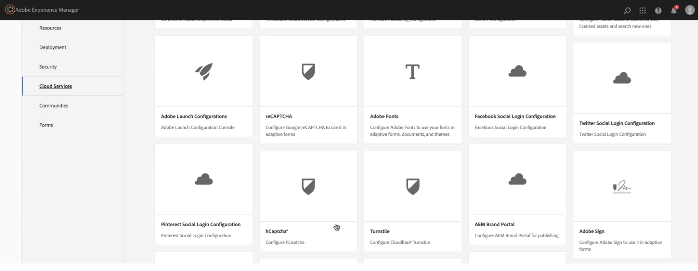
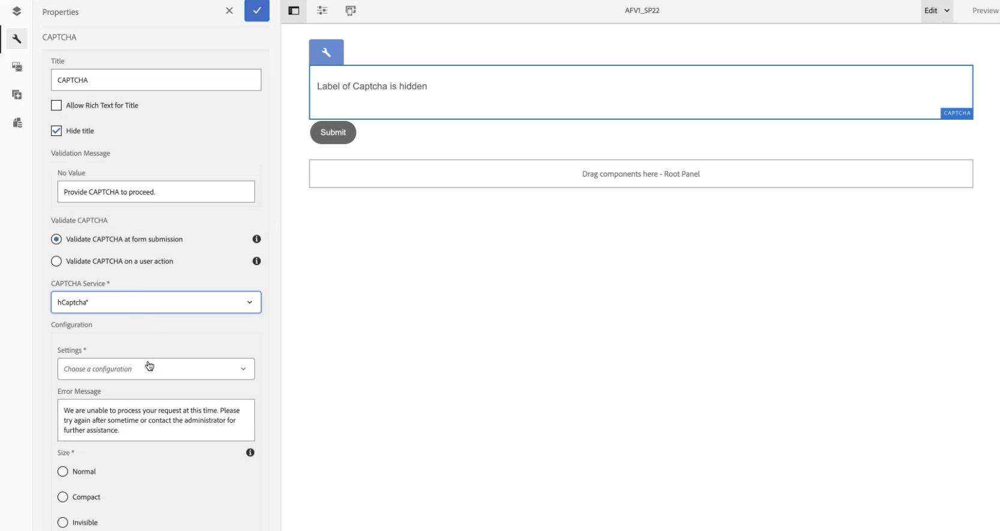

# Verbinden Ihrer AEM Forms-Umgebung mit hCaptcha® {#connect-your-forms-environment-with-hcaptcha-service}

Diese Funktion basiert auf der Feature Toggle-ID `FT_FORMS-12407`. Um die Funktion zu aktivieren, führen Sie die Schritte aus, die im Artikel [Feature-Umschalter aktivieren](/help/forms/using/enable-feature-toggle.md) beschrieben sind. 

CAPTCHA („Completely Automated Public Turing test to tell Computers and Humans Apart“ – „vollautomatischer öffentlicher Turing-Test zur Unterscheidung von Computern und Menschen“) ist ein Programm, das bei Onlinetransaktionen eingesetzt wird, um zwischen Menschen und Bots oder automatisierten Programmen zu unterscheiden. Es stellt eine herausfordernde Aufgabe und bewertet die Benutzerantwort, um festzustellen, ob es sich um einen Menschen oder einen Bot handelt, der mit der Site interagiert. Dabei wird verhindert, dass der Benutzer fortfährt, wenn der Test fehlschlägt, wodurch Onlinetransaktionen sicherer werden, da Bots keinen Spam senden oder andere bösartige Zwecke verfolgen können.

Zusätzlich zu hCAPTCHA® unterstützt AEM Forms 6.5 die folgenden CAPTCHA-Lösungen:

* [Google reCAPTCHA](/help/forms/using/captcha-adaptive-forms.md)
* [Cloudflare Turnstile](/help/forms/using/integrate-adaptive-forms-turnstile.md)

## Integrieren der AEM Forms-Umgebung mit hCaptcha®

Der hCaptcha®-Dienst schützt Ihre Formulare vor Bots, Spam und automatisiertem Missbrauch. Er führt einen Kontrollkästchen-Widget-Test durch und ermittelt anhand der Benutzerantwort, ob ein Mensch oder ein Bot mit dem Formular interagiert. Dabei wird verhindert, dass Benutzende fortfahren, wenn der Test fehlschlägt. Dies erhöht die Sicherheit von Online-Transaktionen, indem Bots keinen Spam senden oder andere bösartige Aktivitäten durchführen können.

Adaptive AEM 6.5-Formulare unterstützen hCAPTCHA®. Sie können es verwenden, um bei der Formularübermittlung eine Herausforderung mit einem Kontrollkästchen-Widget zu präsentieren.

<!-- -->

### Voraussetzungen für die Integration der AEM Forms-Umgebung mit hCaptcha® {#prerequisite}

Um hCAPTCHA® mit AEM Forms zu konfigurieren, müssen Sie den [hCAPTCHA®-Site-Schlüssel sowie den geheimen Schlüssel](https://docs.hcaptcha.com/switch/#get-your-hcaptcha-sitekey-and-secret-key) von der hCAPTCHA®-Website abrufen.

### Konfigurieren von hCaptcha® {#steps-to-configure-hcaptcha}

Um AEM Forms mit dem hCAPTCHA®-Service zu integrieren, führen Sie die folgenden Schritte aus:

1. Erstellen Sie einen Konfigurations-Container in Ihrer AEM Forms-Umgebung, der Cloud-Konfigurationen enthält, mit denen AEM mit externen Services verbunden wird. So erstellen Sie einen Konfigurations-Container:
   1. Öffnen Sie Ihre AEM Forms-Umgebung.
   1. Navigieren Sie zu **[!UICONTROL Tools > Allgemein > Konfigurations-Browser]**.
   1. Im Konfigurations-Browser können Sie einen vorhandenen Ordner auswählen oder einen neuen Ordner erstellen:
      * So erstellen Sie einen neuen Ordner und aktivieren die Cloud-Konfigurationen:
        1. Klicken Sie im Konfigurations-Browser auf **[!UICONTROL Erstellen]**.
        1. Geben Sie im Dialogfeld „Konfiguration erstellen“ einen Namen und einen Titel an und aktivieren Sie **[!UICONTROL Cloud-Konfigurationen]**.
        1. Klicken Sie auf **[!UICONTROL Erstellen]**.
      * So aktivieren Sie die Option „Cloud-Konfigurationen“ für einen vorhandenen Ordner:
        1. Wählen Sie im Konfigurations-Browser den Ordner aus und wählen Sie dann **[!UICONTROL Eigenschaften]**.
        1. Aktivieren Sie im Dialogfeld „Konfigurationseigenschaften“ die Option **[!UICONTROL Cloud-Konfigurationen]**.
        1. Wählen Sie **[!UICONTROL Speichern und schließen]** aus, um die Konfiguration zu speichern und das Dialogfeld zu schließen.

1. So konfigurieren Sie Ihre Cloud-Services:
   1. Navigieren Sie in Ihrer AEM-Autoreninstanz zu  > **[!UICONTROL Cloud-Services]** und klicken Sie auf **[!UICONTROL hCaptcha®]**.
      
   1. Wählen Sie einen erstellten oder aktualisierten Konfigurations-Container aus, wie im vorherigen Abschnitt beschrieben. Wählen Sie **[!UICONTROL Erstellen]** aus.
      
   1. Geben Sie einen **[!UICONTROL Titel]** an sowie den <!--**[!UICONTROL Name]**--> **[!UICONTROL Site-Schlüssel]** und den **[!UICONTROL geheimen Schlüssel]** für den hCaptcha®-Service [an, die Sie beide gemäß der obigen Voraussetzung abgerufen haben](#prerequisite).
   1. Klicken Sie auf **[!UICONTROL Erstellen]**.

      

   >[!NOTE]
   > Benutzende brauchen die [Client-seitige JavaScript-Validierungs-URL](https://docs.hcaptcha.com/#add-the-hcaptcha-widget-to-your-webpage) und die [Server-seitige Validierungs-URL](https://docs.hcaptcha.com/#verify-the-user-response-server-side) nicht zu ändern, da sie bereits für die hCaptcha®-Validierung vorausgefüllt sind.

   Sobald der hCAPTCHA-Service konfiguriert ist, kann er in Ihrem adaptiven Formular verwendet werden.

## Verwenden von hCaptcha® in einem adaptiven Formular {#using-hCaptcha-in-aem-6.5}

1. Öffnen Sie Ihre AEM Forms-Umgebung.
1. Navigieren Sie zu **[!UICONTROL Formulare]** > **[!UICONTROL Formulare und Dokumente]**.
1. Wählen Sie ein adaptives Formular aus und klicken Sie auf **[!UICONTROL Eigenschaften]**.
1. Wählen Sie im **[!UICONTROL Konfigurations-Container]** den Konfigurations-Container aus, der die Cloud-Konfiguration enthält, die AEM Forms mit hCaptcha verbindet.
1. Klicken Sie auf **[!UICONTROL Speichern und schließen]**.

   Wenn Sie keinen Konfigurations-Container für hCaptcha haben, lesen Sie den Abschnitt [Verbinden Ihrer AEM Forms-Umgebung mit hCaptcha®](#configure-hcaptcha-steps-to-configure-hcaptcha), um zu erfahren, wie Sie einen solchen Konfigurations-Container erstellen können.

   

1. Wählen Sie ein adaptives Formular aus und klicken Sie auf **[!UICONTROL Bearbeiten]**, um das Formular im Editor zu öffnen.
1. Ziehen Sie die **[!UICONTROL Captcha]**-Komponente im Komponenten-Browser in das adaptive Formular und legen Sie sie dort ab.
1. Wählen Sie die **[!UICONTROL Captcha]**-Komponente aus und klicken Sie auf „Eigenschaften“ , um das Eigenschaften-Dialogfeld zu öffnen. Geben Sie die folgenden Eigenschaften an:

   

   * **[!UICONTROL Titel]:** Geben Sie den Titel für die Captcha-Komponente an.
   * **[!UICONTROL Validierungsmeldung]:** Geben Sie eine Validierungsmeldung für Ihre Captcha-Validierung bei der Formularübermittlung oder bei einer Benutzeraktion ein.
   * **[!UICONTROL Captcha-Service]:** Wählen Sie den CAPTCHA-Service für Ihre Formularübermittlung aus. Hier wählen Sie hCaptcha®.
   * **[!UICONTROL Konfigurationseinstellungen]:** Wählen Sie Ihre für hCaptcha® konfigurierte Cloud-Konfiguration aus.
     >[!NOTE]
     >Es kann sein, dass Sie für ähnliche Zwecke über mehrere Cloud-Konfigurationen in Ihrer Umgebung verfügen. Wählen Sie den Service daher sorgfältig aus. Wenn kein Service aufgeführt ist, lesen Sie unter [Verbinden Ihrer AEM Forms-Umgebung mit hCaptcha®](#connect-your-forms-environment-with-hcaptcha-service) nach, wie Sie einen Cloud-Service erstellen, der Ihre AEM Forms-Umgebung mit dem hCaptcha®-Service verbindet.

   * **[!UICONTROL Fehlermeldung]:** Geben Sie die Fehlermeldung an, die Benutzenden angezeigt werden soll, wenn die Captcha-Übermittlung fehlschlägt.
   * **[!UICONTROL Captcha-Größe]:** Sie können die Anzeigegröße des hCaptcha®-Challenge-Dialogfelds auswählen. Verwenden Sie die Option **[!UICONTROL Compact]**, um ein kleines hCaptcha®-Challenge-Dialogfeld anzuzeigen, die Option **[!UICONTROL Normal]**, um ein relativ großes hCaptcha®-Challenge-Dialogfeld anzuzeigen, oder die Option **[!UICONTROL Unsichtbar]**, um hCaptcha® zu validieren, ohne das Kontrollkästchen-Widget auf der Benutzeroberfläche explizit zu rendern.

1. Wählen Sie **[!UICONTROL Fertig]** aus.

Jetzt sind nur legitime Formulare zur Übermittlung zulässig, bei denen die Person, die das Formular ausfüllt, die vom hCaptcha®-Service ausgehende Herausforderung erfolgreich löst.

**hCaptcha® ist eine eingetragene Marke von Intuition Machines, Inc.**

## Häufig gestellte Fragen

* **F: Kann ich mehr als eine Captcha-Komponente in einem adaptiven Formular verwenden?**
* **Antwort:** Die Verwendung von mehr als einer Captcha-Komponente in einem adaptiven Formular wird nicht unterstützt. Außerdem wird davon abgeraten, eine Captcha-Komponente in einem Fragment oder einem Bereich zu verwenden, das bzw. der für verzögertes Laden markiert ist.

## Siehe auch {#see-also}

* [Verwenden von CAPTCHA in adaptiven Formularen](/help/forms/using/captcha-adaptive-forms.md)
* [Verwenden von Turnstile Captcha in adaptiven Formularen](/help/forms/using/integrate-adaptive-forms-turnstile.md)
